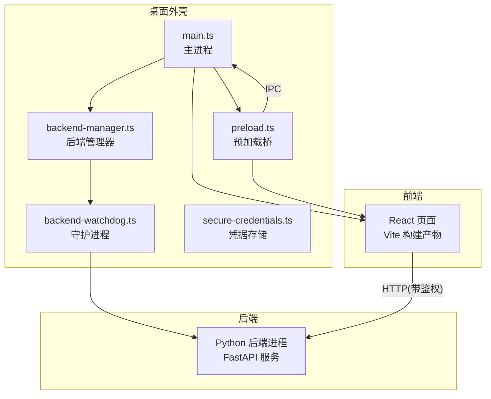
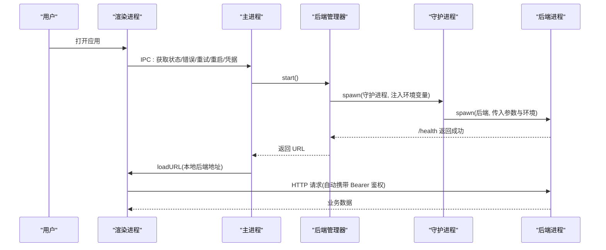
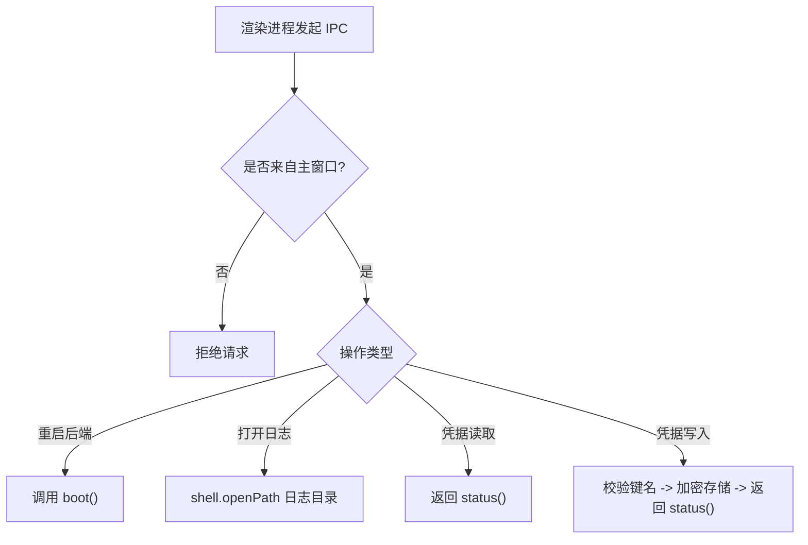
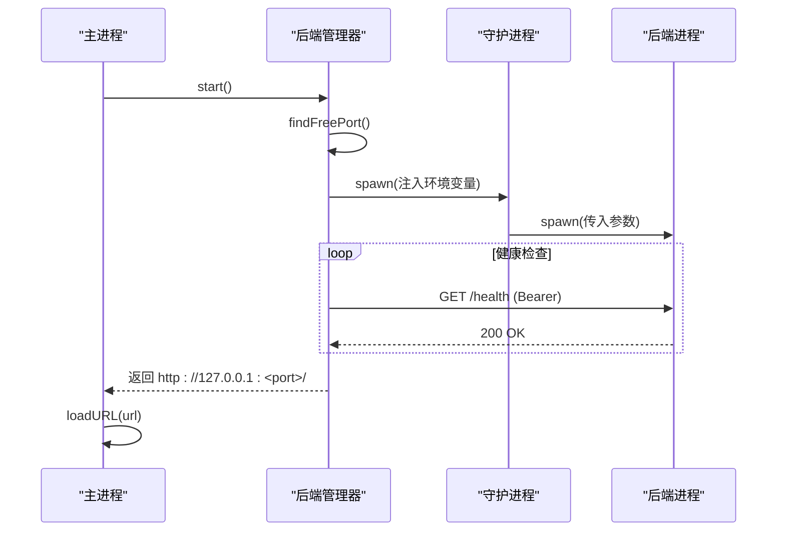
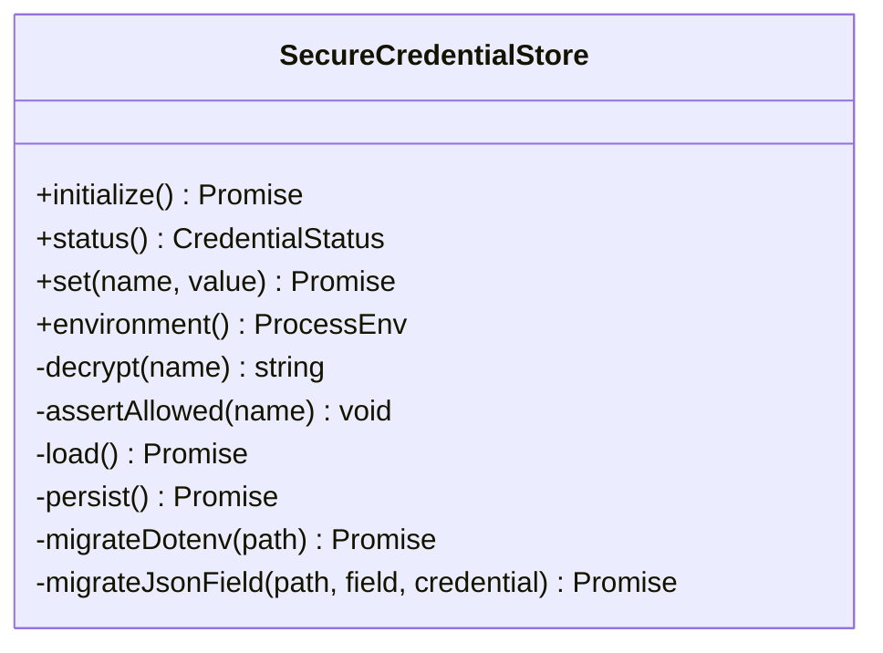
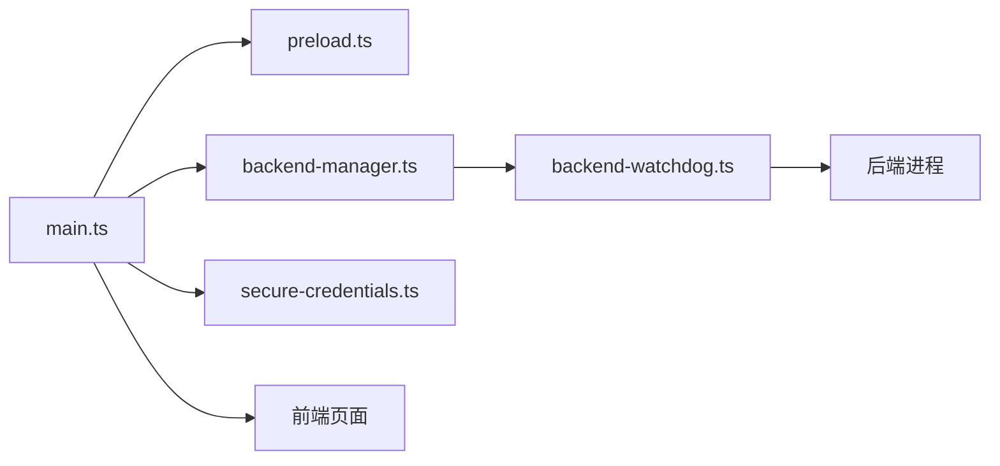

# 桌面应用

<cite>
**本文引用的文件**
- [desktop/electron/package.json](file://desktop/electron/package.json)
- [desktop/electron/README.md](file://desktop/electron/README.md)
- [desktop/electron/THREAT_MODEL.md](file://desktop/electron/THREAT_MODEL.md)
- [desktop/electron/WINDOWS_PACKAGING.md](file://desktop/electron/WINDOWS_PACKAGING.md)
- [desktop/electron/src/main.ts](file://desktop/electron/src/main.ts)
- [desktop/electron/src/preload.ts](file://desktop/electron/src/preload.ts)
- [desktop/electron/src/backend-manager.ts](file://desktop/electron/src/backend-manager.ts)
- [desktop/electron/src/backend-watchdog.ts](file://desktop/electron/src/backend-watchdog.ts)
- [desktop/electron/src/secure-credentials.ts](file://desktop/electron/src/secure-credentials.ts)
- [frontend/package.json](file://frontend/package.json)
- [README.md](file://README.md)
</cite>

## 目录
1. [简介](#简介)
2. [项目结构](#项目结构)
3. [核心组件](#核心组件)
4. [架构总览](#架构总览)
5. [详细组件分析](#详细组件分析)
6. [依赖关系分析](#依赖关系分析)
7. [性能考虑](#性能考虑)
8. [故障排查指南](#故障排查指南)
9. [结论](#结论)
10. [附录](#附录)

## 简介
本项目包含一个基于 Electron 的桌面外壳，负责启动、守护并安全地与内置后端（FastAPI）进程通信，同时加载前端 React 页面。桌面层实现了主进程与渲染进程的严格隔离、本地凭据加密存储、单实例运行、端口分配、健康检查、日志收集、菜单与国际化等能力；并通过受控 IPC 暴露最小能力集给渲染进程。打包侧提供 Windows NSIS 安装器构建流程，支持签名校验与可复现的嵌入运行时。

## 项目结构
- desktop/electron：Electron 主进程、预加载脚本、后端管理、守护进程、凭据存储、构建与打包配置
- frontend：React + Vite 前端工程，由 Electron 加载为本地 UI
- agent：后端 Python 服务与 CLI（被 Electron 以子进程方式启动）
- 其他：CI、文档、工具脚本等

图表来源
- [desktop/electron/src/main.ts:65-117](file://desktop/electron/src/main.ts#L65-L117)
- [desktop/electron/src/backend-manager.ts:63-146](file://desktop/electron/src/backend-manager.ts#L63-L146)
- [desktop/electron/src/backend-watchdog.ts:31-68](file://desktop/electron/src/backend-watchdog.ts#L31-L68)
- [desktop/electron/src/preload.ts:3-17](file://desktop/electron/src/preload.ts#L3-L17)

章节来源
- [desktop/electron/README.md:11-35](file://desktop/electron/README.md#L11-L35)
- [desktop/electron/package.json:9-22](file://desktop/electron/package.json#L9-L22)

## 核心组件
- 主进程 main.ts：窗口创建、权限控制、导航限制、IPC 注册、菜单、国际化、错误上报、重启与关闭流程
- 预加载 preload.ts：向渲染进程暴露最小 API（状态、错误、重试、打开日志、重启后端、凭据读写）
- 后端管理器 backend-manager.ts：解析后端可执行、选择空闲端口、注入环境变量、启动守护进程、健康轮询、日志捕获、优雅关闭
- 守护进程 backend-watchdog.ts：验证父进程存活、启动后端、监控退出、按原因终止进程树、与主进程 IPC 通信
- 凭据存储 secure-credentials.ts：使用 safeStorage 加密存储允许列表中的密钥，迁移旧明文配置，生成仅注入后端的解密环境
- 打包配置 package.json：构建脚本、asar、多语言、extraResources、NSIS 安装器选项

章节来源
- [desktop/electron/src/main.ts:22-63](file://desktop/electron/src/main.ts#L22-L63)
- [desktop/electron/src/preload.ts:3-17](file://desktop/electron/src/preload.ts#L3-L17)
- [desktop/electron/src/backend-manager.ts:16-41](file://desktop/electron/src/backend-manager.ts#L16-L41)
- [desktop/electron/src/backend-watchdog.ts:1-36](file://desktop/electron/src/backend-watchdog.ts#L1-L36)
- [desktop/electron/src/secure-credentials.ts:68-123](file://desktop/electron/src/secure-credentials.ts#L68-L123)
- [desktop/electron/package.json:33-87](file://desktop/electron/package.json#L33-L87)

## 架构总览
桌面应用采用“主进程 + 沙箱渲染进程 + 独立后端进程”的三层架构：
- 主进程拥有随机 API 密钥、safeStorage 加解密、后端可执行发现与启动、对同源请求自动注入 Authorization
- 渲染进程在沙箱中运行，无 Node.js，禁用默认权限，仅能通过预加载暴露的 IPC 调用受限能力
- 后端通过 127.0.0.1 绑定随机端口，接收 API_AUTH_KEY 与解密后的凭据，对外提供 FastAPI 接口

图表来源
- [desktop/electron/src/main.ts:119-146](file://desktop/electron/src/main.ts#L119-L146)
- [desktop/electron/src/backend-manager.ts:63-146](file://desktop/electron/src/backend-manager.ts#L63-L146)
- [desktop/electron/src/backend-watchdog.ts:31-68](file://desktop/electron/src/backend-watchdog.ts#L31-L68)
- [desktop/electron/src/preload.ts:3-17](file://desktop/electron/src/preload.ts#L3-L17)

## 详细组件分析

### 主进程与渲染进程分离、IPC 与事件处理
- 主进程创建 BrowserWindow，启用 contextIsolation、sandbox、禁用 nodeIntegration，设置独立 partition，拒绝所有浏览器权限请求，限制导航到本地后端同源地址，外部链接使用系统浏览器打开
- 预加载通过 contextBridge 暴露最小 API：onStatus/onError/retry/openLogs/restartBackend/getCredentialStatus/setCredential
- 主进程注册 IPC 处理器，校验发送者为当前主窗口，执行对应操作（重启后端、打开日志、凭据读写），并将状态与错误事件推送给渲染进程

图表来源
- [desktop/electron/src/main.ts:119-146](file://desktop/electron/src/main.ts#L119-L146)
- [desktop/electron/src/preload.ts:3-17](file://desktop/electron/src/preload.ts#L3-L17)

章节来源
- [desktop/electron/src/main.ts:65-117](file://desktop/electron/src/main.ts#L65-L117)
- [desktop/electron/src/main.ts:119-146](file://desktop/electron/src/main.ts#L119-L146)
- [desktop/electron/src/preload.ts:3-17](file://desktop/electron/src/preload.ts#L3-L17)

### 后端集成：进程管理、端口分配、通信协议
- 后端可执行解析优先级：环境变量覆盖 > 打包资源路径 > 源码模式标记根 .venv > PATH 查找
- 每次启动选择 127.0.0.1 上的空闲端口，注入 API_AUTH_KEY、VIBE_TRADING_DESKTOP_SECURE_CREDENTIALS、PYTHONUTF8/PYTHONUNBUFFERED、父进程 PID、后端可执行与参数等环境变量
- 通过守护进程启动后端，等待 /health 成功后再加载 UI
- 关闭时先尝试 POST system/shutdown，再通知守护进程终止，最后必要时 taskkill 进程树

图表来源
- [desktop/electron/src/backend-manager.ts:63-146](file://desktop/electron/src/backend-manager.ts#L63-L146)
- [desktop/electron/src/backend-manager.ts:310-411](file://desktop/electron/src/backend-manager.ts#L310-L411)
- [desktop/electron/src/backend-manager.ts:413-429](file://desktop/electron/src/backend-manager.ts#L413-L429)

章节来源
- [desktop/electron/src/backend-manager.ts:63-146](file://desktop/electron/src/backend-manager.ts#L63-L146)
- [desktop/electron/src/backend-manager.ts:310-411](file://desktop/electron/src/backend-manager.ts#L310-L411)
- [desktop/electron/src/backend-manager.ts:413-429](file://desktop/electron/src/backend-manager.ts#L413-L429)

### 安全机制：凭据加密、沙箱隔离、权限控制
- 渲染进程沙箱：contextIsolation、sandbox、nodeIntegration=false，默认拒绝所有权限，限制导航至同源后端，外部链接走系统浏览器
- 会话隔离：使用持久化 partition，避免与默认浏览器会话共享 Cookie/缓存
- 鉴权：主进程为同源请求自动添加 Authorization: Bearer <随机密钥>，密钥仅在内存与子进程环境中存在，不写盘
- 凭据存储：仅允许白名单键名，使用 safeStorage 加密/解密，写入临时文件后原子重命名，首次启动迁移旧明文配置并删除明文字段
- 进程边界：守护进程检查父进程存活，断开或异常时终止后端进程树，防止孤儿进程泄露敏感信息

图表来源
- [desktop/electron/src/secure-credentials.ts:68-123](file://desktop/electron/src/secure-credentials.ts#L68-L123)
- [desktop/electron/src/secure-credentials.ts:139-219](file://desktop/electron/src/secure-credentials.ts#L139-L219)

章节来源
- [desktop/electron/src/main.ts:76-98](file://desktop/electron/src/main.ts#L76-L98)
- [desktop/electron/src/secure-credentials.ts:12-44](file://desktop/electron/src/secure-credentials.ts#L12-L44)
- [desktop/electron/THREAT_MODEL.md:60-88](file://desktop/electron/THREAT_MODEL.md#L60-L88)

### 打包与分发：跨平台构建、签名验证、自动更新
- 构建脚本：TypeScript 编译、复制静态资源、准备 Electron 环境、Windows 后端构建、Smoke 测试、打包与安装器生成
- 打包产物：asar、extraResources 包含后端运行时、许可证与声明、输出目录 release
- Windows 安装器：NSIS x64，支持审查用未签名与签名两种流程；签名命令强制校验证书输入并验证 Authenticode 状态
- 自动更新：本仓库不包含更新检查或发布通道；如需扩展可在主进程增加更新逻辑并在安全边界内执行

章节来源
- [desktop/electron/package.json:9-22](file://desktop/electron/package.json#L9-L22)
- [desktop/electron/package.json:33-87](file://desktop/electron/package.json#L33-L87)
- [desktop/electron/WINDOWS_PACKAGING.md:23-50](file://desktop/electron/WINDOWS_PACKAGING.md#L23-L50)
- [desktop/electron/WINDOWS_PACKAGING.md:88-110](file://desktop/electron/WINDOWS_PACKAGING.md#L88-L110)
- [desktop/electron/README.md:99-114](file://desktop/electron/README.md#L99-L114)

### 开发环境配置：调试、热重载、日志
- 开发模式：在主进程中根据 app.isPackaged 决定是否启用开发者工具
- 日志：主进程将后端 stdout/stderr 追加到 per-user 日志目录，文件名含日期；菜单提供“打开日志”入口
- 前端：使用 Vite 构建与预览，Node 版本要求见前端包配置
- 本地运行：从完整仓库安装后端、构建前端、进入 electron 目录执行 start

章节来源
- [desktop/electron/src/main.ts:76-83](file://desktop/electron/src/main.ts#L76-L83)
- [desktop/electron/src/backend-manager.ts:94-100](file://desktop/electron/src/backend-manager.ts#L94-L100)
- [desktop/electron/src/main.ts:212-237](file://desktop/electron/src/main.ts#L212-L237)
- [frontend/package.json:6-15](file://frontend/package.json#L6-L15)
- [desktop/electron/README.md:37-58](file://desktop/electron/README.md#L37-L58)

### 实际开发示例：从基础窗口到复杂功能
- 基础窗口：创建 BrowserWindow，设置尺寸、主题、预加载、安全偏好、隐藏菜单栏、延迟显示
- 生命周期：单实例锁、second-instance 聚焦窗口、close 事件拦截并触发优雅关闭、window-all-closed 退出
- 菜单与国际化：应用菜单项绑定本地化消息，提供重启服务、打开日志、缩放、全屏等
- 复杂功能：后端启动与健康检查、凭据读写、错误上报、重试、日志目录打开、外部链接安全打开

章节来源
- [desktop/electron/src/main.ts:33-63](file://desktop/electron/src/main.ts#L33-L63)
- [desktop/electron/src/main.ts:65-117](file://desktop/electron/src/main.ts#L65-L117)
- [desktop/electron/src/main.ts:148-192](file://desktop/electron/src/main.ts#L148-L192)
- [desktop/electron/src/main.ts:212-237](file://desktop/electron/src/main.ts#L212-L237)

## 依赖关系分析
- 主进程依赖：Electron API、后端管理器、本地化、凭据存储
- 后端管理器依赖：文件系统、网络端口探测、子进程管理、日志流
- 守护进程依赖：子进程管理、信号处理、进程树终止
- 凭据存储依赖：safeStorage、文件系统原子写入、JSON 解析与迁移
- 前端依赖：React、Vite、i18n、图表库等

图表来源
- [desktop/electron/src/main.ts:13-20](file://desktop/electron/src/main.ts#L13-L20)
- [desktop/electron/src/backend-manager.ts:1-14](file://desktop/electron/src/backend-manager.ts#L1-L14)
- [desktop/electron/src/backend-watchdog.ts:1-12](file://desktop/electron/src/backend-watchdog.ts#L1-L12)
- [desktop/electron/src/secure-credentials.ts:1-5](file://desktop/electron/src/secure-credentials.ts#L1-L5)

章节来源
- [desktop/electron/src/main.ts:1-21](file://desktop/electron/src/main.ts#L1-L21)
- [desktop/electron/src/backend-manager.ts:1-41](file://desktop/electron/src/backend-manager.ts#L1-L41)
- [desktop/electron/src/backend-watchdog.ts:1-36](file://desktop/electron/src/backend-watchdog.ts#L1-L36)
- [desktop/electron/src/secure-credentials.ts:1-67](file://desktop/electron/src/secure-credentials.ts#L1-L67)

## 性能考虑
- 内存管理：避免在渲染进程持有大对象；后端日志只保留最近若干行用于错误上下文
- 资源加载：首次加载 loading.html，后端就绪后才切换 URL，减少首屏阻塞
- 渲染优化：禁用不必要的 devTools 在生产包中；使用独立 partition 隔离缓存
- 网络与 I/O：健康检查使用短超时与重试；日志异步追加；凭据写入使用临时文件+rename 保证一致性
- 进程管理：守护进程定期检查父进程存活，避免僵尸进程占用资源

[本节为通用指导，无需特定文件引用]

## 故障排查指南
- 启动失败：查看主进程错误弹窗与日志目录；确认后端健康检查超时与早期退出信息
- 后端意外退出：守护进程会报告退出码/信号；检查环境变量与可执行解析路径
- 凭据问题：确认 safeStorage 可用、键名在白名单、迁移完成且明文已移除
- 权限与导航：确认同源限制生效、外部链接通过系统浏览器打开
- 关闭流程：若后端未响应，主进程会通知守护进程终止并 fallback 到进程树终止

章节来源
- [desktop/electron/src/main.ts:206-210](file://desktop/electron/src/main.ts#L206-L210)
- [desktop/electron/src/backend-manager.ts:261-286](file://desktop/electron/src/backend-manager.ts#L261-L286)
- [desktop/electron/src/backend-manager.ts:148-187](file://desktop/electron/src/backend-manager.ts#L148-L187)
- [desktop/electron/src/secure-credentials.ts:84-95](file://desktop/electron/src/secure-credentials.ts#L84-L95)

## 结论
该桌面应用通过严格的进程边界与安全策略，将 Electron 主进程、沙箱渲染进程与后端 Python 服务解耦，提供了安全的凭据管理、稳定的进程生命周期、清晰的 IPC 接口与完善的打包分发流程。对于开发者而言，遵循最小暴露原则、利用健康检查与日志、以及谨慎处理凭据与权限，是构建可靠桌面应用的关键。

[本节为总结性内容，无需特定文件引用]

## 附录
- 威胁模型与信任边界详见 THREAT_MODEL.md
- Windows 打包与签名流程详见 WINDOWS_PACKAGING.md
- 快速开始与本地运行步骤详见 README.md

章节来源
- [desktop/electron/THREAT_MODEL.md:1-44](file://desktop/electron/THREAT_MODEL.md#L1-L44)
- [desktop/electron/WINDOWS_PACKAGING.md:23-50](file://desktop/electron/WINDOWS_PACKAGING.md#L23-L50)
- [desktop/electron/README.md:37-58](file://desktop/electron/README.md#L37-L58)