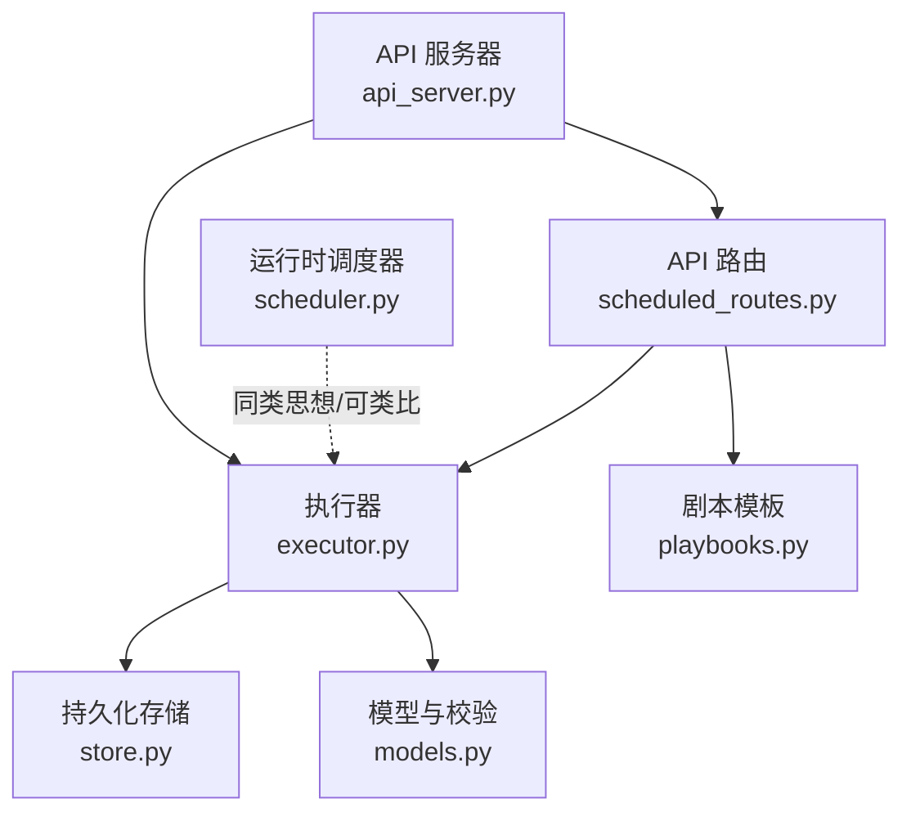
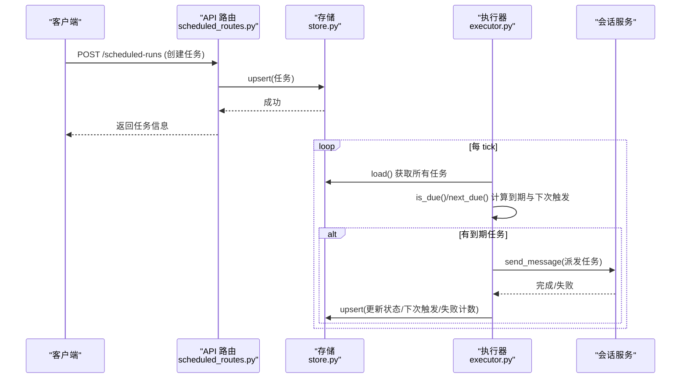
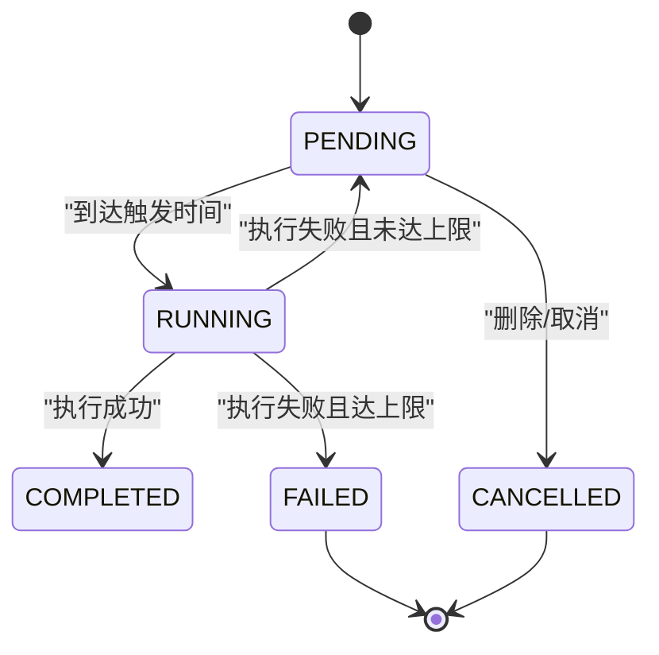
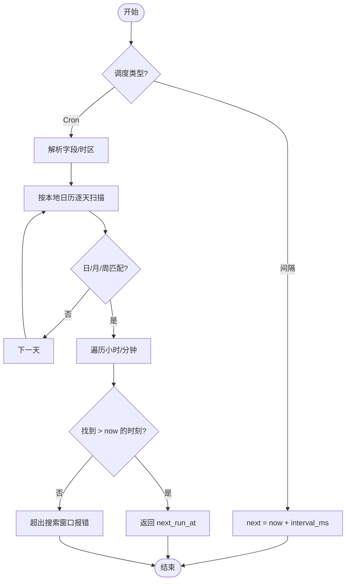
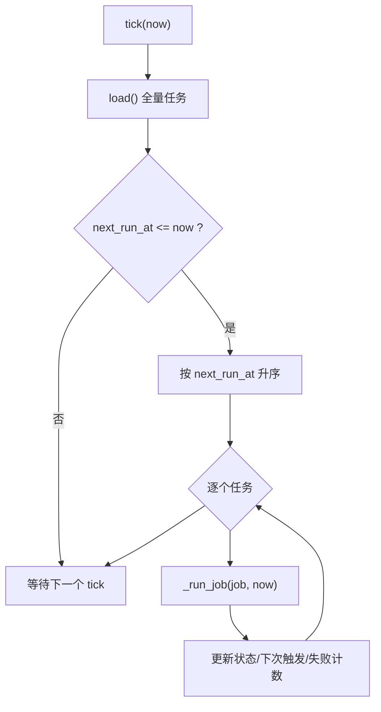
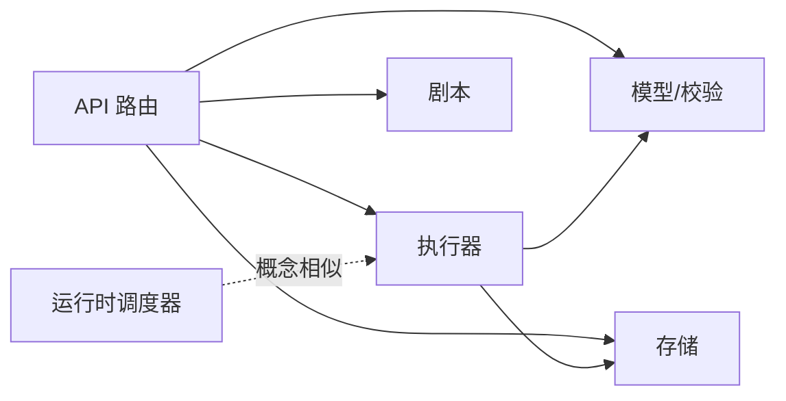

# 任务调度器

<cite>
**本文引用的文件**
- [agent/src/api/scheduled_routes.py](file://agent/src/api/scheduled_routes.py)
- [agent/src/scheduled_research/executor.py](file://agent/src/scheduled_research/executor.py)
- [agent/src/scheduled_research/models.py](file://agent/src/scheduled_research/models.py)
- [agent/src/scheduled_research/store.py](file://agent/src/scheduled_research/store.py)
- [agent/src/scheduled_research/playbooks.py](file://agent/src/scheduled_research/playbooks.py)
- [agent/src/live/runtime/scheduler.py](file://agent/src/live/runtime/scheduler.py)
- [agent/api_server.py](file://agent/api_server.py)
</cite>

## 目录
1. [简介](#简介)
2. [项目结构](#项目结构)
3. [核心组件](#核心组件)
4. [架构总览](#架构总览)
5. [详细组件分析](#详细组件分析)
6. [依赖关系分析](#依赖关系分析)
7. [性能与并发](#性能与并发)
8. [故障排查指南](#故障排查指南)
9. [结论](#结论)
10. [附录：常见调度场景配置示例](#附录常见调度场景配置示例)

## 简介
本技术文档面向运维人员与研究人员，系统化说明 Vibe-Trading 中的“任务调度器”能力，覆盖定时任务的执行机制、生命周期管理、调度策略（cron/间隔）、优先级与资源分配、队列与并发控制、负载均衡、监控与日志，以及典型调度场景的配置方法。系统包含两套调度实现：
- 持久化研究任务调度器：基于 JSON 存储的“计划研究”任务，支持 cron 表达式与毫秒级间隔，具备失败重试、状态追踪、模板化剧本等能力。
- 运行时墙钟调度器：用于实时运行时的轻量定时器，按 next_run_at 驱动任务触发与推进。

## 项目结构
与任务调度相关的核心代码集中在 agent/src 下的 scheduled_research 与 live/runtime 模块，并通过 API 层暴露 REST 接口，由 api_server 在启动时装配并启停调度器。

图表来源
- [agent/src/api/scheduled_routes.py:233-482](file://agent/src/api/scheduled_routes.py#L233-L482)
- [agent/src/scheduled_research/executor.py:160-452](file://agent/src/scheduled_research/executor.py#L160-L452)
- [agent/src/scheduled_research/store.py:59-273](file://agent/src/scheduled_research/store.py#L59-L273)
- [agent/src/scheduled_research/models.py:177-328](file://agent/src/scheduled_research/models.py#L177-L328)
- [agent/src/scheduled_research/playbooks.py:79-212](file://agent/src/scheduled_research/playbooks.py#L79-L212)
- [agent/src/live/runtime/scheduler.py:178-329](file://agent/src/live/runtime/scheduler.py#L178-L329)
- [agent/api_server.py:127-160](file://agent/api_server.py#L127-L160)

章节来源
- [agent/src/api/scheduled_routes.py:233-482](file://agent/src/api/scheduled_routes.py#L233-L482)
- [agent/src/scheduled_research/executor.py:160-452](file://agent/src/scheduled_research/executor.py#L160-L452)
- [agent/src/scheduled_research/store.py:59-273](file://agent/src/scheduled_research/store.py#L59-L273)
- [agent/src/scheduled_research/models.py:177-328](file://agent/src/scheduled_research/models.py#L177-L328)
- [agent/src/scheduled_research/playbooks.py:79-212](file://agent/src/scheduled_research/playbooks.py#L79-L212)
- [agent/src/live/runtime/scheduler.py:178-329](file://agent/src/live/runtime/scheduler.py#L178-L329)
- [agent/api_server.py:127-160](file://agent/api_server.py#L127-L160)

## 核心组件
- 调度入口与路由：提供创建、查询、删除计划任务，以及从剧本模板创建任务的 REST API。
- 执行器：后台轮询已到期任务，分发到会话服务执行，维护任务状态、下次触发时间、失败重试与错误记录。
- 数据模型：定义任务实体、状态枚举、调度语法校验（cron/间隔）与时区校验。
- 持久化存储：原子写入 JSON 文件，崩溃安全，支持加载、保存、增删改查。
- 剧本模板：以 Markdown + YAML frontmatter 描述可复用任务模板，支持变量替换与默认调度建议。
- 运行时调度器：内存中按 next_run_at 驱动任务触发的通用定时器，体现“最小唤醒、及时重入”的设计。

章节来源
- [agent/src/api/scheduled_routes.py:233-482](file://agent/src/api/scheduled_routes.py#L233-L482)
- [agent/src/scheduled_research/executor.py:160-452](file://agent/src/scheduled_research/executor.py#L160-L452)
- [agent/src/scheduled_research/models.py:177-328](file://agent/src/scheduled_research/models.py#L177-L328)
- [agent/src/scheduled_research/store.py:59-273](file://agent/src/scheduled_research/store.py#L59-L273)
- [agent/src/scheduled_research/playbooks.py:79-212](file://agent/src/scheduled_research/playbooks.py#L79-L212)
- [agent/src/live/runtime/scheduler.py:178-329](file://agent/src/live/runtime/scheduler.py#L178-L329)

## 架构总览
下图展示了从 API 创建任务到执行器调度执行的完整链路，包括状态流转与持久化。

图表来源
- [agent/src/api/scheduled_routes.py:259-335](file://agent/src/api/scheduled_routes.py#L259-L335)
- [agent/src/scheduled_research/executor.py:266-415](file://agent/src/scheduled_research/executor.py#L266-L415)
- [agent/src/scheduled_research/store.py:138-166](file://agent/src/scheduled_research/store.py#L138-L166)

## 详细组件分析

### 任务注册与生命周期管理
- 任务创建：通过 POST /scheduled-runs 或从剧本模板创建，支持 cron 或间隔调度；若带时区的 cron，首次触发按首个符合的时间点计算。
- 状态机：PENDING → RUNNING → COMPLETED/FAILED；CANCELLED 为终态；失败达到上限后进入 FAILED。
- 生命周期钩子：
  - 创建时：校验 schedule/timezone，计算 next_run_at，持久化为 PENDING。
  - 执行前：恢复历史残留 RUNNING 状态为 PENDING，避免僵尸任务。
  - 执行中：标记 RUNNING，派发至会话服务；完成后根据结果更新状态、失败计数、last_error、failure_kind 与 next_run_at。
  - 失败重试：指数退避，受最大连续失败次数限制。

图表来源
- [agent/src/scheduled_research/models.py:184-191](file://agent/src/scheduled_research/models.py#L184-L191)
- [agent/src/scheduled_research/executor.py:367-389](file://agent/src/scheduled_research/executor.py#L367-L389)
- [agent/src/scheduled_research/executor.py:340-415](file://agent/src/scheduled_research/executor.py#L340-L415)

章节来源
- [agent/src/api/scheduled_routes.py:259-335](file://agent/src/api/scheduled_routes.py#L259-L335)
- [agent/src/scheduled_research/executor.py:266-415](file://agent/src/scheduled_research/executor.py#L266-L415)
- [agent/src/scheduled_research/models.py:182-328](file://agent/src/scheduled_research/models.py#L182-L328)

### 调度算法与时间触发器
- 支持两种调度格式：
  - 间隔调度：正整数毫秒字符串，简单加法推进 next_run_at。
  - Cron 调度：简化五字段 cron（分钟、小时、日、月、周），支持 *、*/n、逗号分隔与范围。
- 时区处理：cron 使用 IANA 时区键评估；DST 不存在时刻跳过，重叠时刻取第一次出现。
- 下次触发计算：
  - 间隔：after_ms + interval。
  - cron：按本地日历逐天扫描，匹配日月周后遍历小时/分钟，找到严格大于 after_ms 的最小时刻。
- 搜索窗口：最多扫描约六年（含闰年与 DST 偏移余量），避免长时间无匹配导致死循环。

图表来源
- [agent/src/scheduled_research/executor.py:123-193](file://agent/src/scheduled_research/executor.py#L123-L193)
- [agent/src/scheduled_research/models.py:27-42](file://agent/src/scheduled_research/models.py#L27-L42)
- [agent/src/scheduled_research/models.py:69-139](file://agent/src/scheduled_research/models.py#L69-L139)

章节来源
- [agent/src/scheduled_research/executor.py:123-193](file://agent/src/scheduled_research/executor.py#L123-L193)
- [agent/src/scheduled_research/models.py:27-139](file://agent/src/scheduled_research/models.py#L27-L139)

### 任务队列管理与并发控制
- 队列模型：内存快照 + 磁盘持久化的任务集合；每次 tick 读取全部任务，筛选到期并按 next_run_at 排序。
- 并发控制：当前执行器串行处理每个到期任务，避免同一 tick 内多个任务抢占资源；单个任务派发期间不阻塞其他 tick。
- 健壮性：
  - 恢复残留 RUNNING 任务为 PENDING，防止进程重启后卡死。
  - 派发异常记录 last_error/failure_kind，并递增 consecutive_failures。
  - 超过最大连续失败次数则置为 FAILED，停止自动重试。

图表来源
- [agent/src/scheduled_research/executor.py:266-323](file://agent/src/scheduled_research/executor.py#L266-L323)
- [agent/src/scheduled_research/store.py:85-116](file://agent/src/scheduled_research/store.py#L85-L116)

章节来源
- [agent/src/scheduled_research/executor.py:266-323](file://agent/src/scheduled_research/executor.py#L266-L323)
- [agent/src/scheduled_research/store.py:85-116](file://agent/src/scheduled_research/store.py#L85-L116)

### 优先级管理与资源分配
- 优先级：按 next_run_at 升序执行，等价于“最早到期优先”，保证按时触发。
- 资源分配：执行器串行派发，适合 CPU/IO 密集型研究任务；如需更高吞吐，可在上层对 _dispatch 进行限流或并行化封装。
- 可扩展点：可通过注入不同的 dispatch 回调实现多队列或多实例负载均衡。

章节来源
- [agent/src/scheduled_research/executor.py:266-323](file://agent/src/scheduled_research/executor.py#L266-L323)

### 监控与日志记录
- 关键日志：
  - 任务派发、完成、失败、恢复残留 RUNNING、调度推进失败等。
  - 错误消息经脱敏与长度截断后持久化，避免敏感信息与超大日志影响存储。
- 监控指标建议（结合现有日志）：
  - 任务数（按状态分组）。
  - 最近失败率、平均重试次数。
  - 调度推进耗时（可通过埋点扩展）。
- 查看方式：通过 API 列出任务状态与错误信息；或通过系统日志检索关键词。

章节来源
- [agent/src/scheduled_research/executor.py:114-120](file://agent/src/scheduled_research/executor.py#L114-L120)
- [agent/src/scheduled_research/executor.py:340-415](file://agent/src/scheduled_research/executor.py#L340-L415)

### 剧本模板与任务生成
- 模板结构：Markdown + YAML frontmatter，声明名称、描述、建议调度、市场、数据能力、变量等。
- 变量替换：支持 {{var}} 占位符，变量名需预先声明，值有长度上限。
- 任务生成：from playbook 创建任务时复用与主路径一致的 schedule/timezone 校验逻辑，确保一致性。

章节来源
- [agent/src/scheduled_research/playbooks.py:79-212](file://agent/src/scheduled_research/playbooks.py#L79-L212)
- [agent/src/scheduled_research/playbooks.py:250-330](file://agent/src/scheduled_research/playbooks.py#L250-L330)
- [agent/src/api/scheduled_routes.py:375-482](file://agent/src/api/scheduled_routes.py#L375-L482)

## 依赖关系分析
- API 路由依赖：
  - 模型与校验：models.py
  - 存储：store.py
  - 执行器：executor.py
  - 剧本：playbooks.py
- 执行器依赖：
  - 模型与校验：models.py
  - 存储：store.py
  - 工具：redaction（错误脱敏）
- 运行时调度器：独立于计划研究调度器，但共享“wall-clock + next_run_at”的思想。

图表来源
- [agent/src/api/scheduled_routes.py:233-482](file://agent/src/api/scheduled_routes.py#L233-L482)
- [agent/src/scheduled_research/executor.py:160-452](file://agent/src/scheduled_research/executor.py#L160-L452)
- [agent/src/live/runtime/scheduler.py:178-329](file://agent/src/live/runtime/scheduler.py#L178-L329)

章节来源
- [agent/src/api/scheduled_routes.py:233-482](file://agent/src/api/scheduled_routes.py#L233-L482)
- [agent/src/scheduled_research/executor.py:160-452](file://agent/src/scheduled_research/executor.py#L160-L452)
- [agent/src/live/runtime/scheduler.py:178-329](file://agent/src/live/runtime/scheduler.py#L178-L329)

## 性能与并发
- 轮询间隔：默认每分钟一次，可通过构造参数调整；适用于低频研究任务。
- 计算复杂度：
  - cron 推进：按天扫描，最多约六年窗口，常数级小时/分钟遍历，整体 O(D×H×M)，D≤~2190。
  - 任务筛选：O(N) 全量扫描，N 为任务总数。
- 并发策略：串行派发，避免竞争；如需高并发，可在上层对 _dispatch 做限流/池化。
- 存储 IO：原子写入（临时文件 + fsync + replace + 父目录 fsync），保障崩溃安全。
- 优化建议：
  - 大批量任务时，考虑分片存储或索引（如按状态分区）。
  - 高频 cron 任务合并到运行时调度器，减少磁盘 IO。
  - 合理设置最大连续失败次数与重试退避，避免雪崩。

章节来源
- [agent/src/scheduled_research/executor.py:32-46](file://agent/src/scheduled_research/executor.py#L32-L46)
- [agent/src/scheduled_research/executor.py:142-161](file://agent/src/scheduled_research/executor.py#L142-L161)
- [agent/src/scheduled_research/store.py:110-136](file://agent/src/scheduled_research/store.py#L110-L136)

## 故障排查指南
- 常见问题定位：
  - 任务不触发：检查 schedule 是否合法、timezone 是否可解析、next_run_at 是否已到。
  - 频繁失败：查看 last_error 与 failure_kind，确认是否为“schedule”推进失败或“dispatch”派发失败。
  - 僵尸 RUNNING：执行器启动时会恢复残留 RUNNING 为 PENDING。
  - 存储损坏：store 会隔离损坏文件并抛出 CorruptStoreError，需人工清理后重启。
- 操作建议：
  - 使用 GET /scheduled-runs?status=failed 过滤失败任务，查看 last_error。
  - 修正 schedule/timezone 后重新创建或覆盖任务。
  - 必要时调大 max_consecutive_failures 或调整重试退避。

章节来源
- [agent/src/scheduled_research/executor.py:367-389](file://agent/src/scheduled_research/executor.py#L367-L389)
- [agent/src/scheduled_research/executor.py:340-415](file://agent/src/scheduled_research/executor.py#L340-L415)
- [agent/src/scheduled_research/store.py:41-57](file://agent/src/scheduled_research/store.py#L41-L57)
- [agent/src/scheduled_research/store.py:222-241](file://agent/src/scheduled_research/store.py#L222-L241)

## 结论
该任务调度器以清晰的职责划分实现了“计划研究”任务的可靠调度与执行：API 负责注册与编排，执行器负责周期轮询与状态推进，存储保证崩溃安全，模型与校验确保调度语法的正确性。通过 cron 与间隔双模式、时区感知、失败重试与模板化剧本，满足日常运维与研究自动化需求。对于高并发场景，可在上层对派发阶段进行扩展。

## 附录：常见调度场景配置示例
以下为常用场景的 schedule 与 timezone 建议（仅描述，不含代码片段）：
- 每日报告生成（北京时间）
  - schedule: "0 8 * * *"（每天 8:00 触发）
  - timezone: "Asia/Shanghai"
- 定期数据更新（每 6 小时）
  - schedule: "0 */6 * * *"
  - timezone: 可选（UTC 或业务时区）
- 周期性研究任务（工作日 9:30）
  - schedule: "30 9 * * 1-5"
  - timezone: "America/New_York"（或其他目标市场时区）
- 固定间隔采集（每 15 分钟）
  - schedule: "900000"（毫秒）
  - timezone: 不适用（间隔忽略时区）

章节来源
- [agent/src/scheduled_research/models.py:27-42](file://agent/src/scheduled_research/models.py#L27-L42)
- [agent/src/scheduled_research/models.py:69-139](file://agent/src/scheduled_research/models.py#L69-L139)
- [agent/src/scheduled_research/executor.py:123-193](file://agent/src/scheduled_research/executor.py#L123-L193)