# 多代理协作

<cite>
**本文引用的文件**
- [agent/src/swarm/__init__.py](file://agent/src/swarm/__init__.py)
- [agent/src/swarm/models.py](file://agent/src/swarm/models.py)
- [agent/src/swarm/presets.py](file://agent/src/swarm/presets.py)
- [agent/src/swarm/runtime.py](file://agent/src/swarm/runtime.py)
- [agent/src/swarm/task_store.py](file://agent/src/swarm/task_store.py)
- [agent/src/swarm/worker.py](file://agent/src/swarm/worker.py)
- [agent/src/swarm/presets/investment_committee.yaml](file://agent/src/swarm/presets/investment_committee.yaml)
- [agent/src/swarm/presets/equity_research_team.yaml](file://agent/src/swarm/presets/equity_research_team.yaml)
</cite>

## 目录
1. [简介](#简介)
2. [项目结构](#项目结构)
3. [核心组件](#核心组件)
4. [架构总览](#架构总览)
5. [详细组件分析](#详细组件分析)
6. [依赖关系分析](#依赖关系分析)
7. [性能与资源管理](#性能与资源管理)
8. [故障处理与容错](#故障处理与容错)
9. [监控与调试](#监控与调试)
10. [复杂协作场景示例](#复杂协作场景示例)
11. [结论](#结论)

## 简介
本技术文档面向系统架构师与高级开发者，系统化阐述多代理协作系统的角色定义、配置方式、协作模式、任务分发机制、通信协议、工作流编排（DAG）、错误处理与容错、性能优化与资源管理、监控与调试，以及从并行计算到跨领域研究的复杂协作场景。该实现以“Swarm”为核心：通过 YAML 预设声明代理角色与任务图，运行时按拓扑层并行调度，结合重试、心跳、事件流与持久化，提供可观测、可恢复、可扩展的多代理执行环境。

## 项目结构
Swarm 子系统位于 agent/src/swarm，围绕“模型—编排—存储—工作者—预设”分层组织：
- 数据模型：统一描述运行、任务、事件、代理规格与工作结果
- 预设加载：解析 YAML 生成运行计划，支持用户覆盖内置预设
- 运行时：DAG 拓扑分层、并发调度、取消、事件与状态同步
- 任务存储：基于文件的 DAG 算法与任务状态持久化
- 工作者：轻量 ReAct 循环、工具调用、心跳、重试与产物管理
- 预设模板：投资委员会、股票研究团队等典型协作流程

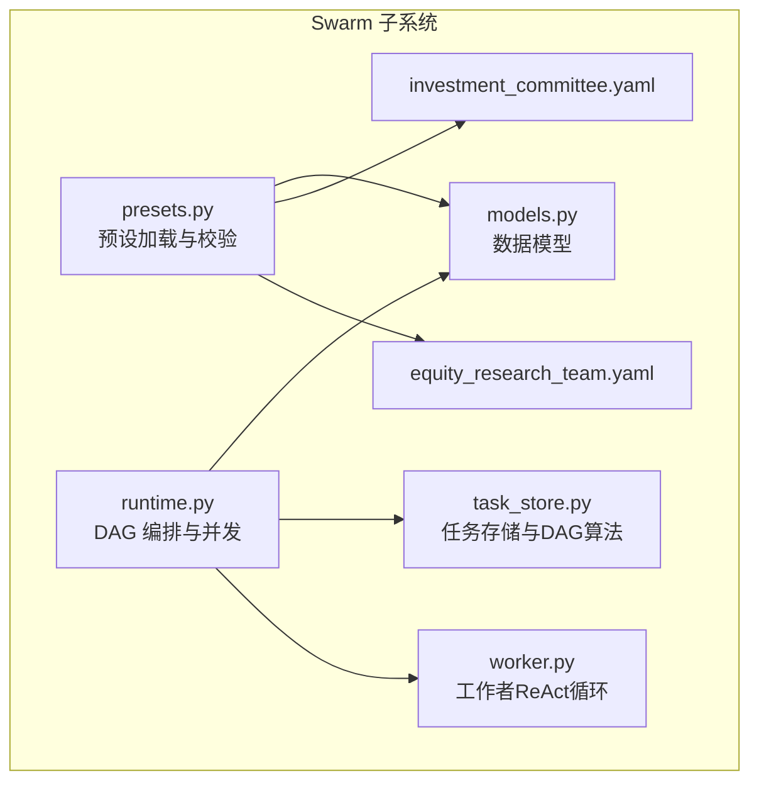

**图表来源**
- [agent/src/swarm/models.py:123-328](file://agent/src/swarm/models.py#L123-L328)
- [agent/src/swarm/presets.py:286-354](file://agent/src/swarm/presets.py#L286-L354)
- [agent/src/swarm/runtime.py:53-159](file://agent/src/swarm/runtime.py#L53-L159)
- [agent/src/swarm/task_store.py:16-249](file://agent/src/swarm/task_store.py#L16-L249)
- [agent/src/swarm/worker.py:375-440](file://agent/src/swarm/worker.py#L375-L440)
- [agent/src/swarm/presets/investment_committee.yaml:1-272](file://agent/src/swarm/presets/investment_committee.yaml#L1-L272)
- [agent/src/swarm/presets/equity_research_team.yaml:1-150](file://agent/src/swarm/presets/equity_research_team.yaml#L1-L150)

**章节来源**
- [agent/src/swarm/__init__.py:1-35](file://agent/src/swarm/__init__.py#L1-L35)
- [agent/src/swarm/models.py:123-328](file://agent/src/swarm/models.py#L123-L328)
- [agent/src/swarm/presets.py:1-109](file://agent/src/swarm/presets.py#L1-L109)
- [agent/src/swarm/runtime.py:53-159](file://agent/src/swarm/runtime.py#L53-L159)
- [agent/src/swarm/task_store.py:16-249](file://agent/src/swarm/task_store.py#L16-L249)
- [agent/src/swarm/worker.py:375-440](file://agent/src/swarm/worker.py#L375-L440)

## 核心组件
- 数据模型：RunStatus、TaskStatus、WorkerStatus、SwarmAgentSpec、SwarmTask、SwarmEvent、SwarmRun、WorkerResult，统一序列化与公共元数据脱敏
- 预设系统：支持用户目录优先的覆盖策略，变量声明与模板渲染，DAG 静态校验与拓扑层输出
- 运行时：后台线程执行、按层并行、依赖门控、取消传播、事件流、层边界快照
- 任务存储：原子写入、依赖解除、环检测、拓扑分层
- 工作者：工具白名单、技能过滤、心跳保活、流式 LLM 调用、内容过滤熔断、产物隔离与清理

**章节来源**
- [agent/src/swarm/models.py:123-328](file://agent/src/swarm/models.py#L123-L328)
- [agent/src/swarm/presets.py:111-179](file://agent/src/swarm/presets.py#L111-L179)
- [agent/src/swarm/runtime.py:222-402](file://agent/src/swarm/runtime.py#L222-L402)
- [agent/src/swarm/task_store.py:16-249](file://agent/src/swarm/task_store.py#L16-L249)
- [agent/src/swarm/worker.py:183-305](file://agent/src/swarm/worker.py#L183-L305)

## 架构总览
Swarm 采用“预设驱动 + DAG 编排 + 工作者执行”的分层架构：
- 预设层：YAML 定义代理能力与任务图，变量注入，静态校验
- 编排层：构建运行上下文、预取 Ground Truth、拓扑分层、并发调度、事件与状态同步
- 执行层：工作者在独立制品目录中执行 ReAct 循环，调用工具并产出报告
- 存储层：任务 JSON 文件、事件日志、运行聚合状态

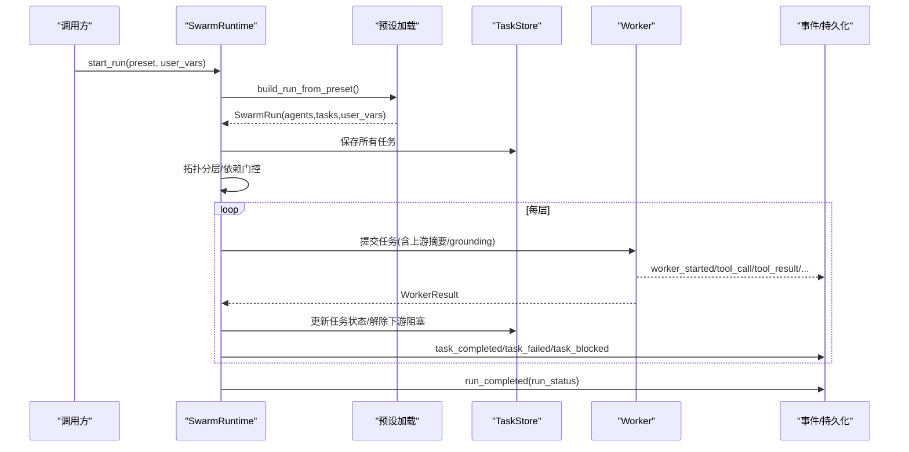

**图表来源**
- [agent/src/swarm/runtime.py:90-159](file://agent/src/swarm/runtime.py#L90-L159)
- [agent/src/swarm/runtime.py:222-402](file://agent/src/swarm/runtime.py#L222-L402)
- [agent/src/swarm/task_store.py:113-147](file://agent/src/swarm/task_store.py#L113-L147)
- [agent/src/swarm/worker.py:375-440](file://agent/src/swarm/worker.py#L375-L440)

## 详细组件分析

### 角色定义与配置（预设）
- 代理规格：id、role、system_prompt、tools/skills 白名单、max_iterations、timeout_seconds、model_name、max_retries
- 任务节点：id、agent_id、prompt_template、depends_on、input_from、blocked_by、status、summary/artifacts/error/time/iterations
- 预设加载：用户目录优先于内置目录，名称安全校验，变量声明与模板使用检查，DAG 校验与拓扑层预览
- 典型预设：投资委员会（多空辩论→风控→PM决策）、股票研究团队（宏观→行业→个股→汇总）

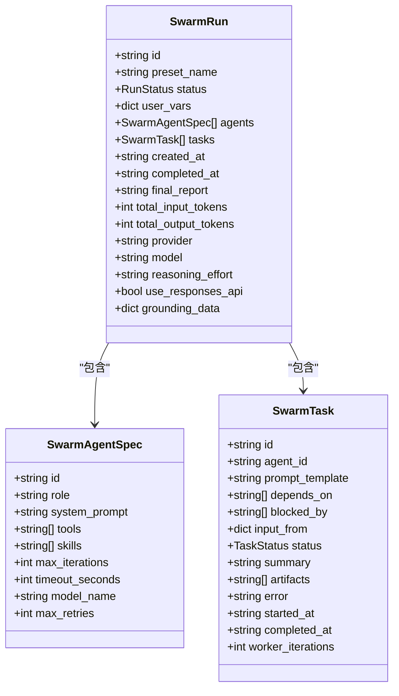

**图表来源**
- [agent/src/swarm/models.py:174-309](file://agent/src/swarm/models.py#L174-L309)

**章节来源**
- [agent/src/swarm/models.py:174-309](file://agent/src/swarm/models.py#L174-L309)
- [agent/src/swarm/presets.py:286-354](file://agent/src/swarm/presets.py#L286-L354)
- [agent/src/swarm/presets/investment_committee.yaml:1-272](file://agent/src/swarm/presets/investment_committee.yaml#L1-L272)
- [agent/src/swarm/presets/equity_research_team.yaml:1-150](file://agent/src/swarm/presets/equity_research_team.yaml#L1-L150)

### 协作模式
- 主从模式：由一个协调者（如 PM/Aggregator）汇聚上游结论并做出最终决策
- 对等模式：多个同级代理并行完成独立子任务（如多空双方同时研究）
- 流水线模式：按依赖顺序逐层推进（宏观→行业→个股→汇总）
- 混合模式：同一运行内组合多种模式（投资委员会即为主从+流水线）

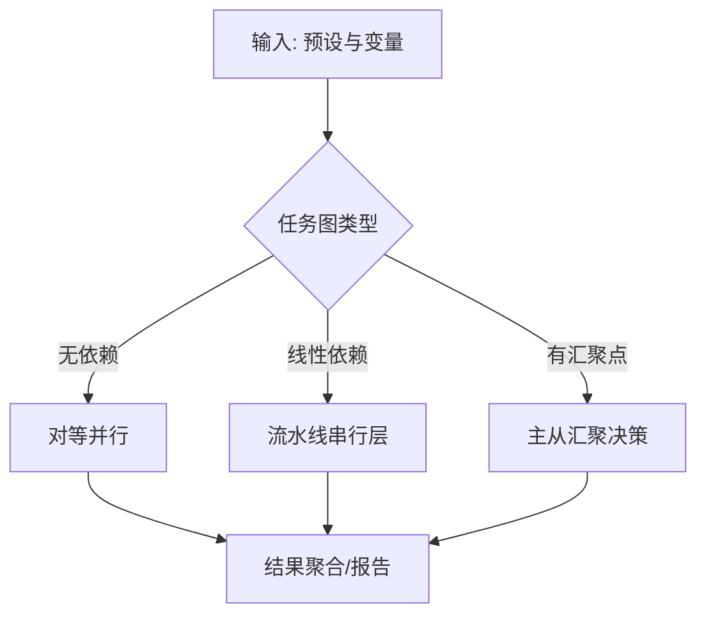

[此图为概念性说明，不直接映射具体代码文件]

### 任务分发机制
- 任务分解：通过 depends_on 声明上游依赖，通过 input_from 抽取上游摘要作为上下文
- 负载均衡：同层任务通过线程池并发执行；层间串行保证依赖满足
- 依赖管理：blocked_by 动态缩减，resolve_dependencies 在任务完成后自动解除下游阻塞；validate_dag 检测环；topological_layers 计算可并行层

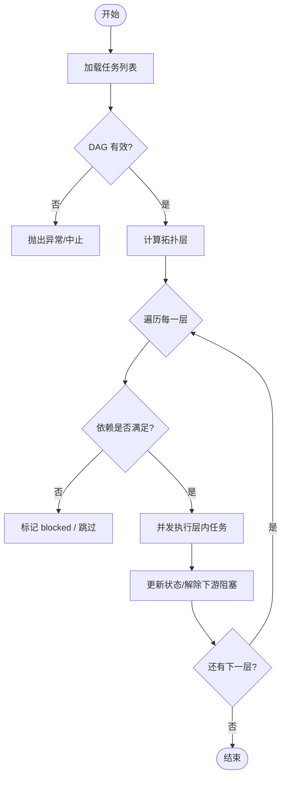

**图表来源**
- [agent/src/swarm/task_store.py:154-252](file://agent/src/swarm/task_store.py#L154-L252)
- [agent/src/swarm/runtime.py:476-645](file://agent/src/swarm/runtime.py#L476-L645)

**章节来源**
- [agent/src/swarm/task_store.py:113-249](file://agent/src/swarm/task_store.py#L113-L249)
- [agent/src/swarm/runtime.py:476-645](file://agent/src/swarm/runtime.py#L476-L645)

### 通信协议
- 事件模型：SwarmEvent 携带 type、agent_id、task_id、data、timestamp，用于 SSE 推送与事后审计
- 事件流：run_started/layer_started/task_started/task_completed/task_failed/task_blocked/run_completed 等
- 状态同步：层边界将任务状态快照回 run.json，避免频繁 I/O
- 心跳：Grounding 预取、LLM 流式调用、工具执行均通过 HeartbeatTimer 定期上报，防止误判为死锁

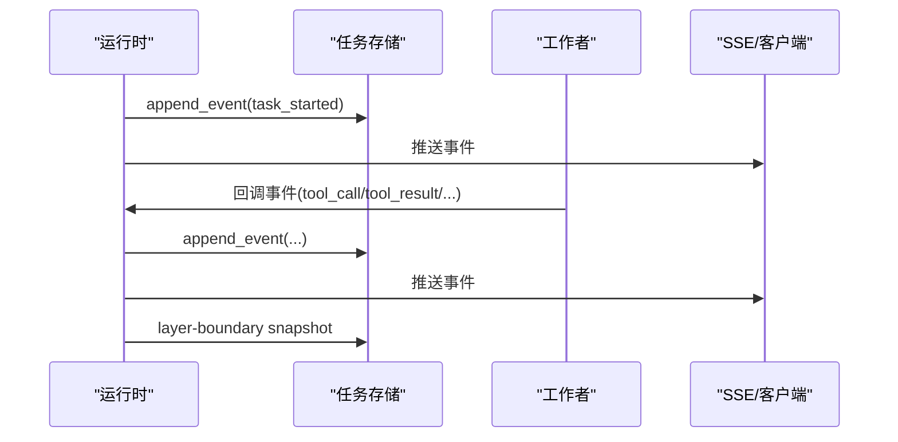

**图表来源**
- [agent/src/swarm/runtime.py:380-423](file://agent/src/swarm/runtime.py#L380-L423)
- [agent/src/swarm/runtime.py:277-402](file://agent/src/swarm/runtime.py#L277-L402)
- [agent/src/swarm/worker.py:121-149](file://agent/src/swarm/worker.py#L121-L149)

**章节来源**
- [agent/src/swarm/models.py:239-257](file://agent/src/swarm/models.py#L239-L257)
- [agent/src/swarm/runtime.py:380-423](file://agent/src/swarm/runtime.py#L380-L423)
- [agent/src/swarm/runtime.py:277-402](file://agent/src/swarm/runtime.py#L277-L402)
- [agent/src/swarm/worker.py:121-149](file://agent/src/swarm/worker.py#L121-L149)

### 工作流编排（DAG）
- 构建：build_run_from_preset 将 YAML 转为 SwarmRun，初始化 blocked_by
- 校验：validate_dag 检测环与未知依赖
- 分层：topological_layers 用 Kahn 算法计算可并行层
- 调度：_execute_layer 按层提交任务，依赖门控确保上游完成
- 解阻：resolve_dependencies 在任务完成后移除下游 blocked_by，必要时将任务置为 pending

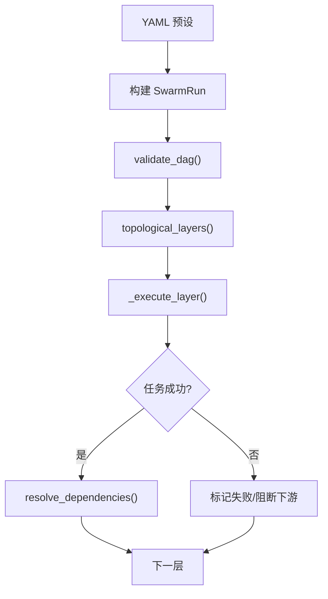

**图表来源**
- [agent/src/swarm/presets.py:286-354](file://agent/src/swarm/presets.py#L286-L354)
- [agent/src/swarm/task_store.py:154-252](file://agent/src/swarm/task_store.py#L154-L252)
- [agent/src/swarm/runtime.py:476-645](file://agent/src/swarm/runtime.py#L476-L645)

**章节来源**
- [agent/src/swarm/presets.py:286-354](file://agent/src/swarm/presets.py#L286-L354)
- [agent/src/swarm/task_store.py:154-252](file://agent/src/swarm/task_store.py#L154-L252)
- [agent/src/swarm/runtime.py:476-645](file://agent/src/swarm/runtime.py#L476-L645)

### 工作者与 ReAct 循环
- 提示构建：build_worker_prompt 组装角色、技能、市场数据策略、引用纪律、执行规则与当前时间
- 工具注册：build_swarm_registry 根据 agent_spec.tools 白名单与可选 MCP 远程工具构建执行器
- 执行循环：限制迭代次数与超时，流式 LLM 调用，工具调用结果回填消息，最后强制文本输出
- 产物管理：artifacts/{agent_id}/report.md 等文件，重试前清理避免污染
- 令牌估算：优先使用 provider 返回用量，否则字符长度启发式估计

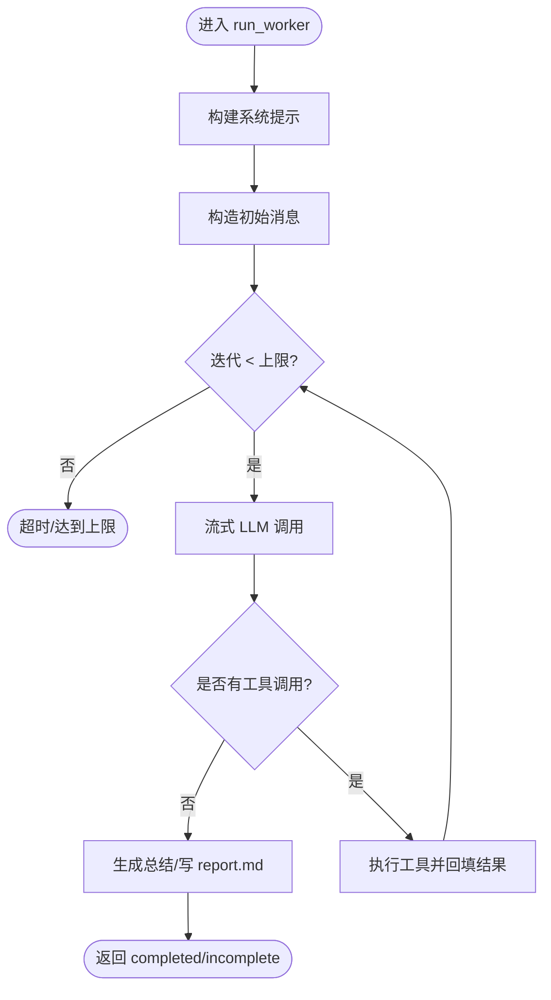

**图表来源**
- [agent/src/swarm/worker.py:183-305](file://agent/src/swarm/worker.py#L183-L305)
- [agent/src/swarm/worker.py:375-740](file://agent/src/swarm/worker.py#L375-L740)

**章节来源**
- [agent/src/swarm/worker.py:183-305](file://agent/src/swarm/worker.py#L183-L305)
- [agent/src/swarm/worker.py:375-740](file://agent/src/swarm/worker.py#L375-L740)

## 依赖关系分析
- 模块耦合：
  - runtime 依赖 models、presets、task_store、worker 与外部 providers/config
  - worker 依赖 providers/chat、tools、skills、config/limits
  - presets 依赖 models 与 task_store 的 DAG 算法
  - task_store 仅依赖 models
- 外部集成点：
  - LLM 提供者（ChatLLM/stream_chat）
  - 工具注册表（本地与 MCP 远程）
  - 技能加载器（SkillsLoader）
  - 配置访问器（get_env_config）

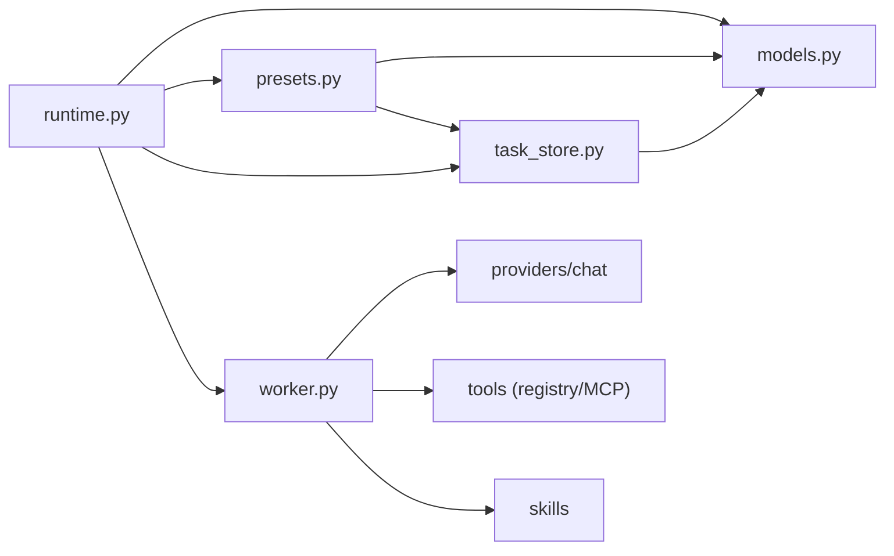

**图表来源**
- [agent/src/swarm/runtime.py:22-49](file://agent/src/swarm/runtime.py#L22-L49)
- [agent/src/swarm/worker.py:17-38](file://agent/src/swarm/worker.py#L17-L38)
- [agent/src/swarm/presets.py:25-28](file://agent/src/swarm/presets.py#L25-L28)
- [agent/src/swarm/task_store.py:13-14](file://agent/src/swarm/task_store.py#L13-L14)

**章节来源**
- [agent/src/swarm/runtime.py:22-49](file://agent/src/swarm/runtime.py#L22-L49)
- [agent/src/swarm/worker.py:17-38](file://agent/src/swarm/worker.py#L17-L38)
- [agent/src/swarm/presets.py:25-28](file://agent/src/swarm/presets.py#L25-L28)
- [agent/src/swarm/task_store.py:13-14](file://agent/src/swarm/task_store.py#L13-L14)

## 性能与资源管理
- 并发控制：
  - 层内并行：ThreadPoolExecutor 限制最大工作线程数
  - 层间串行：严格遵循拓扑层顺序
  - 层级截止时间：防御卡死的 C 扩展或阻塞 I/O
- 内存与上下文：
  - 历史工具消息裁剪，避免 token 膨胀
  - 最后一轮禁用工具定义，强制文本输出
  - 预估 token 超限提前终止
- 资源限制：
  - 单任务超时、最大迭代次数、重试次数
  - 层预算 = max(timeout × (retries+1)) + 缓冲
  - 心跳间隔可配，避免误判长耗时阶段

**章节来源**
- [agent/src/swarm/runtime.py:516-645](file://agent/src/swarm/runtime.py#L516-L645)
- [agent/src/swarm/worker.py:476-531](file://agent/src/swarm/worker.py#L476-L531)
- [agent/src/swarm/worker.py:545-621](file://agent/src/swarm/worker.py#L545-L621)

## 故障处理与容错
- 任务重试：
  - 失败时最多重试 max_retries 次，每次重试前清理制品目录
  - 累计 token 统计跨尝试合并
- 上游失败阻断：
  - 未完成的依赖将下游任务标记为 blocked，并记录原因
- 流式重试：
  - ProviderStreamError 可重试时进行一次延迟重试
- 内容过滤熔断：
  - 连续被内容过滤器拦截超过阈值则中断并报告
- 取消与清理：
  - cancel_run 设置事件，后续层不再调度，未完成任务标记 cancelled
  - 层边界快照失败不影响任务文件一致性

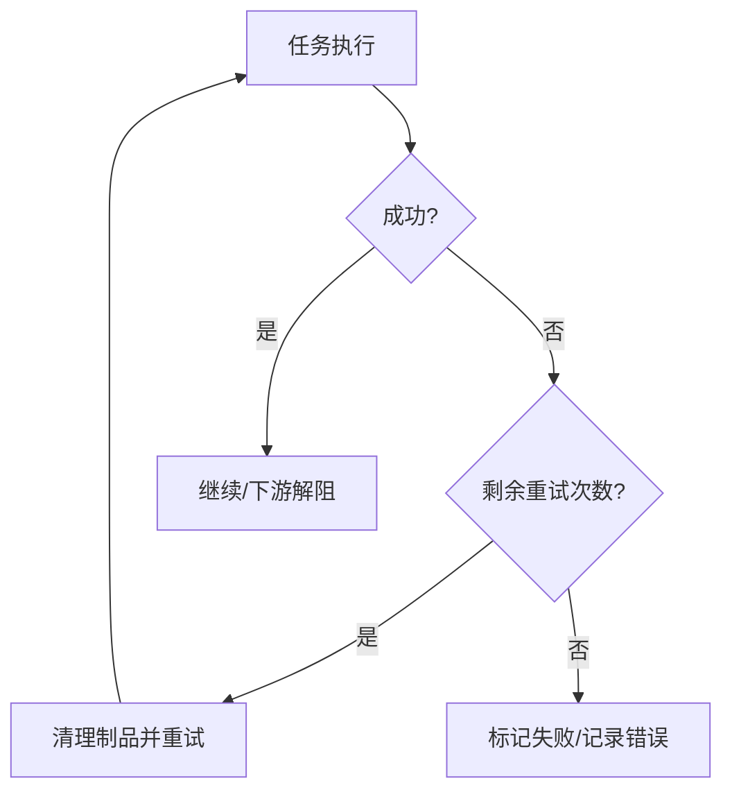

**图表来源**
- [agent/src/swarm/runtime.py:647-748](file://agent/src/swarm/runtime.py#L647-L748)
- [agent/src/swarm/runtime.py:1170-1188](file://agent/src/swarm/runtime.py#L1170-L1188)
- [agent/src/swarm/worker.py:604-621](file://agent/src/swarm/worker.py#L604-L621)
- [agent/src/swarm/worker.py:647-689](file://agent/src/swarm/worker.py#L647-L689)

**章节来源**
- [agent/src/swarm/runtime.py:647-748](file://agent/src/swarm/runtime.py#L647-L748)
- [agent/src/swarm/runtime.py:1170-1188](file://agent/src/swarm/runtime.py#L1170-L1188)
- [agent/src/swarm/worker.py:604-621](file://agent/src/swarm/worker.py#L604-L621)
- [agent/src/swarm/worker.py:647-689](file://agent/src/swarm/worker.py#L647-L689)

## 监控与调试
- 事件日志：
  - 全生命周期事件（run/layer/task/worker/tool）追加至事件流，供 SSE 与审计
- 心跳机制：
  - 预取 Ground Truth、LLM 流式调用、工具执行期间周期性上报，避免误报死锁
- 指标收集：
  - 累计输入/输出 token、迭代次数、各阶段耗时
- 可视化建议：
  - 基于事件流的实时进度面板
  - DAG 视图展示任务状态与依赖关系
  - 指标看板展示 token 消耗与失败率

**章节来源**
- [agent/src/swarm/runtime.py:380-423](file://agent/src/swarm/runtime.py#L380-L423)
- [agent/src/swarm/runtime.py:813-864](file://agent/src/swarm/runtime.py#L813-L864)
- [agent/src/swarm/worker.py:545-621](file://agent/src/swarm/worker.py#L545-L621)
- [agent/src/swarm/worker.py:741-796](file://agent/src/swarm/worker.py#L741-L796)

## 复杂协作场景示例
- 简单并行计算：
  - 多个独立任务在同一层并行执行，互不依赖
- 跨领域研究：
  - 股票研究团队：宏观→行业→个股→汇总，层层依赖，最终聚合报告
- 投资决策流程：
  - 投资委员会：多空双方并行研究，风控评估后由 PM 做最终决策

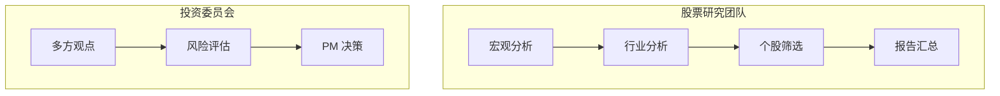

**图表来源**
- [agent/src/swarm/presets/equity_research_team.yaml:113-142](file://agent/src/swarm/presets/equity_research_team.yaml#L113-L142)
- [agent/src/swarm/presets/investment_committee.yaml:245-269](file://agent/src/swarm/presets/investment_committee.yaml#L245-L269)

**章节来源**
- [agent/src/swarm/presets/equity_research_team.yaml:1-150](file://agent/src/swarm/presets/equity_research_team.yaml#L1-L150)
- [agent/src/swarm/presets/investment_committee.yaml:1-272](file://agent/src/swarm/presets/investment_committee.yaml#L1-L272)

## 结论
本多代理协作系统通过 YAML 预设驱动、DAG 拓扑编排、层内并发与层间串行、心跳与事件流、重试与熔断、制品隔离与清理，提供了高可靠、可观测、可扩展的执行框架。其设计兼顾了易用性与工程严谨性，适用于从并行计算到跨领域研究的多样化协作场景。对于架构师与高级开发者而言，可通过自定义预设、扩展工具与技能、调整并发与超时策略、完善监控与可视化，快速构建面向业务的多智能体工作流。