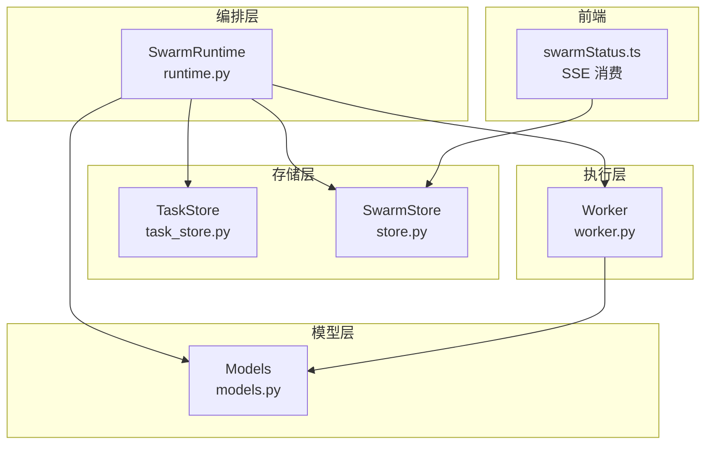
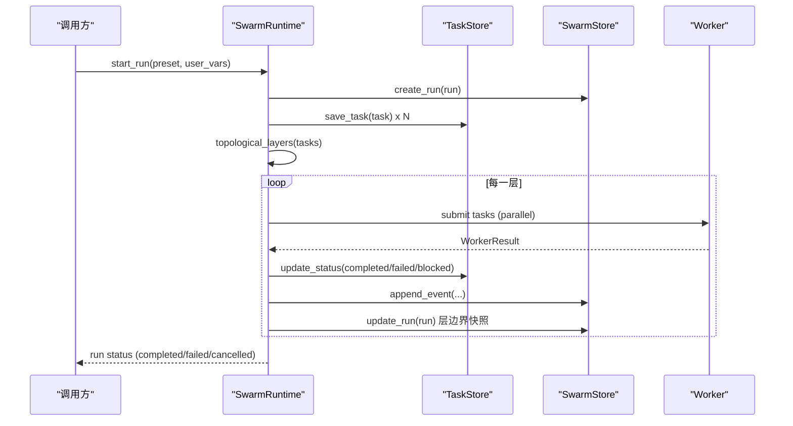
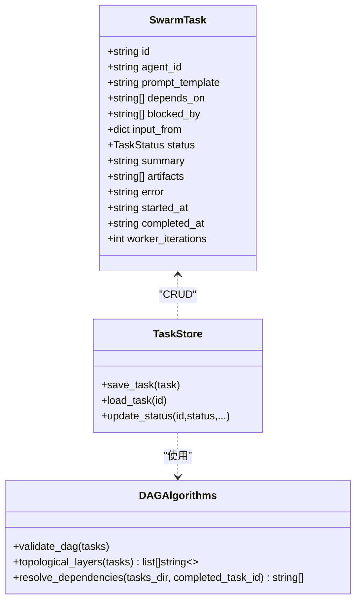
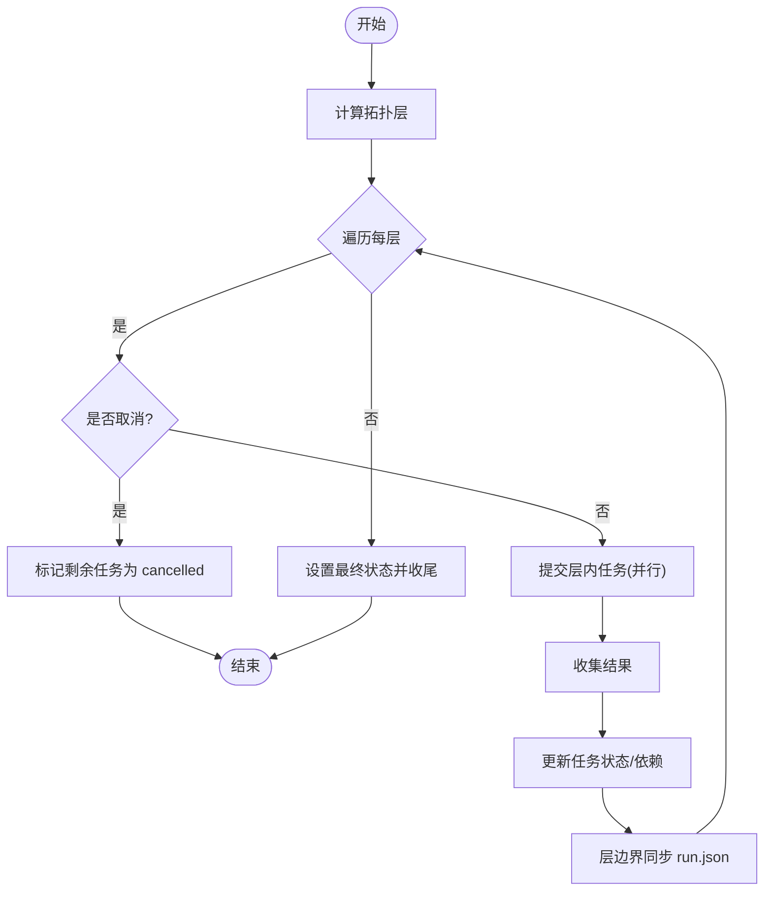
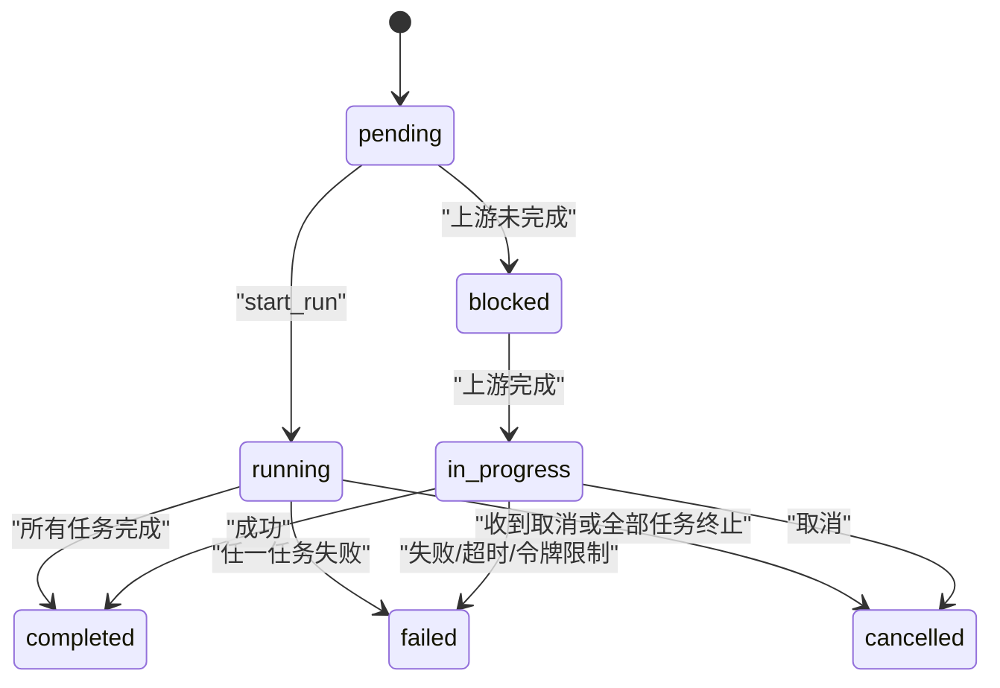
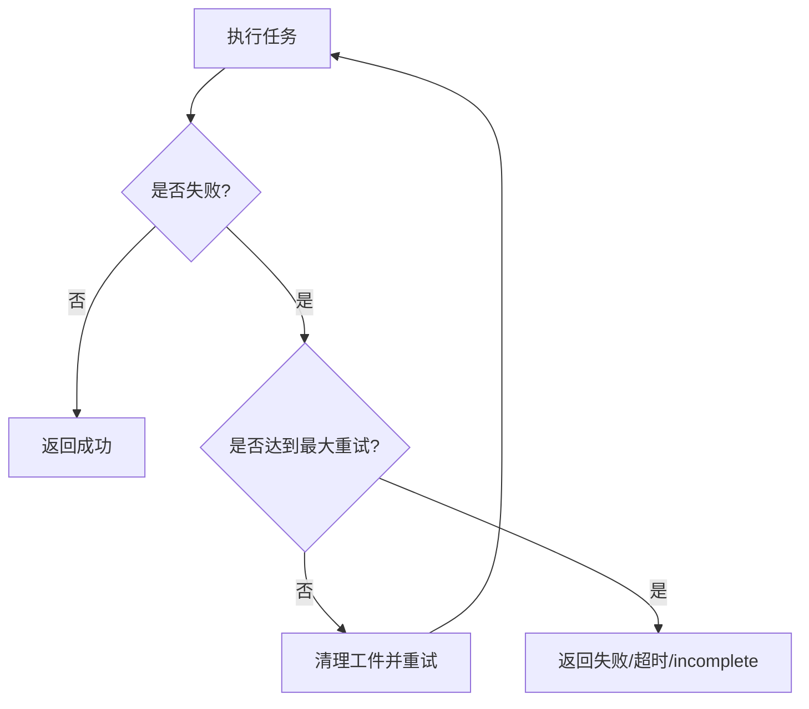
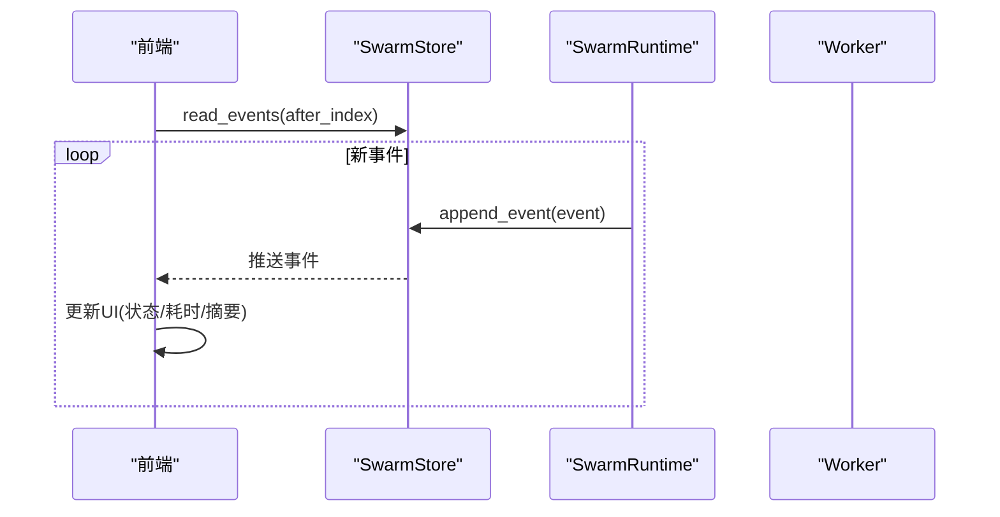
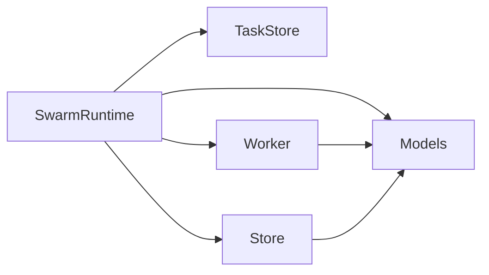

# 工作流编排

<cite>
**本文引用的文件**
- [agent/src/swarm/runtime.py](file://agent/src/swarm/runtime.py)
- [agent/src/swarm/task_store.py](file://agent/src/swarm/task_store.py)
- [agent/src/swarm/models.py](file://agent/src/swarm/models.py)
- [agent/src/swarm/store.py](file://agent/src/swarm/store.py)
- [agent/src/swarm/worker.py](file://agent/src/swarm/worker.py)
- [frontend/src/lib/swarmStatus.ts](file://frontend/src/lib/swarmStatus.ts)
</cite>

## 目录
1. [简介](#简介)
2. [项目结构](#项目结构)
3. [核心组件](#核心组件)
4. [架构总览](#架构总览)
5. [详细组件分析](#详细组件分析)
6. [依赖关系分析](#依赖关系分析)
7. [性能与资源管理](#性能与资源管理)
8. [故障排查指南](#故障排查指南)
9. [结论](#结论)
10. [附录：示例与最佳实践](#附录示例与最佳实践)

## 简介
本技术文档面向高级用户与系统集成者，系统化阐述工作流编排系统的实现与设计。内容涵盖：
- 工作流定义语言：DAG 图表示、节点类型、边关系与数据传递
- 任务编排机制：顺序执行、并行执行、条件分支（阻塞传播）、循环控制（迭代上限）
- 状态管理机制：持久化、断点续传、状态恢复与“僵尸运行”清理
- 错误处理与容错：异常捕获、重试策略、超时与降级
- 资源管理与性能优化：内存、并发、线程池、心跳与层级截止时间
- 监控与调试：事件日志、SSE 实时推送、前端可视化
- 复杂研究任务编排示例：从简单到多代理协作

## 项目结构
系统围绕 Swarm 多智能体编排构建，关键模块职责如下：
- runtime：编排引擎，负责 DAG 拓扑分层、任务调度、并发执行、取消与最终状态收敛
- task_store：任务持久化与 DAG 算法（依赖解析、环检测、拓扑分层）
- models：统一的数据模型（任务、运行、事件、状态枚举等）
- store：运行级持久化（run.json、events.jsonl），包含恢复、过期清理、原子写入
- worker：单任务执行器（轻量 ReAct 循环、工具调用、心跳、指标统计）
- frontend：基于 SSE 的实时状态更新与可视化

**图表来源**
- [agent/src/swarm/runtime.py:53-159](file://agent/src/swarm/runtime.py#L53-L159)
- [agent/src/swarm/task_store.py:16-147](file://agent/src/swarm/task_store.py#L16-L147)
- [agent/src/swarm/store.py:116-285](file://agent/src/swarm/store.py#L116-L285)
- [agent/src/swarm/worker.py:375-730](file://agent/src/swarm/worker.py#L375-L730)
- [agent/src/swarm/models.py:123-328](file://agent/src/swarm/models.py#L123-L328)
- [frontend/src/lib/swarmStatus.ts:214-255](file://frontend/src/lib/swarmStatus.ts#L214-L255)

**章节来源**
- [agent/src/swarm/runtime.py:53-159](file://agent/src/swarm/runtime.py#L53-L159)
- [agent/src/swarm/task_store.py:16-147](file://agent/src/swarm/task_store.py#L16-L147)
- [agent/src/swarm/store.py:116-285](file://agent/src/swarm/store.py#L116-L285)
- [agent/src/swarm/worker.py:375-730](file://agent/src/swarm/worker.py#L375-L730)
- [agent/src/swarm/models.py:123-328](file://agent/src/swarm/models.py#L123-L328)
- [frontend/src/lib/swarmStatus.ts:214-255](file://frontend/src/lib/swarmStatus.ts#L214-L255)

## 核心组件
- SwarmRuntime：编排主循环，按拓扑层并行调度任务，维护取消信号、事件回调、层截止时间与结果聚合
- TaskStore：任务文件的 CRUD 与 DAG 算法（依赖解析、环检测、拓扑分层）
- SwarmStore：运行根目录管理、run.json 原子写、events.jsonl 追加、运行恢复与过期清理
- Worker：单任务执行器，ReAct 循环、工具调用、心跳、指标统计、输出契约校验
- Models：统一的 Pydantic 模型与状态枚举，保证序列化一致性与安全元数据过滤

**章节来源**
- [agent/src/swarm/runtime.py:53-159](file://agent/src/swarm/runtime.py#L53-L159)
- [agent/src/swarm/task_store.py:16-147](file://agent/src/swarm/task_store.py#L16-L147)
- [agent/src/swarm/store.py:116-285](file://agent/src/swarm/store.py#L116-L285)
- [agent/src/swarm/worker.py:375-730](file://agent/src/swarm/worker.py#L375-L730)
- [agent/src/swarm/models.py:123-328](file://agent/src/swarm/models.py#L123-L328)

## 架构总览
SwarmRuntime 启动后：
- 创建并持久化运行记录，初始化 TaskStore，计算拓扑层
- 逐层提交任务至 ThreadPoolExecutor，层内并行、层间串行
- 每层结束后同步 run.json 快照，收集 token 用量与最终报告
- 支持取消、超时、失败传播与最终状态收敛

**图表来源**
- [agent/src/swarm/runtime.py:90-159](file://agent/src/swarm/runtime.py#L90-L159)
- [agent/src/swarm/runtime.py:222-403](file://agent/src/swarm/runtime.py#L222-L403)
- [agent/src/swarm/task_store.py:207-252](file://agent/src/swarm/task_store.py#L207-L252)
- [agent/src/swarm/store.py:160-285](file://agent/src/swarm/store.py#L160-L285)
- [agent/src/swarm/worker.py:375-730](file://agent/src/swarm/worker.py#L375-L730)

## 详细组件分析

### 工作流定义语言（DAG 图）
- 节点类型：SwarmTask，包含 id、agent_id、prompt_template、depends_on、blocked_by、input_from、status、summary、artifacts、error、started_at、completed_at、worker_iterations
- 边关系：depends_on 声明上游依赖；blocked_by 运行时跟踪未完成的上游；input_from 将上游 summary 注入下游上下文
- 图约束：validate_dag 使用 DFS 检测环；topological_layers 使用 Kahn 算法生成可并行层

**图表来源**
- [agent/src/swarm/models.py:202-236](file://agent/src/swarm/models.py#L202-L236)
- [agent/src/swarm/task_store.py:16-147](file://agent/src/swarm/task_store.py#L16-L147)
- [agent/src/swarm/task_store.py:154-252](file://agent/src/swarm/task_store.py#L154-L252)

**章节来源**
- [agent/src/swarm/models.py:202-236](file://agent/src/swarm/models.py#L202-L236)
- [agent/src/swarm/task_store.py:154-252](file://agent/src/swarm/task_store.py#L154-L252)

### 任务编排机制
- 顺序执行：层间串行，确保依赖完成后再进入下一层
- 并行执行：层内通过 ThreadPoolExecutor 并行提交任务
- 条件分支：若上游未完成任务，下游被标记为 blocked，不派发执行
- 循环控制：每个 worker 有 max_iterations 上限；整体层有截止时间（layer deadline）防止卡死

**图表来源**
- [agent/src/swarm/runtime.py:222-403](file://agent/src/swarm/runtime.py#L222-L403)
- [agent/src/swarm/runtime.py:476-645](file://agent/src/swarm/runtime.py#L476-L645)
- [agent/src/swarm/task_store.py:113-147](file://agent/src/swarm/task_store.py#L113-L147)

**章节来源**
- [agent/src/swarm/runtime.py:222-403](file://agent/src/swarm/runtime.py#L222-L403)
- [agent/src/swarm/runtime.py:476-645](file://agent/src/swarm/runtime.py#L476-L645)
- [agent/src/swarm/task_store.py:113-147](file://agent/src/swarm/task_store.py#L113-L147)

### 状态管理与持久化
- 运行状态：pending -> running -> completed/failed/cancelled
- 任务状态：pending -> blocked -> in_progress -> completed/failed/cancelled
- 持久化：
  - run.json：原子写入（临时文件+rename），层边界快照
  - events.jsonl：追加式事件日志，支持增量读取（SSE）
  - tasks/*.json：每个任务的独立 JSON 文件，实时更新
- 恢复与清理：
  - reconcile_run：合并 live tasks、推导终端状态、检测并清理“僵尸运行”
  - compute_stale_threshold：基于心跳间隔与重试预算计算静默阈值
  - reap_stale_running_runs：扫描并回收长时间无心跳的运行

**图表来源**
- [agent/src/swarm/models.py:123-167](file://agent/src/swarm/models.py#L123-L167)
- [agent/src/swarm/store.py:365-486](file://agent/src/swarm/store.py#L365-L486)
- [agent/src/swarm/store.py:531-566](file://agent/src/swarm/store.py#L531-L566)

**章节来源**
- [agent/src/swarm/models.py:123-167](file://agent/src/swarm/models.py#L123-L167)
- [agent/src/swarm/store.py:365-486](file://agent/src/swarm/store.py#L365-L486)
- [agent/src/swarm/store.py:531-566](file://agent/src/swarm/store.py#L531-L566)

### 错误处理与容错
- 异常捕获：层执行与事件持久化均包裹 try/except，避免单点失败影响整体
- 重试策略：_run_worker_with_retries 支持 max_retries 次重试，每次重试前清理工件目录，累计 token 计数
- 超时与降级：
  - 层截止时间（layer deadline）保护 C 扩展/阻塞 I/O 导致的挂起
  - 任务超时、令牌限制、输出契约不满足时返回 incomplete/failure
- 降级处理：grounding 预取失败不影响运行；事件持久化失败仅告警

**图表来源**
- [agent/src/swarm/runtime.py:647-748](file://agent/src/swarm/runtime.py#L647-L748)
- [agent/src/swarm/worker.py:375-730](file://agent/src/swarm/worker.py#L375-L730)

**章节来源**
- [agent/src/swarm/runtime.py:647-748](file://agent/src/swarm/runtime.py#L647-L748)
- [agent/src/swarm/worker.py:375-730](file://agent/src/swarm/worker.py#L375-L730)

### 资源管理与性能优化
- 并发控制：ThreadPoolExecutor 限制最大工作线程数；层内并行、层间串行
- 内存管理：事件与任务文件分片存储；run.json 仅在层边界同步，降低频繁写入开销
- 资源限制：
  - 每任务超时与最大迭代次数
  - 层截止时间（含缓冲时间）防止无限等待
  - 心跳机制保障长耗时 grounding 期间不被误判为僵尸
- 性能指标：累计输入/输出 token，工具调用耗时、迭代次数、内容过滤警告

**章节来源**
- [agent/src/swarm/runtime.py:476-645](file://agent/src/swarm/runtime.py#L476-L645)
- [agent/src/swarm/store.py:316-344](file://agent/src/swarm/store.py#L316-L344)
- [agent/src/swarm/worker.py:171-220](file://agent/src/swarm/worker.py#L171-L220)

### 监控与调试
- 事件日志：events.jsonl 追加式记录 run_started、layer_started、task_started/completed/failed/blocked、tool_result、worker_completed 等
- 实时推送：前端通过 SSE 消费事件，更新 UI 状态、工具调用进度与耗时
- 可视化：前端根据事件类型更新代理状态、工具名称、耗时、摘要等

**图表来源**
- [agent/src/swarm/store.py:247-285](file://agent/src/swarm/store.py#L247-L285)
- [frontend/src/lib/swarmStatus.ts:214-255](file://frontend/src/lib/swarmStatus.ts#L214-L255)

**章节来源**
- [agent/src/swarm/store.py:247-285](file://agent/src/swarm/store.py#L247-L285)
- [frontend/src/lib/swarmStatus.ts:214-255](file://frontend/src/lib/swarmStatus.ts#L214-L255)

## 依赖关系分析
- SwarmRuntime 依赖：
  - TaskStore：任务持久化与 DAG 算法
  - SwarmStore：运行持久化、事件日志、恢复与清理
  - Worker：任务执行
  - Models：统一数据结构
- 耦合与内聚：
  - 高内聚：各模块职责清晰（编排、存储、执行、模型）
  - 低耦合：通过接口与模型交互，避免直接共享内部状态
- 外部依赖：
  - LLM 提供者（ChatLLM）
  - 工具注册表（ToolRegistry）
  - 配置与路径访问（config.accessor、paths）

**图表来源**
- [agent/src/swarm/runtime.py:22-49](file://agent/src/swarm/runtime.py#L22-L49)
- [agent/src/swarm/worker.py:17-37](file://agent/src/swarm/worker.py#L17-L37)
- [agent/src/swarm/store.py:22-25](file://agent/src/swarm/store.py#L22-L25)

**章节来源**
- [agent/src/swarm/runtime.py:22-49](file://agent/src/swarm/runtime.py#L22-L49)
- [agent/src/swarm/worker.py:17-37](file://agent/src/swarm/worker.py#L17-L37)
- [agent/src/swarm/store.py:22-25](file://agent/src/swarm/store.py#L22-L25)

## 性能与资源管理
- 并发与吞吐：
  - 层内并行度由 max_workers 控制，建议根据 CPU/IO 特性调优
  - 层截止时间保护整体稳定性，避免个别任务拖垮整层
- 存储与 I/O：
  - run.json 原子写入减少损坏风险
  - events.jsonl 追加式写入适合高吞吐事件流
  - tasks/*.json 细粒度状态，便于增量读取与恢复
- 心跳与存活检测：
  - 心跳间隔与重试预算共同决定“僵尸运行”判定阈值
  - 长耗时 grounding 阶段通过心跳避免误判

[本节提供通用指导，无需特定文件引用]

## 故障排查指南
- 常见问题定位：
  - 任务被阻塞：检查 upstream 状态与 blocked_by 列表
  - 运行卡住：查看 events.jsonl 最后事件时间与心跳间隔
  - 任务失败：查看任务 error 字段与 worker 输出摘要
- 恢复流程：
  - 重启服务后自动 reconcile_run，推导终端状态并清理僵尸运行
  - 若 run.json 与 tasks/*.json 不一致，以 tasks 为准进行 hydrate
- 调试技巧：
  - 启用更详细的日志与事件输出
  - 调整 max_iterations、timeout_seconds、max_retries 观察行为变化
  - 使用前端 SSE 实时观察工具调用与耗时

**章节来源**
- [agent/src/swarm/store.py:365-486](file://agent/src/swarm/store.py#L365-L486)
- [agent/src/swarm/runtime.py:222-403](file://agent/src/swarm/runtime.py#L222-L403)
- [agent/src/swarm/worker.py:375-730](file://agent/src/swarm/worker.py#L375-L730)

## 结论
该工作流编排系统以 DAG 为核心，结合分层并行、严格的状态机与持久化恢复机制，提供了稳定、可观测、可扩展的多智能体任务执行框架。通过心跳、层截止时间与重试策略，系统在复杂研究与交易场景中具备较强的鲁棒性。前端 SSE 实时可视化进一步提升了可调试性与用户体验。

[本节为总结性内容，无需特定文件引用]

## 附录：示例与最佳实践
- 简单工作流：单一任务，无依赖，快速验证工具链与 LLM 集成
- 多代理协作：
  - 宏观分析师 -> 风险评估员 -> 投资组合经理（依赖链）
  - 使用 input_from 将上游摘要注入下游，形成上下文传递
- 复杂场景：
  - 多分支并行（如多个因子研究任务）
  - 条件分支（根据上游结果选择不同路径）
  - 循环控制（迭代上限与重试策略）
- 最佳实践：
  - 合理设置 max_iterations、timeout_seconds、max_retries
  - 使用 grounding 预取增强事实锚定
  - 利用事件日志与前端可视化进行问题定位

[本节为概念性内容，无需特定文件引用]