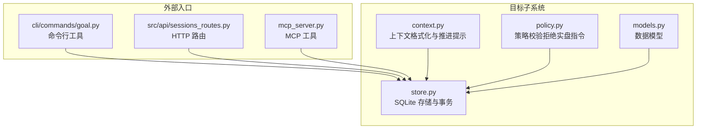
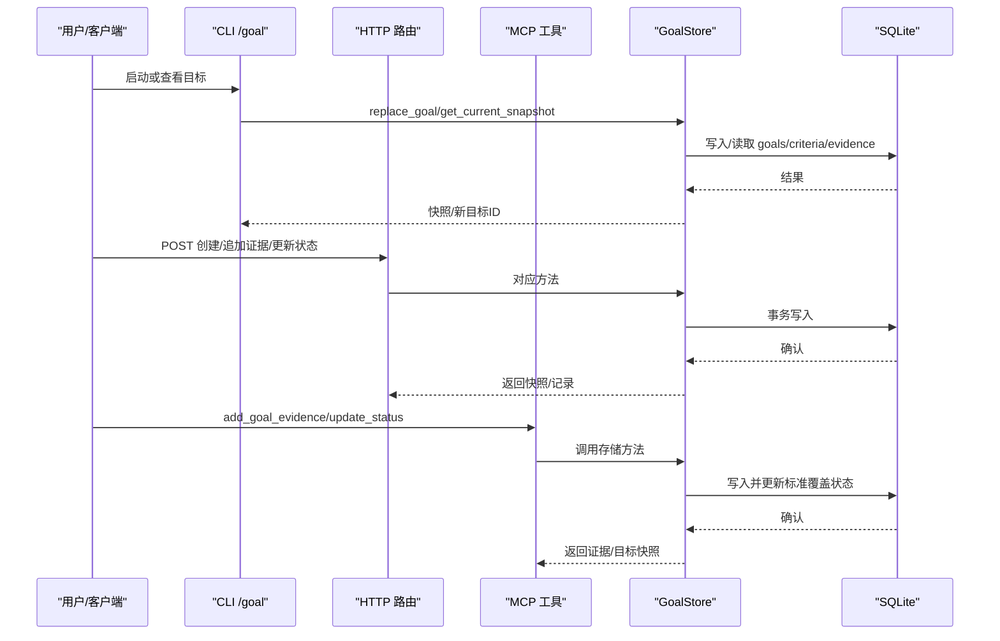
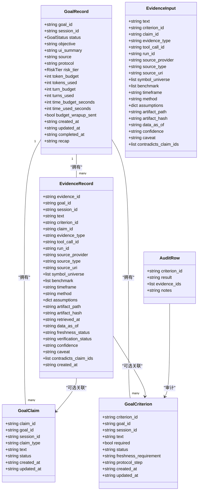
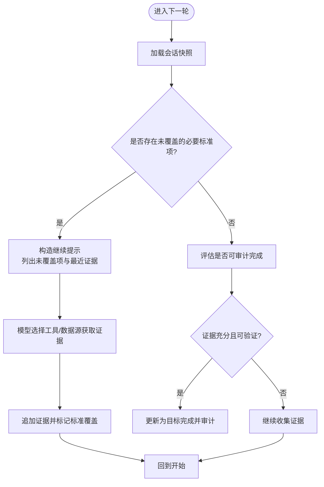
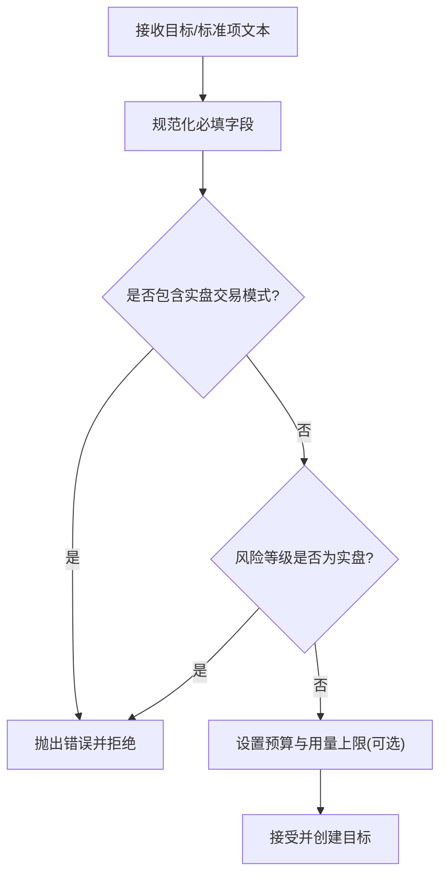
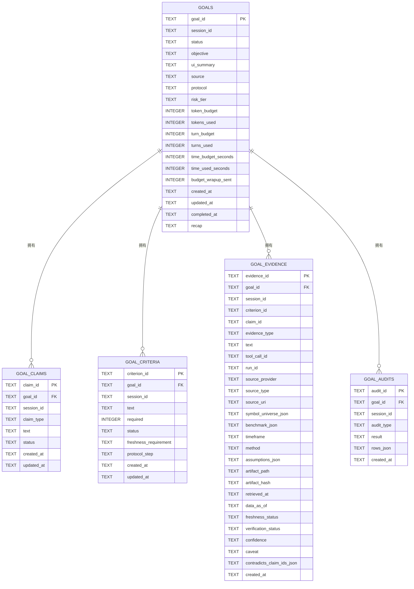
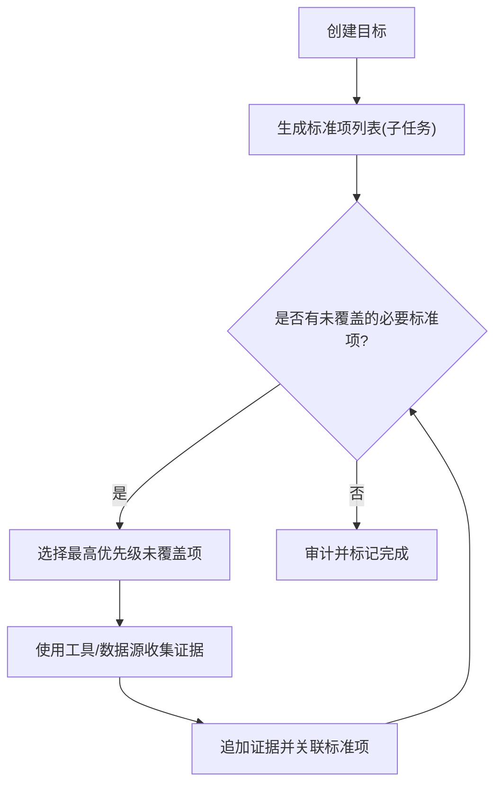
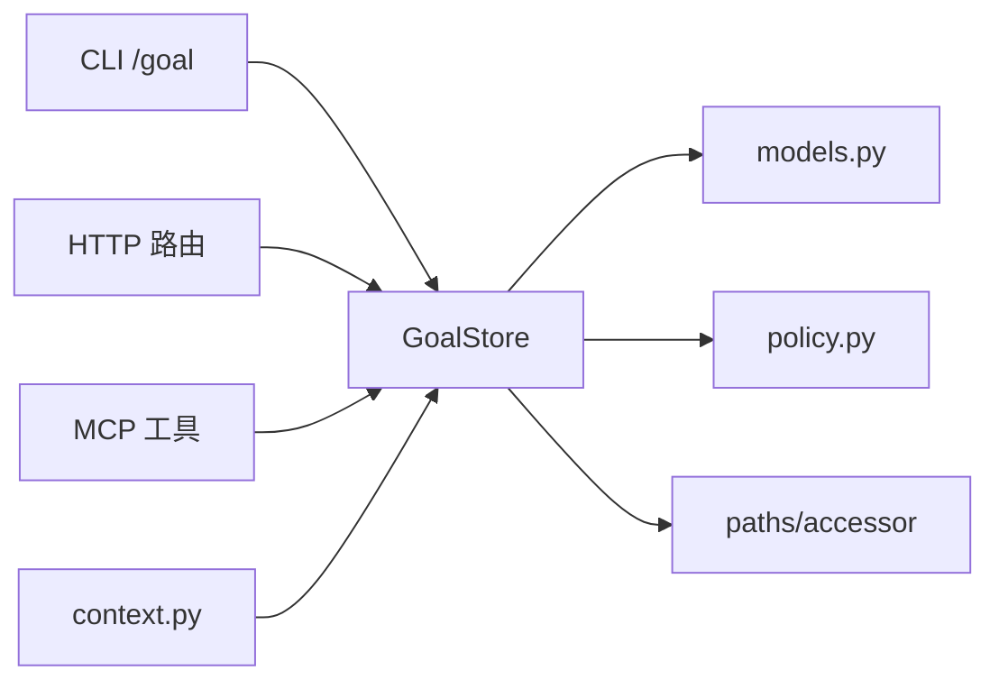

# 目标驱动研究

<cite>
**本文引用的文件**
- [models.py](file://agent/src/goal/models.py)
- [context.py](file://agent/src/goal/context.py)
- [policy.py](file://agent/src/goal/policy.py)
- [store.py](file://agent/src/goal/store.py)
- [__init__.py](file://agent/src/goal/__init__.py)
- [goal.py](file://agent/cli/commands/goal.py)
- [sessions_routes.py](file://agent/src/api/sessions_routes.py)
- [mcp_server.py](file://agent/mcp_server.py)
</cite>

## 目录
1. [简介](#简介)
2. [项目结构](#项目结构)
3. [核心组件](#核心组件)
4. [架构总览](#架构总览)
5. [详细组件分析](#详细组件分析)
6. [依赖关系分析](#依赖关系分析)
7. [性能与可靠性](#性能与可靠性)
8. [故障排查指南](#故障排查指南)
9. [结论](#结论)
10. [附录：工作流示例](#附录工作流示例)

## 简介
本技术文档面向量化研究员与策略开发者，系统化说明“目标驱动研究”子系统的设计与实现。内容覆盖：
- 研究目标的定义与建模：目标模型、约束条件、优先级与风险等级
- 上下文管理：会话级研究上下文构建、状态保持、变量传递
- 策略执行引擎：规则定义、执行流程、条件判断
- 存储机制：目标持久化、版本管理、查询接口
- 目标分解与子任务生成：将复杂目标拆解为可执行的证据收集步骤
- 跟踪与监控：进度更新、状态检查、异常处理
- 实际研究工作流：从简单数据分析到跨市场研究的端到端示例

## 项目结构
目标驱动研究子系统位于 agent/src/goal 下，围绕数据模型、上下文、策略校验与 SQLite 存储展开；CLI 与 API/MCP 提供外部交互入口。

图表来源
- [models.py:10-162](file://agent/src/goal/models.py#L10-L162)
- [context.py:1-179](file://agent/src/goal/context.py#L1-L179)
- [policy.py:1-49](file://agent/src/goal/policy.py#L1-L49)
- [store.py:106-247](file://agent/src/goal/store.py#L106-L247)
- [goal.py:1-403](file://agent/cli/commands/goal.py#L1-L403)
- [sessions_routes.py:61-158](file://agent/src/api/sessions_routes.py#L61-L158)
- [mcp_server.py:599-630](file://agent/mcp_server.py#L599-L630)

章节来源
- [models.py:10-162](file://agent/src/goal/models.py#L10-L162)
- [context.py:1-179](file://agent/src/goal/context.py#L1-L179)
- [policy.py:1-49](file://agent/src/goal/policy.py#L1-L49)
- [store.py:106-247](file://agent/src/goal/store.py#L106-L247)
- [goal.py:1-403](file://agent/cli/commands/goal.py#L1-L403)
- [sessions_routes.py:61-158](file://agent/src/api/sessions_routes.py#L61-L158)
- [mcp_server.py:599-630](file://agent/mcp_server.py#L599-L630)

## 核心组件
- 数据模型：目标记录、声明、标准项、证据输入/记录、审计行、状态枚举、风险等级
- 上下文：会话级快照格式化、继续提示、覆盖率计算
- 策略：文本规范化、拒绝实盘交易类目标
- 存储：SQLite 表结构、索引、事务、并发锁、当前目标唯一性约束
- 入口：CLI、HTTP API、MCP 工具

章节来源
- [models.py:10-162](file://agent/src/goal/models.py#L10-L162)
- [context.py:23-179](file://agent/src/goal/context.py#L23-L179)
- [policy.py:38-69](file://agent/src/goal/policy.py#L38-L69)
- [store.py:127-247](file://agent/src/goal/store.py#L127-L247)
- [goal.py:154-392](file://agent/cli/commands/goal.py#L154-L392)
- [sessions_routes.py:61-158](file://agent/src/api/sessions_routes.py#L61-L158)
- [mcp_server.py:599-630](file://agent/mcp_server.py#L599-L630)

## 架构总览
目标驱动研究以“目标-标准-证据-审计”为主线，通过上下文将研究进展注入模型提示，驱动下一步行动；存储层保证一致性、并发安全与可追溯性；外部入口统一暴露创建、追加证据、状态变更等操作。

图表来源
- [goal.py:168-195](file://agent/cli/commands/goal.py#L168-L195)
- [sessions_routes.py:61-158](file://agent/src/api/sessions_routes.py#L61-L158)
- [mcp_server.py:599-630](file://agent/mcp_server.py#L599-L630)
- [store.py:260-387](file://agent/src/goal/store.py#L260-L387)
- [store.py:601-698](file://agent/src/goal/store.py#L601-L698)
- [store.py:700-768](file://agent/src/goal/store.py#L700-L768)

## 详细组件分析

### 数据模型与生命周期
- 目标状态：活跃、暂停、等待用户、需刷新、证据不足、合规阻断、预算/用量限制、完成、取消、被替代
- 风险等级：通用研究、短期特定市场、个性化建议/仓位、实盘交易（受策略限制）
- 声明与标准：每个目标包含若干必须满足的标准项，支持可选的时效要求与协议步骤
- 证据：可关联标准项或声明，携带来源、时间范围、假设、置信度、矛盾声明等元数据
- 审计：对每个标准项给出满足结果与证据引用，用于完成判定

图表来源
- [models.py:10-162](file://agent/src/goal/models.py#L10-L162)

章节来源
- [models.py:10-162](file://agent/src/goal/models.py#L10-L162)

### 上下文管理与推进提示
- 默认标准项：定义研究论点与标的范围、收集新鲜证据、记录局限与边界
- 上下文格式化：将当前目标、证据数量、标准项覆盖情况注入模型提示
- 继续提示：基于未覆盖的必要标准项、最近证据与声明快照，指导下一步动作
- 覆盖率与延续性：根据标准项状态与证据存在性判断是否继续推进

图表来源
- [context.py:23-179](file://agent/src/goal/context.py#L23-L179)

章节来源
- [context.py:23-179](file://agent/src/goal/context.py#L23-L179)

### 策略执行引擎与规则
- 文本规范化：必填字段清洗与空值校验
- 实盘拦截：正则匹配下单/市价单/立即买卖等模式，拒绝实盘交易类目标
- 风险等级控制：禁止直接创建“实盘交易或执行”的目标
- 预算与用量：在运行中累计 token/时间/回合消耗，超限自动转入受限状态

图表来源
- [policy.py:38-69](file://agent/src/goal/policy.py#L38-L69)
- [store.py:260-387](file://agent/src/goal/store.py#L260-L387)
- [store.py:770-800](file://agent/src/goal/store.py#L770-L800)

章节来源
- [policy.py:38-69](file://agent/src/goal/policy.py#L38-L69)
- [store.py:260-387](file://agent/src/goal/store.py#L260-L387)
- [store.py:770-800](file://agent/src/goal/store.py#L770-L800)

### 存储机制与版本管理
- 表结构：goals、goal_claims、goal_criteria、goal_evidence、goal_audits
- 索引与约束：会话内仅允许一个“当前”目标（通过唯一索引过滤活跃状态），外键关联
- 并发与安全：线程锁序列化写操作，WAL 模式与即时事务提升并发与一致性
- 查询接口：按会话获取当前快照、按目标获取完整快照（含声明、标准、证据）
- 版本演进：数据库 user_version 标记，便于后续迁移

图表来源
- [store.py:127-247](file://agent/src/goal/store.py#L127-L247)

章节来源
- [store.py:127-247](file://agent/src/goal/store.py#L127-L247)

### 目标分解与子任务生成
- 标准项即子任务：每个标准项代表一个必须完成的证据收集步骤，支持顺序编号与协议步骤
- 自动推进：上下文模块识别未覆盖的必要标准项，驱动模型优先处理零证据项
- 证据关联：每条证据可绑定到具体标准项，完成后自动将该标准项标记为已覆盖
- 审计完成：当所有必要标准项均有可验证证据时，可通过审计流程完成目标

图表来源
- [context.py:94-179](file://agent/src/goal/context.py#L94-L179)
- [store.py:601-698](file://agent/src/goal/store.py#L601-L698)

章节来源
- [context.py:94-179](file://agent/src/goal/context.py#L94-L179)
- [store.py:601-698](file://agent/src/goal/store.py#L601-L698)

### 跟踪与监控
- 进度度量：统计已覆盖标准项数量与证据总数
- 状态检查：根据目标状态与预算/用量决定是否继续
- 异常处理：空文本、未知标准项/声明、过期目标、预算超限时抛出明确错误
- 审计留痕：完成审计记录标准项结果与证据引用，便于回溯

章节来源
- [context.py:66-179](file://agent/src/goal/context.py#L66-L179)
- [store.py:601-768](file://agent/src/goal/store.py#L601-L768)

## 依赖关系分析
- 模块耦合：
  - store 依赖 models、policy、config paths、tools path_utils
  - context 依赖 store 获取快照并格式化提示
  - CLI/API/MCP 均依赖 store 进行读写
- 外部集成点：
  - HTTP FastAPI 路由提供 REST 接口
  - MCP 工具暴露给智能体调用
  - SQLite 作为本地持久化后端

图表来源
- [goal.py:168-195](file://agent/cli/commands/goal.py#L168-L195)
- [sessions_routes.py:177-184](file://agent/src/api/sessions_routes.py#L177-L184)
- [mcp_server.py:599-630](file://agent/mcp_server.py#L599-L630)
- [store.py:19-33](file://agent/src/goal/store.py#L19-L33)
- [context.py:161-179](file://agent/src/goal/context.py#L161-L179)

章节来源
- [goal.py:168-195](file://agent/cli/commands/goal.py#L168-L195)
- [sessions_routes.py:177-184](file://agent/src/api/sessions_routes.py#L177-L184)
- [mcp_server.py:599-630](file://agent/mcp_server.py#L599-L630)
- [store.py:19-33](file://agent/src/goal/store.py#L19-L33)
- [context.py:161-179](file://agent/src/goal/context.py#L161-L179)

## 性能与可靠性
- 并发安全：线程锁串行化写操作，避免 SQLite 竞争写入
- 事务一致性：BEGIN IMMEDIATE 包裹关键写路径，失败回滚
- 读优化：WAL 模式与 NORMAL 同步策略提升并发读性能
- 索引设计：会话内唯一当前目标、按目标与时间排序的证据查询
- 资源控制：token/时间/回合预算与用量追踪，防止无限循环

章节来源
- [store.py:95-125](file://agent/src/goal/store.py#L95-L125)
- [store.py:248-259](file://agent/src/goal/store.py#L248-L259)
- [store.py:127-247](file://agent/src/goal/store.py#L127-L247)
- [store.py:770-800](file://agent/src/goal/store.py#L770-L800)

## 故障排查指南
- 无法创建目标：
  - 检查目标文本是否为空或包含实盘交易模式
  - 检查风险等级是否设置为实盘交易
- 无法追加证据：
  - 检查 expected_goal_id 是否与当前目标一致（防篡改）
  - 检查 criterion_id/claim_id 是否存在
  - 检查证据文本是否为空
- 无法完成目标：
  - 确保每个必要标准项都有可验证证据
  - 审计行必须包含 criterion_id 与 result
- 会话无当前目标：
  - 确认 session_id 有效且存在活跃状态目标
  - 若被替代，需重新创建

章节来源
- [store.py:260-387](file://agent/src/goal/store.py#L260-L387)
- [store.py:601-698](file://agent/src/goal/store.py#L601-L698)
- [store.py:700-768](file://agent/src/goal/store.py#L700-L768)
- [goal.py:168-195](file://agent/cli/commands/goal.py#L168-L195)

## 结论
目标驱动研究系统以“目标-标准-证据-审计”为核心闭环，结合上下文驱动的推进提示与严格的策略校验，实现了可追踪、可审计、可控制的量化研究流程。存储层提供高可靠与并发安全的持久化能力，CLI/API/MCP 多入口适配不同使用场景。对于量化研究员与策略开发者而言，该子系统既可用于简单的因子验证，也可支撑复杂的跨市场研究任务。

## 附录：工作流示例

### 示例一：简单数据分析（单市场因子验证）
- 创建目标：设定研究目标与默认标准项
- 收集证据：使用数据工具获取行情/基本面数据，追加证据并关联标准项
- 进度跟踪：查看快照，确认标准项覆盖情况
- 完成审计：当所有必要标准项均有可验证证据时，提交审计并完成

章节来源
- [goal.py:168-195](file://agent/cli/commands/goal.py#L168-L195)
- [goal.py:219-262](file://agent/cli/commands/goal.py#L219-L262)
- [goal.py:297-354](file://agent/cli/commands/goal.py#L297-L354)
- [store.py:601-698](file://agent/src/goal/store.py#L601-L698)
- [store.py:700-768](file://agent/src/goal/store.py#L700-L768)

### 示例二：跨市场研究（多资产组合与基准对比）
- 创建目标：指定多资产标的范围、时间框架与基准
- 分解标准项：数据收集、相关性分析、风险指标、回测验证
- 证据链：逐条收集并关联标准项，记录假设与局限性
- 审计完成：逐项审计并汇总结论，输出研究报告

章节来源
- [context.py:94-179](file://agent/src/goal/context.py#L94-L179)
- [store.py:601-698](file://agent/src/goal/store.py#L601-L698)
- [store.py:700-768](file://agent/src/goal/store.py#L700-L768)
- [sessions_routes.py:61-158](file://agent/src/api/sessions_routes.py#L61-L158)
- [mcp_server.py:599-630](file://agent/mcp_server.py#L599-L630)