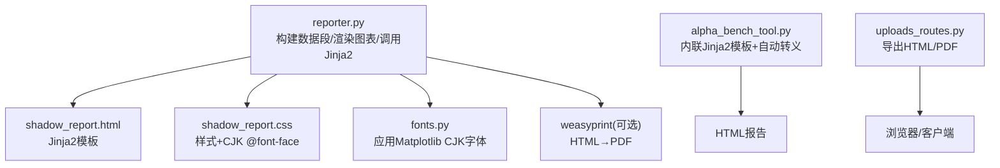
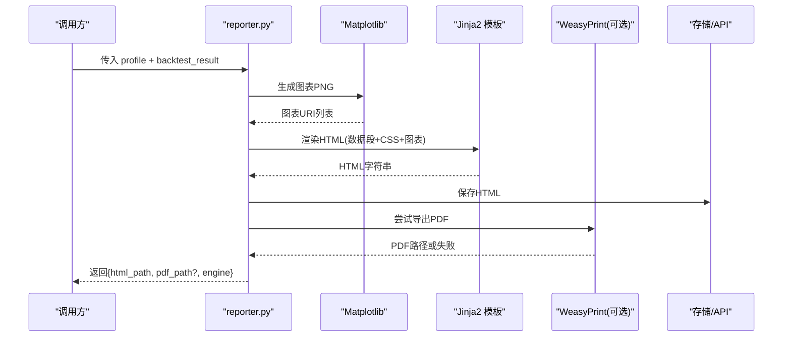
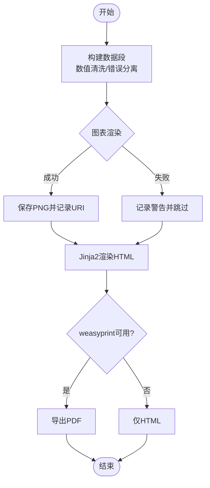
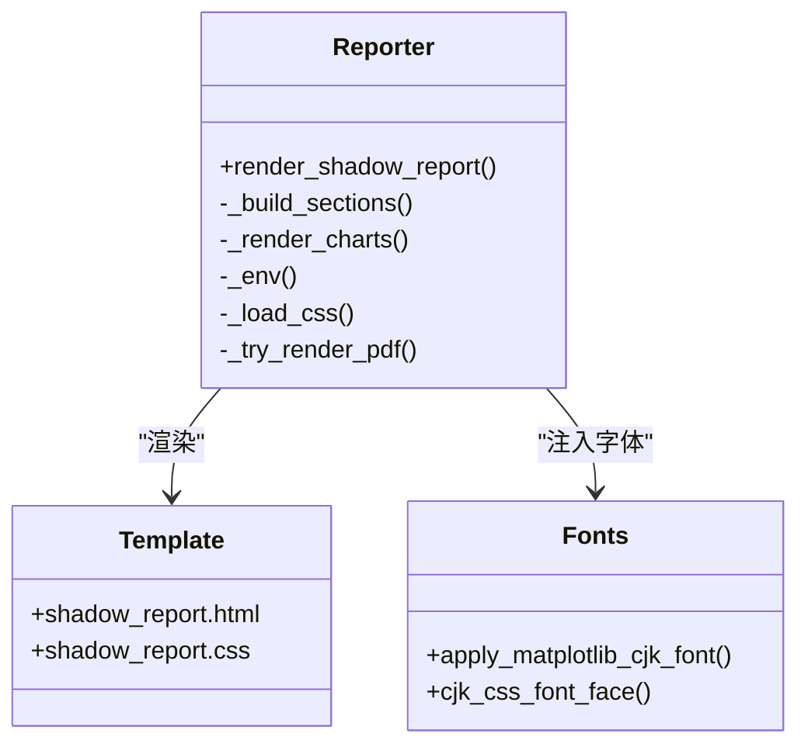
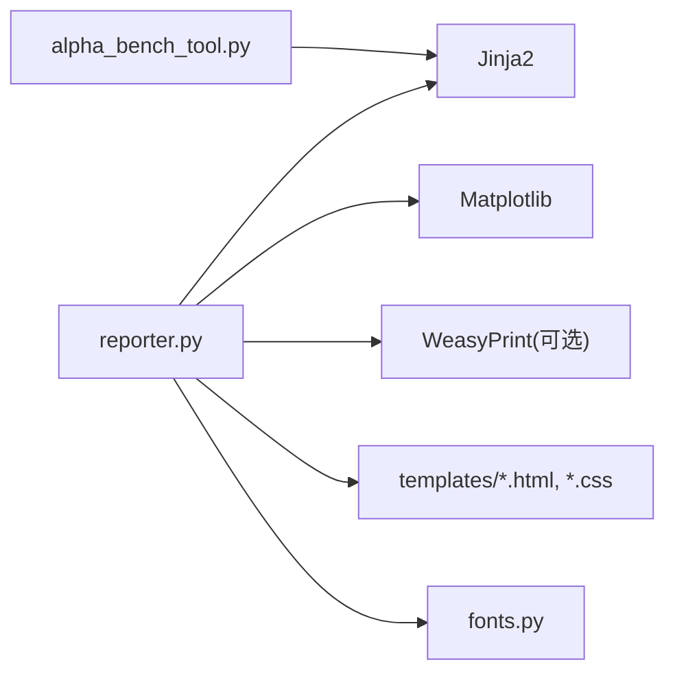

# 报告生成系统

<cite>
**本文引用的文件**
- [agent/src/shadow_account/reporter.py](file://agent/src/shadow_account/reporter.py)
- [agent/src/shadow_account/templates/shadow_report.html](file://agent/src/shadow_account/templates/shadow_report.html)
- [agent/src/shadow_account/templates/shadow_report.css](file://agent/src/shadow_account/templates/shadow_report.css)
- [agent/src/shadow_account/fonts.py](file://agent/src/shadow_account/fonts.py)
- [agent/src/tools/alpha_bench_tool.py](file://agent/src/tools/alpha_bench_tool.py)
- [agent/src/api/uploads_routes.py](file://agent/src/api/uploads_routes.py)
- [agent/backtest/loaders/longbridge.py](file://agent/backtest/loaders/longbridge.py)
- [agent/src/channels/email.py](file://agent/src/channels/email.py)
- [agent/src/channels/feishu.py](file://agent/src/channels/feishu.py)
</cite>

## 目录
1. [简介](#简介)
2. [项目结构](#项目结构)
3. [核心组件](#核心组件)
4. [架构总览](#架构总览)
5. [详细组件分析](#详细组件分析)
6. [依赖关系分析](#依赖关系分析)
7. [性能与缓存](#性能与缓存)
8. [故障排查指南](#故障排查指南)
9. [结论](#结论)
10. [附录：模板语法与定制](#附录模板语法与定制)

## 简介
本技术文档面向报告制作者与数据分析师，系统化说明本仓库中的报告生成能力：基于 Jinja2 的模板引擎、数据绑定与条件渲染、图表集成与样式主题、多格式输出（HTML/PDF）、以及可复用的工具链。重点围绕“影子账户”八段式报告的端到端流水线，覆盖从数据准备、图表渲染、模板填充到 PDF 导出的完整流程，并给出扩展建议与排错指引。

## 项目结构
报告生成相关代码主要位于 agent 子模块中，关键路径如下：
- 报告渲染主流程：agent/src/shadow_account/reporter.py
- 模板与样式：agent/src/shadow_account/templates/shadow_report.{html,css}
- CJK 字体与 CSS 注入：agent/src/shadow_account/fonts.py
- 轻量 HTML 报告（Alpha Bench）：agent/src/tools/alpha_bench_tool.py
- 报告上传与导出路由（HTML/PDF）：agent/src/api/uploads_routes.py
- 数据加载与缓存示例：agent/backtest/loaders/longbridge.py
- 渠道附件支持（邮件/飞书等）：agent/src/channels/email.py, agent/src/channels/feishu.py

**图示来源**
- [agent/src/shadow_account/reporter.py:56-102](file://agent/src/shadow_account/reporter.py#L56-L102)
- [agent/src/shadow_account/templates/shadow_report.html](file://agent/src/shadow_account/templates/shadow_report.html)
- [agent/src/shadow_account/templates/shadow_report.css](file://agent/src/shadow_account/templates/shadow_report.css)
- [agent/src/shadow_account/fonts.py](file://agent/src/shadow_account/fonts.py)
- [agent/src/tools/alpha_bench_tool.py:694-777](file://agent/src/tools/alpha_bench_tool.py#L694-L777)
- [agent/src/api/uploads_routes.py:100-112](file://agent/src/api/uploads_routes.py#L100-L112)

**章节来源**
- [agent/src/shadow_account/reporter.py:1-102](file://agent/src/shadow_account/reporter.py#L1-L102)
- [agent/src/tools/alpha_bench_tool.py:694-777](file://agent/src/tools/alpha_bench_tool.py#L694-L777)
- [agent/src/api/uploads_routes.py:100-112](file://agent/src/api/uploads_routes.py#L100-L112)

## 核心组件
- 报告渲染器（Shadow Account）
  - 负责组装数据段、生成图表 PNG、通过 Jinja2 渲染 HTML，并尝试导出 PDF。
  - 关键函数：render_shadow_report、_build_sections、_render_charts、_try_render_pdf。
- 模板与样式
  - shadow_report.html：Jinja2 模板，消费结构化数据段；支持条件渲染、循环、格式化。
  - shadow_report.css：报告样式，结合 fonts.py 注入 CJK 字体以保障 PDF 中文显示。
- 轻量 HTML 报告（Alpha Bench）
  - 使用内嵌 Jinja2 模板，启用 autoescape；当 jinja2 不可用时回退为手动拼接并 html.escape。
- 导出与分发
  - API 路由提供 HTML/PDF 下载；渠道（邮件、飞书）支持附件发送。

**章节来源**
- [agent/src/shadow_account/reporter.py:56-102](file://agent/src/shadow_account/reporter.py#L56-L102)
- [agent/src/shadow_account/reporter.py:107-149](file://agent/src/shadow_account/reporter.py#L107-L149)
- [agent/src/shadow_account/reporter.py:154-177](file://agent/src/shadow_account/reporter.py#L154-L177)
- [agent/src/shadow_account/reporter.py:285-298](file://agent/src/shadow_account/reporter.py#L285-L298)
- [agent/src/shadow_account/reporter.py:304-340](file://agent/src/shadow_account/reporter.py#L304-L340)
- [agent/src/tools/alpha_bench_tool.py:694-777](file://agent/src/tools/alpha_bench_tool.py#L694-L777)
- [agent/src/api/uploads_routes.py:100-112](file://agent/src/api/uploads_routes.py#L100-L112)

## 架构总览
报告生成的端到端流程如下：
1) 数据准备：从回测结果/模型对象中提取指标与序列，构造严格的数据段字典。
2) 图表渲染：使用 Matplotlib 生成 PNG（权益曲线、分市场柱状图、归因瀑布图等），失败时降级跳过。
3) 模板渲染：Jinja2 环境加载 HTML 模板与 CSS，注入数据段、图表 URI、标签映射等变量。
4) 输出产物：写入 HTML；若 weasyprint 可用则导出 PDF；否则仅保留 HTML。
5) 分发：通过 API 提供下载，或通过渠道作为附件发送。

**图示来源**
- [agent/src/shadow_account/reporter.py:56-102](file://agent/src/shadow_account/reporter.py#L56-L102)
- [agent/src/shadow_account/reporter.py:154-177](file://agent/src/shadow_account/reporter.py#L154-L177)
- [agent/src/shadow_account/reporter.py:285-298](file://agent/src/shadow_account/reporter.py#L285-L298)
- [agent/src/shadow_account/reporter.py:304-340](file://agent/src/shadow_account/reporter.py#L304-L340)

## 详细组件分析

### 报告渲染器（Shadow Account）
- 职责
  - 组装数据段：将回测结果拆分为数值型指标与错误信息，保证模板格式化安全。
  - 图表渲染：权益曲线、分市场夏普对比、Delta 归因瀑布图；异常时记录日志并跳过对应图表。
  - 模板渲染：创建带自动转义的 Jinja2 环境，加载模板与 CSS，注入数据与资源。
  - PDF 导出：懒加载 weasyprint，进程级缓存以避免重复导入导致的底层库问题。
- 关键设计
  - 无硬依赖：weasyprint 仅在需要时导入；失败时优雅降级为 HTML-only。
  - 健壮性：图表渲染异常不影响整体产出；错误信息单独字段供模板展示。
  - 国际化排版：通过 fonts.py 注入 CJK 字体，确保 PDF 中文正常显示。

**图示来源**
- [agent/src/shadow_account/reporter.py:107-149](file://agent/src/shadow_account/reporter.py#L107-L149)
- [agent/src/shadow_account/reporter.py:154-177](file://agent/src/shadow_account/reporter.py#L154-L177)
- [agent/src/shadow_account/reporter.py:285-298](file://agent/src/shadow_account/reporter.py#L285-L298)
- [agent/src/shadow_account/reporter.py:304-340](file://agent/src/shadow_account/reporter.py#L304-L340)

**章节来源**
- [agent/src/shadow_account/reporter.py:56-102](file://agent/src/shadow_account/reporter.py#L56-L102)
- [agent/src/shadow_account/reporter.py:107-149](file://agent/src/shadow_account/reporter.py#L107-L149)
- [agent/src/shadow_account/reporter.py:154-177](file://agent/src/shadow_account/reporter.py#L154-L177)
- [agent/src/shadow_account/reporter.py:285-298](file://agent/src/shadow_account/reporter.py#L285-L298)
- [agent/src/shadow_account/reporter.py:304-340](file://agent/src/shadow_account/reporter.py#L304-L340)

### 模板引擎与数据绑定
- 模板位置与加载
  - HTML 模板：shadow_report.html
  - CSS 模板：shadow_report.css，并在加载时前置 CJK @font-face
- 数据绑定
  - 数据段由 _build_sections 构造，包含 profile、组合指标、分市场指标、归因、今日信号等。
  - 模板通过 Jinja2 语法进行条件渲染、循环、格式化（如百分比、小数位）。
- 安全策略
  - 启用 autoescape 对 HTML/XML 上下文自动转义，防止 XSS。
  - 数值型指标在渲染前被强制转换为 float，避免非数字泄漏导致格式化异常。

**图示来源**
- [agent/src/shadow_account/reporter.py:56-102](file://agent/src/shadow_account/reporter.py#L56-L102)
- [agent/src/shadow_account/reporter.py:285-298](file://agent/src/shadow_account/reporter.py#L285-L298)
- [agent/src/shadow_account/fonts.py](file://agent/src/shadow_account/fonts.py)

**章节来源**
- [agent/src/shadow_account/reporter.py:107-149](file://agent/src/shadow_account/reporter.py#L107-L149)
- [agent/src/shadow_account/reporter.py:285-298](file://agent/src/shadow_account/reporter.py#L285-L298)

### 图表集成与布局
- 图表类型
  - 权益曲线：时间序列折线+面积填充，自动采样 x 轴刻度避免拥挤。
  - 分市场夏普对比：柱状图，标注数值。
  - Delta 归因瀑布：正负贡献可视化，起始/终止高亮。
- 布局与样式
  - 通过 CSS 控制页面边距、网格、标题、颜色；配合 CJK 字体保障中文显示。
  - 图表尺寸与 DPI 可调，兼顾屏幕预览与 PDF 打印质量。

**章节来源**
- [agent/src/shadow_account/reporter.py:180-278](file://agent/src/shadow_account/reporter.py#L180-L278)
- [agent/src/shadow_account/templates/shadow_report.css](file://agent/src/shadow_account/templates/shadow_report.css)

### 多格式输出
- HTML
  - 始终生成 HTML 文件，便于在线预览与二次加工。
- PDF
  - 通过 weasyprint 将 HTML 转为 PDF；若导入或渲染失败，退回 HTML-only。
- 其他格式
  - 当前仓库未直接实现 Markdown/Excel 导出；可通过外部工具链将 HTML/PDF 转换或抽取表格数据后导出。

**章节来源**
- [agent/src/shadow_account/reporter.py:304-340](file://agent/src/shadow_account/reporter.py#L304-L340)
- [agent/src/api/uploads_routes.py:100-112](file://agent/src/api/uploads_routes.py#L100-L112)

### 数据源连接与数据转换
- 数据源
  - 报告数据来自回测结果与模型对象；数据加载层（如 longbridge loader）提供 OHLCV 等数据。
- 数据转换
  - 指标清洗：将非数值项剥离为错误消息，确保模板格式化稳定。
  - 图表数据：从时序/聚合结果提取日期与数值，适配绘图接口。
- 格式化输出
  - 模板中使用格式化过滤器控制小数位、单位与可读性。

**章节来源**
- [agent/src/shadow_account/reporter.py:107-149](file://agent/src/shadow_account/reporter.py#L107-L149)
- [agent/backtest/loaders/longbridge.py:395-411](file://agent/backtest/loaders/longbridge.py#L395-L411)

### 报告分发与附件
- API 导出
  - 提供 HTML/PDF 下载接口，媒体类型根据格式设置。
- 渠道附件
  - 邮件、飞书等渠道支持 PDF 等附件发送，便于自动化分发。

**章节来源**
- [agent/src/api/uploads_routes.py:100-112](file://agent/src/api/uploads_routes.py#L100-L112)
- [agent/src/channels/email.py:75-75](file://agent/src/channels/email.py#L75-L75)
- [agent/src/channels/feishu.py:1300](file://agent/src/channels/feishu.py#L1300)

## 依赖关系分析
- 内部依赖
  - reporter.py 依赖模板、样式、字体模块与 Matplotlib。
  - alpha_bench_tool.py 使用内嵌 Jinja2 模板，具备自动转义与回退机制。
- 外部依赖
  - weasyprint：可选，用于 HTML→PDF；导入失败不影响 HTML 产出。
  - Matplotlib：图表绘制；异常时跳过对应图表。
  - Jinja2：模板引擎；启用 autoescape 保障安全。

**图示来源**
- [agent/src/shadow_account/reporter.py:285-298](file://agent/src/shadow_account/reporter.py#L285-L298)
- [agent/src/shadow_account/reporter.py:304-340](file://agent/src/shadow_account/reporter.py#L304-L340)
- [agent/src/tools/alpha_bench_tool.py:694-777](file://agent/src/tools/alpha_bench_tool.py#L694-L777)

**章节来源**
- [agent/src/shadow_account/reporter.py:285-298](file://agent/src/shadow_account/reporter.py#L285-L298)
- [agent/src/shadow_account/reporter.py:304-340](file://agent/src/shadow_account/reporter.py#L304-L340)
- [agent/src/tools/alpha_bench_tool.py:694-777](file://agent/src/tools/alpha_bench_tool.py#L694-L777)

## 性能与缓存
- 图表渲染
  - 按图独立渲染，失败不阻塞整体流程；适合增量更新（新增/修改某图不影响其他图）。
- PDF 导出
  - weasyprint 导入过程程级缓存，避免重复导入引发的底层库问题；首次失败后不再重试。
- 数据加载缓存
  - 数据加载层（如 longbridge loader）使用缓存键（source/symbol/timeframe/start/end/fields）避免重复请求。
- 建议
  - 对大数据集图表进行采样与降采样，减少渲染耗时。
  - 对频繁更新的指标采用增量计算与局部重绘。

**章节来源**
- [agent/src/shadow_account/reporter.py:304-340](file://agent/src/shadow_account/reporter.py#L304-L340)
- [agent/backtest/loaders/longbridge.py:395-411](file://agent/backtest/loaders/longbridge.py#L395-L411)

## 故障排查指南
- PDF 无法生成
  - 现象：返回 pdf_path 为空，engine 为 "html-only"。
  - 原因：weasyprint 导入失败或渲染异常。
  - 处理：检查系统依赖；确认 HTML 已正确生成并可本地预览。
- 图表缺失
  - 现象：报告中缺少某图表。
  - 原因：Matplotlib 渲染异常或数据为空。
  - 处理：查看日志警告；检查输入数据与绘图参数。
- 中文乱码
  - 现象：PDF 中文显示异常。
  - 原因：未正确注入 CJK 字体。
  - 处理：确认 fonts.py 生效；必要时安装系统字体。
- 模板变量报错
  - 现象：模板渲染抛出格式化错误。
  - 原因：非数值指标混入。
  - 处理：使用 _split_metrics 清洗数据；确保模板只接收数值型指标。

**章节来源**
- [agent/src/shadow_account/reporter.py:304-340](file://agent/src/shadow_account/reporter.py#L304-L340)
- [agent/src/shadow_account/reporter.py:154-177](file://agent/src/shadow_account/reporter.py#L154-L177)
- [agent/src/shadow_account/reporter.py:107-149](file://agent/src/shadow_account/reporter.py#L107-L149)

## 结论
本系统的报告生成以 Jinja2 模板为核心，结合 Matplotlib 图表与可选 WeasyPrint PDF 导出，形成稳健、可扩展的流水线。通过严格的数据段构造、自动转义与降级策略，确保在不同环境与数据条件下均能稳定产出高质量报告。对于更广泛的格式（Markdown/Excel），可在现有 HTML/PDF 基础上通过外部工具链扩展。

## 附录：模板语法与定制
- Jinja2 语法要点
  - 变量插值：{{ var }}
  - 条件渲染：...
  - 循环：...
  - 过滤器：{{ value | format("%.2f") }}
  - 自动转义：启用 autoescape，避免 XSS
- 数据绑定
  - 通过 _build_sections 构造字典，模板消费 profile、指标、图表 URI、标签映射等。
- 样式主题与品牌标识
  - 修改 shadow_report.css 调整配色、字号、边距；通过 fonts.py 注入品牌字体。
- 自定义模板
  - 复制并修改 shadow_report.html，保持数据结构一致；在 reporter 中切换模板路径。
- 示例报告类型
  - 市场分析报告：侧重分市场表现、因子暴露与归因。
  - 投资组合报告：权益曲线、持仓分布、风险指标。
  - 风险报告：压力测试、回撤、VaR/ES 等。
  - 注：以上为内容组织建议，具体字段需依据业务数据段定义。

**章节来源**
- [agent/src/shadow_account/reporter.py:107-149](file://agent/src/shadow_account/reporter.py#L107-L149)
- [agent/src/shadow_account/reporter.py:285-298](file://agent/src/shadow_account/reporter.py#L285-L298)
- [agent/src/tools/alpha_bench_tool.py:694-777](file://agent/src/tools/alpha_bench_tool.py#L694-L777)