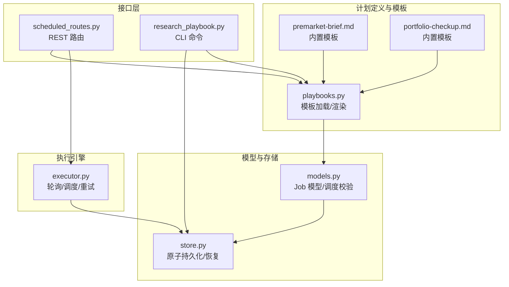
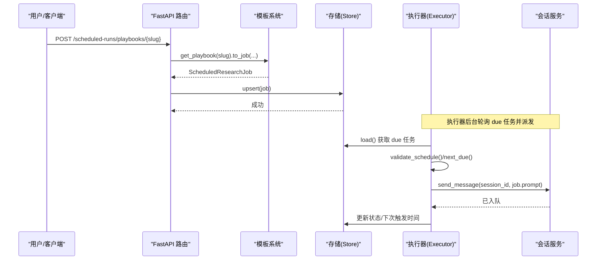
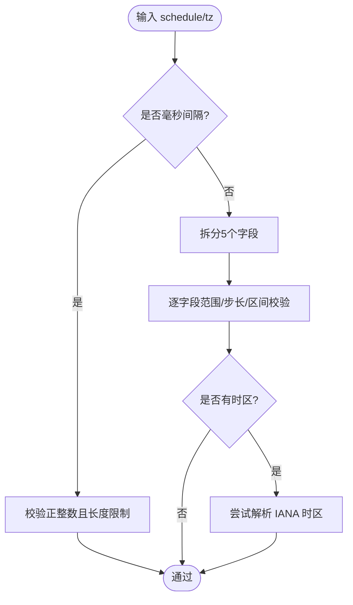
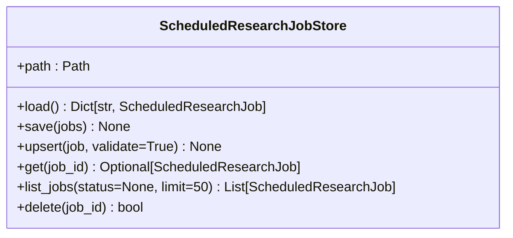
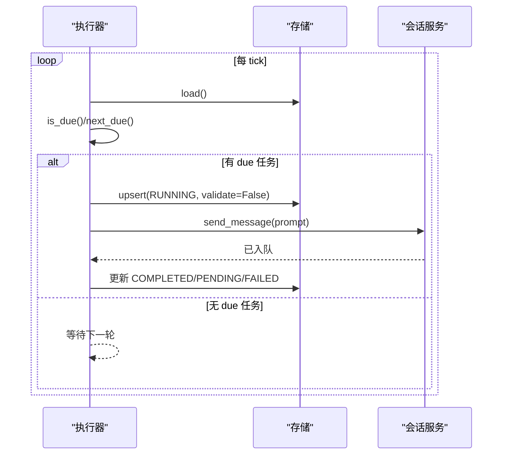
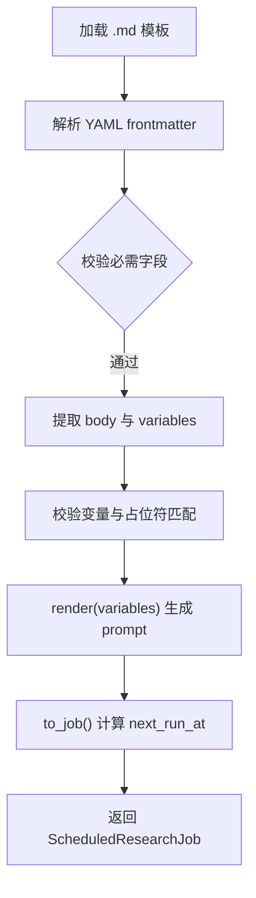
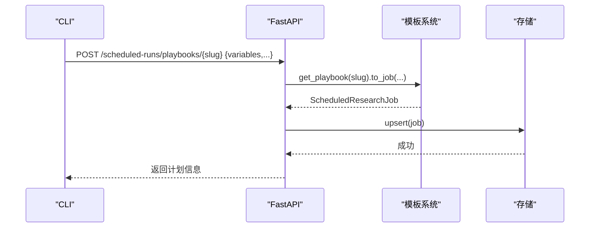
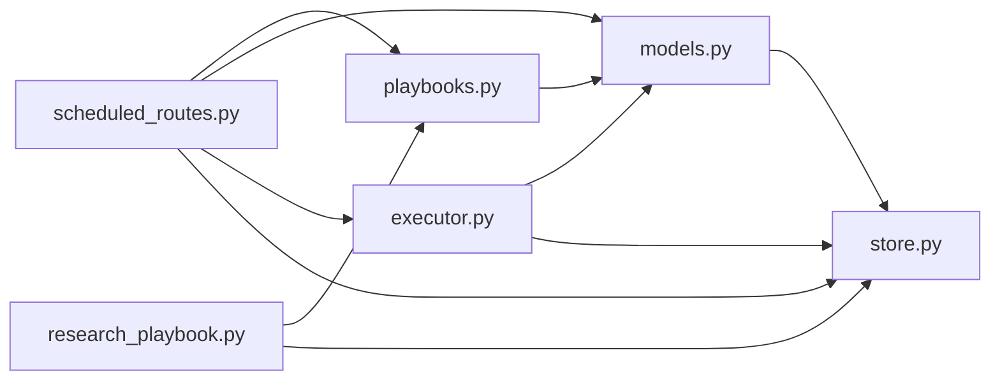

# 研究计划管理

<cite>
**本文引用的文件**
- [models.py](file://agent/src/scheduled_research/models.py)
- [executor.py](file://agent/src/scheduled_research/executor.py)
- [store.py](file://agent/src/scheduled_research/store.py)
- [playbooks.py](file://agent/src/scheduled_research/playbooks.py)
- [premarket-brief.md](file://agent/src/scheduled_research/playbooks/premarket-brief.md)
- [portfolio-checkup.md](file://agent/src/scheduled_research/playbooks/portfolio-checkup.md)
- [scheduled_routes.py](file://agent/src/api/scheduled_routes.py)
- [research_playbook.py](file://agent/cli/commands/research_playbook.py)
</cite>

## 目录
1. [简介](#简介)
2. [项目结构](#项目结构)
3. [核心组件](#核心组件)
4. [架构总览](#架构总览)
5. [详细组件分析](#详细组件分析)
6. [依赖关系分析](#依赖关系分析)
7. [性能与可靠性](#性能与可靠性)
8. [故障排查指南](#故障排查指南)
9. [结论](#结论)
10. [附录：计划模板规范与示例](#附录：计划模板规范与示例)

## 简介
本技术文档面向研究人员与量化分析师，系统化说明“研究计划管理系统”的定义、结构与实现。该系统支持以自然语言驱动的“研究计划（Playbook）”进行定时或周期化执行，具备版本化的计划模板、严格的调度语法校验、可恢复的持久化存储、以及通过会话运行时将计划派发到智能体执行的完整链路。文档覆盖以下主题：
- 计划定义与结构：YAML/JSON 格式规范、字段定义、语法验证
- 版本控制机制：计划版本演进、变更追踪、回滚策略
- 模板系统：内置模板、自定义模板、变量替换与继承思路
- 依赖关系管理：任务依赖、数据依赖、条件执行
- 执行引擎：解析器、验证器、执行器等核心组件
- 部署与管理工具：REST API 与 CLI 使用方法
- 实战示例：从简单定期报告到复杂多步骤研究流程

## 项目结构
研究计划管理位于 agent 后端模块中，围绕 scheduled_research 子包构建，配合 FastAPI 路由与 CLI 命令暴露能力。

图表来源
- [playbooks.py:1-60](file://agent/src/scheduled_research/playbooks.py#L1-L60)
- [models.py:197-328](file://agent/src/scheduled_research/models.py#L197-L328)
- [store.py:59-167](file://agent/src/scheduled_research/store.py#L59-L167)
- [executor.py:160-224](file://agent/src/scheduled_research/executor.py#L160-L224)
- [scheduled_routes.py:233-335](file://agent/src/api/scheduled_routes.py#L233-L335)
- [research_playbook.py:459-535](file://agent/cli/commands/research_playbook.py#L459-L535)

章节来源
- [playbooks.py:1-60](file://agent/src/scheduled_research/playbooks.py#L1-L60)
- [models.py:197-328](file://agent/src/scheduled_research/models.py#L197-L328)
- [store.py:59-167](file://agent/src/scheduled_research/store.py#L59-L167)
- [executor.py:160-224](file://agent/src/scheduled_research/executor.py#L160-L224)
- [scheduled_routes.py:233-335](file://agent/src/api/scheduled_routes.py#L233-L335)
- [research_playbook.py:459-535](file://agent/cli/commands/research_playbook.py#L459-L535)

## 核心组件
- 模型与校验（models.py）
  - 定义 ScheduledResearchJob 数据类，包含 id、prompt、schedule、next_run_at、status、created_at、last_run_at、consecutive_failures、last_error、failure_kind、config、timezone 等字段。
  - 提供 schedule 校验（毫秒间隔或简化 5 字段 cron）、时区形状与可解析校验、状态枚举 JobStatus。
  - 提供 to_dict/from_dict 序列化/反序列化，保证跨进程/重启一致性。
- 存储（store.py）
  - 基于 JSON 的原子写入（临时文件 + fsync + os.replace + 父目录 fsync），崩溃安全。
  - load/save/upsert/get/list_jobs/delete 等基础操作；损坏文件隔离（quarantine）。
- 执行器（executor.py）
  - 后台轮询 due 任务，调用注入的 dispatch 回调（通过会话服务发送 prompt）。
  - next_due 计算下一次触发时间（支持 interval/cron + IANA 时区），DST 处理策略明确。
  - 失败重试与退避、连续失败上限、恢复卡住的 RUNNING 任务。
- 模板系统（playbooks.py）
  - 以 Markdown + YAML frontmatter 描述模板元数据与指令正文。
  - 支持变量声明与占位符替换、slug 命名规范、目录优先级（用户覆盖内置）。
  - to_job 将模板渲染为 ScheduledResearchJob，自动设置首次触发时间。
- 接口层（scheduled_routes.py）
  - REST 路由：创建/查询/删除计划、列出/获取/基于模板创建计划。
  - 统一使用 models 与 playbooks 的校验规则，确保两端一致。
- CLI（research_playbook.py）
  - 提供 playbook list/show/create 子命令，直接写入 store，便于本地快速编排。
  - 支持 --var、--schedule、--timezone/--utc、--dry-run、--json 等选项。

章节来源
- [models.py:197-328](file://agent/src/scheduled_research/models.py#L197-L328)
- [store.py:59-167](file://agent/src/scheduled_research/store.py#L59-L167)
- [executor.py:160-224](file://agent/src/scheduled_research/executor.py#L160-L224)
- [playbooks.py:79-211](file://agent/src/scheduled_research/playbooks.py#L79-L211)
- [scheduled_routes.py:117-224](file://agent/src/api/scheduled_routes.py#L117-L224)
- [research_playbook.py:459-631](file://agent/cli/commands/research_playbook.py#L459-L631)

## 架构总览
系统由“模板 → 模型 → 存储 → 执行器 → 会话运行时”构成闭环，REST 与 CLI 作为入口。

图表来源
- [scheduled_routes.py:417-481](file://agent/src/api/scheduled_routes.py#L417-L481)
- [playbooks.py:142-211](file://agent/src/scheduled_research/playbooks.py#L142-L211)
- [store.py:138-167](file://agent/src/scheduled_research/store.py#L138-L167)
- [executor.py:266-315](file://agent/src/scheduled_research/executor.py#L266-L315)
- [scheduled_routes.py:60-95](file://agent/src/api/scheduled_routes.py#L60-L95)

## 详细组件分析

### 模型与调度校验（models.py）
- 数据结构
  - ScheduledResearchJob：承载计划全生命周期状态，支持 to_dict/from_dict 稳定序列化。
  - JobStatus：pending/running/completed/failed/cancelled。
- 调度语法
  - 支持两种形式：正整数毫秒间隔字符串，或简化 5 字段 cron（分钟/小时/日/月/周）。
  - 字段范围严格校验，支持 */n、逗号分隔、区间，周日=0 约定。
  - 时区校验分两步：validate_timezone_shape（仅形状）与 validate_timezone（可解析 IANA key）。
- 复杂度
  - 校验函数均为 O(n) 级别（n 为表达式长度），无递归，适合高频调用。

图表来源
- [models.py:27-139](file://agent/src/scheduled_research/models.py#L27-L139)
- [models.py:142-176](file://agent/src/scheduled_research/models.py#L142-L176)

章节来源
- [models.py:197-328](file://agent/src/scheduled_research/models.py#L197-L328)
- [models.py:27-139](file://agent/src/scheduled_research/models.py#L27-L139)
- [models.py:142-176](file://agent/src/scheduled_research/models.py#L142-L176)

### 存储与原子性（store.py）
- 原子写入：临时文件 + fsync + os.replace + 父目录 fsync，避免部分写导致损坏。
- 损坏隔离：读取失败时将原文件重命名为 quarantined，抛出 CorruptStoreError。
- 读写接口：load/save/upsert/get/list_jobs/delete，支持按状态过滤与分页。
- 设计要点：upsert 在生命周期写入时可跳过校验（validate=False），确保已持久化记录能继续推进。

图表来源
- [store.py:59-167](file://agent/src/scheduled_research/store.py#L59-L167)

章节来源
- [store.py:59-167](file://agent/src/scheduled_research/store.py#L59-L167)
- [store.py:222-273](file://agent/src/scheduled_research/store.py#L222-L273)

### 执行器与调度（executor.py）
- 轮询与派发：周期性 tick，筛选 due 任务，标记 RUNNING，调用 dispatch 回调（通过会话服务发送 prompt）。
- 下次触发计算：next_due 支持 interval/cron + IANA 时区，DST 缺失时刻跳过，重叠时刻取第一次。
- 失败与重试：记录 consecutive_failures，指数退避，达到上限置 FAILED；调度推进失败也置 FAILED。
- 恢复机制：启动时恢复上次未完成的 RUNNING 任务为 PENDING，避免僵尸任务。

图表来源
- [executor.py:64-158](file://agent/src/scheduled_research/executor.py#L64-L158)
- [executor.py:266-452](file://agent/src/scheduled_research/executor.py#L266-L452)
- [scheduled_routes.py:60-95](file://agent/src/api/scheduled_routes.py#L60-L95)

章节来源
- [executor.py:64-158](file://agent/src/scheduled_research/executor.py#L64-L158)
- [executor.py:160-224](file://agent/src/scheduled_research/executor.py#L160-L224)
- [executor.py:266-452](file://agent/src/scheduled_research/executor.py#L266-L452)

### 模板系统与变量（playbooks.py）
- 模板格式：Markdown + YAML frontmatter，必需字段 name/description/suggested_schedule/data_capabilities，可选 suggested_timezone/markets/variables。
- 变量替换：body 中使用 {{var}}，必须在 variables 中声明；值长度限制防止膨胀。
- 目录优先级：环境变量指定的目录优先于内置目录，同名 slug 用户覆盖内置。
- 生成计划：to_job 根据 schedule/timezone 计算首次触发时间，默认 PENDING。

图表来源
- [playbooks.py:79-211](file://agent/src/scheduled_research/playbooks.py#L79-L211)
- [playbooks.py:250-330](file://agent/src/scheduled_research/playbooks.py#L250-L330)

章节来源
- [playbooks.py:79-211](file://agent/src/scheduled_research/playbooks.py#L79-L211)
- [playbooks.py:250-330](file://agent/src/scheduled_research/playbooks.py#L250-L330)
- [playbooks.py:333-419](file://agent/src/scheduled_research/playbooks.py#L333-L419)

### 接口与命令行（scheduled_routes.py, research_playbook.py）
- REST API
  - POST /scheduled-runs：创建/替换计划，校验 schedule/timezone，计算首次触发时间。
  - GET /scheduled-runs：列表查询，支持 status 过滤与 limit。
  - DELETE /scheduled-runs/{job_id}：删除计划。
  - GET /scheduled-runs/playbooks：列出模板（不含 body）。
  - GET /scheduled-runs/playbooks/{slug}：获取模板详情（含 body）。
  - POST /scheduled-runs/playbooks/{slug}：基于模板创建计划，支持变量覆盖与时区/调度覆盖。
- CLI
  - vibe-trading playbook list/show/create：列出、预览、创建计划；支持 --var、--schedule、--timezone/--utc、--id、--dry-run、--json。
  - REPL 斜杠命令 /playbook：交互式查看与运行。

图表来源
- [scheduled_routes.py:259-335](file://agent/src/api/scheduled_routes.py#L259-L335)
- [scheduled_routes.py:375-481](file://agent/src/api/scheduled_routes.py#L375-L481)
- [research_playbook.py:459-631](file://agent/cli/commands/research_playbook.py#L459-L631)

章节来源
- [scheduled_routes.py:259-335](file://agent/src/api/scheduled_routes.py#L259-L335)
- [scheduled_routes.py:375-481](file://agent/src/api/scheduled_routes.py#L375-L481)
- [research_playbook.py:459-631](file://agent/cli/commands/research_playbook.py#L459-L631)

## 依赖关系分析
- 模块耦合
  - executor 依赖 models（校验/枚举）、store（持久化）、tools.redaction（错误脱敏）。
  - playbooks 依赖 models（Job/校验）、config.accessor（路径配置）。
  - scheduled_routes 依赖 playbooks、models、executor（next_due）、store。
  - CLI 依赖 playbooks、store，直接写入 store 避免依赖 HTTP。
- 外部依赖
  - FastAPI/Pydantic：请求/响应建模与路由。
  - zoneinfo：IANA 时区解析。
  - yaml.safe_load：模板 frontmatter 解析。
- 潜在循环
  - 路由通过延迟 import 避免循环导入；playbooks 在 to_job 中按需引入 executor.next_due。

图表来源
- [executor.py:18-28](file://agent/src/scheduled_research/executor.py#L18-L28)
- [playbooks.py:42-49](file://agent/src/scheduled_research/playbooks.py#L42-L49)
- [scheduled_routes.py:19-21](file://agent/src/api/scheduled_routes.py#L19-L21)
- [research_playbook.py:187-211](file://agent/cli/commands/research_playbook.py#L187-L211)

章节来源
- [executor.py:18-28](file://agent/src/scheduled_research/executor.py#L18-L28)
- [playbooks.py:42-49](file://agent/src/scheduled_research/playbooks.py#L42-L49)
- [scheduled_routes.py:19-21](file://agent/src/api/scheduled_routes.py#L19-L21)
- [research_playbook.py:187-211](file://agent/cli/commands/research_playbook.py#L187-L211)

## 性能与可靠性
- 性能
  - 调度校验与 next_due 计算为轻量级 CPU 操作，适合高频 tick。
  - 模板渲染与变量替换开销与模板大小线性相关，变量长度限制防止异常膨胀。
  - 存储采用原子写入，避免锁竞争；读多写少场景下负载可控。
- 可靠性
  - 崩溃恢复：store 损坏隔离；executor 启动恢复卡住的 RUNNING 任务。
  - 失败重试：指数退避 + 最大连续失败阈值，避免雪崩。
  - DST 处理：不存在时刻跳过，模糊时刻取第一次，保证语义稳定。
- 建议
  - 合理设置 tick_interval_ms 与 retry 参数，平衡实时性与资源占用。
  - 对高并发场景，考虑将 store 迁移至数据库以实现更高吞吐与并发安全。

[本节为通用指导，不直接分析具体文件]

## 故障排查指南
- 常见错误
  - 计划调度语法错误：检查 schedule 是否为正整数或 5 字段 cron，字段范围与步长是否正确。
  - 时区不可解析：确认 IANA 时区键存在且非空；interval 模式忽略时区。
  - 模板变量未声明或超长：确保 variables 中声明所有占位符，单值不超过长度限制。
  - 存储损坏：检查 quarantine 文件，定位解析失败原因后修复。
- 定位方法
  - 查看 last_error/failure_kind 与 consecutive_failures，判断是调度推进失败还是派发失败。
  - 使用 CLI playbook show 预览模板渲染结果，确认 prompt 符合预期。
  - 通过 REST GET /scheduled-runs 查看最近计划状态与错误信息。

章节来源
- [models.py:115-176](file://agent/src/scheduled_research/models.py#L115-L176)
- [playbooks.py:110-140](file://agent/src/scheduled_research/playbooks.py#L110-L140)
- [store.py:41-57](file://agent/src/scheduled_research/store.py#L41-L57)
- [executor.py:340-452](file://agent/src/scheduled_research/executor.py#L340-L452)

## 结论
该研究计划管理系统以“自然语言驱动 + 严格校验 + 可靠执行”为核心，提供了从模板定义、计划编排、定时调度到执行落地的完整能力。通过统一的校验规则与原子存储，确保了跨进程与重启的一致性；通过执行器的恢复与重试机制，提升了鲁棒性。结合 REST 与 CLI，既适合自动化集成，也便于研究人员快速上手。

[本节为总结，不直接分析具体文件]

## 附录：计划模板规范与示例

### 模板规范（YAML frontmatter + Markdown）
- 必需字段
  - name：人类可读标题
  - description：一句话摘要
  - suggested_schedule：默认调度（毫秒间隔或 5 字段 cron）
  - data_capabilities：所需数据能力（自然语言描述，不绑定具体工具）
- 可选字段
  - suggested_timezone：默认时区（IANA key，可为 null 表示 UTC）
  - markets：目标市场标签
  - variables：变量名到默认值的映射
- 正文
  - 使用 {{variable}} 占位符，必须在 variables 中声明
  - 正文即最终 prompt，不得硬编码日期或工具名

章节来源
- [playbooks.py:79-108](file://agent/src/scheduled_research/playbooks.py#L79-L108)
- [playbooks.py:250-330](file://agent/src/scheduled_research/playbooks.py#L250-L330)

### 内置模板示例
- 盘前简报（premarket-brief.md）
  - 用途：开盘前汇总隔夜市场变动与当日关注项
  - 调度：工作日早间（cron 示例）
  - 变量：home_market、watchlist
- 投资组合体检（portfolio-checkup.md）
  - 用途：组合风险透视（波动率、相关性、回撤）
  - 调度：周末（cron 示例）
  - 变量：holdings、benchmark、lookback_days

章节来源
- [premarket-brief.md:1-100](file://agent/src/scheduled_research/playbooks/premarket-brief.md#L1-L100)
- [portfolio-checkup.md:1-111](file://agent/src/scheduled_research/playbooks/portfolio-checkup.md#L1-L111)

### 计划版本控制机制
- 版本演进
  - 模板以 slug 标识，用户可通过同 slug 文件覆盖内置模板，实现“用户优先”的版本策略。
  - 计划实例（ScheduledResearchJob）通过 created_at 区分不同版本的生命周期，避免重复派发。
- 变更追踪
  - 存储中的 job 记录 last_error、failure_kind、consecutive_failures，便于审计与回溯。
  - 模板变更会反映在后续创建的 job 的 prompt 中，历史 job 保持不变。
- 回滚支持
  - 若新版本模板存在问题，可将旧版模板文件恢复至用户目录，覆盖新模板。
  - 对已有 job，可通过重新创建相同 id 的计划（带新的 config/prompt）实现“逻辑回滚”。

章节来源
- [playbooks.py:333-419](file://agent/src/scheduled_research/playbooks.py#L333-L419)
- [models.py:197-328](file://agent/src/scheduled_research/models.py#L197-L328)
- [executor.py:771-797](file://agent/src/scheduled_research/executor.py#L771-L797)

### 依赖关系管理（任务/数据/条件）
- 任务依赖
  - 当前系统以独立 job 为单位调度，未内置 DAG 依赖；可通过多个 job 与共享数据文件间接实现顺序依赖。
- 数据依赖
  - 模板通过 data_capabilities 声明所需数据能力，实际数据获取由智能体在运行时决定。
- 条件执行
  - 可在模板正文中加入条件逻辑（如“若无 watchlist 则跳过某节”），由智能体在执行时遵循。

[本节为概念性说明，不直接分析具体文件]

### 计划执行引擎（解析器/验证器/执行器）
- 解析器
  - 模板解析：frontmatter YAML + Markdown 正文，变量占位符识别。
  - 调度解析：interval/cron 语法解析与展开。
- 验证器
  - 调度语法与时区校验；模板变量声明与长度限制；slug 命名规范。
- 执行器
  - 轮询 due 任务，派发至会话服务，更新状态与下次触发时间，失败重试与恢复。

章节来源
- [playbooks.py:250-330](file://agent/src/scheduled_research/playbooks.py#L250-L330)
- [models.py:27-139](file://agent/src/scheduled_research/models.py#L27-L139)
- [executor.py:64-158](file://agent/src/scheduled_research/executor.py#L64-L158)

### 部署与管理工具
- REST API
  - 创建计划：POST /scheduled-runs
  - 查询计划：GET /scheduled-runs?status=&limit=
  - 删除计划：DELETE /scheduled-runs/{job_id}
  - 模板目录：GET /scheduled-runs/playbooks
  - 模板详情：GET /scheduled-runs/playbooks/{slug}
  - 基于模板创建：POST /scheduled-runs/playbooks/{slug}
- CLI
  - vibe-trading playbook list：列出模板
  - vibe-trading playbook show <slug> [--var ...]：预览模板
  - vibe-trading playbook create <slug> [--schedule ...] [--timezone ...] [--utc] [--var ...] [--id ...] [--dry-run] [--json]：创建计划

章节来源
- [scheduled_routes.py:259-481](file://agent/src/api/scheduled_routes.py#L259-L481)
- [research_playbook.py:459-631](file://agent/cli/commands/research_playbook.py#L459-L631)

### 实战示例
- 简单定期报告
  - 使用 premarket-brief.md，设置工作日早间 cron，传入 home_market 与 watchlist 变量。
- 复杂多步骤研究流程
  - 组合多个模板：先跑 portfolio-checkup 生成风险报告，再基于结果构造下一个模板的变量，形成链式研究流程。
  - 通过 CLI 或 API 依次创建多个 job，利用共享数据文件或会话上下文传递中间结果。

章节来源
- [premarket-brief.md:1-100](file://agent/src/scheduled_research/playbooks/premarket-brief.md#L1-L100)
- [portfolio-checkup.md:1-111](file://agent/src/scheduled_research/playbooks/portfolio-checkup.md#L1-L111)
- [research_playbook.py:577-623](file://agent/cli/commands/research_playbook.py#L577-L623)