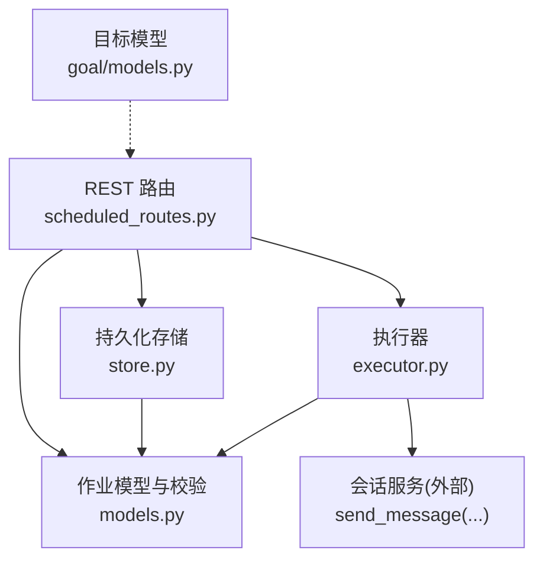
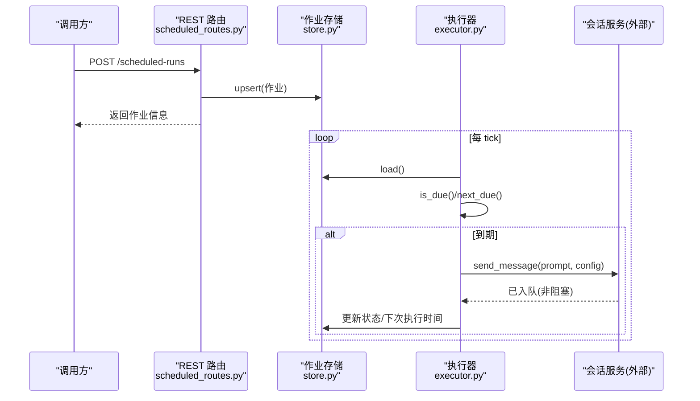
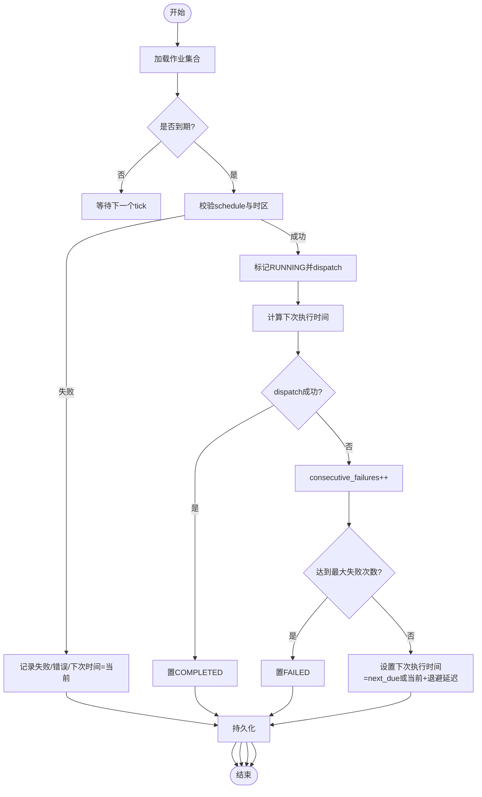
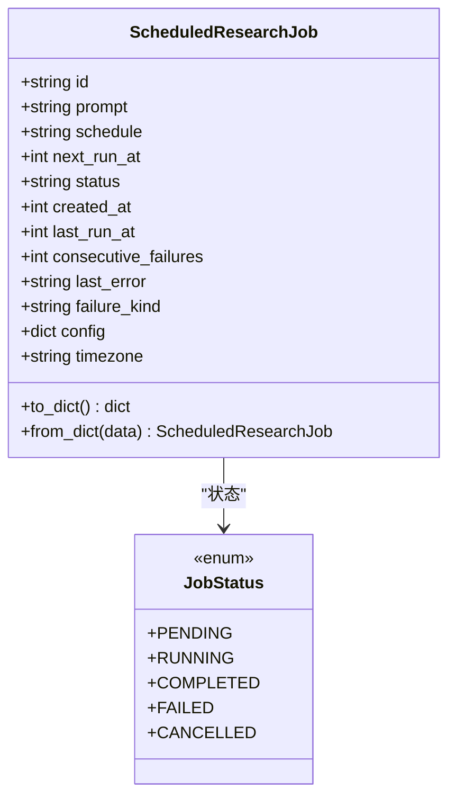
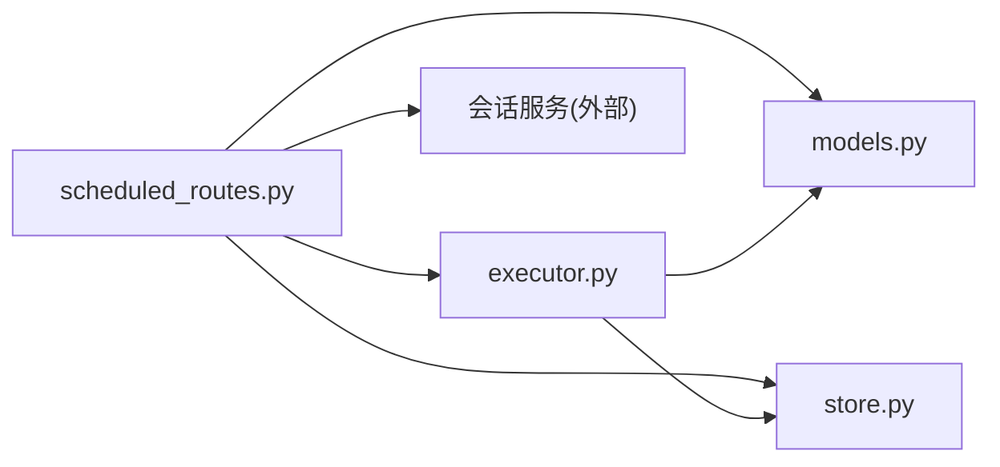

# 调度研究

<cite>
**本文引用的文件**
- [README.md](file://README.md)
- [scheduled_routes.py](file://agent/src/api/scheduled_routes.py)
- [models.py](file://agent/src/scheduled_research/models.py)
- [store.py](file://agent/src/scheduled_research/store.py)
- [executor.py](file://agent/src/scheduled_research/executor.py)
- [__init__.py](file://agent/src/scheduled_research/__init__.py)
- [goal_models.py](file://agent/src/goal/models.py)
</cite>

## 目录
1. [简介](#简介)
2. [项目结构](#项目结构)
3. [核心组件](#核心组件)
4. [架构总览](#架构总览)
5. [详细组件分析](#详细组件分析)
6. [依赖关系分析](#依赖关系分析)
7. [性能考虑](#性能考虑)
8. [故障诊断与排错](#故障诊断与排错)
9. [结论](#结论)
10. [附录：API 与配置参考](#附录api-与配置参考)

## 简介
本技术文档面向“调度研究”子系统，聚焦以下目标：
- 定时任务执行机制：任务调度、执行引擎、失败重试与恢复。
- 研究计划管理：计划定义、版本化存储、依赖与模板（Playbook）。
- 报告生成系统：以会话运行产物为结果载体，结合模板与数据绑定输出。
- 工作流编排：任务编排、状态管理、结果聚合。
- 目标驱动研究：目标分解、策略生成、执行监控。
- 团队协作：任务分配、进度跟踪、知识共享。
- 性能监控与故障诊断：可观测性、错误归因、恢复策略。
- 实际应用场景：从定期报告到复杂研究任务的自动化执行。

该子系统通过 REST API 暴露计划创建与管理能力，使用轻量级 Cron/间隔调度器在后台轮询触发，将研究任务投递给会话运行时执行，并以持久化存储保证崩溃安全与可审计性。

## 项目结构
调度研究相关代码集中在 agent/src/scheduled_research 与 agent/src/api/scheduled_routes.py，配合 goal 模块提供目标驱动的研究上下文。

图表来源
- [scheduled_routes.py:233-482](file://agent/src/api/scheduled_routes.py#L233-L482)
- [models.py:1-328](file://agent/src/scheduled_research/models.py#L1-L328)
- [store.py:1-273](file://agent/src/scheduled_research/store.py#L1-L273)
- [executor.py:1-452](file://agent/src/scheduled_research/executor.py#L1-L452)
- [goal_models.py:1-162](file://agent/src/goal/models.py#L1-L162)

章节来源
- [scheduled_routes.py:233-482](file://agent/src/api/scheduled_routes.py#L233-L482)
- [models.py:1-328](file://agent/src/scheduled_research/models.py#L1-L328)
- [store.py:1-273](file://agent/src/scheduled_research/store.py#L1-L273)
- [executor.py:1-452](file://agent/src/scheduled_research/executor.py#L1-L452)
- [goal_models.py:1-162](file://agent/src/goal/models.py#L1-L162)

## 核心组件
- 作业模型与调度语法：支持“毫秒间隔”和“简化五字段 cron”，含时区支持与严格校验。
- 持久化存储：原子写入、损坏隔离、按 created_at 排序查询。
- 执行器：后台轮询、到期判定、失败重试（指数退避）、过期 RUNNING 恢复。
- REST 路由：创建/列出/删除计划、从 Playbook 创建计划、模板目录浏览。
- 目标驱动：GoalRecord/Evidence/AuditRow 等用于追踪研究目标、证据与合规。

章节来源
- [models.py:23-176](file://agent/src/scheduled_research/models.py#L23-L176)
- [store.py:59-216](file://agent/src/scheduled_research/store.py#L59-L216)
- [executor.py:160-452](file://agent/src/scheduled_research/executor.py#L160-L452)
- [scheduled_routes.py:117-224](file://agent/src/api/scheduled_routes.py#L117-L224)
- [goal_models.py:10-162](file://agent/src/goal/models.py#L10-L162)

## 架构总览
调度研究由“API 层 + 调度器 + 执行器 + 存储 + 会话运行时”构成。API 负责计划 CRUD 与模板；执行器周期性扫描到期任务并投递至会话运行时；存储保证崩溃安全；目标模型贯穿研究与证据链。

图表来源
- [scheduled_routes.py:259-335](file://agent/src/api/scheduled_routes.py#L259-L335)
- [executor.py:266-415](file://agent/src/scheduled_research/executor.py#L266-L415)
- [store.py:85-166](file://agent/src/scheduled_research/store.py#L85-L166)

## 详细组件分析

### 定时任务执行机制
- 调度语法
  - 间隔模式：正整数毫秒字符串，忽略时区。
  - Cron 模式：五字段表达式，支持 *、*/n、逗号列表与范围，严格边界校验。
  - 时区：IANA 键，Cron 基于本地墙钟评估；DST 空档跳过、重叠只执行一次。
- 到期判定与推进
  - is_due：排除已取消/运行中/失败的任务，比较 next_run_at。
  - next_due：间隔直接加偏移；Cron 按日/小时/分钟搜索最近匹配时刻。
- 执行流程
  - 后台循环 tick：加载作业、筛选到期、逐个执行。
  - _run_job：校验 schedule -> 标记 RUNNING -> 调用 dispatch -> 计算下次执行时间 -> 成功置 COMPLETED，失败累计 consecutive_failures 并按指数退避重试，达到阈值置 FAILED。
  - 恢复：启动时把残留 RUNNING 重置为 PENDING，避免僵尸任务。
- 失败重试
  - 指数退避：base_delay * 2^(k-1)，上限 max_delay。
  - 连续失败计数：超过阈值后终止，需人工干预或修改计划。

图表来源
- [executor.py:64-158](file://agent/src/scheduled_research/executor.py#L64-L158)
- [executor.py:340-452](file://agent/src/scheduled_research/executor.py#L340-L452)
- [models.py:115-176](file://agent/src/scheduled_research/models.py#L115-L176)

章节来源
- [executor.py:64-158](file://agent/src/scheduled_research/executor.py#L64-L158)
- [executor.py:266-452](file://agent/src/scheduled_research/executor.py#L266-L452)
- [models.py:115-176](file://agent/src/scheduled_research/models.py#L115-L176)

### 研究计划管理（定义、版本控制、依赖）
- 计划定义
  - 字段：id、prompt、schedule、next_run_at、status、created_at、last_run_at、consecutive_failures、last_error、failure_kind、config、timezone。
  - 支持两种 schedule 形式与可选 IANA 时区。
- 版本控制
  - 存储采用 JSON 信封 schema_version 与 jobs 数组；upsert 覆盖同一 id 的记录，保留 created_at 区分替换。
  - 读取时容错：不可解析的 store 会被隔离 quarantine，不阻断其他作业。
- 依赖与模板（Playbook）
  - 提供 /scheduled-runs/playbooks 目录接口，支持按 slug 获取模板详情与变量占位。
  - 从模板创建计划时，模板 body 原样成为 prompt，变量在 to_job 阶段注入，schedule/timezone 复用统一校验逻辑。

图表来源
- [models.py:182-328](file://agent/src/scheduled_research/models.py#L182-L328)

章节来源
- [models.py:197-328](file://agent/src/scheduled_research/models.py#L197-L328)
- [store.py:85-166](file://agent/src/scheduled_research/store.py#L85-L166)
- [scheduled_routes.py:375-482](file://agent/src/api/scheduled_routes.py#L375-L482)

### 报告生成系统（模板引擎、数据绑定、格式输出）
- 模板引擎
  - Playbook 作为自然语言指令模板，包含变量占位与推荐 schedule/timezone。
  - 模板解析与变量注入在 to_job 中完成，确保与直接创建计划的校验一致。
- 数据绑定
  - config 透传至会话运行时，承载回测参数或其他上下文。
  - prompt 携带研究需求，运行时由 Agent 工具链拉取数据并产出报告。
- 格式输出
  - 报告以会话运行产物形式存在（如 run artifacts），可通过 Web UI 的“Run Detail/Reports Library”查看与对比。
  - 调度器本身不渲染报告，仅负责触发与状态流转。

章节来源
- [scheduled_routes.py:234-290](file://agent/src/api/scheduled_routes.py#L234-L290)
- [scheduled_routes.py:417-482](file://agent/src/api/scheduled_routes.py#L417-L482)
- [README.md:21-30](file://README.md#L21-L30)

### 工作流编排（任务编排、状态管理、结果聚合）
- 任务编排
  - 通过 REST 创建计划或从模板创建，统一进入调度队列。
  - 执行器按 next_run_at 顺序调度，单 tick 内串行处理每个到期作业。
- 状态管理
  - 生命周期：PENDING → RUNNING → COMPLETED/FAILED；支持 CANCELLED。
  - 失败分类：dispatch 失败 vs schedule 推进失败，分别记录 last_error/failure_kind。
- 结果聚合
  - 每次运行产生会话与 run artifacts；Web UI 提供 Reports Library 进行检索、过滤与对比。
  - 指标与风险透视（如 risk x-ray）由运行产物提供，供后续分析。

章节来源
- [executor.py:266-415](file://agent/src/scheduled_research/executor.py#L266-L415)
- [scheduled_routes.py:259-365](file://agent/src/api/scheduled_routes.py#L259-L365)
- [README.md:21-30](file://README.md#L21-L30)

### 目标驱动研究（目标分解、策略生成、执行监控）
- 目标分解
  - GoalRecord 描述目标、协议、风险等级与预算；Evidence/AuditRow 记录证据与完成审计。
- 策略生成
  - 研究计划 prompt 可包含信号/因子/回测要求，Agent 在运行时生成策略并执行。
- 执行监控
  - 通过计划状态与运行卡片观察进度；失败时记录错误与重试次数，便于定位问题。

章节来源
- [goal_models.py:10-162](file://agent/src/goal/models.py#L10-L162)
- [executor.py:340-415](file://agent/src/scheduled_research/executor.py#L340-L415)

### 团队协作（任务分配、进度跟踪、知识共享）
- 任务分配
  - 通过计划 id 标识不同研究任务，可由多角色协作维护。
- 进度跟踪
  - REST 列出/过滤计划状态；Web UI 展示运行详情与报告库。
- 知识共享
  - 运行产物与报告沉淀于用户运行时目录，便于团队查阅与复现。

章节来源
- [scheduled_routes.py:337-365](file://agent/src/api/scheduled_routes.py#L337-L365)
- [store.py:179-216](file://agent/src/scheduled_research/store.py#L179-L216)
- [README.md:21-30](file://README.md#L21-L30)

## 依赖关系分析
- 模块耦合
  - scheduled_routes 依赖 models、store、executor 以及外部会话服务。
  - executor 强依赖 models 的调度语法与状态枚举，依赖 store 做持久化。
  - store 依赖 models 的序列化/反序列化与路径配置。
- 外部依赖
  - 会话服务：接收 prompt 与 config 并异步执行研究任务。
  - 时区库：ZoneInfo 用于 cron 时区解析与 DST 处理。
- 潜在环依赖
  - 通过延迟导入（import inside function）避免启动期环引用。

图表来源
- [scheduled_routes.py:233-482](file://agent/src/api/scheduled_routes.py#L233-L482)
- [executor.py:1-452](file://agent/src/scheduled_research/executor.py#L1-L452)
- [store.py:1-273](file://agent/src/scheduled_research/store.py#L1-L273)
- [models.py:1-328](file://agent/src/scheduled_research/models.py#L1-L328)

章节来源
- [scheduled_routes.py:233-482](file://agent/src/api/scheduled_routes.py#L233-L482)
- [executor.py:1-452](file://agent/src/scheduled_research/executor.py#L1-L452)
- [store.py:1-273](file://agent/src/scheduled_research/store.py#L1-L273)
- [models.py:1-328](file://agent/src/scheduled_research/models.py#L1-L328)

## 性能考虑
- 调度轮询间隔：默认每分钟 tick，可按需调整以减少 CPU 占用。
- Cron 搜索窗口：按日粒度向前最多搜索约四年，避免长时间扫描。
- 存储 I/O：原子写入 + fsync，保证崩溃安全但带来一定磁盘开销。
- 重试策略：指数退避限制最大延迟，避免风暴式重试。
- 时区解析：仅在 cron 模式下解析 ZoneInfo，间隔模式跳过以避免不必要开销。

[本节为通用指导，无需特定文件来源]

## 故障诊断与排错
- 常见错误
  - schedule 非法：创建或执行时抛出 422，检查字段是否为毫秒间隔或合法五字段 cron。
  - 时区不可解析：cron 模式需要可解析的 IANA 键；若不可用，建议改用 UTC 或间隔模式。
  - 存储损坏：load 抛异常并将原文件隔离为 quarantined 文件，需人工修复或删除。
  - 连续失败：超过最大失败次数后任务置 FAILED，需检查 last_error 与 failure_kind。
- 排查步骤
  - 查看计划列表与状态，关注 last_error、consecutive_failures、failure_kind。
  - 检查日志中的调度推进失败与 dispatch 失败堆栈。
  - 确认环境变量 VIBE_TRADING_ENABLE_SCHEDULER 是否开启。
  - 若为 cron 任务，验证时区与 DST 行为是否符合预期。

章节来源
- [scheduled_routes.py:259-335](file://agent/src/api/scheduled_routes.py#L259-L335)
- [executor.py:340-415](file://agent/src/scheduled_research/executor.py#L340-L415)
- [store.py:85-108](file://agent/src/scheduled_research/store.py#L85-L108)

## 结论
调度研究子系统提供了稳定、可审计、可恢复的定时研究任务能力。通过严格的调度语法与时区处理、原子持久化、失败重试与恢复机制，能够支撑从简单定期报告到复杂研究任务的自动化执行。结合目标驱动与报告库，可为研究人员与运维人员提供端到端的可观测性与可追溯性。

[本节为总结，无需特定文件来源]

## 附录：API 与配置参考
- 关键端点
  - POST /scheduled-runs：创建或替换计划。
  - GET /scheduled-runs：列出计划，支持 status 过滤。
  - DELETE /scheduled-runs/{job_id}：删除计划。
  - GET /scheduled-runs/playbooks：模板目录。
  - GET /scheduled-runs/playbooks/{slug}：模板详情。
  - POST /scheduled-runs/playbooks/{slug}：从模板创建计划。
- 请求体关键字段
  - id：可选，符合安全规则（字母数字、下划线、短横线，长度 1-128）。
  - prompt：研究提示或回测描述。
  - schedule：毫秒间隔或五字段 cron。
  - timezone：IANA 时区键（cron 模式有效）。
  - config：透传给会话运行的配置字典。
  - next_run_at：首次执行时间（毫秒时间戳），未指定时按默认规则计算。
- 环境变量
  - VIBE_TRADING_ENABLE_SCHEDULER：启用/禁用调度器执行。
  - 其他调度调优参数（如最大连续失败次数、重试延迟）来自环境配置访问器。

章节来源
- [scheduled_routes.py:117-224](file://agent/src/api/scheduled_routes.py#L117-L224)
- [scheduled_routes.py:259-482](file://agent/src/api/scheduled_routes.py#L259-L482)
- [executor.py:32-62](file://agent/src/scheduled_research/executor.py#L32-L62)