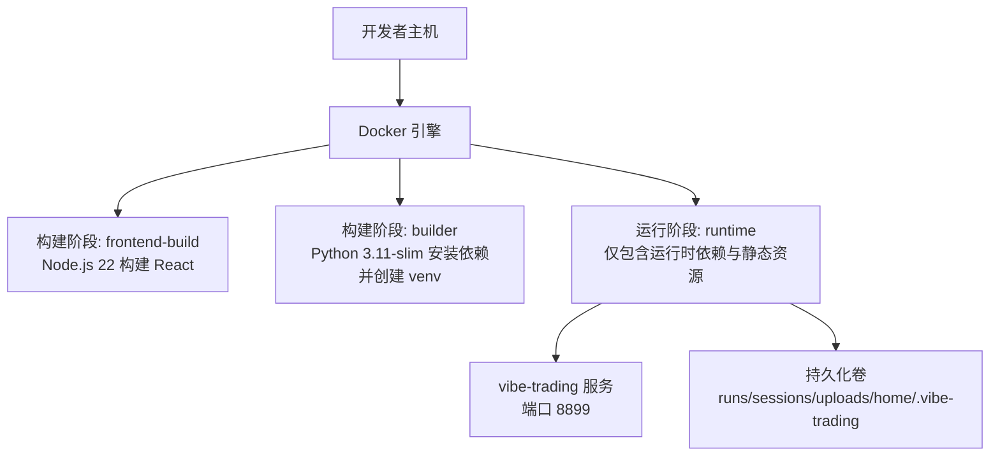
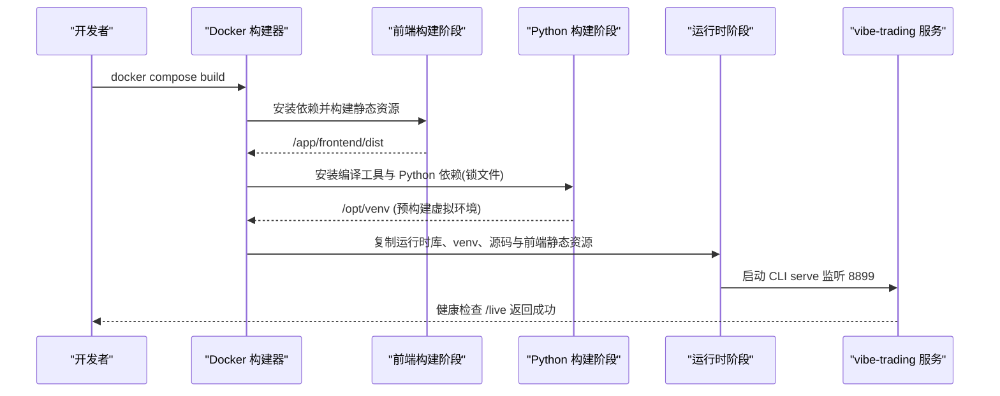
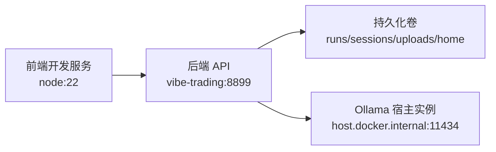

# Docker 容器化部署

<cite>
**本文引用的文件**
- [Dockerfile](file://Dockerfile)
- [docker-compose.yml](file://docker-compose.yml)
- [pyproject.toml](file://pyproject.toml)
- [agent/requirements.txt](file://agent/requirements.txt)
- [requirements-lock.txt](file://requirements-lock.txt)
- [requirements-channels-lock.txt](file://requirements-channels-lock.txt)
- [frontend/package.json](file://frontend/package.json)
</cite>

## 目录
1. [简介](#简介)
2. [项目结构](#项目结构)
3. [核心组件](#核心组件)
4. [架构总览](#架构总览)
5. [详细组件分析](#详细组件分析)
6. [依赖关系分析](#依赖关系分析)
7. [性能与镜像优化](#性能与镜像优化)
8. [故障排除指南](#故障排除指南)
9. [结论](#结论)
10. [附录](#附录)

## 简介
本文件面向使用 Docker 和 docker-compose 部署 Vibe-Trading 的工程师与运维人员，系统说明多阶段构建流程（前端构建、Python 依赖安装与虚拟环境隔离、运行时最小化镜像）、环境变量配置、用户权限管理、编排与服务网络、数据卷挂载、以及镜像优化与安全扫描最佳实践。文档同时提供常见部署场景与排障方法，帮助快速落地并稳定运行。

## 项目结构
仓库采用前后端分离：
- 前端：React + TypeScript + Vite，构建产物为静态资源，由后端服务在运行时作为静态文件提供。
- 后端：Python FastAPI 应用，暴露 HTTP API 与 SSE/WebSocket 能力，内置 CLI 入口用于启动服务。
- 构建与运行：通过 Dockerfile 的多阶段构建将前端构建产物与 Python 运行时合并；通过 docker-compose 编排服务、网络、数据卷与安全策略。

图表来源
- [Dockerfile:1-119](file://Dockerfile#L1-L119)
- [docker-compose.yml:1-90](file://docker-compose.yml#L1-L90)

章节来源
- [Dockerfile:1-119](file://Dockerfile#L1-L119)
- [docker-compose.yml:1-90](file://docker-compose.yml#L1-L90)

## 核心组件
- 多阶段 Dockerfile
  - 阶段一：前端构建（Node.js 22），生成静态资源 dist。
  - 阶段二：Python 构建器，安装编译工具、创建独立虚拟环境、基于锁文件安装依赖、安装可编辑包。
  - 阶段三：运行时镜像，仅复制必要运行时库、预构建 venv、源码树与前端静态资源，设置非 root 用户与健康检查。
- docker-compose 编排
  - 定义 vibe-trading 主服务与可选的 frontend 开发服务。
  - 配置端口映射、环境变量、extra_hosts、只读根文件系统、tmpfs 临时目录、资源限制、安全能力与重启策略。
  - 声明命名卷以持久化运行数据与用户状态。
- 依赖锁定与可复现构建
  - Python 依赖通过 requirements-lock.txt 与 requirements-channels-lock.txt 进行哈希校验安装，确保构建可重复且安全。
  - 前端依赖通过 package.json 与 npm ci 固定版本。

章节来源
- [Dockerfile:1-119](file://Dockerfile#L1-L119)
- [docker-compose.yml:1-90](file://docker-compose.yml#L1-L90)
- [requirements-lock.txt:1-20](file://requirements-lock.txt#L1-L20)
- [requirements-channels-lock.txt:1-20](file://requirements-channels-lock.txt#L1-L20)
- [frontend/package.json:1-58](file://frontend/package.json#L1-L58)

## 架构总览
下图展示了从构建到运行的完整流程，包括前端构建、Python 依赖安装、运行时镜像组装、服务启动与健康检查。

图表来源
- [Dockerfile:1-119](file://Dockerfile#L1-L119)
- [docker-compose.yml:1-90](file://docker-compose.yml#L1-L90)

## 详细组件分析

### 多阶段构建详解
- 前端构建阶段（Node.js 22）
  - 使用 node:22-slim 镜像，安装依赖并执行构建命令，输出静态资源至 dist 目录。
  - 该阶段不参与最终镜像，仅产出构建产物供后续阶段复用。
- Python 构建阶段（python:3.11-slim）
  - 安装编译工具链（build-essential），随后创建独立虚拟环境路径 /opt/venv。
  - 先复制依赖清单再复制源码，利用层缓存加速。
  - 通过 requirements-lock.txt 与 requirements-channels-lock.txt 以 --require-hashes 方式安装，保证可复现与安全。
  - 安装可编辑包（editable install），以便运行时引用源码树。
- 运行时阶段（python:3.11-slim）
  - 仅安装 weasyprint 所需的共享库与字体，不包含编译工具。
  - 复制预构建的虚拟环境与源码树，以及前端静态资源。
  - 创建非 root 用户 vibe 与无 shell 的系统用户 vibe-sandbox，设置目录权限后切换用户运行。
  - 暴露 8899 端口，配置健康检查访问 /live。
  - 默认启动命令调用 CLI 的 serve 子命令，绑定 0.0.0.0:8899。

章节来源
- [Dockerfile:1-119](file://Dockerfile#L1-L119)

### 环境变量配置
- PYTHONDONTWRITEBYTECODE=1
  - 禁止 Python 写入 .pyc 字节码，避免对只读根文件系统的写入请求。
- PYTHONUNBUFFERED=1
  - 关闭标准输出缓冲，便于日志实时查看与调试。
- OLLAMA_BASE_URL（compose 中默认指向 host.docker.internal:11434）
  - 当 Ollama 运行于宿主机时，容器内通过 host.docker.internal 访问宿主网络。
- VIBE_TRADING_TRUST_DOCKER_LOOPBACK=1
  - 允许在容器环境中信任本地回环地址，适配容器内代理或反向代理场景。
- VIBE_TW_STOCK_DB=/data/tw-stock/latest.db
  - 指定台湾股票数据库路径，配合只读数据卷挂载。

章节来源
- [Dockerfile:68-71](file://Dockerfile#L68-L71)
- [docker-compose.yml:6-19](file://docker-compose.yml#L6-L19)

### 用户权限管理
- 创建用户
  - vibe：拥有家目录与可写的应用数据目录，用于运行服务与写入持久化数据。
  - vibe-sandbox：无家目录、无登录 shell 的系统用户，UID 固定为 10001，用于以最小权限执行 LLM 生成的代码子进程。
- 目录与权限
  - 初始化 runs、sessions、uploads、.swarm/runs 与 /home/vibe/.vibe-trading 等目录，并将所有权赋给 vibe。
  - 运行时以 vibe 用户身份执行，降低风险面。
- 容器安全能力
  - 默认 drop ALL 能力，仅添加 SETUID/SETGID 以支持子进程降权。
  - 启用 no-new-privileges 防止提权。
  - 根文件系统设置为只读，并通过 tmpfs 挂载 /tmp 与缓存目录以满足 PDF 渲染等临时写入需求。

章节来源
- [Dockerfile:99-108](file://Dockerfile#L99-L108)
- [docker-compose.yml:40-65](file://docker-compose.yml#L40-L65)

### docker-compose 编排配置
- 服务定义
  - vibe-trading：构建镜像、映射端口、注入环境变量、挂载数据卷、配置安全与资源限制。
  - frontend（profile: frontend）：开发模式下的 Node 服务，热重载前端代码，指向后端 API 地址。
- 网络与主机解析
  - extra_hosts 将 host.docker.internal 映射到 host-gateway，使容器能访问宿主机网络（Linux 下必需）。
- 数据卷挂载
  - 持久化 agent/runs、agent/sessions、agent/uploads、agent/.swarm/runs 与 /home/vibe/.vibe-trading。
  - 将宿主机 ./agent/.env 挂载到容器内对应路径，保持配置变更持久化。
  - 将外部台湾股票数据目录以只读方式挂载到 /data/tw-stock。
- 资源限制
  - 内存上限 4g、CPU 限制 2、进程数上限 512，防止单任务耗尽资源。

章节来源
- [docker-compose.yml:1-90](file://docker-compose.yml#L1-L90)

### 前端构建与集成
- 前端技术栈
  - React + TypeScript + Vite，构建脚本 tsc -b && vite build，输出静态资源。
- 构建优化
  - 使用 node:22-slim 基础镜像，npm ci 安装依赖并忽略脚本执行，减少构建副作用。
  - 构建产物在运行时阶段被复制到镜像中，由后端服务作为静态资源提供。

章节来源
- [Dockerfile:1-12](file://Dockerfile#L1-L12)
- [frontend/package.json:1-58](file://frontend/package.json#L1-L58)

### Python 依赖与可复现构建
- 依赖来源
  - 主依赖：requirements-lock.txt，基于 agent/requirements.txt 生成，带 SHA256 哈希校验。
  - 通道 SDK：requirements-channels-lock.txt，单独锁定飞书与 Telegram 等通道依赖。
- 安装策略
  - 使用 pip install --require-hashes 严格校验，避免动态解析引入未锁定版本。
  - 可编辑安装（-e .）保留源码树引用，便于运行时加载技能、模板等资源。
- 版本约束
  - pyproject.toml 声明 Python 版本范围与核心依赖，确保兼容性与稳定性。

章节来源
- [Dockerfile:29-54](file://Dockerfile#L29-L54)
- [requirements-lock.txt:1-20](file://requirements-lock.txt#L1-L20)
- [requirements-channels-lock.txt:1-20](file://requirements-channels-lock.txt#L1-L20)
- [pyproject.toml:1-200](file://pyproject.toml#L1-L200)

## 依赖关系分析
- 构建期依赖
  - 前端：Node.js 22，Vite 构建管线。
  - Python：编译工具链（仅在构建阶段），虚拟环境隔离。
- 运行期依赖
  - 运行时镜像仅包含必要的系统库与 Python 依赖，前端静态资源由后端服务提供。
- 服务间依赖
  - 前端开发服务依赖后端 API 地址（VITE_API_URL），Compose 中通过服务名解析。
  - 若使用 Ollama，需通过 host.docker.internal 访问宿主实例。

图表来源
- [docker-compose.yml:68-82](file://docker-compose.yml#L68-L82)
- [docker-compose.yml:6-19](file://docker-compose.yml#L6-L19)

章节来源
- [docker-compose.yml:1-90](file://docker-compose.yml#L1-L90)

## 性能与镜像优化
- 层缓存优化
  - 先复制依赖清单再复制源码，最大化利用 Docker 层缓存。
  - 前端与 Python 依赖分别锁定，减少不必要的重建。
- 依赖锁定与安全
  - 使用 --require-hashes 安装，确保依赖不可篡改。
  - 基础镜像使用带 digest 的固定版本，提升可复现性。
- 运行时最小化
  - 仅安装 weasyprint 所需系统库与字体，不携带编译工具。
  - 根文件系统只读，临时目录使用 tmpfs，降低磁盘 I/O 与安全风险。
- 资源限制
  - 通过 mem_limit、cpus、pids_limit 限制单实例资源占用，适合自托管环境。
- 安全扫描建议
  - 在 CI 中加入镜像漏洞扫描（如 Trivy、Snyk），定期更新基础镜像与依赖。
  - 结合依赖锁定与最小化镜像，降低攻击面。

[本节为通用指导，无需特定文件来源]

## 故障排除指南
- 无法访问 Ollama
  - 现象：容器内 localhost 指向自身而非宿主。
  - 解决：使用 OLLAMA_BASE_URL 指向 http://host.docker.internal:11434，或在 Compose 中配置 extra_hosts。
- 权限问题导致无法写入数据
  - 现象：服务启动报错或无法保存会话/运行结果。
  - 解决：确认数据卷已正确挂载，/home/vibe/.vibe-trading 与 agent/* 目录归属 vibe 用户；必要时调整宿主机目录权限。
- PDF 渲染异常或空白
  - 现象：weasyprint 导入失败或 PDF 内容缺失。
  - 解决：确保运行时镜像安装了 Pango/HarfBuzz/Fontconfig/Cairo/gdk-pixbuf 与 fonts-dejavu-core；检查只读根文件系统是否影响缓存写入（已通过 tmpfs 覆盖）。
- 健康检查失败
  - 现象：/live 返回错误。
  - 解决：检查服务是否成功启动、端口是否被占用、防火墙是否放行；查看容器日志定位错误。
- 前端开发服务无法连接后端
  - 现象：浏览器控制台报 CORS 或网络错误。
  - 解决：确认 VITE_API_URL 指向正确的后端服务地址；检查 Compose 网络与服务名解析。

章节来源
- [docker-compose.yml:6-19](file://docker-compose.yml#L6-L19)
- [docker-compose.yml:20-39](file://docker-compose.yml#L20-L39)
- [Dockerfile:73-86](file://Dockerfile#L73-L86)
- [Dockerfile:113-118](file://Dockerfile#L113-L118)

## 结论
本项目通过多阶段构建实现了前端与后端的解耦与最小化运行时镜像，结合严格的依赖锁定与非 root 用户运行，提供了高安全性与可复现的部署体验。docker-compose 编排进一步简化了服务管理、数据持久化与安全加固。遵循本文的环境变量、权限与优化建议，可在多种环境下稳定部署与运行。

[本节为总结性内容，无需特定文件来源]

## 附录
- 常用命令
  - 构建并启动：docker compose up --build
  - 停止服务：docker compose down
  - 查看日志：docker compose logs -f
  - 进入容器：docker compose exec vibe-trading bash
- 扩展建议
  - 在生产环境启用 HTTPS 反向代理（Nginx/Traefik）。
  - 使用 secrets 管理敏感信息（如 API Key、数据库凭证）。
  - 结合监控与告警（Prometheus/Grafana）观察服务健康与资源使用。

[本节为补充信息，无需特定文件来源]