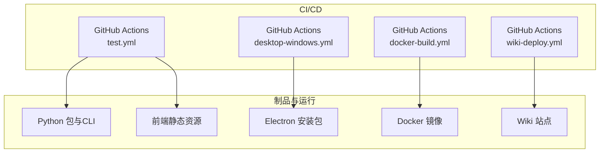
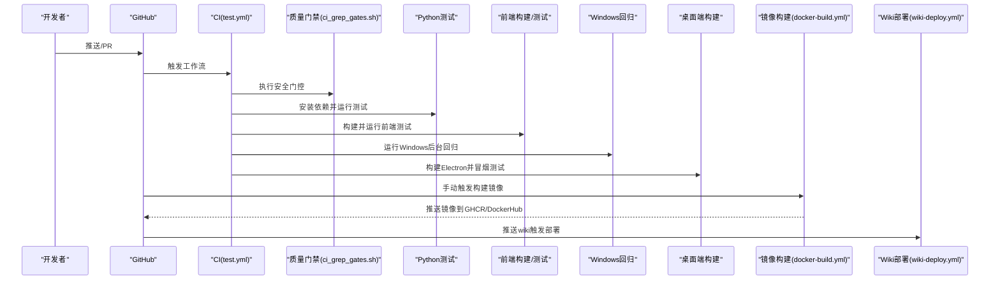
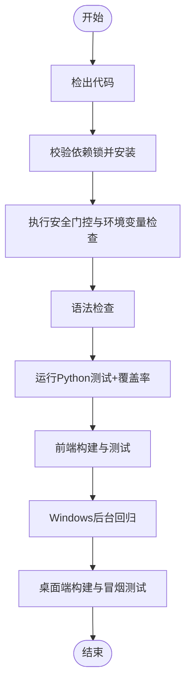
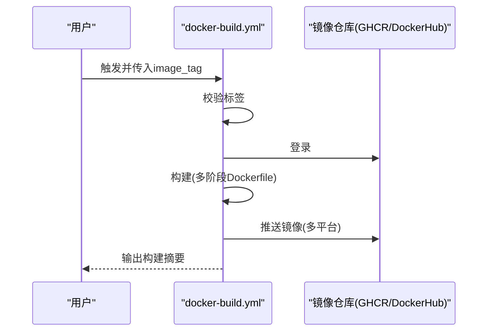
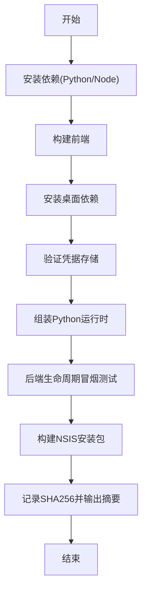
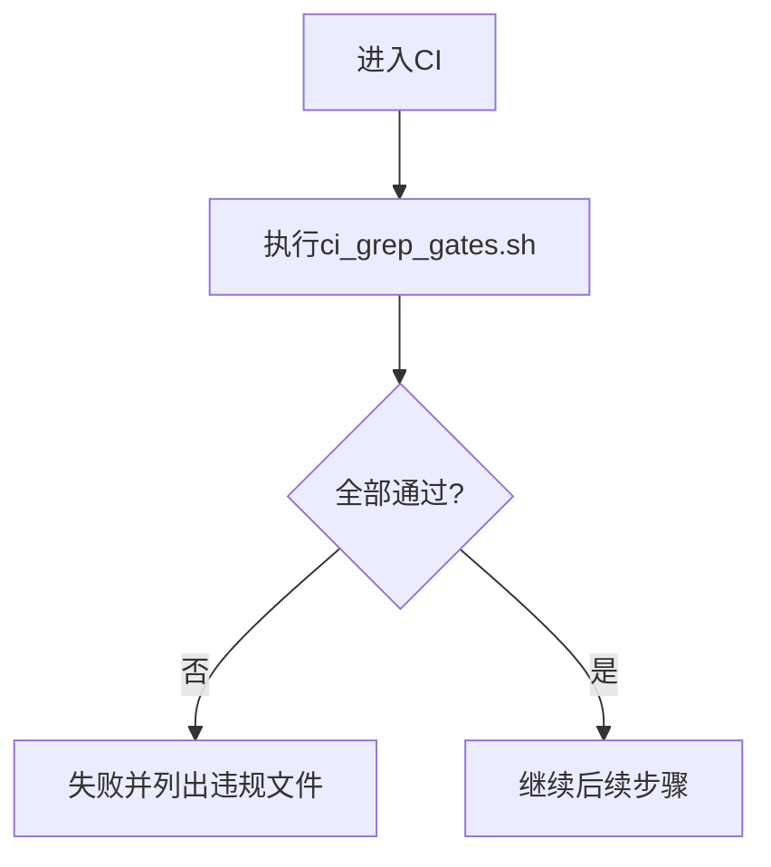
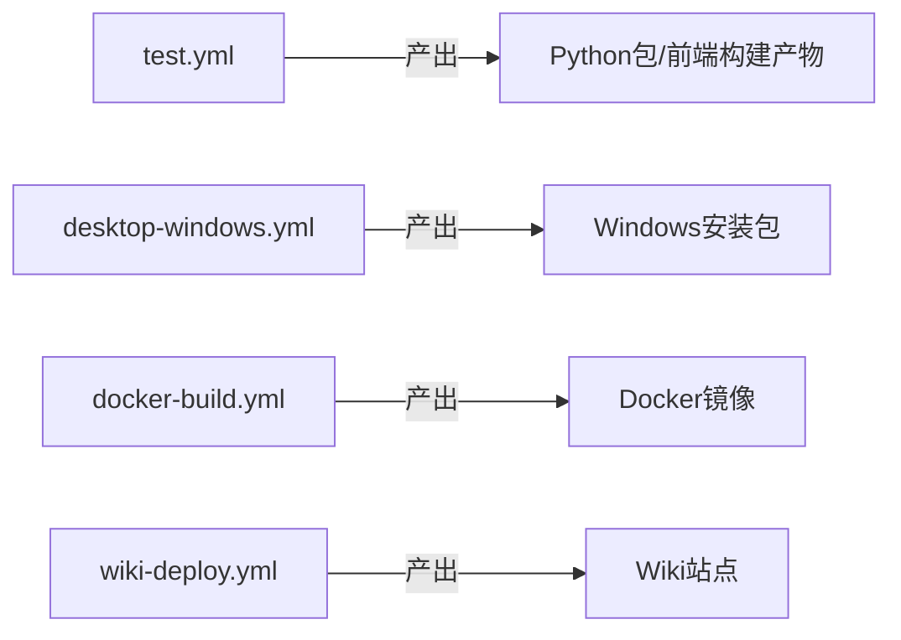

# 持续集成与部署

<cite>
**本文引用的文件**
- [test.yml](file://.github/workflows/test.yml)
- [docker-build.yml](file://.github/workflows/docker-build.yml)
- [desktop-windows.yml](file://.github/workflows/desktop-windows.yml)
- [wiki-deploy.yml](file://.github/workflows/wiki-deploy.yml)
- [dependabot.yml](file://.github/dependabot.yml)
- [ci_grep_gates.sh](file://tools/ci_grep_gates.sh)
- [ci_env_var_gate.py](file://tools/ci_env_var_gate.py)
- [Dockerfile](file://Dockerfile)
- [docker-compose.yml](file://docker-compose.yml)
</cite>

## 目录
1. [简介](#简介)
2. [项目结构](#项目结构)
3. [核心组件](#核心组件)
4. [架构总览](#架构总览)
5. [详细组件分析](#详细组件分析)
6. [依赖分析](#依赖分析)
7. [性能考虑](#性能考虑)
8. [故障排查指南](#故障排查指南)
9. [结论](#结论)
10. [附录](#附录)

## 简介
本文件系统化梳理该项目的持续集成（CI）与持续交付/部署（CD）流水线，覆盖代码质量检查、单元测试执行、前端构建与测试、桌面端打包验证、容器镜像构建与发布、文档站点部署、依赖更新治理、环境管理、安全扫描与合规检查、以及回滚与灾难恢复策略。目标是让非技术读者也能理解流水线如何保障质量与安全，同时为工程师提供可操作的扩展点与排障指引。

## 项目结构
仓库采用多语言、多产物工程：
- Python 后端与 CLI：agent 目录
- 前端：frontend（Vite + Vitest）
- 桌面端 Electron：desktop/electron
- 文档站点：wiki（Cloudflare Pages）
- 容器化：Dockerfile 与 docker-compose.yml
- CI/CD：.github/workflows 下的多个工作流
- 安全与质量门禁：tools 下的脚本与检查器

图表来源
- [test.yml:1-165](file://.github/workflows/test.yml#L1-L165)
- [docker-build.yml:1-129](file://.github/workflows/docker-build.yml#L1-L129)
- [desktop-windows.yml:1-95](file://.github/workflows/desktop-windows.yml#L1-L95)
- [wiki-deploy.yml:1-39](file://.github/workflows/wiki-deploy.yml#L1-L39)

章节来源
- [test.yml:1-165](file://.github/workflows/test.yml#L1-L165)
- [docker-build.yml:1-129](file://.github/workflows/docker-build.yml#L1-L129)
- [desktop-windows.yml:1-95](file://.github/workflows/desktop-windows.yml#L1-L95)
- [wiki-deploy.yml:1-39](file://.github/workflows/wiki-deploy.yml#L1-L39)

## 核心组件
- 代码质量与安全门禁
  - 依赖哈希校验：在 CI 中分别对主依赖锁与通道依赖锁执行 dry-run 校验，确保可重现安装。
  - 仓库级安全门控：统一脚本扫描不安全 YAML 加载、商标词、敏感数据泄露、过时时间 API、环境变量直读等。
  - 环境变量访问规范：AST 扫描禁止绕过集中配置层直接读取环境变量。
- 测试与构建
  - Python 单元测试：使用 pytest，生成覆盖率报告；排除需真实 LLM 的端到端用例。
  - 前端构建与测试：npm ci + 构建 + Vitest 运行。
  - Windows 后台任务回归：在 ARM64 与 x64 上验证关键工具行为。
  - 桌面端生命周期：构建 Electron 并执行冒烟测试。
- 容器与部署
  - 多阶段 Docker 构建：前端构建、Python 依赖编译与 venv 预构建、最小运行时镜像。
  - 双注册表推送：GHCR 与 Docker Hub，支持多平台（amd64/arm64）。
  - 文档站点自动部署：Push 到 wiki 目录即触发 Cloudflare Pages 部署。
- 依赖治理
  - Dependabot 按月批量升级次要/补丁版本，重大版本单独审查；对已知冲突或风险依赖进行忽略或分组控制。

章节来源
- [test.yml:26-89](file://.github/workflows/test.yml#L26-L89)
- [ci_grep_gates.sh:1-156](file://tools/ci_grep_gates.sh#L1-L156)
- [ci_env_var_gate.py:1-302](file://tools/ci_env_var_gate.py#L1-L302)
- [docker-build.yml:22-129](file://.github/workflows/docker-build.yml#L22-L129)
- [dependabot.yml:1-103](file://.github/dependabot.yml#L1-L103)

## 架构总览
下图展示从提交到制品产出的整体流程：代码变更触发 CI，执行质量门禁与测试；通过后按需构建桌面端、容器镜像与文档站点。

图表来源
- [test.yml:1-165](file://.github/workflows/test.yml#L1-L165)
- [docker-build.yml:1-129](file://.github/workflows/docker-build.yml#L1-L129)
- [desktop-windows.yml:1-95](file://.github/workflows/desktop-windows.yml#L1-L95)
- [wiki-deploy.yml:1-39](file://.github/workflows/wiki-deploy.yml#L1-L39)

## 详细组件分析

### CI 流水线（test.yml）
- 触发条件：main 分支 push/PR，支持手动触发。
- 环境与依赖：
  - Python 3.11，启用 pip 缓存。
  - 先对两个依赖锁文件执行 dry-run 校验，保证可重现安装。
  - 安装开发依赖与可选 extras（openbb、stats），确保相关测试不被跳过。
- 质量门禁：
  - 执行仓库级安全门控脚本，涵盖多项安全检查。
  - 执行环境变量访问规范检查。
- 语法检查：对关键入口与模块进行编译检查。
- 测试：
  - 运行 pytest，生成覆盖率报告（term-missing 与 XML）。
  - 显式忽略需要真实 LLM 的端到端测试，避免 CI 状态漂移。
- 前端：
  - Node 22，npm ci + 构建 + Vitest 运行。
- Windows 背景任务回归：
  - 在 Windows 11 ARM64 与 Server 2025 x64 上运行关键工具回归。
- 桌面端 Electron：
  - 安装后端源包与桌面依赖，构建并执行生命周期冒烟测试。

图表来源
- [test.yml:18-89](file://.github/workflows/test.yml#L18-L89)
- [test.yml:90-165](file://.github/workflows/test.yml#L90-L165)

章节来源
- [test.yml:1-165](file://.github/workflows/test.yml#L1-L165)

### 容器镜像构建与发布（docker-build.yml）
- 触发方式：手动触发，输入镜像标签。
- 安全与权限：
  - 校验标签格式，失败快速退出。
  - 仅授予必要权限（read/write packages）。
- 构建与推送：
  - 设置 Buildx 与 QEMU，登录 GHCR 与 Docker Hub。
  - 提取元数据并打 tag（含 latest 策略）。
  - 多平台构建（linux/amd64, linux/arm64），开启 GHA 缓存。
  - 推送后更新 Docker Hub 描述。
- 输出摘要：
  - 步骤总结包含镜像地址、平台、通道信息，并提供拉取命令。

图表来源
- [docker-build.yml:22-129](file://.github/workflows/docker-build.yml#L22-L129)
- [Dockerfile:1-119](file://Dockerfile#L1-L119)

章节来源
- [docker-build.yml:1-129](file://.github/workflows/docker-build.yml#L1-L129)
- [Dockerfile:1-119](file://Dockerfile#L1-L119)

### 桌面端 Windows 构建（desktop-windows.yml）
- 触发：手动或 PR（路径过滤）。
- 构建流程：
  - 安装 Python 与 Node，构建前端。
  - 安装桌面依赖，验证加密凭据存储。
  - 组装最小 Python 运行时，验证后端生命周期。
  - 构建 NSIS 安装包，记录 SHA256 并输出摘要。
- 安全注意：
  - 禁用代码签名以用于审阅构建，不上传至发布渠道。

图表来源
- [desktop-windows.yml:16-95](file://.github/workflows/desktop-windows.yml#L16-L95)

章节来源
- [desktop-windows.yml:1-95](file://.github/workflows/desktop-windows.yml#L1-L95)

### 文档站点部署（wiki-deploy.yml）
- 触发：main 分支下 wiki/ 或工作流文件变更。
- 部署：使用 Wrangler 将 wiki 目录部署到 Cloudflare Pages，启用并发控制取消进行中任务。

章节来源
- [wiki-deploy.yml:1-39](file://.github/workflows/wiki-deploy.yml#L1-L39)

### 质量门禁与安全扫描
- 统一门禁脚本（ci_grep_gates.sh）：
  - 禁止不安全 yaml.load()。
  - 禁止商标词出现在对外制品中。
  - 禁止 wiki/alpha-library 中出现按股票代码的数据。
  - 禁止过时 datetime.utcnow()/datetime.now() 用法。
  - 禁止绕过集中配置层直接读取环境变量（调用 AST 检查器）。
- 环境变量访问检查器（ci_env_var_gate.py）：
  - 扫描 agent 源码树，拒绝 os.getenv/os.environ.get/os.environ[...] 等读取。
  - 允许白名单模式（如 copy/items/setdefault/写入场景/特定文件 pop）。
  - 仅在 agent/src/config/ 内允许直接读取。

图表来源
- [ci_grep_gates.sh:1-156](file://tools/ci_grep_gates.sh#L1-L156)
- [ci_env_var_gate.py:1-302](file://tools/ci_env_var_gate.py#L1-L302)

章节来源
- [ci_grep_gates.sh:1-156](file://tools/ci_grep_gates.sh#L1-L156)
- [ci_env_var_gate.py:1-302](file://tools/ci_env_var_gate.py#L1-L302)

### 测试策略
- 单元测试：
  - 使用 pytest，生成覆盖率报告（term-missing 与 XML）。
  - 显式忽略需要真实 LLM 的端到端测试，避免 CI 误判。
- 前端测试：
  - 使用 Vitest 运行前端单元测试。
- 平台回归：
  - Windows 后台任务回归覆盖跨架构关键工具。
- 端到端与性能基准：
  - 当前 CI 未包含需真实 LLM 的端到端测试与性能基准；如需接入，可在 test.yml 新增 job 并通过环境变量开关控制。

章节来源
- [test.yml:57-89](file://.github/workflows/test.yml#L57-L89)
- [test.yml:90-165](file://.github/workflows/test.yml#L90-L165)

### 环境管理与差异
- 本地开发：
  - docker-compose.yml 定义服务端口、环境变量、卷挂载、只读根文件系统、tmpfs 临时目录、资源限制与重启策略。
  - 默认暴露 8899 端口，前端开发模式 5899 端口。
  - 持久化 runs/sessions/uploads/home 等目录，避免重建丢失。
- 容器健康检查：
  - Dockerfile 内置 /live 健康检查。
- 生产/测试/开发差异：
  - 通过 compose 覆盖文件或环境变量注入实现差异管理（例如 OLLAMA_BASE_URL、数据库路径、信任环回等）。
  - 建议将敏感配置放入 .env 或外部密钥管理服务，不在仓库中硬编码。

章节来源
- [docker-compose.yml:1-90](file://docker-compose.yml#L1-L90)
- [Dockerfile:110-119](file://Dockerfile#L110-L119)

### 依赖治理与许可证合规
- Dependabot：
  - 按月批量升级次要/补丁版本，重大版本单独审查。
  - 针对已知冲突或风险依赖进行忽略或分组控制（如 pandas、websockets、ccxt 传递依赖等）。
- 依赖锁定：
  - 使用 requirements-lock.txt 与 requirements-channels-lock.txt，并在 CI 中校验哈希一致性。
- 许可证合规：
  - 通过锁定依赖与 CI 门禁降低未知风险；建议在发布前增加许可证清单扫描（可扩展至 CI）。

章节来源
- [dependabot.yml:1-103](file://.github/dependabot.yml#L1-L103)
- [test.yml:26-49](file://.github/workflows/test.yml#L26-L49)

### 自动化发布与版本管理
- 镜像发布：
  - 通过 docker-build.yml 手动触发，输入镜像标签，推送到 GHCR 与 Docker Hub，并附带 latest 策略。
- 文档站点发布：
  - 推送 wiki 内容即自动部署到 Cloudflare Pages。
- 桌面端发布：
  - 当前工作流产出审阅用安装包并记录校验和；正式发布需结合签名与发布渠道（可在现有流程基础上扩展）。
- 版本管理建议：
  - 使用语义化版本标签（如 v1.2.3），配合 GitHub Releases 与镜像标签联动。
  - 在发布前强制通过所有 CI 门禁与测试。

章节来源
- [docker-build.yml:8-129](file://.github/workflows/docker-build.yml#L8-L129)
- [wiki-deploy.yml:1-39](file://.github/workflows/wiki-deploy.yml#L1-L39)
- [desktop-windows.yml:101-131](file://.github/workflows/desktop-windows.yml#L101-L131)

### 回滚与灾难恢复
- 镜像回滚：
  - 通过重新部署指定历史镜像标签即可回滚。
- 文档站点回滚：
  - 在 Cloudflare Pages 控制台回退到上一个有效部署。
- 桌面端回滚：
  - 保留历史安装包与校验和，分发旧版本安装包。
- 数据与状态：
  - 通过命名卷持久化关键数据（runs/sessions/uploads/home），重建容器不会丢失。
  - 若发生数据损坏，可从备份恢复卷或重置状态目录。

[本节为通用指导，无需具体文件引用]

## 依赖分析
- 工作流间耦合：
  - test.yml 负责质量与测试，不依赖其他工作流。
  - docker-build.yml 独立于测试，但通常应在测试通过后由维护者手动触发。
  - desktop-windows.yml 与 wiki-deploy.yml 各自独立触发。
- 外部依赖：
  - GitHub Actions 官方 Action（checkout/setup-python/setup-node/docker/*）。
  - Cloudflare Pages（Wrangler）。
  - 镜像仓库（GHCR/Docker Hub）。

图表来源
- [test.yml:1-165](file://.github/workflows/test.yml#L1-L165)
- [desktop-windows.yml:1-95](file://.github/workflows/desktop-windows.yml#L1-L95)
- [docker-build.yml:1-129](file://.github/workflows/docker-build.yml#L1-L129)
- [wiki-deploy.yml:1-39](file://.github/workflows/wiki-deploy.yml#L1-L39)

章节来源
- [test.yml:1-165](file://.github/workflows/test.yml#L1-L165)
- [desktop-windows.yml:1-95](file://.github/workflows/desktop-windows.yml#L1-L95)
- [docker-build.yml:1-129](file://.github/workflows/docker-build.yml#L1-L129)
- [wiki-deploy.yml:1-39](file://.github/workflows/wiki-deploy.yml#L1-L39)

## 性能考虑
- 缓存：
  - pip 与 npm 缓存已启用，减少重复安装时间。
  - Docker 构建使用 GHA 缓存加速。
- 并行与矩阵：
  - Windows 回归使用矩阵在多种架构上并行执行。
- 资源限制：
  - 容器通过 mem_limit/cpus/pids_limit 限制资源，防止单任务耗尽主机资源。
- 建议：
  - 将耗时测试拆分为独立 job 并使用 artifacts 共享构建产物。
  - 对大依赖（如前端）使用更细粒度的缓存键（基于 lock 文件哈希）。

[本节为通用指导，无需具体文件引用]

## 故障排查指南
- 依赖安装失败：
  - 检查依赖锁是否完整且哈希一致；在 CI 中会分别校验主依赖与通道依赖锁。
  - 参考：[test.yml:26-49](file://.github/workflows/test.yml#L26-L49)
- 安全门控失败：
  - 根据脚本输出定位违规文件，修复 unsafe yaml.load、商标词、敏感数据、过时时间 API 或环境变量直读。
  - 参考：[ci_grep_gates.sh:44-144](file://tools/ci_grep_gates.sh#L44-L144)
- 环境变量访问违规：
  - 使用 AST 检查器输出定位行号，改为通过集中配置层读取。
  - 参考：[ci_env_var_gate.py:247-297](file://tools/ci_env_var_gate.py#L247-L297)
- 前端构建失败：
  - 检查 Node 版本与依赖缓存；确认 package-lock.json 与 CI 一致。
  - 参考：[test.yml:154-169](file://.github/workflows/test.yml#L154-L169)
- 桌面端构建失败：
  - 检查 Python/Node 版本与依赖安装；查看冒烟测试日志。
  - 参考：[desktop-windows.yml:41-95](file://.github/workflows/desktop-windows.yml#L41-L95)
- 镜像构建失败：
  - 检查标签格式、登录凭证与平台支持；查看构建日志。
  - 参考：[docker-build.yml:29-92](file://.github/workflows/docker-build.yml#L29-L92)
- 文档站点未部署：
  - 确认推送路径包含 wiki/ 或工作流文件；检查 Wrangler 配置与令牌。
  - 参考：[wiki-deploy.yml:3-39](file://.github/workflows/wiki-deploy.yml#L3-L39)

章节来源
- [test.yml:26-89](file://.github/workflows/test.yml#L26-L89)
- [ci_grep_gates.sh:44-144](file://tools/ci_grep_gates.sh#L44-L144)
- [ci_env_var_gate.py:247-297](file://tools/ci_env_var_gate.py#L247-L297)
- [desktop-windows.yml:41-95](file://.github/workflows/desktop-windows.yml#L41-L95)
- [docker-build.yml:29-92](file://.github/workflows/docker-build.yml#L29-L92)
- [wiki-deploy.yml:3-39](file://.github/workflows/wiki-deploy.yml#L3-L39)

## 结论
该项目的 CI/CD 体系以“质量门禁先行、测试驱动、制品可重现、发布可控”为核心原则：通过严格的依赖锁定与安全门控保障代码质量；通过多阶段构建与多平台镜像提升可移植性；通过独立的桌面端与文档站点流水线实现多产物协同；通过 Dependabot 与人工审查平衡依赖更新的安全性与稳定性。建议在后续迭代中补充端到端与性能基准测试，完善发布签名与审计流程，进一步提升交付质量与安全性。

[本节为总结性内容，无需具体文件引用]

## 附录
- 常用命令
  - 本地运行质量门禁：bash tools/ci_grep_gates.sh
  - 本地运行环境变量检查：python tools/ci_env_var_gate.py
  - 本地构建前端：cd frontend && npm ci && npm run build
  - 本地运行前端测试：cd frontend && npx vitest run
  - 本地启动服务：docker compose up
- 扩展点
  - 在 test.yml 新增 job 接入端到端与性能基准测试。
  - 在 docker-build.yml 增加 SBOM 与漏洞扫描步骤。
  - 在 desktop-windows.yml 加入代码签名与发布到渠道的步骤。
  - 在 wiki-deploy.yml 增加预览部署与评论通知。

[本节为通用指导，无需具体文件引用]