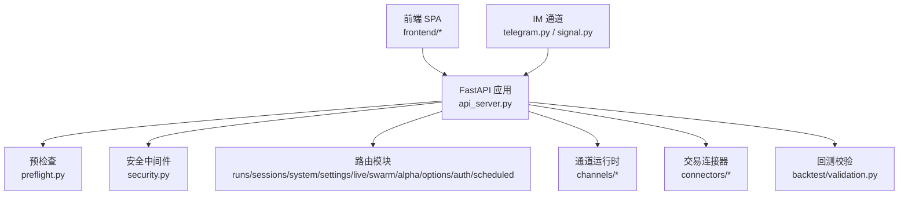
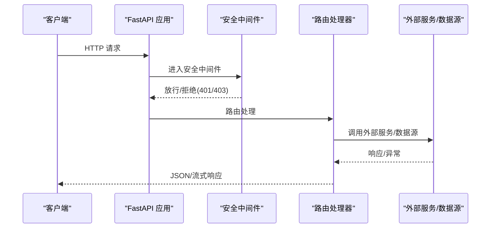
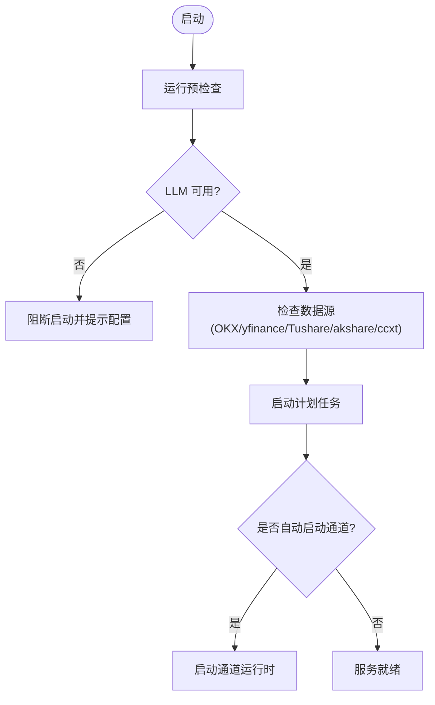
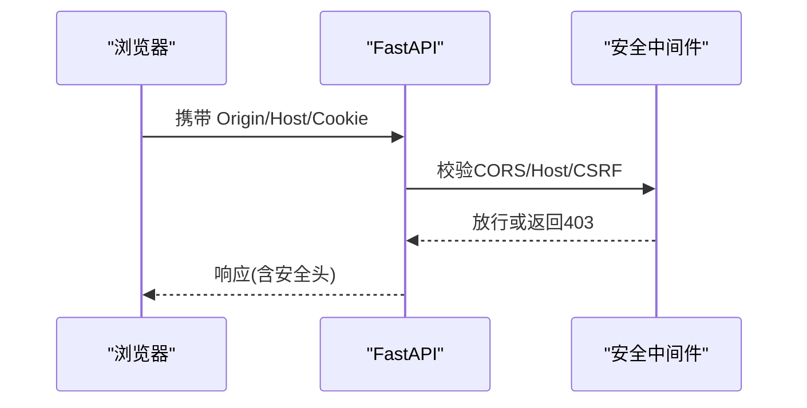
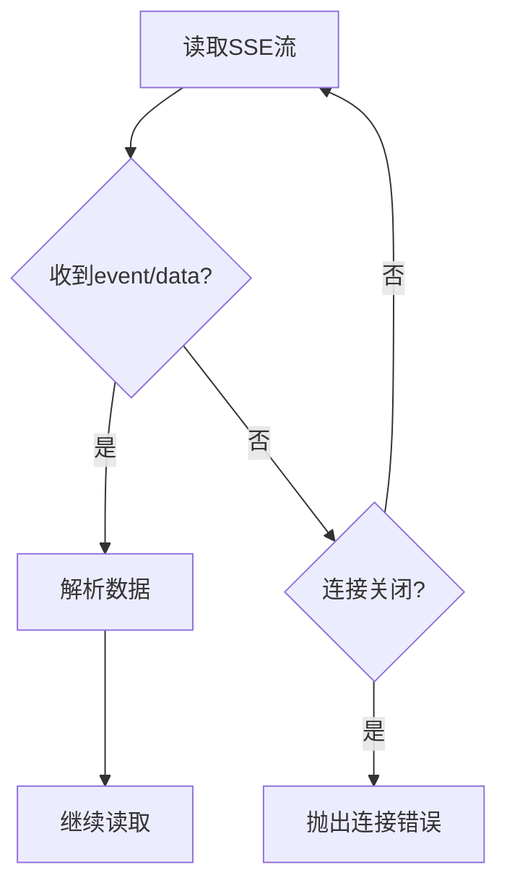
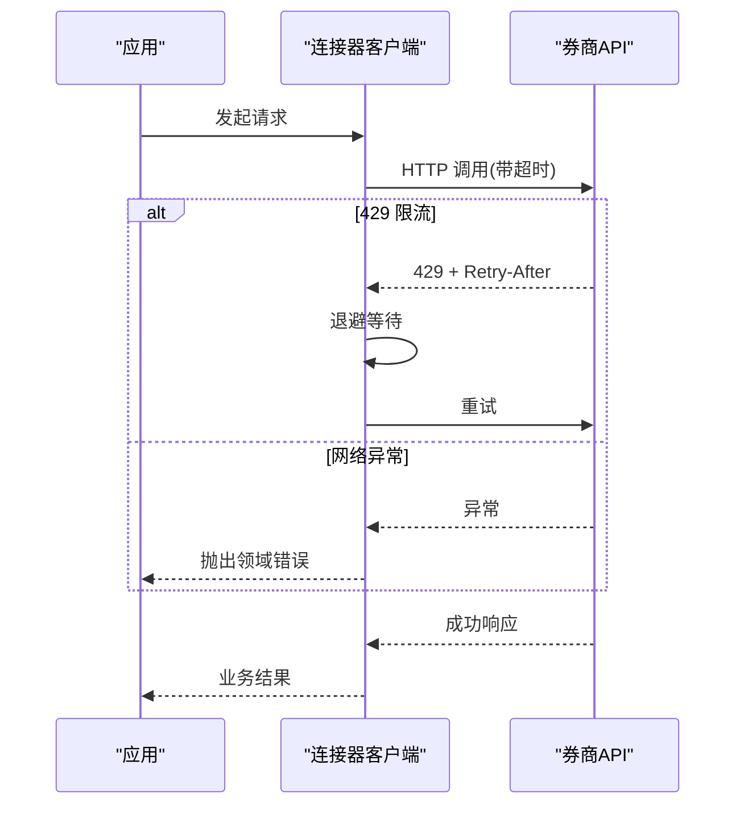
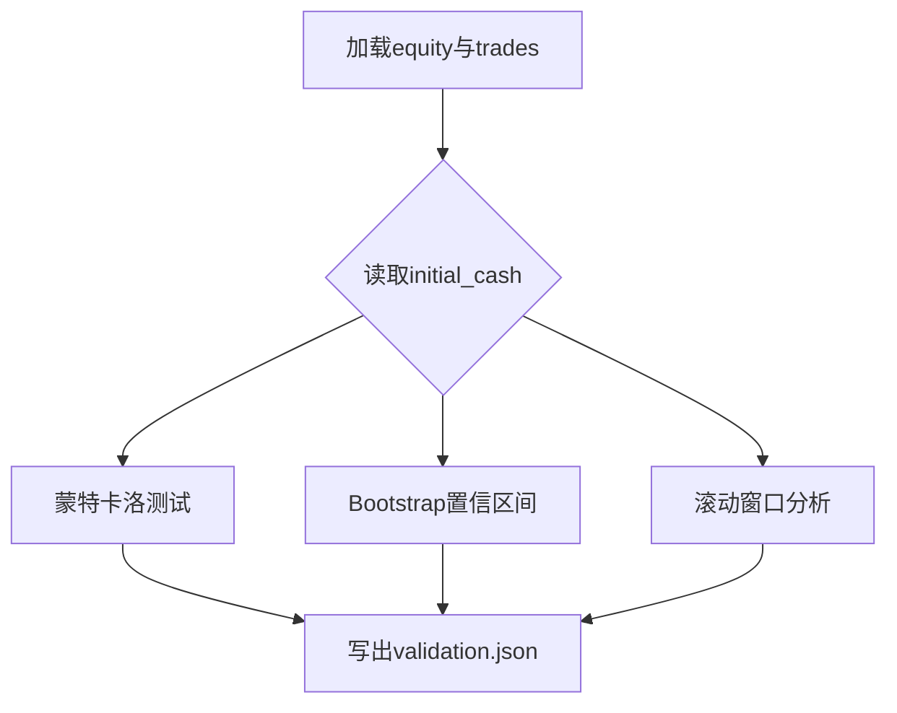
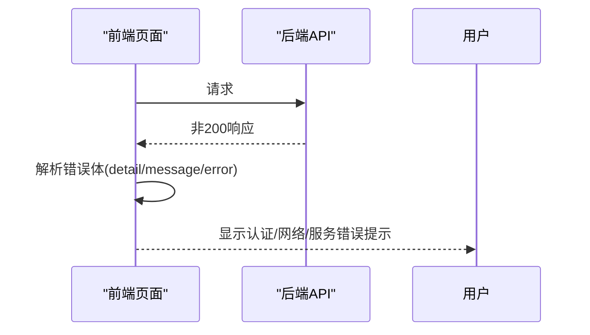
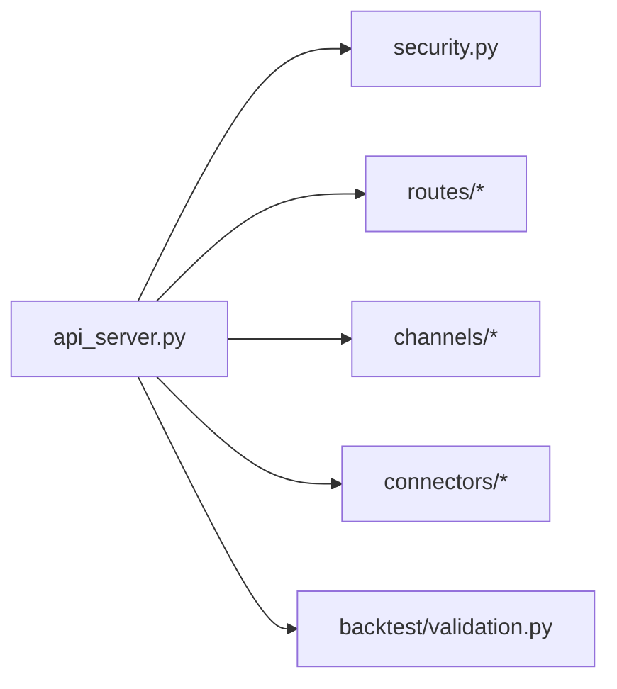

# 故障排除指南

<cite>
**本文引用的文件**
- [api_server.py](file://agent/api_server.py)
- [preflight.py](file://agent/src/preflight.py)
- [security.py](file://agent/src/api/security.py)
- [alpha_routes.py](file://agent/src/api/alpha_routes.py)
- [signal.py](file://agent/src/channels/signal.py)
- [telegram.py](file://agent/src/channels/telegram.py)
- [trading212_sdk.py](file://agent/src/trading/connectors/trading212/sdk.py)
- [etoro_client.py](file://agent/src/trading/connectors/etoro/client.py)
- [validation.py](file://agent/backtest/validation.py)
- [test_api_infrastructure.py](file://agent/tests/test_api_infrastructure.py)
- [mcp_http_test_helpers.py](file://agent/tests/mcp_http_test_helpers.py)
- [Runtime.tsx](file://frontend/src/pages/Runtime.tsx)
- [api.ts](file://frontend/src/lib/api.ts)
</cite>

## 目录
1. [简介](#简介)
2. [项目结构](#项目结构)
3. [核心组件](#核心组件)
4. [架构总览](#架构总览)
5. [详细组件分析](#详细组件分析)
6. [依赖关系分析](#依赖关系分析)
7. [性能注意事项](#性能注意事项)
8. [故障排除指南](#故障排除指南)
9. [结论](#结论)
10. [附录](#附录)

## 简介
本指南面向使用 Vibe-Trading 的运维与研发人员，聚焦“如何快速定位并修复问题”。内容覆盖启动失败、连接超时、数据加载错误、权限与安全、调试模式（日志、断点、性能分析）、错误代码与异常处理、性能问题排查（内存泄漏、CPU 热点、数据库查询优化）、网络问题诊断（API 调用失败、外部服务连接、防火墙配置）、数据一致性验证（完整性、缓存同步、版本兼容），以及自动化测试用例的使用方法与社区支持资源。

## 项目结构
Vibe-Trading 后端以 FastAPI 为核心，启动时执行预检查（LLM 提供商、数据源可达性），挂载安全中间件与路由模块；前端通过 SPA 静态资源或开发模式下的 Vite 提供界面；通道子系统（Telegram 等）负责 IM 集成；交易连接器（Trading212、eToro 等）封装外部券商 API；回测校验模块输出稳定性与稳健性指标；前端页面与 API 客户端统一处理认证与错误提示。

图表来源
- [api_server.py:127-171](file://agent/api_server.py#L127-L171)
- [preflight.py:284-337](file://agent/src/preflight.py#L284-L337)
- [security.py:166-200](file://agent/src/api/security.py#L166-L200)

章节来源
- [api_server.py:1-400](file://agent/api_server.py#L1-L400)
- [preflight.py:1-337](file://agent/src/preflight.py#L1-L337)
- [security.py:1-200](file://agent/src/api/security.py#L1-L200)

## 核心组件
- 启动与生命周期：API 在 lifespan 中执行预检查、迁移、启动计划任务与可选通道运行时。
- 安全与鉴权：CORS、CSRF、CSP、本地主机白名单、SSE 票据、设置写入鉴权。
- 数据与模型：运行结果、回测指标、会话、上传、Alpha 比较等模型定义。
- 通道与信号：SSE 接收循环、错误包装与日志记录。
- 交易连接器：网络重试、限流、错误分类与状态码映射。
- 回测校验：蒙特卡洛、Bootstrap、滚动窗口等稳健性检验。
- 前端：统一错误提取、认证提示、连接器诊断信息展示。

章节来源
- [api_server.py:127-171](file://agent/api_server.py#L127-L171)
- [security.py:1-200](file://agent/src/api/security.py#L1-L200)
- [signal.py:644-673](file://agent/src/channels/signal.py#L644-L673)
- [etoro_client.py:297-331](file://agent/src/trading/connectors/etoro/client.py#L297-L331)
- [validation.py:298-497](file://agent/backtest/validation.py#L298-L497)
- [Runtime.tsx:386-412](file://frontend/src/pages/Runtime.tsx#L386-L412)
- [api.ts:65-93](file://frontend/src/lib/api.ts#L65-L93)

## 架构总览
下图展示了从请求到响应的主要路径，包括预检查、安全中间件、路由处理、外部服务调用与错误返回。

图表来源
- [api_server.py:127-171](file://agent/api_server.py#L127-L171)
- [security.py:166-200](file://agent/src/api/security.py#L166-L200)

## 详细组件分析

### 启动与预检查（启动失败排查）
- 启动流程：API 在 lifespan 中执行迁移、预检查、启动计划任务与可选通道运行时。
- 预检查项：LLM 提供商连通性、OKX/yfinance/Tushare/akshare/ccxt 可用性、内容过滤阈值。
- 关键行为：若 LLM 提供商未就绪，标记为 critical 并阻止启动；其他非关键失败仅警告。

图表来源
- [api_server.py:127-171](file://agent/api_server.py#L127-L171)
- [preflight.py:284-337](file://agent/src/preflight.py#L284-L337)

章节来源
- [api_server.py:127-171](file://agent/api_server.py#L127-L171)
- [preflight.py:32-153](file://agent/src/preflight.py#L32-L153)

### 安全与权限（权限问题排查）
- CORS：默认允许本地开发端口，禁止带凭据的通配符；可通过环境变量追加额外来源。
- 本地主机白名单：拦截不可信 Host 头，防止 DNS 重绑定绕过本地鉴权。
- SSE 票据：短生命周期事件流鉴权令牌。
- 设置写入鉴权：写操作需显式授权。

图表来源
- [security.py:30-103](file://agent/src/api/security.py#L30-L103)
- [security.py:166-200](file://agent/src/api/security.py#L166-L200)

章节来源
- [security.py:1-200](file://agent/src/api/security.py#L1-L200)
- [test_api_infrastructure.py:137-214](file://agent/tests/test_api_infrastructure.py#L137-L214)

### 通道与信号（SSE 连接与超时）
- SSE 接收循环：捕获远程关闭、取消与异常，记录错误并向上抛出。
- 错误包装：顶层处理器捕获异常，记录动作名与载荷片段，便于定位。

图表来源
- [signal.py:644-673](file://agent/src/channels/signal.py#L644-L673)

章节来源
- [signal.py:644-673](file://agent/src/channels/signal.py#L644-L673)

### 交易连接器（网络重试与错误分类）
- eToro 客户端：对 429 进行退避重试，网络异常转换为领域错误；超时由配置控制。
- Trading212 SDK：定义 API 错误类型与配置字段（base_url、timeout、readonly）。

图表来源
- [etoro_client.py:297-331](file://agent/src/trading/connectors/etoro/client.py#L297-L331)
- [trading212_sdk.py:42-70](file://agent/src/trading/connectors/trading212/sdk.py#L42-L70)

章节来源
- [etoro_client.py:297-331](file://agent/src/trading/connectors/etoro/client.py#L297-L331)
- [trading212_sdk.py:42-70](file://agent/src/trading/connectors/trading212/sdk.py#L42-L70)

### 回测校验（数据一致性与稳健性）
- 校验类型：蒙特卡洛模拟、Bootstrap 置信区间、滚动窗口分析。
- 输入：运行目录中的 equity 曲线与交易记录；初始资金可从配置读取。
- 输出：validation.json 与标准化打印，确保严格 JSON 与有限数值。

图表来源
- [validation.py:298-497](file://agent/backtest/validation.py#L298-L497)

章节来源
- [validation.py:298-497](file://agent/backtest/validation.py#L298-L497)

### 前端错误与诊断（UI 层）
- 错误提取：从响应体 detail/message/error 中提取详情；401/403 统一提示认证要求。
- 连接器诊断：根据 errorCode 显示可读的诊断文案（凭证缺失、冲突、SDK 缺失、认证失败、网络不可达等）。

图表来源
- [api.ts:65-93](file://frontend/src/lib/api.ts#L65-L93)
- [Runtime.tsx:386-412](file://frontend/src/pages/Runtime.tsx#L386-L412)

章节来源
- [api.ts:65-93](file://frontend/src/lib/api.ts#L65-L93)
- [Runtime.tsx:386-412](file://frontend/src/pages/Runtime.tsx#L386-L412)

## 依赖关系分析
- api_server 聚合各路由模块与安全基础设施，并在启动时触发预检查与计划任务。
- security 被多个路由与中间件引用，提供鉴权、CORS、CSP、本地主机校验。
- channels 与 connectors 作为外部依赖入口，集中处理网络与协议差异。
- validation 依赖运行产物（equity、trades、config）生成稳健性报告。

图表来源
- [api_server.py:185-314](file://agent/api_server.py#L185-L314)
- [security.py:1-200](file://agent/src/api/security.py#L1-L200)

章节来源
- [api_server.py:185-314](file://agent/api_server.py#L185-L314)

## 性能注意事项
- 网络超时与重试：连接器应合理设置超时与重试策略，避免雪崩与长尾延迟。
- 资源释放：连接池与线程局部对象需在释放后断开连接，防止句柄泄漏。
- 日志与追踪：结构化日志与错误摘要有助于快速定位瓶颈。
- 前端渲染：按需加载图表与数据，减少首屏压力。

[本节为通用指导，不直接分析具体文件]

## 故障排除指南

### 启动失败
- 现象：服务无法启动或立即退出。
- 可能原因：LLM 提供商未配置或不可达；代理/基础 URL 错误；OAuth 登录缺失。
- 诊断步骤：
  - 查看启动日志中的预检查结果（LLM Provider、OKX、yfinance、Tushare、akshare、ccxt）。
  - 确认 .env 中 LANGCHAIN_PROVIDER/LANGCHAIN_MODEL_NAME 已设置。
  - 对 OpenAI-Codex/Copilot 检查 OAuth 状态。
  - 若 base URL 不可达，检查代理与防火墙。
- 解决建议：
  - 补齐 LLM 配置与认证；必要时调整 OPENAI_BASE_URL/代理。
  - 对 Docker 部署，确认 host.docker.internal 或 extra_hosts 映射正确。

章节来源
- [preflight.py:32-153](file://agent/src/preflight.py#L32-L153)
- [api_server.py:127-171](file://agent/api_server.py#L127-L171)

### 连接超时
- 现象：外部服务调用超时或频繁重试。
- 可能原因：网络不通、代理配置错误、远端限流（429）、连接池耗尽。
- 诊断步骤：
  - 检查连接器超时配置（如 Trading212 timeout）。
  - 观察 429 响应与 Retry-After 头，评估退避策略。
  - 检查 Telegram/通道长轮询的连接池与超时参数。
- 解决建议：
  - 增大超时或降低并发；启用重试与退避。
  - 配置代理或更换网络出口；检查防火墙规则。

章节来源
- [etoro_client.py:297-331](file://agent/src/trading/connectors/etoro/client.py#L297-L331)
- [trading212_sdk.py:42-70](file://agent/src/trading/connectors/trading212/sdk.py#L42-L70)
- [telegram.py:516-542](file://agent/src/channels/telegram.py#L516-L542)

### 数据加载错误
- 现象：市场数据为空、部分符号缺失、单位不一致或 OHLC 异常。
- 可能原因：数据源不可用、缓存过期、单位换算错误、OHLC 校验失败。
- 诊断步骤：
  - 查看预检查中 yfinance/akshare/ccxt 状态。
  - 检查 loader 的 OHLC 健全性校验与单位声明。
  - 对回测运行，查看 artifacts/validation.json 与 metrics.csv。
- 解决建议：
  - 切换备用数据源；清理或重建缓存。
  - 修正单位换算；确保时间范围与频率匹配。

章节来源
- [preflight.py:184-271](file://agent/src/preflight.py#L184-L271)
- [validation.py:298-497](file://agent/backtest/validation.py#L298-L497)

### 权限问题
- 现象：401/403 错误、跨域被拒、本地访问受限。
- 可能原因：缺少 API_AUTH_KEY、CORS 配置不当、Host 头不被信任、CSRF 防护。
- 诊断步骤：
  - 检查前端错误提取逻辑与认证提示。
  - 核对 CORS_ORIGINS 与 VIBE_TRADING_EXTRA_CORS_ORIGINS。
  - 确认绑定地址与可信主机列表。
- 解决建议：
  - 设置 API_AUTH_KEY 或在本地 localhost 访问。
  - 添加受信任来源与主机；避免通配符带凭据。

章节来源
- [security.py:30-103](file://agent/src/api/security.py#L30-L103)
- [security.py:166-200](file://agent/src/api/security.py#L166-L200)
- [api.ts:65-93](file://frontend/src/lib/api.ts#L65-L93)

### 调试模式与日志
- 详细日志：
  - 通道错误包装记录动作名与载荷片段，便于关联上下文。
  - Telegram 错误处理将网络错误降级为警告，其他错误记录为 error。
- 断点调试：
  - 在路由处理器与连接器客户端处设置断点，观察请求/响应与异常堆栈。
- 性能分析工具：
  - 使用 Python 性能剖析器（cProfile/py-spy）定位 CPU 热点。
  - 使用内存剖析器（memory_profiler/objgraph）检测内存泄漏。
  - 前端使用浏览器开发者工具的 Network/Performance 面板分析请求与渲染。

章节来源
- [signal.py:644-673](file://agent/src/channels/signal.py#L644-L673)
- [telegram.py:1591-1620](file://agent/src/channels/telegram.py#L1591-L1620)

### 错误代码与异常处理
- 常见错误：
  - 401/403：认证或授权失败；前端统一提示认证要求。
  - 429：限流；连接器按 Retry-After 退避重试。
  - 网络异常：转换为领域错误并上报。
- 处理建议：
  - 区分瞬态错误（重试）与永久错误（配置/权限）。
  - 对外暴露稳定错误码与可读消息，避免泄露内部细节。

章节来源
- [api.ts:65-93](file://frontend/src/lib/api.ts#L65-L93)
- [etoro_client.py:297-331](file://agent/src/trading/connectors/etoro/client.py#L297-L331)

### 性能问题排查
- 内存泄漏检测：
  - 关注连接池与线程局部对象的释放；IBKR 连接池在 refcount 归零时断开。
  - 使用 memory_profiler 跟踪对象增长，定位未释放资源。
- CPU 热点分析：
  - 使用 cProfile 或 py-spy 对热点函数（数据加载、指标计算）进行分析。
  - 前端使用 Performance 面板识别阻塞渲染或重复计算。
- 数据库查询优化：
  - 对本地数据（CSV/Parquet/DuckDB）建立索引与分区；避免全表扫描。
  - 批量拉取与分页读取，减少单次负载。

章节来源
- [ibkr_local.py:519-556](file://agent/src/trading/connectors/ibkr/local.py#L519-L556)

### 网络问题诊断
- API 调用失败：
  - 检查 base URL、代理、证书与超时；对 429 实施退避。
- 外部服务连接问题：
  - 使用预检查工具验证 OKX/yfinance/Tushare 可达性。
  - 对 IM 通道（Telegram）检查长轮询超时与连接池大小。
- 防火墙配置检查：
  - 确认出站端口开放；Docker 环境使用 host-gateway 或 extra_hosts。

章节来源
- [preflight.py:156-271](file://agent/src/preflight.py#L156-L271)
- [telegram.py:516-542](file://agent/src/channels/telegram.py#L516-L542)

### 数据一致性验证
- 数据完整性检查：
  - 回测校验输出蒙特卡洛、Bootstrap、滚动窗口结果，评估稳健性。
- 缓存同步问题：
  - 检查缓存键与数据新鲜度；避免缓存今日未完成数据。
- 版本兼容性检查：
  - 前端与后端接口契约变更需保持兼容；使用测试用例验证。

章节来源
- [validation.py:298-497](file://agent/backtest/validation.py#L298-L497)

### 自动化测试用例
- 启动与就绪检查：
  - 使用测试辅助函数等待服务端口可访问与健康检查返回预期状态码。
- 回归测试：
  - 验证安全中间件、CORS、路径参数校验、SPA 路由等。
- 使用方法：
  - 在 CI 或本地运行 pytest 套件；关注失败用例对应的模块与断言。

章节来源
- [mcp_http_test_helpers.py:282-358](file://agent/tests/mcp_http_test_helpers.py#L282-L358)
- [test_api_infrastructure.py:17-71](file://agent/tests/test_api_infrastructure.py#L17-L71)

### 社区支持与问题报告模板
- 社区渠道：官方 Discord、GitHub Issues、Wiki 文档。
- 问题报告模板建议包含：
  - 环境信息（Python/Node 版本、操作系统、Docker 镜像）。
  - 复现步骤与期望行为。
  - 相关日志片段（预检查、SSE、连接器错误）。
  - 网络拓扑（代理、防火墙、域名解析）。
  - 前端错误提示截图与后端响应体。

[本节为通用指导，不直接分析具体文件]

## 结论
通过系统化的启动预检查、安全中间件、连接器重试与错误分类、回测校验与前端统一错误处理，Vibe-Trading 提供了完善的故障定位与修复路径。结合日志、断点与性能分析工具，配合自动化测试与社区支持，可高效解决常见问题并持续优化系统稳定性与性能。

## 附录
- 常用命令：
  - 启动服务：python agent/api_server.py --port 8000
  - 预检查：在启动日志中查看预检查结果
  - 运行测试：pytest agent/tests
- 配置文件位置：
  - .env（环境变量）
  - 用户目录 ~/.vibe-trading（会话、运行、缓存等）

[本节为通用指导，不直接分析具体文件]