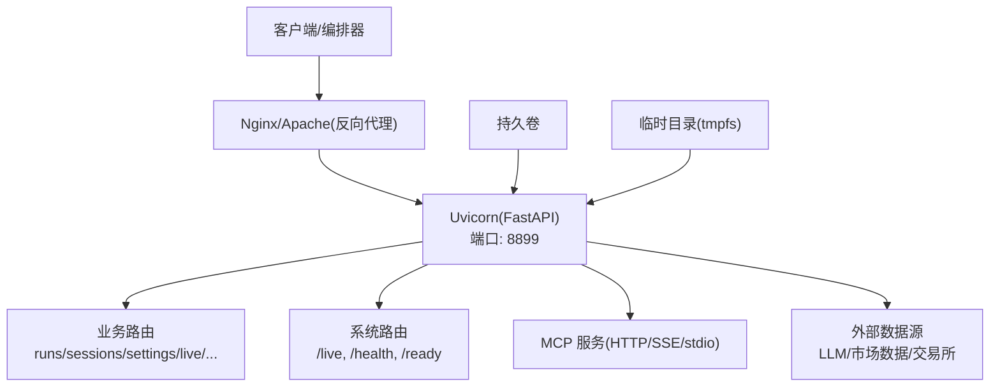
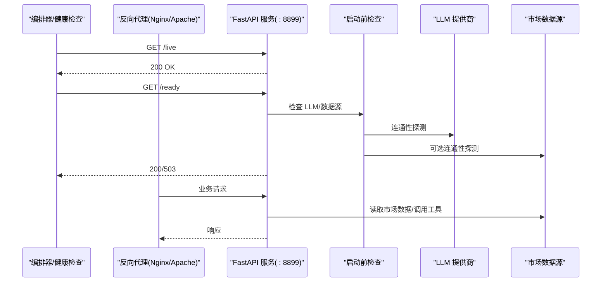
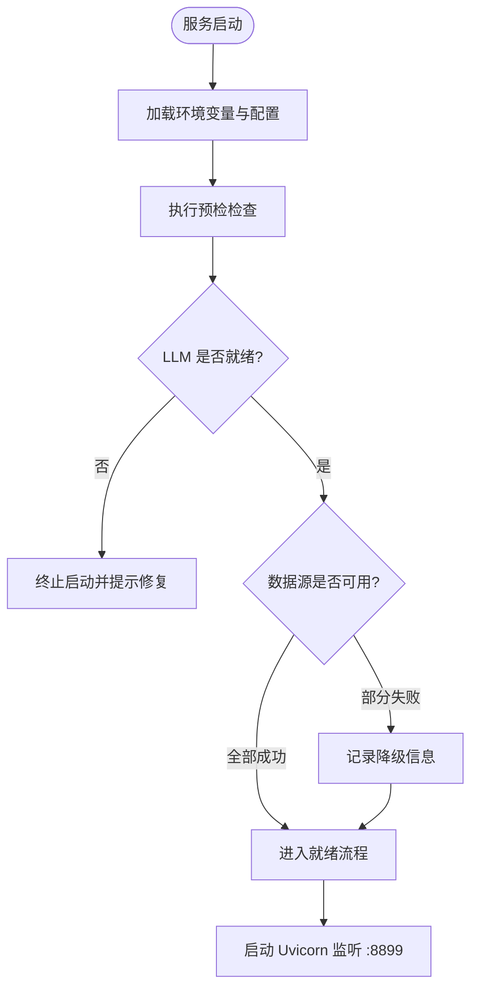
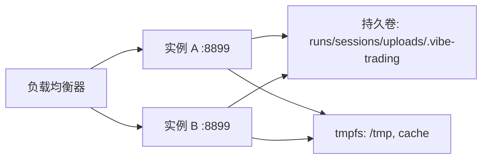
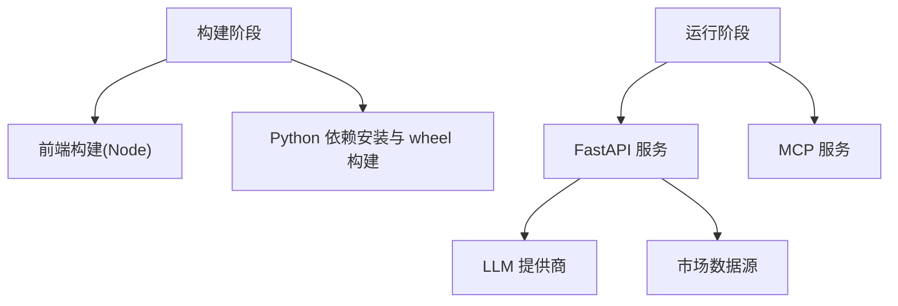

# 生产环境部署

<cite>
**本文引用的文件**
- [Dockerfile](file://Dockerfile)
- [docker-compose.yml](file://docker-compose.yml)
- [pyproject.toml](file://pyproject.toml)
- [agent/api_server.py](file://agent/api_server.py)
- [agent/mcp_server.py](file://agent/mcp_server.py)
- [agent/src/preflight.py](file://agent/src/preflight.py)
- [agent/src/config/env_schema.py](file://agent/src/config/env_schema.py)
- [agent/src/api/system_routes.py](file://agent/src/api/system_routes.py)
</cite>

## 目录
1. [简介](#简介)
2. [项目结构](#项目结构)
3. [核心组件](#核心组件)
4. [架构总览](#架构总览)
5. [详细组件分析](#详细组件分析)
6. [依赖关系分析](#依赖关系分析)
7. [性能考虑](#性能考虑)
8. [故障排查指南](#故障排查指南)
9. [结论](#结论)
10. [附录](#附录)

## 简介
本指南面向生产环境部署 Vibe-Trading，覆盖预检检查、负载均衡与健康检查、高可用架构、安全加固、性能调优、监控集成以及主流云平台容器化模板。文档基于仓库中的 Dockerfile、Compose、API 服务入口、MCP 服务、启动前检查与环境配置等源码进行说明，确保可落地与可验证。

## 项目结构
- 应用以多阶段镜像构建：前端静态资源由 Node 构建，Python 依赖在 builder 阶段编译 wheel 并生成独立 venv，运行时仅携带最小依赖。
- API 服务使用 FastAPI + Uvicorn，默认暴露端口 8899；提供 /live、/health、/ready 健康端点。
- MCP 服务支持 stdio、SSE 与 Streamable HTTP 三种传输，内置 Host/Origin 白名单防护。
- Compose 定义了持久卷、只读根文件系统、内存/CPU/PID 限制与安全能力裁剪。

图表来源
- [Dockerfile:110-118](file://Dockerfile#L110-L118)
- [agent/api_server.py:321-395](file://agent/api_server.py#L321-L395)
- [agent/src/api/system_routes.py:235-266](file://agent/src/api/system_routes.py#L235-L266)
- [docker-compose.yml:20-66](file://docker-compose.yml#L20-L66)

章节来源
- [Dockerfile:1-119](file://Dockerfile#L1-L119)
- [docker-compose.yml:1-90](file://docker-compose.yml#L1-L90)
- [agent/api_server.py:1-400](file://agent/api_server.py#L1-L400)

## 核心组件
- 启动与生命周期
  - API 服务通过 lifespan 钩子在启动时执行预检（preflight），随后按需启动通道运行时与定时研究执行器；关闭时按逆序停止相关后台任务。
- 健康检查
  - /live：进程存活探针，无条件返回健康。
  - /health：兼容旧监控的别名。
  - /ready：就绪探针，校验 LLM 提供商可用性，未就绪返回 503。
- 安全与访问控制
  - 默认绑定回环地址；非回环绑定需设置 API_AUTH_KEY。
  - CORS、CSP、Host/Origin 白名单、SSE Ticket 认证等。
- 运行约束
  - 容器内只读根文件系统，关键目录通过命名卷挂载；限制 CPU、内存、PID 数量；最小化 Linux 能力集。

章节来源
- [agent/api_server.py:127-161](file://agent/api_server.py#L127-L161)
- [agent/src/api/system_routes.py:235-266](file://agent/src/api/system_routes.py#L235-L266)
- [agent/src/config/env_schema.py:326-375](file://agent/src/config/env_schema.py#L326-L375)
- [docker-compose.yml:40-66](file://docker-compose.yml#L40-L66)

## 架构总览
下图展示生产部署中各组件交互：反向代理将流量转发至 API 服务；编排器通过 /live 和 /ready 进行健康探测；MCP 服务可作为工具总线对外暴露；外部数据源包括 LLM 与市场数据提供方。

图表来源
- [agent/src/api/system_routes.py:235-266](file://agent/src/api/system_routes.py#L235-L266)
- [agent/src/preflight.py:32-153](file://agent/src/preflight.py#L32-L153)
- [agent/api_server.py:321-395](file://agent/api_server.py#L321-L395)

## 详细组件分析

### 预检检查机制（系统要求、依赖、端口）
- 启动前检查项
  - LLM 提供商：校验 provider/model/base_url/代理/超时/重试；对特定提供商（如 OpenAI Codex、Copilot）进行登录状态或 SDK 认证检查。
  - 市场数据源：OKX、yfinance、Tushare、akshare、ccxt 等可用性检测。
  - 内容过滤阈值：输出当前告警阈值。
- 结果处理
  - 关键项失败（如 LLM 不可用）会阻止启动；非关键项失败降级为警告。
- 端口与网络
  - 默认监听 8899；可通过 CLI 参数调整 host/port。
  - 非回环绑定需设置 API_AUTH_KEY，否则远程访问将被拒绝。

图表来源
- [agent/src/preflight.py:284-337](file://agent/src/preflight.py#L284-L337)
- [agent/api_server.py:321-395](file://agent/api_server.py#L321-L395)

章节来源
- [agent/src/preflight.py:1-337](file://agent/src/preflight.py#L1-L337)
- [agent/api_server.py:321-395](file://agent/api_server.py#L321-L395)

### 负载均衡与健康检查（Nginx/Apache）
- 健康端点
  - /live：进程存活探针，适合 liveness probe。
  - /health：兼容旧监控。
  - /ready：就绪探针，当 LLM 提供商未配置或不可用时返回 503。
- 反向代理建议
  - Nginx：配置 upstream 指向 127.0.0.1:8899；开启 gzip、缓存静态资源；设置超时与限流；将 /live、/health、/ready 用于健康检查。
  - Apache：使用 mod_proxy 与 ProxyPass/ProxyPassReverse；启用健康检查模块；合理设置 KeepAlive 与并发限制。
- 会话与粘性
  - 若后端多实例，建议使用 IP Hash 或 Cookie 粘性；结合共享存储（见“高可用”）。

章节来源
- [agent/src/api/system_routes.py:235-266](file://agent/src/api/system_routes.py#L235-L266)
- [Dockerfile:110-118](file://Dockerfile#L110-L118)

### 高可用架构设计（多实例、会话共享、数据持久化）
- 多实例部署
  - 通过编排器（Kubernetes/Docker Swarm/云托管）运行多个 API 实例；每个实例无状态化（会话与运行产物外置）。
- 会话共享
  - 使用外部存储（对象存储/数据库）保存会话与运行结果；避免本地磁盘强耦合。
- 数据持久化策略
  - 关键目录通过命名卷挂载：runs、sessions、uploads、用户态 .vibe-trading 目录、swarm runs。
  - 临时目录使用 tmpfs 提升 I/O 性能与隔离性。
- 资源限制
  - 单实例 CPU、内存、PID 上限；防止失控任务影响整体稳定性。

图表来源
- [docker-compose.yml:20-66](file://docker-compose.yml#L20-L66)

章节来源
- [docker-compose.yml:20-66](file://docker-compose.yml#L20-L66)

### 安全加固（防火墙、SSL/TLS、访问控制）
- 防火墙与网络
  - 仅开放必要端口；生产环境建议仅暴露反向代理端口（443/80），内部服务不直接对外。
- SSL/TLS 证书管理
  - 在反向代理层终止 TLS；使用自动续期方案（如 Let’s Encrypt）。
- 访问控制
  - 非回环绑定必须设置 API_AUTH_KEY；CORS 与 CSP 严格配置；MCP 服务启用 Host/Origin 白名单。
- 容器安全
  - 只读根文件系统、最小能力集、no-new-privileges、非 root 用户运行。

章节来源
- [agent/src/config/env_schema.py:326-375](file://agent/src/config/env_schema.py#L326-L375)
- [agent/mcp_server.py:144-318](file://agent/mcp_server.py#L144-L318)
- [docker-compose.yml:40-66](file://docker-compose.yml#L40-L66)

### 性能调优（数据库连接池、缓存、资源限制）
- 数据缓存
  - 启用数据缓存开关与缓存根路径；合理设置缓存 TTL 与容量。
- 连接池与超时
  - 根据负载调整 LLM 超时、重试次数；市场数据源设置合理的超时与预算。
- 资源限制
  - 容器级 CPU/内存/PID 限制；必要时拆分计算密集型任务到独立工作节点。
- 静态资源优化
  - 反向代理缓存前端静态资源；启用压缩与浏览器缓存。

章节来源
- [agent/src/config/env_schema.py:166-214](file://agent/src/config/env_schema.py#L166-L214)
- [agent/backtest/loaders/base.py:478-516](file://agent/backtest/loaders/base.py#L478-L516)
- [docker-compose.yml:61-66](file://docker-compose.yml#L61-L66)

### 监控集成（Prometheus 指标、日志收集）
- 指标暴露
  - 可在反向代理层采集 Uvicorn 指标；或在应用层集成 Prometheus 客户端暴露自定义指标。
- 日志收集
  - 容器标准输出（stdout/stderr）集中收集；敏感字段已在访问日志中脱敏。
- 健康检查
  - 编排器定期调用 /live 与 /ready；异常时自动重启或摘除流量。

章节来源
- [agent/api_server.py:404-415](file://agent/api_server.py#L404-L415)
- [agent/src/api/system_routes.py:235-266](file://agent/src/api/system_routes.py#L235-L266)

### 云平台部署模板
- AWS ECS
  - 使用 Fargate 或 EC2 启动容器；通过 ALB/NLB 暴露 443；EFS 挂载持久卷；CloudWatch 收集日志；IAM 最小权限。
- Google Cloud Run
  - 容器镜像推送到 Artifact Registry；设置最大实例数、CPU/内存；通过 Cloud Run Ingress 暴露 HTTPS；Secrets 管理密钥。
- Azure Container Instances
  - 创建 ACI 组；挂载 Azure Files 作为持久卷；通过 Application Gateway 暴露；Key Vault 管理密钥。

[本节为概念性指导，无需代码来源]

## 依赖关系分析
- 构建依赖
  - 前端：Node 22；后端：Python 3.11；依赖锁定文件保证可重复构建。
- 运行依赖
  - FastAPI/Uvicorn、Web 框架中间件、外部数据源 SDK。
- 服务间依赖
  - API 服务依赖 LLM 提供商与市场数据源；MCP 服务依赖工具注册表与技能加载器。

图表来源
- [Dockerfile:1-119](file://Dockerfile#L1-L119)
- [pyproject.toml:1-80](file://pyproject.toml#L1-L80)

章节来源
- [Dockerfile:1-119](file://Dockerfile#L1-L119)
- [pyproject.toml:1-279](file://pyproject.toml#L1-L279)

## 性能考虑
- 容器资源
  - 合理设置 CPU/内存/PID 限制；避免单实例过载。
- 缓存策略
  - 启用数据缓存；设置合适的缓存根目录与 TTL。
- 网络与 I/O
  - 使用 tmpfs 减少磁盘写入；反向代理缓存静态资源。
- 外部依赖
  - 调整 LLM 超时与重试；市场数据源设置预算与超时。

[本节为通用指导，无需代码来源]

## 故障排查指南
- 启动失败
  - 检查 LLM 提供商配置与连通性；确认 base_url、代理、超时与重试。
- 健康检查失败
  - /ready 返回 503：检查 LLM 提供商是否配置且可用。
- 端口冲突
  - 修改监听端口或释放占用端口；确认反向代理转发正确。
- 权限问题
  - 确认持久卷与 tmpfs 挂载；检查用户与权限。

章节来源
- [agent/src/preflight.py:32-153](file://agent/src/preflight.py#L32-L153)
- [agent/src/api/system_routes.py:235-266](file://agent/src/api/system_routes.py#L235-L266)
- [docker-compose.yml:20-66](file://docker-compose.yml#L20-L66)

## 结论
本指南基于仓库源码提供了生产环境部署的完整实践：从启动前检查、负载均衡与健康检查，到高可用、安全加固、性能调优与监控集成，并给出主流云平台的容器化模板。遵循本文步骤可确保系统在稳定、安全、可扩展的前提下上线。

## 附录
- 环境变量参考
  - API 安全：API_AUTH_KEY、CORS_ORIGINS、VIBE_TRADING_API_URL、VIBE_TRADING_MCP_ALLOWED_HOSTS。
  - LLM：LANGCHAIN_PROVIDER、LANGCHAIN_MODEL_NAME、TIMEOUT_SECONDS、MAX_RETRIES。
  - 数据源：TUSHARE_TOKEN、CCXT_EXCHANGE、FUTU_HOST/FUTU_PORT。
- 健康端点
  - /live：进程存活。
  - /health：兼容旧监控。
  - /ready：就绪检查（LLM 可用性）。

章节来源
- [agent/src/config/env_schema.py:132-311](file://agent/src/config/env_schema.py#L132-L311)
- [agent/src/api/system_routes.py:235-266](file://agent/src/api/system_routes.py#L235-L266)