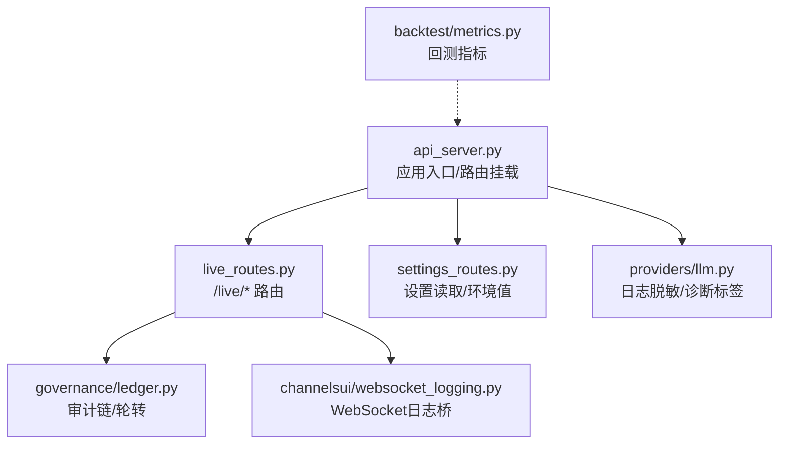
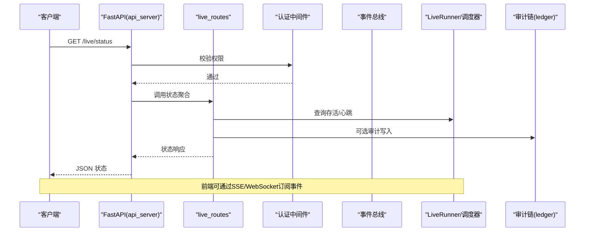
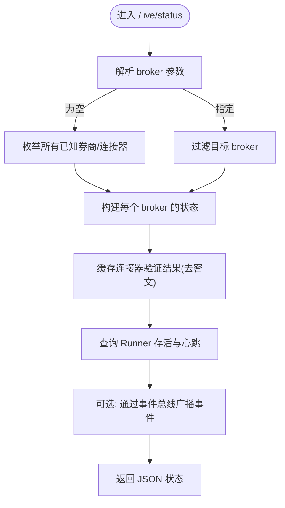
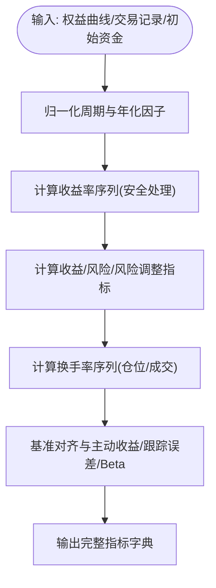
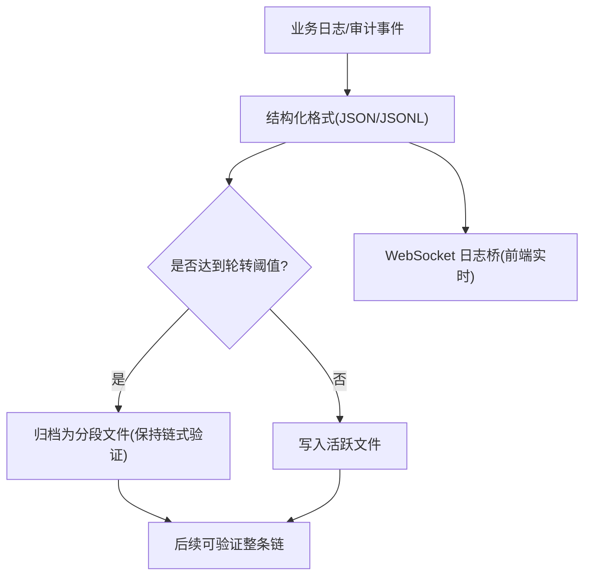
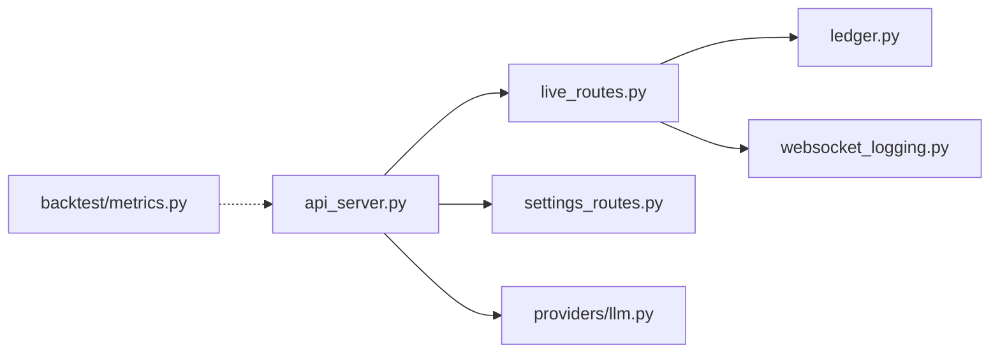

# 监控与告警

<cite>
**本文引用的文件**
- [agent/api_server.py](file://agent/api_server.py)
- [agent/src/api/live_routes.py](file://agent/src/api/live_routes.py)
- [agent/backtest/metrics.py](file://agent/backtest/metrics.py)
- [agent/src/governance/ledger.py](file://agent/src/governance/ledger.py)
- [agent/src/channelsui/websocket_logging.py](file://agent/src/channelsui/websocket_logging.py)
- [agent/src/providers/llm.py](file://agent/src/providers/llm.py)
- [agent/src/api/settings_routes.py](file://agent/src/api/settings_routes.py)
- [agent/tests/test_api_live_runtime.py](file://agent/tests/test_api_live_runtime.py)
</cite>

## 目录
1. [简介](#简介)
2. [项目结构](#项目结构)
3. [核心组件](#核心组件)
4. [架构总览](#架构总览)
5. [详细组件分析](#详细组件分析)
6. [依赖关系分析](#依赖关系分析)
7. [性能考量](#性能考量)
8. [故障诊断指南](#故障诊断指南)
9. [结论](#结论)
10. [附录](#附录)

## 简介
本文件面向“监控与告警”主题，结合仓库中的实际代码，系统说明：
- 内置健康检查与运行态暴露能力（以 /live/status 为代表）
- 关键性能指标（回测收益、波动、夏普、最大回撤等）
- 日志收集策略（结构化日志、审计链与轮转）
- 告警规则配置思路（阈值、通知渠道、升级机制）
- 监控仪表板示例（Grafana/可视化建议）
- 故障诊断工具（慢查询、内存泄漏、性能瓶颈识别）
- 分布式追踪思路（跨服务请求跟踪）

注意：本项目未提供通用的 /live 和 /health 两个独立端点；但提供了 /live/status 用于集中暴露运行状态与健康信息。下文将据此给出准确实现说明与扩展建议。

## 项目结构
围绕监控与告警的相关代码主要分布在以下位置：
- API 层：FastAPI 路由注册与认证依赖，挂载 live、settings 等模块
- Live 交易通道：/live/* 路由，包含授权、熔断（halt/resume）、状态查询、Runner 启停
- 回测指标：统一的 metrics 计算与年化、换手率、基准对比等
- 审计与日志：可验证的审计链（ledger），支持按大小轮转归档
- 日志桥接：WebSocket 日志桥接，便于前端实时查看
- 设置与 LLM：设置读取与敏感信息脱敏，便于安全地暴露诊断信息

图表来源
- [agent/api_server.py:1-120](file://agent/api_server.py#L1-L120)
- [agent/src/api/live_routes.py:1-120](file://agent/src/api/live_routes.py#L1-L120)
- [agent/src/api/settings_routes.py:586-613](file://agent/src/api/settings_routes.py#L586-L613)
- [agent/src/governance/ledger.py:614-637](file://agent/src/governance/ledger.py#L614-L637)
- [agent/src/channelsui/websocket_logging.py:1-8](file://agent/src/channelsui/websocket_logging.py#L1-L8)
- [agent/src/providers/llm.py:868-893](file://agent/src/providers/llm.py#L868-L893)
- [agent/backtest/metrics.py:461-626](file://agent/backtest/metrics.py#L461-L626)

章节来源
- [agent/api_server.py:1-120](file://agent/api_server.py#L1-L120)
- [agent/src/api/live_routes.py:1-120](file://agent/src/api/live_routes.py#L1-L120)
- [agent/src/api/settings_routes.py:586-613](file://agent/src/api/settings_routes.py#L586-L613)

## 核心组件
- 健康检查与运行态
  - 通过 /live/status 返回全局熔断状态、各券商/连接器的授权、委托单、Runner 存活与心跳等信息，适合用作健康检查端点。
  - 该端点受认证保护，并聚合 OAuth/mandate 路径与 broker_sdk 连接器两类来源的状态。
- 关键性能指标
  - 回测指标统一由 backtest/metrics.py 计算，包括总收益、年化收益、最大回撤、夏普比率、索提诺比率、胜率、换手率、基准对比（超额收益、信息比率、跟踪误差、Beta）等。
- 日志与审计
  - governance/ledger.py 提供可验证的追加式审计链，支持按大小轮转归档，保证审计连续性。
  - channelsui/websocket_logging.py 为 WebSocket 日志桥，便于前端实时查看。
  - providers/llm.py 对日志中的敏感信息进行脱敏处理，避免泄露。
- 设置与环境
  - settings_routes.py 暴露设置读取接口，便于前端展示当前配置与环境变量（脱敏后）。

章节来源
- [agent/src/api/live_routes.py:879-956](file://agent/src/api/live_routes.py#L879-L956)
- [agent/backtest/metrics.py:461-626](file://agent/backtest/metrics.py#L461-L626)
- [agent/src/governance/ledger.py:614-637](file://agent/src/governance/ledger.py#L614-L637)
- [agent/src/channelsui/websocket_logging.py:1-8](file://agent/src/channelsui/websocket_logging.py#L1-L8)
- [agent/src/providers/llm.py:868-893](file://agent/src/providers/llm.py#L868-L893)
- [agent/src/api/settings_routes.py:586-613](file://agent/src/api/settings_routes.py#L586-L613)

## 架构总览
下图展示了从客户端到后端的路径：认证 -> /live/status -> 聚合各连接器/Runner 状态 -> 事件总线 -> 前端 SSE/WebSocket。

图表来源
- [agent/api_server.py:1-120](file://agent/api_server.py#L1-L120)
- [agent/src/api/live_routes.py:879-956](file://agent/src/api/live_routes.py#L879-L956)
- [agent/src/governance/ledger.py:614-637](file://agent/src/governance/ledger.py#L614-L637)

## 详细组件分析

### 健康检查端点 /live/status
- 功能
  - 返回全局熔断标志与各券商/连接器的授权、委托单、Runner 存活与心跳时间戳、最近心跳年龄等。
  - 支持按 broker 过滤，若参数为空则返回全部。
- 实现要点
  - 使用 Pydantic 模型定义响应结构，确保字段稳定且可序列化。
  - 内部缓存连接器验证结果（去密文），降低频繁探测开销。
  - 通过事件总线广播 live.halted/live.resumed/live.action 等事件，供前端实时刷新。
- 测试覆盖
  - 测试用例验证默认休眠状态、broker 过滤、空参数拒绝等行为。

图表来源
- [agent/src/api/live_routes.py:879-956](file://agent/src/api/live_routes.py#L879-L956)
- [agent/tests/test_api_live_runtime.py:58-97](file://agent/tests/test_api_live_runtime.py#L58-L97)

章节来源
- [agent/src/api/live_routes.py:879-956](file://agent/src/api/live_routes.py#L879-L956)
- [agent/tests/test_api_live_runtime.py:58-97](file://agent/tests/test_api_live_runtime.py#L58-L97)

### 关键性能指标（回测）
- 指标范围
  - 收益类：总收益、年化收益、基准收益、超额收益
  - 风险类：最大回撤、波动率、跟踪误差、Beta
  - 风险调整后收益：夏普比率、索提诺比率、Calmar 比率、信息比率
  - 交易统计：胜率、盈亏比、最大连续亏损、平均持仓周期、交易次数
  - 换手率：基于仓位或成交证据的每根K线换手率序列及均值/总和
- 计算逻辑
  - 根据数据源与周期自动选择年化因子（交易日数与每日K线数）
  - 对异常价格（零或负）进行安全处理，避免无穷大或NaN污染
  - 基准对齐与主动收益计算，保障小样本下的稳定性

图表来源
- [agent/backtest/metrics.py:153-171](file://agent/backtest/metrics.py#L153-L171)
- [agent/backtest/metrics.py:245-302](file://agent/backtest/metrics.py#L245-L302)
- [agent/backtest/metrics.py:461-626](file://agent/backtest/metrics.py#L461-L626)

章节来源
- [agent/backtest/metrics.py:153-171](file://agent/backtest/metrics.py#L153-L171)
- [agent/backtest/metrics.py:245-302](file://agent/backtest/metrics.py#L245-L302)
- [agent/backtest/metrics.py:461-626](file://agent/backtest/metrics.py#L461-L626)

### 日志收集策略
- 结构化日志
  - 各模块使用标准 logging，便于统一采集与检索。
  - WebSocket 日志桥将日志转发至前端，便于实时观察。
- 审计链与轮转
  - 审计链采用追加式 JSONL，每条记录带哈希，支持跨段验证。
  - 当活跃文件超过阈值时进行轮转归档，保留历史片段，不删除任何记录。
- 敏感信息脱敏
  - 日志中对 .env 来源、base URL 等进行脱敏，避免泄露。

图表来源
- [agent/src/governance/ledger.py:614-637](file://agent/src/governance/ledger.py#L614-L637)
- [agent/src/channelsui/websocket_logging.py:1-8](file://agent/src/channelsui/websocket_logging.py#L1-L8)
- [agent/src/providers/llm.py:868-893](file://agent/src/providers/llm.py#L868-L893)

章节来源
- [agent/src/governance/ledger.py:614-637](file://agent/src/governance/ledger.py#L614-L637)
- [agent/src/channelsui/websocket_logging.py:1-8](file://agent/src/channelsui/websocket_logging.py#L1-L8)
- [agent/src/providers/llm.py:868-893](file://agent/src/providers/llm.py#L868-L893)

### 告警规则配置（建议与实践）
- 阈值设置
  - 基于 /live/status 的 runner 心跳年龄、熔断标志、连接器错误码等作为触发条件。
  - 基于回测指标（如最大回撤、夏普低于阈值）作为周期性评估告警。
- 通知渠道集成
  - 项目已具备多渠道消息能力（Slack、邮件、钉钉、飞书等），可在告警触发时通过相应渠道发送。
- 告警升级机制
  - 建议分层：P3/P2/P1，持续N分钟未恢复则升级；同一问题合并去重；不同渠道并行通知。
- 实施建议
  - 在外部监控系统（Prometheus/Grafana）中拉取 /live/status 与指标，设定阈值规则。
  - 将审计链与日志接入集中式存储（ELK/Loki），配合告警引擎（Alertmanager）联动。

[本节为概念性指导，不直接分析具体文件]

### 监控仪表板示例（Grafana）
- 推荐面板
  - 健康度：全局熔断标志、各连接器连接状态、Runner 存活与心跳延迟
  - 性能：API 响应时间（可引入中间件埋点）、回测指标（收益、波动、回撤、夏普）
  - 资源：CPU/内存/磁盘（容器/主机层面）
  - 日志：错误级别分布、审计链长度、轮转次数
- 数据来源
  - /live/status 定期抓取（HTTP 指标采集器）
  - 回测指标导出（CSV/数据库）
  - 日志与审计链（ELK/Loki）
- 可视化建议
  - 使用 Grafana 仪表盘，结合 Prometheus 时序数据与 Loki 日志查询。
  - 对关键指标设置阈值与颜色映射，便于快速定位异常。

[本节为概念性指导，不直接分析具体文件]

### 分布式追踪（跨服务请求跟踪）
- 现状
  - 代码库未显式集成 OpenTelemetry/Jaeger 等分布式追踪框架。
- 建议方案
  - 在 FastAPI 中间件中注入 trace_id/span_id，贯穿 HTTP 请求链路。
  - 将 trace_id 写入结构化日志，便于跨服务关联。
  - 对接 Jaeger/Zipkin 进行可视化追踪，定位慢调用与失败点。

[本节为概念性指导，不直接分析具体文件]

## 依赖关系分析
- 路由与认证
  - api_server.py 负责挂载路由与认证依赖；live_routes.py 与 settings_routes.py 通过 register_* 函数挂载到 app。
- 状态聚合
  - live_routes.py 聚合连接器状态、Runner 状态、熔断标志，并通过事件总线广播事件。
- 指标与日志
  - backtest/metrics.py 提供回测指标计算；governance/ledger.py 提供审计链与轮转；channelsui/websocket_logging.py 提供日志桥。
- 设置与脱敏
  - settings_routes.py 暴露设置读取；providers/llm.py 对日志中的敏感信息进行脱敏。

图表来源
- [agent/api_server.py:1-120](file://agent/api_server.py#L1-L120)
- [agent/src/api/live_routes.py:1-120](file://agent/src/api/live_routes.py#L1-L120)
- [agent/src/api/settings_routes.py:586-613](file://agent/src/api/settings_routes.py#L586-L613)
- [agent/src/governance/ledger.py:614-637](file://agent/src/governance/ledger.py#L614-L637)
- [agent/src/channelsui/websocket_logging.py:1-8](file://agent/src/channelsui/websocket_logging.py#L1-L8)
- [agent/src/providers/llm.py:868-893](file://agent/src/providers/llm.py#L868-L893)
- [agent/backtest/metrics.py:461-626](file://agent/backtest/metrics.py#L461-L626)

章节来源
- [agent/api_server.py:1-120](file://agent/api_server.py#L1-L120)
- [agent/src/api/live_routes.py:1-120](file://agent/src/api/live_routes.py#L1-L120)
- [agent/src/api/settings_routes.py:586-613](file://agent/src/api/settings_routes.py#L586-L613)

## 性能考量
- 健康检查
  - /live/status 使用缓存减少连接器验证开销；心跳年龄用于判断 Runner 活跃度。
- 指标计算
  - 回测指标对异常值与小样本进行防护，避免无穷大或NaN影响结果。
- 日志与审计
  - 审计链按大小轮转，控制活跃文件大小；日志桥仅用于调试与观测，生产环境建议落盘与集中存储。
- 建议
  - 为 API 增加响应时间埋点（中间件），以便在 Grafana 中展示 P95/P99 延迟。
  - 对高并发场景，考虑异步化与连接池优化。

[本节为一般性指导，不直接分析具体文件]

## 故障诊断指南
- 慢查询分析
  - 在 API 中间件中添加耗时统计，结合日志 trace_id 定位慢调用。
  - 对数据库/外部 API 调用添加超时与重试策略。
- 内存泄漏检测
  - 使用 Python 内存分析工具（如 tracemalloc、memory_profiler）定位增长热点。
  - 关注长生命周期对象（缓存、任务队列）的释放。
- 性能瓶颈识别
  - 通过 CPU/内存/IO 监控定位热点；结合日志与审计链回溯问题发生时间。
  - 对回测指标异常（如回撤过大、夏普过低）进行根因分析。

[本节为一般性指导，不直接分析具体文件]

## 结论
- 本项目通过 /live/status 提供了集中化的运行态与健康信息，适合作为健康检查端点。
- 回测指标体系完善，涵盖收益、风险、风险调整后收益与换手率等，可用于监控与告警。
- 日志与审计链支持结构化、轮转与验证，便于合规与排障。
- 建议在外部监控系统中集成 /live/status 与指标，结合多渠道通知与升级机制，形成完整的监控与告警闭环。
- 对于分布式追踪，建议引入 OpenTelemetry 等框架，提升跨服务问题定位效率。

[本节为总结性内容，不直接分析具体文件]

## 附录
- 常用端点
  - GET /live/status：获取全局熔断与各连接器/Runner 状态
  - POST /live/halt：触发熔断
  - POST /live/resume：解除熔断
  - POST /live/runner/start|stop：启动/停止持久化 Runner
- 指标参考
  - 总收益、年化收益、最大回撤、夏普、索提诺、Calmar、信息比率、跟踪误差、Beta、胜率、换手率等
- 日志与审计
  - 审计链文件轮转、验证与归档
  - WebSocket 日志桥用于前端实时观察

[本节为补充信息，不直接分析具体文件]