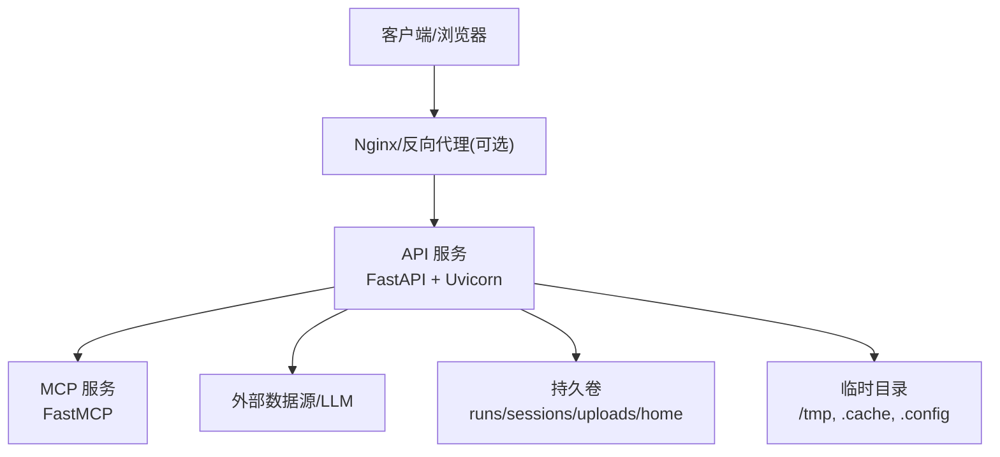
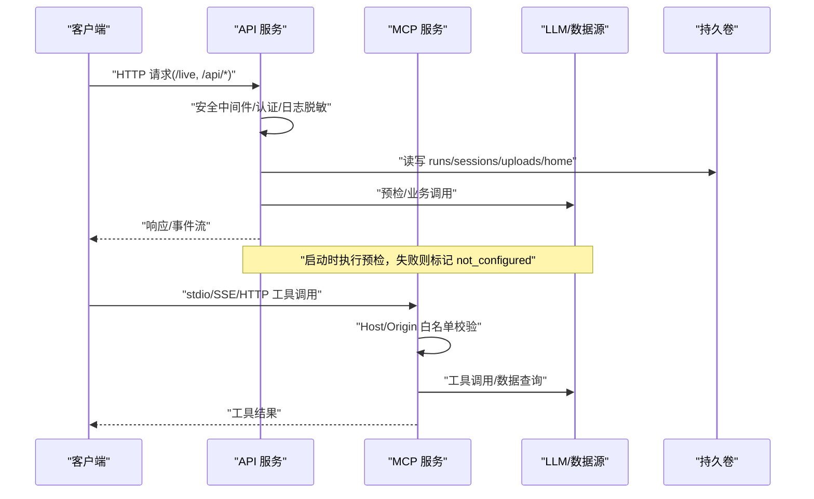
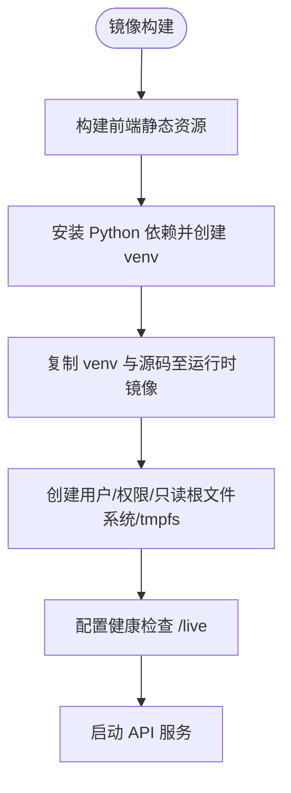
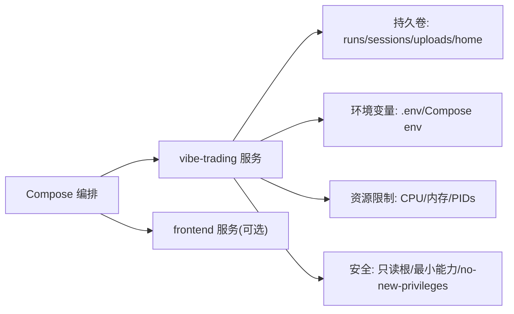
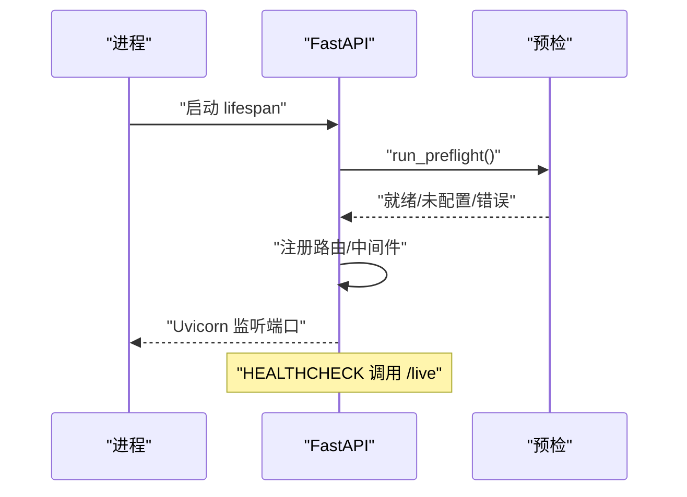
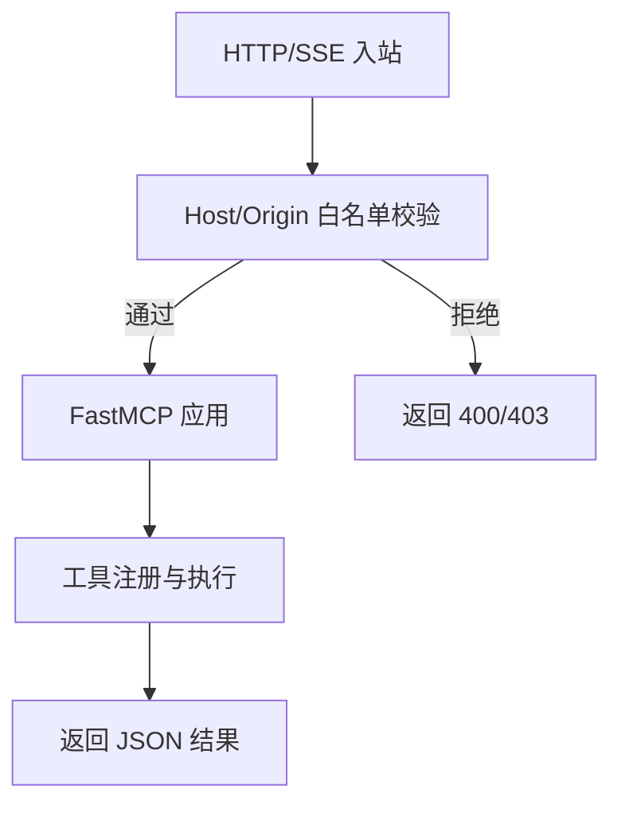
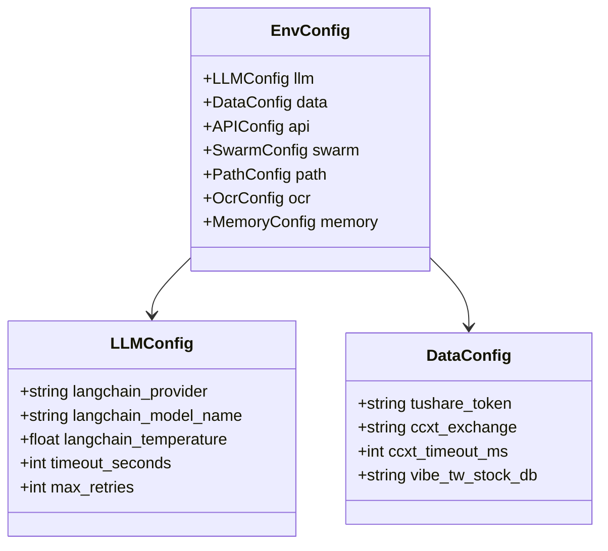
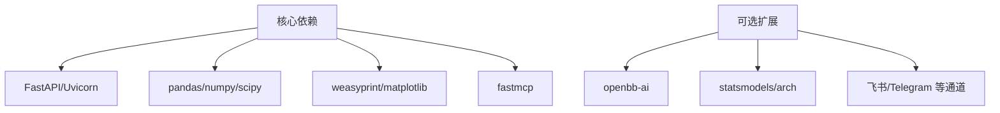
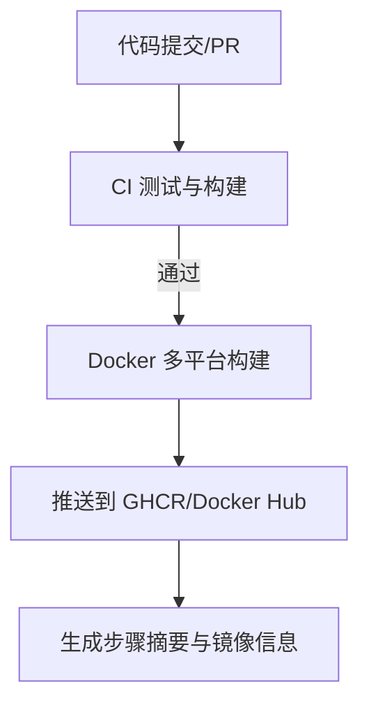

# 部署与运维

<cite>
**本文引用的文件**
- [Dockerfile](file://Dockerfile)
- [docker-compose.yml](file://docker-compose.yml)
- [pyproject.toml](file://pyproject.toml)
- [agent/api_server.py](file://agent/api_server.py)
- [agent/mcp_server.py](file://agent/mcp_server.py)
- [agent/requirements.txt](file://agent/requirements.txt)
- [.github/workflows/docker-build.yml](file://.github/workflows/docker-build.yml)
- [.github/workflows/test.yml](file://.github/workflows/test.yml)
- [.devcontainer/devcontainer.json](file://.devcontainer/devcontainer.json)
- [agent/src/config/env_schema.py](file://agent/src/config/env_schema.py)
- [agent/src/preflight.py](file://agent/src/preflight.py)
</cite>

## 目录
1. [简介](#简介)
2. [项目结构](#项目结构)
3. [核心组件](#核心组件)
4. [架构总览](#架构总览)
5. [详细组件分析](#详细组件分析)
6. [依赖分析](#依赖分析)
7. [性能考虑](#性能考虑)
8. [故障排除指南](#故障排除指南)
9. [结论](#结论)
10. [附录](#附录)

## 简介
本指南面向运维工程师与 DevOps 团队，提供 Vibe-Trading 的容器化部署、生产环境策略、监控告警、故障排除、CI/CD 流水线以及容量规划与优化建议。内容基于仓库中的 Dockerfile、Compose、API/MCP 服务实现、环境变量配置与 CI 工作流整理而成，确保可操作、可落地。

## 项目结构
- 后端 API：FastAPI + Uvicorn，提供 REST/SSE 接口，并静态托管前端构建产物。
- MCP 服务：独立进程暴露研究工具，支持 stdio、SSE、Streamable HTTP 传输。
- 前端：Node 构建的 SPA，生产模式由后端静态托管；开发模式通过 Compose 启动独立前端服务。
- 容器化：多阶段镜像构建（Node 构建前端、Python 构建 venv、运行时最小镜像），健康检查与只读根文件系统加固。
- 编排：docker-compose 定义 API 与可选前端开发服务，挂载持久卷、限制资源、安全能力裁剪。
- CI/CD：GitHub Actions 负责测试、前端构建、Docker 镜像多平台构建与推送。

**图表来源**
- [Dockerfile:59-118](file://Dockerfile#L59-L118)
- [docker-compose.yml:1-66](file://docker-compose.yml#L1-L66)
- [agent/api_server.py:321-395](file://agent/api_server.py#L321-L395)
- [agent/mcp_server.py:31-39](file://agent/mcp_server.py#L31-L39)

**章节来源**
- [Dockerfile:1-118](file://Dockerfile#L1-L118)
- [docker-compose.yml:1-90](file://docker-compose.yml#L1-L90)
- [agent/api_server.py:1-400](file://agent/api_server.py#L1-L400)
- [agent/mcp_server.py:1-800](file://agent/mcp_server.py#L1-L800)

## 核心组件
- API 服务：入口为 CLI 命令 serve，绑定端口、加载静态前端、注册路由与安全中间件，启动时执行预检与定时任务初始化。
- MCP 服务：暴露研究工具集，支持多种传输协议，内置 Host/Origin 白名单防护，默认禁用 shell 工具需显式启用。
- 配置系统：集中化的环境变量 Schema，统一读取与校验，覆盖 LLM、数据源、API、Swarm 等配置域。
- 健康检查：容器 HEALTHCHECK 调用 /live 端点；服务启动时进行 LLM/数据源连通性探测。

**章节来源**
- [agent/api_server.py:127-183](file://agent/api_server.py#L127-L183)
- [agent/api_server.py:321-395](file://agent/api_server.py#L321-L395)
- [agent/mcp_server.py:90-131](file://agent/mcp_server.py#L90-L131)
- [agent/mcp_server.py:132-318](file://agent/mcp_server.py#L132-L318)
- [agent/src/config/env_schema.py:1-200](file://agent/src/config/env_schema.py#L1-L200)
- [agent/src/preflight.py:108-147](file://agent/src/preflight.py#L108-L147)
- [Dockerfile:113-118](file://Dockerfile#L113-L118)

## 架构总览
下图展示从客户端到 API、MCP、外部依赖及存储的完整链路，包括健康检查与配置注入。

**图表来源**
- [agent/api_server.py:166-185](file://agent/api_server.py#L166-L185)
- [agent/api_server.py:321-395](file://agent/api_server.py#L321-L395)
- [agent/mcp_server.py:132-318](file://agent/mcp_server.py#L132-L318)
- [agent/src/preflight.py:108-147](file://agent/src/preflight.py#L108-L147)

## 详细组件分析

### 容器镜像与运行态
- 多阶段构建：前端 Node 构建产物、Python venv 预编译依赖、运行时仅携带必要库与字体。
- 安全加固：非 root 用户运行、只读根文件系统、最小权限能力（仅 SETUID/SETGID）、no-new-privileges、tmpfs 临时目录。
- 健康检查：容器级 /live 探针，超时与重试参数合理设置。
- 端口暴露：默认 8899，供反向代理或负载均衡接入。

**图表来源**
- [Dockerfile:1-118](file://Dockerfile#L1-L118)

**章节来源**
- [Dockerfile:1-118](file://Dockerfile#L1-L118)

### 容器编排与服务发现
- Compose 服务：vibe-trading（API）与 frontend（开发模式）。
- 环境变量：通过 env_file 与环境变量注入，如 OLLAMA_BASE_URL、VIBE_TW_STOCK_DB、信任回环等。
- 网络与主机映射：Linux 下 host.docker.internal -> host-gateway，便于访问宿主机服务。
- 数据持久化：命名卷挂载 runs、sessions、uploads、home 等关键目录。
- 资源限制：CPU、内存、PIDs 上限，防止单实例失控。
- 安全选项：cap_drop/cap_add/security_opt/read_only/tmpfs。

**图表来源**
- [docker-compose.yml:1-66](file://docker-compose.yml#L1-L66)

**章节来源**
- [docker-compose.yml:1-90](file://docker-compose.yml#L1-L90)

### API 服务生命周期与健康检查
- 启动流程：迁移旧状态、预检（LLM/数据源连通性）、启动定时研究执行器、按需启动通道运行时。
- 中间件：CORS、拒绝不可信回环主机、SPA 深链回退、安全头注入。
- 静态资源：生产模式下挂载前端 dist，开发模式可拉起 Vite 开发服务器。
- 健康检查：/live 端点用于容器探针；/health 作为遗留别名。

**图表来源**
- [agent/api_server.py:127-183](file://agent/api_server.py#L127-L183)
- [agent/api_server.py:321-395](file://agent/api_server.py#L321-L395)
- [Dockerfile:113-118](file://Dockerfile#L113-L118)

**章节来源**
- [agent/api_server.py:127-183](file://agent/api_server.py#L127-L183)
- [agent/api_server.py:321-395](file://agent/api_server.py#L321-L395)
- [Dockerfile:113-118](file://Dockerfile#L113-L118)

### MCP 服务安全与传输
- 传输方式：stdio（默认）、SSE（遗留）、Streamable HTTP（当前规范）。
- 安全中间件：Host/Origin 白名单，防御 DNS Rebinding；默认仅允许本地回环。
- Shell 工具：默认关闭，需显式通过环境变量或命令行启用。
- 会话管理：进程内会话 ID 默认稳定，避免客户端传入无效标识。

**图表来源**
- [agent/mcp_server.py:31-39](file://agent/mcp_server.py#L31-L39)
- [agent/mcp_server.py:132-318](file://agent/mcp_server.py#L132-L318)

**章节来源**
- [agent/mcp_server.py:90-131](file://agent/mcp_server.py#L90-L131)
- [agent/mcp_server.py:132-318](file://agent/mcp_server.py#L132-L318)

### 配置与环境变量
- 集中 Schema：Pydantic 模型统一管理环境变量，支持布尔/数值/字符串类型与默认值。
- 主要域：LLM 提供商、数据源凭据、API 行为、Swarm 调度、OCR、路径、内存等。
- 写入配置：设置路由将变更持久化到 .env，兼容旧路径迁移。

**图表来源**
- [agent/src/config/env_schema.py:1-200](file://agent/src/config/env_schema.py#L1-L200)

**章节来源**
- [agent/src/config/env_schema.py:1-200](file://agent/src/config/env_schema.py#L1-L200)
- [agent/api_server.py:446-519](file://agent/api_server.py#L446-L519)

## 依赖分析
- 运行时依赖：FastAPI、Uvicorn、WebSockets、Pydantic、sse-starlette、fastmcp、pandas/numpy/scipy、weasyprint/matplotlib 等。
- 可选扩展：OpenBB、统计模型、A股/Broker 连接器、消息通道等通过 extras 引入。
- 锁定依赖：CI 验证哈希锁定的 requirements-lock.txt 与 channels 锁，保证构建可重复。

**图表来源**
- [agent/requirements.txt:1-69](file://agent/requirements.txt#L1-L69)
- [pyproject.toml:24-69](file://pyproject.toml#L24-L69)
- [pyproject.toml:105-237](file://pyproject.toml#L105-L237)

**章节来源**
- [agent/requirements.txt:1-69](file://agent/requirements.txt#L1-L69)
- [pyproject.toml:24-69](file://pyproject.toml#L24-L69)
- [pyproject.toml:105-237](file://pyproject.toml#L105-L237)

## 性能考虑
- 资源限制：Compose 中设置 CPU、内存、PIDs 上限，避免单实例占用过多资源。
- 只读根文件系统：减少写放大，提升稳定性；使用 tmpfs 存放临时缓存。
- 依赖预编译：venv 在构建阶段安装，运行时无编译开销。
- 前端静态资源：生产模式由后端直接提供，减少额外 Web 服务器开销。
- 外部依赖调优：根据 LLM/数据源延迟调整超时与重试参数（通过环境变量）。

[本节为通用指导，不直接分析具体文件]

## 故障排除指南
- 启动失败/未配置：查看预检输出，确认 LLM/数据源 base_url、密钥、网络可达性。
- 健康检查失败：检查 /live 端点是否可达，确认端口绑定与防火墙规则。
- 权限问题：确认容器用户与卷所有权，避免写入失败。
- 安全拦截：MCP 的 Host/Origin 白名单可能拒绝跨域请求，调整环境变量或代理配置。
- 依赖缺失：确认 channel SDK 与可选 extras 已正确安装。

**章节来源**
- [agent/src/preflight.py:108-147](file://agent/src/preflight.py#L108-L147)
- [Dockerfile:113-118](file://Dockerfile#L113-L118)
- [docker-compose.yml:40-66](file://docker-compose.yml#L40-L66)
- [agent/mcp_server.py:132-318](file://agent/mcp_server.py#L132-L318)

## 结论
本项目提供了完善的容器化与编排方案，具备生产级安全加固与健康检查。通过集中化配置、CI/CD 自动化与可选扩展，可灵活适配单机、集群与云原生部署。结合合理的资源限制与监控策略，可实现高可用与可观测的运行环境。

[本节为总结，不直接分析具体文件]

## 附录

### 持续集成与持续部署
- 测试流水线：Python 与 Node 环境准备、依赖哈希校验、语法检查、单元测试、前端构建与测试。
- 镜像构建：多平台（amd64/arm64）构建与推送至 GHCR/Docker Hub，附带元数据与描述更新。
- 触发方式：push/PR 自动触发，支持手动触发镜像构建。

**图表来源**
- [.github/workflows/test.yml:1-165](file://.github/workflows/test.yml#L1-L165)
- [.github/workflows/docker-build.yml:1-129](file://.github/workflows/docker-build.yml#L1-L129)

**章节来源**
- [.github/workflows/test.yml:1-165](file://.github/workflows/test.yml#L1-L165)
- [.github/workflows/docker-build.yml:1-129](file://.github/workflows/docker-build.yml#L1-L129)

### 不同部署场景最佳实践
- 单机部署：使用 docker-compose 快速启动 API 与可选前端开发服务，挂载持久卷，设置必要环境变量。
- 集群部署：通过反向代理（Nginx/Traefik）暴露 8899 端口，配合健康检查与滚动更新；按负载水平扩容副本数。
- 云原生部署：将 Compose 转换为 Kubernetes Deployment/Service/Ingress，使用 ConfigMap/Secret 管理环境变量，使用 PersistentVolume 持久化数据。
- 开发环境：使用 devcontainer 一键搭建，自动转发 8899/5899 端口，安装依赖并启动前后端。

**章节来源**
- [docker-compose.yml:1-90](file://docker-compose.yml#L1-L90)
- [.devcontainer/devcontainer.json:1-40](file://.devcontainer/devcontainer.json#L1-L40)
- [Dockerfile:1-118](file://Dockerfile#L1-L118)

### 容量规划与性能优化建议
- 计算资源：根据并发请求与 LLM/数据源延迟调整 CPU/内存；对长耗时任务（回测/因子分析）限制 PIDs 与内存。
- I/O 优化：使用 SSD 持久卷；将频繁写入的目录（runs/sessions/uploads）单独挂载；利用 tmpfs 加速临时缓存。
- 网络优化：合理设置超时与重试；对高频数据源启用缓存；必要时引入 CDN 或本地镜像源。
- 前端优化：生产模式静态托管；压缩与缓存静态资源；减少不必要的重渲染。

[本节为通用指导，不直接分析具体文件]