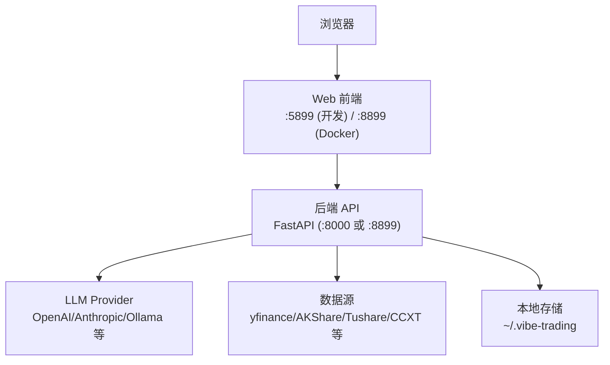
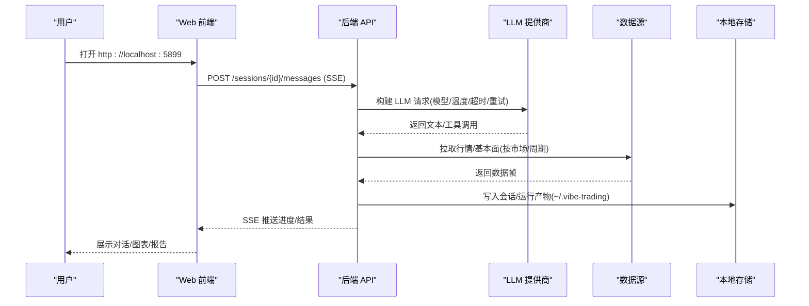
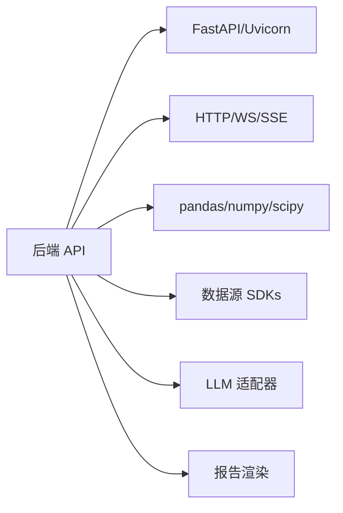

# 快速开始指南

<cite>
**本文引用的文件**
- [README_zh.md](file://README_zh.md)
- [docker-compose.yml](file://docker-compose.yml)
- [start.bat](file://start.bat)
- [agent/api_server.py](file://agent/api_server.py)
- [agent/requirements.txt](file://agent/requirements.txt)
- [pyproject.toml](file://pyproject.toml)
- [agent/cli/onboard.py](file://agent/cli/onboard.py)
- [agent/src/api/settings_routes.py](file://agent/src/api/settings_routes.py)
- [agent/src/providers/llm.py](file://agent/src/providers/llm.py)
</cite>

## 目录
1. [简介](#简介)
2. [项目结构](#项目结构)
3. [核心组件](#核心组件)
4. [架构总览](#架构总览)
5. [详细组件分析](#详细组件分析)
6. [依赖分析](#依赖分析)
7. [性能注意事项](#性能注意事项)
8. [故障排除指南](#故障排除指南)
9. [结论](#结论)
10. [附录](#附录)

## 简介
本指南帮助你在 15 分钟内完成 Vibe-Trading 的安装、首次启动与基础配置，并运行你的第一个自然语言交易策略。你将学会：
- 准备环境（Python/Docker）
- 安装依赖与配置 API 密钥
- 启动 CLI 与 Web 界面
- 通过自然语言描述生成可执行的回测策略
- 使用 CLI 进行交互式研究与回测
- 在 Web 界面中管理会话、查看结果
- 常见问题的定位与解决
- 安全与最佳实践

## 项目结构
Vibe-Trading 由后端 API、CLI、Web 前端和可选的 Docker 编排组成：
- 后端 API：FastAPI 服务，提供会话、回测、设置、通道等接口
- CLI：命令行工具，支持交互式研究、回测、会话恢复等
- Web 前端：React 应用，提供聊天、图表、报告等可视化能力
- Docker Compose：一键拉起后端与前端，持久化用户数据

图示来源
- [agent/api_server.py:166-185](file://agent/api_server.py#L166-L185)
- [docker-compose.yml:1-39](file://docker-compose.yml#L1-L39)
- [start.bat:10-29](file://start.bat#L10-L29)

章节来源
- [README_zh.md:714-731](file://README_zh.md#L714-L731)
- [docker-compose.yml:1-90](file://docker-compose.yml#L1-L90)
- [start.bat:1-30](file://start.bat#L1-L30)
- [agent/api_server.py:166-185](file://agent/api_server.py#L166-L185)

## 核心组件
- 后端 API 服务：负责会话管理、回测执行、设置读写、SSE 实时流、认证与安全头
- CLI：交互式研究与回测入口，支持 provider 初始化、会话恢复、命令路由
- Web 前端：会话聊天、运行详情、Alpha 库、相关性、选项分析等页面
- LLM 适配层：统一多提供商接入，支持推理强度、超时、重试等参数
- 数据加载器：多市场、多源 OHLCV 获取，含免费与 key-gated 源

章节来源
- [agent/api_server.py:166-185](file://agent/api_server.py#L166-L185)
- [agent/src/providers/llm.py:1524-1572](file://agent/src/providers/llm.py#L1524-L1572)
- [agent/src/api/settings_routes.py:41-86](file://agent/src/api/settings_routes.py#L41-L86)
- [agent/requirements.txt:1-69](file://agent/requirements.txt#L1-L69)

## 架构总览
下图展示了从 Web 到后端、再到 LLM 与数据源的调用链，以及本地状态存储位置。

图示来源
- [agent/api_server.py:166-185](file://agent/api_server.py#L166-L185)
- [agent/src/providers/llm.py:1524-1572](file://agent/src/providers/llm.py#L1524-L1572)
- [agent/src/api/settings_routes.py:41-86](file://agent/src/api/settings_routes.py#L41-L86)

## 详细组件分析

### 安装与环境要求
- Python 路径（Path B）：需要 Python 3.11+；推荐在虚拟环境中安装
- Docker 路径（Path A）：零配置，内置后端与前端，端口映射为 127.0.0.1:8899
- LLM Provider：至少选择一个（OpenRouter、Requesty、OpenAI、Anthropic、Ollama 等），或本地 Ollama
- 数据源：默认可免费工作（yfinance/Yahoo、OKX、mootdx、AKShare），Tushare token 可选

步骤概览
- Docker 方式：克隆仓库 → 复制 .env.example 为 .env → 编辑启用一个 Provider 并填入 API Key → docker compose up --build → 访问 http://localhost:8899
- Python 方式：安装依赖 → 配置 .env → 启动后端与前端（或使用 start.bat）

章节来源
- [README_zh.md:714-731](file://README_zh.md#L714-L731)
- [docker-compose.yml:1-39](file://docker-compose.yml#L1-L39)
- [start.bat:10-29](file://start.bat#L10-L29)
- [agent/requirements.txt:1-69](file://agent/requirements.txt#L1-L69)

### 首次启动与基础配置
- 选择并配置 LLM Provider：
  - 通过 CLI 引导式初始化创建 ~/.vibe-trading/.env，选择 Provider、模型、Base URL、API Key
  - 或通过 Web 设置页更新 LLM 设置（provider、model_name、base_url、api_key、temperature、timeout_seconds、max_retries、reasoning_effort）
- 验证 Provider 连通性：
  - 使用“Provider Doctor”或设置页探测模型列表，确认网络与鉴权正常
- 数据源无需强制配置即可工作（免费源自动 fallback）

章节来源
- [agent/cli/onboard.py:38-70](file://agent/cli/onboard.py#L38-L70)
- [agent/src/api/settings_routes.py:41-86](file://agent/src/api/settings_routes.py#L41-L86)
- [agent/src/providers/llm.py:1524-1572](file://agent/src/providers/llm.py#L1524-L1572)

### 第一个自然语言交易策略示例
目标：用自然语言描述一个简单的均值回归策略，并在历史数据上回测。

建议流程
- 在 CLI 或 Web 聊天中输入类似：“请基于近 20 日收盘价对某标的做均值回归策略，超卖买入、超买卖出，回测最近一年。”
- 系统会：
  - 解析意图，识别标的与市场
  - 拉取历史数据（默认免费源）
  - 生成信号引擎代码（受沙箱约束）
  - 执行回测，输出收益曲线、指标与风险透视
- 你可以在 Web 的“运行详情”查看图表、归因与导出报告

注意
- 若未配置任何 Provider，系统将提示你配置；若网络受限，优先尝试本地 Ollama
- 若数据源被限流，可开启本地缓存开关以减少网络请求

章节来源
- [agent/api_server.py:166-185](file://agent/api_server.py#L166-L185)
- [agent/src/providers/llm.py:1524-1572](file://agent/src/providers/llm.py#L1524-L1572)

### 使用 CLI 进行交互式研究与回测
常用操作
- 初始化：运行引导式 setup，选择 Provider、填写 Key
- 交互研究：进入 CLI 后直接输入问题，系统会自动调用工具、拉取数据、生成代码并回测
- 会话恢复：退出时显示 session-id，下次可用 resume 命令继续
- 回测命令：通过 CLI 子命令触发独立回测任务，查看 artifacts

章节来源
- [agent/cli/onboard.py:38-70](file://agent/cli/onboard.py#L38-L70)

### Web 界面基本使用方法
- 会话管理：新建会话、切换会话、停止运行、查看消息历史
- 结果查看：运行详情包含收益曲线、月度热力图、年度收益、回撤区间、风险透视
- Alpha 库与对比：浏览因子库，选择多个因子进行对比排名
- 设置：在设置页配置 LLM Provider、模型、超时、重试、推理强度等

章节来源
- [agent/api_server.py:166-185](file://agent/api_server.py#L166-L185)
- [agent/src/api/settings_routes.py:41-86](file://agent/src/api/settings_routes.py#L41-L86)

## 依赖分析
- 运行时依赖：FastAPI、uvicorn、httpx、pydantic、sse-starlette、websockets 等
- 数据与计算：pandas、numpy、scipy、duckdb、bottleneck
- 文档读取：openpyxl、python-docx、python-pptx、pypdfium2、Pillow
- ML 与策略：scikit-learn、joblib、smartmoneyconcepts
- 数据源：tushare、yfinance、akshare、ccxt、requests、cryptography
- MCP 与搜索：fastmcp、ddgs
- 报告渲染：jinja2、matplotlib、weasyprint

图示来源
- [agent/requirements.txt:1-69](file://agent/requirements.txt#L1-L69)
- [pyproject.toml:24-69](file://pyproject.toml#L24-L69)

章节来源
- [agent/requirements.txt:1-69](file://agent/requirements.txt#L1-L69)
- [pyproject.toml:24-69](file://pyproject.toml#L24-L69)

## 性能注意事项
- 本地数据缓存：开启后可跳过重复下载，减少网络与限流影响
- 回测资源限制：Docker Compose 已设置内存/CPU/PID 上限，避免单任务拖垮主机
- 指标计算优化：滚动因子与热路径使用 bottleneck/NumPy 加速
- 图表按需加载：运行详情默认先渲染摘要，图表按需加载以提升首屏速度

章节来源
- [docker-compose.yml:40-66](file://docker-compose.yml#L40-L66)

## 故障排除指南
常见问题与处理
- 无法连接 LLM：检查 Provider 的 Base URL 与 API Key；使用“Provider Doctor”诊断；必要时切换到本地 Ollama
- 数据源限流或失败：启用本地缓存；更换免费源顺序；检查代理与网络
- Web 无法访问：确认端口未被占用；Docker 下访问 127.0.0.1:8899；局域网访问需设置 API_AUTH_KEY
- 会话卡住或无响应：查看 SSE 心跳与错误日志；重启后端；清理损坏会话文件
- 权限与认证：远程访问需设置 API_AUTH_KEY；本地开发模式默认仅允许环回地址

章节来源
- [docker-compose.yml:1-39](file://docker-compose.yml#L1-L39)
- [agent/api_server.py:166-185](file://agent/api_server.py#L166-L185)

## 结论
通过以上步骤，你应该能在 15 分钟内完成 Vibe-Trading 的安装与首次运行，并用自然语言驱动一次完整的回测。建议后续：
- 逐步完善 Provider 与数据源配置
- 探索 Web 界面的运行详情与 Alpha 库
- 使用 CLI 进行更复杂的策略迭代与对比
- 遵循安全与最佳实践，保护凭据与敏感信息

## 附录

### 安装与启动命令速查
- Docker（零配置）
  - 克隆仓库 → 复制 .env.example 为 .env → 编辑启用 Provider 并填入 Key → docker compose up --build → 访问 http://localhost:8899
- Python（手动）
  - 安装依赖（参考 requirements.txt）→ 配置 .env → 启动后端与前端（Windows 可使用 start.bat）

章节来源
- [README_zh.md:714-731](file://README_zh.md#L714-L731)
- [start.bat:10-29](file://start.bat#L10-L29)
- [agent/requirements.txt:1-69](file://agent/requirements.txt#L1-L69)

### 安全与最佳实践
- 将 API Key 保存在 ~/.vibe-trading/.env，不要提交到版本库
- 远程部署务必设置强 API_AUTH_KEY，并通过 HTTPS 暴露
- 使用沙箱与只读工具，避免生成代码访问敏感系统资源
- 定期备份 ~/.vibe-trading 下的会话、记忆与运行产物

章节来源
- [agent/src/api/settings_routes.py:41-86](file://agent/src/api/settings_routes.py#L41-L86)
- [docker-compose.yml:40-66](file://docker-compose.yml#L40-L66)