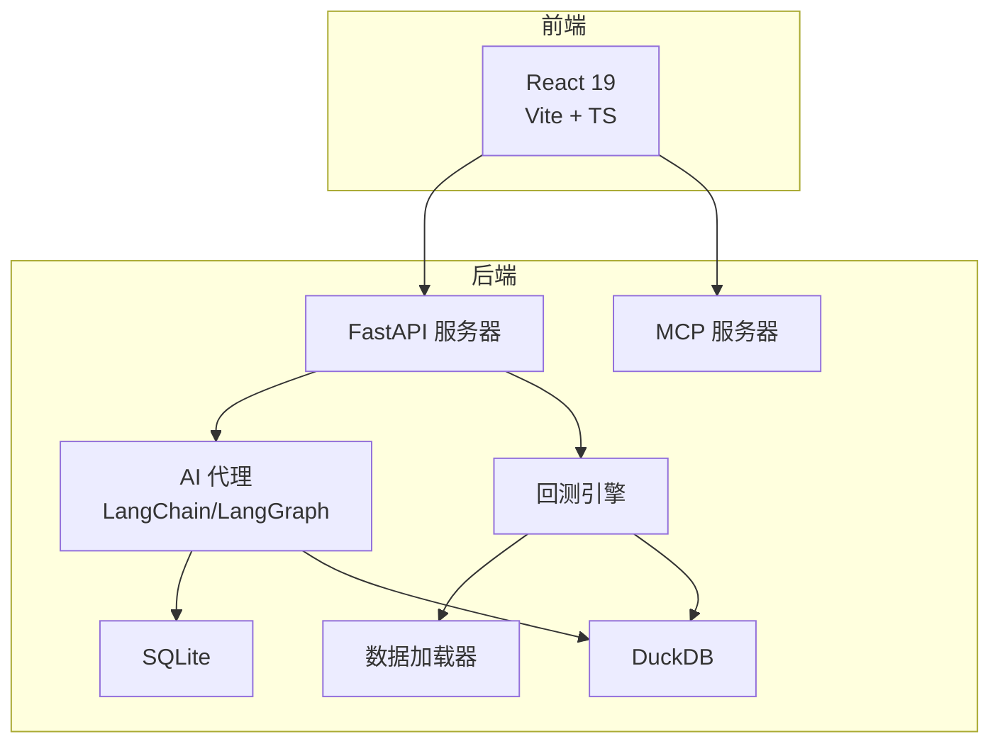
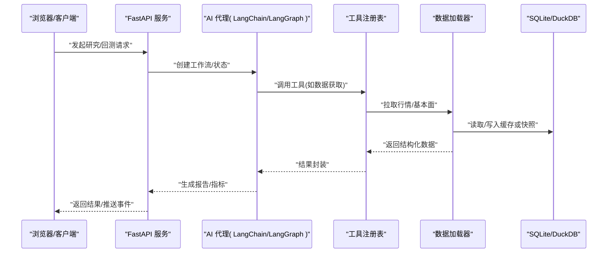
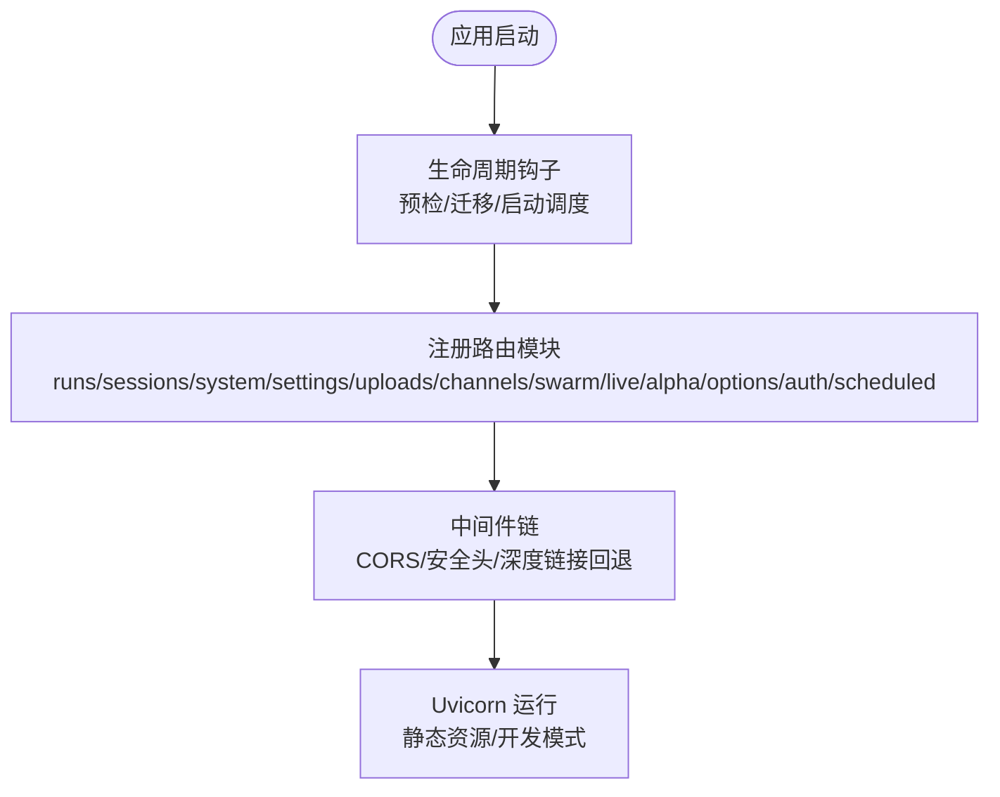
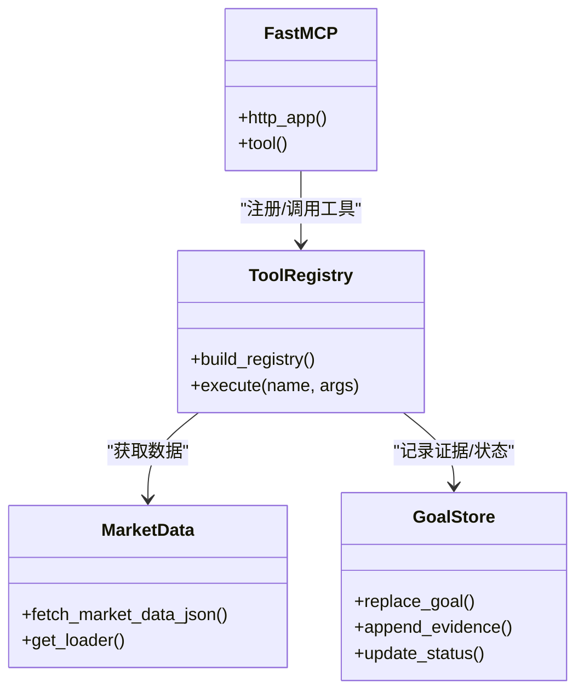
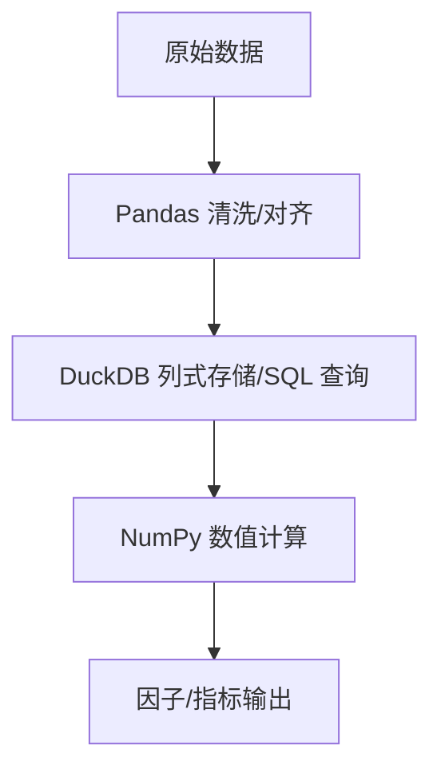
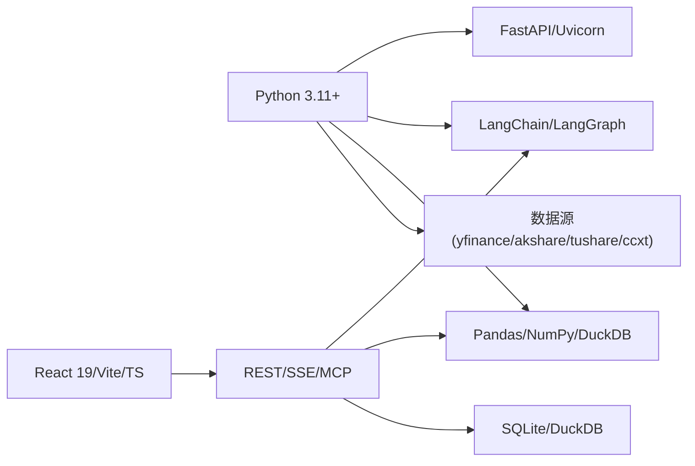

# 技术栈说明

<cite>
**本文引用的文件**
- [pyproject.toml](file://pyproject.toml)
- [agent/requirements.txt](file://agent/requirements.txt)
- [frontend/package.json](file://frontend/package.json)
- [Dockerfile](file://Dockerfile)
- [docker-compose.yml](file://docker-compose.yml)
- [agent/api_server.py](file://agent/api_server.py)
- [agent/mcp_server.py](file://agent/mcp_server.py)
- [agent/src/api/system_routes.py](file://agent/src/api/system_routes.py)
- [agent/src/api/options_routes.py](file://agent/src/api/options_routes.py)
- [agent/src/api/alpha_routes.py](file://agent/src/api/alpha_routes.py)
- [agent/src/api/scheduled_routes.py](file://agent/src/api/scheduled_routes.py)
- [agent/src/api/channels_routes.py](file://agent/src/api/channels_routes.py)
- [agent/backtest/loaders/base.py](file://agent/backtest/loaders/base.py)
- [agent/backtest/loaders/local_loader.py](file://agent/backtest/loaders/local_loader.py)
- [agent/src/goal/store.py](file://agent/src/goal/store.py)
- [agent/src/strategy_store/sqlite_store.py](file://agent/src/strategy_store/sqlite_store.py)
- [agent/src/session/search.py](file://agent/src/session/search.py)
- [agent/src/tools/taiwan_stock_data_tool.py](file://agent/src/tools/taiwan_stock_data_tool.py)
- [frontend/src/main.tsx](file://frontend/src/main.tsx)
</cite>

## 目录
1. [简介](#简介)
2. [项目结构](#项目结构)
3. [核心组件](#核心组件)
4. [架构总览](#架构总览)
5. [详细组件分析](#详细组件分析)
6. [依赖关系与兼容性矩阵](#依赖关系与兼容性矩阵)
7. [性能考量](#性能考量)
8. [故障排查指南](#故障排查指南)
9. [结论](#结论)
10. [附录](#附录)

## 简介
本文件系统性梳理 Vibe-Trading 的技术栈选型与原因，覆盖后端 Python、FastAPI、AI 工作流编排（LangChain/LangGraph）、前端 React、数据处理库（Pandas、NumPy、DuckDB）、数据库（SQLite、DuckDB）以及容器化与部署方案。文档同时提供版本兼容性与依赖关系图，帮助开发者快速理解生态并做出扩展决策。

## 项目结构
仓库采用前后端分离与多服务组织：
- 后端（Python）：FastAPI 提供 REST/SSE/MCP 接口；LangChain/LangGraph 驱动 AI 代理与工作流；回测引擎与数据加载器支持多市场；SQLite/DuckDB 用于持久化与列式计算。
- 前端（React 19 + Vite + TypeScript）：SPA 路由、状态管理（Zustand）、图表（ECharts）、国际化（i18next）。
- 桌面端（Electron）：打包与本地运行辅助。
- 容器化：多阶段 Docker 构建，Compose 编排开发/生产环境。

**图示来源**
- [agent/api_server.py:166-185](file://agent/api_server.py#L166-L185)
- [agent/mcp_server.py:71-83](file://agent/mcp_server.py#L71-L83)
- [agent/backtest/loaders/base.py:587-623](file://agent/backtest/loaders/base.py#L587-L623)
- [agent/src/goal/store.py:35-81](file://agent/src/goal/store.py#L35-L81)

**章节来源**
- [pyproject.toml:1-69](file://pyproject.toml#L1-L69)
- [frontend/package.json:1-58](file://frontend/package.json#L1-L58)
- [Dockerfile:1-119](file://Dockerfile#L1-L119)
- [docker-compose.yml:1-90](file://docker-compose.yml#L1-L90)

## 核心组件
- 后端语言与运行时：Python 3.11+，强调异步 I/O 与高性能网络栈，配合 Uvicorn 提供 ASGI 能力。
- Web 框架：FastAPI，类型安全、自动 OpenAPI/Swagger、SSE 支持，便于构建高吞吐 API。
- AI 工作流：LangChain/LangGraph，实现工具调用、状态机与可检查点的工作流编排。
- 前端：React 19 + Vite + TypeScript，现代化特性与生态完善，利于快速迭代 UI。
- 数据处理：Pandas 进行 DataFrame 操作，NumPy 加速数值计算，DuckDB 提供列式存储与 SQL 查询能力。
- 数据库：SQLite 用于轻量级事务与 FTS5 搜索索引；DuckDB 用于大规模行情数据的列式分析与缓存。
- 容器化：多阶段 Docker 构建，最小化运行时镜像；Compose 一键启动前后端与数据卷。

**章节来源**
- [pyproject.toml:24-69](file://pyproject.toml#L24-L69)
- [agent/requirements.txt:1-69](file://agent/requirements.txt#L1-L69)
- [frontend/package.json:17-56](file://frontend/package.json#L17-L56)
- [Dockerfile:17-119](file://Dockerfile#L17-L119)

## 架构总览
系统由 FastAPI 主服务暴露 REST/SSE 接口，MCP 服务器对外暴露研究工具集；AI 代理通过 LangChain/LangGraph 编排任务，调用工具与数据源；回测引擎基于 Pandas/NumPy/DuckDB 完成因子与策略评估；SQLite 负责会话、目标与策略存储；前端通过 SPA 与后端交互。

**图示来源**
- [agent/api_server.py:166-185](file://agent/api_server.py#L166-L185)
- [agent/mcp_server.py:71-83](file://agent/mcp_server.py#L71-L83)
- [agent/backtest/loaders/base.py:587-623](file://agent/backtest/loaders/base.py#L587-L623)
- [agent/src/goal/store.py:35-81](file://agent/src/goal/store.py#L35-L81)

## 详细组件分析

### 后端语言与运行时：Python 3.11+
- 选择理由：
  - 原生异步 I/O 与协程模型，结合 Uvicorn 的 ASGI 能力，适合高并发 API 与 SSE 推送。
  - 类型提示与 Pydantic 校验提升接口契约稳定性。
  - 生态成熟：Pandas/NumPy/DuckDB/Scikit-learn 等科学计算与机器学习库对 3.11+ 支持良好。
- 版本约束：
  - 要求 Python >=3.11,<3.14，兼顾新特性与第三方包轮子可用性。

**章节来源**
- [pyproject.toml:1-23](file://pyproject.toml#L1-L23)
- [agent/requirements.txt:50-56](file://agent/requirements.txt#L50-L56)

### Web 框架：FastAPI
- 选择理由：
  - 高性能 ASGI 框架，自动 OpenAPI/Swagger 文档，类型安全（Pydantic）。
  - 中间件与生命周期管理灵活，易于集成 CORS、鉴权、日志脱敏等。
  - 原生支持 SSE，便于实时推送（如 Alpha 分析、Swarm 状态）。
- 实现要点：
  - 统一挂载路由模块（runs/sessions/system/settings/uploads/channels/swarm/live/alpha/options/auth/scheduled），集中管理认证与安全头。
  - 生产模式静态托管前端构建产物，开发模式启动 Vite 热更新。

**图示来源**
- [agent/api_server.py:127-183](file://agent/api_server.py#L127-L183)
- [agent/api_server.py:321-395](file://agent/api_server.py#L321-L395)

**章节来源**
- [agent/api_server.py:166-185](file://agent/api_server.py#L166-L185)
- [agent/api_server.py:321-395](file://agent/api_server.py#L321-L395)

### AI 工作流编排：LangChain/LangGraph
- 作用：
  - 以图的形式编排 Agent 流程，支持工具调用、状态检查点与重试机制。
  - 与 MCP 服务器协作，将研究工具暴露给外部客户端（OpenClaw/Claude Desktop 等）。
- 关键实践：
  - 工具注册表懒加载，按需启用 shell 工具，默认关闭以降低风险。
  - 网络传输层增加 Host/Origin 白名单，防御 DNS 重绑定攻击。
  - 参数宽松解析（JSON 字符串解码为列表/字典），提升不同客户端兼容性。

**图示来源**
- [agent/mcp_server.py:71-83](file://agent/mcp_server.py#L71-L83)
- [agent/mcp_server.py:319-344](file://agent/mcp_server.py#L319-L344)
- [agent/mcp_server.py:532-596](file://agent/mcp_server.py#L532-L596)
- [agent/mcp_server.py:599-693](file://agent/mcp_server.py#L599-L693)

**章节来源**
- [agent/mcp_server.py:71-83](file://agent/mcp_server.py#L71-L83)
- [agent/mcp_server.py:132-319](file://agent/mcp_server.py#L132-L319)
- [agent/mcp_server.py:497-769](file://agent/mcp_server.py#L497-L769)

### 前端：React 19
- 优势：
  - 现代化特性（Concurrent Features、Server Components 生态演进）与稳定 API。
  - Vite 构建速度快，TypeScript 类型安全，Zustand 轻量状态管理。
  - i18n 与主题切换友好，图表使用 ECharts，Markdown/KaTeX 渲染增强可读性。
- 入口与路由：
  - 使用 createRoot 渲染，ErrorBoundary 包裹全局错误处理，RouterProvider 管理页面路由。

**章节来源**
- [frontend/package.json:17-56](file://frontend/package.json#L17-L56)
- [frontend/src/main.tsx:1-36](file://frontend/src/main.tsx#L1-L36)

### 数据处理：Pandas、NumPy、DuckDB
- Pandas：DataFrame 操作、时间序列对齐、重采样与窗口函数。
- NumPy：底层数值计算加速，支撑指标与因子计算。
- DuckDB：列式存储与 SQL 查询，适合大行情数据的高效分析与缓存；与 Pandas 无缝互转。

**图示来源**
- [agent/backtest/loaders/base.py:587-623](file://agent/backtest/loaders/base.py#L587-L623)
- [agent/backtest/loaders/local_loader.py:374-405](file://agent/backtest/loaders/local_loader.py#L374-L405)

**章节来源**
- [agent/backtest/loaders/base.py:587-623](file://agent/backtest/loaders/base.py#L587-L623)
- [agent/backtest/loaders/local_loader.py:374-405](file://agent/backtest/loaders/local_loader.py#L374-L405)

### 数据库选型：SQLite、DuckDB
- SQLite：
  - 轻量、零配置，适合会话、目标、策略与 FTS5 全文检索。
  - WAL 模式提升并发读性能，PRAGMA 优化写入与同步策略。
- DuckDB：
  - 列式存储，适合大规模行情数据的聚合与分析。
  - 与 Pandas 集成良好，支持 SQL 直接查询 CSV/Parquet/自定义表。

**章节来源**
- [agent/src/goal/store.py:35-81](file://agent/src/goal/store.py#L35-L81)
- [agent/src/strategy_store/sqlite_store.py:122-155](file://agent/src/strategy_store/sqlite_store.py#L122-L155)
- [agent/src/session/search.py:60-119](file://agent/src/session/search.py#L60-L119)
- [agent/src/tools/taiwan_stock_data_tool.py:346-388](file://agent/src/tools/taiwan_stock_data_tool.py#L346-L388)

### 容器化与部署：Docker、Compose
- 多阶段构建：
  - 前端构建阶段：Node 22 构建静态资源。
  - Python 构建阶段：编译 wheel 并创建隔离 venv，安装锁定依赖。
  - 运行阶段：仅携带必要运行时库与字体，非 root 用户运行，只读根文件系统。
- Compose：
  - 端口映射、环境变量注入、数据卷持久化（runs/sessions/home/uploads）。
  - 安全加固：cap_drop ALL，保留 SETUID/SETGID 用于沙箱降权，no-new-privileges，内存/CPU/PIDs 限制。

**章节来源**
- [Dockerfile:1-119](file://Dockerfile#L1-L119)
- [docker-compose.yml:1-90](file://docker-compose.yml#L1-L90)

## 依赖关系与兼容性矩阵
- Python 版本：>=3.11,<3.14
- 后端核心：
  - FastAPI、Uvicorn、Pydantic、sse-starlette、websockets
  - LangChain/LangGraph（工作流编排与检查点）
  - Pandas、NumPy、SciPy、Bottleneck、DuckDB
  - 数据源：yfinance、akshare、tushare、ccxt、aiohttp、requests
- 前端：
  - React 19、Vite、TypeScript、Zustand、ECharts、i18next
- 容器：
  - Node 22（前端构建）、Python 3.11-slim（后端运行）

**图示来源**
- [pyproject.toml:24-69](file://pyproject.toml#L24-L69)
- [agent/requirements.txt:1-69](file://agent/requirements.txt#L1-L69)
- [frontend/package.json:17-56](file://frontend/package.json#L17-L56)

**章节来源**
- [pyproject.toml:1-69](file://pyproject.toml#L1-L69)
- [agent/requirements.txt:1-69](file://agent/requirements.txt#L1-L69)
- [frontend/package.json:17-56](file://frontend/package.json#L17-L56)

## 性能考量
- 异步与并发：
  - FastAPI + Uvicorn 提供高吞吐 ASGI 服务，SSE 推送低延迟。
  - 数据加载器与工具注册表采用懒加载，减少启动开销。
- 计算优化：
  - Pandas 向量化操作 + NumPy 底层加速；DuckDB 列式存储提升聚合性能。
  - 回测缓存元数据（index_columns/index_dtypes）确保缓存命中与一致性。
- 存储优化：
  - SQLite WAL 模式与 PRAGMA 调优，提高并发读与写入效率。
  - DuckDB 作为列式缓存，避免重复 IO 与解析成本。
- 容器资源：
  - Compose 中设置 mem_limit/cpus/pids_limit，防止单任务占用过多资源。

**章节来源**
- [agent/backtest/loaders/base.py:587-623](file://agent/backtest/loaders/base.py#L587-L623)
- [agent/src/strategy_store/sqlite_store.py:122-155](file://agent/src/strategy_store/sqlite_store.py#L122-L155)
- [docker-compose.yml:40-66](file://docker-compose.yml#L40-L66)

## 故障排查指南
- 启动失败：
  - 检查 Python 版本与依赖锁定文件是否匹配；确认前端构建产物存在。
  - 查看健康检查端点 /live 是否可达。
- 鉴权与安全：
  - 非环回地址绑定需设置 API_AUTH_KEY；Host/Origin 白名单需正确配置。
  - MCP 网络传输默认仅允许环回主机，必要时调整环境变量。
- 数据问题：
  - DuckDB 查询需确保 db_path 与 query 有效；SQLite 快照需满足 schema 契约。
  - 检查数据源可用性与网络连通性（yfinance/akshare/tushare/ccxt）。
- 性能瓶颈：
  - 观察 CPU/内存/PIDs 限制是否过紧；适当调整 Compose 资源配额。
  - 利用 DuckDB 缓存与 Pandas 向量化减少重复计算。

**章节来源**
- [Dockerfile:113-118](file://Dockerfile#L113-L118)
- [agent/mcp_server.py:132-319](file://agent/mcp_server.py#L132-L319)
- [agent/src/tools/taiwan_stock_data_tool.py:346-388](file://agent/src/tools/taiwan_stock_data_tool.py#L346-L388)
- [docker-compose.yml:40-66](file://docker-compose.yml#L40-L66)

## 结论
Vibe-Trading 以 Python 3.11+ 与 FastAPI 构建高性能后端，结合 LangChain/LangGraph 实现灵活的 AI 工作流编排；前端采用 React 19 提供现代化体验；数据处理依托 Pandas/NumPy/DuckDB 实现高效分析；SQLite/DuckDB 分别承担轻量事务与列式计算；容器化与 Compose 保障可移植与可观测的部署。该技术栈在性能、可扩展性与安全性之间取得平衡，适合金融研究与回测场景。

## 附录
- 常用命令：
  - 启动服务：vibe-trading serve --host 0.0.0.0 --port 8899
  - 开发模式：包含 Vite 热更新
  - 容器部署：docker compose up -d
- 环境变量：
  - OLLAMA_BASE_URL、VIBE_TRADING_GOAL_DB_PATH、VIBE_TW_STOCK_DB 等
- 参考路径：
  - 路由注册：agent/src/api/*_routes.py
  - 数据加载：agent/backtest/loaders/*
  - 存储实现：agent/src/goal/store.py、agent/src/strategy_store/sqlite_store.py、agent/src/session/search.py

**章节来源**
- [agent/api_server.py:321-395](file://agent/api_server.py#L321-L395)
- [docker-compose.yml:1-90](file://docker-compose.yml#L1-L90)
- [agent/src/api/system_routes.py:170-234](file://agent/src/api/system_routes.py#L170-L234)
- [agent/src/api/options_routes.py:159-194](file://agent/src/api/options_routes.py#L159-L194)
- [agent/src/api/alpha_routes.py:346-377](file://agent/src/api/alpha_routes.py#L346-L377)
- [agent/src/api/scheduled_routes.py:220-261](file://agent/src/api/scheduled_routes.py#L220-L261)
- [agent/src/api/channels_routes.py:50-86](file://agent/src/api/channels_routes.py#L50-L86)