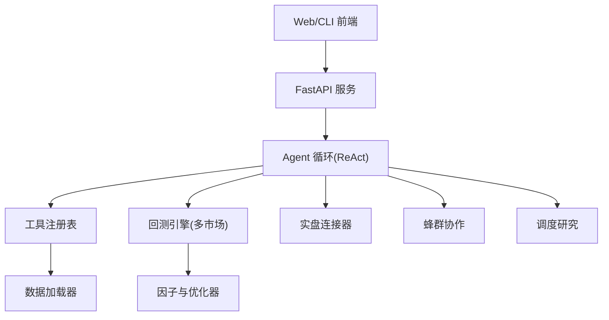
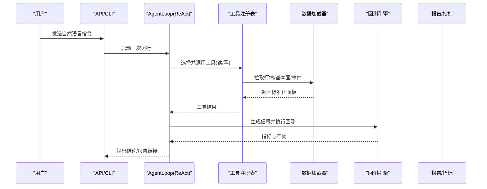
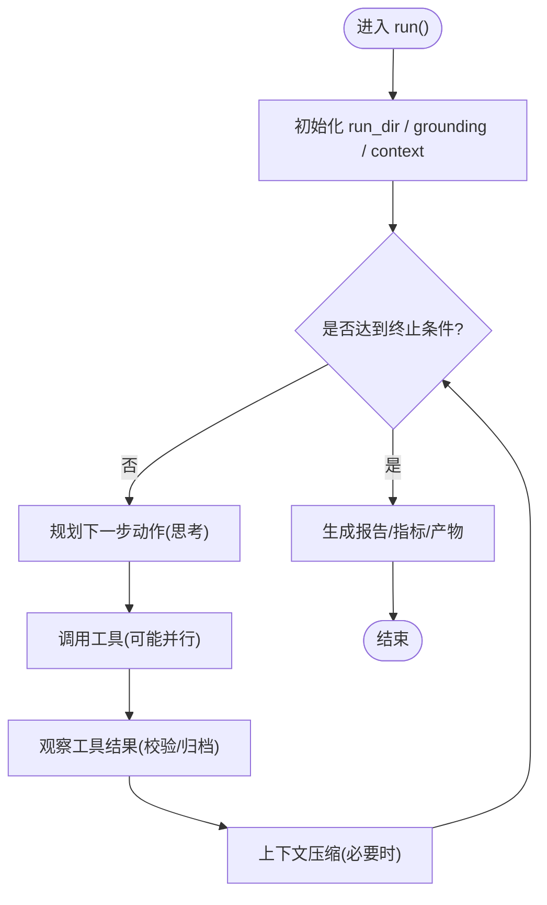
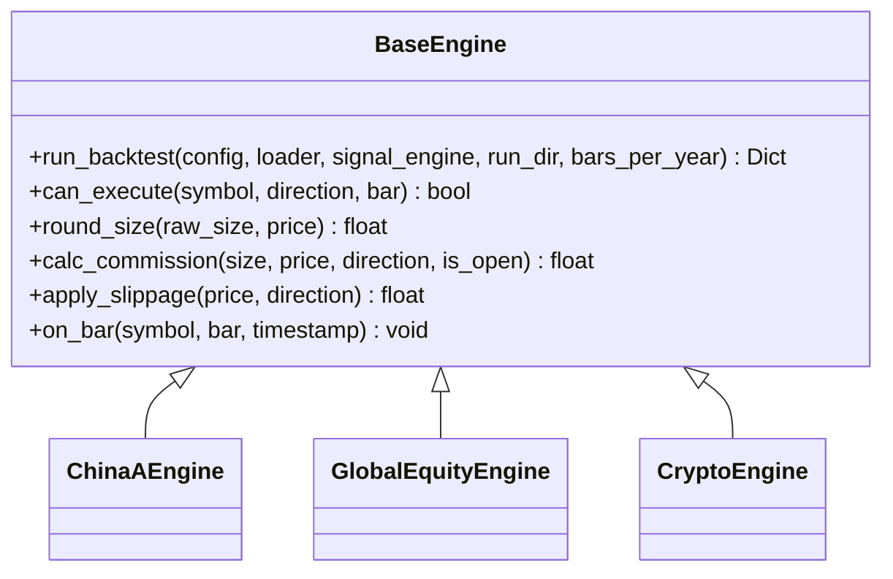
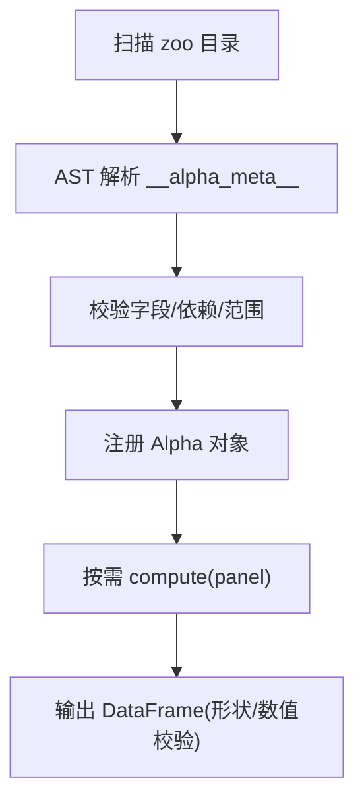
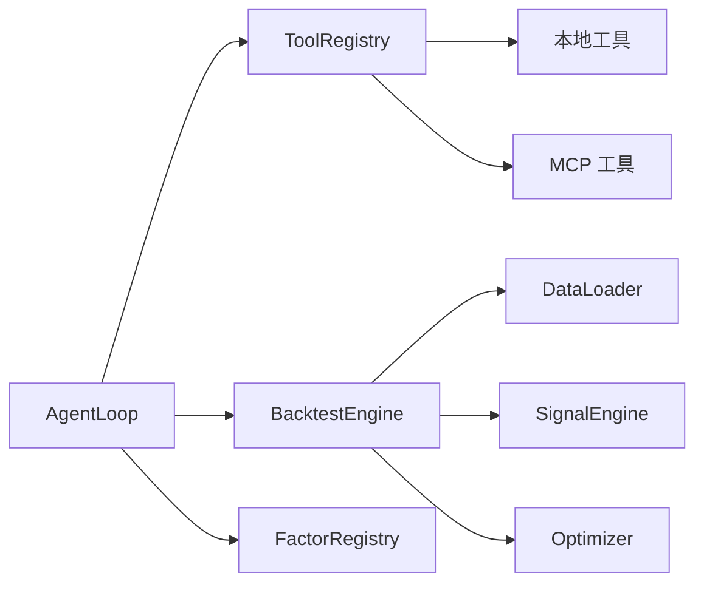

# 核心特性概览

<cite>
**本文引用的文件**
- [README.md](file://README.md)
- [loop.py](file://agent/src/agent/loop.py)
- [tools/__init__.py](file://agent/src/tools/__init__.py)
- [factors/__init__.py](file://agent/src/factors/__init__.py)
- [factors/registry.py](file://agent/src/factors/registry.py)
- [base.py](file://agent/backtest/engines/base.py)
- [__init__.py（live）](file://agent/src/live/__init__.py)
- [__init__.py（scheduled_research）](file://agent/src/scheduled_research/__init__.py)
- [mcp_server.py](file://agent/mcp_server.py)
- [SKILL.md（alpha-zoo）](file://agent/src/skills/alpha-zoo/SKILL.md)
- [SKILL.md（factor-research）](file://agent/src/skills/factor-research/SKILL.md)
</cite>

## 目录
1. [简介](#简介)
2. [项目结构](#项目结构)
3. [核心组件](#核心组件)
4. [架构总览](#架构总览)
5. [详细组件分析](#详细组件分析)
6. [依赖关系分析](#依赖关系分析)
7. [性能考量](#性能考量)
8. [故障排查指南](#故障排查指南)
9. [结论](#结论)
10. [附录：使用示例与演示要点](#附录使用示例与演示要点)

## 简介
本文件面向希望快速理解 Vibe-Trading 平台能力的用户，聚焦六大核心特性：自然语言交互系统、多市场回测引擎、实盘交易接口、智能因子分析、团队协作（蜂群）功能、调度研究系统。文档以“工作原理—应用场景—技术实现”为主线，重点解释 ReAct 模式的 AI 代理循环如何实现“推理-行动-观察”的自动化流程，并展示 460+ 学术因子库与策略开发工具的能力边界。同时说明支持的多市场类型（A股、美股、港股、加密货币等）及其特点，以及工具生态系统的扩展方式（内置工具与自定义工具）。文末提供具体使用示例与演示要点，帮助用户快速上手。

## 项目结构
Vibe-Trading 采用模块化分层组织：
- 前端：React + TypeScript，提供聊天、运行详情、Alpha Zoo 浏览等界面
- 后端：FastAPI 服务，暴露 REST/MCP 接口
- Agent 核心：ReAct 循环、工具注册、记忆与上下文压缩、目标/会话管理
- 回测：统一基类引擎 + 多市场专用引擎（A股、期货、外汇、加密等）
- 数据层：多源加载器（tushare、yfinance、ccxt、akshare、本地 CSV/Parquet 等）
- 因子与策略：Alpha Zoo 注册表、信号引擎、优化器与约束
- 实盘与通道：连接器（券商/交易所）、IM 通道（Telegram、Slack、飞书等）
- 调度：定时任务模型与持久化存储

图表来源
- [loop.py:1-12](file://agent/src/agent/loop.py#L1-L12)
- [base.py:1-7](file://agent/backtest/engines/base.py#L1-L7)
- [tools/__init__.py:1-8](file://agent/src/tools/__init__.py#L1-L8)

章节来源
- [README.md](file://README.md)

## 核心组件
- 自然语言交互系统：基于 ReAct 的 AgentLoop，具备五层上下文管理与并行工具执行，支撑“推理-行动-观察”闭环
- 多市场回测引擎：BaseEngine 抽象出统一的 bar-by-bar 执行流程，各市场通过覆写规则方法适配
- 实盘交易接口：连接器优先架构，受命于用户承诺的 Mandate，具备审计与熔断能力
- 智能因子分析：Alpha Zoo 注册表与评估工具，覆盖 460+ 因子，支持 IC/IR 评估与对比
- 团队协作：Swarm 多智能体工作流，按预设编排 DAG 任务，实时状态回传
- 调度研究系统：可配置 Cron/时区的研究任务，持久化存储，后台执行

章节来源
- [loop.py:1-12](file://agent/src/agent/loop.py#L1-L12)
- [base.py:1-7](file://agent/backtest/engines/base.py#L1-L7)
- [__init__.py（live）:1-11](file://agent/src/live/__init__.py#L1-L11)
- [factors/__init__.py:1-49](file://agent/src/factors/__init__.py#L1-L49)
- [__init__.py（swarm）:1-35](file://agent/src/swarm/__init__.py#L1-L35)
- [__init__.py（scheduled_research）:1-17](file://agent/src/scheduled_research/__init__.py#L1-L17)

## 架构总览
下图展示了从用户输入到结果输出的端到端路径，涵盖 ReAct 循环、工具调用、数据获取、回测与报告生成。

图表来源
- [loop.py:638-800](file://agent/src/agent/loop.py#L638-L800)
- [base.py:652-800](file://agent/backtest/engines/base.py#L652-L800)
- [tools/__init__.py:66-245](file://agent/src/tools/__init__.py#L66-L245)

## 详细组件分析

### 自然语言交互系统（ReAct 代理循环）
- 工作原理
  - 五层上下文管理：微压缩、文本折叠、LLM 结构化摘要、显式压缩工具、迭代更新
  - 工具执行批处理：连续只读工具线程级并行
  - 运行元数据与审计：每次运行写入 manifest、trace、llm_usage 等
- 应用场景
  - 复杂研究问题拆解为多步工具调用（搜索、拉数、计算、回测、归因）
  - 长对话中的“零信息衰减”总结，避免上下文溢出
- 技术实现要点
  - AgentLoop.run 负责创建 run_dir、构建上下文、维护 grounding ledger、记录 token 用量
  - 压缩策略保证历史关键信息不丢失，且对大消息进行分块摘要
  - 工具结果归档与跨 run 复制，确保报告一致性

图表来源
- [loop.py:638-800](file://agent/src/agent/loop.py#L638-L800)
- [loop.py:307-400](file://agent/src/agent/loop.py#L307-L400)

章节来源
- [loop.py:1-12](file://agent/src/agent/loop.py#L1-L12)
- [loop.py:307-400](file://agent/src/agent/loop.py#L307-L400)
- [loop.py:638-800](file://agent/src/agent/loop.py#L638-L800)

### 多市场回测引擎
- 工作原理
  - BaseEngine 统一 pipeline：数据加载 → 信号生成 → 权重优化 → 逐 bar 执行 → 指标与产物
  - 市场规则钩子：can_execute、round_size、calc_commission、apply_slippage、on_bar 等由子类实现
  - 对齐与填充：跨市场日期对齐、ffill 限制、价格带校验、滑点与手续费
- 应用场景
  - A 股涨跌停、T+1、印花税；美股盘前盘后；外汇点差；加密货币永续资金费率与强平
- 技术实现要点
  - _align 将信号与价格矩阵对齐，考虑不同市场的交易日历差异
  - 基准可选外部 fetch，指标包含超额收益、换手率、回撤等
  - 产出 artifacts：positions.csv、metrics、rebalance notes、风险透视等

图表来源
- [base.py:377-612](file://agent/backtest/engines/base.py#L377-L612)
- [base.py:652-800](file://agent/backtest/engines/base.py#L652-L800)

章节来源
- [base.py:1-7](file://agent/backtest/engines/base.py#L1-L7)
- [base.py:377-612](file://agent/backtest/engines/base.py#L377-L612)
- [base.py:652-800](file://agent/backtest/engines/base.py#L652-L800)

### 实盘交易接口
- 工作原理
  - 连接器优先：统一抽象账户、持仓、订单、报价、历史等能力
  - 安全边界：仅允许在用户承诺的 Mandate 范围内执行，具备文件系统级熔断与全量审计
  - 只读/受限：无纸/live 区分由连接器自身保障，未明确区分者默认只读或纸交易
- 应用场景
  - 在合规前提下自动下单、风控拦截、审计追踪
- 技术实现要点
  - live 包声明了 bounded-autonomy 的执行模型与状态存放位置
  - 工具注册时对 live broker 进行识别与包装，隐藏底层细节

章节来源
- [__init__.py（live）:1-11](file://agent/src/live/__init__.py#L1-L11)
- [tools/__init__.py:185-275](file://agent/src/tools/__init__.py#L185-L275)

### 智能因子分析与 Alpha Zoo
- 工作原理
  - Alpha Zoo 注册表通过 AST 扫描 zoo 模块，提取 __alpha_meta__ 元数据，惰性导入 compute
  - 严格校验：列依赖、形状、无穷值与 NaN 比例、warmup 等
  - 评估工具：IC/IR、存活度分类、HTML 报告、对比排序
- 应用场景
  - 快速筛选主题因子、验证因子有效性、组合多因子信号
- 技术实现要点
  - Registry.list/get/compute/export_manifest 提供完整生命周期
  - 进程级缓存默认 registry，减少重复扫描开销

图表来源
- [factors/registry.py:147-184](file://agent/src/factors/registry.py#L147-L184)
- [factors/registry.py:219-260](file://agent/src/factors/registry.py#L219-L260)
- [factors/registry.py:321-397](file://agent/src/factors/registry.py#L321-L397)

章节来源
- [factors/__init__.py:1-49](file://agent/src/factors/__init__.py#L1-L49)
- [factors/registry.py:1-454](file://agent/src/factors/registry.py#L1-L454)
- [SKILL.md（alpha-zoo）:1-45](file://agent/src/skills/alpha-zoo/SKILL.md#L1-L45)
- [SKILL.md（factor-research）:142-157](file://agent/src/skills/factor-research/SKILL.md#L142-L157)

### 团队协作（蜂群）
- 工作原理
  - 通过 preset 定义 DAG 任务，多个 worker 协同完成研究/回测/报告
  - 运行时维护任务状态、事件流与结果聚合
- 应用场景
  - 投委会、量化桌面、风控委员会等多角色协作
- 技术实现要点
  - models/presets/runtime/store/worker 构成完整生命周期
  - MCP 暴露 run_swarm 工具，支持进度上报与等待

章节来源
- [__init__.py（swarm）:1-35](file://agent/src/swarm/__init__.py#L1-L35)
- [mcp_server.py:1645-1672](file://agent/mcp_server.py#L1645-L1672)

### 调度研究系统
- 工作原理
  - 定义任务模型与持久化存储，支持 Cron 表达式与时区
  - 后台执行器触发任务，结合会话运行时执行研究/回测
- 应用场景
  - 每日/每周固定时间跑因子监控、回测、报告推送
- 技术实现要点
  - 数据模型与 Store 解耦执行，便于扩展与测试

章节来源
- [__init__.py（scheduled_research）:1-17](file://agent/src/scheduled_research/__init__.py#L1-L17)

## 依赖关系分析
- AgentLoop 依赖工具注册表、上下文构建、记忆、进度与 LLM 运行时快照
- 工具注册表自动发现 src/tools 下的 BaseTool 子类，并可合并远程 MCP 工具
- 回测引擎依赖数据加载器、信号引擎、优化器与约束
- 因子注册表依赖 AST 解析与 Pydantic 校验，提供进程级缓存

图表来源
- [tools/__init__.py:33-63](file://agent/src/tools/__init__.py#L33-L63)
- [tools/__init__.py:66-245](file://agent/src/tools/__init__.py#L66-L245)
- [base.py:652-723](file://agent/backtest/engines/base.py#L652-L723)
- [factors/registry.py:460-471](file://agent/src/factors/registry.py#L460-L471)

章节来源
- [tools/__init__.py:1-365](file://agent/src/tools/__init__.py#L1-L365)
- [base.py:652-800](file://agent/backtest/engines/base.py#L652-L800)
- [factors/registry.py:201-454](file://agent/src/factors/registry.py#L201-L454)

## 性能考量
- 上下文压缩：多层压缩降低 LLM 调用成本，避免长对话溢出
- 工具并行：连续只读工具线程级并行，提升 IO 密集场景吞吐
- 因子计算：注册表懒加载与进程级缓存，减少重复扫描与导入开销
- 回测对齐：向量化矩阵操作与 ffill 限制，兼顾跨市场日历差异
- 数据缓存：可选本地历史数据缓存，减少网络请求与限频影响

[本节为通用指导，不直接分析具体文件]

## 故障排查指南
- 工具不可用或缺依赖：注册阶段会跳过并记录警告
- 数据缺失或格式异常：回测对齐阶段会丢弃无效标的并告警
- 因子输出异常：注册表校验无穷值与 NaN 比例，失败时抛出明确错误
- 运行中断或超时：AgentLoop 支持取消与心跳，工具调用具备超时控制
- 提供商连接问题：MCP/LLM 适配器具备重试与降级提示

章节来源
- [tools/__init__.py:136-153](file://agent/src/tools/__init__.py#L136-L153)
- [base.py:184-209](file://agent/backtest/engines/base.py#L184-L209)
- [factors/registry.py:401-422](file://agent/src/factors/registry.py#L401-L422)
- [loop.py:997-1004](file://agent/src/agent/loop.py#L997-L1004)

## 结论
Vibe-Trading 以 ReAct 代理为核心，串联自然语言交互、多市场回测、实盘交易、因子研究、团队协作与调度研究，形成“从想法到落地”的一体化平台。其可扩展的工具生态与严格的校验机制，既保证了易用性，也确保了研究与生产的严谨性。

[本节为总结，不直接分析具体文件]

## 附录：使用示例与演示要点
- 自然语言交互
  - 在 CLI/Web 中描述研究目标，观察 Agent 逐步调用工具、拉取数据、生成信号与回测
  - 关注“思考-工具-结果”的时间线与上下文压缩过程
- 多市场回测
  - 选择 A 股/美股/加密等不同市场，设置区间与参数，查看指标与产物
  - 对比不同优化器与约束对实际成交与风险的影响
- 实盘交易接口
  - 在纸交易环境演示下单、风控拦截与审计日志
  - 强调 Mandate 与安全边界的必要性
- 智能因子分析
  - 浏览 Alpha Zoo，选择主题因子进行 IC/IR 评估
  - 使用 factor_analysis 评估自定义因子 CSV
- 团队协作
  - 运行投资委员会预设，观察多角色协作与状态卡片
- 调度研究
  - 配置 Cron 与时区，触发定时研究任务，查看执行记录与报告

章节来源
- [SKILL.md（alpha-zoo）:1-45](file://agent/src/skills/alpha-zoo/SKILL.md#L1-L45)
- [SKILL.md（factor-research）:142-157](file://agent/src/skills/factor-research/SKILL.md#L142-L157)
- [mcp_server.py:1645-1672](file://agent/mcp_server.py#L1645-L1672)