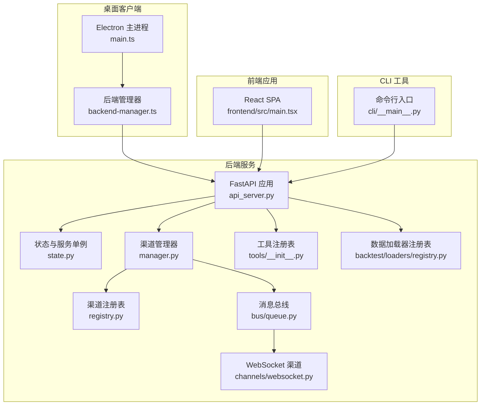
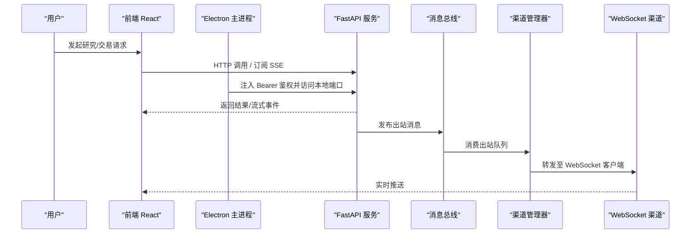
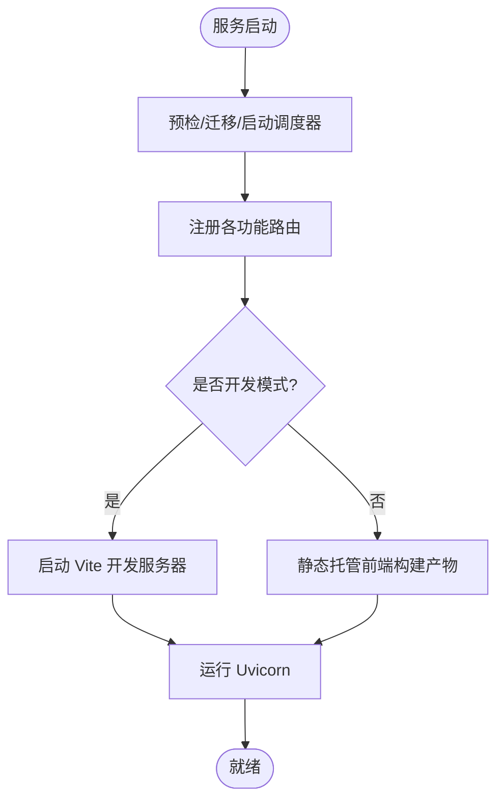
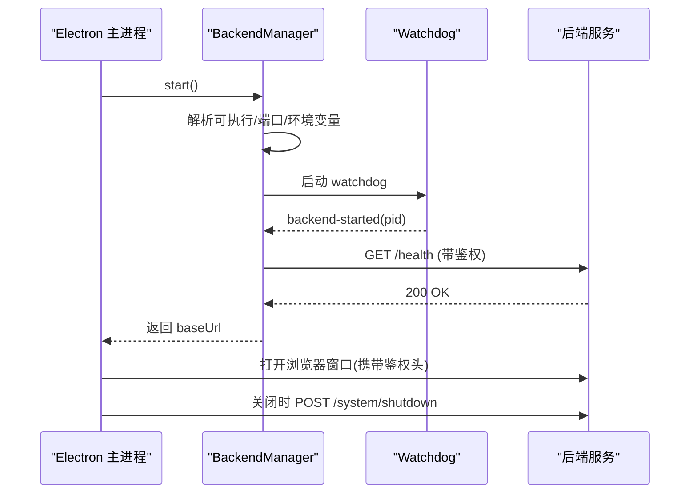
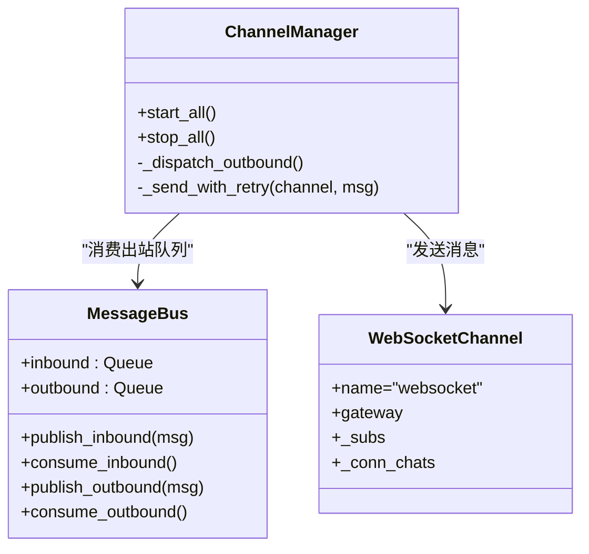
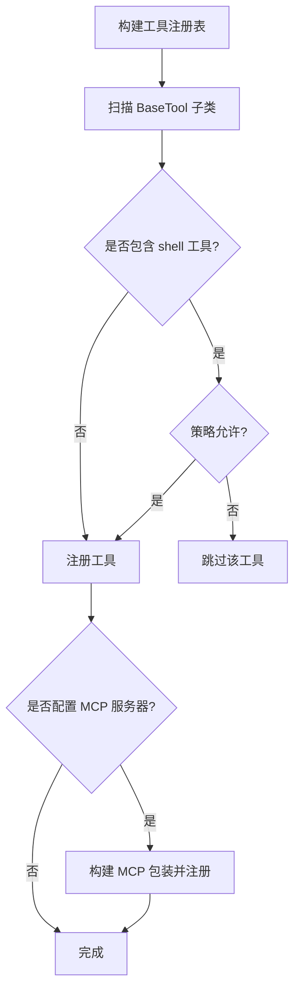
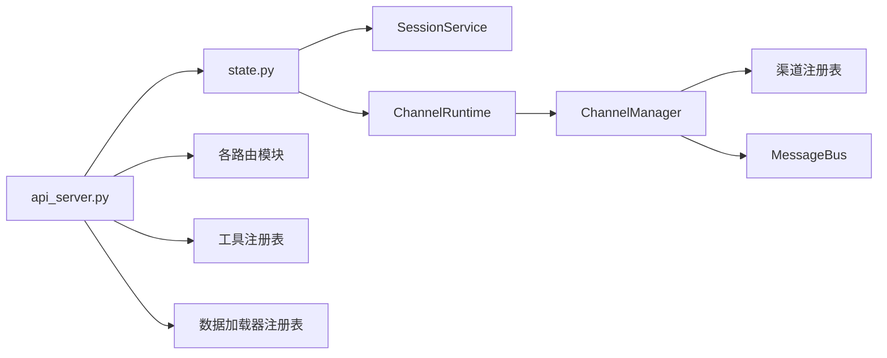

# 系统架构概览

<cite>
**本文引用的文件**
- [README.md](file://README.md)
- [api_server.py](file://agent/api_server.py)
- [main.ts](file://desktop/electron/src/main.ts)
- [backend-manager.ts](file://desktop/electron/src/backend-manager.ts)
- [main.tsx](file://frontend/src/main.tsx)
- [__main__.py](file://agent/cli/__main__.py)
- [state.py](file://agent/src/api/state.py)
- [manager.py](file://agent/src/channels/manager.py)
- [registry.py](file://agent/src/channels/registry.py)
- [queue.py](file://agent/src/channels/bus/queue.py)
- [websocket.py](file://agent/src/channels/websocket.py)
- [tools_init.py](file://agent/src/tools/__init__.py)
- [loader_registry.py](file://agent/backtest/loaders/registry.py)
</cite>

## 目录
1. [简介](#简介)
2. [项目结构](#项目结构)
3. [核心组件](#核心组件)
4. [架构总览](#架构总览)
5. [详细组件分析](#详细组件分析)
6. [依赖关系分析](#依赖关系分析)
7. [性能考量](#性能考量)
8. [故障排查指南](#故障排查指南)
9. [结论](#结论)
10. [附录](#附录)

## 简介
本文件面向开发者与运维人员，提供 Vibe-Trading 系统的全面架构概览。系统采用前后端分离、桌面客户端封装与 CLI 工具并存的层次化设计；后端以 FastAPI 为核心，承载 REST/SSE/WebSocket 能力；前端为 React SPA；Electron 作为本地宿主进程管理后端生命周期与安全通信；CLI 提供交互式与自动化入口。系统同时具备事件驱动（消息总线、SSE、WebSocket）与插件化（工具注册表、渠道适配器、数据加载器）能力，支持独立部署与横向扩展。

## 项目结构
- 后端服务：FastAPI 应用，模块化路由、安全中间件、会话与通道运行时、回测与因子等能力。
- 前端应用：React + TypeScript SPA，通过 API 与 SSE/WebSocket 交互。
- 桌面客户端：Electron 主进程负责启动/守护后端、注入鉴权、渲染 UI。
- CLI 工具：Python 命令行入口，驱动研究、回测、会话与通道等。
- 插件体系：
  - 工具注册表：自动发现 BaseTool 子类，可选集成 MCP 远程工具。
  - 渠道适配器：内置与外部插件的 IM/聊天渠道统一接入。
  - 数据加载器：多市场、多源的回测数据获取与降级链。

图表来源
- [main.ts:1-285](file://desktop/electron/src/main.ts#L1-L285)
- [backend-manager.ts:1-426](file://desktop/electron/src/backend-manager.ts#L1-L426)
- [api_server.py:1-400](file://agent/api_server.py#L1-L400)
- [state.py:1-111](file://agent/src/api/state.py#L1-L111)
- [manager.py:1-479](file://agent/src/channels/manager.py#L1-L479)
- [registry.py:1-284](file://agent/src/channels/registry.py#L1-L284)
- [queue.py:1-43](file://agent/src/channels/bus/queue.py#L1-L43)
- [websocket.py:264-299](file://agent/src/channels/websocket.py#L264-L299)
- [tools_init.py:1-365](file://agent/src/tools/__init__.py#L1-L365)
- [loader_registry.py:1-256](file://agent/backtest/loaders/registry.py#L1-L256)

章节来源
- [README.md:1-166](file://README.md#L1-L166)
- [api_server.py:1-400](file://agent/api_server.py#L1-L400)
- [main.ts:1-285](file://desktop/electron/src/main.ts#L1-L285)
- [backend-manager.ts:1-426](file://desktop/electron/src/backend-manager.ts#L1-L426)
- [main.tsx:1-36](file://frontend/src/main.tsx#L1-L36)
- [__main__.py:1-6](file://agent/cli/__main__.py#L1-L6)

## 核心组件
- 后端 FastAPI 服务：统一装配路由、中间件、生命周期钩子；提供 REST、SSE、WebSocket 接口；挂载会话、通道、回测、选项、Alpha 库等模块。
- Electron 桌面客户端：生成一次性 API 密钥，启动/守护后端进程，注入安全头，健康检查，日志收集与错误上报。
- React 前端：SPA 路由、错误边界、通知提示；按需预取图表模块；通过 API 与实时通道交互。
- CLI 工具：提供命令式入口，驱动会话、研究、回测、通道管理等。
- 事件驱动：消息总线解耦渠道与代理核心；SSE 用于会话事件回放；WebSocket 用于实时双向通信。
- 插件化：
  - 工具注册表：自动发现 BaseTool 子类，按策略注入会话 ID、持久化记忆、MCP 远程工具。
  - 渠道适配器：扫描内置与外部插件，按配置启用，统一出站消息分发。
  - 数据加载器：按市场维护降级链，优先轻量公开源，再回退到 key-gated 或本地源。

章节来源
- [api_server.py:1-400](file://agent/api_server.py#L1-L400)
- [main.ts:1-285](file://desktop/electron/src/main.ts#L1-L285)
- [backend-manager.ts:1-426](file://desktop/electron/src/backend-manager.ts#L1-L426)
- [main.tsx:1-36](file://frontend/src/main.tsx#L1-L36)
- [__main__.py:1-6](file://agent/cli/__main__.py#L1-L6)
- [tools_init.py:1-365](file://agent/src/tools/__init__.py#L1-L365)
- [manager.py:1-479](file://agent/src/channels/manager.py#L1-L479)
- [registry.py:1-284](file://agent/src/channels/registry.py#L1-L284)
- [loader_registry.py:1-256](file://agent/backtest/loaders/registry.py#L1-L256)

## 架构总览
Vibe-Trading 采用“前端/桌面/后端”分层与“事件/插件”双轴扩展：
- 分层：Electron 仅做宿主与安全管理；FastAPI 承载业务；React 专注交互；CLI 提供脚本化能力。
- 事件：渠道→消息总线→代理核心→消息总线→渠道；SSE 推送会话事件；WebSocket 提供实时双向通道。
- 插件：工具、渠道、数据加载器均通过注册表动态发现与组合，便于独立升级与横向扩展。

图表来源
- [api_server.py:1-400](file://agent/api_server.py#L1-L400)
- [backend-manager.ts:1-426](file://desktop/electron/src/backend-manager.ts#L1-L426)
- [manager.py:1-479](file://agent/src/channels/manager.py#L1-L479)
- [queue.py:1-43](file://agent/src/channels/bus/queue.py#L1-L43)
- [websocket.py:264-299](file://agent/src/channels/websocket.py#L264-L299)

## 详细组件分析

### 后端 FastAPI 服务
- 启动流程：创建 FastAPI 实例，注册 CORS、安全头、SPA 深链回退中间件；在 lifespan 中执行预检、迁移、启动定时研究与可选通道运行时。
- 路由装配：按功能切片注册 runs/sessions/system/settings/uploads/channels/swarm/live/alpha/options/auth/openbb/scheduled 等路由。
- 开发模式：可内联启动 Vite 开发服务器；生产模式静态托管构建产物。
- 安全：对非环回绑定且未设置 API 密钥进行告警；对敏感路径使用短期 SSE ticket 与认证。

图表来源
- [api_server.py:127-160](file://agent/api_server.py#L127-L160)
- [api_server.py:166-185](file://agent/api_server.py#L166-L185)
- [api_server.py:189-314](file://agent/api_server.py#L189-L314)
- [api_server.py:321-395](file://agent/api_server.py#L321-L395)

章节来源
- [api_server.py:1-400](file://agent/api_server.py#L1-L400)

### Electron 桌面客户端
- 主进程职责：创建窗口、注入安全头（向本地后端请求添加 Bearer）、拦截导航、菜单与日志、IPC 处理。
- 后端管理：解析可执行、选择随机环回端口、启动 watchdog、健康检查、优雅关闭、异常上报。
- 安全：使用一次性 API 密钥；限制外部 URL；隔离权限；安全存储凭据。

图表来源
- [main.ts:49-63](file://desktop/electron/src/main.ts#L49-L63)
- [main.ts:65-117](file://desktop/electron/src/main.ts#L65-L117)
- [main.ts:119-192](file://desktop/electron/src/main.ts#L119-L192)
- [backend-manager.ts:63-146](file://desktop/electron/src/backend-manager.ts#L63-L146)
- [backend-manager.ts:148-187](file://desktop/electron/src/backend-manager.ts#L148-L187)
- [backend-manager.ts:261-286](file://desktop/electron/src/backend-manager.ts#L261-L286)

章节来源
- [main.ts:1-285](file://desktop/electron/src/main.ts#L1-L285)
- [backend-manager.ts:1-426](file://desktop/electron/src/backend-manager.ts#L1-L426)

### React 前端应用
- 入口：初始化 i18n、错误边界、路由、全局通知；空闲时预取图表模块以提升首屏体验。
- 交互：通过 REST 与 SSE/WebSocket 与后端交互，展示会话、回测、Alpha 库等页面。

章节来源
- [main.tsx:1-36](file://frontend/src/main.tsx#L1-L36)

### CLI 工具
- 入口：python -m cli 触发 _entrypoint，提供交互式与研究、回测、通道等命令。

章节来源
- [__main__.py:1-6](file://agent/cli/__main__.py#L1-L6)

### 事件驱动架构（消息总线、SSE、WebSocket）
- 消息总线：Inbound/Outbound 两个异步队列，解耦渠道与代理核心；ChannelManager 消费出站队列并按策略合并/去重/重试。
- SSE：SessionService 基于 EventBus 将会话事件推送到客户端，支持回放与断线恢复。
- WebSocket：WebSocketChannel 维护订阅关系，将出站消息广播给对应 chat_id 的连接。

图表来源
- [queue.py:1-43](file://agent/src/channels/bus/queue.py#L1-L43)
- [manager.py:213-253](file://agent/src/channels/manager.py#L213-L253)
- [manager.py:394-459](file://agent/src/channels/manager.py#L394-L459)
- [websocket.py:264-299](file://agent/src/channels/websocket.py#L264-L299)

章节来源
- [state.py:1-111](file://agent/src/api/state.py#L1-L111)
- [manager.py:1-479](file://agent/src/channels/manager.py#L1-L479)
- [queue.py:1-43](file://agent/src/channels/bus/queue.py#L1-L43)
- [websocket.py:264-299](file://agent/src/channels/websocket.py#L264-L299)

### 插件化架构（工具注册表、技能系统、数据加载器）
- 工具注册表：扫描 src.tools 包，收集 BaseTool 子类；可按需注入会话 ID、持久化记忆；支持附加 MCP 远程工具；对 shell 工具进行策略控制。
- 渠道适配器：扫描内置与 entry_points 插件，按配置启用；支持安装提示与可用性检测。
- 数据加载器：维护市场级降级链；显式指定 local/qveris/tickerall 时禁止静默网络回退；resolve_loader/get_loader_cls_with_fallback 保证可用性与可诊断性。

图表来源
- [tools_init.py:33-63](file://agent/src/tools/__init__.py#L33-L63)
- [tools_init.py:76-125](file://agent/src/tools/__init__.py#L76-L125)
- [tools_init.py:136-245](file://agent/src/tools/__init__.py#L136-L245)

章节来源
- [tools_init.py:1-365](file://agent/src/tools/__init__.py#L1-L365)
- [registry.py:1-284](file://agent/src/channels/registry.py#L1-L284)
- [loader_registry.py:1-256](file://agent/backtest/loaders/registry.py#L1-L256)

## 依赖关系分析
- 耦合度：
  - api_server.py 聚合各路由模块，低耦合高内聚；通过 state.py 懒加载 SessionService/ChannelRuntime。
  - ChannelManager 依赖 MessageBus 与 Channel 注册表，屏蔽具体渠道实现差异。
  - 工具注册表与数据加载器均为“注册表+工厂”模式，新增能力无需改动核心逻辑。
- 外部依赖：
  - 渠道 SDK（Telegram/Discord/Slack 等）通过可选 extra 引入，缺失时给出安装提示。
  - 数据源（Yahoo/Tencent/AkShare 等）通过降级链透明切换，失败可诊断。
- 循环依赖：未发现直接循环；通过懒导入与模块属性避免启动期循环。

图表来源
- [api_server.py:189-314](file://agent/api_server.py#L189-L314)
- [state.py:29-111](file://agent/src/api/state.py#L29-L111)
- [manager.py:36-63](file://agent/src/channels/manager.py#L36-L63)
- [registry.py:187-284](file://agent/src/channels/registry.py#L187-L284)
- [tools_init.py:66-245](file://agent/src/tools/__init__.py#L66-L245)
- [loader_registry.py:161-256](file://agent/backtest/loaders/registry.py#L161-L256)

章节来源
- [api_server.py:1-400](file://agent/api_server.py#L1-L400)
- [state.py:1-111](file://agent/src/api/state.py#L1-L111)
- [manager.py:1-479](file://agent/src/channels/manager.py#L1-L479)
- [registry.py:1-284](file://agent/src/channels/registry.py#L1-L284)
- [tools_init.py:1-365](file://agent/src/tools/__init__.py#L1-L365)
- [loader_registry.py:1-256](file://agent/backtest/loaders/registry.py#L1-L256)

## 性能考量
- 启动与资源：
  - 懒加载 SessionService/ChannelRuntime，减少冷启动开销。
  - 工具与渠道按需导入，避免不必要的第三方 SDK 加载。
- 并发与吞吐：
  - 消息总线使用 asyncio.Queue，ChannelManager 批量合并 stream delta，降低下游压力。
  - 数据加载器按市场降级链顺序，优先轻量公开源，减少限流风险。
- 前端优化：
  - 空闲回调预取图表模块，提升交互响应。
- 建议：
  - 在高并发场景下，合理调大 outbound 队列容量与合并窗口。
  - 针对高频数据源，开启本地缓存（如适用）以降低网络抖动影响。

[本节为通用指导，不直接分析具体文件]

## 故障排查指南
- 后端启动失败：
  - 检查预检与迁移是否成功；查看日志输出；确认端口未被占用。
- 桌面客户端无法连接后端：
  - 确认 health 检查通过；检查 API_AUTH_KEY 是否正确注入；查看最近日志尾部。
- 渠道不可用：
  - 通过渠道注册表 inspect 查看 availability 与安装提示；确保可选依赖已安装。
- 数据源不可用：
  - 根据市场降级链定位首个可用源；显式 local/qveris/tickerall 失败会给出明确提示。
- 工具缺失：
  - 检查工具注册表是否包含目标工具；shell 工具需显式启用；MCP 服务器需可达。

章节来源
- [api_server.py:127-160](file://agent/api_server.py#L127-L160)
- [backend-manager.ts:261-286](file://desktop/electron/src/backend-manager.ts#L261-L286)
- [registry.py:130-160](file://agent/src/channels/registry.py#L130-L160)
- [loader_registry.py:161-256](file://agent/backtest/loaders/registry.py#L161-L256)
- [tools_init.py:136-245](file://agent/src/tools/__init__.py#L136-L245)

## 结论
Vibe-Trading 通过分层架构与事件驱动、插件化机制，实现了高内聚、低耦合、易扩展的交易研究平台。后端以 FastAPI 为中心，结合消息总线与 SSE/WebSocket 提供实时能力；Electron 保障本地安全与生命周期管理；React 提供现代化交互；CLI 覆盖自动化场景。工具、渠道、数据加载器的注册表模式使系统具备良好的可维护性与演进空间。后续可在高并发场景下进一步优化消息合并与缓存策略，并持续完善插件生态。

[本节为总结，不直接分析具体文件]

## 附录
- 关键决策与权衡：
  - 前后端分离：便于独立部署与迭代，但需关注跨域与鉴权。
  - 事件驱动：解耦强、扩展性好，但需关注消息一致性与背压。
  - 插件化：新增能力零侵入，但需保证注册表稳定与兼容性。
  - 数据源降级：提高鲁棒性，但需明确失败语义与可观测性。
- 参考文档与更新说明见 README。

章节来源
- [README.md:1-166](file://README.md#L1-L166)