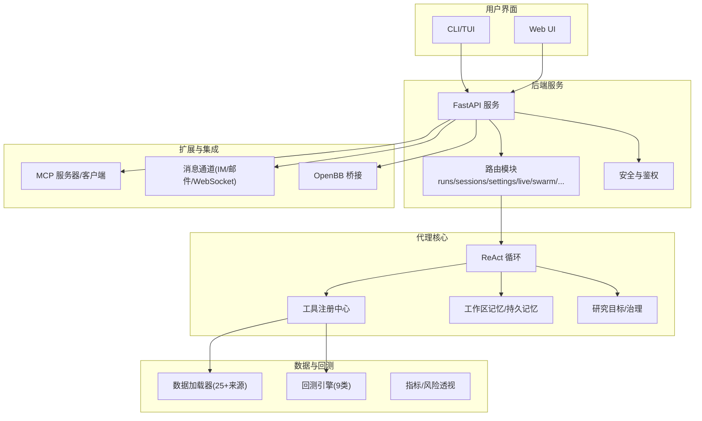
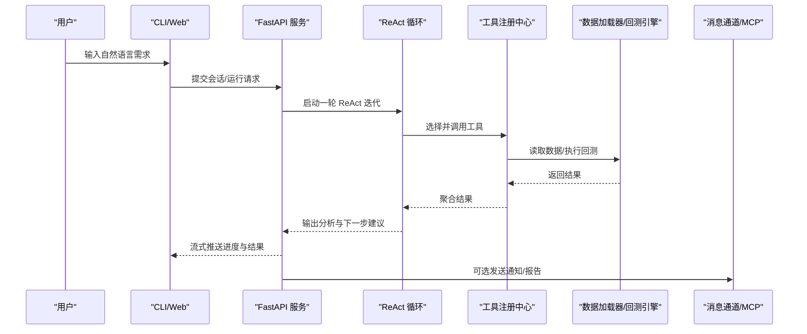
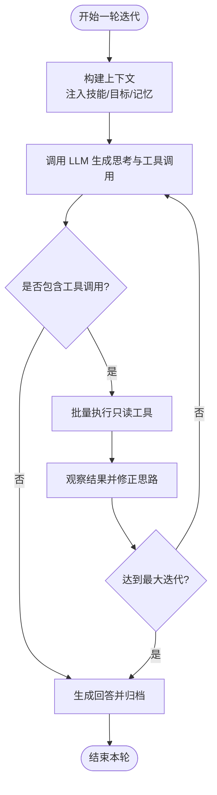
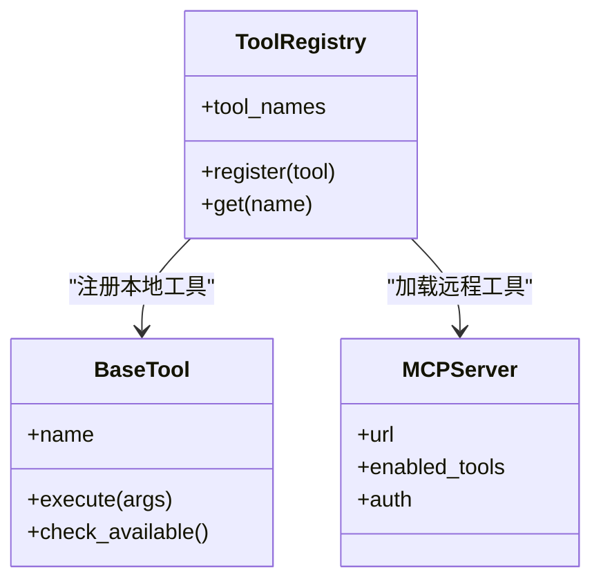
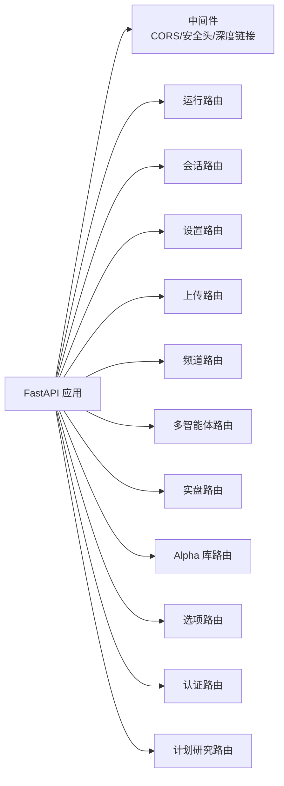
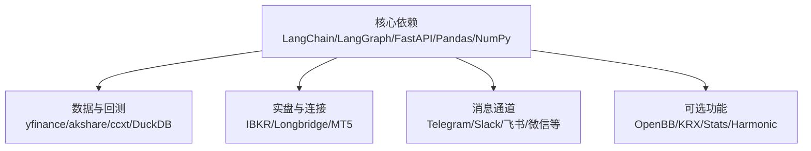

# 项目介绍与目标

<cite>
**本文引用的文件**
- [README.md](file://README.md)
- [SKILL.md](file://agent/SKILL.md)
- [pyproject.toml](file://pyproject.toml)
- [api_server.py](file://agent/api_server.py)
- [cli/main.py](file://agent/cli/main.py)
- [src/agent/loop.py](file://agent/src/agent/loop.py)
- [src/tools/__init__.py](file://agent/src/tools/__init__.py)
</cite>

## 目录
1. [引言](#引言)
2. [项目结构](#项目结构)
3. [核心组件](#核心组件)
4. [架构总览](#架构总览)
5. [详细组件分析](#详细组件分析)
6. [依赖关系分析](#依赖关系分析)
7. [性能考量](#性能考量)
8. [故障排查指南](#故障排查指南)
9. [结论](#结论)
10. [附录](#附录)

## 引言
Vibe-Trading 是一个“自然语言金融研究 AI 代理”，定位为个人交易者的智能助手。它通过对话式界面，把复杂的量化研究工作简化为“用自然语言描述想法—自动完成数据获取、因子计算、回测与报告”的闭环流程。其核心价值主张包括：
- 降低量化门槛：无需深入编程即可开展策略研究与回测。
- 提升研究效率：将重复性劳动自动化，聚焦于假设与逻辑验证。
- 多市场策略开发：覆盖 A 股、港股、美股、加拿大、印度、韩国、加密货币、期货、外汇等，统一工具链与回测引擎。
- 可审计与可复现：每次运行生成清单与审计账本，确保结果可追溯。

与传统量化研究相比，Vibe-Trading 以 ReAct（推理-行动）模式驱动：模型在“思考—调用工具—观察结果—再思考”的循环中逐步构建证据链，最终输出可执行策略或研究报告。这种架构的优势在于：
- 灵活应对复杂问题：通过工具组合解决跨市场、跨数据源的难题。
- 可控且安全：沙箱化代码执行、最小权限工具集、强制授权与审计。
- 可扩展：MCP（Model Context Protocol）机制允许接入外部工具与服务，形成生态。

## 项目结构
仓库采用前后端分离与模块化设计：
- 后端服务：FastAPI 提供 REST API、SSE 流式事件、会话管理、回测与多智能体编排。
- CLI/TUI：交互式命令行入口，支持聊天、回测、设置、连接器管理等。
- 前端：React 单页应用，提供可视化图表、会话记录、Alpha 库与运行详情。
- 代理核心：ReAct 循环、工具注册、记忆与上下文压缩、目标与治理。
- 数据与回测：多数据源加载器、多引擎回测、指标与风险透视。
- 渠道与集成：消息通道（Telegram、Slack、飞书等）、MCP 服务器、OpenBB 桥接。

**图示来源**
- [api_server.py:163-314](file://agent/api_server.py#L163-L314)
- [cli/main.py:1-115](file://agent/cli/main.py#L1-L115)
- [src/agent/loop.py:1-12](file://agent/src/agent/loop.py#L1-L12)
- [src/tools/__init__.py:1-12](file://agent/src/tools/__init__.py#L1-L12)

**章节来源**
- [README.md:1-120](file://README.md#L1-L120)
- [SKILL.md:24-133](file://agent/SKILL.md#L24-L133)
- [pyproject.toml:1-87](file://pyproject.toml#L1-L87)

## 核心组件
- ReAct 循环与上下文管理：实现五层上下文压缩（微压缩、折叠、LLM 摘要、显式压缩、迭代更新），保障长对话不丢失关键信息并控制 token 成本。
- 工具注册中心：自动发现本地工具与远程 MCP 工具，支持白名单过滤与安全策略（如禁用 shell 工具）。
- 会话与运行管理：创建运行目录、保存请求与结果、生成清单与审计账本，保证可复现。
- 数据加载器与回测引擎：统一接口对接 25+ 数据源，9 类回测引擎覆盖股票、期货、外汇、期权与加密货币。
- 多渠道与集成：支持 IM 平台、邮件、WebSocket；提供 OpenBB 桥接与 MCP 客户端能力。
- 安全与治理：内容过滤、路径校验、沙箱限制、审计追踪、授权门禁。

**章节来源**
- [src/agent/loop.py:1-12](file://agent/src/agent/loop.py#L1-L12)
- [src/tools/__init__.py:1-12](file://agent/src/tools/__init__.py#L1-L12)
- [SKILL.md:67-133](file://agent/SKILL.md#L67-L133)

## 架构总览
系统由“用户界面—后端服务—代理核心—数据与回测—扩展集成”构成。用户通过 CLI 或 Web UI 发起研究任务，后端 FastAPI 路由到 ReAct 循环，循环通过工具注册中心调用数据加载器与回测引擎，产出指标与报告；同时通过 MCP 与消息通道进行扩展与通知。

**图示来源**
- [api_server.py:163-314](file://agent/api_server.py#L163-L314)
- [src/agent/loop.py:638-800](file://agent/src/agent/loop.py#L638-L800)
- [src/tools/__init__.py:66-245](file://agent/src/tools/__init__.py#L66-L245)

## 详细组件分析

### ReAct 循环与上下文管理
- 五层上下文管理：从轻量级剪枝到 LLM 结构化摘要，再到迭代更新，确保长对话中的关键信息不丢失，同时控制 token 使用。
- 工具批处理：连续只读工具并行执行，提高吞吐。
- 运行治理：每轮生成清单与审计记录，确保方法透明与可复现。

**图示来源**
- [src/agent/loop.py:307-400](file://agent/src/agent/loop.py#L307-L400)
- [src/agent/loop.py:638-800](file://agent/src/agent/loop.py#L638-L800)

**章节来源**
- [src/agent/loop.py:1-12](file://agent/src/agent/loop.py#L1-L12)
- [src/agent/loop.py:307-400](file://agent/src/agent/loop.py#L307-L400)
- [src/agent/loop.py:638-800](file://agent/src/agent/loop.py#L638-L800)

### 工具注册中心与 MCP 集成
- 自动发现：扫描本地工具子类并注册，支持按需启用/禁用（如 shell 工具）。
- MCP 扩展：按配置加载远程工具，隔离失败与限流；对实时券商通道进行安全包装与授权门禁。
- 白名单过滤：为多智能体工作单元提供严格工具白名单，避免越权。

**图示来源**
- [src/tools/__init__.py:33-63](file://agent/src/tools/__init__.py#L33-L63)
- [src/tools/__init__.py:66-245](file://agent/src/tools/__init__.py#L66-L245)

**章节来源**
- [src/tools/__init__.py:1-12](file://agent/src/tools/__init__.py#L1-L12)
- [src/tools/__init__.py:66-245](file://agent/src/tools/__init__.py#L66-L245)

### 后端服务与路由
- FastAPI 应用装配：挂载中间件、安全头、CORS、SPA 静态资源。
- 路由模块化：运行、会话、设置、上传、频道、多智能体、实盘、Alpha 库、选项分析、认证、计划研究等。
- 生命周期管理：启动预检、计划任务执行器、通道运行时启停。

**图示来源**
- [api_server.py:163-314](file://agent/api_server.py#L163-L314)

**章节来源**
- [api_server.py:1-120](file://agent/api_server.py#L1-L120)
- [api_server.py:163-314](file://agent/api_server.py#L163-L314)

### CLI 交互入口
- 首次引导：检测 .env 缺失时进入向导，写入配置后继续。
- 状态探测：后台线程预热预检，展示技能/工具/会话统计。
- 斜杠命令：注册连接器、中止/恢复等安全相关命令，增强可发现性。

**章节来源**
- [cli/main.py:1-115](file://agent/cli/main.py#L1-L115)
- [cli/main.py:219-320](file://agent/cli/main.py#L219-L320)
- [cli/main.py:545-642](file://agent/cli/main.py#L545-L642)

## 依赖关系分析
- Python 版本与核心依赖：Python 3.11-3.13，LangChain/LangGraph、FastAPI、Uvicorn、Pandas、NumPy、Scipy、DuckDB、yfinance、akshare、ccxt 等。
- 可选依赖：IBKR、Longbridge、MT5、DeepSeek、Copilot、Anthropic、OpenBB、KRX、Stats、A 股 BaoStock、Harmonic、各消息通道 SDK。
- 包入口：vibe-trading（CLI）、vibe-trading-mcp（MCP 服务器）。

**图示来源**
- [pyproject.toml:24-69](file://pyproject.toml#L24-L69)
- [pyproject.toml:105-230](file://pyproject.toml#L105-L230)
- [pyproject.toml:77-87](file://pyproject.toml#L77-L87)

**章节来源**
- [pyproject.toml:1-87](file://pyproject.toml#L1-L87)
- [pyproject.toml:105-230](file://pyproject.toml#L105-L230)

## 性能考量
- 上下文压缩：多层压缩减少 token 消耗，避免 LLM 调用过载。
- 工具并行：只读工具批量并行执行，提升吞吐。
- 数据缓存：可选本地历史数据缓存，减少网络请求与速率限制影响。
- 指标与风险：回测后生成风险透视与归因，帮助快速定位瓶颈。

[本节为通用指导，不直接分析具体文件]

## 故障排查指南
- 提供商可靠性：针对 DeepSeek、Kimi、Gemini 等适配问题，提供诊断与重试策略，避免静默失败。
- 工具超时与错误：工具调用超时、空响应、非有限数值等均有防护与降级。
- 安全与沙箱：禁止危险导入与系统调用，路径校验与 CSP 防护。
- 日志与审计：访问日志脱敏、审计账本哈希链、运行清单与轨迹。

**章节来源**
- [README.md:193-293](file://README.md#L193-L293)
- [api_server.py:127-160](file://agent/api_server.py#L127-L160)

## 结论
Vibe-Trading 通过 ReAct 模式与强大的工具生态，将自然语言转化为可执行的量化研究流程，显著降低门槛、提高效率，并支持多市场策略开发与审计。其模块化架构与可扩展的 MCP 集成，使其既能满足个人交易者需求，也能支撑机构级研究场景。

[本节为总结性内容，不直接分析具体文件]

## 附录
- 快速上手：安装后直接使用回测、市场数据、因子分析、选项定价、交易日记分析、Alpha 库与技能等功能，多数市场无需 API Key。
- 多智能体团队：预设投资委员会、全球股票台、加密交易台等，适合复杂研究任务。
- 影子账户：从交易记录提取规则，跨市场回测并生成报告。

**章节来源**
- [SKILL.md:212-219](file://agent/SKILL.md#L212-L219)
- [SKILL.md:99-133](file://agent/SKILL.md#L99-L133)
- [SKILL.md:67-98](file://agent/SKILL.md#L67-L98)