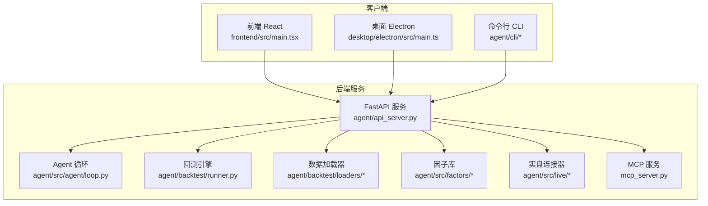
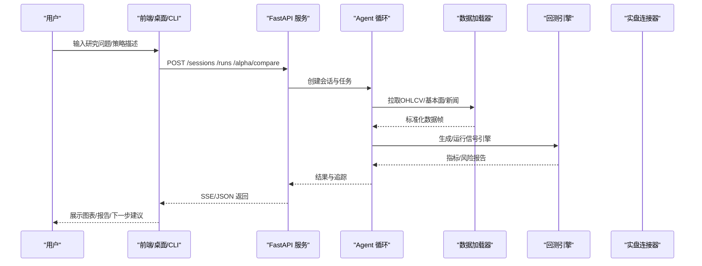
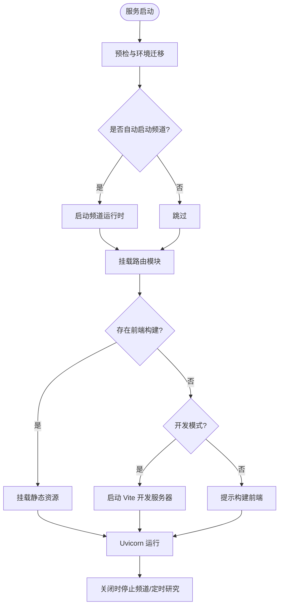
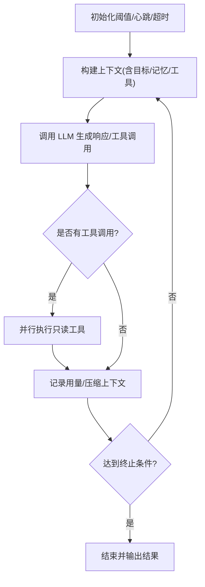
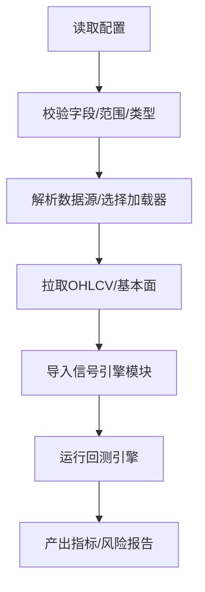
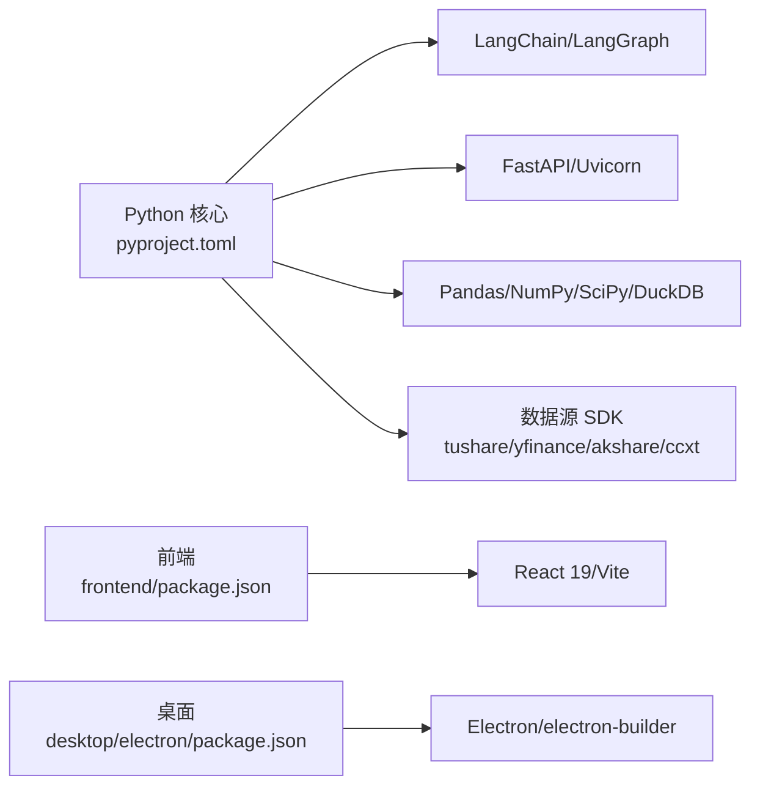

# 项目概述

<cite>
**本文引用的文件**
- [README.md](file://README.md)
- [pyproject.toml](file://pyproject.toml)
- [agent/requirements.txt](file://agent/requirements.txt)
- [agent/api_server.py](file://agent/api_server.py)
- [agent/src/agent/loop.py](file://agent/src/agent/loop.py)
- [agent/backtest/runner.py](file://agent/backtest/runner.py)
- [frontend/package.json](file://frontend/package.json)
- [frontend/src/main.tsx](file://frontend/src/main.tsx)
- [desktop/electron/package.json](file://desktop/electron/package.json)
- [desktop/electron/src/main.ts](file://desktop/electron/src/main.ts)
</cite>

## 目录
1. [简介](#简介)
2. [项目结构](#项目结构)
3. [核心组件](#核心组件)
4. [架构总览](#架构总览)
5. [详细组件分析](#详细组件分析)
6. [依赖关系分析](#依赖关系分析)
7. [性能考量](#性能考量)
8. [故障排查指南](#故障排查指南)
9. [结论](#结论)
10. [附录：快速开始](#附录快速开始)

## 简介
Vibe-Trading 是一个“自然语言金融研究 AI 代理”，面向个人量化交易与投研工作流，提供从研究、回测到实盘交易的一体化能力。其核心目标是让研究者用自然语言驱动策略研究与验证，并通过多市场数据源、智能因子分析与可组合的回测引擎，将想法快速落地为可执行的交易计划；同时提供安全的实盘接口与桌面化体验，降低使用门槛。

主要特性概览
- 自然语言驱动的投研与策略生成：基于 LangChain/LangGraph 的 ReAct 循环，结合工具注册表与记忆系统，自动检索数据、计算指标、生成并运行信号引擎。
- 多市场回测：支持 A 股、全球股票、期货、外汇、加密货币等市场，统一的数据加载器与回测引擎抽象，便于横向比较与组合回测。
- 智能因子分析：内置大量学术因子与基本面因子，支持因子库对比、IC/IR 评估与衰减监控。
- 实盘交易接口：通过连接器（Broker Connectors）对接多家券商与交易所，具备授权、指令限制、审计与风控闸门。
- 多端交互：Web 前端（React 19）、Electron 桌面应用、CLI 命令行工具，以及 MCP/REST API 暴露给外部系统。

技术栈选择要点
- Python 3.11+：兼顾生态成熟度与性能，满足科学计算与异步 I/O 需求。
- FastAPI + Uvicorn：高性能异步 Web 框架，适合 REST/SSE 流式输出与微服务化扩展。
- LangChain/LangGraph：构建可编排的智能体工作流，支撑 ReAct 循环、工具调用与状态持久化。
- React 19 + Vite：现代化前端工程化，配合 TailwindCSS、ECharts、i18n 等生态，提供流畅的可视化与交互体验。
- Electron：封装后端进程与前端页面，提供本地一键启动、安全凭证存储与跨平台分发。

**章节来源**
- [README.md:1-166](file://README.md#L1-L166)
- [pyproject.toml:1-279](file://pyproject.toml#L1-L279)
- [agent/requirements.txt:1-69](file://agent/requirements.txt#L1-L69)

## 项目结构
仓库采用分层与模块化组织：
- agent：Python 后端核心，包含 CLI、API 服务、Agent 循环、回测引擎、数据加载器、因子库、实盘连接器、MCP 服务等。
- frontend：React 19 Web 前端，提供会话聊天、回测结果可视化、Alpha 库浏览、设置管理等界面。
- desktop/electron：Electron 桌面壳，负责后端生命周期管理、安全凭证存储、本地打包与分发。
- wiki：文档与教程站点资源。
- scripts、tools：CI、测试与辅助脚本。

**图表来源**
- [frontend/src/main.tsx:1-36](file://frontend/src/main.tsx#L1-L36)
- [desktop/electron/src/main.ts:1-285](file://desktop/electron/src/main.ts#L1-L285)
- [agent/api_server.py:1-400](file://agent/api_server.py#L1-L400)
- [agent/src/agent/loop.py:1-200](file://agent/src/agent/loop.py#L1-L200)
- [agent/backtest/runner.py:1-200](file://agent/backtest/runner.py#L1-L200)

**章节来源**
- [frontend/package.json:1-58](file://frontend/package.json#L1-L58)
- [desktop/electron/package.json:1-86](file://desktop/electron/package.json#L1-L86)
- [agent/api_server.py:1-400](file://agent/api_server.py#L1-L400)

## 核心组件
- Agent 循环（ReAct）：维护五层上下文压缩、工具并行执行、心跳与进度事件、LLM 用量统计与持久化。
- 回测运行器：读取配置、选择数据源、导入信号引擎、运行引擎并产出指标与风险报告。
- 数据加载器：统一的多源 OHLCV 获取与校验，支持免费与付费源、本地文件与第三方终端。
- 因子库：注册与执行大量学术/基本面因子，支持对比与衰减监控。
- 实盘连接器：账户、持仓、订单、行情与历史查询，部分支持纸仓/实盘下单与风控闸门。
- API 服务：FastAPI 装配路由、中间件、认证与安全头，挂载前端静态资源或开发模式 Vite。
- 前端：React 19 + Vite，提供会话、回测详情、Alpha 库、设置、频道集成等页面。
- 桌面应用：Electron 主进程管理后端生命周期、注入鉴权头、安全凭证存储与错误提示。

**章节来源**
- [agent/src/agent/loop.py:1-200](file://agent/src/agent/loop.py#L1-L200)
- [agent/backtest/runner.py:1-200](file://agent/backtest/runner.py#L1-L200)
- [agent/api_server.py:1-400](file://agent/api_server.py#L1-L400)
- [frontend/src/main.tsx:1-36](file://frontend/src/main.tsx#L1-L36)
- [desktop/electron/src/main.ts:1-285](file://desktop/electron/src/main.ts#L1-L285)

## 架构总览
整体采用“客户端—后端服务—领域模块”的分层架构：
- 客户端层：Web 前端、Electron 桌面、CLI 工具，均通过 REST/SSE/MCP 与后端交互。
- 服务层：FastAPI 作为统一入口，聚合会话、回测、设置、上传、频道、群智（Swarm）、实盘、Alpha 库等路由。
- 领域层：Agent 循环协调工具与 LLM；回测引擎与数据加载器实现多市场回测；因子库与量化库提供数学与统计能力；连接器对接券商与交易所。

**图表来源**
- [agent/api_server.py:1-400](file://agent/api_server.py#L1-L400)
- [agent/src/agent/loop.py:1-200](file://agent/src/agent/loop.py#L1-L200)
- [agent/backtest/runner.py:1-200](file://agent/backtest/runner.py#L1-L200)

## 详细组件分析

### 后端 API 服务（FastAPI）
职责
- 装配 FastAPI 应用，注册 CORS、安全头、SPA 深链回退等中间件。
- 启动前预检（环境、提供商、路径迁移），按需启动定时研究与频道运行时。
- 挂载各功能路由模块（会话、运行、设置、上传、频道、群智、实盘、Alpha、期权、认证、OpenBB 桥接、定时研究）。
- 生产模式下提供前端静态资源，开发模式下启动 Vite 热更新。

关键流程
- 生命周期：启动时执行预检与可选服务启动；关闭时反向停止频道与定时研究。
- 安全：拒绝不受信任的 loopback 主机、CSRF/CSP 加固、SSE 票据鉴权。
- 前端集成：根据是否存在构建产物决定 SPA 挂载或提示构建命令。

**图表来源**
- [agent/api_server.py:127-161](file://agent/api_server.py#L127-L161)
- [agent/api_server.py:166-185](file://agent/api_server.py#L166-L185)
- [agent/api_server.py:185-314](file://agent/api_server.py#L185-L314)
- [agent/api_server.py:321-395](file://agent/api_server.py#L321-L395)

**章节来源**
- [agent/api_server.py:1-400](file://agent/api_server.py#L1-L400)

### Agent 循环（ReAct）
职责
- 管理五层上下文压缩（微压缩、文本折叠、自动摘要、显式压缩工具、迭代更新）。
- 工具执行优化：连续只读工具并行执行，减少等待时间。
- 心跳与进度：周期性心跳、事件发射、超时控制。
- LLM 用量统计：归一化 provider 上报用量，按轮次累计并持久化。

关键流程
- 初始化：加载配置阈值、心跳间隔、工具超时、目标最大续写次数等。
- 循环：构造上下文 → 调用 LLM → 解析工具调用 → 执行工具（并行/串行）→ 记录结果与用量 → 压缩上下文 → 判断终止条件。

**图表来源**
- [agent/src/agent/loop.py:1-200](file://agent/src/agent/loop.py#L1-L200)

**章节来源**
- [agent/src/agent/loop.py:1-200](file://agent/src/agent/loop.py#L1-L200)

### 回测运行器
职责
- 读取配置（代码列表、起止日期、数据源、周期、引擎、初始资金等），进行严格校验。
- 根据符号格式与源选择数据加载器，拉取 OHLCV 数据。
- 动态导入信号引擎模块，运行回测引擎并产出指标与风险报告。

关键流程
- 配置校验：日期合法性、区间有效性、引擎类型、资金非零正数等。
- 数据获取：通过注册表与回退链选择 loader，确保数据完整性与一致性。
- 引擎运行：安全地加载信号引擎，执行回测并汇总结果。

**图表来源**
- [agent/backtest/runner.py:1-200](file://agent/backtest/runner.py#L1-L200)

**章节来源**
- [agent/backtest/runner.py:1-200](file://agent/backtest/runner.py#L1-L200)

### 前端（React 19）
职责
- 应用入口与路由提供，渲染错误边界与通知。
- 懒加载图表组件以提升首屏性能。
- 与后端通过 REST/SSE 交互，展示会话、回测、Alpha 库等页面。

关键点
- 使用 React 19 与 Vite 构建，支持 TypeScript、TailwindCSS、国际化与图表库。
- 在空闲时预取图表模块，提升交互响应速度。

**章节来源**
- [frontend/src/main.tsx:1-36](file://frontend/src/main.tsx#L1-L36)
- [frontend/package.json:1-58](file://frontend/package.json#L1-L58)

### 桌面应用（Electron）
职责
- 主进程创建窗口、菜单、IPC 通道，管理后端生命周期。
- 注入安全头（Bearer Token）到对后端的请求，防止未授权访问。
- 安全凭证存储（safeStorage），隔离敏感信息，提供设置与恢复能力。
- 错误处理与日志打开、重启后端、退出清理。

关键点
- 单实例锁、父进程死亡检测、加载页与错误弹窗。
- 仅允许安全的外部 URL 打开，拦截危险导航。

**章节来源**
- [desktop/electron/src/main.ts:1-285](file://desktop/electron/src/main.ts#L1-L285)
- [desktop/electron/package.json:1-86](file://desktop/electron/package.json#L1-L86)

## 依赖关系分析
- Python 依赖：LangChain/LangGraph 用于智能体编排；FastAPI/Uvicorn 提供高性能 API；Pandas/NumPy/SciPy/DuckDB 支撑数据处理；Tushare/Yahoo/AkShare/CCXT 等多源数据接入；Matplotlib/WeasyPrint 用于报告渲染。
- 前端依赖：React 19、Vite、TailwindCSS、ECharts、i18next、Zustand 等，保障现代 UI 与状态管理。
- 桌面依赖：Electron 与 electron-builder，支持打包与签名流程。

**图表来源**
- [pyproject.toml:24-69](file://pyproject.toml#L24-L69)
- [frontend/package.json:17-39](file://frontend/package.json#L17-L39)
- [desktop/electron/package.json:24-29](file://desktop/electron/package.json#L24-L29)

**章节来源**
- [pyproject.toml:1-279](file://pyproject.toml#L1-L279)
- [agent/requirements.txt:1-69](file://agent/requirements.txt#L1-L69)
- [frontend/package.json:1-58](file://frontend/package.json#L1-L58)
- [desktop/electron/package.json:1-86](file://desktop/electron/package.json#L1-L86)

## 性能考量
- 数据层：批量下载与缓存（如启用数据缓存开关）可减少网络开销与速率限制影响；统一加载器边界进行 OHLC 校验，避免脏数据导致后续计算失真。
- 计算层：热点滚动因子使用 bottleneck/NumPy 快路径；向量化的信号对齐提升大规模回测效率。
- 并发层：Agent 循环中对只读工具并行执行，缩短端到端延迟；SSE 流式传输避免阻塞。
- 前端层：懒加载图表组件、按需加载 K 线数据，降低首屏负载与内存占用。
- 安全与稳定性：严格的配置校验与有限值检查，防止 inf/nan 污染指标；异常降级与重试机制提升鲁棒性。

[本节为通用指导，不直接分析具体文件]

## 故障排查指南
常见问题与建议
- 启动失败或端口占用：检查 FastAPI 绑定地址与端口；确认无其他进程占用；查看日志中的警告与错误。
- 前端无法加载：确认已构建前端产物或处于开发模式；若未找到构建目录，按提示执行构建命令。
- 远程访问被拒：若绑定非 loopback 地址且未设置 API 密钥，远端请求会被拒绝；建议使用 localhost 或设置 API_AUTH_KEY。
- 数据源不可用：检查网络与凭据；利用回退链与缓存开关；关注加载器的区间支持与单位声明。
- 模型连接异常：使用诊断命令查看提供商/模型/包版本/代理快照；必要时切换提供商或调整参数。
- 桌面应用崩溃：查看日志目录；尝试重启后端；检查安全凭证存储状态。

**章节来源**
- [agent/api_server.py:321-395](file://agent/api_server.py#L321-L395)
- [desktop/electron/src/main.ts:148-210](file://desktop/electron/src/main.ts#L148-L210)

## 结论
Vibe-Trading 以自然语言为入口，将投研、回测与交易串联成闭环，借助多市场数据、智能因子与可组合引擎，显著降低策略从想法到验证再到执行的门槛。其架构清晰、模块化良好，前后端与桌面端协同，提供一致的用户体验与强大的扩展能力。对于初学者，可通过 CLI 与 Web 快速上手；对于资深开发者，丰富的工具与接口支持深度定制与集成。

[本节为总结性内容，不直接分析具体文件]

## 附录：快速开始
以下流程帮助用户在几分钟内运行第一个交易策略（概念性步骤，不涉及具体代码片段）：
- 安装依赖：使用 pip 安装 vibe-trading-ai，确保 Python 版本满足要求。
- 配置环境：设置必要的提供商密钥（如 LLM 与数据源），可在 Settings 中配置或通过环境变量注入。
- 启动服务：运行后端服务，默认监听本地端口；如需远程访问，请设置 API 密钥或使用 localhost。
- 使用 CLI：通过命令行发起一次研究任务，例如描述一个简单策略意图，系统将自动检索数据、计算指标并生成回测。
- 查看结果：在 Web 前端或 CLI 中查看会话消息、回测指标与风险报告；根据需要调整策略参数再次运行。
- 进阶：探索 Alpha 库、因子对比、期权分析、频道集成与定时研究等功能。

[本节为入门指引，不直接分析具体文件]