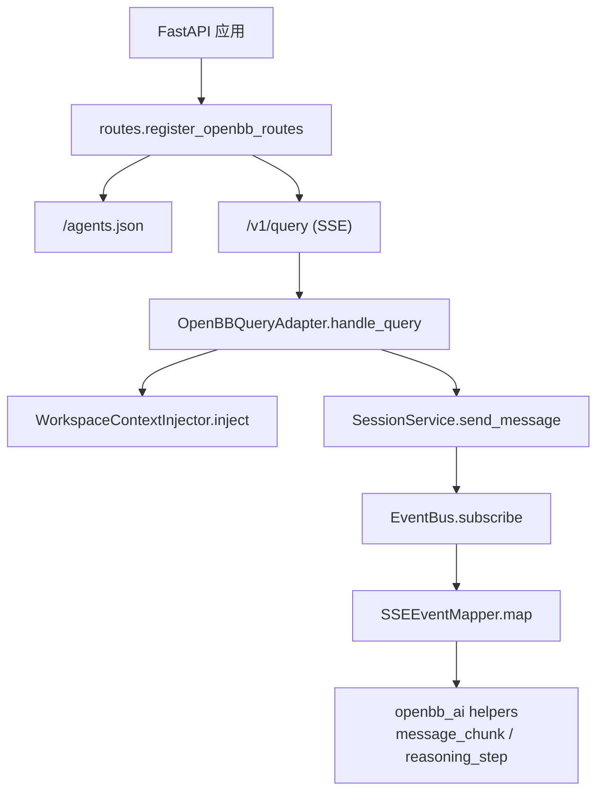
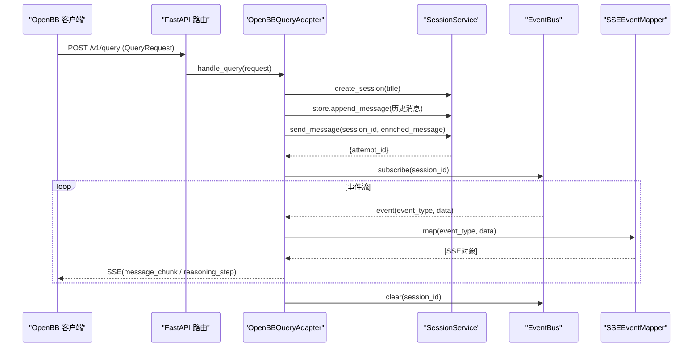
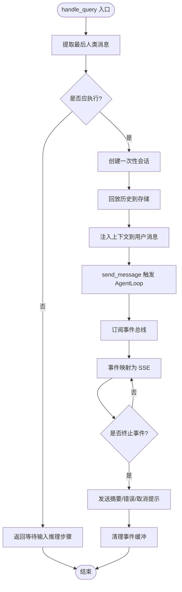
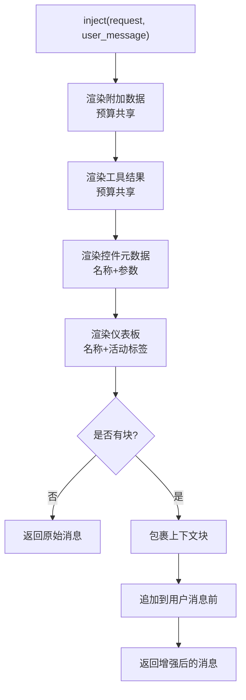
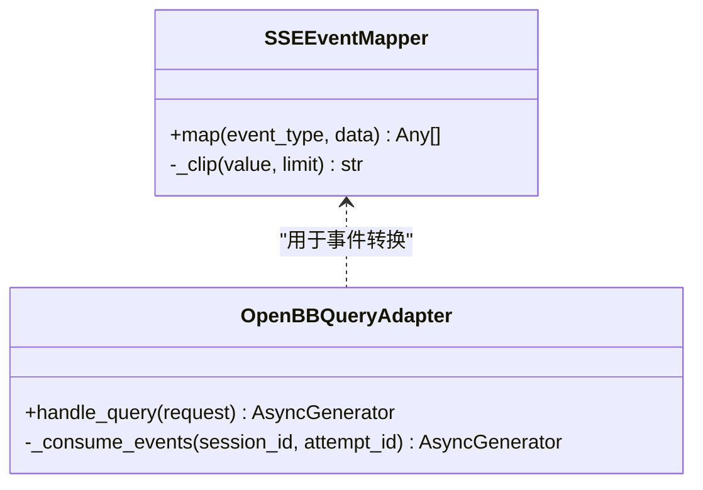
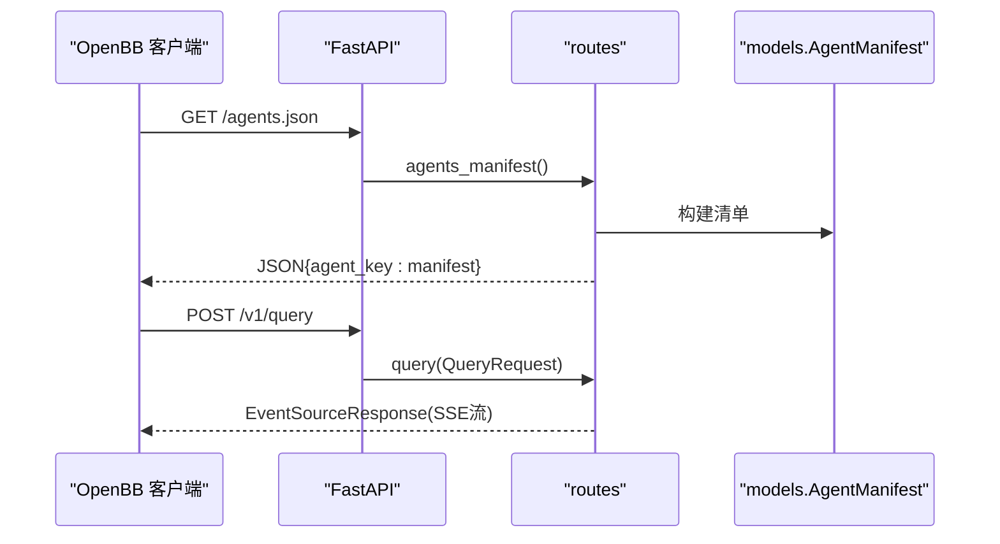
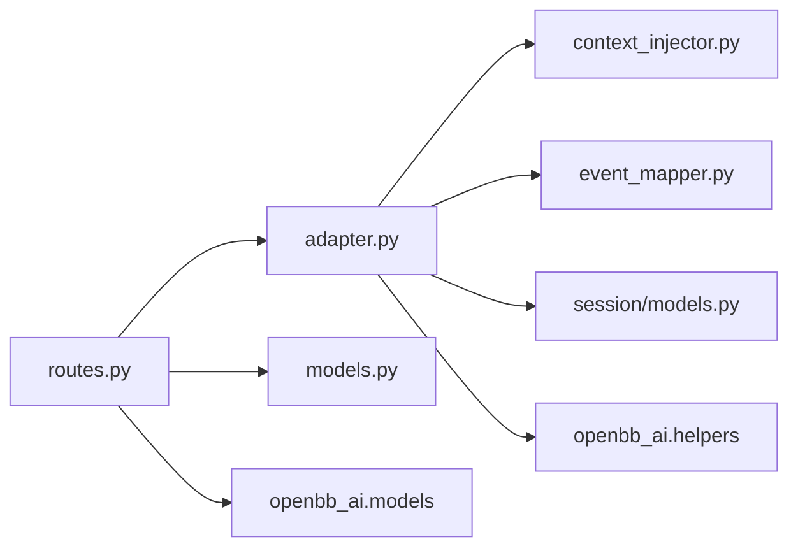

# OpenBB 桥接集成

<cite>
**本文引用的文件**
- [agent/src/openbb_bridge/__init__.py](file://agent/src/openbb_bridge/__init__.py)
- [agent/src/openbb_bridge/routes.py](file://agent/src/openbb_bridge/routes.py)
- [agent/src/openbb_bridge/adapter.py](file://agent/src/openbb_bridge/adapter.py)
- [agent/src/openbb_bridge/context_injector.py](file://agent/src/openbb_bridge/context_injector.py)
- [agent/src/openbb_bridge/event_mapper.py](file://agent/src/openbb_bridge/event_mapper.py)
- [agent/src/openbb_bridge/models.py](file://agent/src/openbb_bridge/models.py)
- [agent/src/session/models.py](file://agent/src/session/models.py)
- [agent/tests/test_openbb_bridge/test_adapter.py](file://agent/tests/test_openbb_bridge/test_adapter.py)
- [agent/tests/test_openbb_bridge/test_context_injector.py](file://agent/tests/test_openbb_bridge/test_context_injector.py)
</cite>

## 目录
1. [简介](#简介)
2. [项目结构](#项目结构)
3. [核心组件](#核心组件)
4. [架构总览](#架构总览)
5. [详细组件分析](#详细组件分析)
6. [依赖关系分析](#依赖关系分析)
7. [性能与可扩展性](#性能与可扩展性)
8. [故障排除指南](#故障排除指南)
9. [结论](#结论)
10. [附录：扩展与最佳实践](#附录：扩展与最佳实践)

## 简介
本技术文档面向希望在 Vibe-Trading 中集成 OpenBB Workspace 的开发者，系统性说明 OpenBB 桥接集成的架构原理、数据流机制与关键实现细节。重点包括：
- OpenBB Platform 在桥接层中的角色与数据流
- 适配器模式在“统一接口”中的应用（市场数据、财务数据、新闻数据的统一入口）
- 上下文注入器如何将会话状态、用户偏好、认证信息传递给 OpenBB 工具
- 事件映射器的异步事件处理、错误传播与结果格式化
- 实际集成示例：新增数据源、定制数据处理流程、性能优化
- 故障排除与最佳实践

## 项目结构
OpenBB 桥接位于 agent/src/openbb_bridge 下，采用分层设计：
- routes：暴露 FastAPI 路由 /agents.json 与 /v1/query，完成鉴权与 SSE 流式响应
- adapter：将 OpenBB QueryRequest 适配为 Vibe-Trading SessionService 调用，管理会话生命周期与事件消费
- context_injector：将 OpenBB 工作区上下文（上下文数据、工具结果、仪表板与控件元数据）注入到用户消息前缀
- event_mapper：将 Vibe-Trading 内部事件转换为 openbb_ai SSE 对象
- models：定义 agents.json 清单模型
- __init__：提供可选安装开关 try_register_openbb_routes

图表来源
- [agent/src/openbb_bridge/routes.py:82-162](file://agent/src/openbb_bridge/routes.py#L82-L162)
- [agent/src/openbb_bridge/adapter.py:82-126](file://agent/src/openbb_bridge/adapter.py#L82-L126)
- [agent/src/openbb_bridge/context_injector.py:81-127](file://agent/src/openbb_bridge/context_injector.py#L81-L127)
- [agent/src/openbb_bridge/event_mapper.py:47-144](file://agent/src/openbb_bridge/event_mapper.py#L47-L144)

章节来源
- [agent/src/openbb_bridge/__init__.py:27-58](file://agent/src/openbb_bridge/__init__.py#L27-L58)
- [agent/src/openbb_bridge/routes.py:1-162](file://agent/src/openbb_bridge/routes.py#L1-L162)

## 核心组件
- OpenBBQueryAdapter：请求适配与会话编排，负责创建一次性会话、回放历史、注入上下文、触发 AgentLoop、消费事件并生成 SSE
- WorkspaceContextInjector：将 OpenBB 工作区的上下文数据、工具返回结果、控件与仪表板元数据压缩成自然语言前缀，附加到用户消息
- SSEEventMapper：将细粒度内部事件（文本增量、工具调用/结果、目标更新等）映射为 openbb_ai 的 message_chunk/reasoning_step
- routes：注册 /agents.json 与 /v1/query，处理鉴权与异常，输出 EventSourceResponse
- models：AgentManifest 描述自定义代理能力与端点

章节来源
- [agent/src/openbb_bridge/adapter.py:57-126](file://agent/src/openbb_bridge/adapter.py#L57-L126)
- [agent/src/openbb_bridge/context_injector.py:78-127](file://agent/src/openbb_bridge/context_injector.py#L78-L127)
- [agent/src/openbb_bridge/event_mapper.py:47-144](file://agent/src/openbb_bridge/event_mapper.py#L47-L144)
- [agent/src/openbb_bridge/routes.py:82-162](file://agent/src/openbb_bridge/routes.py#L82-L162)
- [agent/src/openbb_bridge/models.py:15-34](file://agent/src/openbb_bridge/models.py#L15-L34)

## 架构总览
OpenBB Workspace 通过两个端点与 Vibe-Trading 交互：
- GET /agents.json：发现自定义代理，声明支持流式与控件选择能力
- POST /v1/query：接收 QueryRequest，返回 SSE 流

请求进入后：
1. routes 解析鉴权并获取适配器实例
2. adapter 创建一次性会话，回放历史，注入上下文，调用 SessionService.send_message
3. 订阅 EventBus，按事件类型映射为 openbb_ai SSE 对象并流式返回
4. 终止事件到达后清理事件缓冲区

图表来源
- [agent/src/openbb_bridge/routes.py:118-157](file://agent/src/openbb_bridge/routes.py#L118-L157)
- [agent/src/openbb_bridge/adapter.py:82-126](file://agent/src/openbb_bridge/adapter.py#L82-L126)
- [agent/src/openbb_bridge/event_mapper.py:47-144](file://agent/src/openbb_bridge/event_mapper.py#L47-L144)

## 详细组件分析

### 适配器 OpenBBQueryAdapter
职责：
- 从 QueryRequest 提取最后一条人类消息，判断是否应执行
- 创建一次性会话，标题截断以保证可读性
- 回放历史：将 OpenBB 提供的历史消息写入存储，避免重复启动尝试
- 注入上下文：使用 WorkspaceContextInjector 将工作区上下文前置到用户消息
- 触发 AgentLoop：调用 SessionService.send_message，获取 attempt_id
- 消费事件：订阅 EventBus，过滤心跳与无关事件，映射为 SSE 并流式返回
- 终止处理：对失败/取消/完成事件进行收尾，必要时发送摘要或错误提示
- 资源释放：finally 中清理事件总线缓冲，防止内存泄漏

复杂度与性能：
- 历史回放 O(N)，N 为历史消息数；仅写入存储不触发新尝试
- 事件消费为异步迭代，时间复杂度与事件数量线性相关
- 终止事件后立即 break，减少不必要的事件处理

错误处理：
- send_message 异常捕获，返回 ERROR reasoning_step 与友好消息
- 事件映射异常被吞掉并记录日志，保证流不断开
- 未知事件静默丢弃，避免噪声泄露

图表来源
- [agent/src/openbb_bridge/adapter.py:82-201](file://agent/src/openbb_bridge/adapter.py#L82-L201)

章节来源
- [agent/src/openbb_bridge/adapter.py:57-317](file://agent/src/openbb_bridge/adapter.py#L57-L317)
- [agent/tests/test_openbb_bridge/test_adapter.py:83-200](file://agent/tests/test_openbb_bridge/test_adapter.py#L83-L200)

### 上下文注入器 WorkspaceContextInjector
职责：
- 将三类上下文合并为自然语言前缀：
  - 附加数据（context items）：唯一承载真实值的数据块，受字符预算限制
  - 工具结果（tool-role 消息）：已检索到的数据片段，同样受预算限制
  - 控件与仪表板元数据：仅名称与参数，明确告知模型数据未附带，需自行拉取
- 严格预算控制：
  - MAX_DATA_CHARS 限制附加数据总量
  - MAX_WIDGETS、MAX_PARAMS_PER_WIDGET 限制控件列表长度
  - 截断时追加标记，便于调试与定位
- 安全降级：
  - 读取属性或字典键的安全访问 _safe
  - 任何异常不会中断查询，仅记录警告并回退原始消息

数据流：
- 先渲染附加数据，再渲染工具结果，最后渲染控件与仪表板
- 所有块以分隔符拼接，置于 [OpenBB Workspace context]...[End of context] 之间
- 最终拼接到用户消息之前，确保模型优先看到上下文

图表来源
- [agent/src/openbb_bridge/context_injector.py:81-127](file://agent/src/openbb_bridge/context_injector.py#L81-L127)
- [agent/src/openbb_bridge/context_injector.py:131-250](file://agent/src/openbb_bridge/context_injector.py#L131-L250)
- [agent/src/openbb_bridge/context_injector.py:269-345](file://agent/src/openbb_bridge/context_injector.py#L269-L345)

章节来源
- [agent/src/openbb_bridge/context_injector.py:1-345](file://agent/src/openbb_bridge/context_injector.py#L1-L345)
- [agent/tests/test_openbb_bridge/test_context_injector.py:86-200](file://agent/tests/test_openbb_bridge/test_context_injector.py#L86-L200)

### 事件映射器 SSEEventMapper
职责：
- 将 Vibe-Trading 内部事件映射为 openbb_ai SSE 对象
- 文本增量事件 -> message_chunk
- 工具调用/结果 -> reasoning_step（包含工具名、状态、耗时、预览）
- 目标更新、MCP 警告、上下文压缩、流重置等 -> reasoning_step
- 高频进度/遥测事件（如 thinking_done、tool_heartbeat、llm_usage）被静默丢弃
- 未知事件静默丢弃并记录调试日志，避免噪声泄露

错误传播：
- 映射异常被捕获并记录警告，返回空列表，确保流稳定
- 工具结果错误状态会提升 reasoning_step 级别为 ERROR

图表来源
- [agent/src/openbb_bridge/event_mapper.py:47-144](file://agent/src/openbb_bridge/event_mapper.py#L47-L144)
- [agent/src/openbb_bridge/adapter.py:130-166](file://agent/src/openbb_bridge/adapter.py#L130-L166)

章节来源
- [agent/src/openbb_bridge/event_mapper.py:1-144](file://agent/src/openbb_bridge/event_mapper.py#L1-L144)

### 路由与清单 routes & models
- /agents.json：返回静态清单，声明代理名称、描述、头像、端点与特性（streaming、widget-dashboard-select）
- /v1/query：POST 请求，携带鉴权依赖，返回 EventSourceResponse 流式 SSE
- 适配器缓存：基于当前 SessionService 实例 ID 缓存适配器，避免重复构造
- 不可用路径：当运行时未启用时，返回错误推理步骤与提示

图表来源
- [agent/src/openbb_bridge/routes.py:105-162](file://agent/src/openbb_bridge/routes.py#L105-L162)
- [agent/src/openbb_bridge/models.py:15-34](file://agent/src/openbb_bridge/models.py#L15-L34)

章节来源
- [agent/src/openbb_bridge/routes.py:1-162](file://agent/src/openbb_bridge/routes.py#L1-L162)
- [agent/src/openbb_bridge/models.py:1-34](file://agent/src/openbb_bridge/models.py#L1-L34)

## 依赖关系分析
- 外部依赖：
  - openbb_ai.helpers：message_chunk、reasoning_step
  - openbb_ai.models：QueryRequest、DataContent、Widget、DashboardInfo 等
  - sse_starlette.sse：EventSourceResponse
- 内部依赖：
  - src.api.state._get_session_service：获取当前 SessionService
  - src.session.models.Message：会话消息实体
- 耦合与内聚：
  - adapter 高内聚于会话编排与事件消费
  - context_injector 独立于业务逻辑，专注上下文格式化
  - event_mapper 纯函数式映射，无副作用
  - routes 薄装配层，解耦鉴权与业务

图表来源
- [agent/src/openbb_bridge/routes.py:30-34](file://agent/src/openbb_bridge/routes.py#L30-L34)
- [agent/src/openbb_bridge/adapter.py:33-39](file://agent/src/openbb_bridge/adapter.py#L33-L39)
- [agent/src/openbb_bridge/event_mapper.py:20-21](file://agent/src/openbb_bridge/event_mapper.py#L20-L21)

章节来源
- [agent/src/openbb_bridge/routes.py:1-162](file://agent/src/openbb_bridge/routes.py#L1-L162)
- [agent/src/openbb_bridge/adapter.py:1-317](file://agent/src/openbb_bridge/adapter.py#L1-L317)
- [agent/src/openbb_bridge/event_mapper.py:1-144](file://agent/src/openbb_bridge/event_mapper.py#L1-L144)
- [agent/src/openbb_bridge/context_injector.py:1-345](file://agent/src/openbb_bridge/context_injector.py#L1-L345)
- [agent/src/openbb_bridge/models.py:1-34](file://agent/src/openbb_bridge/models.py#L1-L34)
- [agent/src/session/models.py:16-138](file://agent/src/session/models.py#L16-L138)

## 性能与可扩展性
- 一次性会话隔离：每个 /v1/query 请求创建独立会话，避免跨会话历史污染与并发冲突
- 事件缓冲清理：流结束后立即清理事件总线缓冲，防止长驻服务内存增长
- 上下文预算控制：附加数据与工具结果共享字符预算，避免首调 LLM 调用过大
- 控件元数据限长：最多展示 10 个控件，每控件最多 8 个参数，降低提示词体积
- 可插拔映射：SSEEventMapper 可按需扩展新事件类型，不影响主流程
- 可插拔注入：WorkspaceContextInjector 可按需增加新的上下文来源（如用户偏好、认证信息）

优化建议：
- 对高频 tool_progress/tool_heartbeat 等事件保持静默策略，减少网络与 UI 压力
- 对大附件数据采用分片或引用方式，仅在需要时拉取完整内容
- 对控件参数进行去重与合并，减少冗余提示词

## 故障排除指南
常见问题与排查：
- 路由未注册：检查 try_register_openbb_routes 返回值，确认可选依赖已安装且导入成功
- 运行时未启用：/v1/query 返回“Vibe-Trading session runtime is not enabled”，需设置 ENABLE_SESSION_RUNTIME=true
- 事件流中断：查看 event_mapper 日志，确认是否存在未知事件或映射异常
- 上下文过大：检查附加数据与工具结果是否超过预算，出现截断标记时需精简数据
- 会话泄漏：确认 finally 分支是否执行，事件缓冲是否被清理

定位方法：
- 在 adapter 中记录会话创建与历史回放条数
- 在 event_mapper 中记录映射事件类型与异常堆栈
- 在 routes 中记录不可用路径的错误消息

章节来源
- [agent/src/openbb_bridge/__init__.py:27-58](file://agent/src/openbb_bridge/__init__.py#L27-L58)
- [agent/src/openbb_bridge/routes.py:118-157](file://agent/src/openbb_bridge/routes.py#L118-L157)
- [agent/src/openbb_bridge/event_mapper.py:138-144](file://agent/src/openbb_bridge/event_mapper.py#L138-L144)
- [agent/src/openbb_bridge/adapter.py:168-201](file://agent/src/openbb_bridge/adapter.py#L168-L201)

## 结论
OpenBB 桥接通过清晰的适配器模式与分层设计，实现了 OpenBB Workspace 与 Vibe-Trading 的无缝集成。其核心优势在于：
- 非侵入式适配：不修改核心组件，仅通过公共 API 编排
- 强隔离与会话管理：一次性会话避免历史污染与并发问题
- 可控的上下文注入：预算限制与安全降级保障稳定性
- 稳定的事件映射：静默策略与错误保护确保流式体验
- 易于扩展：新增数据源与处理流程可通过注入器与映射器扩展

## 附录：扩展与最佳实践

### 扩展新的数据源
- 在 WorkspaceContextInjector 中增加新的上下文来源（例如用户偏好、认证信息），遵循预算控制与截断策略
- 在 SSEEventMapper 中为新事件类型添加映射规则，保持静默策略与错误保护
- 在 adapter 中如需调整历史回放或终止逻辑，注意保持一次性会话隔离与资源释放

### 定制数据处理流程
- 对附加数据与工具结果进行预处理（清洗、去重、摘要），减少提示词体积
- 对控件参数进行标准化与合并，提高上下文质量
- 对大附件数据采用分页或引用方式，按需加载

### 优化性能
- 保持高频事件的静默策略，减少不必要的网络与 UI 更新
- 对上下文注入进行缓存（相同请求上下文复用），减少重复计算
- 监控事件流延迟与错误率，定位瓶颈与异常

### 实际集成示例（概念性）
- 新增数据源：在注入器中识别新的上下文字段，将其格式化为自然语言片段，加入预算控制
- 定制处理流程：在事件映射器中对新事件类型进行聚合与摘要，减少噪声
- 性能优化：对控件参数进行去重与裁剪，对大附件数据进行摘要与引用

[本节为概念性指导，不涉及具体代码文件]