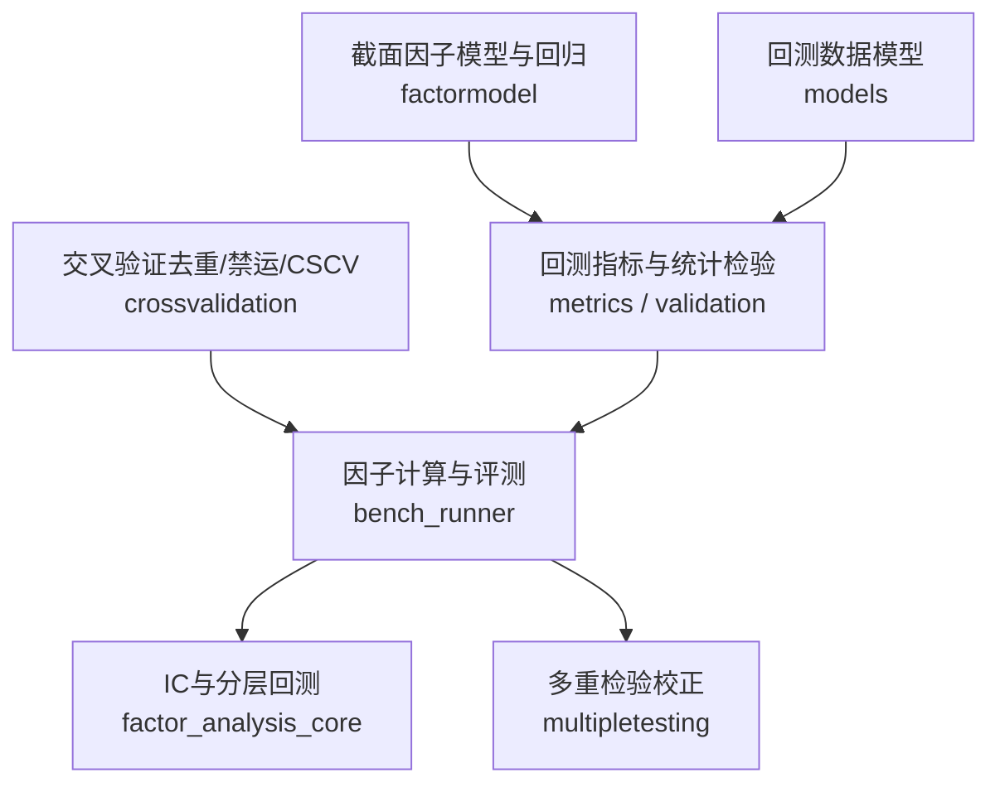
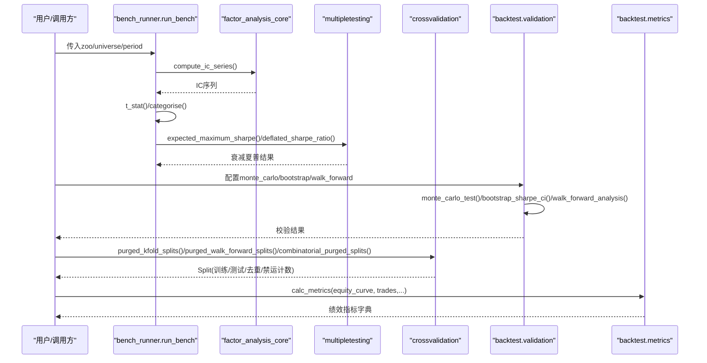
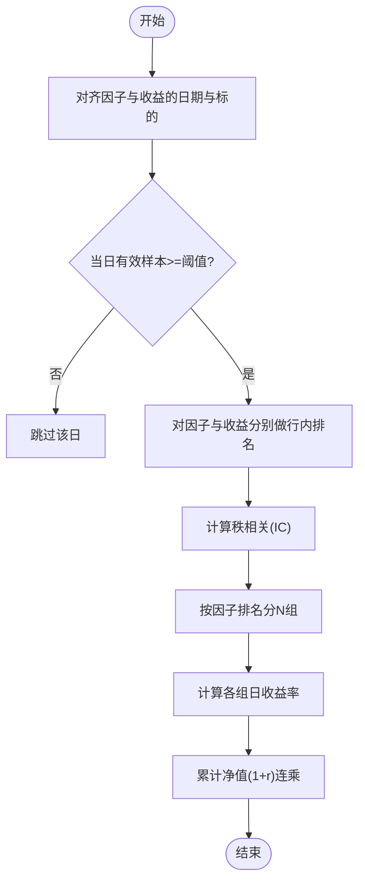
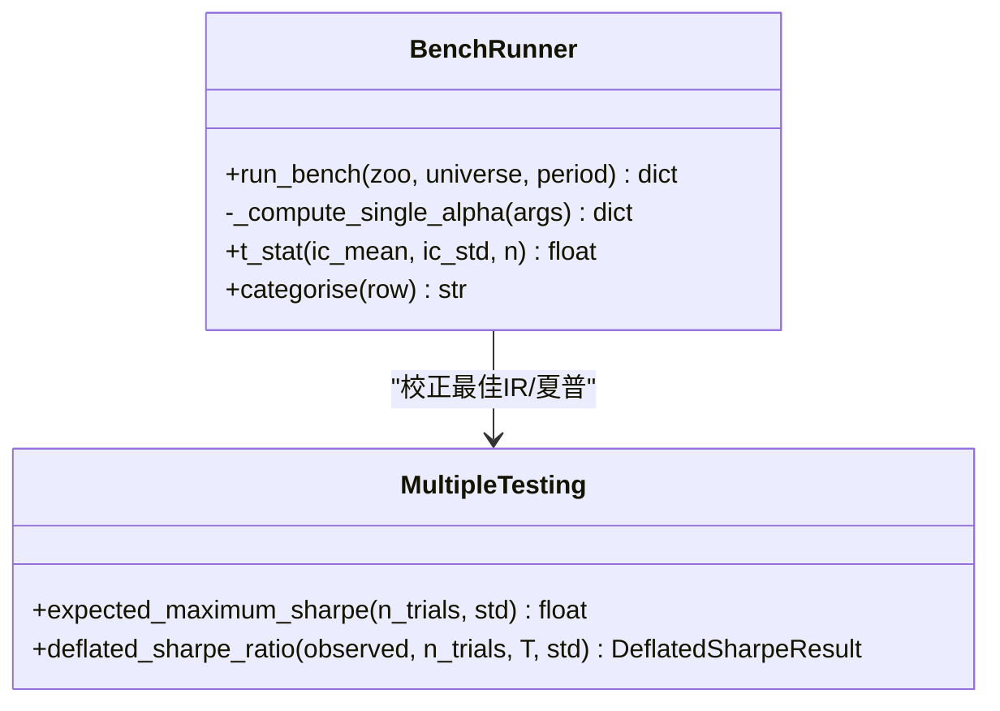
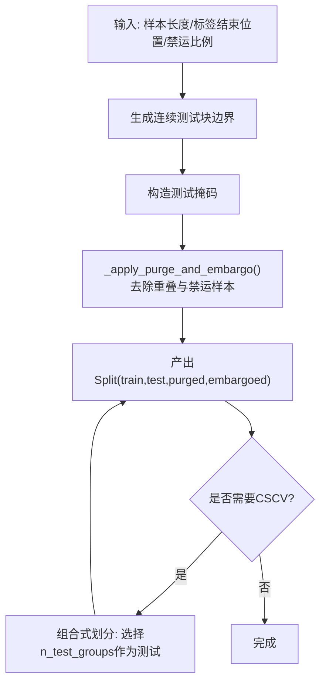
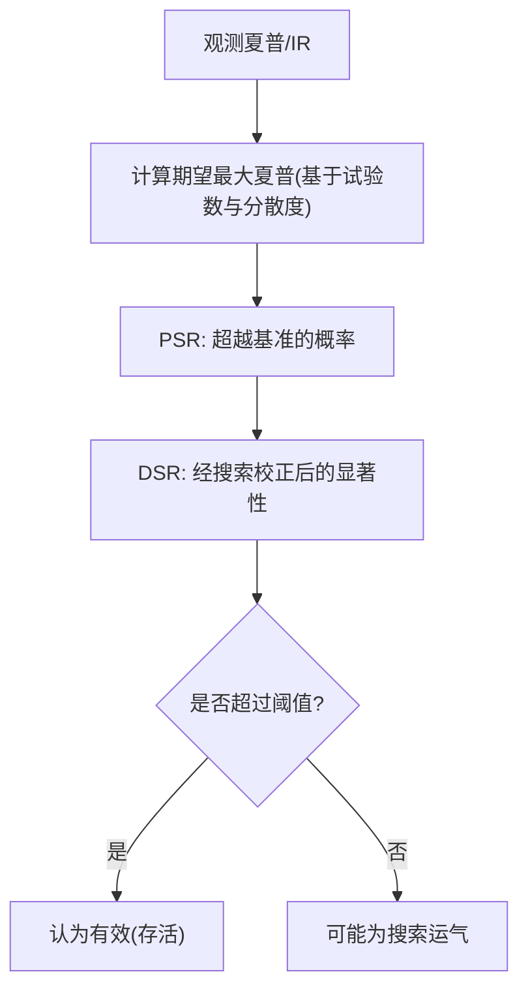
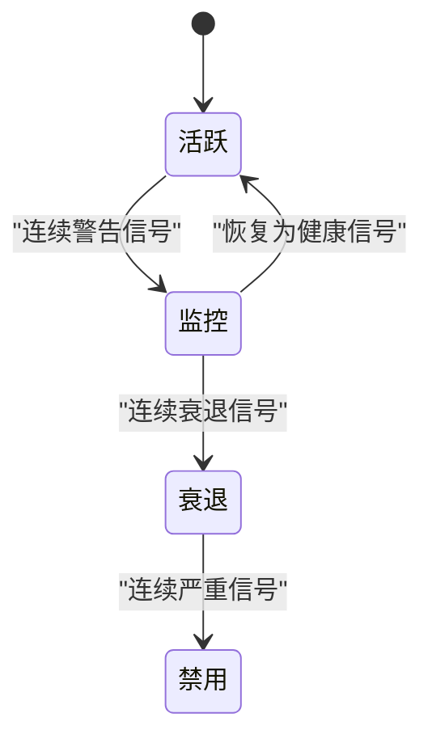
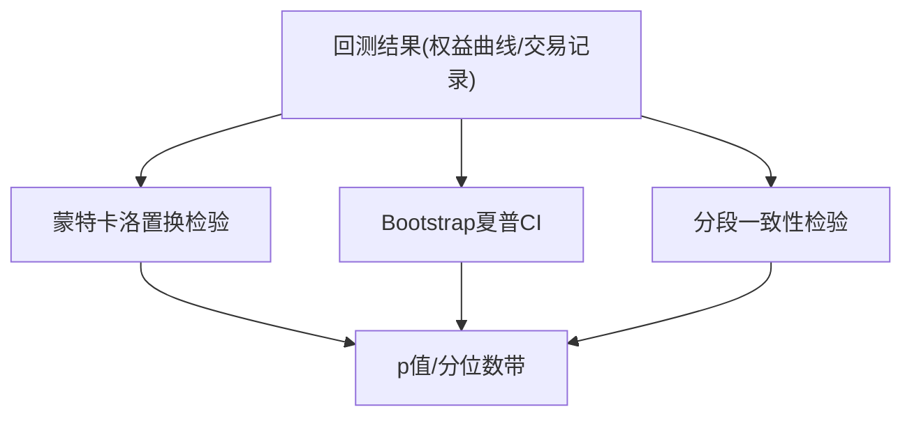
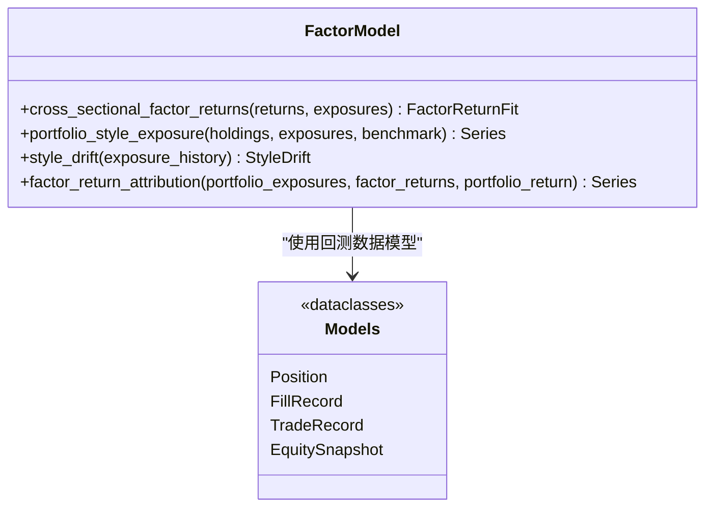
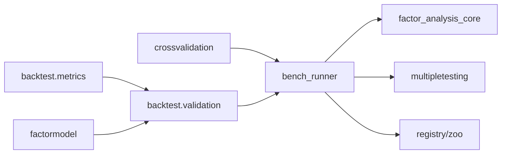

# 因子有效性检验

<cite>
**本文引用的文件**
- [agent/src/factors/factor_analysis_core.py](file://agent/src/factors/factor_analysis_core.py)
- [agent/src/factors/bench_runner.py](file://agent/src/factors/bench_runner.py)
- [agent/quantlib/crossvalidation.py](file://agent/quantlib/crossvalidation.py)
- [agent/quantlib/multipletesting.py](file://agent/quantlib/multipletesting.py)
- [agent/backtest/validation.py](file://agent/backtest/validation.py)
- [agent/backtest/metrics.py](file://agent/backtest/metrics.py)
- [agent/quantlib/factormodel.py](file://agent/quantlib/factormodel.py)
- [agent/backtest/models.py](file://agent/backtest/models.py)
</cite>

## 目录
1. [简介](#简介)
2. [项目结构](#项目结构)
3. [核心组件](#核心组件)
4. [架构总览](#架构总览)
5. [详细组件分析](#详细组件分析)
6. [依赖关系分析](#依赖关系分析)
7. [性能考量](#性能考量)
8. [故障排查指南](#故障排查指南)
9. [结论](#结论)
10. [附录](#附录)

## 简介
本文件面向因子研究全流程，系统化说明信息系数（IC）分析、分层回测、t检验等统计方法；介绍时间序列与分组交叉验证（含去重与禁运）、多重检验校正（PBO、BH-FDR、衰减夏普）；覆盖因子稳定性、衰减检测与过拟合识别；并提供从数据准备到结果解读的完整工作流，演示如何使用项目中的工具进行因子评估、基准对比与回归分析。

## 项目结构
围绕因子有效性检验的关键代码分布在以下模块：
- 因子IC与分层回测数学实现：factor_analysis_core
- 批量因子评测与多重检验校正：bench_runner、multipletesting
- 交叉验证（去重/禁运、组合式对称CV）：crossvalidation
- 回测统计与指标：metrics、validation
- 截面风格因子模型与回归：factormodel
- 回测数据模型：models

图表来源
- [agent/src/factors/bench_runner.py:137-409](file://agent/src/factors/bench_runner.py#L137-L409)
- [agent/src/factors/factor_analysis_core.py:8-102](file://agent/src/factors/factor_analysis_core.py#L8-L102)
- [agent/quantlib/multipletesting.py:321-372](file://agent/quantlib/multipletesting.py#L321-L372)
- [agent/quantlib/crossvalidation.py:209-411](file://agent/quantlib/crossvalidation.py#L209-L411)
- [agent/backtest/metrics.py:461-626](file://agent/backtest/metrics.py#L461-L626)
- [agent/backtest/validation.py:29-346](file://agent/backtest/validation.py#L29-L346)
- [agent/quantlib/factormodel.py:298-397](file://agent/quantlib/factormodel.py#L298-L397)
- [agent/backtest/models.py:13-118](file://agent/backtest/models.py#L13-L118)

章节来源
- [agent/src/factors/bench_runner.py:137-409](file://agent/src/factors/bench_runner.py#L137-L409)
- [agent/src/factors/factor_analysis_core.py:8-102](file://agent/src/factors/factor_analysis_core.py#L8-L102)
- [agent/quantlib/crossvalidation.py:209-411](file://agent/quantlib/crossvalidation.py#L209-L411)
- [agent/quantlib/multipletesting.py:321-372](file://agent/quantlib/multipletesting.py#L321-L372)
- [agent/backtest/validation.py:29-346](file://agent/backtest/validation.py#L29-L346)
- [agent/backtest/metrics.py:461-626](file://agent/backtest/metrics.py#L461-L626)
- [agent/quantlib/factormodel.py:298-397](file://agent/quantlib/factormodel.py#L298-L397)
- [agent/backtest/models.py:13-118](file://agent/backtest/models.py#L13-L118)

## 核心组件
- IC与分层回测：按日对因子值与未来收益做秩相关（Spearman），并基于分位数分组构建等权组合累计净值曲线。
- 批量因子评测：对多因子并行计算IC均值、标准差、IR、正IC比例与t统计量，并按主题聚合分类。
- 多重检验校正：提供概率性夏普（PSR）、衰减夏普（DSR，考虑搜索次数）、组合式对称交叉验证（CSCV）与BH-FDR控制。
- 交叉验证：提供去重+禁运的K折、滚动前向与组合式划分，支持边界泄漏检测。
- 回测统计与校验：蒙特卡洛置换检验、Bootstrap夏普置信区间、分段一致性检验。
- 截面因子模型：构建风格暴露、估计截面回归因子收益、归因与漂移分析。

章节来源
- [agent/src/factors/factor_analysis_core.py:8-102](file://agent/src/factors/factor_analysis_core.py#L8-L102)
- [agent/src/factors/bench_runner.py:59-119](file://agent/src/factors/bench_runner.py#L59-L119)
- [agent/quantlib/multipletesting.py:180-372](file://agent/quantlib/multipletesting.py#L180-L372)
- [agent/quantlib/crossvalidation.py:209-411](file://agent/quantlib/crossvalidation.py#L209-L411)
- [agent/backtest/validation.py:29-346](file://agent/backtest/validation.py#L29-L346)
- [agent/quantlib/factormodel.py:298-397](file://agent/quantlib/factormodel.py#L298-L397)

## 架构总览
下图展示因子有效性检验的整体流程：数据准备→因子计算→IC与分层回测→统计检验→多重检验校正→交叉验证→结果输出。

图表来源
- [agent/src/factors/bench_runner.py:137-409](file://agent/src/factors/bench_runner.py#L137-L409)
- [agent/src/factors/factor_analysis_core.py:8-102](file://agent/src/factors/factor_analysis_core.py#L8-L102)
- [agent/quantlib/multipletesting.py:321-372](file://agent/quantlib/multipletesting.py#L321-L372)
- [agent/quantlib/crossvalidation.py:209-411](file://agent/quantlib/crossvalidation.py#L209-L411)
- [agent/backtest/validation.py:29-346](file://agent/backtest/validation.py#L29-L346)
- [agent/backtest/metrics.py:461-626](file://agent/backtest/metrics.py#L461-L626)

## 详细组件分析

### 信息系数（IC）与分层回测
- IC计算：对每日因子与未来收益做秩相关（Spearman），仅保留当日有效样本数达到阈值的日期，得到IC时序。
- 分层回测：每日按因子排名将标的分为N组，等权持有，计算各组累计净值。

图表来源
- [agent/src/factors/factor_analysis_core.py:8-102](file://agent/src/factors/factor_analysis_core.py#L8-L102)

章节来源
- [agent/src/factors/factor_analysis_core.py:8-102](file://agent/src/factors/factor_analysis_core.py#L8-L102)

### 批量因子评测与t检验
- 对每个因子计算IC均值、标准差、IR、正IC比例与t统计量，并进行“存活/反向/无效”分类。
- 使用预期最大夏普与衰减夏普对“最佳因子”进行多重检验校正，避免数据挖掘偏差。

图表来源
- [agent/src/factors/bench_runner.py:59-119](file://agent/src/factors/bench_runner.py#L59-L119)
- [agent/quantlib/multipletesting.py:281-372](file://agent/quantlib/multipletesting.py#L281-L372)

章节来源
- [agent/src/factors/bench_runner.py:59-119](file://agent/src/factors/bench_runner.py#L59-L119)
- [agent/quantlib/multipletesting.py:281-372](file://agent/quantlib/multipletesting.py#L281-L372)

### 交叉验证策略（时间序列与分组）
- 去重+禁运K折：将标签窗口视为闭区间，训练集剔除与测试区间重叠的样本，并在测试后禁运一段以缓解自相关泄露。
- 滚动前向：训练集严格在测试之前，适合模拟真实时序运行。
- 组合式对称CV（CSCV）：将样本划分为若干块，枚举不同训练/测试组合，评估选择规则是否优于随机。

图表来源
- [agent/quantlib/crossvalidation.py:162-206](file://agent/quantlib/crossvalidation.py#L162-L206)
- [agent/quantlib/crossvalidation.py:209-411](file://agent/quantlib/crossvalidation.py#L209-L411)

章节来源
- [agent/quantlib/crossvalidation.py:162-206](file://agent/quantlib/crossvalidation.py#L162-L206)
- [agent/quantlib/crossvalidation.py:209-411](file://agent/quantlib/crossvalidation.py#L209-L411)

### 多重检验校正技术
- 概率性夏普（PSR）：考虑偏度与峰度的单策略显著性。
- 衰减夏普（DSR）：将基准提升到“N次搜索下的期望最大夏普”，再评估观察值是否显著。
- CSCV：通过大量训练/测试组合估计回测过拟合概率（PBO）。
- BH-FDR：控制错误发现率，适用于“哪些因子真实有效”的多假设场景。

图表来源
- [agent/quantlib/multipletesting.py:217-372](file://agent/quantlib/multipletesting.py#L217-L372)

章节来源
- [agent/quantlib/multipletesting.py:217-372](file://agent/quantlib/multipletesting.py#L217-L372)

### 因子稳定性分析与衰减检测
- 稳定性：通过滚动窗口或子期（牛/熊/震荡）分别计算IC/IR，观察跨周期稳定性。
- 衰减检测：跟踪IC比率、滚动IR、正IC比例与滚动夏普，结合状态机判定健康/警告/衰退/禁用。

图表来源
- [agent/src/tools/sdm_decay_scan_tool.py:112-146](file://agent/src/tools/sdm_decay_scan_tool.py#L112-L146)

章节来源
- [agent/src/tools/sdm_decay_scan_tool.py:112-146](file://agent/src/tools/sdm_decay_scan_tool.py#L112-L146)

### 过拟合识别方法
- 蒙特卡洛置换检验：打乱交易顺序，比较实际夏普/最大回撤是否在随机路径中显著。
- Bootstrap夏普置信区间：重采样估计夏普分布与置信区间。
- 分段一致性检验：将回测切分为多个窗口，检查收益/夏普/胜率的一致性。
- CSCV-PBO：若选择规则导致样本内最优在样本外排名低于中位数，则存在过拟合风险。

图表来源
- [agent/backtest/validation.py:29-346](file://agent/backtest/validation.py#L29-L346)
- [agent/quantlib/multipletesting.py:445-569](file://agent/quantlib/multipletesting.py#L445-L569)

章节来源
- [agent/backtest/validation.py:29-346](file://agent/backtest/validation.py#L29-L346)
- [agent/quantlib/multipletesting.py:445-569](file://agent/quantlib/multipletesting.py#L445-L569)

### 回归分析与风格归因
- 截面回归：用前一日的风格暴露解释当日资产收益，得到因子收益与t统计量。
- 组合暴露与归因：将持仓权重与暴露矩阵相乘得到组合暴露，并与因子收益相乘分解组合收益。
- 漂移分析：追踪组合暴露随时间的变化幅度与方向。

图表来源
- [agent/quantlib/factormodel.py:298-516](file://agent/quantlib/factormodel.py#L298-L516)
- [agent/backtest/models.py:13-118](file://agent/backtest/models.py#L13-L118)

章节来源
- [agent/quantlib/factormodel.py:298-516](file://agent/quantlib/factormodel.py#L298-L516)
- [agent/backtest/models.py:13-118](file://agent/backtest/models.py#L13-L118)

## 依赖关系分析
- bench_runner依赖factor_analysis_core进行IC计算，并依赖multipletesting进行多重检验校正。
- crossvalidation为任何需要无偏评估的流程提供分割器，可与回测/因子流程组合使用。
- backtest.validation与metrics提供回测层面的统计与指标，支撑因子有效性判断。
- factormodel提供截面回归与归因能力，用于解释因子暴露与收益来源。

图表来源
- [agent/src/factors/bench_runner.py:137-409](file://agent/src/factors/bench_runner.py#L137-L409)
- [agent/quantlib/crossvalidation.py:209-411](file://agent/quantlib/crossvalidation.py#L209-L411)
- [agent/backtest/validation.py:29-346](file://agent/backtest/validation.py#L29-L346)
- [agent/backtest/metrics.py:461-626](file://agent/backtest/metrics.py#L461-L626)
- [agent/quantlib/factormodel.py:298-516](file://agent/quantlib/factormodel.py#L298-L516)

章节来源
- [agent/src/factors/bench_runner.py:137-409](file://agent/src/factors/bench_runner.py#L137-L409)
- [agent/quantlib/crossvalidation.py:209-411](file://agent/quantlib/crossvalidation.py#L209-L411)
- [agent/backtest/validation.py:29-346](file://agent/backtest/validation.py#L29-L346)
- [agent/backtest/metrics.py:461-626](file://agent/backtest/metrics.py#L461-L626)
- [agent/quantlib/factormodel.py:298-516](file://agent/quantlib/factormodel.py#L298-L516)

## 性能考量
- 并行化：bench_runner支持进程池并行计算多因子IC，减少端到端耗时。
- 向量运算：IC计算采用向量化秩相关，提升大规模横截面效率。
- 内存控制：蒙特卡洛路径矩阵仅在规模可控时保存，避免过大JSON/内存占用。
- 年化与频率：metrics根据数据源与频率自动选择年化因子，保证指标可比性。

章节来源
- [agent/src/factors/bench_runner.py:223-267](file://agent/src/factors/bench_runner.py#L223-L267)
- [agent/src/factors/factor_analysis_core.py:8-47](file://agent/src/factors/factor_analysis_core.py#L8-L47)
- [agent/backtest/validation.py:60-113](file://agent/backtest/validation.py#L60-L113)
- [agent/backtest/metrics.py:153-170](file://agent/backtest/metrics.py#L153-L170)

## 故障排查指南
- IC为空或极短：检查因子与收益的公共日期/标的交集，确保每日内有足够有效样本。
- 分层回测分组不足：当同一天有效标的少于分组数时会跳过；可调整分组数或放宽数据质量。
- 交叉验证报错：确认标签结束时间合法且与样本长度一致；检查禁运比例范围。
- 多重检验失败：确保观测数满足最小要求；注意使用非超额峰度；夏普需为“每期”而非年化。
- 回测指标异常：价格序列出现零或负值会导致收益率定义问题；metrics已做安全处理但需留意日志。

章节来源
- [agent/src/factors/factor_analysis_core.py:22-47](file://agent/src/factors/factor_analysis_core.py#L22-L47)
- [agent/src/factors/factor_analysis_core.py:63-102](file://agent/src/factors/factor_analysis_core.py#L63-L102)
- [agent/quantlib/crossvalidation.py:109-159](file://agent/quantlib/crossvalidation.py#L109-L159)
- [agent/quantlib/multipletesting.py:217-278](file://agent/quantlib/multipletesting.py#L217-L278)
- [agent/backtest/metrics.py:245-302](file://agent/backtest/metrics.py#L245-L302)

## 结论
本项目提供了完整的因子有效性检验工具箱：从IC与分层回测、统计检验、多重检验校正到交叉验证与回归归因。建议在实际研究中遵循“数据清洗→IC/分层→统计检验→多重校正→交叉验证→回归归因”的闭环流程，并结合衰减监测与过拟合诊断，确保因子稳健性与可部署性。

## 附录
- 推荐工作流
  - 数据准备：统一日期与标的索引，计算未来收益，处理缺失与异常值。
  - 因子计算：注册因子并计算因子矩阵；必要时标准化与缩尾。
  - IC与分层：计算IC序列与分组净值，评估单调性与多空收益。
  - 统计检验：t检验、蒙特卡洛、Bootstrap、分段一致性。
  - 多重校正：计算衰减夏普、PBO、BH-FDR，筛选稳健因子。
  - 交叉验证：使用去重+禁运K折或滚动前向评估泛化能力。
  - 回归归因：构建风格暴露，估计因子收益，进行组合归因与漂移分析。
  - 衰减监测：跟踪IC比率与滚动IR，触发状态迁移。

- 关键函数参考路径
  - IC与分层：[agent/src/factors/factor_analysis_core.py:8-102](file://agent/src/factors/factor_analysis_core.py#L8-L102)
  - 批量评测与校正：[agent/src/factors/bench_runner.py:137-409](file://agent/src/factors/bench_runner.py#L137-L409)、[agent/quantlib/multipletesting.py:217-372](file://agent/quantlib/multipletesting.py#L217-L372)
  - 交叉验证：[agent/quantlib/crossvalidation.py:209-411](file://agent/quantlib/crossvalidation.py#L209-L411)
  - 回测统计：[agent/backtest/validation.py:29-346](file://agent/backtest/validation.py#L29-L346)、[agent/backtest/metrics.py:461-626](file://agent/backtest/metrics.py#L461-L626)
  - 回归归因：[agent/quantlib/factormodel.py:298-516](file://agent/quantlib/factormodel.py#L298-L516)