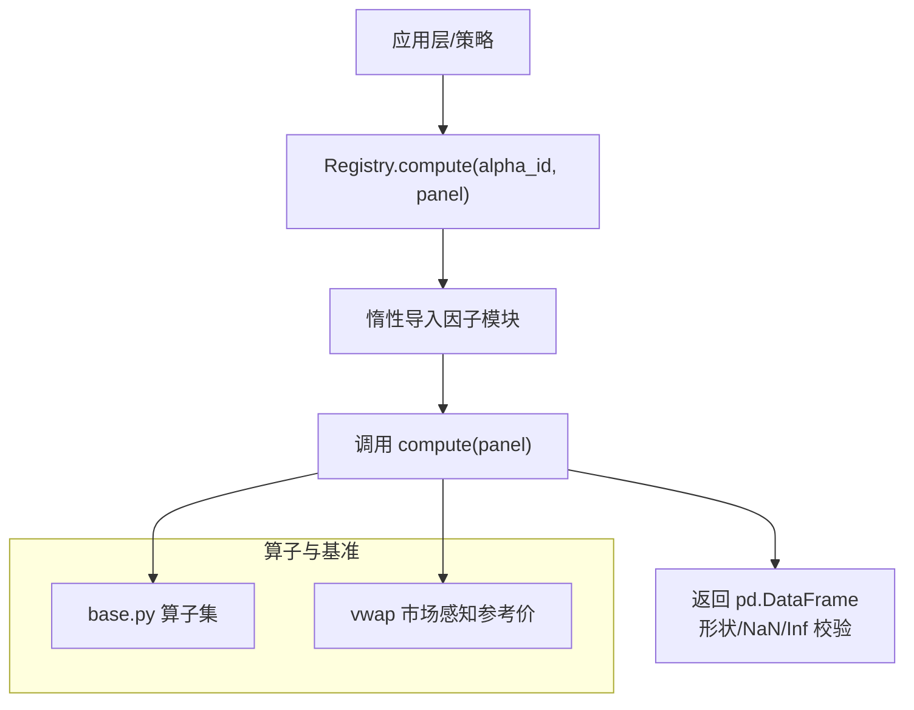
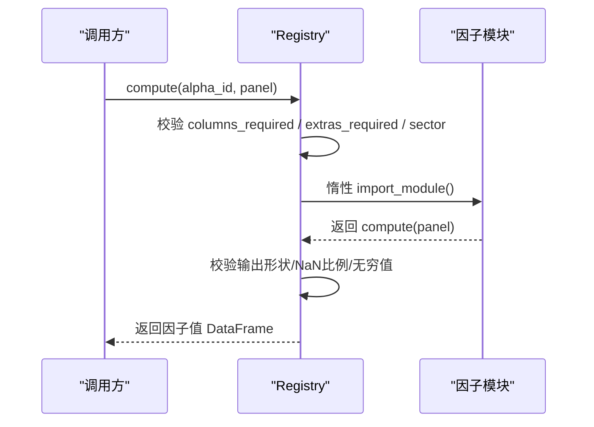
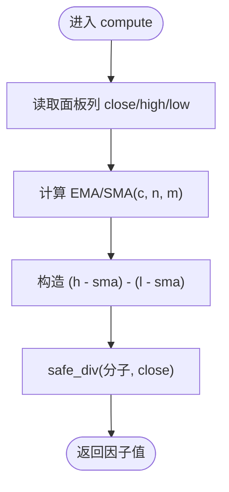
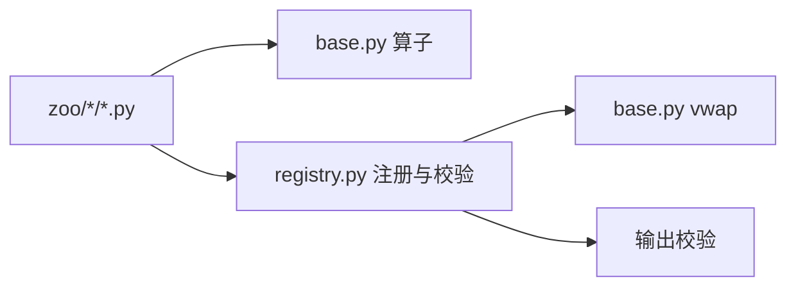

# 因子构建方法

<cite>
**本文引用的文件**
- [agent/src/factors/__init__.py](file://agent/src/factors/__init__.py)
- [agent/src/factors/base.py](file://agent/src/factors/base.py)
- [agent/src/factors/registry.py](file://agent/src/factors/registry.py)
- [agent/src/factors/zoo/gtja191/alpha_158.py](file://agent/src/factors/zoo/gtja191/alpha_158.py)
- [agent/src/factors/zoo/gtja191/alpha_181.py](file://agent/src/factors/zoo/gtja191/alpha_181.py)
</cite>

## 目录
1. [简介](#简介)
2. [项目结构](#项目结构)
3. [核心组件](#核心组件)
4. [架构总览](#架构总览)
5. [详细组件分析](#详细组件分析)
6. [依赖关系分析](#依赖关系分析)
7. [性能考量](#性能考量)
8. [故障排查指南](#故障排查指南)
9. [结论](#结论)
10. [附录](#附录)

## 简介
本指南面向量化研究员与工程师，系统化阐述如何在本仓库中构建、注册与运行因子。内容覆盖：
- 技术指标因子（动量、波动率、流动性等）
- 基本面因子（估值、成长、质量等）
- 另类数据因子的接入方式
- 经典因子库实现细节：Alpha101、GTJA191、Qlib158
- 自定义因子开发模板（数据处理、计算逻辑、结果验证）
- 因子中性化、标准化与去极值的技术实现路径

本仓库通过“算子基类 + 因子注册表 + 多因子库”的架构，提供统一的面板数据接口、严格的元数据校验与高性能的时间序列算子，便于快速复用与扩展。

## 项目结构
因子相关代码集中在 agent/src/factors 目录下，采用分层组织：
- base.py：定义统一的宽面板输入输出契约、时间序列算子（滚动均值、标准差、相关性、差分、衰减加权等）、横截面处理（排名、z-score、缩放）以及市场感知的参考价格 vwap。
- registry.py：扫描 zoo 子目录中的因子模块，静态解析每个因子的 __alpha_meta__ 元数据，惰性加载并执行 compute(panel)，并对输出进行形状、无穷值与缺失值比例等一致性校验。
- zoo/*：三大经典因子库（alpha101、gtja191、qlib158）及学术/基本面因子集合，每个因子以独立 .py 文件暴露 compute(panel) 与 __alpha_meta__。
- factors/__init__.py：对外暴露常用算子与基础类型，便于上层工具直接引用。

图表来源
- [agent/src/factors/registry.py:321-397](file://agent/src/factors/registry.py#L321-L397)
- [agent/src/factors/base.py:62-356](file://agent/src/factors/base.py#L62-L356)

章节来源
- [agent/src/factors/__init__.py:1-49](file://agent/src/factors/__init__.py#L1-L49)
- [agent/src/factors/base.py:1-356](file://agent/src/factors/base.py#L1-L356)
- [agent/src/factors/registry.py:1-454](file://agent/src/factors/registry.py#L1-L454)

## 核心组件
- 面板数据契约：所有算子与因子均以宽面板 DataFrame 为输入输出，index 为交易日期，columns 为标的代码；保持 NaN 传播，禁止产生 +/- inf。
- 时间序列算子：ts_mean、ts_std、ts_max、ts_min、ts_corr、ts_cov、delta、decay_linear、ts_argmax/ts_argmin、ts_rank 等，均支持窗口参数与最小周期约束，保证因果性（无未来信息泄露）。
- 横截面算子：rank（横截面百分位排名）、zscore（横截面 z-score）、scale（按行 L1 归一化），用于因子标准化与可比性。
- 市场感知参考价：vwap 根据市场类型选择不同公式（A股金额/成交量换算、美股/港股/期货典型价、加密货币优先使用面板提供的 vwap）。
- 注册表：自动发现 zoo 下因子，AST 静态解析 __alpha_meta__，惰性加载 compute，严格校验输出。

章节来源
- [agent/src/factors/base.py:27-356](file://agent/src/factors/base.py#L27-L356)
- [agent/src/factors/registry.py:87-125](file://agent/src/factors/registry.py#L87-L125)
- [agent/src/factors/registry.py:219-260](file://agent/src/factors/registry.py#L219-L260)
- [agent/src/factors/registry.py:321-397](file://agent/src/factors/registry.py#L321-L397)

## 架构总览
下图展示从注册到计算的完整流程，包括元数据校验、列依赖检查、惰性加载与输出校验。

图表来源
- [agent/src/factors/registry.py:321-397](file://agent/src/factors/registry.py#L321-L397)

## 详细组件分析

### 技术指标因子：波动率与动量示例（GTJA191）
- GTJA191_158：基于短期移动平均的波动区间比率，使用收盘价平滑后构造高低差相对收盘价的指标。
- GTJA191_181：基于收益率与基准偏离的高阶矩统计，衡量超额收益分布特征。

图表来源
- [agent/src/factors/zoo/gtja191/alpha_158.py:53-70](file://agent/src/factors/zoo/gtja191/alpha_158.py#L53-L70)
- [agent/src/factors/base.py:350-362](file://agent/src/factors/base.py#L350-L362)

章节来源
- [agent/src/factors/zoo/gtja191/alpha_158.py:1-71](file://agent/src/factors/zoo/gtja191/alpha_158.py#L1-L71)
- [agent/src/factors/zoo/gtja191/alpha_181.py:1-57](file://agent/src/factors/zoo/gtja191/alpha_181.py#L1-L57)

### Alpha101 与 Qlib158 因子库概览
- Alpha101：包含动量、反转、波动率、流动性等多主题因子，统一通过 base 算子组合实现，遵循相同的 compute(panel) 契约与 __alpha_meta__ 元数据规范。
- Qlib158：涵盖滚动统计、分位数、相关性、波动率、量价形态等广泛因子族，同样以模块化方式组织，便于批量回测与比较。

说明：具体因子实现位于对应 zoo 子目录的 alpha_*.py 或 beta/cntd/corr 等命名文件中，均遵循注册表约定的元数据与计算接口。

章节来源
- [agent/src/factors/__init__.py:1-49](file://agent/src/factors/__init__.py#L1-L49)
- [agent/src/factors/registry.py:1-20](file://agent/src/factors/registry.py#L1-L20)

### 基本面因子与另类数据接入
- 面板列约定：价格列（open/high/low/close/volume/vwap/amount）与基本面列（以 fund: 前缀声明，如 fund:pe、fund:roe 等）。注册表在元数据校验阶段会拒绝未知列名，确保数据源对齐。
- 数据源集成：通过外部 loader 将财务与另类数据填充为面板列，再由因子 compute 消费。因子本身不关心数据获取细节，仅依赖面板列存在性与语义。

章节来源
- [agent/src/factors/registry.py:62-84](file://agent/src/factors/registry.py#L62-L84)
- [agent/src/factors/registry.py:105-125](file://agent/src/factors/registry.py#L105-L125)

### 自定义因子开发模板
建议遵循以下模板步骤：
- 新建因子模块：在 zoo/<zoo>/alpha_xxx.py 中定义 compute(panel) 与 __alpha_meta__。
- 声明元数据：id、theme、formula_latex、columns_required、extras_required、universe、frequency、decay_horizon、min_warmup_bars、notes。
- 使用 base 算子：优先使用 ts_mean/ts_std/ts_corr/delta/decay_linear/rank/safe_div 等，避免手写易错逻辑。
- 遵守 NaN 与 Inf 规则：不得 fillna(0) 掩盖缺失；不得产生 +/- inf。
- 注册与测试：通过 Registry.list/get/compute 验证可用性；使用健康检查 health() 与导出清单 export_manifest()。

章节来源
- [agent/src/factors/registry.py:87-125](file://agent/src/factors/registry.py#L87-L125)
- [agent/src/factors/registry.py:219-260](file://agent/src/factors/registry.py#L219-L260)
- [agent/src/factors/registry.py:321-397](file://agent/src/factors/registry.py#L321-L397)

### 因子中性化、标准化与去极值
- 标准化：使用横截面 zscore 将因子转换为同尺度；或使用 scale 做 L1 归一化，便于组合权重分配。
- 中性化：在横截面上对行业/市值等风格因子回归残差，或在分组内 rank 消除层级差异。可结合 ts_rank 与分组统计实现。
- 去极值：对极端值进行 Winsorize 或缩尾处理，可在横截面维度对异常样本裁剪后再标准化。
- 注意：上述处理应在因子计算之后、组合之前进行，且需保证时间因果性（仅使用历史窗口）。

章节来源
- [agent/src/factors/base.py:79-107](file://agent/src/factors/base.py#L79-L107)
- [agent/src/factors/base.py:110-161](file://agent/src/factors/base.py#L110-L161)

## 依赖关系分析
- 因子模块依赖 base 算子：所有 zoo 因子通过 base 提供的函数组合完成计算，降低重复实现与错误概率。
- 注册表依赖 AST 静态解析：无需导入因子即可读取 __alpha_meta__，提升启动效率与安全性。
- 市场感知依赖 vwap：不同市场采用不同参考价公式，确保跨市场因子可比性。

图表来源
- [agent/src/factors/base.py:365-399](file://agent/src/factors/base.py#L365-L399)
- [agent/src/factors/registry.py:147-184](file://agent/src/factors/registry.py#L147-L184)
- [agent/src/factors/registry.py:401-422](file://agent/src/factors/registry.py#L401-L422)

章节来源
- [agent/src/factors/base.py:27-356](file://agent/src/factors/base.py#L27-L356)
- [agent/src/factors/registry.py:147-184](file://agent/src/factors/registry.py#L147-L184)
- [agent/src/factors/registry.py:401-422](file://agent/src/factors/registry.py#L401-L422)

## 性能考量
- 向量化与滑动窗口：ts_rank、decay_linear、ts_argmax/ts_argmin 使用 numpy 滑动窗口视图与 einsum，显著加速滚动计算。
- 可选瓶颈优化：当可用时，使用 bottleneck 的 move_argmax/move_argmin 进一步提速。
- 最小周期与预热：所有滚动函数设置 min_periods，确保早期数据 NaN 正确传播，避免虚假信号。
- 惰性加载：注册表仅在首次 compute 时导入因子模块，减少冷启动开销。

章节来源
- [agent/src/factors/base.py:110-161](file://agent/src/factors/base.py#L110-L161)
- [agent/src/factors/base.py:238-269](file://agent/src/factors/base.py#L238-L269)
- [agent/src/factors/base.py:282-313](file://agent/src/factors/base.py#L282-L313)
- [agent/src/factors/registry.py:357-374](file://agent/src/factors/registry.py#L357-L374)

## 故障排查指南
- 缺少必需列：若面板未提供 columns_required 或 extras_required，compute 将抛出 SkipAlpha，需在数据准备阶段补齐。
- 输出非法值：若输出含 +/- inf 或 NaN 比例过高（>95%），注册表将拒绝并提示原因，需检查除零、常数序列与窗口长度。
- 形状不一致：输出必须与 close 面板同形，否则报错，需核对 index/columns 对齐。
- 元数据错误：__alpha_meta__ 字段不符合 schema 或列名不在允许集合（价格列或 fund:*），AST 解析或 Pydantic 校验将失败。

章节来源
- [agent/src/factors/registry.py:321-397](file://agent/src/factors/registry.py#L321-L397)
- [agent/src/factors/registry.py:87-125](file://agent/src/factors/registry.py#L87-L125)

## 结论
本仓库提供了统一、可扩展且高性能的因子构建框架。通过标准化的面板契约、丰富的时间序列与横截面算子、严格的元数据校验与惰性加载机制，用户可以快速实现与集成 Alpha101、GTJA191、Qlib158 等经典因子，并安全地扩展基本面与另类数据因子。建议在开发中遵循 NaN 传播与无未来信息原则，配合横截面标准化与中性化处理，以获得稳健的因子表现。

## 附录
- 常用算子速查：
  - 时间序列：ts_mean、ts_std、ts_max、ts_min、ts_corr、ts_cov、delta、decay_linear、ts_argmax/ts_argmin、ts_rank
  - 横截面：rank、zscore、scale
  - 市场参考价：vwap（按市场选择公式）
- 因子元数据关键字段：id、theme、formula_latex、columns_required、extras_required、universe、frequency、decay_horizon、min_warmup_bars、notes

章节来源
- [agent/src/factors/__init__.py:6-48](file://agent/src/factors/__init__.py#L6-L48)
- [agent/src/factors/base.py:62-356](file://agent/src/factors/base.py#L62-L356)
- [agent/src/factors/registry.py:87-125](file://agent/src/factors/registry.py#L87-L125)