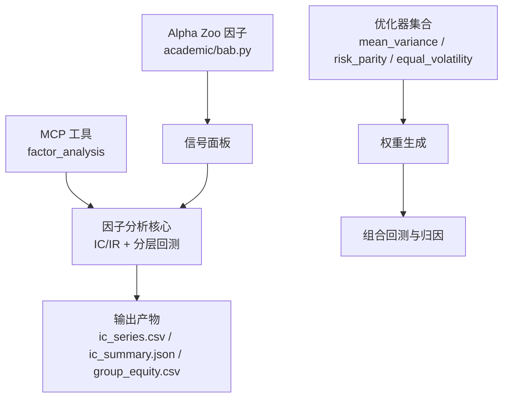
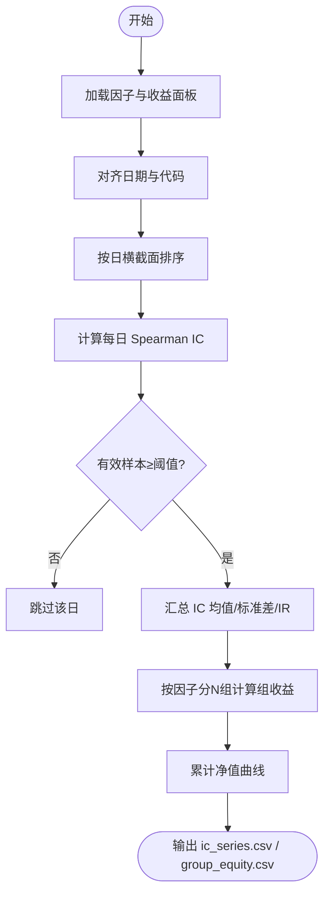
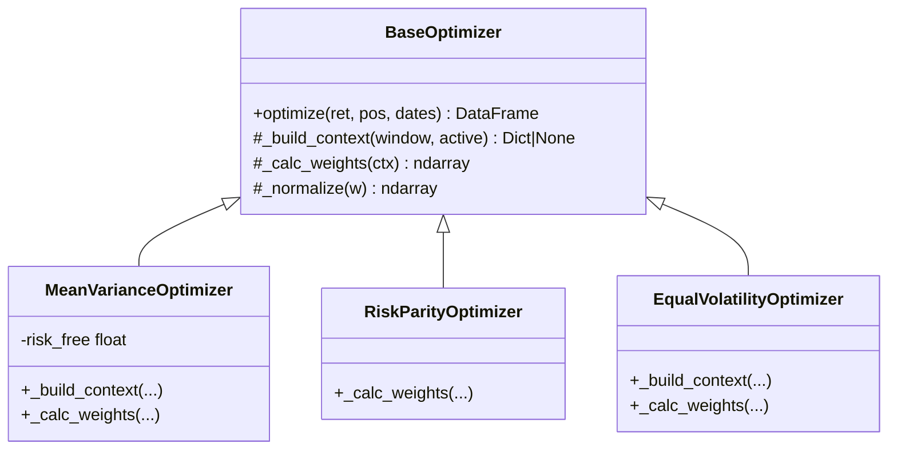
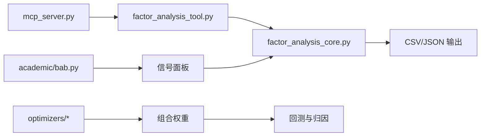

# 因子模型开发

<cite>
**本文引用的文件**
- [README.md](file://README.md)
- [factor_analysis_tool.py](file://agent/src/tools/factor_analysis_tool.py)
- [factor_analysis_core.py](file://agent/src/factors/factor_analysis_core.py)
- [mcp_server.py](file://agent/mcp_server.py)
- [factor_research_committee.yaml](file://agent/src/swarm/presets/factor_research_committee.yaml)
- [quant_strategy_desk.yaml](file://agent/src/swarm/presets/quant_strategy_desk.yaml)
- [SKILL.md（因子研究）](file://agent/src/skills/factor-research/SKILL.md)
- [SKILL.md（资产配置）](file://agent/src/skills/asset-allocation/SKILL.md)
- [mean_variance.py](file://agent/backtest/optimizers/mean_variance.py)
- [risk_parity.py](file://agent/backtest/optimizers/risk_parity.py)
- [equal_volatility.py](file://agent/backtest/optimizers/equal_volatility.py)
- [crossvalidation.py](file://agent/src/quantlib/crossvalidation.py)
- [multipletesting.py](file://agent/src/quantlib/multipletesting.py)
- [bab.py](file://agent/src/factors/zoo/academic/bab.py)
</cite>

## 目录
1. [简介](#简介)
2. [项目结构](#项目结构)
3. [核心组件](#核心组件)
4. [架构总览](#架构总览)
5. [详细组件分析](#详细组件分析)
6. [依赖关系分析](#依赖关系分析)
7. [性能考量](#性能考量)
8. [故障排查指南](#故障排查指南)
9. [结论](#结论)
10. [附录](#附录)

## 简介
本指南面向因子研究与策略落地全流程，覆盖因子构建、预处理、有效性检验、组合优化与衰减分析，并给出交叉验证、多重检验校正与过拟合防范的实践方法。结合仓库中的因子分析工具、Alpha Zoo 学术因子、回测优化器与统计库，提供从数据准备到策略部署的完整工作流与可操作案例。

## 项目结构
围绕因子研究的关键路径包括：
- 因子计算与评估：通过 MCP 暴露 factor_analysis 工具，调用核心 IC/IR 与分层回测实现。
- 因子库与模板：Alpha Zoo 提供学术因子示例；技能文档定义标准化流程与阈值。
- 组合优化：内置均值方差、风险平价、等波动率等优化器。
- 统计与稳健性：提供去重交叉验证与多重检验控制工具。



**图表来源**
- [mcp_server.py:823-850](file://agent/mcp_server.py#L823-L850)
- [factor_analysis_core.py:8-47](file://agent/src/factors/factor_analysis_core.py#L8-L47)
- [factor_analysis_core.py:50-102](file://agent/src/factors/factor_analysis_core.py#L50-L102)
- [bab.py:61-84](file://agent/src/factors/zoo/academic/bab.py#L61-L84)
- [mean_variance.py:11-56](file://agent/backtest/optimizers/mean_variance.py#L11-L56)
- [risk_parity.py:11-49](file://agent/backtest/optimizers/risk_parity.py#L11-L49)
- [equal_volatility.py:14-37](file://agent/backtest/optimizers/equal_volatility.py#L14-L37)

**章节来源**
- [README.md:1-166](file://README.md#L1-L166)

## 核心组件
- 因子分析工具：封装 CSV 输入、IC/IR 计算、分层回测与报告输出，便于在 CLI/MCP/Web 中复用。
- 因子分析核心：向量化 Spearman IC、按日分组与累计净值计算，保证最小样本量与缺失值处理。
- Alpha Zoo 因子：以 bab.py 为代表，展示如何基于 OHLCV 构造横截面信号并标准化。
- 组合优化器：均值方差、风险平价、等波动率，统一接口与约束处理。
- 统计工具：去重交叉验证与多重检验校正，降低过拟合与假阳性。

**章节来源**
- [factor_analysis_tool.py:19-40](file://agent/src/tools/factor_analysis_tool.py#L19-L40)
- [factor_analysis_core.py:8-47](file://agent/src/factors/factor_analysis_core.py#L8-L47)
- [factor_analysis_core.py:50-102](file://agent/src/factors/factor_analysis_core.py#L50-L102)
- [bab.py:61-84](file://agent/src/factors/zoo/academic/bab.py#L61-L84)
- [mean_variance.py:11-56](file://agent/backtest/optimizers/mean_variance.py#L11-L56)
- [risk_parity.py:11-49](file://agent/backtest/optimizers/risk_parity.py#L11-L49)
- [equal_volatility.py:14-37](file://agent/backtest/optimizers/equal_volatility.py#L14-L37)
- [crossvalidation.py:1-26](file://agent/src/quantlib/crossvalidation.py#L1-L26)
- [multipletesting.py:127-157](file://agent/src/quantlib/multipletesting.py#L127-L157)

## 架构总览
下图展示了从因子计算到组合优化的端到端流程，以及 MCP 工具作为入口的统一接入方式。

```mermaid
sequenceDiagram
participant U as "用户/脚本"
participant MCP as "MCP 服务"
participant FA as "因子分析工具"
participant CORE as "因子分析核心"
participant OPT as "组合优化器"
participant OUT as "输出产物"
U->>MCP : 调用 factor_analysis(factor_csv, return_csv, output_dir, n_groups)
MCP->>FA : 执行 run_factor_analysis(...)
FA->>CORE : compute_ic_series()
CORE-->>FA : IC 序列
FA->>CORE : compute_group_equity(n_groups)
CORE-->>FA : 分层净值曲线
FA->>OUT : 写入 ic_series.csv / ic_summary.json / group_equity.csv
U->>OPT : 传入收益矩阵与目标函数
OPT-->>U : 权重序列与回测结果
```

**图表来源**
- [mcp_server.py:823-850](file://agent/mcp_server.py#L823-L850)
- [factor_analysis_tool.py:19-40](file://agent/src/tools/factor_analysis_tool.py#L19-L40)
- [factor_analysis_core.py:8-47](file://agent/src/factors/factor_analysis_core.py#L8-L47)
- [factor_analysis_core.py:50-102](file://agent/src/factors/factor_analysis_core.py#L50-L102)
- [mean_variance.py:67-77](file://agent/backtest/optimizers/mean_variance.py#L67-L77)
- [risk_parity.py:52-59](file://agent/backtest/optimizers/risk_parity.py#L52-L59)
- [equal_volatility.py:40-47](file://agent/backtest/optimizers/equal_volatility.py#L40-L47)

## 详细组件分析

### 因子构建方法
- 技术指标因子：基于价格序列滚动统计（如收益率、波动率、动量），可通过 Alpha Zoo 或自定义逻辑实现。
- 基本面因子：使用 PIT 安全对齐的财务指标，避免未来信息泄露。
- 另类数据因子：新闻情绪、订单簿深度等，需严格时间对齐与去噪。

实践要点：
- 横截面标准化：Z-score、秩变换、行业中性化。
- 时间窗口扫描：多窗口合成与最优期选择。
- 正交化：Schmidt 过程去除共线性。

**章节来源**
- [SKILL.md（因子研究）:75-103](file://agent/src/skills/factor-research/SKILL.md#L75-L103)
- [SKILL.md（因子研究）:105-135](file://agent/src/skills/factor-research/SKILL.md#L105-L135)
- [bab.py:61-84](file://agent/src/factors/zoo/academic/bab.py#L61-L84)

### 因子预处理
- 标准化：横截面 Z-score、分位数排名、中位数缩尾。
- 去极值：Winsorize 或截断极端值。
- 中性化：行业/市值中性化，消除风格暴露。

**章节来源**
- [SKILL.md（因子研究）:32-39](file://agent/src/skills/factor-research/SKILL.md#L32-L39)
- [SKILL.md（因子研究）:117-120](file://agent/src/skills/factor-research/SKILL.md#L117-L120)

### 因子有效性检验
- IC 分析：Spearman 秩相关，IC 均值、标准差、IR、IC>0 比例。
- 分层回测：按因子值分 N 组，等权持有，观察单调性与多空利差。
- t 检验：对 IC 序列进行显著性检验。



**图表来源**
- [factor_analysis_core.py:8-47](file://agent/src/factors/factor_analysis_core.py#L8-L47)
- [factor_analysis_core.py:50-102](file://agent/src/factors/factor_analysis_core.py#L50-L102)

**章节来源**
- [factor_analysis_core.py:8-47](file://agent/src/factors/factor_analysis_core.py#L8-L47)
- [factor_analysis_core.py:50-102](file://agent/src/factors/factor_analysis_core.py#L50-L102)
- [SKILL.md（因子研究）:46-74](file://agent/src/skills/factor-research/SKILL.md#L46-L74)

### 因子组合优化
- 均值方差优化：最大化夏普比率，长仓单纯形约束。
- 风险平价：使各资产风险贡献相等。
- 等波动率：按波动率倒数分配权重。



**图表来源**
- [mean_variance.py:11-56](file://agent/backtest/optimizers/mean_variance.py#L11-L56)
- [risk_parity.py:11-49](file://agent/backtest/optimizers/risk_parity.py#L11-L49)
- [equal_volatility.py:14-37](file://agent/backtest/optimizers/equal_volatility.py#L14-L37)

**章节来源**
- [mean_variance.py:11-56](file://agent/backtest/optimizers/mean_variance.py#L11-L56)
- [risk_parity.py:11-49](file://agent/backtest/optimizers/risk_parity.py#L11-L49)
- [equal_volatility.py:14-37](file://agent/backtest/optimizers/equal_volatility.py#L14-L37)
- [SKILL.md（资产配置）:89-197](file://agent/src/skills/asset-allocation/SKILL.md#L89-L197)

### 因子衰减分析
- 预测视界衰减：不同持有期（1D/5D/10D/20D/60D）的 IC 衰减曲线。
- 半衰期估计：IC 降至峰值一半的时间，决定高频/低频适用性。
- 换手率与容量：评估交易成本敏感性与策略容量。

**章节来源**
- [factor_research_committee.yaml:76-79](file://agent/src/swarm/presets/factor_research_committee.yaml#L76-L79)

### 交叉验证与多重检验校正
- 去重交叉验证：对重叠标签进行 Purge 与 Embargo，避免训练集泄露至测试集。
- 多重检验校正：FDR（Benjamini-Hochberg）控制假发现率，减少数据挖掘偏差。

**章节来源**
- [crossvalidation.py:1-26](file://agent/src/quantlib/crossvalidation.py#L1-L26)
- [multipletesting.py:127-157](file://agent/src/quantlib/multipletesting.py#L127-L157)

### 过拟合防范
- 严格 OOS 分割与随机对照。
- 限制参数搜索空间与复杂度。
- 使用稳健统计（秩相关、缩尾）与多重检验校正。
- 关注因子拥挤与衰减趋势。

**章节来源**
- [SKILL.md（因子研究）:127-135](file://agent/src/skills/factor-research/SKILL.md#L127-L135)
- [factor_research_committee.yaml:81-86](file://agent/src/swarm/presets/factor_research_committee.yaml#L81-L86)

## 依赖关系分析
- 工具层：MCP 暴露 factor_analysis，内部委托到工具模块。
- 核心层：factor_analysis_core 提供纯数学实现，被工具与基准评测共用。
- 因子层：Alpha Zoo 提供学术因子模板，便于快速扩展。
- 优化层：优化器继承基类，统一接口，支持长仓约束与鲁棒性处理。



**图表来源**
- [mcp_server.py:823-850](file://agent/mcp_server.py#L823-L850)
- [factor_analysis_tool.py:19-40](file://agent/src/tools/factor_analysis_tool.py#L19-L40)
- [factor_analysis_core.py:8-47](file://agent/src/factors/factor_analysis_core.py#L8-L47)
- [bab.py:61-84](file://agent/src/factors/zoo/academic/bab.py#L61-L84)
- [mean_variance.py:67-77](file://agent/backtest/optimizers/mean_variance.py#L67-L77)
- [risk_parity.py:52-59](file://agent/backtest/optimizers/risk_parity.py#L52-L59)
- [equal_volatility.py:40-47](file://agent/backtest/optimizers/equal_volatility.py#L40-L47)

**章节来源**
- [mcp_server.py:823-850](file://agent/mcp_server.py#L823-L850)
- [factor_analysis_tool.py:19-40](file://agent/src/tools/factor_analysis_tool.py#L19-L40)
- [factor_analysis_core.py:8-47](file://agent/src/factors/factor_analysis_core.py#L8-L47)
- [bab.py:61-84](file://agent/src/factors/zoo/academic/bab.py#L61-L84)
- [mean_variance.py:11-56](file://agent/backtest/optimizers/mean_variance.py#L11-L56)
- [risk_parity.py:11-49](file://agent/backtest/optimizers/risk_parity.py#L11-L49)
- [equal_volatility.py:14-37](file://agent/backtest/optimizers/equal_volatility.py#L14-L37)

## 性能考量
- 向量化计算：IC 使用 rank().corrwith() 提升效率。
- 最小样本量保护：每日至少若干有效标的才计算 IC，避免噪声主导。
- 优化器鲁棒性：协方差矩阵奇异或波动率为零时回退到等权，保障稳定性。
- 缓存与批处理：历史数据批量下载与本地缓存可减少网络开销。

**章节来源**
- [factor_analysis_core.py:8-47](file://agent/src/factors/factor_analysis_core.py#L8-L47)
- [factor_analysis_core.py:50-102](file://agent/src/factors/factor_analysis_core.py#L50-L102)
- [mean_variance.py:36-64](file://agent/backtest/optimizers/mean_variance.py#L36-L64)
- [risk_parity.py:14-49](file://agent/backtest/optimizers/risk_parity.py#L14-L49)
- [equal_volatility.py:17-37](file://agent/backtest/optimizers/equal_volatility.py#L17-L37)

## 故障排查指南
- CSV 读取失败：检查路径、列名与日期解析；工具会返回错误摘要。
- 无效分组：n_groups 必须 ≥1；当离散值不足时自动回退等宽分箱。
- 协方差异常：若存在 NaN 或接近零波动，优化器回退等权以避免数值不稳定。
- 标签重叠导致过拟合：使用 Purged/Embargo 交叉验证避免训练集泄露。
- 多重比较假阳性：使用 FDR 校正控制误报率。

**章节来源**
- [factor_analysis_tool.py:36-40](file://agent/src/tools/factor_analysis_tool.py#L36-L40)
- [factor_analysis_core.py:63-65](file://agent/src/factors/factor_analysis_core.py#L63-L65)
- [factor_analysis_core.py:85-90](file://agent/src/factors/factor_analysis_core.py#L85-L90)
- [mean_variance.py:30-34](file://agent/backtest/optimizers/mean_variance.py#L30-L34)
- [risk_parity.py:23-25](file://agent/backtest/optimizers/risk_parity.py#L23-L25)
- [crossvalidation.py:1-26](file://agent/src/quantlib/crossvalidation.py#L1-L26)
- [multipletesting.py:127-157](file://agent/src/quantlib/multipletesting.py#L127-L157)

## 结论
本指南基于仓库提供的因子分析工具、Alpha Zoo 因子、组合优化器与统计库，构建了从因子构建、预处理、有效性检验到组合优化与衰减分析的完整工作流。通过严格的交叉验证与多重检验校正，可有效降低过拟合与假阳性风险，为策略部署提供稳健基础。

## 附录

### 完整因子研究工作流（从数据到部署）
- 数据准备：清洗 OHLCV 与基本面数据，确保无未来信息泄露。
- 因子构建：技术指标/基本面/另类数据，横截面标准化与中性化。
- 有效性检验：IC/IR、分层回测、t 检验、衰减曲线。
- 组合优化：均值方差/风险平价/等波动率，约束与成本考虑。
- 稳健性验证：Purged/Embargo 交叉验证、FDR 校正、OOS 测试。
- 部署上线：信号引擎、风控规则、回测与实盘一致性校验。

**章节来源**
- [factor_research_committee.yaml:59-97](file://agent/src/swarm/presets/factor_research_committee.yaml#L59-L97)
- [quant_strategy_desk.yaml:33-50](file://agent/src/swarm/presets/quant_strategy_desk.yaml#L33-L50)
- [SKILL.md（因子研究）:75-135](file://agent/src/skills/factor-research/SKILL.md#L75-L135)
- [SKILL.md（资产配置）:89-197](file://agent/src/skills/asset-allocation/SKILL.md#L89-L197)

### 实际案例演示：开发与测试自定义因子
- 步骤一：参考 Alpha Zoo 因子模板（如 bab.py）编写自定义因子 compute(panel)。
- 步骤二：生成因子面板与收益面板，调用 factor_analysis 工具计算 IC/IR 与分层净值。
- 步骤三：根据 IC 衰减与换手率确定持有期与调仓频率。
- 步骤四：使用优化器生成权重，进行组合回测与归因分析。
- 步骤五：应用 Purged/Embargo 交叉验证与 FDR 校正，确认稳健性后部署。

**章节来源**
- [bab.py:61-84](file://agent/src/factors/zoo/academic/bab.py#L61-L84)
- [factor_analysis_tool.py:19-40](file://agent/src/tools/factor_analysis_tool.py#L19-L40)
- [factor_analysis_core.py:8-47](file://agent/src/factors/factor_analysis_core.py#L8-L47)
- [factor_analysis_core.py:50-102](file://agent/src/factors/factor_analysis_core.py#L50-L102)
- [mean_variance.py:67-77](file://agent/backtest/optimizers/mean_variance.py#L67-L77)
- [risk_parity.py:52-59](file://agent/backtest/optimizers/risk_parity.py#L52-L59)
- [equal_volatility.py:40-47](file://agent/backtest/optimizers/equal_volatility.py#L40-L47)
- [crossvalidation.py:1-26](file://agent/src/quantlib/crossvalidation.py#L1-L26)
- [multipletesting.py:127-157](file://agent/src/quantlib/multipletesting.py#L127-L157)