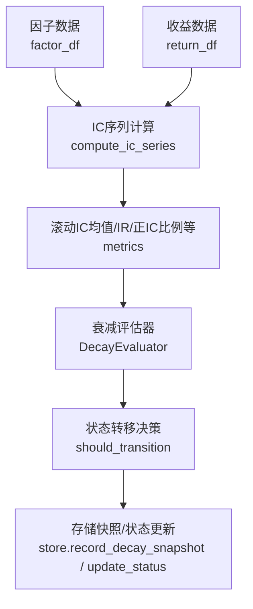
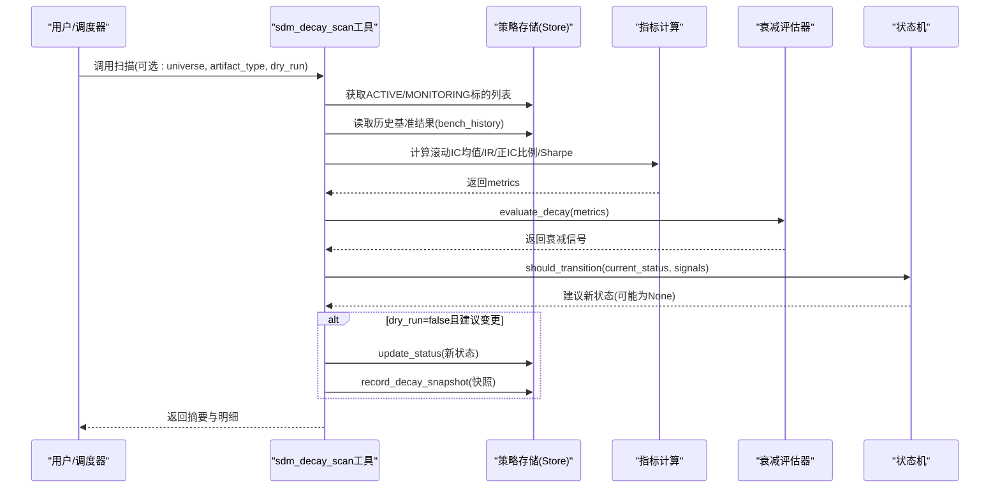
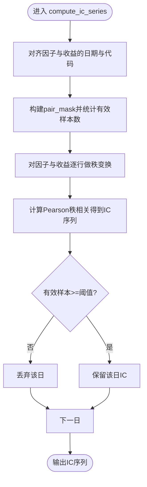
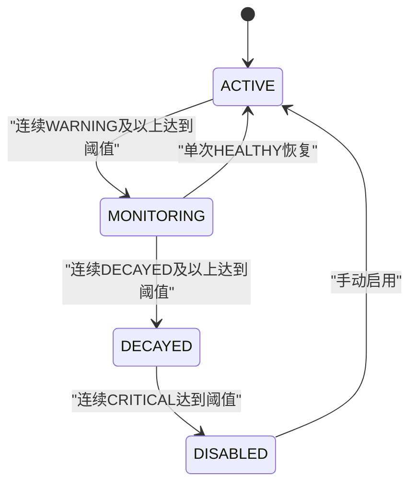
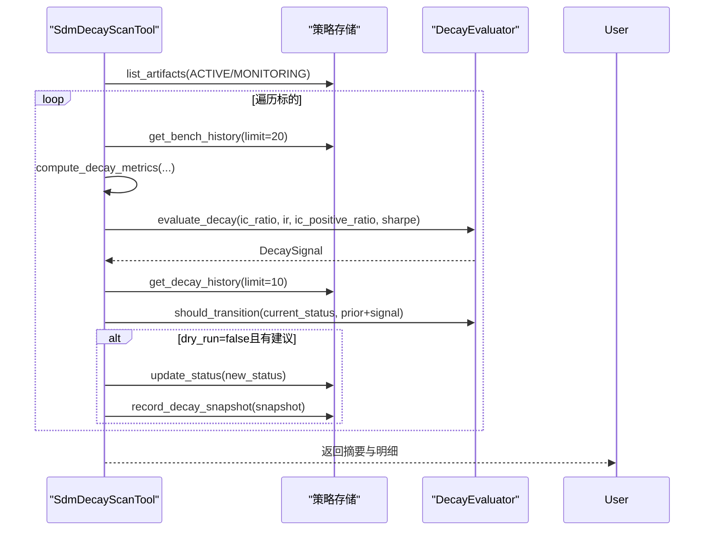
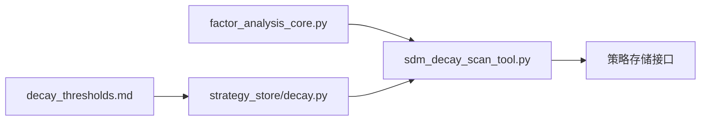

# 因子衰减分析

<cite>
**本文引用的文件**
- [agent/src/factors/factor_analysis_core.py](file://agent/src/factors/factor_analysis_core.py)
- [agent/src/strategy_store/decay.py](file://agent/src/strategy_store/decay.py)
- [agent/src/tools/sdm_decay_scan_tool.py](file://agent/src/tools/sdm_decay_scan_tool.py)
- [agent/src/skills/strategy-dev-manager/references/decay_thresholds.md](file://agent/src/skills/strategy-dev-manager/references/decay_thresholds.md)
- [agent/src/skills/strategy-dev-manager/references/scheduled_decay_scan.md](file://agent/src/skills/strategy-dev-manager/references/scheduled_decay_scan.md)
- [agent/tests/test_strategy_store.py](file://agent/tests/test_strategy_store.py)
</cite>

## 目录
1. [引言](#引言)
2. [项目结构](#项目结构)
3. [核心组件](#核心组件)
4. [架构总览](#架构总览)
5. [详细组件分析](#详细组件分析)
6. [依赖关系分析](#依赖关系分析)
7. [性能考量](#性能考量)
8. [故障排查指南](#故障排查指南)
9. [结论](#结论)
10. [附录](#附录)

## 引言
本文件聚焦于“因子衰减分析”的完整方法论与工程实现，覆盖理论基础、检测指标、时间窗口与预测模型思路、衰减模式识别（含季节性调整与结构性断点）、因子生命周期管理策略（更新频率优化与信号重校准），以及基于项目的自动化扫描与报告生成。文档面向量化研究者和工程实施者，既提供概念性说明，也给出可落地的工具链与流程。

## 项目结构
围绕因子衰减的核心代码分布在以下模块：
- 因子IC与分层回测计算：factor_analysis_core.py
- 衰减评估状态机与阈值：strategy_store/decay.py
- 批量衰减扫描工具：tools/sdm_decay_scan_tool.py
- 衰减阈值与触发规则参考：skills/strategy-dev-manager/references/decay_thresholds.md
- 定时扫描配置与运行流程：skills/strategy-dev-manager/references/scheduled_decay_scan.md
- 行为验证测试：tests/test_strategy_store.py

图表来源
- [agent/src/factors/factor_analysis_core.py:8-47](file://agent/src/factors/factor_analysis_core.py#L8-L47)
- [agent/src/strategy_store/decay.py:79-159](file://agent/src/strategy_store/decay.py#L79-L159)
- [agent/src/tools/sdm_decay_scan_tool.py:96-187](file://agent/src/tools/sdm_decay_scan_tool.py#L96-L187)

章节来源
- [agent/src/factors/factor_analysis_core.py:1-103](file://agent/src/factors/factor_analysis_core.py#L1-L103)
- [agent/src/strategy_store/decay.py:1-274](file://agent/src/strategy_store/decay.py#L1-L274)
- [agent/src/tools/sdm_decay_scan_tool.py:1-211](file://agent/src/tools/sdm_decay_scan_tool.py#L1-L211)
- [agent/src/skills/strategy-dev-manager/references/decay_thresholds.md:1-42](file://agent/src/skills/strategy-dev-manager/references/decay_thresholds.md#L1-L42)
- [agent/src/skills/strategy-dev-manager/references/scheduled_decay_scan.md:1-177](file://agent/src/skills/strategy-dev-manager/references/scheduled_decay_scan.md#L1-L177)
- [agent/tests/test_strategy_store.py:322-350](file://agent/tests/test_strategy_store.py#L322-L350)

## 核心组件
- IC与分层回测计算
  - 日频Spearman秩相关（IC）：按日期对齐因子与收益，逐行去空后做秩相关，过滤样本不足日期。
  - 分层回测：按因子值分位数分组，等权持有并计算累计净值曲线，用于观察信号的分层收益能力。
- 衰减评估与状态机
  - 指标分类：对IC比率、IR、正IC比例、Sharpe分别设定健康/警告/衰减/危急阈值，取最坏信号作为综合信号。
  - 状态转移：依据连续信号次数决定从active→monitoring→decayed→disabled或恢复至active。
- 批量扫描工具
  - 遍历ACTIVE/MONITORING标的，计算滚动指标，评估信号，必要时执行状态转移并记录快照。
  - 支持dry_run、按universe与artifact_type过滤。

章节来源
- [agent/src/factors/factor_analysis_core.py:8-103](file://agent/src/factors/factor_analysis_core.py#L8-L103)
- [agent/src/strategy_store/decay.py:13-159](file://agent/src/strategy_store/decay.py#L13-L159)
- [agent/src/tools/sdm_decay_scan_tool.py:27-211](file://agent/src/tools/sdm_decay_scan_tool.py#L27-L211)

## 架构总览
下图展示从因子与收益数据到衰减监控与状态更新的端到端流程。

图表来源
- [agent/src/tools/sdm_decay_scan_tool.py:59-211](file://agent/src/tools/sdm_decay_scan_tool.py#L59-L211)
- [agent/src/strategy_store/decay.py:79-274](file://agent/src/strategy_store/decay.py#L79-L274)

## 详细组件分析

### 组件A：IC与分层回测计算（factor_analysis_core.py）
- 设计要点
  - 向量化的Spearman秩相关：通过rank().corrwith()高效计算日频IC，并按最小有效样本数过滤。
  - 分层回测：按因子值分位分组，处理重复值与不足组数的边界情况，输出各组的累计净值。
- 复杂度与性能
  - IC计算：O(D×N log N)，D为交易日数，N为截面股票数；rank操作主导。
  - 分层回测：每日排序+分组聚合，整体接近O(D×N log N)。
- 错误处理
  - 无交集日期/代码时返回空序列/表。
  - n_groups<=0抛出异常；分组不足时回退等宽切分。
- 优化机会
  - 预对齐common_dates/common_codes减少重复IO。
  - 对大规模截面可使用并行化或内存映射。

图表来源
- [agent/src/factors/factor_analysis_core.py:8-47](file://agent/src/factors/factor_analysis_core.py#L8-L47)

章节来源
- [agent/src/factors/factor_analysis_core.py:8-103](file://agent/src/factors/factor_analysis_core.py#L8-L103)

### 组件B：衰减评估与状态机（strategy_store/decay.py）
- 指标分类
  - 对每个指标使用三档阈值（健康/警告/衰减/危急），取最坏信号作为综合信号。
- 状态转移规则
  - active→monitoring：连续多次出现WARNING及以上。
  - monitoring→decayed：连续多次出现DECAYED及以上。
  - monitoring→active：单次HEALTHY即恢复。
  - decayed→disabled：连续多次CRITICAL。
- 扩展性
  - 阈值集中配置，便于不同市场/因子类型调参。
  - 纯函数式评估，无I/O耦合，易于单元测试与回放。

图表来源
- [agent/src/strategy_store/decay.py:79-239](file://agent/src/strategy_store/decay.py#L79-L239)
- [agent/src/skills/strategy-dev-manager/references/decay_thresholds.md:22-30](file://agent/src/skills/strategy-dev-manager/references/decay_thresholds.md#L22-L30)

章节来源
- [agent/src/strategy_store/decay.py:13-274](file://agent/src/strategy_store/decay.py#L13-L274)
- [agent/src/skills/strategy-dev-manager/references/decay_thresholds.md:1-42](file://agent/src/skills/strategy-dev-manager/references/decay_thresholds.md#L1-L42)
- [agent/tests/test_strategy_store.py:322-350](file://agent/tests/test_strategy_store.py#L322-L350)

### 组件C：批量衰减扫描工具（sdm_decay_scan_tool.py）
- 功能
  - 收集ACTIVE/MONITORING标的，读取bench_history，计算滚动指标，评估信号，必要时执行状态转移并记录快照。
  - 支持dry_run模式，便于审计与回滚。
- 关键路径
  - 指标计算：rolling IC均值、IR、正IC比例、滚动Sharpe。
  - 状态判断：结合prior_signals与阈值规则决定是否迁移。
  - 持久化：记录DecaySnapshot，更新ArtifactStatus。
- 可扩展点
  - 增加更多指标（如信息比率稳定性、换手成本影响）。
  - 接入外部预警通道（邮件/IM）。

图表来源
- [agent/src/tools/sdm_decay_scan_tool.py:59-211](file://agent/src/tools/sdm_decay_scan_tool.py#L59-L211)
- [agent/src/strategy_store/decay.py:79-274](file://agent/src/strategy_store/decay.py#L79-L274)

章节来源
- [agent/src/tools/sdm_decay_scan_tool.py:1-211](file://agent/src/tools/sdm_decay_scan_tool.py#L1-L211)

### 组件D：定时扫描与报告（scheduled_decay_scan.md + decay_thresholds.md）
- 定时任务
  - 通过ScheduledResearchExecutor周期性触发，支持cron与毫秒间隔。
  - 每次触发创建独立会话，调用sdm_decay_scan，生成结构化报告。
- 阈值与触发
  - 明确IC比率、IR、正IC比例、Sharpe的健康/警告/衰减/危急区间。
  - 状态转移需满足连续读数要求，避免噪声误判。
- 运维建议
  - 根据因子周期选择扫描频率（短/中/长周期与实盘差异）。
  - 多宇宙任务错峰执行，避免数据源限流。

章节来源
- [agent/src/skills/strategy-dev-manager/references/scheduled_decay_scan.md:1-177](file://agent/src/skills/strategy-dev-manager/references/scheduled_decay_scan.md#L1-L177)
- [agent/src/skills/strategy-dev-manager/references/decay_thresholds.md:1-42](file://agent/src/skills/strategy-dev-manager/references/decay_thresholds.md#L1-L42)

## 依赖关系分析
- 模块耦合
  - sdm_decay_scan_tool依赖decay评估器与存储接口，负责编排与持久化。
  - factor_analysis_core提供底层IC与分层回测计算，被上层工具复用。
  - decay_thresholds.md定义业务规则，驱动评估器的阈值配置。
- 外部依赖
  - pandas用于向量化计算与时间序列处理。
  - 存储抽象（_shared.get_store）解耦具体实现。
- 循环依赖
  - 当前实现无循环依赖，职责清晰。

图表来源
- [agent/src/factors/factor_analysis_core.py:1-103](file://agent/src/factors/factor_analysis_core.py#L1-L103)
- [agent/src/strategy_store/decay.py:1-274](file://agent/src/strategy_store/decay.py#L1-L274)
- [agent/src/tools/sdm_decay_scan_tool.py:1-211](file://agent/src/tools/sdm_decay_scan_tool.py#L1-L211)
- [agent/src/skills/strategy-dev-manager/references/decay_thresholds.md:1-42](file://agent/src/skills/strategy-dev-manager/references/decay_thresholds.md#L1-L42)

章节来源
- [agent/src/factors/factor_analysis_core.py:1-103](file://agent/src/factors/factor_analysis_core.py#L1-L103)
- [agent/src/strategy_store/decay.py:1-274](file://agent/src/strategy_store/decay.py#L1-L274)
- [agent/src/tools/sdm_decay_scan_tool.py:1-211](file://agent/src/tools/sdm_decay_scan_tool.py#L1-L211)
- [agent/src/skills/strategy-dev-manager/references/decay_thresholds.md:1-42](file://agent/src/skills/strategy-dev-manager/references/decay_thresholds.md#L1-L42)

## 性能考量
- 计算复杂度
  - IC计算与分层回测主要受截面规模与交易日数影响，建议使用向量化与缓存。
- I/O与存储
  - bench_history限制读取条数（默认20），降低扫描开销。
  - 快照记录仅保存必要字段，避免过度写入。
- 并发与限流
  - 多宇宙定时任务应错峰执行，避免共享数据源限流。
- 内存与精度
  - 大截面数据注意内存占用，必要时分批或增量计算。
  - 分位分组时处理重复值与不足组数，保证数值稳定。

[本节为通用指导，不直接分析具体文件]

## 故障排查指南
- 数据不足
  - 当bench_history少于阈值或缺少必要指标时，标记为insufficient_data，需检查上游回测与基准记录是否完整。
- 阈值误报
  - 若频繁在healthy与warning间波动，考虑延长滚动窗口或提高连续信号门槛。
- 状态未转移
  - 检查prior_signals累积是否正确，确认连续信号计数与阈值匹配。
- 扫描耗时过长
  - 缩小universe或artifact_type范围，或降低limit参数。

章节来源
- [agent/src/tools/sdm_decay_scan_tool.py:96-122](file://agent/src/tools/sdm_decay_scan_tool.py#L96-L122)
- [agent/src/strategy_store/decay.py:161-239](file://agent/src/strategy_store/decay.py#L161-L239)
- [agent/src/skills/strategy-dev-manager/references/scheduled_decay_scan.md:138-155](file://agent/src/skills/strategy-dev-manager/references/scheduled_decay_scan.md#L138-L155)

## 结论
本项目提供了完整的因子衰减监测闭环：从IC与分层回测的基础计算，到基于阈值的衰减评估与状态机，再到批量扫描与定时任务的工程落地。通过合理的滚动窗口、连续信号门槛与阈值配置，可在控制噪声的同时及时捕捉因子退化。结合季节性调整与结构性断点检测的思路，可进一步提升鲁棒性。建议在实盘中结合因子半衰期与再平衡周期，动态优化扫描频率与信号重校准策略。

[本节为总结性内容，不直接分析具体文件]

## 附录

### 衰减指标计算方法
- IC衰减
  - 滚动IC均值与基线IC均值之比（IC比率），用于衡量近期预测力相对历史水平的变化。
- 收益衰减
  - 分层回测各组累计净值对比，观察高/低分组收益是否收敛或反转。
- 信号衰减
  - 正IC比例与IR的滚动估计，反映信号稳定性与信息效率。

章节来源
- [agent/src/factors/factor_analysis_core.py:8-103](file://agent/src/factors/factor_analysis_core.py#L8-L103)
- [agent/src/tools/sdm_decay_scan_tool.py:112-129](file://agent/src/tools/sdm_decay_scan_tool.py#L112-L129)

### 时间窗口分析与预测模型思路
- 时间窗口
  - 滚动窗口长度应与因子半衰期匹配；短周期因子采用更短的滚动窗口，长周期因子采用更长窗口以平滑噪声。
- 预测模型
  - 可将IC比率、IR、正IC比例作为特征，训练轻量模型（如逻辑回归/树模型）预测未来衰减概率，辅助阈值自适应。
  - 引入外生变量（波动率、流动性、宏观状态）提升预测稳健性。

[本节为概念性内容，不直接分析具体文件]

### 衰减模式识别、季节性调整与结构性断点检测
- 衰减模式
  - 渐进式衰减：IC比率缓慢下降，IR逐步走低，正IC比例下滑。
  - 突变式衰减：突发事件导致IC与收益骤降，需快速触发状态转移。
- 季节性调整
  - 对因子收益进行月度/季度季节因子调整，剔除季节性噪音后再评估衰减。
- 结构性断点检测
  - 使用滚动相关性或方差比检验，识别市场 regime 切换导致的因子失效。

[本节为概念性内容，不直接分析具体文件]

### 因子生命周期管理策略
- 更新频率优化
  - 短周期因子：日度扫描；中长周期：周度；长周期：月度；实盘因子：高频扫描。
- 信号重校准
  - 当状态进入monitoring或decayed时，触发信号重校准（重新估计权重、阈值或组合方式）。
- 退出与复活
  - 连续CRITICAL进入disabled，需人工复核后复活；恢复条件为连续HEALTHY或外部干预。

章节来源
- [agent/src/skills/strategy-dev-manager/references/scheduled_decay_scan.md:138-155](file://agent/src/skills/strategy-dev-manager/references/scheduled_decay_scan.md#L138-L155)
- [agent/src/skills/strategy-dev-manager/references/decay_thresholds.md:22-30](file://agent/src/skills/strategy-dev-manager/references/decay_thresholds.md#L22-L30)

### 使用项目工具进行衰减监控与预警
- 手动扫描
  - 调用sdm_decay_scan，指定universe与artifact_type，支持dry_run预览。
- 定时扫描
  - 通过ScheduledResearchExecutor配置cron或间隔，自动执行扫描与报告。
- 报告与预警
  - 扫描结果包含摘要、每标的明细、已应用的状态转移；可对接IM/邮件进行预警。

章节来源
- [agent/src/tools/sdm_decay_scan_tool.py:27-57](file://agent/src/tools/sdm_decay_scan_tool.py#L27-L57)
- [agent/src/skills/strategy-dev-manager/references/scheduled_decay_scan.md:21-68](file://agent/src/skills/strategy-dev-manager/references/scheduled_decay_scan.md#L21-L68)