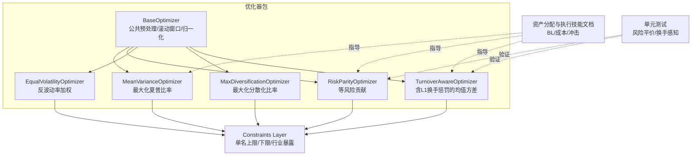
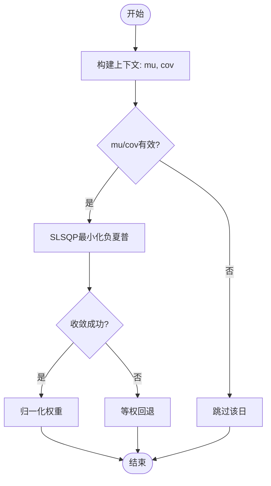
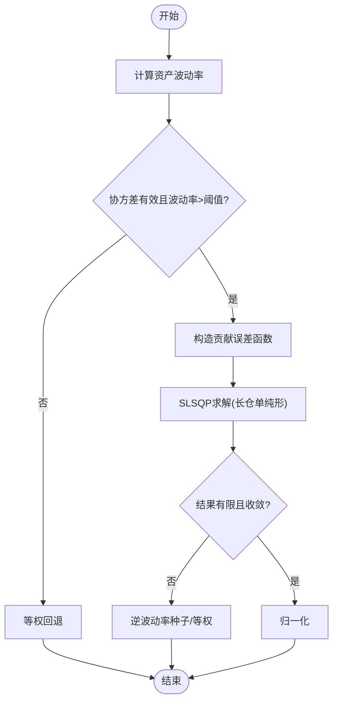
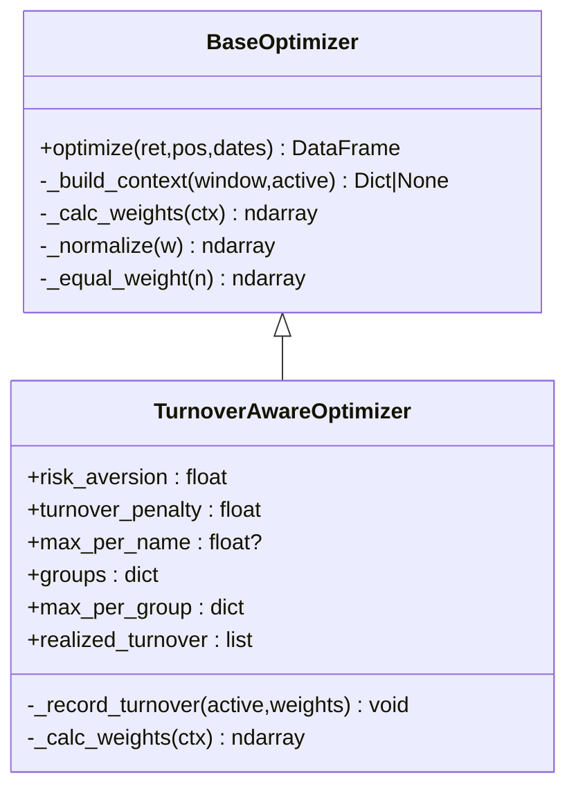
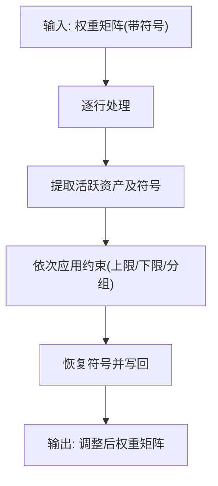
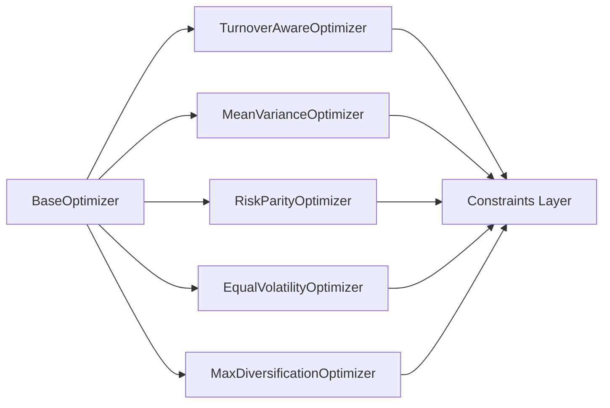

# 投资组合优化

<cite>
**本文引用的文件**
- [agent/backtest/optimizers/__init__.py](file://agent/backtest/optimizers/__init__.py)
- [agent/backtest/optimizers/base.py](file://agent/backtest/optimizers/base.py)
- [agent/backtest/optimizers/mean_variance.py](file://agent/backtest/optimizers/mean_variance.py)
- [agent/backtest/optimizers/risk_parity.py](file://agent/backtest/optimizers/risk_parity.py)
- [agent/backtest/optimizers/equal_volatility.py](file://agent/backtest/optimizers/equal_volatility.py)
- [agent/backtest/optimizers/max_diversification.py](file://agent/backtest/optimizers/max_diversification.py)
- [agent/backtest/optimizers/turnover_aware.py](file://agent/backtest/optimizers/turnover_aware.py)
- [agent/backtest/constraints.py](file://agent/backtest/constraints.py)
- [agent/src/skills/asset-allocation/SKILL.md](file://agent/src/skills/asset-allocation/SKILL.md)
- [agent/src/skills/execution-model/SKILL.md](file://agent/src/skills/execution-model/SKILL.md)
- [agent/src/skills/market-microstructure/SKILL.md](file://agent/src/skills/market-microstructure/SKILL.md)
- [agent/backtest/factor_costs.py](file://agent/backtest/factor_costs.py)
- [agent/tests/test_risk_parity.py](file://agent/tests/test_risk_parity.py)
- [agent/tests/test_turnover_aware_optimizer.py](file://agent/tests/test_turnover_aware_optimizer.py)
</cite>

## 目录
1. [简介](#简介)
2. [项目结构](#项目结构)
3. [核心组件](#核心组件)
4. [架构总览](#架构总览)
5. [详细组件分析](#详细组件分析)
6. [依赖关系分析](#依赖关系分析)
7. [性能与数值稳定性](#性能与数值稳定性)
8. [故障排查指南](#故障排查指南)
9. [结论](#结论)
10. [附录：实战案例与参数调优](#附录：实战案例与参数调优)

## 简介
本指南面向希望系统化构建和优化投资组合的读者，围绕均值方差优化、风险平价、最小方差（通过最大分散化近似）、换手率控制等主流方法展开，结合仓库中的可执行实现，解释数学原理、约束设置、风险模型集成、交易成本建模与市场冲击考虑，并给出参数调优、敏感性分析与稳健性检验的实践建议。同时提供Black-Litterman模型与因子模型优化的思路指引，以及蒙特卡洛模拟在回测与统计推断中的应用。

## 项目结构
该项目的投资组合优化能力集中在 backtest/optimizers 包中，采用“基类 + 多策略实现”的分层设计；constraints 模块提供与优化器解耦的权重约束后处理层；技能文档提供了 Black-Litterman、交易成本与市场微观结构的理论参考与实践配置。



图表来源
- [agent/backtest/optimizers/base.py:14-145](file://agent/backtest/optimizers/base.py#L14-L145)
- [agent/backtest/optimizers/mean_variance.py:11-70](file://agent/backtest/optimizers/mean_variance.py#L11-L70)
- [agent/backtest/optimizers/risk_parity.py:11-60](file://agent/backtest/optimizers/risk_parity.py#L11-L60)
- [agent/backtest/optimizers/equal_volatility.py:14-48](file://agent/backtest/optimizers/equal_volatility.py#L14-L48)
- [agent/backtest/optimizers/max_diversification.py:15-59](file://agent/backtest/optimizers/max_diversification.py#L15-L59)
- [agent/backtest/optimizers/turnover_aware.py:38-251](file://agent/backtest/optimizers/turnover_aware.py#L38-L251)
- [agent/backtest/constraints.py:1-206](file://agent/backtest/constraints.py#L1-L206)

章节来源
- [agent/backtest/optimizers/__init__.py:1-13](file://agent/backtest/optimizers/__init__.py#L1-L13)
- [agent/backtest/optimizers/base.py:14-145](file://agent/backtest/optimizers/base.py#L14-L145)

## 核心组件
- 基类 BaseOptimizer：统一处理信号到权重的映射、因果滚动窗口切片、协方差矩阵与NaN检查、符号保留与权重归一化。子类只需实现 _calc_weights。
- 均值方差优化 MeanVarianceOptimizer：在长仓单纯形上最大化夏普比率，使用SLSQP求解。
- 风险平价 RiskParityOptimizer：在长仓单纯形上使各资产边际风险贡献相等，使用SLSQP求解。
- 反波动率 EqualVolatilityOptimizer：基于滚动标准差计算反波动率权重，无需完整协方差矩阵。
- 最大分散化 MaxDiversificationOptimizer：最大化分散化比率（Choueifaty & Coignard），近似最小方差风格。
- 换手率感知 TurnoverAwareOptimizer：均值方差目标中加入L1换手惩罚，支持单名上限与分组上限，记录已实现换手。
- 约束层 constraints：对任意优化器输出进行行级权重调整，包括单名上限/下限、行业/分组暴露上限，保持符号不变。

章节来源
- [agent/backtest/optimizers/base.py:14-145](file://agent/backtest/optimizers/base.py#L14-L145)
- [agent/backtest/optimizers/mean_variance.py:11-70](file://agent/backtest/optimizers/mean_variance.py#L11-L70)
- [agent/backtest/optimizers/risk_parity.py:11-60](file://agent/backtest/optimizers/risk_parity.py#L11-L60)
- [agent/backtest/optimizers/equal_volatility.py:14-48](file://agent/backtest/optimizers/equal_volatility.py#L14-L48)
- [agent/backtest/optimizers/max_diversification.py:15-59](file://agent/backtest/optimizers/max_diversification.py#L15-L59)
- [agent/backtest/optimizers/turnover_aware.py:38-251](file://agent/backtest/optimizers/turnover_aware.py#L38-L251)
- [agent/backtest/constraints.py:1-206](file://agent/backtest/constraints.py#L1-L206)

## 架构总览
优化流程以“信号位置矩阵 + 历史收益率”为输入，按日期滚动估计统计量，调用具体优化器得到权重，再经约束层调整，最终输出带符号的权重矩阵。

```mermaid
sequenceDiagram
participant Engine as "回测引擎"
participant Opt as "BaseOptimizer.optimize"
participant Sub as "具体优化器._calc_weights"
participant Cons as "约束层.apply_constraints_frame"
Engine->>Opt : 传入(ret, pos, dates)
loop 每个决策日
Opt->>Opt : 因果切片历史收益
Opt->>Sub : _build_context/_calc_weights
Sub-->>Opt : 权重向量(非负, sum=1)
Opt->>Opt : 恢复原始信号符号
end
Opt-->>Engine : 权重矩阵(未 dollar-normalized)
Engine->>Cons : apply_constraints_frame(frame, constraints)
Cons-->>Engine : 调整后权重矩阵
```

图表来源
- [agent/backtest/optimizers/base.py:36-85](file://agent/backtest/optimizers/base.py#L36-L85)
- [agent/backtest/constraints.py:180-206](file://agent/backtest/constraints.py#L180-L206)

## 详细组件分析

### 均值方差优化（最大化夏普）
- 数学目标：在 w≥0, Σw=1 下最大化 (w'μ - r_f)/√(w'Σw)。
- 实现要点：使用SLSQP，初始点为等权，边界为[0,1]，等式约束为权重和为1；若失败则回退等权。
- 适用场景：追求单位风险下的超额回报最大化，需配合约束避免集中度过高。



图表来源
- [agent/backtest/optimizers/mean_variance.py:18-56](file://agent/backtest/optimizers/mean_variance.py#L18-L56)

章节来源
- [agent/backtest/optimizers/mean_variance.py:11-70](file://agent/backtest/optimizers/mean_variance.py#L11-L70)

### 风险平价（等风险贡献）
- 数学目标：使各资产的边际风险贡献相等，即 w_i·(Σw)_i / σ_p = 常数。
- 实现要点：构造贡献误差函数，SLSQP在长仓单纯形上最小化标准化误差；若奇异或零波动回退等权。
- 适用场景：当不确定预期收益时，强调风险分散与稳健性。



图表来源
- [agent/backtest/optimizers/risk_parity.py:14-49](file://agent/backtest/optimizers/risk_parity.py#L14-L49)

章节来源
- [agent/backtest/optimizers/risk_parity.py:11-60](file://agent/backtest/optimizers/risk_parity.py#L11-L60)
- [agent/tests/test_risk_parity.py:15-87](file://agent/tests/test_risk_parity.py#L15-L87)

### 最大分散化（近似最小方差风格）
- 数学目标：最大化分散化比率 DR = (w'σ)/√(w'Σw)，其中σ为资产波动率向量。
- 实现要点：SLSQP在长仓单纯形上最小化负DR；若波动率为零或接近零回退等权。
- 适用场景：追求低相关性组合，降低整体波动。

章节来源
- [agent/backtest/optimizers/max_diversification.py:15-59](file://agent/backtest/optimizers/max_diversification.py#L15-L59)

### 换手率感知的均值方差（含L1换手惩罚）
- 数学目标：min -w'μ + λ·w'Σw + γ·||w - w_prev||_1，s.t. w≥0, Σw=1，可选单名上限与分组上限。
- 实现要点：维护上一期权重，构造线性L1项；自动选择可行初值；记录每期的已实现换手；若约束不可行抛出异常。
- 适用场景：在收益-风险权衡中显式控制交易频率与成本。



图表来源
- [agent/backtest/optimizers/base.py:14-145](file://agent/backtest/optimizers/base.py#L14-L145)
- [agent/backtest/optimizers/turnover_aware.py:38-251](file://agent/backtest/optimizers/turnover_aware.py#L38-L251)

章节来源
- [agent/backtest/optimizers/turnover_aware.py:1-251](file://agent/backtest/optimizers/turnover_aware.py#L1-L251)
- [agent/tests/test_turnover_aware_optimizer.py:24-135](file://agent/tests/test_turnover_aware_optimizer.py#L24-L135)
- [agent/tests/test_turnover_aware_optimizer.py:208-356](file://agent/tests/test_turnover_aware_optimizer.py#L208-L356)

### 约束层（权重限制、行业暴露、换手率控制）
- 功能：对任意优化器输出的带符号权重矩阵逐行应用约束，保持符号不变。
- 类型：
  - 单名上限 MaxWeight：超过上限的部分按比例重分配到未达上限的资产。
  - 单名下限 MinWeight：低于下限的活跃资产提升到下限，资金来自高于下限的资产。
  - 分组暴露 GroupExposure：对每组资产总和施加上限，超限时按比例缩放。
- 与换手率控制：可通过 TurnoverAwareOptimizer 的 turnover_penalty 直接控制；也可在外部根据 realized_turnover 设定规则。



图表来源
- [agent/backtest/constraints.py:180-206](file://agent/backtest/constraints.py#L180-L206)
- [agent/backtest/constraints.py:48-130](file://agent/backtest/constraints.py#L48-L130)

章节来源
- [agent/backtest/constraints.py:1-206](file://agent/backtest/constraints.py#L1-L206)

### Black-Litterman 模型（理论与集成思路）
- 核心思想：从市场均衡出发，融合投资者观点，得到后验期望收益，再作为均值方差优化的输入。
- 步骤：反向推导均衡收益 π；构建视图矩阵 P、Q、Ω；计算后验 μ_BL；用 μ_BL 运行均值方差优化。
- 集成方式：将 BL 的输出 μ_BL 替换到 MeanVarianceOptimizer 的上下文中（自定义 _build_context）。

章节来源
- [agent/src/skills/asset-allocation/SKILL.md:35-54](file://agent/src/skills/asset-allocation/SKILL.md#L35-L54)

### 因子模型优化（思路与落地）
- 思路：将预期收益分解为因子暴露与因子预期收益，或使用因子中性化与正交化减少共线性；在优化中加入因子暴露约束或惩罚。
- 落地建议：在 _build_context 中扩展上下文，加入因子协方差与暴露；在 _calc_weights 中增加因子暴露约束或正则项。

章节来源
- [agent/src/swarm/presets/factor_research_committee.yaml:103-132](file://agent/src/swarm/presets/factor_research_committee.yaml#L103-L132)

### 蒙特卡洛模拟（回测与统计推断）
- 用途：对交易顺序随机打乱评估夏普显著性；对日收益重采样估计置信区间；前推分析检验一致性。
- 实践：在回测框架中生成多路径资金曲线，比较实际指标与模拟分布，计算p值与置信区间。

章节来源
- [frontend/src/i18n/locales/zh-CN.json:1524-1555](file://frontend/src/i18n/locales/zh-CN.json#L1524-L1555)

## 依赖关系分析
- 优化器均继承自 BaseOptimizer，复用因果滚动窗口、NaN处理与权重归一化逻辑，保证一致性与可测试性。
- 约束层独立于优化器，可在任何优化器之后应用，提升模块化程度。
- 换手率感知优化器内部维护状态（上一期权重、已实现换手），与其他优化器无耦合。



图表来源
- [agent/backtest/optimizers/base.py:14-145](file://agent/backtest/optimizers/base.py#L14-L145)
- [agent/backtest/constraints.py:1-206](file://agent/backtest/constraints.py#L1-L206)

章节来源
- [agent/backtest/optimizers/base.py:14-145](file://agent/backtest/optimizers/base.py#L14-L145)
- [agent/backtest/constraints.py:1-206](file://agent/backtest/constraints.py#L1-L206)

## 性能与数值稳定性
- 滚动窗口长度 lookback：过短导致估计不稳定，过长引入结构性变化偏差；建议结合数据频率与资产特性调参。
- 协方差矩阵病态：零/近零波动或NaN会导致回退逻辑；必要时做收缩估计或剔除问题资产。
- 优化器收敛：SLSQP默认迭代次数与容差在多数场景足够；若失败应检查约束可行性与初值选择。
- 换手率惩罚 gamma：与收益尺度相关，日频下约0.5可能强偏好持有不动；需按数据频率校准。

章节来源
- [agent/backtest/optimizers/base.py:28-85](file://agent/backtest/optimizers/base.py#L28-L85)
- [agent/backtest/optimizers/turnover_aware.py:15-25](file://agent/backtest/optimizers/turnover_aware.py#L15-L25)

## 故障排查指南
- 单列全NaN：优化器会跳过该日或回退等权，确保不崩溃。
- 约束不可行：如分组上限与单名上限叠加导致容量不足，会抛出异常；需放宽约束或调整资产池。
- 优化失败：TurnoverAwareOptimizer在求解失败时抛出运行时错误；检查初值、约束与数据质量。
- 符号丢失：约束层仅调整幅度，保持符号；若出现符号翻转，检查输入信号与约束逻辑。

章节来源
- [agent/backtest/optimizers/base.py:64-85](file://agent/backtest/optimizers/base.py#L64-L85)
- [agent/backtest/optimizers/turnover_aware.py:195-224](file://agent/backtest/optimizers/turnover_aware.py#L195-L224)
- [agent/backtest/constraints.py:180-206](file://agent/backtest/constraints.py#L180-L206)

## 结论
该仓库提供了模块化、可扩展的投资组合优化框架：统一的基类抽象、多种经典优化器、灵活的约束层与换手率控制，辅以Black-Litterman、因子模型与蒙特卡洛的理论指引。实践中建议：
- 先用风险平价或最大分散化建立稳健基准；
- 在均值方差基础上加入单名/分组约束与换手率惩罚；
- 结合Black-Litterman融入观点，或用因子模型中性化暴露；
- 通过蒙特卡洛与前推分析进行稳健性检验；
- 严格建模交易成本与市场冲击，避免过度交易。

## 附录：实战案例与参数调优

### 案例一：A股股票池的风险平价组合
- 数据：过去60-120个交易日收益率，过滤停牌与流动性不足标的。
- 优化：RiskParityOptimizer，lookback=60-90。
- 约束：单名上限10%-15%，行业暴露上限30%-40%。
- 评估：滚动夏普、最大回撤、换手率；对比等权与均值方差。

### 案例二：含换手率控制的均值方差组合
- 数据：日频收益，估计mu与cov。
- 优化：TurnoverAwareOptimizer，risk_aversion=1-5，turnover_penalty=0.5-2.0（按日频校准）。
- 约束：单名上限10%-20%，分组上限按行业设定。
- 评估：累计换手、成本拖累、净收益；敏感性分析gamma与λ。

### 案例三：Black-Litterman观点融合
- 步骤：估计协方差Σ，反向推导π；设定绝对/相对观点P,Q,Ω；计算μ_BL；输入MeanVarianceOptimizer。
- 参数：τ=0.025-0.05；Ω按观点置信度设定。
- 评估：观点变动对权重的影响；稳健性检验（不同τ与Ω）。

### 案例四：因子模型中性化与优化
- 步骤：计算因子暴露与因子协方差；在优化中加入因子暴露约束或惩罚；进行行业/市值中性化。
- 评估：因子暴露变化、信息比率、换手率与成本。

### 参数调优与敏感性分析
- lookback：扫描60/90/120，观察稳定性与绩效。
- risk_aversion：1-5，观察风险-收益权衡。
- turnover_penalty：0-2（日频），观察换手与成本。
- 约束强度：单名/分组上限逐步收紧，观察容量与可行性。

### 稳健性检验
- 蒙特卡洛置换检验：打乱交易顺序，评估夏普显著性。
- 前推分析：拆分连续窗口，检验一致性。
- 自举置信区间：对日收益重采样，估计夏普置信区间。

### 交易成本建模与市场冲击
- 成本构成：佣金、印花税、买卖价差、滑点、市场冲击。
- 参考成本：A股单边约0.1%，港股/美股/加密市场各有差异。
- 冲击模型：非线性平方根模型 impact = η×σ×(Q/V)^0.6；大单分拆执行（TWAP/VWAP/IS）。
- 回测设置：commission=0.001（保守），engine=daily，interval=1D。

章节来源
- [agent/src/skills/execution-model/SKILL.md:174-275](file://agent/src/skills/execution-model/SKILL.md#L174-L275)
- [agent/src/skills/market-microstructure/SKILL.md:142-177](file://agent/src/skills/market-microstructure/SKILL.md#L142-L177)
- [agent/backtest/factor_costs.py:381-416](file://agent/backtest/factor_costs.py#L381-L416)