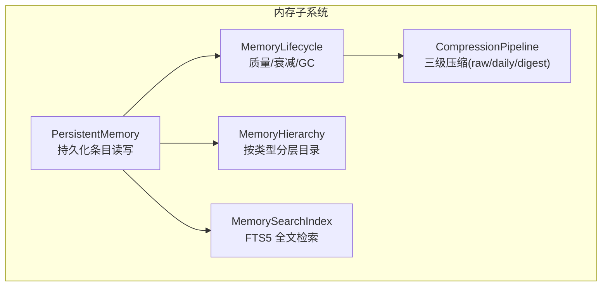
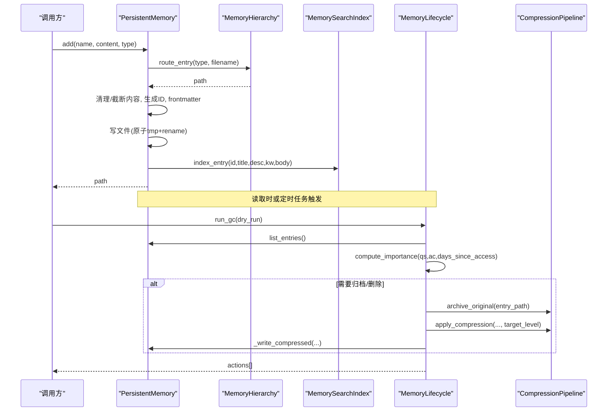
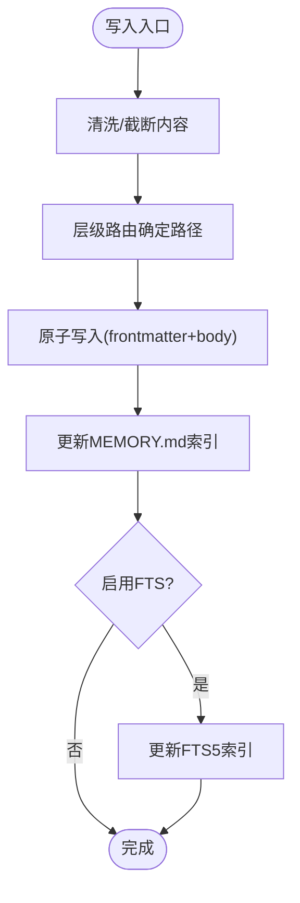
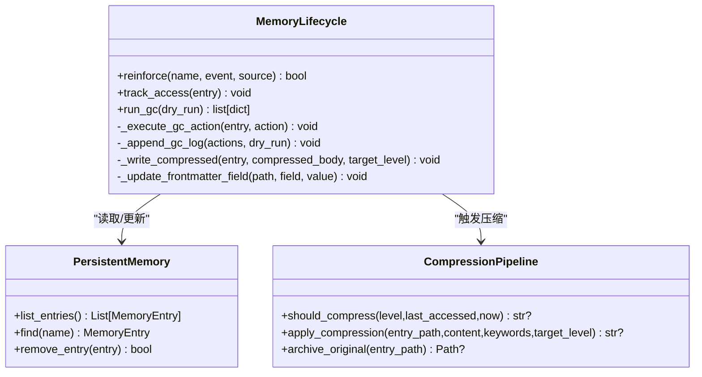
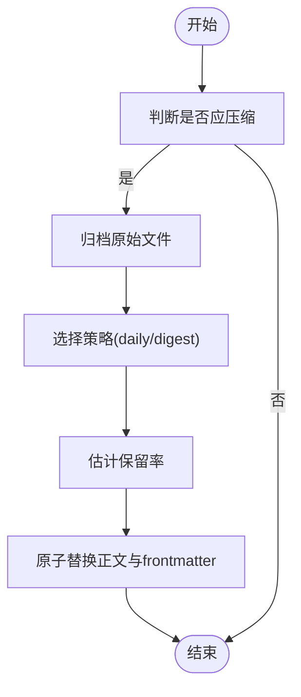
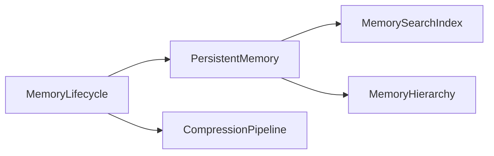

# 内存管理优化

<cite>
**本文引用的文件**
- [agent/src/memory/persistent.py](file://agent/src/memory/persistent.py)
- [agent/src/memory/lifecycle.py](file://agent/src/memory/lifecycle.py)
- [agent/src/memory/compression.py](file://agent/src/memory/compression.py)
- [agent/src/memory/hierarchy.py](file://agent/src/memory/hierarchy.py)
- [agent/src/memory/search_index.py](file://agent/src/memory/search_index.py)
- [agent/tests/test_memory_gc.py](file://agent/tests/test_memory_gc.py)
- [agent/tests/test_memory_lifecycle.py](file://agent/tests/test_memory_lifecycle.py)
</cite>

## 目录
1. [简介](#简介)
2. [项目结构](#项目结构)
3. [核心组件](#核心组件)
4. [架构总览](#架构总览)
5. [详细组件分析](#详细组件分析)
6. [依赖关系分析](#依赖关系分析)
7. [性能考量](#性能考量)
8. [故障排查指南](#故障排查指南)
9. [结论](#结论)
10. [附录](#附录)

## 简介
本文件围绕“内存管理优化”目标，系统化梳理并文档化该仓库中的持久化记忆子系统与相关优化策略。重点覆盖：
- 对象复用机制（基于文件的条目、索引与压缩归档）
- 内存分配策略（内容截断、去重窗口、层级目录组织）
- 垃圾回收与重要性衰减（质量分、访问计数、时间衰减、阈值归档/删除）
- 大文本处理（TF-IDF 关键句抽取、摘要生成、原子写入与回滚保护）
- 全文检索加速（SQLite FTS5 倒排索引，CJK 分词优化）
- 监控与可观测性（GC 日志、压缩保留率估算、锁超时告警）
- 实践案例（回测数据缓存、会话状态管理、大数据集处理）
- 最佳实践与常见问题解决方案

## 项目结构
该子系统的核心位于 agent/src/memory 目录，包含持久化存储、生命周期管理、压缩流水线、层级路由与全文检索等模块；测试用例集中在 agent/tests 下，覆盖 GC、生命周期、压缩、层级与搜索索引等行为验证。

图表来源
- [agent/src/memory/persistent.py:200-654](file://agent/src/memory/persistent.py#L200-L654)
- [agent/src/memory/lifecycle.py:71-421](file://agent/src/memory/lifecycle.py#L71-L421)
- [agent/src/memory/compression.py:163-356](file://agent/src/memory/compression.py#L163-L356)
- [agent/src/memory/hierarchy.py:34-436](file://agent/src/memory/hierarchy.py#L34-L436)
- [agent/src/memory/search_index.py:113-481](file://agent/src/memory/search_index.py#L113-L481)

章节来源
- [agent/src/memory/persistent.py:1-654](file://agent/src/memory/persistent.py#L1-L654)
- [agent/src/memory/lifecycle.py:1-421](file://agent/src/memory/lifecycle.py#L1-L421)
- [agent/src/memory/compression.py:1-356](file://agent/src/memory/compression.py#L1-L356)
- [agent/src/memory/hierarchy.py:1-436](file://agent/src/memory/hierarchy.py#L1-L436)
- [agent/src/memory/search_index.py:1-481](file://agent/src/memory/search_index.py#L1-L481)

## 核心组件
- PersistentMemory：以 Markdown + Frontmatter 的条目形式持久化记忆，提供增删改查、去重、索引维护、语义链接扩展点与 FTS 索引集成。
- MemoryLifecycle：基于质量分、访问计数与时间衰减的重要性计算，驱动垃圾回收（归档/删除）与压缩触发。
- CompressionPipeline：三级压缩（raw→daily→digest），使用 TF-IDF 关键句抽取与关键词摘要，支持原文件归档与原子替换。
- MemoryHierarchy：按 memory_type 将条目路由到分类目录，降低扫描复杂度并提供迁移与恢复能力。
- MemorySearchIndex：基于 SQLite FTS5 的全文检索索引，支持自动重建、CJK 分词优化与查询安全清洗。

章节来源
- [agent/src/memory/persistent.py:126-654](file://agent/src/memory/persistent.py#L126-L654)
- [agent/src/memory/lifecycle.py:71-421](file://agent/src/memory/lifecycle.py#L71-L421)
- [agent/src/memory/compression.py:163-356](file://agent/src/memory/compression.py#L163-L356)
- [agent/src/memory/hierarchy.py:34-436](file://agent/src/memory/hierarchy.py#L34-L436)
- [agent/src/memory/search_index.py:113-481](file://agent/src/memory/search_index.py#L113-L481)

## 架构总览
下图展示从写入到检索、再到生命周期管理的完整流程，包括并发控制、去重、索引更新与压缩归档。

图表来源
- [agent/src/memory/persistent.py:479-595](file://agent/src/memory/persistent.py#L479-L595)
- [agent/src/memory/hierarchy.py:70-90](file://agent/src/memory/hierarchy.py#L70-L90)
- [agent/src/memory/search_index.py:207-250](file://agent/src/memory/search_index.py#L207-L250)
- [agent/src/memory/lifecycle.py:183-273](file://agent/src/memory/lifecycle.py#L183-L273)
- [agent/src/memory/compression.py:261-337](file://agent/src/memory/compression.py#L261-L337)

## 详细组件分析

### 持久化存储（PersistentMemory）
- 数据结构：MemoryEntry 封装路径、标题、描述、正文、时间戳、质量分、访问计数、关键字、关联条目、分类与压缩级别。
- 写入路径：
  - 内容清洗与控制字符过滤，长度截断至上限，避免过大对象驻留内存。
  - 通过层级路由确定落盘路径，保证 O(类别大小) 的后续扫描。
  - 原子写入（临时文件 + rename）防止崩溃导致损坏。
  - 更新 MEMORY.md 索引，可选更新 FTS5 索引与语义链接。
- 读取与检索：
  - 支持 FTS5 优先检索，失败回退到 token 扫描；结合重要性权重排序。
  - 语义链接扩展结果，提升召回相关性。
- 并发与一致性：
  - 文件级锁（跨平台兼容，Windows 直接放行，Unix 使用 fcntl）。
  - 去重窗口（滑动时间窗内相同哈希拒绝重复写入）。

图表来源
- [agent/src/memory/persistent.py:158-170](file://agent/src/memory/persistent.py#L158-L170)
- [agent/src/memory/persistent.py:479-595](file://agent/src/memory/persistent.py#L479-L595)
- [agent/src/memory/search_index.py:207-250](file://agent/src/memory/search_index.py#L207-L250)

章节来源
- [agent/src/memory/persistent.py:126-654](file://agent/src/memory/persistent.py#L126-L654)

### 生命周期管理（MemoryLifecycle）
- 质量强化：根据事件（成功/失败/用户确认/拒绝/被动衰减）调整 quality_score，限制单会话增量上限，避免分数漂移。
- 重要性衰减：基于 Ebbinghaus 遗忘曲线思想，结合访问次数奖励，计算 importance。
- 垃圾回收：
  - 依据最小年龄、重要性阈值进行归档或删除（默认仅归档，不删除）。
  - 记录决策日志，支持 dry_run 审计。
  - 在 GC 执行阶段触发二级压缩（若启用）。
- 压缩集成：对满足条件的条目进行压缩并原子替换，更新 frontmatter 字段。

图表来源
- [agent/src/memory/lifecycle.py:71-421](file://agent/src/memory/lifecycle.py#L71-L421)
- [agent/src/memory/persistent.py:200-654](file://agent/src/memory/persistent.py#L200-L654)
- [agent/src/memory/compression.py:163-356](file://agent/src/memory/compression.py#L163-L356)

章节来源
- [agent/src/memory/lifecycle.py:1-421](file://agent/src/memory/lifecycle.py#L1-L421)

### 压缩流水线（CompressionPipeline）
- 三级压缩：
  - raw → daily：基于 TF-IDF 的关键句抽取，保留首尾句与 Top-K 重要句，附带关键字上下文。
  - daily → digest：提取高频高权重术语，生成要点式摘要。
- 安全与可追溯：
  - 压缩前归档原始文件（原子复制）。
  - 估计信息保留率（Jaccard 重叠）用于评估压缩效果。
- 触发条件：由生命周期根据最后访问时间决定目标级别。

图表来源
- [agent/src/memory/compression.py:163-356](file://agent/src/memory/compression.py#L163-L356)
- [agent/src/memory/lifecycle.py:243-273](file://agent/src/memory/lifecycle.py#L243-L273)

章节来源
- [agent/src/memory/compression.py:1-356](file://agent/src/memory/compression.py#L1-L356)

### 层级目录（MemoryHierarchy）
- 路由规则：按 memory_type 路由到对应分类目录，未知类型回退根目录。
- 扫描优化：支持全量扫描与按类别扫描，跳过系统文件与归档目录。
- 兼容性：
  - 自动修复缺失 .md 后缀的孤儿条目。
  - 提供扁平条目迁移到分类目录的能力。
  - 重建 .hierarchy.yaml 索引，便于快速定位。

章节来源
- [agent/src/memory/hierarchy.py:1-436](file://agent/src/memory/hierarchy.py#L1-L436)

### 全文检索（MemorySearchIndex）
- FTS5 索引：建立 memories 表与 memories_fts 虚拟表，使用触发器保持同步。
- CJK 优化：对连续中文字符进行一元/二元展开，提升匹配精度；查询时做安全清洗。
- 健壮性：WAL 模式、正常同步策略、异常降级（不可用时返回空结果）。
- 批量重建：支持从持久化条目数据重建索引。

章节来源
- [agent/src/memory/search_index.py:1-481](file://agent/src/memory/search_index.py#L1-L481)

## 依赖关系分析
- 模块耦合：
  - Lifecycle 依赖 PersistentMemory 获取条目列表与更新 frontmatter。
  - Lifecycle 在 GC 执行阶段调用 CompressionPipeline 进行压缩与归档。
  - PersistentMemory 可选依赖 SearchIndex 与 Hierarchy，分别用于检索与路由。
- 外部依赖：
  - SQLite FTS5（可选，不可用时回退）。
  - 文件系统锁（Unix 使用 fcntl，Windows 直接放行）。
- 循环依赖：无直接循环依赖；通过配置开关与延迟导入避免启动期耦合。

图表来源
- [agent/src/memory/persistent.py:200-654](file://agent/src/memory/persistent.py#L200-L654)
- [agent/src/memory/lifecycle.py:71-421](file://agent/src/memory/lifecycle.py#L71-L421)
- [agent/src/memory/compression.py:163-356](file://agent/src/memory/compression.py#L163-L356)
- [agent/src/memory/hierarchy.py:34-436](file://agent/src/memory/hierarchy.py#L34-L436)
- [agent/src/memory/search_index.py:113-481](file://agent/src/memory/search_index.py#L113-L481)

章节来源
- [agent/src/memory/persistent.py:200-654](file://agent/src/memory/persistent.py#L200-L654)
- [agent/src/memory/lifecycle.py:71-421](file://agent/src/memory/lifecycle.py#L71-L421)
- [agent/src/memory/compression.py:163-356](file://agent/src/memory/compression.py#L163-L356)
- [agent/src/memory/hierarchy.py:34-436](file://agent/src/memory/hierarchy.py#L34-L436)
- [agent/src/memory/search_index.py:113-481](file://agent/src/memory/search_index.py#L113-L481)

## 性能考量
- 对象复用与内存占用控制
  - 内容截断：正文最大字符数限制，避免大对象长期驻留。
  - 去重窗口：短时间内的重复写入被拦截，减少不必要的 I/O 与索引更新。
  - 层级目录：将 O(n) 扫描降为 O(类别大小)，提高查找效率。
- 检索性能
  - FTS5 索引：O(log n) 检索，显著优于逐条 token 扫描。
  - CJK 分词优化：提升中文检索准确率与召回率。
- 压缩与归档
  - 三级压缩降低磁盘占用与 I/O 压力，同时尽量保持信息保留率。
  - 原子写入与归档确保数据安全与可回滚。
- 并发与锁
  - 文件级锁避免竞态条件；超时日志便于定位阻塞问题。
- 建议
  - 在高吞吐场景开启 FTS5 与层级目录。
  - 合理设置压缩阈值与 GC 频率，平衡空间与性能。
  - 监控 gc.log 与压缩保留率，持续调优。

## 故障排查指南
- 常见现象与定位
  - 检索结果为空：检查 FTS5 是否可用；必要时触发 rebuild_all。
  - 写入失败或锁定：查看 memory_lock 超时日志，确认是否存在长时间持有锁的进程。
  - 压缩未生效：确认 VT_MEMORY_COMPRESSION 与 VT_MEMORY_GC 已启用，且条目满足最后访问时间阈值。
  - 条目不可见：检查层级目录是否正确路由，是否存在缺失 .md 后缀的孤儿条目。
- 诊断步骤
  - 启用 dry_run 运行 GC，观察 gc.log 中的动作与原因。
  - 对比压缩前后内容，评估保留率是否过低。
  - 校验 frontmatter 字段（quality_score、access_count、last_accessed、compression_level）。
- 参考测试用例
  - GC 行为与日志、重要性加权、压缩触发与 dry_run 行为。
  - 生命周期质量强化、衰减公式、锁行为。

章节来源
- [agent/tests/test_memory_gc.py:75-229](file://agent/tests/test_memory_gc.py#L75-L229)
- [agent/tests/test_memory_lifecycle.py:182-348](file://agent/tests/test_memory_lifecycle.py#L182-L348)

## 结论
该内存管理子系统通过“持久化条目 + 生命周期管理 + 压缩归档 + 层级路由 + 全文检索”的组合，实现了高效、可扩展且安全的记忆存储与检索方案。其设计兼顾了内存占用控制、I/O 效率与数据安全性，并通过丰富的测试覆盖保障稳定性。建议在大规模数据场景中优先启用 FTS5 与层级目录，并结合 GC 与压缩策略进行持续调优。

## 附录

### 内存优化实践案例
- 回测数据缓存优化
  - 使用层级目录按策略/因子/市场分类存储，缩小扫描范围。
  - 对历史回测结果进行 daily/digest 压缩，减少磁盘与加载开销。
  - 利用 FTS5 快速检索因子与参数组合，提升迭代效率。
- 会话状态管理
  - 通过质量强化与访问计数，自动提升常用会话状态的优先级。
  - 定期 GC 归档低重要性条目，释放资源。
- 大数据集处理
  - 正文截断与分块处理（如流式下载与写入）避免一次性加载大文件。
  - 使用压缩流水线将长文本摘要化，降低后续处理成本。

### 配置与环境变量
- VT_MEMORY_QUALITY：启用质量评分与强化（影响 reinforce 与 track_access）。
- VT_MEMORY_GC：启用垃圾回收（归档/删除与压缩触发）。
- VT_MEMORY_DECAY：启用重要性衰减（影响 compute_importance）。
- VT_MEMORY_COMPRESSION：启用压缩流水线（需配合 GC 执行）。
- VT_MEMORY_HIERARCHY：启用层级目录路由。
- VT_MEMORY_FTS_INDEX：启用 FTS5 全文检索。

章节来源
- [agent/src/memory/lifecycle.py:35-54](file://agent/src/memory/lifecycle.py#L35-L54)
- [agent/src/memory/persistent.py:21-33](file://agent/src/memory/persistent.py#L21-L33)
- [agent/src/memory/compression.py:1-7](file://agent/src/memory/compression.py#L1-L7)
- [agent/src/memory/hierarchy.py:1-7](file://agent/src/memory/hierarchy.py#L1-L7)
- [agent/src/memory/search_index.py:1-9](file://agent/src/memory/search_index.py#L1-L9)