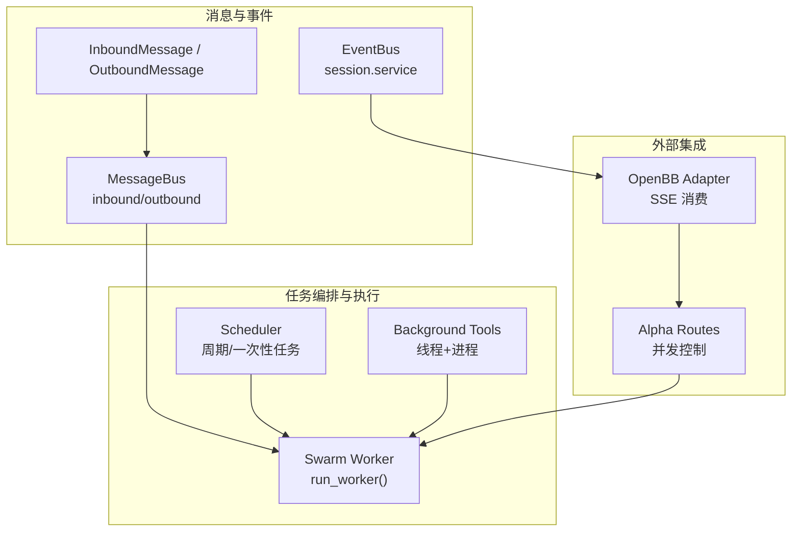
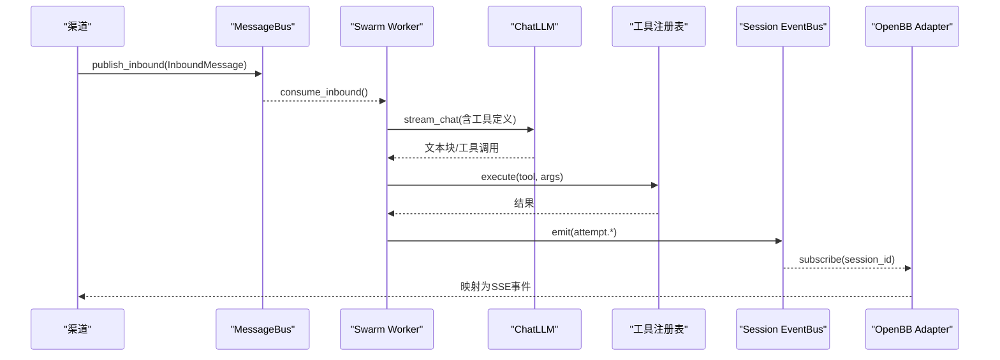
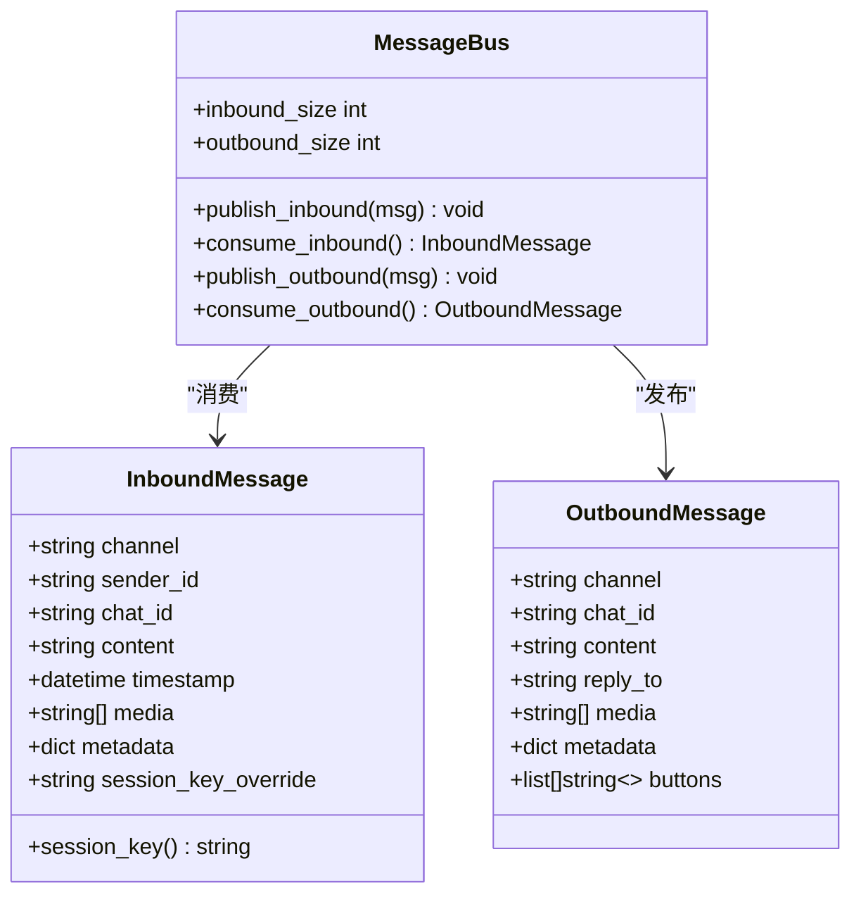
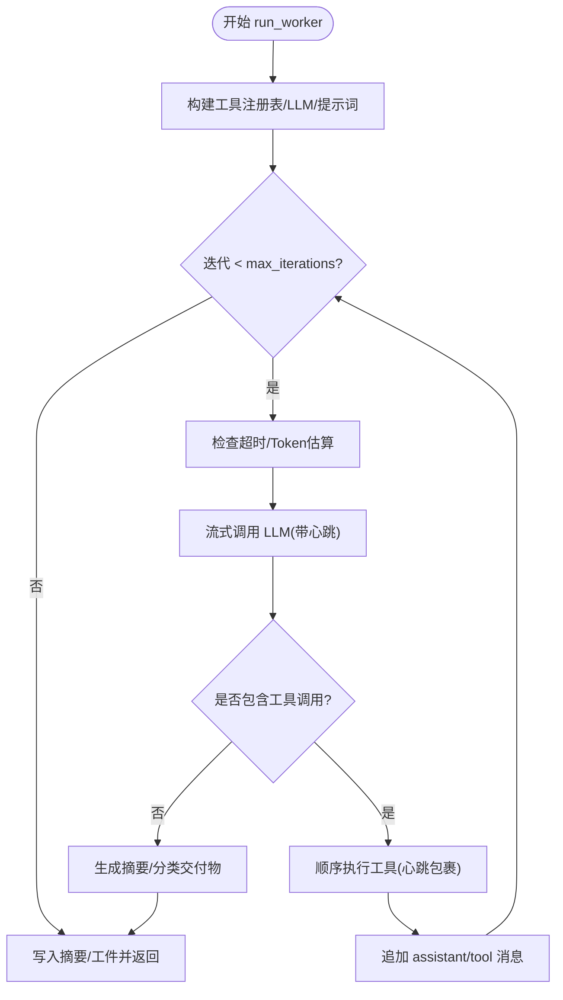
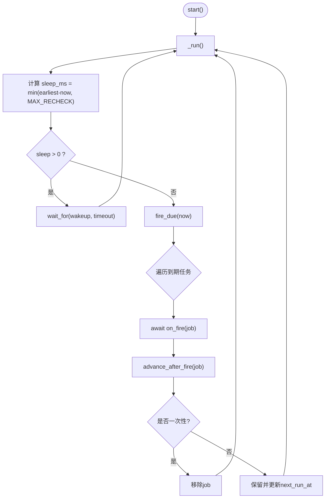
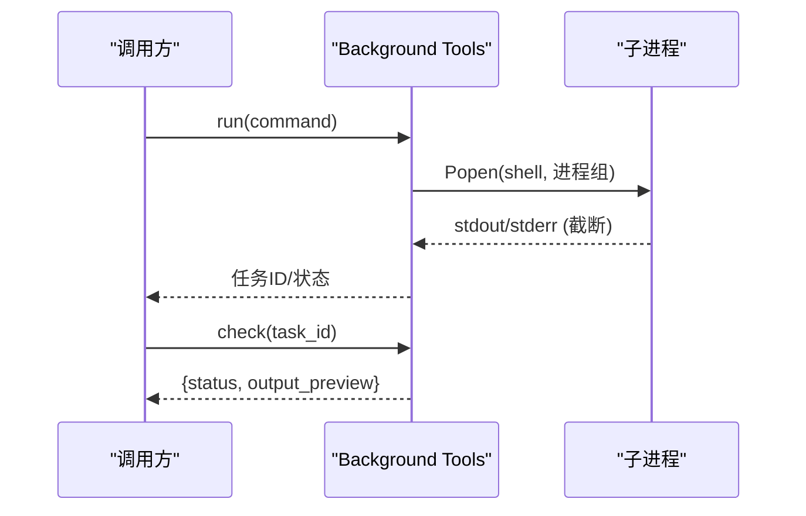
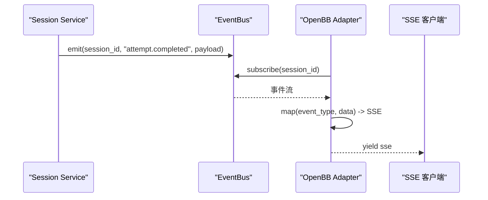
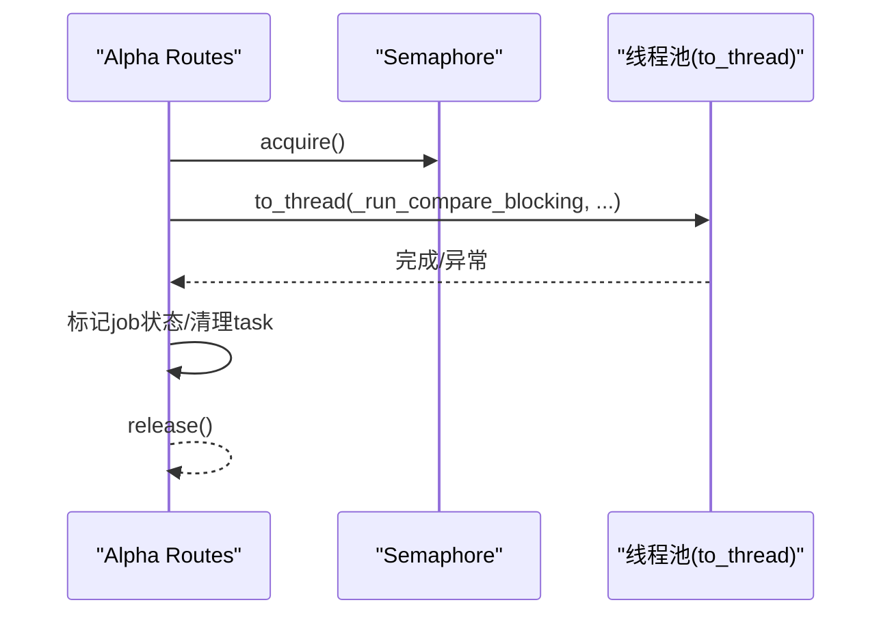
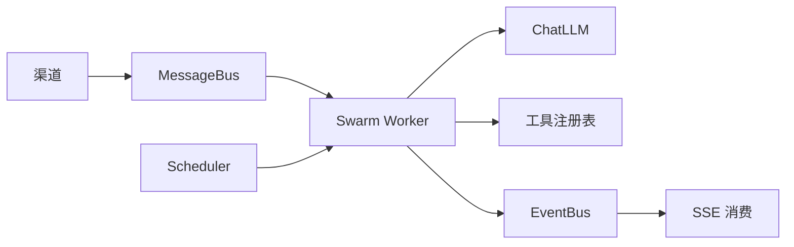

# 任务队列系统

<cite>
**本文引用的文件**
- [agent/src/channels/bus/queue.py](file://agent/src/channels/bus/queue.py)
- [agent/src/channels/bus/events.py](file://agent/src/channels/bus/events.py)
- [agent/src/channels/bus/__init__.py](file://agent/src/channels/bus/__init__.py)
- [agent/src/swarm/worker.py](file://agent/src/swarm/worker.py)
- [agent/src/live/runtime/scheduler.py](file://agent/src/live/runtime/scheduler.py)
- [agent/src/session/service.py](file://agent/src/session/service.py)
- [agent/src/openbb_bridge/adapter.py](file://agent/src/openbb_bridge/adapter.py)
- [agent/src/tools/background_tools.py](file://agent/src/tools/background_tools.py)
- [agent/src/api/alpha_routes.py](file://agent/src/api/alpha_routes.py)
</cite>

## 目录
1. [简介](#简介)
2. [项目结构](#项目结构)
3. [核心组件](#核心组件)
4. [架构总览](#架构总览)
5. [详细组件分析](#详细组件分析)
6. [依赖关系分析](#依赖关系分析)
7. [性能考虑](#性能考虑)
8. [故障排查指南](#故障排查指南)
9. [结论](#结论)
10. [附录](#附录)

## 简介
本文件系统化梳理仓库中的“任务队列系统”，围绕消息队列、生产者-消费者模式、消息路由与负载均衡、任务优先级与调度、资源分配、分布式处理（分区、聚合、故障转移）、典型使用案例，以及监控与性能优化进行说明。该系统的核心由异步消息总线、Swarm Worker 执行引擎、定时调度器、后台任务工具、事件总线与 SSE 流式消费等模块组成，形成从消息入队、任务编排、执行到结果回传的完整闭环。

## 项目结构
- 消息总线与事件模型：位于 channels/bus，提供 InboundMessage/OutboundMessage 与 MessageBus 异步队列，解耦渠道与 Agent 核心。
- 任务执行与编排：swarm/worker 实现轻量 ReAct 循环，负责 LLM 调用、工具执行、超时/重试/心跳、产物写入与事件上报。
- 定时调度：live/runtime/scheduler 提供内存中基于时间片的任务调度，支持周期/一次性任务与可插拔 now_fn。
- 后台任务：tools/background_tools 提供线程化进程执行与通知队列，用于长耗时命令的异步运行与状态查询。
- 事件流与消费：session/service 通过 event_bus 广播尝试生命周期事件；openbb_bridge/adapter 订阅 session 事件并映射为 SSE 推送。
- API 并发控制：api/alpha_routes 使用信号量与 asyncio.to_thread 将阻塞计算放入线程池，避免阻塞事件循环。

图表来源
- [agent/src/channels/bus/queue.py:8-44](file://agent/src/channels/bus/queue.py#L8-L44)
- [agent/src/channels/bus/events.py:20-55](file://agent/src/channels/bus/events.py#L20-L55)
- [agent/src/swarm/worker.py:375-800](file://agent/src/swarm/worker.py#L375-L800)
- [agent/src/live/runtime/scheduler.py:178-329](file://agent/src/live/runtime/scheduler.py#L178-L329)
- [agent/src/tools/background_tools.py:1-46](file://agent/src/tools/background_tools.py#L1-L46)
- [agent/src/session/service.py:317-342](file://agent/src/session/service.py#L317-L342)
- [agent/src/openbb_bridge/adapter.py:127-166](file://agent/src/openbb_bridge/adapter.py#L127-L166)
- [agent/src/api/alpha_routes.py:623-650](file://agent/src/api/alpha_routes.py#L623-L650)

章节来源
- [agent/src/channels/bus/__init__.py:1-7](file://agent/src/channels/bus/__init__.py#L1-L7)
- [agent/src/channels/bus/queue.py:8-44](file://agent/src/channels/bus/queue.py#L8-L44)
- [agent/src/channels/bus/events.py:20-55](file://agent/src/channels/bus/events.py#L20-L55)

## 核心组件
- 异步消息总线（MessageBus）：封装 inbound/outbound 两个 asyncio.Queue，提供 publish/consume 接口，暴露队列长度用于监控。
- 事件模型（InboundMessage/OutboundMessage）：定义渠道消息的结构、会话键、媒体与元数据；OutboundMessage 支持按钮与结构化 UI 元数据。
- Swarm Worker：独立执行单元，构建工具注册表、LLM 客户端、系统提示词，进入 ReAct 循环，管理超时、令牌估算、内容过滤熔断、心跳与重试，产出摘要与工件。
- 定时调度器（Scheduler）：内存 Job 集合，按 next_run_at 驱动 on_fire 回调，支持 interval/once 策略，具备最大重检间隔以抵御时钟漂移。
- 后台任务工具：线程启动子进程，跨平台安全终止，限制输出大小与超时，提供任务状态查询。
- 事件总线与 SSE 消费：session.service 在尝试完成时发出 attempt.* 事件；openbb_bridge.adapter 订阅 session 事件并映射为 OpenBB SSE 对象，支持终止事件与去抖。
- API 并发控制：alpha_routes 使用信号量限流与 asyncio.to_thread 将阻塞逻辑移出事件循环，保证高吞吐。

章节来源
- [agent/src/channels/bus/queue.py:8-44](file://agent/src/channels/bus/queue.py#L8-L44)
- [agent/src/channels/bus/events.py:20-55](file://agent/src/channels/bus/events.py#L20-L55)
- [agent/src/swarm/worker.py:375-800](file://agent/src/swarm/worker.py#L375-L800)
- [agent/src/live/runtime/scheduler.py:178-329](file://agent/src/live/runtime/scheduler.py#L178-L329)
- [agent/src/tools/background_tools.py:1-46](file://agent/src/tools/background_tools.py#L1-L46)
- [agent/src/session/service.py:317-342](file://agent/src/session/service.py#L317-L342)
- [agent/src/openbb_bridge/adapter.py:127-166](file://agent/src/openbb_bridge/adapter.py#L127-L166)
- [agent/src/api/alpha_routes.py:623-650](file://agent/src/api/alpha_routes.py#L623-L650)

## 架构总览
下图展示端到端流程：渠道消息经 MessageBus 入队，Agent/Swarm Worker 消费并执行工具与 LLM 调用，结果通过事件总线与 SSE 推送给前端或下游系统；同时 Scheduler 驱动周期性任务，后台工具承载长耗时作业。

图表来源
- [agent/src/channels/bus/queue.py:15-33](file://agent/src/channels/bus/queue.py#L15-L33)
- [agent/src/swarm/worker.py:545-636](file://agent/src/swarm/worker.py#L545-L636)
- [agent/src/session/service.py:317-342](file://agent/src/session/service.py#L317-L342)
- [agent/src/openbb_bridge/adapter.py:127-166](file://agent/src/openbb_bridge/adapter.py#L127-L166)

## 详细组件分析

### 消息总线与事件模型
- 设计要点
  - 双队列隔离入/出站，避免读写竞争，便于分别监控积压。
  - InboundMessage 携带 channel/chat_id/sender_id 与会话键，OutboundMessage 支持 reply_to、media、buttons 与结构化 UI 元数据。
  - 通过 __init__ 统一导出，降低耦合。
- 复杂度与特性
  - 入队/出队 O(1)，qsize 用于监控告警。
  - 无持久化，适合进程内解耦；如需跨进程/持久化需扩展。
- 错误处理
  - 未捕获异常由上层处理；建议对生产/消费侧增加重试与死信队列。

图表来源
- [agent/src/channels/bus/events.py:20-55](file://agent/src/channels/bus/events.py#L20-L55)
- [agent/src/channels/bus/queue.py:8-44](file://agent/src/channels/bus/queue.py#L8-L44)

章节来源
- [agent/src/channels/bus/events.py:20-55](file://agent/src/channels/bus/events.py#L20-L55)
- [agent/src/channels/bus/queue.py:8-44](file://agent/src/channels/bus/queue.py#L8-L44)
- [agent/src/channels/bus/__init__.py:1-7](file://agent/src/channels/bus/__init__.py#L1-L7)

### Swarm Worker 执行引擎
- 设计要点
  - 构建 per-worker 工具注册表与 ChatLLM，组装系统提示词（角色、技能描述、数据引用纪律、执行规则）。
  - ReAct 循环：迭代上限、超时保护、上下文 token 估算、接近上限时的收尾提示。
  - 流式 LLM 调用：带心跳计时器，失败一次重试（可配置延迟），非重试错误直接失败。
  - 工具执行：逐条执行，记录耗时、预览结果、追加 tool 消息；最后迭代强制文本输出。
  - 产物与摘要：写入 artifacts/{agent_id}，收集工件，返回 WorkerResult。
- 复杂度与特性
  - 每次迭代 O(N_tool_calls)，工具执行可能阻塞，使用心跳与超时保障。
  - 内容过滤触发计数与熔断，防止无限循环被拦截。
- 错误处理
  - 模板渲染失败、LLM 调用异常、内容过滤熔断、token 超限均返回明确状态与摘要。

图表来源
- [agent/src/swarm/worker.py:375-800](file://agent/src/swarm/worker.py#L375-L800)

章节来源
- [agent/src/swarm/worker.py:375-800](file://agent/src/swarm/worker.py#L375-L800)

### 定时调度器（Wall-clock Scheduler）
- 设计要点
  - 内存 Job 集合，维护 next_run_at；sleep 至最早到期时间，但受最大重检间隔限制。
  - due_jobs 按 next_run_at 升序返回到期任务；advance_after_fire 更新下次执行时间（一次性任务移除）。
  - 支持注入 now_fn 以便测试确定性。
- 复杂度与特性
  - 查找最早时间 O(N)，排序 O(N log N)；N 为活跃任务数。
  - 健壮性：忽略单次失败，避免单任务拖垮调度循环。
- 错误处理
  - on_fire 抛错仅记录日志，不影响其他任务。

图表来源
- [agent/src/live/runtime/scheduler.py:178-329](file://agent/src/live/runtime/scheduler.py#L178-L329)

章节来源
- [agent/src/live/runtime/scheduler.py:178-329](file://agent/src/live/runtime/scheduler.py#L178-L329)

### 后台任务工具（长耗时命令）
- 设计要点
  - 线程启动子进程，跨平台设置进程组，支持 POSIX 组信号终止。
  - 限制输出字符数与命令超时，避免内存膨胀与僵尸进程。
- 复杂度与特性
  - 启动与终止为 O(1)，I/O 受限缓冲。
- 错误处理
  - 宽泛杀进程命令被拒绝，防止误伤；异常在回调中记录。

图表来源
- [agent/src/tools/background_tools.py:1-46](file://agent/src/tools/background_tools.py#L1-L46)

章节来源
- [agent/src/tools/background_tools.py:1-46](file://agent/src/tools/background_tools.py#L1-L46)

### 事件总线与 SSE 消费
- 设计要点
  - session.service 在尝试结束时发出 attempt.* 事件，携带状态、摘要、错误、运行时元数据。
  - openbb_bridge.adapter 订阅 session 事件，过滤心跳与不同 attempt_id 的尾随事件，映射为 OpenBB SSE 对象，遇到终止事件则 finalize。
- 复杂度与特性
  - 订阅为异步生成器，按需拉取；SSE 映射开销低。
- 错误处理
  - 忽略不匹配 attempt_id 的事件，避免乱序污染。

图表来源
- [agent/src/session/service.py:317-342](file://agent/src/session/service.py#L317-L342)
- [agent/src/openbb_bridge/adapter.py:127-166](file://agent/src/openbb_bridge/adapter.py#L127-L166)

章节来源
- [agent/src/session/service.py:317-342](file://agent/src/session/service.py#L317-L342)
- [agent/src/openbb_bridge/adapter.py:127-166](file://agent/src/openbb_bridge/adapter.py#L127-L166)

### API 并发控制（批量数据处理）
- 设计要点
  - 使用信号量限制并发，将阻塞函数通过 asyncio.to_thread 放入线程池执行，避免阻塞事件循环。
  - 任务完成后清理 running tasks 集合，标记 job 状态。
- 复杂度与特性
  - 并发度可控，背压自然形成；适合批量比较/计算类任务。
- 错误处理
  - 外层 try/except 捕获异常并落盘错误状态，保证任务可见性。

图表来源
- [agent/src/api/alpha_routes.py:623-650](file://agent/src/api/alpha_routes.py#L623-L650)

章节来源
- [agent/src/api/alpha_routes.py:623-650](file://agent/src/api/alpha_routes.py#L623-L650)

## 依赖关系分析
- 松耦合
  - MessageBus 与渠道/Agent 解耦；Swarm Worker 通过 ToolRegistry 与 ChatLLM 抽象；Scheduler 通过 on_fire 回调与业务解耦。
- 关键依赖链
  - 渠道 → MessageBus → Swarm Worker → ChatLLM/Tools → EventBus → SSE。
  - Scheduler → on_fire → 业务任务（可复用 Swarm Worker 或自定义）。
- 潜在环与风险
  - 当前未见循环依赖；需注意 EventBus 与 SSE 消费端的背压与重试策略。

图表来源
- [agent/src/channels/bus/queue.py:8-44](file://agent/src/channels/bus/queue.py#L8-L44)
- [agent/src/swarm/worker.py:375-800](file://agent/src/swarm/worker.py#L375-L800)
- [agent/src/live/runtime/scheduler.py:178-329](file://agent/src/live/runtime/scheduler.py#L178-L329)
- [agent/src/session/service.py:317-342](file://agent/src/session/service.py#L317-L342)
- [agent/src/openbb_bridge/adapter.py:127-166](file://agent/src/openbb_bridge/adapter.py#L127-L166)

## 性能考虑
- 吞吐量调优
  - 使用 asyncio.Queue 作为无锁队列，O(1) 入队出队；合理设置消费者数量与批处理窗口。
  - API 层通过信号量限制并发，避免过载；长耗时任务走线程池，减少事件循环阻塞。
- 延迟优化
  - 流式 LLM 调用配合心跳计时器，提升首字节延迟感知；接近迭代上限时注入收尾提示，缩短尾部延迟。
  - 调度器最大重检间隔避免长时间休眠导致的响应滞后。
- 内存使用优化
  - 定期清理历史 tool 消息内容，控制上下文体积；限制后台任务输出大小，防止内存膨胀。
  - 产物写入 artifacts 目录，避免在消息体中传递大对象。
- 资源分配策略
  - Swarm Worker 每实例独立上下文与工件目录，天然隔离；可通过进程/容器级限制 CPU/内存。
  - 后台任务使用进程组隔离，支持安全终止。

[本节为通用指导，不直接分析具体文件]

## 故障排查指南
- 常见问题定位
  - 消息积压：检查 MessageBus.inbound_size/outbound_size，确认消费者是否阻塞。
  - 任务超时：关注 Swarm Worker 的超时分支与心跳事件，核对工具耗时与 LLM 首字节延迟。
  - 内容过滤熔断：当连续多次被内容过滤阻断时，会触发熔断并返回失败状态。
  - 调度失效：检查 Scheduler 的 on_fire 异常日志与最大重检间隔配置。
  - 后台任务卡死：确认进程组信号发送与超时设置，必要时手动终止进程树。
- 建议措施
  - 为关键路径添加指标采集（队列长度、P95/P99 延迟、错误率）。
  - 对不可重试错误快速失败，对可重试错误实施指数退避。
  - 对长任务启用进度上报与取消机制。

章节来源
- [agent/src/swarm/worker.py:494-531](file://agent/src/swarm/worker.py#L494-L531)
- [agent/src/swarm/worker.py:647-689](file://agent/src/swarm/worker.py#L647-L689)
- [agent/src/live/runtime/scheduler.py:313-329](file://agent/src/live/runtime/scheduler.py#L313-L329)
- [agent/src/tools/background_tools.py:1-46](file://agent/src/tools/background_tools.py#L1-L46)

## 结论
本任务队列系统以异步消息总线为核心，结合 Swarm Worker 的 ReAct 执行引擎、内存调度器与后台任务工具，实现了高内聚、低耦合的任务处理链路。通过流式 LLM 调用、心跳与超时保护、内容过滤熔断、事件总线与 SSE 消费，系统在可靠性与可观测性方面具备良好基础。在生产环境中，建议进一步引入持久化队列、优先级队列、幂等与补偿机制，并结合指标与告警完善运维体系。

## 附录
- 典型用例
  - 批量数据处理：通过 API 层信号量限流与线程池执行，避免阻塞事件循环。
  - 异步任务执行：使用后台任务工具运行长耗时命令，提供状态查询与终止能力。
  - 事件驱动架构：渠道消息经 MessageBus 入队，Swarm Worker 处理后通过 EventBus 与 SSE 推送结果。
- 扩展建议
  - 优先级队列：在 MessageBus 之上封装优先级队列，支持紧急任务优先。
  - 分布式处理：引入消息中间件（如 Redis/RabbitMQ/Kafka）实现跨进程/跨节点分发与持久化。
  - 结果聚合：在汇聚节点按任务 ID 聚合多 Worker 结果，支持最终一致性。
  - 故障转移：结合健康检查与重试策略，实现 Worker 故障自动迁移。

[本节为概念性内容，不直接分析具体文件]