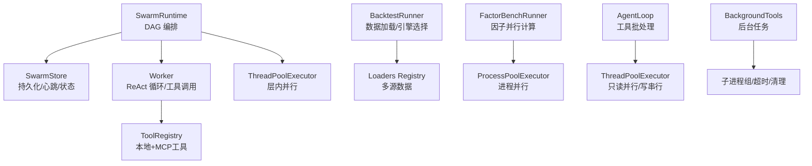
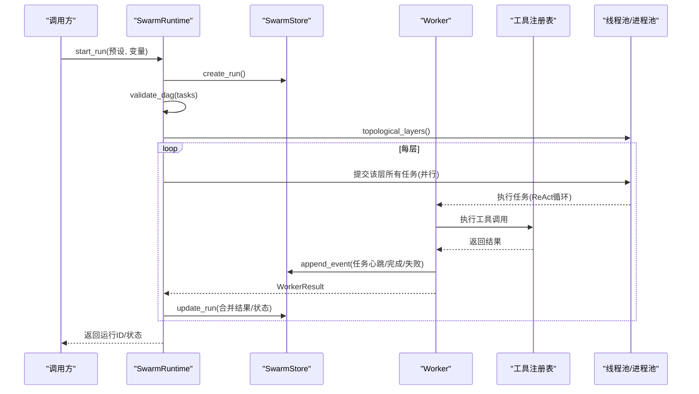
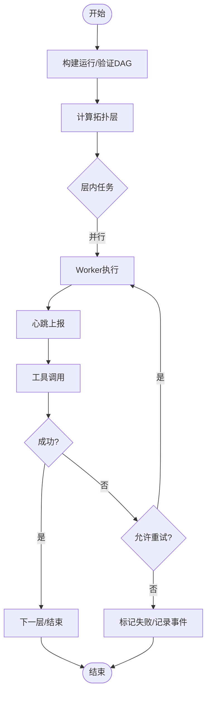
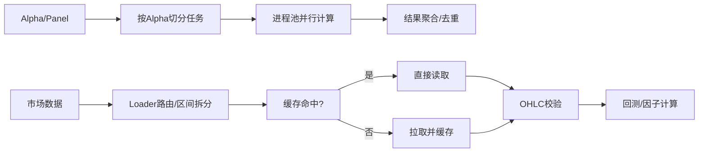
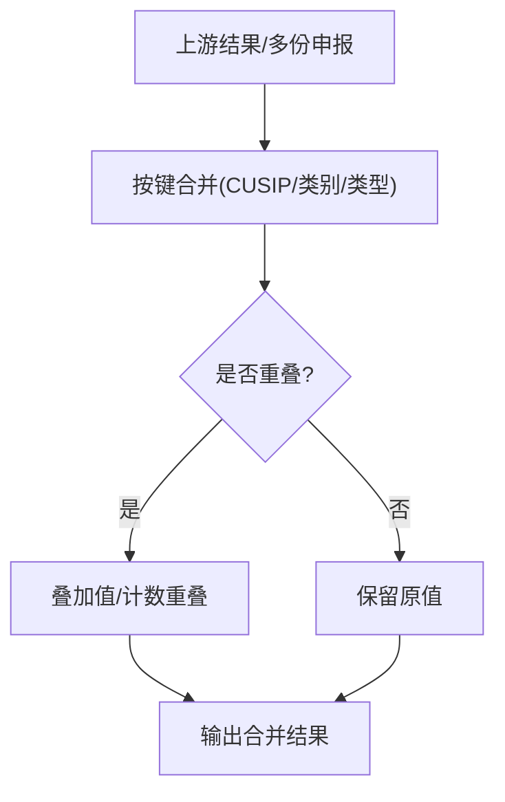
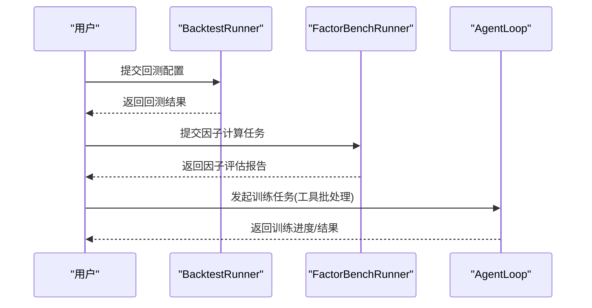
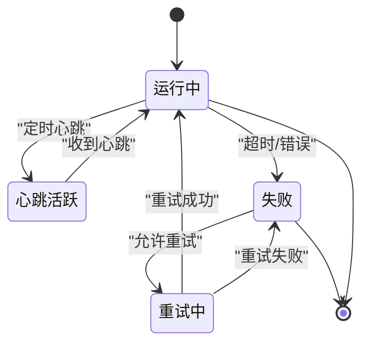
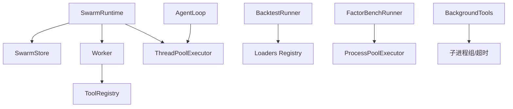

# 分布式计算架构

<cite>
**本文引用的文件**
- [README.md](file://README.md)
- [pyproject.toml](file://pyproject.toml)
- [agent/src/swarm/runtime.py](file://agent/src/swarm/runtime.py)
- [agent/src/swarm/store.py](file://agent/src/swarm/store.py)
- [agent/src/swarm/worker.py](file://agent/src/swarm/worker.py)
- [agent/src/swarm/__init__.py](file://agent/src/swarm/__init__.py)
- [agent/backtest/runner.py](file://agent/backtest/runner.py)
- [agent/src/factors/bench_runner.py](file://agent/src/factors/bench_runner.py)
- [agent/src/tools/background_tools.py](file://agent/src/tools/background_tools.py)
- [agent/src/agent/loop.py](file://agent/src/agent/loop.py)
</cite>

## 目录
1. [简介](#简介)
2. [项目结构](#项目结构)
3. [核心组件](#核心组件)
4. [架构总览](#架构总览)
5. [详细组件分析](#详细组件分析)
6. [依赖关系分析](#依赖关系分析)
7. [性能考量](#性能考量)
8. [故障排查指南](#故障排查指南)
9. [结论](#结论)
10. [附录](#附录)

## 简介
本指南面向需要在金融量化场景中构建与运维分布式计算系统的工程师，围绕工作节点管理、数据分区策略、结果聚合机制、典型分布式案例以及容错恢复等主题展开。结合仓库中的多智能体编排（Swarm）、回测执行器、因子并行计算、后台任务与工具批处理等实现，提供从架构到落地的系统化说明。

## 项目结构
本项目以“可插拔的数据源 + 可组合的回测引擎 + 多智能体编排”为核心：
- 多智能体编排层：通过 DAG 将多个 Agent 任务分层并行执行，支持心跳检测、超时控制、重试与事件上报。
- 回测执行层：统一加载市场数据、校验信号引擎、运行不同市场/品种的回测引擎。
- 因子计算层：对 Alpha Zoo 的因子进行面板计算，支持进程级并行。
- 工具与后台任务：支持只读工具批量并行、写操作串行化，以及后台命令执行与通知队列。

图表来源
- [agent/src/swarm/runtime.py:53-159](file://agent/src/swarm/runtime.py#L53-L159)
- [agent/src/swarm/store.py:301-324](file://agent/src/swarm/store.py#L301-L324)
- [agent/src/swarm/worker.py:375-800](file://agent/src/swarm/worker.py#L375-L800)
- [agent/backtest/runner.py:1-125](file://agent/backtest/runner.py#L1-L125)
- [agent/src/factors/bench_runner.py:208-247](file://agent/src/factors/bench_runner.py#L208-L247)
- [agent/src/agent/loop.py:2588-2692](file://agent/src/agent/loop.py#L2588-L2692)
- [agent/src/tools/background_tools.py:24-46](file://agent/src/tools/background_tools.py#L24-L46)

章节来源
- [README.md](file://README.md)
- [pyproject.toml:1-80](file://pyproject.toml#L1-L80)

## 核心组件
- SwarmRuntime：负责创建运行、解析预设、验证 DAG、按拓扑层调度任务、并发执行、事件上报与取消。
- SwarmStore：负责运行与任务持久化、事件追加、过期运行回收与“陈旧阈值”判定。
- Worker：单任务 ReAct 循环，构建系统提示、流式调用 LLM、执行工具、写入摘要与产物、统计 token 用量。
- BacktestRunner：读取配置、选择数据源与引擎、校验信号引擎、运行回测。
- FactorBenchRunner：对因子进行面板计算，支持进程池并行。
- AgentLoop：工具调用批处理，只读并行、写串行，提升吞吐并保证一致性。
- BackgroundTools：后台任务启动、进程组管理与超时清理。

章节来源
- [agent/src/swarm/runtime.py:53-159](file://agent/src/swarm/runtime.py#L53-L159)
- [agent/src/swarm/store.py:301-324](file://agent/src/swarm/store.py#L301-L324)
- [agent/src/swarm/worker.py:375-800](file://agent/src/swarm/worker.py#L375-L800)
- [agent/backtest/runner.py:1-125](file://agent/backtest/runner.py#L1-L125)
- [agent/src/factors/bench_runner.py:208-247](file://agent/src/factors/bench_runner.py#L208-L247)
- [agent/src/agent/loop.py:2588-2692](file://agent/src/agent/loop.py#L2588-L2692)
- [agent/src/tools/background_tools.py:24-46](file://agent/src/tools/background_tools.py#L24-L46)

## 架构总览
下图展示从用户触发到任务执行的端到端流程，包括 DAG 编排、层内并行、心跳与事件上报、失败重试与结果聚合。

图表来源
- [agent/src/swarm/runtime.py:90-159](file://agent/src/swarm/runtime.py#L90-L159)
- [agent/src/swarm/store.py:301-324](file://agent/src/swarm/store.py#L301-L324)
- [agent/src/swarm/worker.py:375-800](file://agent/src/swarm/worker.py#L375-L800)

## 详细组件分析

### 工作节点管理（发现、负载均衡、故障检测）
- 节点发现与编排
  - 通过预设构建 SwarmRun，包含 agents 与 tasks；DAG 校验确保依赖正确。
  - 按拓扑层组织任务，层内并行、层间串行，天然实现负载均衡与资源隔离。
- 心跳检测与故障检测
  - Worker 在 LLM 流式调用与工具执行期间周期性发送心跳事件，避免被误判为卡死。
  - Store 根据心跳间隔计算“陈旧阈值”，用于回收长时间无进展的运行。
- 超时与重试
  - Worker 支持最大迭代次数与超时时间；失败时可在上层进行重试（由运行时或外部逻辑驱动）。
  - 流式调用失败仅重试一次，避免雪崩。

图表来源
- [agent/src/swarm/runtime.py:222-519](file://agent/src/swarm/runtime.py#L222-L519)
- [agent/src/swarm/store.py:301-324](file://agent/src/swarm/store.py#L301-L324)
- [agent/src/swarm/worker.py:470-636](file://agent/src/swarm/worker.py#L470-L636)

章节来源
- [agent/src/swarm/runtime.py:90-159](file://agent/src/swarm/runtime.py#L90-L159)
- [agent/src/swarm/store.py:301-324](file://agent/src/swarm/store.py#L301-L324)
- [agent/src/swarm/worker.py:470-636](file://agent/src/swarm/worker.py#L470-L636)

### 数据分区策略（分片、副本、一致性）
- 数据分片
  - 回测 Runner 通过 loaders registry 按符号与市场路由到具体数据源，支持自动源选择与区间划分。
  - 因子 Bench 使用面板数据（close/open/high/low/volume），按 alpha 维度切分任务，进程级并行计算。
- 副本管理
  - 数据缓存开关启用后，历史K线在本地缓存命中可跳过网络请求，减少重复下载与速率限制。
- 一致性保证
  - OHLC 完整性校验在 loader 边界集中进行，丢弃异常行，保障下游计算一致。
  - 回测配置严格校验日期、区间、初始资金等，防止非法输入导致指标异常。

图表来源
- [agent/backtest/runner.py:1-125](file://agent/backtest/runner.py#L1-L125)
- [agent/src/factors/bench_runner.py:208-247](file://agent/src/factors/bench_runner.py#L208-L247)

章节来源
- [agent/backtest/runner.py:1-125](file://agent/backtest/runner.py#L1-L125)
- [agent/src/factors/bench_runner.py:208-247](file://agent/src/factors/bench_runner.py#L208-L247)

### 结果聚合机制（归约、合并、冲突解决）
- 归约操作
  - 因子 Bench 汇总每个 alpha 的评估指标，按 IC均值/IR/胜率等排序，形成对比报告。
- 合并策略
  - 机构持仓工具中，对同一证券的多份申报（原始/修订/新增）进行合并，按美元价值对齐并处理重叠项。
- 冲突解决
  - 当新旧持仓存在重叠时，按“新增持有”语义求和并计数重叠，供调用方审计。

图表来源
- [agent/src/tools/institutional_holdings_tool.py:1114-1148](file://agent/src/tools/institutional_holdings_tool.py#L1114-L1148)

章节来源
- [agent/src/tools/institutional_holdings_tool.py:1114-1148](file://agent/src/tools/institutional_holdings_tool.py#L1114-L1148)

### 分布式计算案例
- 大规模回测
  - 通过 BacktestRunner 统一加载数据、选择引擎、校验信号引擎并执行回测；支持多种市场与周期。
- 因子库并行计算
  - 使用 FactorBenchRunner 对 Alpha Zoo 因子进行面板计算，进程池并行，按 worker 数量扩展吞吐。
- 机器学习模型训练
  - 可通过 AgentLoop 的工具批处理将只读数据获取并行化，写操作串行化，配合后台任务执行训练脚本。

图表来源
- [agent/backtest/runner.py:1-125](file://agent/backtest/runner.py#L1-L125)
- [agent/src/factors/bench_runner.py:208-247](file://agent/src/factors/bench_runner.py#L208-L247)
- [agent/src/agent/loop.py:2588-2692](file://agent/src/agent/loop.py#L2588-L2692)

章节来源
- [agent/backtest/runner.py:1-125](file://agent/backtest/runner.py#L1-L125)
- [agent/src/factors/bench_runner.py:208-247](file://agent/src/factors/bench_runner.py#L208-L247)
- [agent/src/agent/loop.py:2588-2692](file://agent/src/agent/loop.py#L2588-L2692)

### 容错与恢复（心跳、重试、备份）
- 心跳检测
  - Worker 在 LLM 流式调用与工具执行期间持续发送心跳事件，避免被误判为停滞。
- 任务重试
  - 运行时支持层内任务失败后的重试策略（由上层或配置驱动），并在重试前清理工件以避免污染。
- 数据备份
  - 运行与事件持久化到 Store，支持查询与恢复；可选数据缓存降低网络依赖与速率限制风险。

图表来源
- [agent/src/swarm/worker.py:470-636](file://agent/src/swarm/worker.py#L470-L636)
- [agent/src/swarm/store.py:301-324](file://agent/src/swarm/store.py#L301-L324)

章节来源
- [agent/src/swarm/worker.py:470-636](file://agent/src/swarm/worker.py#L470-L636)
- [agent/src/swarm/store.py:301-324](file://agent/src/swarm/store.py#L301-L324)

## 依赖关系分析
- 模块耦合
  - SwarmRuntime 依赖 SwarmStore、TaskStore、Worker 与 ThreadPoolExecutor，承担编排职责。
  - Worker 依赖工具注册表与 LLM 客户端，负责单任务执行。
  - BacktestRunner 依赖 loaders registry 与 engines，负责数据与引擎选择。
  - FactorBenchRunner 依赖进程池与面板数据，负责因子并行计算。
  - AgentLoop 依赖工具注册表与线程池，负责工具批处理。
  - BackgroundTools 依赖子进程组与超时控制，负责后台任务。

图表来源
- [agent/src/swarm/runtime.py:53-159](file://agent/src/swarm/runtime.py#L53-L159)
- [agent/src/swarm/worker.py:375-800](file://agent/src/swarm/worker.py#L375-L800)
- [agent/backtest/runner.py:1-125](file://agent/backtest/runner.py#L1-L125)
- [agent/src/factors/bench_runner.py:208-247](file://agent/src/factors/bench_runner.py#L208-L247)
- [agent/src/agent/loop.py:2588-2692](file://agent/src/agent/loop.py#L2588-L2692)
- [agent/src/tools/background_tools.py:24-46](file://agent/src/tools/background_tools.py#L24-L46)

章节来源
- [agent/src/swarm/runtime.py:53-159](file://agent/src/swarm/runtime.py#L53-L159)
- [agent/src/swarm/worker.py:375-800](file://agent/src/swarm/worker.py#L375-L800)
- [agent/backtest/runner.py:1-125](file://agent/backtest/runner.py#L1-L125)
- [agent/src/factors/bench_runner.py:208-247](file://agent/src/factors/bench_runner.py#L208-L247)
- [agent/src/agent/loop.py:2588-2692](file://agent/src/agent/loop.py#L2588-L2692)
- [agent/src/tools/background_tools.py:24-46](file://agent/src/tools/background_tools.py#L24-L46)

## 性能考量
- 并行度调优
  - SwarmRuntime 层内并行度受 max_workers 限制；AgentLoop 只读工具批处理默认最多 8 个并发。
  - FactorBenchRunner 使用进程池并行，worker 数可由环境变量控制，需结合 CPU 核数与内存容量调整。
- 数据访问优化
  - 启用数据缓存可减少重复下载与网络抖动；loader 边界进行 OHLC 校验，避免脏数据影响计算。
- 资源隔离与安全
  - 信号引擎执行前进行 AST 扫描，拒绝危险导入与文件系统写入，保障回测安全。
  - 后台任务使用进程组管理，支持超时与优雅终止，避免僵尸进程。

章节来源
- [agent/src/swarm/runtime.py:53-159](file://agent/src/swarm/runtime.py#L53-L159)
- [agent/src/agent/loop.py:2588-2692](file://agent/src/agent/loop.py#L2588-L2692)
- [agent/src/factors/bench_runner.py:208-247](file://agent/src/factors/bench_runner.py#L208-L247)
- [agent/backtest/runner.py:215-817](file://agent/backtest/runner.py#L215-L817)
- [agent/src/tools/background_tools.py:24-46](file://agent/src/tools/background_tools.py#L24-L46)

## 故障排查指南
- 运行卡死或无进展
  - 检查心跳事件是否持续产生；若长时间无心跳，可能为 LLM 流式首包延迟或工具阻塞。
  - 查看 Store 的“陈旧阈值”判定逻辑，确认是否因配置不当导致误判。
- 任务失败与重试
  - 关注 Worker 的事件日志，定位失败阶段（LLM 调用/工具执行/超时）。
  - 重试前确保清理工件目录，避免旧结果污染新尝试。
- 数据不一致
  - 检查 loader 的 OHLC 校验是否放行异常行；确认缓存是否命中旧数据。
  - 对于机构持仓合并，核对重叠项计数与合并策略是否符合预期。

章节来源
- [agent/src/swarm/store.py:301-324](file://agent/src/swarm/store.py#L301-L324)
- [agent/src/swarm/worker.py:470-636](file://agent/src/swarm/worker.py#L470-L636)
- [agent/src/tools/institutional_holdings_tool.py:1114-1148](file://agent/src/tools/institutional_holdings_tool.py#L1114-L1148)

## 结论
本架构通过“DAG 编排 + 层内并行 + 心跳检测 + 持久化存储”实现了高可用、可扩展的分布式计算能力。结合回测执行器与因子并行计算，能够支撑大规模量化研究与生产级任务。建议在部署时合理设置并行度、缓存与超时参数，并结合心跳与事件日志进行监控与排障。

## 附录
- 安装与环境
  - 项目依赖与入口脚本定义于 pyproject.toml，支持 CLI 与 MCP 服务。
- 参考文档
  - README 提供了功能概览与更新日志，可作为快速了解项目能力的入口。

章节来源
- [pyproject.toml:1-80](file://pyproject.toml#L1-L80)
- [README.md](file://README.md)