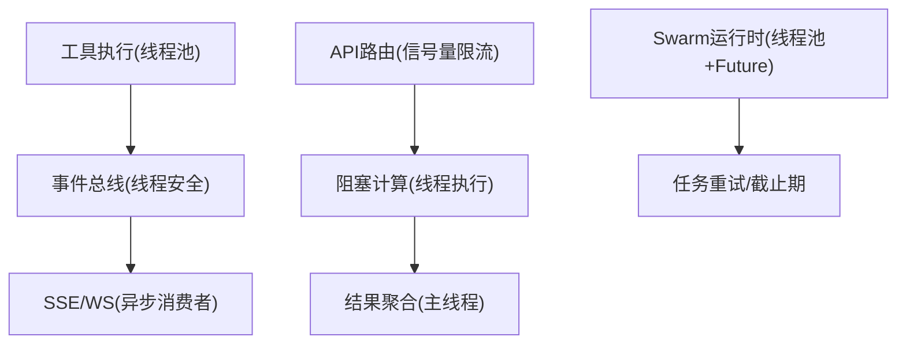
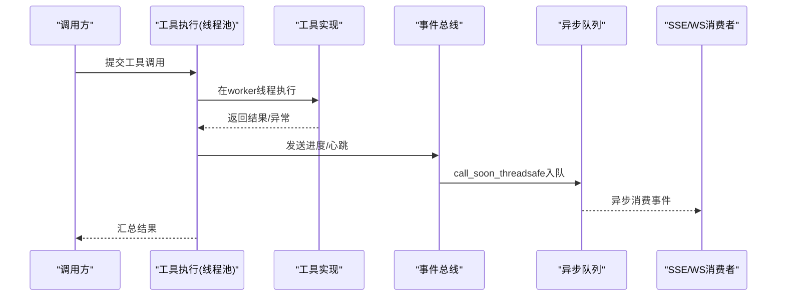
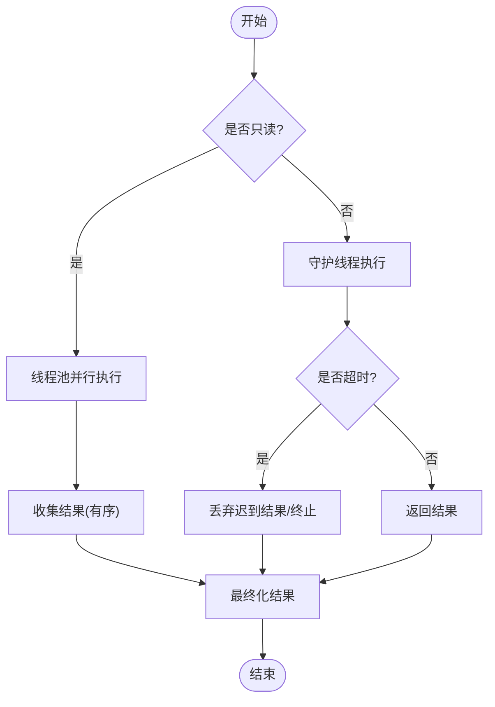
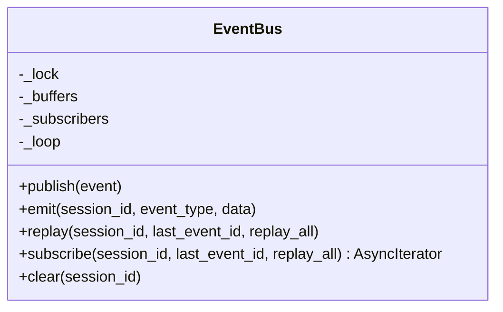
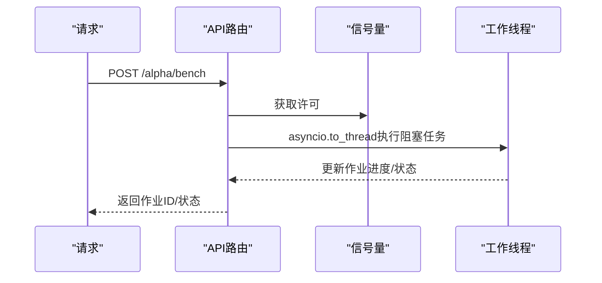
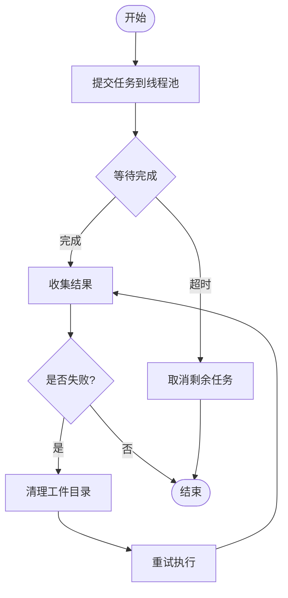
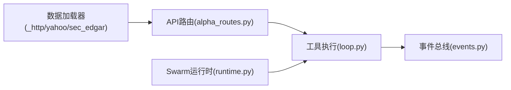

# 多线程并发处理

<cite>
**本文引用的文件**
- [agent/src/agent/loop.py](file://agent/src/agent/loop.py)
- [agent/src/session/events.py](file://agent/src/session/events.py)
- [agent/src/api/alpha_routes.py](file://agent/src/api/alpha_routes.py)
- [agent/src/swarm/runtime.py](file://agent/src/swarm/runtime.py)
- [agent/src/tools/mcp.py](file://agent/src/tools/mcp.py)
- [agent/backtest/loaders/_http.py](file://agent/backtest/loaders/_http.py)
- [agent/backtest/loaders/sec_edgar_client.py](file://agent/backtest/loaders/sec_edgar_client.py)
- [agent/backtest/loaders/yahoo_client.py](file://agent/backtest/loaders/yahoo_client.py)
</cite>

## 目录
1. [简介](#简介)
2. [项目结构](#项目结构)
3. [核心组件](#核心组件)
4. [架构总览](#架构总览)
5. [详细组件分析](#详细组件分析)
6. [依赖关系分析](#依赖关系分析)
7. [性能考量](#性能考量)
8. [故障排查指南](#故障排查指南)
9. [结论](#结论)
10. [附录](#附录)

## 简介
本指南围绕本项目中的多线程与异步并发实践，系统阐述线程安全设计模式、同步策略、死锁预防、异步I/O模式（协程与事件循环）、线程池管理（生命周期、任务队列、优先级调度），并结合数据加载、网络请求、文件I/O等实际场景给出优化建议。同时提供监控与调试要点，帮助在生产环境中稳定运行高并发服务。

## 项目结构
本项目在多个子系统内采用“线程 + 协程”的混合并发模型：
- 工具执行层：使用线程池并行执行只读工具调用，配合心跳与进度上报，保证可观测性与超时控制。
- 会话事件总线：线程安全的事件发布/订阅，跨线程将事件投递到异步队列，支持重放与心跳。
- API层：通过信号量限制重型计算任务的并发度，避免资源耗尽；阻塞型计算放入线程执行，避免阻塞事件循环。
- 工作流编排：基于线程池与Future集合实现分层执行、硬截止期与失败重试，保障整体SLA。
- 数据加载器：为HTTP客户端与会话缓存引入细粒度锁，确保并发安全。

图表来源
- [agent/src/agent/loop.py:2680-2875](file://agent/src/agent/loop.py#L2680-L2875)
- [agent/src/session/events.py:87-125](file://agent/src/session/events.py#L87-L125)
- [agent/src/api/alpha_routes.py:60-95](file://agent/src/api/alpha_routes.py#L60-L95)
- [agent/src/swarm/runtime.py:590-645](file://agent/src/swarm/runtime.py#L590-L645)

章节来源
- [agent/src/agent/loop.py:2680-2875](file://agent/src/agent/loop.py#L2680-L2875)
- [agent/src/session/events.py:87-125](file://agent/src/session/events.py#L87-L125)
- [agent/src/api/alpha_routes.py:60-95](file://agent/src/api/alpha_routes.py#L60-L95)
- [agent/src/swarm/runtime.py:590-645](file://agent/src/swarm/runtime.py#L590-L645)

## 核心组件
- 工具执行与并发：
  - 使用线程池并行执行多个只读工具调用，限制最大并发数，统一收集结果并按序处理。
  - 对写操作工具采用守护线程隔离执行，结合Event与Queue实现超时与结果回传，避免阻塞主流程。
- 事件总线：
  - 线程安全的发布接口，内部维护每会话缓冲与订阅队列；从任意线程安全地将事件投递到异步队列。
  - 支持重放历史事件与心跳保活，断线恢复更稳健。
- API并发控制：
  - 针对重型计算（如因子基准测试）使用进程级信号量限制并发，避免DoS与资源争用。
  - 阻塞型计算通过线程执行，释放事件循环以维持响应性。
- Swarm工作流：
  - 基于线程池与Future集合进行分层执行，设置层级别截止期，捕获异常并标记超时。
  - 自动重试机制清理中间产物，累计token统计，增强鲁棒性。
- 数据加载器并发安全：
  - HTTP客户端与会话缓存使用互斥锁保护共享状态，防止竞态条件。

章节来源
- [agent/src/agent/loop.py:2680-2875](file://agent/src/agent/loop.py#L2680-L2875)
- [agent/src/session/events.py:87-265](file://agent/src/session/events.py#L87-L265)
- [agent/src/api/alpha_routes.py:60-259](file://agent/src/api/alpha_routes.py#L60-L259)
- [agent/src/swarm/runtime.py:590-769](file://agent/src/swarm/runtime.py#L590-L769)
- [agent/backtest/loaders/_http.py:58-115](file://agent/backtest/loaders/_http.py#L58-L115)
- [agent/backtest/loaders/sec_edgar_client.py:60-60](file://agent/backtest/loaders/sec_edgar_client.py#L60-L60)
- [agent/backtest/loaders/yahoo_client.py:107-107](file://agent/backtest/loaders/yahoo_client.py#L107-L107)

## 架构总览
下图展示了关键并发路径：工具调用在独立线程中执行，事件经线程安全总线投递至异步队列，API层通过信号量限制重型任务并发，Swarm运行时以线程池+Future组织任务并施加截止期与重试。

图表来源
- [agent/src/agent/loop.py:2680-2875](file://agent/src/agent/loop.py#L2680-L2875)
- [agent/src/session/events.py:87-125](file://agent/src/session/events.py#L87-L125)

## 详细组件分析

### 工具执行与线程池（只读/写分离）
- 只读工具并行：
  - 使用线程池并发执行多个只读工具调用，限制最大并发数，按提交顺序收集结果并依次完成后续处理。
- 写工具隔离：
  - 写工具不直接中断，启动守护线程执行，使用Event与Queue协调超时与结果回传，避免阻塞主流程。
- 心跳与进度：
  - 每个工具调用附带心跳定时器与进度回调，统一通过事件总线上报，便于前端展示与诊断。

图表来源
- [agent/src/agent/loop.py:2680-2875](file://agent/src/agent/loop.py#L2680-L2875)

章节来源
- [agent/src/agent/loop.py:2680-2875](file://agent/src/agent/loop.py#L2680-L2875)

### 事件总线（线程安全发布/订阅）
- 线程安全发布：
  - 使用互斥锁保护会话缓冲与订阅者列表，确保并发写入安全。
- 异步投递：
  - 若处于事件循环中，使用call_soon_threadsafe将事件投递到异步队列；否则直接非阻塞入队。
- 重放与心跳：
  - 支持按last_event_id重放缓冲事件；订阅时周期性发送心跳，检测连接存活。

图表来源
- [agent/src/session/events.py:87-265](file://agent/src/session/events.py#L87-L265)

章节来源
- [agent/src/session/events.py:87-265](file://agent/src/session/events.py#L87-L265)

### API并发控制（信号量与线程执行）
- 信号量限流：
  - 针对重型基准测试与对比任务，使用进程级信号量限制并发，避免服务器过载。
- 懒初始化：
  - 信号量在首次请求时创建，绑定到当前事件循环，避免导入期创建导致的上下文错误。
- 阻塞计算卸载：
  - 将CPU密集或阻塞型计算放入线程执行，保持API响应性。

图表来源
- [agent/src/api/alpha_routes.py:60-259](file://agent/src/api/alpha_routes.py#L60-L259)

章节来源
- [agent/src/api/alpha_routes.py:60-259](file://agent/src/api/alpha_routes.py#L60-L259)

### Swarm运行时（线程池+Future+截止期+重试）
- 分层执行：
  - 使用线程池提交任务，收集Future并以as_completed迭代结果。
- 截止期保护：
  - 设置层级别截止期，超时时取消未完成的任务并记录错误。
- 重试与清理：
  - 失败任务自动重试，每次重试前清理工件目录，避免污染新尝试。
  - 累计输入/输出token，便于成本核算。

图表来源
- [agent/src/swarm/runtime.py:590-769](file://agent/src/swarm/runtime.py#L590-L769)

章节来源
- [agent/src/swarm/runtime.py:590-769](file://agent/src/swarm/runtime.py#L590-L769)

### 异步I/O与同步桥接
- 同步调用异步：
  - 在无运行事件循环时，创建新事件循环执行协程；若有运行循环，则在新线程中运行以避免阻塞。
- 适用场景：
  - 在同步工具或旧接口中安全地调用异步逻辑，保持整体并发模型一致。

章节来源
- [agent/src/tools/mcp.py:905-937](file://agent/src/tools/mcp.py#L905-L937)

### 数据加载器的并发安全
- HTTP客户端：
  - 使用互斥锁保护会话与缓存，避免并发写入导致的状态不一致。
- 特定客户端：
  - SEC EDGAR客户端对ticker缓存加锁；Yahoo客户端对内部状态加锁。

章节来源
- [agent/backtest/loaders/_http.py:58-115](file://agent/backtest/loaders/_http.py#L58-L115)
- [agent/backtest/loaders/sec_edgar_client.py:60-60](file://agent/backtest/loaders/sec_edgar_client.py#L60-L60)
- [agent/backtest/loaders/yahoo_client.py:107-107](file://agent/backtest/loaders/yahoo_client.py#L107-L107)

## 依赖关系分析
- 低耦合高内聚：
  - 工具执行、事件总线、API路由、Swarm运行时各自职责清晰，通过明确接口交互。
- 外部依赖：
  - 大量使用标准库concurrent.futures、threading、queue以及asyncio primitives，降低第三方依赖风险。
- 潜在环依赖：
  - 模块间通过函数调用与事件解耦，未见明显循环导入；信号量与锁在模块级初始化，避免重复创建。

图表来源
- [agent/src/agent/loop.py:2680-2875](file://agent/src/agent/loop.py#L2680-L2875)
- [agent/src/session/events.py:87-265](file://agent/src/session/events.py#L87-L265)
- [agent/src/api/alpha_routes.py:60-259](file://agent/src/api/alpha_routes.py#L60-L259)
- [agent/src/swarm/runtime.py:590-769](file://agent/src/swarm/runtime.py#L590-L769)
- [agent/backtest/loaders/_http.py:58-115](file://agent/backtest/loaders/_http.py#L58-L115)
- [agent/backtest/loaders/sec_edgar_client.py:60-60](file://agent/backtest/loaders/sec_edgar_client.py#L60-L60)
- [agent/backtest/loaders/yahoo_client.py:107-107](file://agent/backtest/loaders/yahoo_client.py#L107-L107)

## 性能考量
- 并发度调优：
  - 工具并行度上限与线程池大小需根据CPU核数与I/O特性调整；重型计算应限制并发，避免内存与CPU争用。
- 超时与截止期：
  - 为长耗时任务设置合理超时与层级别截止期，及时释放资源并反馈失败。
- 背压与缓冲：
  - 事件队列容量有限，满队时丢弃事件并记录告警；必要时增大队列或降级策略。
- 锁粒度：
  - 尽量缩小临界区范围，减少锁持有时间，避免热点竞争。
- 资源复用：
  - 复用HTTP会话与数据库连接，减少握手开销。

[本节为通用指导，无需具体文件引用]

## 故障排查指南
- 常见症状与定位：
  - 事件丢失：检查事件队列是否频繁满，确认call_soon_threadsafe是否被正确调用。
  - 任务卡死：查看Swarm层的层级别截止期是否触发，确认是否有C扩展或阻塞I/O未释放。
  - 工具无响应：核对只读/写工具的超时策略与守护线程行为，确认心跳是否正常上报。
- 日志与指标：
  - 关注工具进度与心跳事件，结合作业状态变化判断瓶颈位置。
  - 记录信号量等待时间与占用时长，评估是否需要扩容或限流。
- 调试手段：
  - 启用详细日志，打印任务ID与阶段；对可疑线程添加名称标识以便追踪。
  - 使用性能剖析工具定位热点代码段。

章节来源
- [agent/src/session/events.py:87-125](file://agent/src/session/events.py#L87-L125)
- [agent/src/swarm/runtime.py:590-645](file://agent/src/swarm/runtime.py#L590-L645)
- [agent/src/agent/loop.py:2680-2875](file://agent/src/agent/loop.py#L2680-L2875)

## 结论
本项目在多线程与异步并发方面采用了成熟且实用的模式：线程池并行执行工具调用、线程安全事件总线、信号量限流与线程执行阻塞计算、Swarm运行时以Future与截止期保障SLA。通过合理的锁粒度、超时与重试机制，系统在复杂场景下保持了稳定性与可观测性。生产部署时应结合负载特征调优并发度与资源配额，并完善监控与告警体系。

[本节为总结，无需具体文件引用]

## 附录
- 最佳实践清单：
  - 明确区分只读与写操作的并发策略，写操作务必隔离与超时保护。
  - 所有跨线程访问共享状态必须加锁，优先使用细粒度锁。
  - 事件总线统一封装，避免散落的队列操作。
  - 对重型计算实施信号量限流，避免突发流量压垮服务。
  - 为长任务设置层级别截止期与重试，及时回收资源。
- 参考实现路径：
  - 工具执行与线程池：[agent/src/agent/loop.py:2680-2875](file://agent/src/agent/loop.py#L2680-L2875)
  - 事件总线线程安全：[agent/src/session/events.py:87-265](file://agent/src/session/events.py#L87-L265)
  - API信号量限流：[agent/src/api/alpha_routes.py:60-259](file://agent/src/api/alpha_routes.py#L60-L259)
  - Swarm运行时截止期与重试：[agent/src/swarm/runtime.py:590-769](file://agent/src/swarm/runtime.py#L590-L769)
  - 数据加载器并发安全：[agent/backtest/loaders/_http.py:58-115](file://agent/backtest/loaders/_http.py#L58-L115), [agent/backtest/loaders/sec_edgar_client.py:60-60](file://agent/backtest/loaders/sec_edgar_client.py#L60-L60), [agent/backtest/loaders/yahoo_client.py:107-107](file://agent/backtest/loaders/yahoo_client.py#L107-L107)