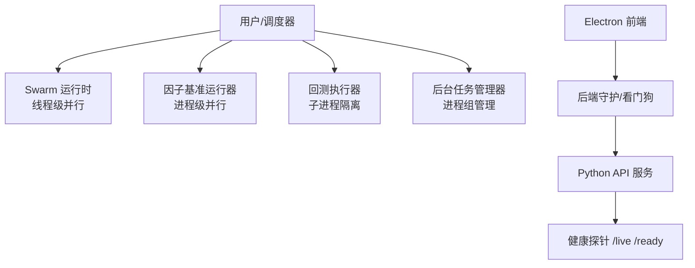
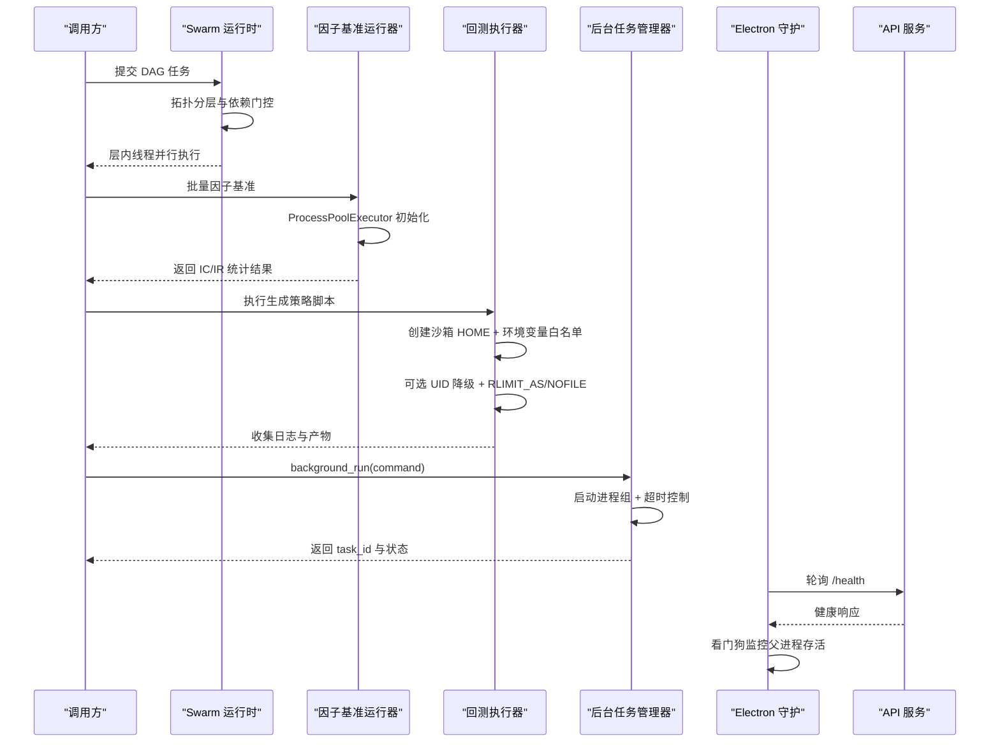
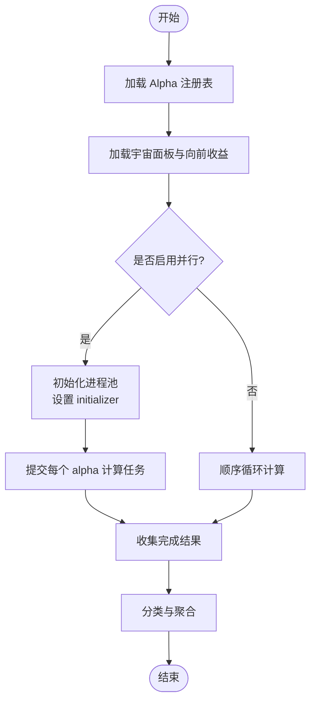
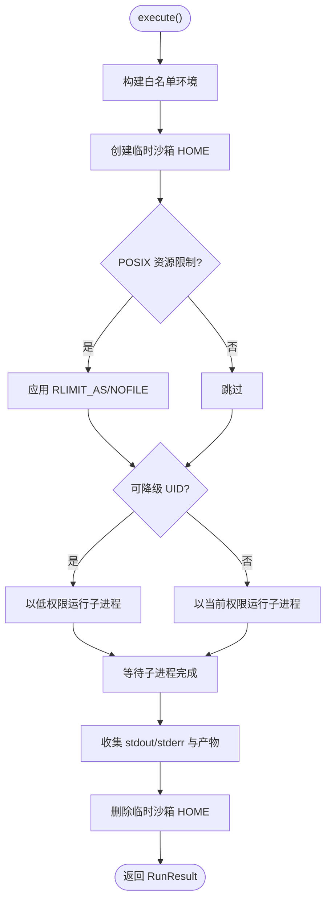
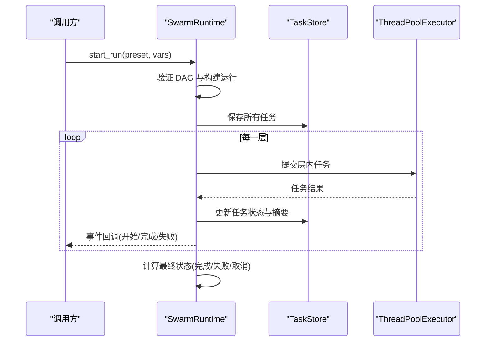
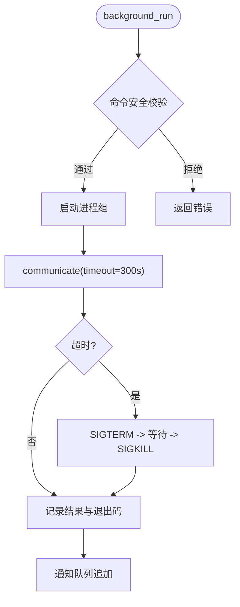
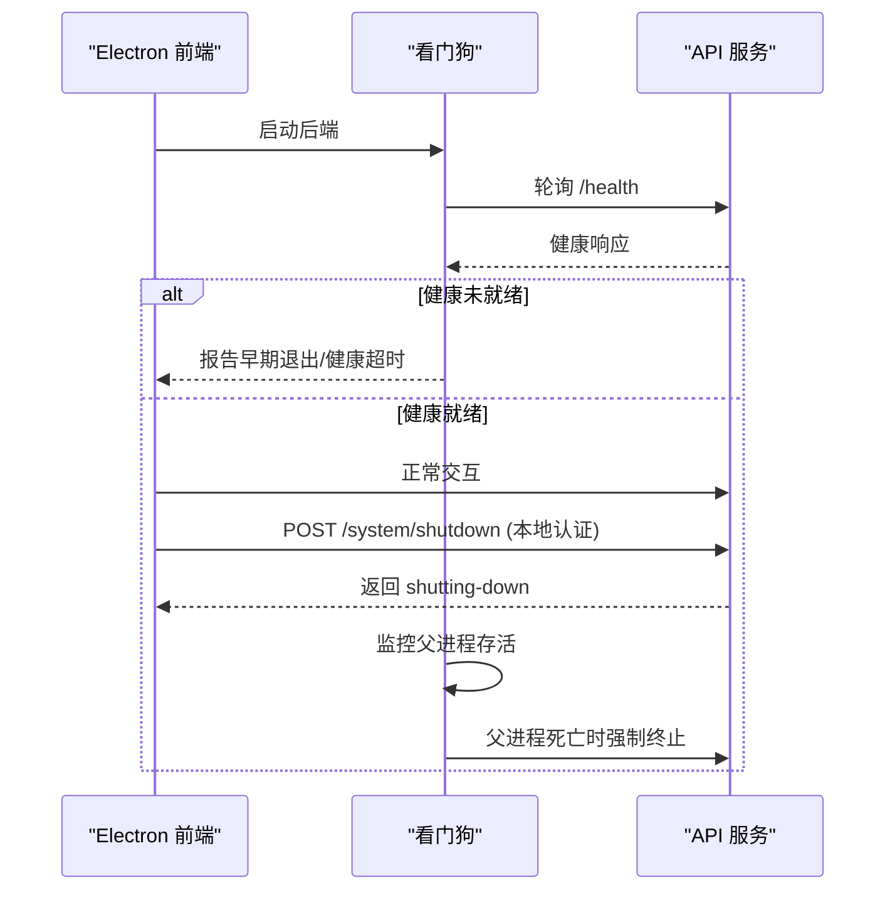
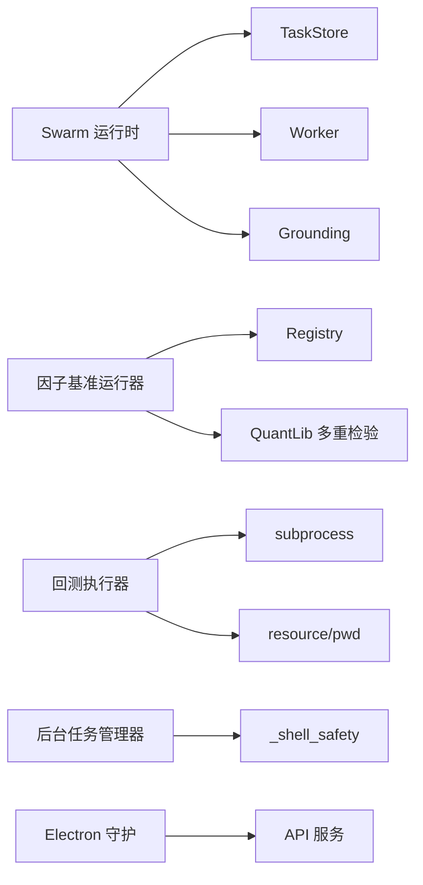

# 多进程编程模型

<cite>
**本文引用的文件**
- [agent/src/factors/bench_runner.py](file://agent/src/factors/bench_runner.py)
- [agent/src/core/runner.py](file://agent/src/core/runner.py)
- [agent/src/swarm/runtime.py](file://agent/src/swarm/runtime.py)
- [agent/src/tools/background_tools.py](file://agent/src/tools/background_tools.py)
- [agent/src/tools/_shell_safety.py](file://agent/src/tools/_shell_safety.py)
- [agent/src/api/system_routes.py](file://agent/src/api/system_routes.py)
- [desktop/electron/THREAT_MODEL.md](file://desktop/electron/THREAT_MODEL.md)
- [desktop/electron/src/backend-manager.ts](file://desktop/electron/src/backend-manager.ts)
- [desktop/electron/src/backend-watchdog.ts](file://desktop/electron/src/backend-watchdog.ts)
</cite>

## 目录
1. [简介](#简介)
2. [项目结构](#项目结构)
3. [核心组件](#核心组件)
4. [架构总览](#架构总览)
5. [详细组件分析](#详细组件分析)
6. [依赖关系分析](#依赖关系分析)
7. [性能考量](#性能考量)
8. [故障排查指南](#故障排查指南)
9. [结论](#结论)
10. [附录](#附录)

## 简介
本文件系统化梳理 Vibe-Trading 的多进程编程模型，覆盖以下主题：
- Python 多进程架构与进程间通信（IPC）机制
- 任务分发策略与负载均衡算法
- 进程池管理：生命周期控制、资源隔离、内存共享限制
- 子进程安全沙箱：代码扫描器、危险操作拦截、权限控制
- 并行回测实现案例：批量数据处理、因子计算并行化、API 请求并发处理
- 进程监控与故障恢复：健康检查、异常处理、优雅退出策略

## 项目结构
本项目在多进程方面涉及多个层次：
- 因子基准测试的进程池并行（ProcessPoolExecutor）
- 回测执行器的独立子进程隔离（subprocess + 沙箱 HOME + 资源限制）
- Swarm 工作流的任务层并行（ThreadPoolExecutor）
- 后台命令执行的进程组管理与超时终止
- Electron 前端的后端守护与进程生命周期管理
- API 健康探针与受控关闭

**图示来源**
- [agent/src/swarm/runtime.py:53-159](file://agent/src/swarm/runtime.py#L53-L159)
- [agent/src/factors/bench_runner.py:22-239](file://agent/src/factors/bench_runner.py#L22-L239)
- [agent/src/core/runner.py:379-627](file://agent/src/core/runner.py#L379-L627)
- [agent/src/tools/background_tools.py:24-95](file://agent/src/tools/background_tools.py#L24-L95)
- [desktop/electron/src/backend-manager.ts:261-286](file://desktop/electron/src/backend-manager.ts#L261-L286)
- [desktop/electron/src/backend-watchdog.ts:88-117](file://desktop/electron/src/backend-watchdog.ts#L88-L117)
- [agent/src/api/system_routes.py:242-272](file://agent/src/api/system_routes.py#L242-L272)

**章节来源**
- [agent/src/swarm/runtime.py:53-159](file://agent/src/swarm/runtime.py#L53-L159)
- [agent/src/factors/bench_runner.py:22-239](file://agent/src/factors/bench_runner.py#L22-L239)
- [agent/src/core/runner.py:379-627](file://agent/src/core/runner.py#L379-L627)
- [agent/src/tools/background_tools.py:24-95](file://agent/src/tools/background_tools.py#L24-L95)
- [desktop/electron/src/backend-manager.ts:261-286](file://desktop/electron/src/backend-manager.ts#L261-L286)
- [desktop/electron/src/backend-watchdog.ts:88-117](file://desktop/electron/src/backend-watchdog.ts#L88-L117)
- [agent/src/api/system_routes.py:242-272](file://agent/src/api/system_routes.py#L242-L272)

## 核心组件
- 因子基准运行器：使用进程池对大量 Alpha 因子进行并行 IC 统计计算，支持按配置调整 worker 数量。
- 回测执行器：以独立子进程运行生成的策略脚本，提供沙箱 HOME、环境变量白名单、POSIX 资源限制与可选 UID 降级。
- Swarm 运行时：按拓扑层组织任务，层内线程并行，层间串行；具备依赖门控、重试、超时与事件上报。
- 后台任务管理器：启动 shell 命令为进程组，统一超时、优雅终止与强制终止，并提供取消与状态查询。
- 安全工具：对危险 shell 命令进行正则拦截，防止误杀 Python 进程。
- 健康探针与关闭：/live 与 /ready 探针用于容器编排与健康判断；受控关闭接口用于本地安全停机。
- Electron 守护：启动后轮询健康端点，失败则报告并清理；看门狗在父进程死亡时强制终止 Python 进程树。

**章节来源**
- [agent/src/factors/bench_runner.py:137-239](file://agent/src/factors/bench_runner.py#L137-L239)
- [agent/src/core/runner.py:379-627](file://agent/src/core/runner.py#L379-L627)
- [agent/src/swarm/runtime.py:53-159](file://agent/src/swarm/runtime.py#L53-L159)
- [agent/src/tools/background_tools.py:24-95](file://agent/src/tools/background_tools.py#L24-L95)
- [agent/src/tools/_shell_safety.py:1-42](file://agent/src/tools/_shell_safety.py#L1-L42)
- [agent/src/api/system_routes.py:242-272](file://agent/src/api/system_routes.py#L242-L272)
- [desktop/electron/src/backend-manager.ts:261-286](file://desktop/electron/src/backend-manager.ts#L261-L286)
- [desktop/electron/src/backend-watchdog.ts:88-117](file://desktop/electron/src/backend-watchdog.ts#L88-L117)

## 架构总览
下图展示从上层调度到各并行执行路径的整体流程，包括线程并行、进程池并行与子进程隔离。

**图示来源**
- [agent/src/swarm/runtime.py:222-386](file://agent/src/swarm/runtime.py#L222-L386)
- [agent/src/factors/bench_runner.py:223-247](file://agent/src/factors/bench_runner.py#L223-L247)
- [agent/src/core/runner.py:487-627](file://agent/src/core/runner.py#L487-L627)
- [agent/src/tools/background_tools.py:24-95](file://agent/src/tools/background_tools.py#L24-L95)
- [desktop/electron/src/backend-manager.ts:261-286](file://desktop/electron/src/backend-manager.ts#L261-L286)
- [desktop/electron/src/backend-watchdog.ts:88-117](file://desktop/electron/src/backend-watchdog.ts#L88-L117)
- [agent/src/api/system_routes.py:242-272](file://agent/src/api/system_routes.py#L242-L272)

## 详细组件分析

### 因子基准运行器（进程池并行）
- 任务分发：遍历注册表中的 alpha id，按配置或 CPU 核数决定 worker 数量，使用 ProcessPoolExecutor 并行计算 IC 系列与 IR。
- 负载均衡：worker 数量上限受 n_total 限制；通过 initializer 将大型面板数据缓存至 worker 全局变量，减少重复传输。
- 错误处理：捕获 SkipAlpha/RegistryError/运行时异常，记录 skip 原因；回调 on_progress 提供进度。
- 结果聚合：分类 alive/reversed/dead，输出 top5_by_ir、by_theme、多重检验修正等元信息。

**图示来源**
- [agent/src/factors/bench_runner.py:137-239](file://agent/src/factors/bench_runner.py#L137-L239)
- [agent/src/factors/bench_runner.py:252-312](file://agent/src/factors/bench_runner.py#L252-L312)
- [agent/src/factors/bench_runner.py:314-416](file://agent/src/factors/bench_runner.py#L314-L416)

**章节来源**
- [agent/src/factors/bench_runner.py:137-239](file://agent/src/factors/bench_runner.py#L137-L239)
- [agent/src/factors/bench_runner.py:252-312](file://agent/src/factors/bench_runner.py#L252-L312)
- [agent/src/factors/bench_runner.py:314-416](file://agent/src/factors/bench_runner.py#L314-L416)

### 回测执行器（子进程隔离与沙箱）
- 子进程隔离：使用 subprocess 启动独立 Python 解释器，限定工作目录与超时。
- 沙箱 HOME：创建临时 HOME，仅以符号链接方式暴露必要目录（cache、data-bridge、qveris.json），避免读取真实敏感数据。
- 环境变量白名单：仅允许系统基础、代理证书、市场数据所需只读配置键，阻断 LLM/交易凭证泄露。
- 资源限制：POSIX 下通过 preexec_fn 设置 RLIMIT_AS（虚拟地址空间）与 RLIMIT_NOFILE（文件描述符）。
- 权限降级：若存在 vibe-sandbox 用户且具备能力，则以该 UID/GID 运行子进程。
- 产物收集：根据 artifacts_spec 发现 equity/metrics/trades 等文件并返回。

**图示来源**
- [agent/src/core/runner.py:522-569](file://agent/src/core/runner.py#L522-L569)
- [agent/src/core/runner.py:571-592](file://agent/src/core/runner.py#L571-L592)
- [agent/src/core/runner.py:510-627](file://agent/src/core/runner.py#L510-L627)
- [agent/src/core/runner.py:113-172](file://agent/src/core/runner.py#L113-L172)
- [agent/src/core/runner.py:73-110](file://agent/src/core/runner.py#L73-L110)

**章节来源**
- [agent/src/core/runner.py:522-569](file://agent/src/core/runner.py#L522-L569)
- [agent/src/core/runner.py:571-592](file://agent/src/core/runner.py#L571-L592)
- [agent/src/core/runner.py:510-627](file://agent/src/core/runner.py#L510-L627)
- [agent/src/core/runner.py:113-172](file://agent/src/core/runner.py#L113-L172)
- [agent/src/core/runner.py:73-110](file://agent/src/core/runner.py#L73-L110)

### Swarm 运行时（DAG 任务层并行）
- 任务分层：基于依赖关系计算拓扑层，层内 ThreadPoolExecutor 并行，层间串行。
- 依赖门控：上游未完成则下游任务标记 blocked，避免空上下文决策。
- 重试与超时：每任务支持 max_retries；层级别 deadline 保护，防止 C 扩展阻塞导致挂起。
- 事件与持久化：任务状态变更写入 TaskStore，并通过事件回调推送实时状态。
- 取消与清理：支持 cancel_run，层结束时清理 executor 并更新最终状态。

**图示来源**
- [agent/src/swarm/runtime.py:90-159](file://agent/src/swarm/runtime.py#L90-L159)
- [agent/src/swarm/runtime.py:222-386](file://agent/src/swarm/runtime.py#L222-L386)
- [agent/src/swarm/runtime.py:476-645](file://agent/src/swarm/runtime.py#L476-L645)
- [agent/src/swarm/runtime.py:647-748](file://agent/src/swarm/runtime.py#L647-L748)

**章节来源**
- [agent/src/swarm/runtime.py:90-159](file://agent/src/swarm/runtime.py#L90-L159)
- [agent/src/swarm/runtime.py:222-386](file://agent/src/swarm/runtime.py#L222-L386)
- [agent/src/swarm/runtime.py:476-645](file://agent/src/swarm/runtime.py#L476-L645)
- [agent/src/swarm/runtime.py:647-748](file://agent/src/swarm/runtime.py#L647-L748)

### 后台任务管理器（进程组与优雅终止）
- 进程组启动：跨平台创建新会话/进程组，便于整体信号发送。
- 优雅终止：先 SIGTERM，等待短暂时间，再 SIGKILL；Windows 使用 taskkill /T /F。
- 超时控制：默认 300 秒超时，输出截断以避免过大响应。
- 取消机制：cancel_background 通过已跟踪进程组终止任务，避免按名称杀死 Python 进程。
- 状态查询：check_background 返回任务状态、耗时与剩余时间。

**图示来源**
- [agent/src/tools/background_tools.py:24-95](file://agent/src/tools/background_tools.py#L24-L95)
- [agent/src/tools/background_tools.py:102-205](file://agent/src/tools/background_tools.py#L102-L205)
- [agent/src/tools/background_tools.py:206-311](file://agent/src/tools/background_tools.py#L206-L311)
- [agent/src/tools/_shell_safety.py:1-42](file://agent/src/tools/_shell_safety.py#L1-L42)

**章节来源**
- [agent/src/tools/background_tools.py:24-95](file://agent/src/tools/background_tools.py#L24-L95)
- [agent/src/tools/background_tools.py:102-205](file://agent/src/tools/background_tools.py#L102-L205)
- [agent/src/tools/background_tools.py:206-311](file://agent/src/tools/background_tools.py#L206-L311)
- [agent/src/tools/_shell_safety.py:1-42](file://agent/src/tools/_shell_safety.py#L1-L42)

### 安全沙箱与权限控制
- 代码扫描器：AST 静态防护在 backtest/runner.py 中启用（由 runner 模块注释引用），阻止危险语法与调用。
- 危险操作拦截：shell 命令正则匹配 broad Python kill，禁止通过名称杀死 Python 进程。
- 权限控制：子进程可选 UID 降级；HOME 沙箱仅暴露最小必要路径；环境变量白名单限制敏感信息泄漏。
- 资源限制：RLIMIT_AS 与 RLIMIT_NOFILE 限制虚拟内存与文件描述符，防止 DoS。

**章节来源**
- [agent/src/core/runner.py:34-53](file://agent/src/core/runner.py#L34-L53)
- [agent/src/core/runner.py:55-110](file://agent/src/core/runner.py#L55-L110)
- [agent/src/core/runner.py:113-172](file://agent/src/core/runner.py#L113-L172)
- [agent/src/core/runner.py:259-361](file://agent/src/core/runner.py#L259-L361)
- [agent/src/tools/_shell_safety.py:1-42](file://agent/src/tools/_shell_safety.py#L1-L42)

### 并行回测实现案例
- 批量数据处理：bench_runner 加载宇宙面板与向前收益矩阵，作为共享输入缓存于 worker 进程。
- 因子计算并行化：ProcessPoolExecutor 并行计算每个 alpha 的 IC 序列与 IR，支持 on_progress 回调。
- API 请求并发处理：Swarm 层内使用 ThreadPoolExecutor 并发执行任务；后台任务管理器并发执行 shell 命令。

**章节来源**
- [agent/src/factors/bench_runner.py:195-239](file://agent/src/factors/bench_runner.py#L195-L239)
- [agent/src/factors/bench_runner.py:252-312](file://agent/src/factors/bench_runner.py#L252-L312)
- [agent/src/swarm/runtime.py:476-645](file://agent/src/swarm/runtime.py#L476-L645)
- [agent/src/tools/background_tools.py:102-205](file://agent/src/tools/background_tools.py#L102-L205)

### 进程监控与故障恢复
- 健康检查：/live 与 /ready 探针分别用于 liveness 与 readiness；/ready 检查 LLM 提供者可用性。
- 优雅退出：/system/shutdown 需要本地认证，触发受控关闭；Electron 守护在正常关闭时调用后端 shutdown 路由。
- 看门狗：Electron 启动小守护进程，轮询父进程 PID；断开或父进程死亡时强制终止 Python 进程树。
- 故障恢复：Swarm 运行时在启动时回收陈旧运行；层级 deadline 与重试机制提升鲁棒性。

**图示来源**
- [agent/src/api/system_routes.py:242-272](file://agent/src/api/system_routes.py#L242-L272)
- [agent/src/api/system_routes.py:362-379](file://agent/src/api/system_routes.py#L362-L379)
- [desktop/electron/src/backend-manager.ts:261-286](file://desktop/electron/src/backend-manager.ts#L261-L286)
- [desktop/electron/src/backend-watchdog.ts:88-117](file://desktop/electron/src/backend-watchdog.ts#L88-L117)
- [desktop/electron/THREAT_MODEL.md:105-122](file://desktop/electron/THREAT_MODEL.md#L105-L122)

**章节来源**
- [agent/src/api/system_routes.py:242-272](file://agent/src/api/system_routes.py#L242-L272)
- [agent/src/api/system_routes.py:362-379](file://agent/src/api/system_routes.py#L362-L379)
- [desktop/electron/src/backend-manager.ts:261-286](file://desktop/electron/src/backend-manager.ts#L261-L286)
- [desktop/electron/src/backend-watchdog.ts:88-117](file://desktop/electron/src/backend-watchdog.ts#L88-L117)
- [desktop/electron/THREAT_MODEL.md:105-122](file://desktop/electron/THREAT_MODEL.md#L105-L122)

## 依赖关系分析
- 组件耦合：
  - Swarm 运行时依赖 TaskStore、Worker、Grounding 与 AgentConfig。
  - 因子基准运行器依赖 Registry、QuantLib 多重检验与数据加载器。
  - 回测执行器依赖 subprocess、resource/pwd（可选）、mootdx 配置处理。
  - 后台任务管理器依赖 _shell_safety 与跨平台进程组管理。
- 外部依赖：
  - 数据源（Yahoo、OKX、Tushare 等）通过环境变量与白名单访问。
  - LLM 提供者通过 /ready 探针检测可用性。
  - Electron 守护通过 IPC 与 HTTP 与后端交互。

**图示来源**
- [agent/src/swarm/runtime.py:22-49](file://agent/src/swarm/runtime.py#L22-L49)
- [agent/src/factors/bench_runner.py:22-41](file://agent/src/factors/bench_runner.py#L22-L41)
- [agent/src/core/runner.py:5-27](file://agent/src/core/runner.py#L5-L27)
- [agent/src/tools/background_tools.py:15-16](file://agent/src/tools/background_tools.py#L15-L16)
- [desktop/electron/src/backend-manager.ts:261-286](file://desktop/electron/src/backend-manager.ts#L261-L286)

**章节来源**
- [agent/src/swarm/runtime.py:22-49](file://agent/src/swarm/runtime.py#L22-L49)
- [agent/src/factors/bench_runner.py:22-41](file://agent/src/factors/bench_runner.py#L22-L41)
- [agent/src/core/runner.py:5-27](file://agent/src/core/runner.py#L5-L27)
- [agent/src/tools/background_tools.py:15-16](file://agent/src/tools/background_tools.py#L15-L16)
- [desktop/electron/src/backend-manager.ts:261-286](file://desktop/electron/src/backend-manager.ts#L261-L286)

## 性能考量
- 进程池大小：因子基准运行器根据配置与 CPU 核数动态选择 worker 数量，避免过度并行导致上下文切换开销。
- 数据共享：通过 initializer 将大型面板缓存至 worker 全局变量，减少序列化与网络传输成本。
- 层级超时：Swarm 运行时设置层级别 deadline，防止个别任务阻塞整体流水线。
- 资源限制：RLIMIT_AS 与 RLIMIT_NOFILE 限制子进程资源使用，防止恶意或异常任务耗尽系统资源。
- 输出截断：后台任务管理器限制最大输出字符数，避免大响应影响性能。

[本节为通用指导，不直接分析具体文件]

## 故障排查指南
- 健康探针失败：检查 /ready 返回的 provider/model/credential 配置；确认 LLM 提供者可用。
- 子进程崩溃：查看 runner 输出的 stdout/stderr；确认沙箱 HOME 与白名单环境变量正确。
- 任务阻塞：检查 Swarm 层 deadline 与重试次数；确认上游任务状态与依赖关系。
- 后台任务超时：使用 check_background 查询剩余时间与状态；必要时 cancel_background 终止。
- 看门狗终止：确认 Electron 主进程存活；检查 IPC 通道与父进程 PID 监控。

**章节来源**
- [agent/src/api/system_routes.py:242-272](file://agent/src/api/system_routes.py#L242-L272)
- [agent/src/core/runner.py:682-709](file://agent/src/core/runner.py#L682-L709)
- [agent/src/swarm/runtime.py:1006-1046](file://agent/src/swarm/runtime.py#L1006-L1046)
- [agent/src/tools/background_tools.py:258-311](file://agent/src/tools/background_tools.py#L258-L311)
- [desktop/electron/src/backend-watchdog.ts:88-117](file://desktop/electron/src/backend-watchdog.ts#L88-L117)

## 结论
Vibe-Trading 的多进程模型通过分层并行（线程与进程）、严格的安全沙箱与健壮的监控恢复机制，实现了高吞吐、高可靠与高安全的并行回测与工作流执行。因子基准运行器利用进程池最大化 CPU 利用率；回测执行器确保策略代码在隔离环境中运行；Swarm 运行时保障复杂任务的有序与容错；后台任务管理器提供统一的进程组管理能力；Electron 守护与 API 探针构成完整的生命周期管理闭环。

[本节为总结性内容，不直接分析具体文件]

## 附录
- 最佳实践建议：
  - 合理设置因子基准 worker 数量，避免超过 CPU 核数过多。
  - 在 Docker 硬化的环境中启用 UID 降级与资源限制。
  - 使用 Swarm 的依赖门控与重试机制，确保关键任务链路的可靠性。
  - 通过 /ready 探针集成编排系统，保证服务就绪后再接收流量。
  - 使用 cancel_background 而非按名称杀死 Python 进程，避免误杀。

[本节为补充说明，不直接分析具体文件]