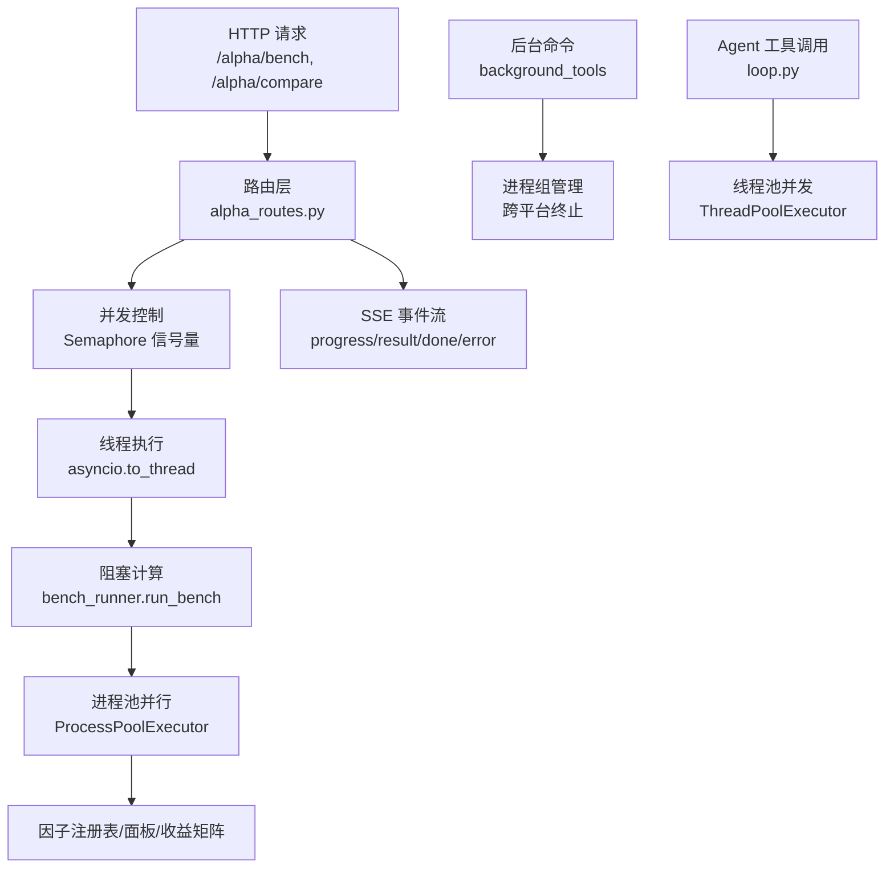
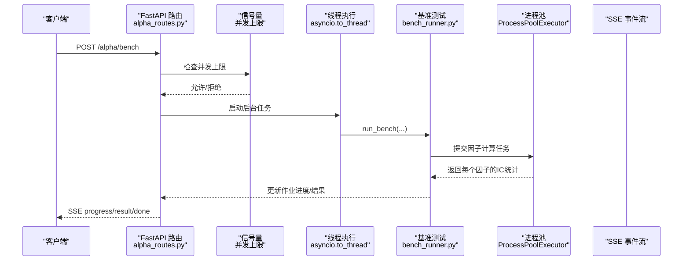
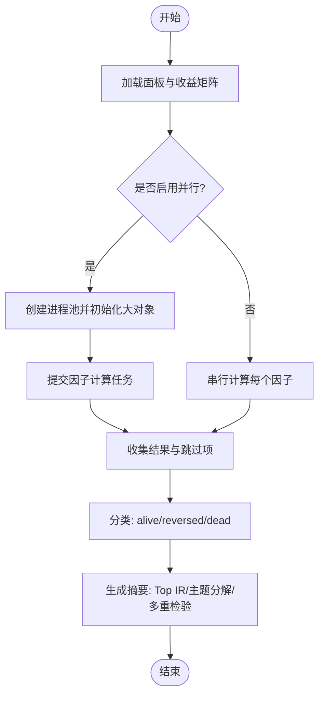
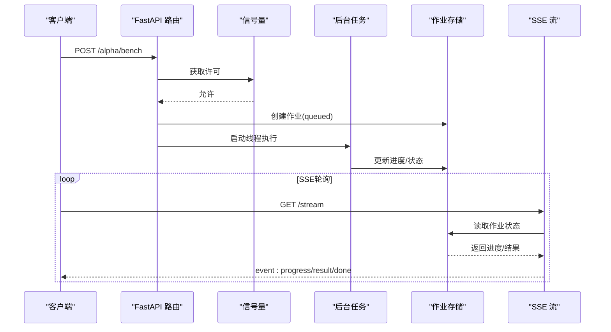
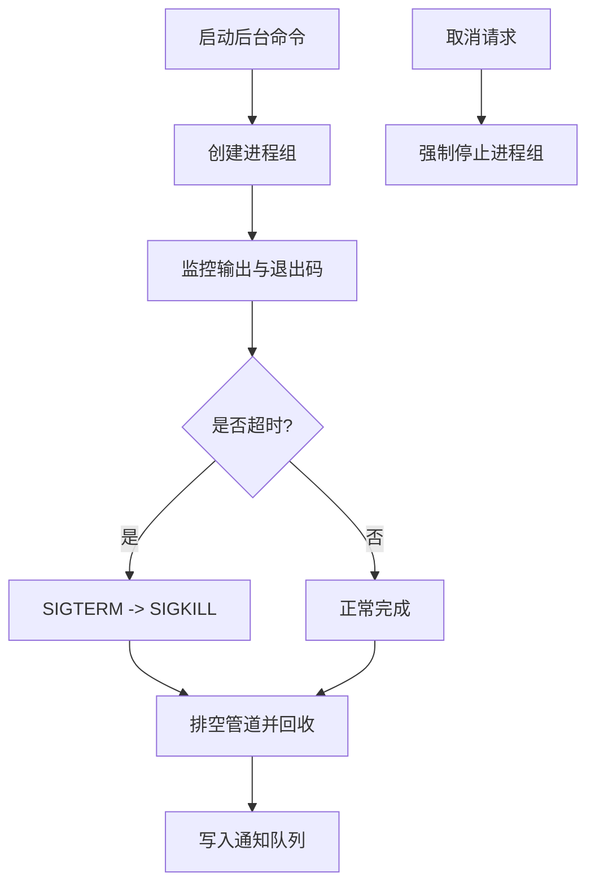
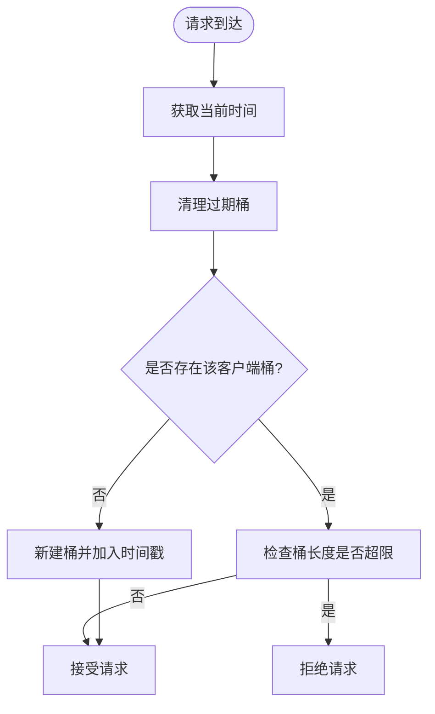
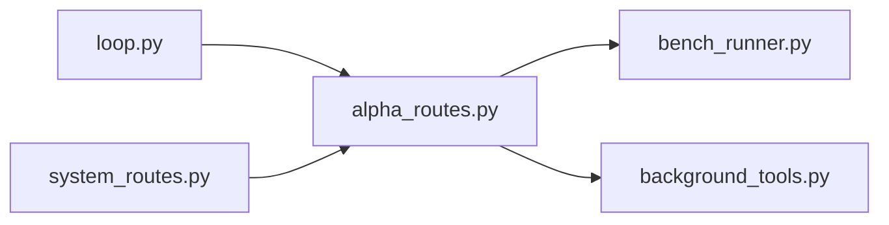

# 并行计算优化

<cite>
**本文引用的文件**
- [agent/src/factors/bench_runner.py](file://agent/src/factors/bench_runner.py)
- [agent/src/api/alpha_routes.py](file://agent/src/api/alpha_routes.py)
- [agent/src/tools/background_tools.py](file://agent/src/tools/background_tools.py)
- [agent/src/agent/loop.py](file://agent/src/agent/loop.py)
- [agent/src/api/system_routes.py](file://agent/src/api/system_routes.py)
- [agent/tests/test_bench_parallel.py](file://agent/tests/test_bench_parallel.py)
</cite>

## 目录
1. [简介](#简介)
2. [项目结构](#项目结构)
3. [核心组件](#核心组件)
4. [架构总览](#架构总览)
5. [详细组件分析](#详细组件分析)
6. [依赖关系分析](#依赖关系分析)
7. [性能考量](#性能考量)
8. [故障排查指南](#故障排查指南)
9. [结论](#结论)
10. [附录](#附录)

## 简介
本指南面向量化研究与回测场景中的并行计算优化，围绕多进程、多线程、任务队列与异步流式通信等关键技术，结合仓库中实际实现，给出可落地的设计模式与最佳实践。重点覆盖：
- 多进程编程模型：进程间数据共享、任务分发、负载均衡策略
- 多线程并发处理：线程安全、锁机制、异步IO模式
- 任务队列系统：消息队列设计、生产者消费者模式、任务优先级管理
- 分布式计算架构：工作节点管理、数据分区、结果聚合（概念性说明）
- 实战案例：批量因子基准测试加速、因子计算并行化、API请求并发控制与SSE进度推送

## 项目结构
本项目在“因子基准测试”和“Web API 后台任务”两条主线上实现了高并行的数据处理与调度：
- 因子基准测试：使用进程池对大量Alpha因子进行IC统计计算，利用进程初始化缓存大对象，减少序列化开销
- Web API 后台任务：通过信号量限制并发，将耗时计算放入线程执行，并通过SSE向客户端推送进度与结果
- 后台命令执行：以进程组方式启动外部命令，提供超时、取消、状态查询能力
- 工具调用并发：在Agent循环中对多个工具调用进行线程池并发执行，保证顺序汇总结果
- 限流与健壮性：滑动窗口限流器保护重计算接口；统一错误收敛与日志记录



**图表来源**
- [agent/src/api/alpha_routes.py:493-646](file://agent/src/api/alpha_routes.py#L493-L646)
- [agent/src/factors/bench_runner.py:231-274](file://agent/src/factors/bench_runner.py#L231-L274)
- [agent/src/tools/background_tools.py:102-205](file://agent/src/tools/background_tools.py#L102-L205)
- [agent/src/agent/loop.py:2680-2692](file://agent/src/agent/loop.py#L2680-L2692)

**章节来源**
- [agent/src/api/alpha_routes.py:493-646](file://agent/src/api/alpha_routes.py#L493-L646)
- [agent/src/factors/bench_runner.py:231-274](file://agent/src/factors/bench_runner.py#L231-L274)
- [agent/src/tools/background_tools.py:102-205](file://agent/src/tools/background_tools.py#L102-L205)
- [agent/src/agent/loop.py:2680-2692](file://agent/src/agent/loop.py#L2680-L2692)

## 核心组件
- 因子基准测试并行执行器：基于进程池的批处理，支持按CPU核数与环境变量配置的工作者数量，自动选择并行或串行路径
- Web API 后台任务调度：信号量限制并发，线程执行阻塞计算，SSE推送进度与结果
- 后台命令执行管理器：跨平台进程组管理，支持超时、取消、状态查询
- Agent 工具调用并发：线程池并发执行工具调用，保证结果顺序汇总
- 系统级限流器：滑动窗口限流，保护重计算接口

**章节来源**
- [agent/src/factors/bench_runner.py:137-266](file://agent/src/factors/bench_runner.py#L137-L266)
- [agent/src/api/alpha_routes.py:493-646](file://agent/src/api/alpha_routes.py#L493-L646)
- [agent/src/tools/background_tools.py:102-205](file://agent/src/tools/background_tools.py#L102-L205)
- [agent/src/agent/loop.py:2680-2692](file://agent/src/agent/loop.py#L2680-L2692)
- [agent/src/api/system_routes.py:62-129](file://agent/src/api/system_routes.py#L62-L129)

## 架构总览
下图展示了从HTTP请求到并行计算的完整链路，包括并发控制、线程执行、进程池并行、SSE事件流以及后台命令执行。



**图表来源**
- [agent/src/api/alpha_routes.py:493-646](file://agent/src/api/alpha_routes.py#L493-L646)
- [agent/src/factors/bench_runner.py:231-274](file://agent/src/factors/bench_runner.py#L231-L274)

## 详细组件分析

### 组件A：因子基准测试并行执行器（bench_runner）
- 设计要点
  - 进程池初始化时缓存大对象（面板与收益矩阵），避免重复序列化传输
  - 根据环境变量与工作负载动态选择并行或串行路径
  - 对每个Alpha因子独立计算IC系列，分类为存活/反向/死亡，并提供多重检验校正信息
- 关键流程
  - 加载宇宙面板与向前收益矩阵
  - 构建进程池并分发任务，收集结果与跳过项
  - 生成主题分解、Top IR列表、死因子示例等摘要
- 复杂度与优化
  - 时间复杂度近似 O(N_factors × T)，N为因子数，T为时间序列长度
  - 空间复杂度受面板与收益矩阵大小影响，进程池内部分享减少内存复制
  - 通过fork上下文与进程初始化降低跨进程数据拷贝成本



**图表来源**
- [agent/src/factors/bench_runner.py:137-266](file://agent/src/factors/bench_runner.py#L137-L266)
- [agent/src/factors/bench_runner.py:314-416](file://agent/src/factors/bench_runner.py#L314-L416)

**章节来源**
- [agent/src/factors/bench_runner.py:137-266](file://agent/src/factors/bench_runner.py#L137-L266)
- [agent/src/factors/bench_runner.py:314-416](file://agent/src/factors/bench_runner.py#L314-L416)
- [agent/tests/test_bench_parallel.py:71-156](file://agent/tests/test_bench_parallel.py#L71-L156)

### 组件B：Web API 后台任务与SSE事件流（alpha_routes）
- 设计要点
  - 使用信号量限制同时运行的基准测试与比较任务数量，防止服务器过载
  - 将阻塞计算放入线程执行，保持事件循环响应性
  - 通过SSE持续推送进度、结果与完成/错误事件，支持心跳保活
- 关键流程
  - 接收请求并校验参数
  - 检查并发上限，创建作业并进入队列
  - 线程执行阻塞计算，更新作业状态
  - SSE轮询作业状态，推送进度与最终结果



**图表来源**
- [agent/src/api/alpha_routes.py:493-646](file://agent/src/api/alpha_routes.py#L493-L646)
- [agent/src/api/alpha_routes.py:671-736](file://agent/src/api/alpha_routes.py#L671-L736)

**章节来源**
- [agent/src/api/alpha_routes.py:493-646](file://agent/src/api/alpha_routes.py#L493-L646)
- [agent/src/api/alpha_routes.py:671-736](file://agent/src/api/alpha_routes.py#L671-L736)

### 组件C：后台命令执行与进程组管理（background_tools）
- 设计要点
  - 跨平台进程组管理：POSIX使用进程组信号，Windows使用taskkill树终止
  - 超时控制与优雅终止：先SIGTERM，再SIGKILL，确保进程树清理
  - 输出截断与通知队列：限制最大输出字符，集中通知便于前端展示
- 关键流程
  - 启动命令并记录任务ID
  - 监控进程生命周期，处理超时与取消
  - 提供查询与取消接口



**图表来源**
- [agent/src/tools/background_tools.py:24-95](file://agent/src/tools/background_tools.py#L24-L95)
- [agent/src/tools/background_tools.py:102-205](file://agent/src/tools/background_tools.py#L102-L205)

**章节来源**
- [agent/src/tools/background_tools.py:24-95](file://agent/src/tools/background_tools.py#L24-L95)
- [agent/src/tools/background_tools.py:102-205](file://agent/src/tools/background_tools.py#L102-L205)

### 组件D：Agent 工具调用并发（loop）
- 设计要点
  - 使用线程池并发执行多个工具调用，限制最大工作线程数
  - 异常捕获与结果顺序汇总，保证后续处理一致性
- 关键流程
  - 收集可运行工具调用
  - 提交至线程池并等待结果
  - 按顺序处理结果并记录追踪信息

```mermaid
sequenceDiagram
participant Loop as "Agent 循环"
participant Pool as "线程池"
participant Tool as "工具执行"
Loop->>Pool : 提交多个工具调用
Pool->>Tool : 并发执行
Tool-->>Pool : 返回结果或异常
Pool-->>Loop : 汇总结果(有序)
Loop->>Loop : 最终化处理与追踪
```

**图表来源**
- [agent/src/agent/loop.py:2680-2692](file://agent/src/agent/loop.py#L2680-L2692)

**章节来源**
- [agent/src/agent/loop.py:2680-2692](file://agent/src/agent/loop.py#L2680-L2692)

### 组件E：系统级滑动窗口限流器（system_routes）
- 设计要点
  - 线程安全的滑动窗口限流，按客户端IP分桶
  - 定期清理过期桶，避免内存无限增长
  - 单调时钟保障窗口稳定性
- 关键流程
  - 记录请求时间戳
  - 清理过期条目
  - 判断是否超过阈值



**图表来源**
- [agent/src/api/system_routes.py:62-129](file://agent/src/api/system_routes.py#L62-L129)

**章节来源**
- [agent/src/api/system_routes.py:62-129](file://agent/src/api/system_routes.py#L62-L129)

## 依赖关系分析
- 模块耦合
  - alpha_routes 依赖 bench_runner 的阻塞计算逻辑，并通过SSE暴露进度
  - background_tools 提供独立的后台命令执行能力，不直接依赖因子计算
  - loop 中的工具调用并发与后台任务相互独立，分别服务于不同场景
- 外部依赖
  - 进程池与线程池来自标准库 concurrent.futures
  - FastAPI 用于路由与SSE流式响应
  - 操作系统信号与子进程管理用于跨平台进程组控制



**图表来源**
- [agent/src/api/alpha_routes.py:493-646](file://agent/src/api/alpha_routes.py#L493-L646)
- [agent/src/factors/bench_runner.py:231-274](file://agent/src/factors/bench_runner.py#L231-L274)
- [agent/src/tools/background_tools.py:102-205](file://agent/src/tools/background_tools.py#L102-L205)
- [agent/src/agent/loop.py:2680-2692](file://agent/src/agent/loop.py#L2680-L2692)
- [agent/src/api/system_routes.py:62-129](file://agent/src/api/system_routes.py#L62-L129)

**章节来源**
- [agent/src/api/alpha_routes.py:493-646](file://agent/src/api/alpha_routes.py#L493-L646)
- [agent/src/factors/bench_runner.py:231-274](file://agent/src/factors/bench_runner.py#L231-L274)
- [agent/src/tools/background_tools.py:102-205](file://agent/src/tools/background_tools.py#L102-L205)
- [agent/src/agent/loop.py:2680-2692](file://agent/src/agent/loop.py#L2680-L2692)
- [agent/src/api/system_routes.py:62-129](file://agent/src/api/system_routes.py#L62-L129)

## 性能考量
- 进程池并行
  - 通过进程初始化缓存大对象，减少序列化开销
  - 根据CPU核数与环境变量调整工作者数量，避免过度并行导致上下文切换开销
- 线程执行与事件循环
  - 将阻塞计算放入线程，保持API响应性
  - 使用信号量限制并发，防止资源耗尽
- 输出与内存管理
  - 后台命令输出截断，避免内存膨胀
  - 定期清理过期作业与限流桶，控制内存占用
- 网络与I/O
  - SSE心跳保活，避免代理断开连接
  - 滑动窗口限流保护重计算接口

[本节为通用性能讨论，无需特定文件引用]

## 故障排查指南
- 基准测试失败
  - 检查宇宙面板加载与向前收益计算是否成功
  - 查看跳过项原因，区分类型错误或意外异常
- 并发限制触发
  - 确认信号量是否达到上限，适当调整并发上限或等待完成
- 后台命令超时
  - 检查命令执行时间与超时设置，必要时增加超时或优化命令
- 工具调用异常
  - 捕获线程池异常并记录，确保结果顺序汇总不受影响
- 限流被拒绝
  - 检查客户端请求频率，合理调整限流参数

**章节来源**
- [agent/src/factors/bench_runner.py:211-274](file://agent/src/factors/bench_runner.py#L211-L274)
- [agent/src/api/alpha_routes.py:509-520](file://agent/src/api/alpha_routes.py#L509-L520)
- [agent/src/tools/background_tools.py:158-173](file://agent/src/tools/background_tools.py#L158-L173)
- [agent/src/agent/loop.py:2683-2688](file://agent/src/agent/loop.py#L2683-L2688)
- [agent/src/api/system_routes.py:92-119](file://agent/src/api/system_routes.py#L92-L119)

## 结论
本项目在多进程、多线程、任务队列与异步流式通信方面提供了成熟的实现范式。通过进程池并行因子计算、信号量控制API并发、SSE推送实时进度、后台命令进程组管理，以及滑动窗口限流，构建了高吞吐、低延迟且健壮的并行计算体系。建议在实际部署中根据硬件资源与业务负载调优工作者数量与并发上限，并结合监控与日志完善故障定位。

[本节为总结性内容，无需特定文件引用]

## 附录
- 配置与环境变量
  - 基准测试工作者数量可通过环境变量配置，默认回退到CPU核数
  - 并发上限由信号量常量控制，可按需调整
- 测试与验证
  - 单元测试覆盖并行路径与进度回调，确保行为一致性与鲁棒性

**章节来源**
- [agent/src/factors/bench_runner.py:223-229](file://agent/src/factors/bench_runner.py#L223-L229)
- [agent/src/api/alpha_routes.py:65-77](file://agent/src/api/alpha_routes.py#L65-L77)
- [agent/tests/test_bench_parallel.py:91-156](file://agent/tests/test_bench_parallel.py#L91-L156)