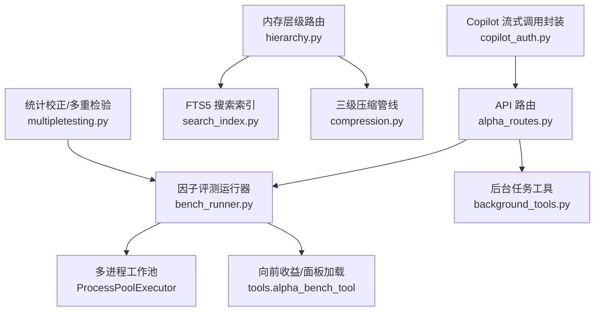
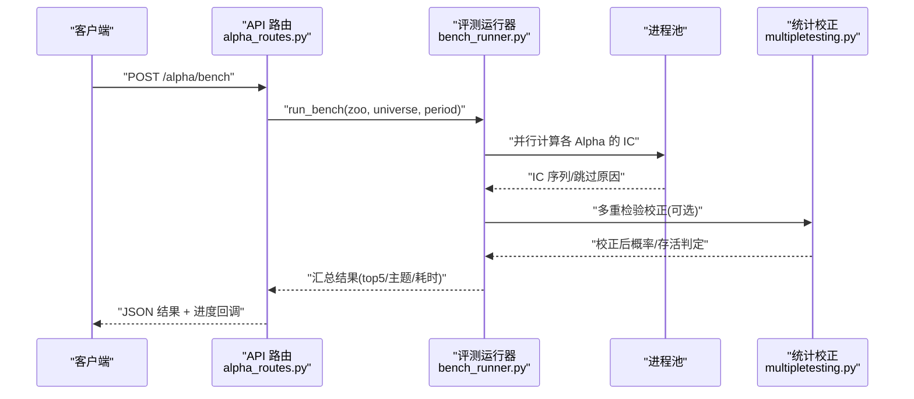
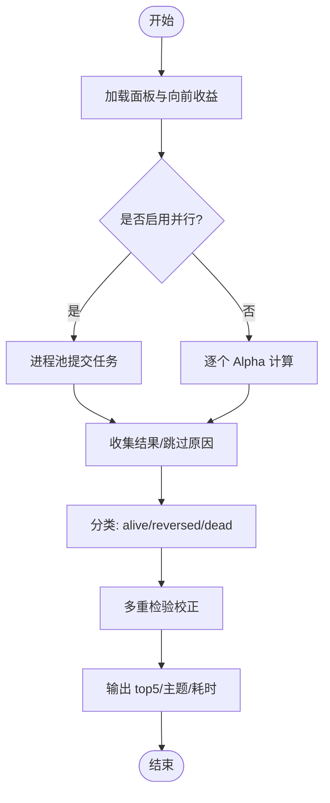
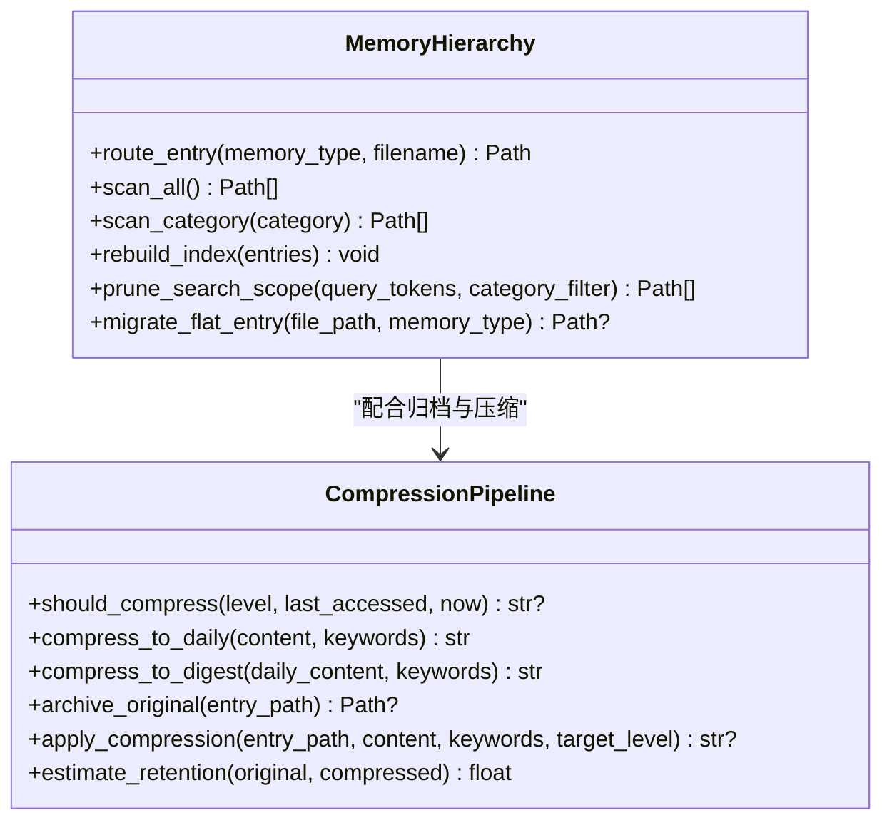
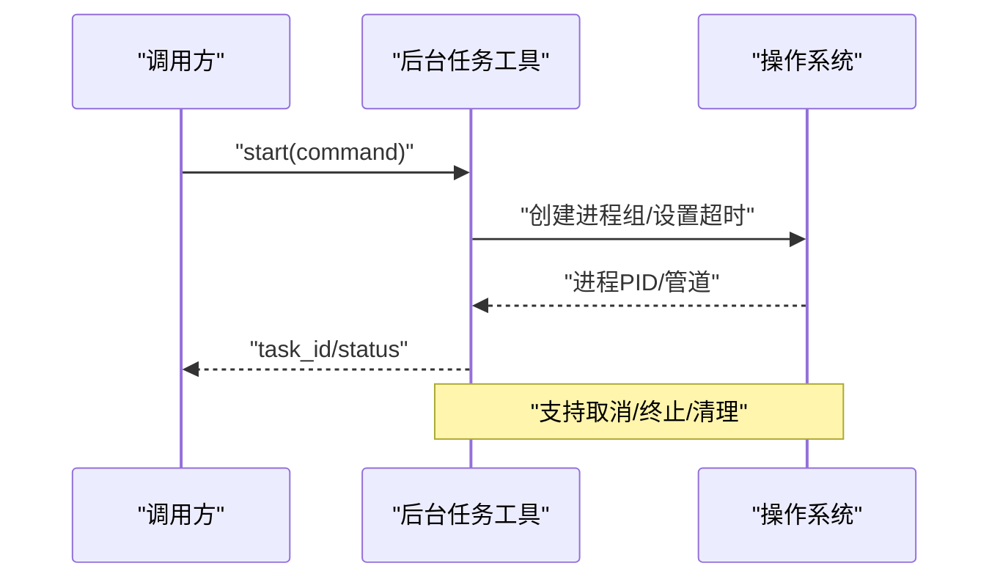
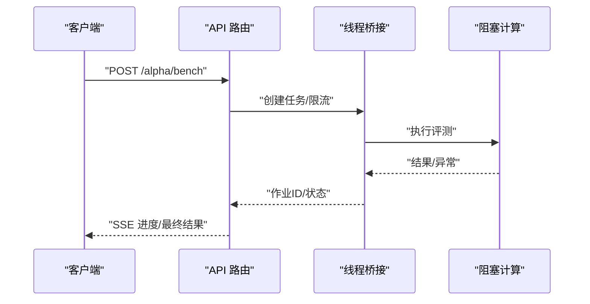
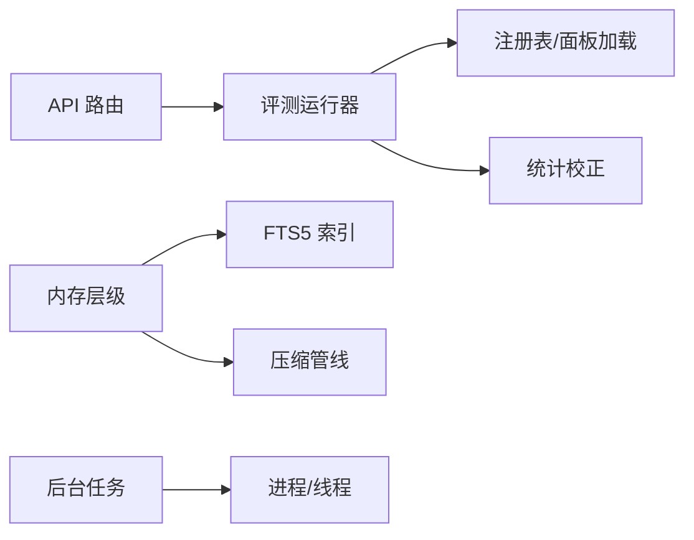

# 性能优化技术

<cite>
**本文引用的文件**
- [bench_performance.py](file://agent/scripts/bench_performance.py)
- [bench_runner.py](file://agent/src/factors/bench_runner.py)
- [alpha_routes.py](file://agent/src/api/alpha_routes.py)
- [hierarchy.py](file://agent/src/memory/hierarchy.py)
- [compression.py](file://agent/src/memory/compression.py)
- [search_index.py](file://agent/src/memory/search_index.py)
- [background_tools.py](file://agent/src/tools/background_tools.py)
- [copilot_auth.py](file://agent/src/providers/copilot_auth.py)
- [multipletesting.py](file://agent/src/quantlib/multipletesting.py)
</cite>

## 目录
1. [简介](#简介)
2. [项目结构](#项目结构)
3. [核心组件](#核心组件)
4. [架构总览](#架构总览)
5. [详细组件分析](#详细组件分析)
6. [依赖关系分析](#依赖关系分析)
7. [性能考量](#性能考量)
8. [故障排查指南](#故障排查指南)
9. [结论](#结论)
10. [附录](#附录)

## 简介
本指南面向量化交易与数据密集型系统，聚焦可落地的性能优化实践：内存管理、并行计算、缓存策略、数据库优化、监控与剖析，以及回测引擎、数据处理、API 响应等真实场景的优化案例。内容基于仓库中已实现的模块与脚本进行提炼，确保建议与代码实现一致，便于直接落地。

## 项目结构
本项目在“因子评测/回测”“内存层级与压缩”“后台任务与并发”“API 异步处理”“统计校正”等关键路径上提供了高性能实现。下图展示与性能密切相关的子系统及其交互。

**图表来源**
- [alpha_routes.py:539-650](file://agent/src/api/alpha_routes.py#L539-L650)
- [bench_runner.py:1-409](file://agent/src/factors/bench_runner.py#L1-L409)
- [background_tools.py:1-156](file://agent/src/tools/background_tools.py#L1-L156)
- [hierarchy.py:1-436](file://agent/src/memory/hierarchy.py#L1-L436)
- [compression.py:1-356](file://agent/src/memory/compression.py#L1-L356)
- [search_index.py:454-480](file://agent/src/memory/search_index.py#L454-L480)
- [multipletesting.py:156-191](file://agent/src/quantlib/multipletesting.py#L156-L191)
- [copilot_auth.py:421-459](file://agent/src/providers/copilot_auth.py#L421-L459)

**章节来源**
- [bench_performance.py:1-134](file://agent/scripts/bench_performance.py#L1-L134)
- [bench_runner.py:1-409](file://agent/src/factors/bench_runner.py#L1-L409)
- [alpha_routes.py:539-650](file://agent/src/api/alpha_routes.py#L539-L650)
- [hierarchy.py:1-436](file://agent/src/memory/hierarchy.py#L1-L436)
- [compression.py:1-356](file://agent/src/memory/compression.py#L1-L356)
- [search_index.py:454-480](file://agent/src/memory/search_index.py#L454-L480)
- [background_tools.py:1-156](file://agent/src/tools/background_tools.py#L1-L156)
- [copilot_auth.py:421-459](file://agent/src/providers/copilot_auth.py#L421-L459)
- [multipletesting.py:156-191](file://agent/src/quantlib/multipletesting.py#L156-L191)

## 核心组件
- 因子评测与并行化：通过进程池将大量 alpha 的计算与 IC 统计并行执行，按主题与 IR 排序输出，并附带多重检验校正结果。
- 内存层级与压缩：按类别路由文件，结合 TF-IDF 句子级评分与关键词摘要，实现原始→每日→摘要的三级压缩，降低存储与检索成本。
- 后台任务与并发：以线程启动子进程执行命令，支持进程组信号终止与超时控制，避免阻塞主循环。
- API 异步与流式：使用事件循环与线程桥接外部同步调用，保持 SSE/流式响应不阻塞。
- 统计校正：对 IC-IR 等统计量进行多重检验校正，避免过拟合误判。

**章节来源**
- [bench_runner.py:1-409](file://agent/src/factors/bench_runner.py#L1-L409)
- [hierarchy.py:1-436](file://agent/src/memory/hierarchy.py#L1-L436)
- [compression.py:1-356](file://agent/src/memory/compression.py#L1-L356)
- [background_tools.py:1-156](file://agent/src/tools/background_tools.py#L1-L156)
- [copilot_auth.py:421-459](file://agent/src/providers/copilot_auth.py#L421-L459)
- [multipletesting.py:156-191](file://agent/src/quantlib/multipletesting.py#L156-L191)

## 架构总览
下图展示了从 API 请求到因子评测、再到结果聚合与统计校正的完整流程，体现并发、缓存与统计校正的协同。

**图表来源**
- [alpha_routes.py:539-650](file://agent/src/api/alpha_routes.py#L539-L650)
- [bench_runner.py:137-409](file://agent/src/factors/bench_runner.py#L137-L409)
- [multipletesting.py:156-191](file://agent/src/quantlib/multipletesting.py#L156-L191)

## 详细组件分析

### 因子评测与并行化（bench_runner）
- 设计要点
  - 进程池初始化时一次性注入大型面板与收益率矩阵，避免重复序列化开销。
  - 单 Alpha 计算封装为可 pickle 的工作函数，异常分类为“预期/意外”，统一记录 skip 原因。
  - 结果按 IR 排序，提供 alive/reversed/dead 分类与主题分解。
  - 引入多重检验校正，评估最佳 IR 在零假设下的期望最大值与存活概率。
- 复杂度与性能
  - 时间复杂度近似 O(N_alphas × T)，N_alphas 为 Alpha 数量，T 为时间窗口长度；通过进程池线性扩展吞吐。
  - 空间复杂度受面板与返回矩阵大小影响，采用 worker 全局缓存减少跨进程传输。
- 错误处理
  - 捕获 SkipAlpha/RegistryError/运行时异常，区分“类型错误”和“意外错误”，便于定位。
- 优化机会
  - 根据 CPU 核数与环境变量动态调整 workers；对极小任务集退化为串行以避免进程创建开销。
  - 对空 IC 或短序列快速跳过，减少无效计算。

**图表来源**
- [bench_runner.py:137-409](file://agent/src/factors/bench_runner.py#L137-L409)

**章节来源**
- [bench_runner.py:1-409](file://agent/src/factors/bench_runner.py#L1-L409)

### 内存层级与压缩（hierarchy + compression）
- 设计要点
  - 层级路由：按 memory_type 将条目路由至 category 子目录，支持 O(category_size) 范围检索，兼容扁平存储。
  - 三级压缩：原始→每日（保留首尾句+Top-K 关键句）→摘要（TF-IDF 关键词列表），归档原文件保障可恢复性。
  - 索引重建：生成 .hierarchy.yaml 摘要，包含每类关键词与计数，用于查询优先级排序。
- 复杂度与性能
  - 扫描复杂度由 O(n) 降至 O(目标类别大小)；压缩阶段按句子切分与 IDF 计算，适合长文本。
  - 归档采用原子写入（临时文件+rename），避免部分写入导致的数据损坏。
- 错误处理
  - 未知类别降级为全量扫描；归档失败中止压缩，防止数据丢失。
- 优化机会
  - 结合 FTS5 全文检索，进一步缩小候选集；对高频访问类别优先扫描。

**图表来源**
- [hierarchy.py:1-436](file://agent/src/memory/hierarchy.py#L1-L436)
- [compression.py:1-356](file://agent/src/memory/compression.py#L1-L356)

**章节来源**
- [hierarchy.py:1-436](file://agent/src/memory/hierarchy.py#L1-L436)
- [compression.py:1-356](file://agent/src/memory/compression.py#L1-L356)

### 后台任务与并发（background_tools）
- 设计要点
  - 以线程启动子进程执行 shell 命令，支持进程组信号终止（POSIX killpg）与 Windows 新进程组标志。
  - 维护任务状态字典，支持取消请求与超时控制，避免长时间占用资源。
- 复杂度与性能
  - 并发度受限于系统进程上限与 I/O；通过进程组批量终止提高回收效率。
- 错误处理
  - 捕获子进程退出码与异常，清理残留进程树，保证宿主进程健壮性。
- 优化机会
  - 对频繁短任务可考虑复用进程；对长任务增加心跳检测与优雅退出。

**图表来源**
- [background_tools.py:1-156](file://agent/src/tools/background_tools.py#L1-L156)

**章节来源**
- [background_tools.py:1-156](file://agent/src/tools/background_tools.py#L1-L156)

### API 异步与流式（alpha_routes + copilot_auth）
- 设计要点
  - API 路由使用事件循环与线程桥接阻塞计算（如因子评测），避免阻塞 HTTP 服务器。
  - Copilot 流式调用通过线程读取结果并放入队列，主协程消费队列，保持流式响应。
- 复杂度与性能
  - 通过并发限制（semaphore）控制并发任务数，保护后端资源。
  - 流式处理降低首字节延迟，提升用户体验。
- 错误处理
  - 外层任务捕获异常并更新作业状态，避免未处理异常导致服务崩溃。
- 优化机会
  - 对热点计算引入结果缓存；对长任务提供进度轮询接口。

**图表来源**
- [alpha_routes.py:539-650](file://agent/src/api/alpha_routes.py#L539-L650)
- [copilot_auth.py:421-459](file://agent/src/providers/copilot_auth.py#L421-L459)

**章节来源**
- [alpha_routes.py:539-650](file://agent/src/api/alpha_routes.py#L539-L650)
- [copilot_auth.py:421-459](file://agent/src/providers/copilot_auth.py#L421-L459)

### 统计校正（multipletesting）
- 设计要点
  - 提供 Sharpe 比率、期望最大 Sharpe/IR 与 deflated probability，用于识别过拟合。
  - 对 IC-IR 等多重比较场景给出校正后的存活判定。
- 复杂度与性能
  - 计算复杂度与策略数量、观测数相关；向量化实现提升速度。
- 错误处理
  - 对不足观测数场景给出提示，避免误用校正结果。
- 优化机会
  - 对大规模策略集合可分批计算并增量更新统计量。

**章节来源**
- [multipletesting.py:156-191](file://agent/src/quantlib/multipletesting.py#L156-L191)

## 依赖关系分析
- 组件耦合
  - API 路由依赖评测运行器；评测运行器依赖注册表、面板加载与统计校正。
  - 内存层级与压缩独立于业务逻辑，但被上层检索/归档流程调用。
  - 后台任务工具与 API 解耦，通过进程/线程抽象提供通用能力。
- 外部依赖
  - 进程池、事件循环、SQLite FTS5、TF-IDF 计算等第三方库。
- 潜在循环依赖
  - 当前模块边界清晰，未见明显循环导入；建议在新增模块时保持单向依赖。

**图表来源**
- [alpha_routes.py:539-650](file://agent/src/api/alpha_routes.py#L539-L650)
- [bench_runner.py:1-409](file://agent/src/factors/bench_runner.py#L1-L409)
- [hierarchy.py:1-436](file://agent/src/memory/hierarchy.py#L1-L436)
- [compression.py:1-356](file://agent/src/memory/compression.py#L1-L356)
- [search_index.py:454-480](file://agent/src/memory/search_index.py#L454-L480)
- [background_tools.py:1-156](file://agent/src/tools/background_tools.py#L1-L156)

**章节来源**
- [alpha_routes.py:539-650](file://agent/src/api/alpha_routes.py#L539-L650)
- [bench_runner.py:1-409](file://agent/src/factors/bench_runner.py#L1-L409)
- [hierarchy.py:1-436](file://agent/src/memory/hierarchy.py#L1-L436)
- [compression.py:1-356](file://agent/src/memory/compression.py#L1-L356)
- [search_index.py:454-480](file://agent/src/memory/search_index.py#L454-L480)
- [background_tools.py:1-156](file://agent/src/tools/background_tools.py#L1-L156)

## 性能考量
- 内存管理策略
  - 对象池：因子评测通过进程初始化注入大型面板，避免重复分配与序列化。
  - 垃圾回收调优：后台任务及时终止子进程，释放系统资源；压缩前归档原文件，避免数据丢失。
  - 大数组处理：使用 NumPy/Pandas 向量化计算；进程池拆分任务，降低单进程内存峰值。
  - 内存泄漏检测：通过测试与基准脚本对比新旧路径，定位回归；日志记录异常与跳过原因。
- 并行计算技术
  - 多进程：因子评测使用 ProcessPoolExecutor，按 CPU 核数配置 workers。
  - 多线程：API 层使用线程桥接阻塞计算，保持事件循环非阻塞。
  - 异步 IO：SSE/流式响应，降低首字节延迟。
  - 任务队列：后台任务以任务字典管理状态，支持取消与超时。
- 缓存策略
  - 数据缓存：面板与返回矩阵在 worker 内缓存，减少跨进程传输。
  - 计算结果缓存：可对热点 Alpha 或查询结果引入键控缓存（需结合幂等性）。
  - 连接池管理：后台任务复用进程/连接（可扩展），减少建立开销。
- 数据库优化
  - 查询优化：FTS5 全文检索结合层级路由，缩小扫描范围。
  - 索引设计：按类别构建索引，关键字摘要辅助排序。
  - 分库分表：按 memory_type 分目录，天然“分片”。
- 监控与剖析
  - CPU 分析：基准脚本测量算子与权益计算耗时，对比向量化与循环路径。
  - 内存分析：归档与压缩前后文件大小对比，估算信息保留率。
  - I/O 监控：后台任务输出与退出码，结合系统工具观察磁盘与网络。

[本节为通用指导，不直接分析具体文件]

## 故障排查指南
- 常见问题
  - 因子评测跳过：检查 IC 序列是否为空、Alpha 注册是否有效、面板加载是否成功。
  - 压缩失败：确认归档权限与磁盘空间；查看异常日志中的归档失败原因。
  - 后台任务卡死：检查进程组信号发送是否成功，必要时强制终止进程树。
  - API 阻塞：确认线程桥接是否正确消费队列，避免队列堆积。
- 定位方法
  - 使用基准脚本复现性能问题，对比新旧路径。
  - 开启详细日志，关注“skip 原因”“归档失败”“进程退出码”。
  - 对热点路径添加计时点，定位瓶颈。

**章节来源**
- [bench_performance.py:1-134](file://agent/scripts/bench_performance.py#L1-L134)
- [compression.py:261-337](file://agent/src/memory/compression.py#L261-L337)
- [background_tools.py:24-156](file://agent/src/tools/background_tools.py#L24-L156)
- [alpha_routes.py:539-650](file://agent/src/api/alpha_routes.py#L539-L650)

## 结论
本项目在因子评测、内存管理、并发与流式响应等方面提供了成熟的高性能实现。通过进程池并行、层级化存储与压缩、FTS5 检索、统计校正等手段，显著提升了吞吐与可维护性。建议在生产环境中结合监控与基准测试持续优化，并根据数据规模调整并行度与缓存策略。

[本节为总结，不直接分析具体文件]

## 附录
- 实际优化案例
  - 回测引擎加速：基准脚本对比向量化与循环路径，验证向量化的微秒级优势。
  - 数据处理优化：层级路由与压缩减少 I/O 与存储；FTS5 检索提升召回速度。
  - API 响应优化：异步与流式降低首字节延迟，提升用户体验。
- 参考路径
  - 基准脚本：[bench_performance.py:1-134](file://agent/scripts/bench_performance.py#L1-L134)
  - 因子评测：[bench_runner.py:137-409](file://agent/src/factors/bench_runner.py#L137-L409)
  - 内存层级：[hierarchy.py:1-436](file://agent/src/memory/hierarchy.py#L1-L436)
  - 压缩管线：[compression.py:1-356](file://agent/src/memory/compression.py#L1-L356)
  - 搜索索引：[search_index.py:454-480](file://agent/src/memory/search_index.py#L454-L480)
  - 后台任务：[background_tools.py:1-156](file://agent/src/tools/background_tools.py#L1-L156)
  - 流式调用：[copilot_auth.py:421-459](file://agent/src/providers/copilot_auth.py#L421-L459)
  - 统计校正：[multipletesting.py:156-191](file://agent/src/quantlib/multipletesting.py#L156-L191)

[本节为附录，不直接分析具体文件]