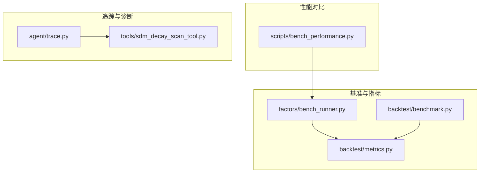
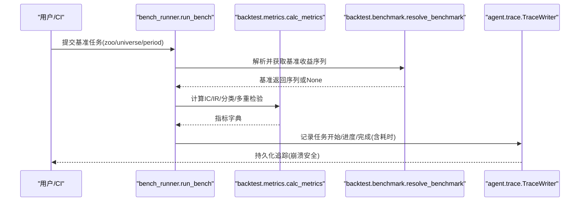
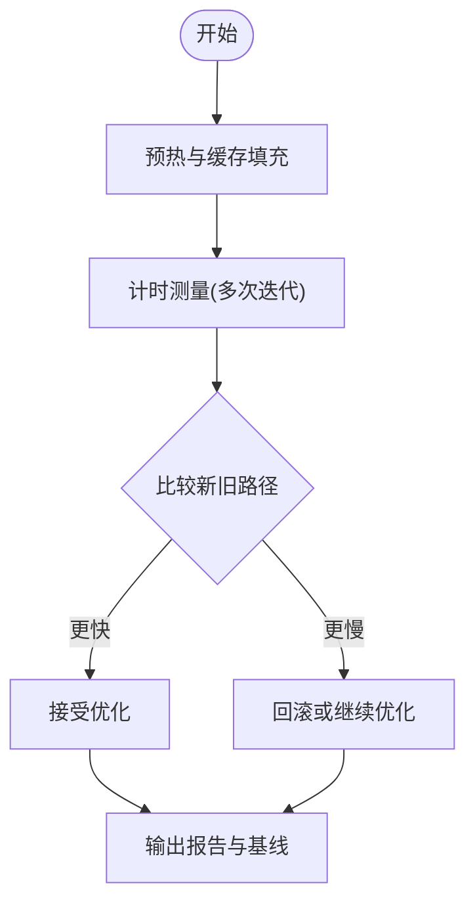
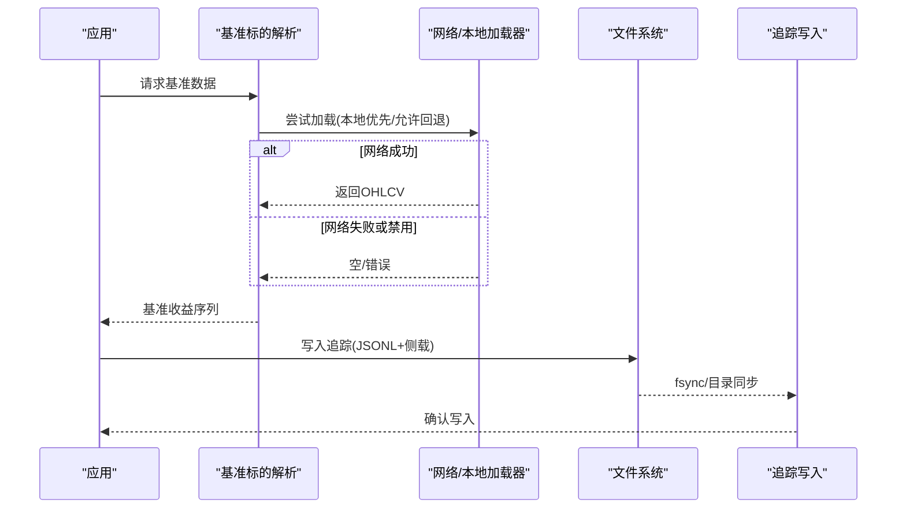
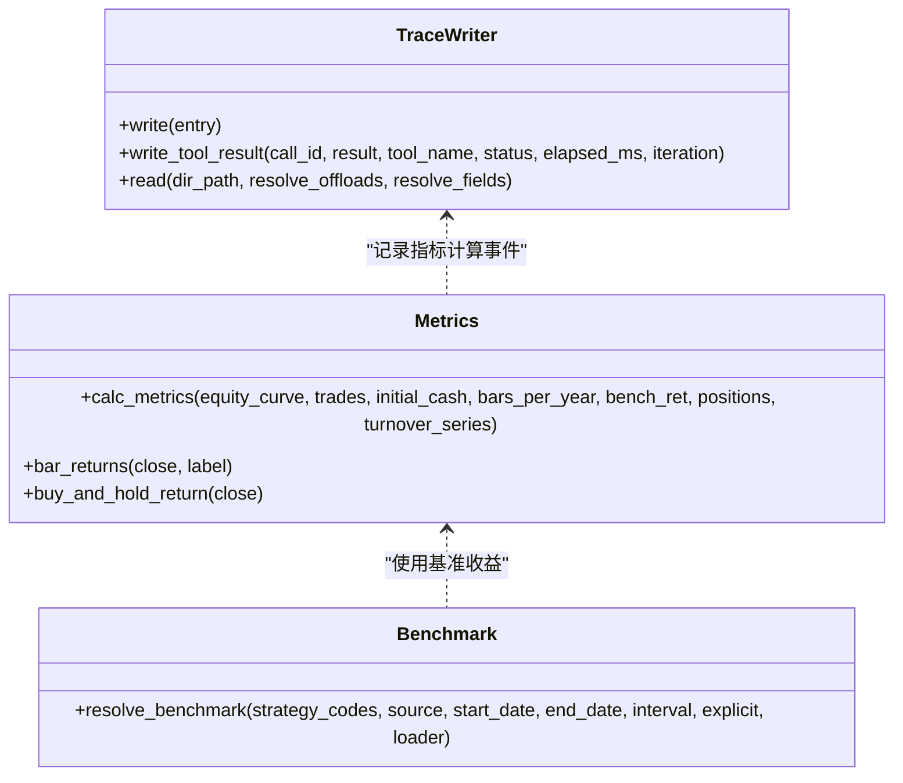
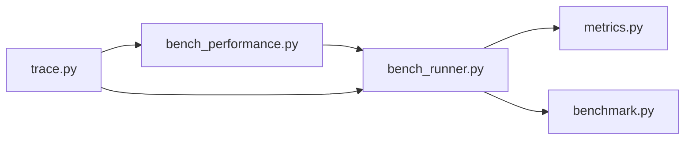

# 性能监控与分析

<cite>
**本文引用的文件**
- [bench_performance.py](file://agent/scripts/bench_performance.py)
- [benchmark.py](file://agent/backtest/benchmark.py)
- [metrics.py](file://agent/backtest/metrics.py)
- [bench_runner.py](file://agent/src/factors/bench_runner.py)
- [trace.py](file://agent/src/agent/trace.py)
- [sdm_decay_scan_tool.py](file://agent/src/tools/sdm_decay_scan_tool.py)
- [requirements-lock.txt](file://requirements-lock.txt)
</cite>

## 目录
1. [简介](#简介)
2. [项目结构](#项目结构)
3. [核心组件](#核心组件)
4. [架构总览](#架构总览)
5. [详细组件分析](#详细组件分析)
6. [依赖关系分析](#依赖关系分析)
7. [性能考量](#性能考量)
8. [故障排查指南](#故障排查指南)
9. [结论](#结论)
10. [附录](#附录)

## 简介
本指南面向Vibe-Trading项目的性能监控与分析，覆盖以下主题：
- CPU性能分析：火焰图生成、热点函数识别、CPU占用分析
- 内存使用监控：内存泄漏检测、堆栈分析、内存增长趋势监控
- I/O性能监控：磁盘I/O分析、网络I/O监控、阻塞调用识别
- APM集成：分布式追踪、指标收集、告警配置
- 基准测试方法：负载测试、压力测试、性能回归检测与实战技巧

本项目已内置多种可复用的性能观测与基准能力，包括因子IC基准、回测指标计算、性能对比脚本、以及崩溃安全的JSONL追踪写入。这些能力可作为构建端到端性能监控体系的基础。

## 项目结构
围绕性能监控与分析的关键代码主要分布在以下位置：
- 基准与回测指标：backtest 模块提供统一的年化、收益、换手率等指标；benchmark 模块提供基准标的解析与拉取
- 因子基准运行器：factors 模块提供多进程并行IC基准、分类与多重检验校正
- 性能对比脚本：scripts 提供算子与净值计算的微基准
- 追踪与诊断：agent.trace 提供崩溃安全、侧载大字段、fsync保障的JSONL追踪
- 衰减扫描工具：tools.sdm_decay_scan_tool 用于对活跃/监控中的制品进行衰减扫描与告警

图表来源
- [bench_performance.py:19-134](file://agent/scripts/bench_performance.py#L19-L134)
- [benchmark.py:40-102](file://agent/backtest/benchmark.py#L40-L102)
- [metrics.py:153-170](file://agent/backtest/metrics.py#L153-L170)
- [bench_runner.py:137-409](file://agent/src/factors/bench_runner.py#L137-L409)
- [trace.py:64-183](file://agent/src/agent/trace.py#L64-L183)
- [sdm_decay_scan_tool.py:71-112](file://agent/src/tools/sdm_decay_scan_tool.py#L71-L112)

章节来源
- [bench_performance.py:19-134](file://agent/scripts/bench_performance.py#L19-L134)
- [benchmark.py:40-102](file://agent/backtest/benchmark.py#L40-L102)
- [metrics.py:153-170](file://agent/backtest/metrics.py#L153-L170)
- [bench_runner.py:137-409](file://agent/src/factors/bench_runner.py#L137-L409)
- [trace.py:64-183](file://agent/src/agent/trace.py#L64-L183)
- [sdm_decay_scan_tool.py:71-112](file://agent/src/tools/sdm_decay_scan_tool.py#L71-L112)

## 核心组件
- 回测指标与年化：统一处理不同数据源的交易日与每分钟Bar数，确保年化一致性与跨市场可比性
- 基准标的解析：按策略代码与数据源推断市场并获取基准收益序列，支持本地离线模式
- 因子IC基准：多进程并行计算IC均值、标准差与信息比率，并进行多重检验校正与分类
- 性能对比脚本：对比旧/新路径（如向量化vs循环）在算子与净值计算上的耗时差异
- JSONL追踪：崩溃安全地记录工具调用、结果与耗时，支持大字段侧载与预览
- 衰减扫描：对活跃/监控中制品基于历史基准表现进行健康度评估与状态迁移

章节来源
- [metrics.py:153-170](file://agent/backtest/metrics.py#L153-L170)
- [benchmark.py:40-102](file://agent/backtest/benchmark.py#L40-L102)
- [bench_runner.py:137-409](file://agent/src/factors/bench_runner.py#L137-L409)
- [bench_performance.py:19-134](file://agent/scripts/bench_performance.py#L19-L134)
- [trace.py:64-183](file://agent/src/agent/trace.py#L64-L183)
- [sdm_decay_scan_tool.py:71-112](file://agent/src/tools/sdm_decay_scan_tool.py#L71-L112)

## 架构总览
下图展示了从基准运行到指标计算、再到追踪记录的完整链路，体现“计算—度量—观测”闭环。

图表来源
- [bench_runner.py:137-409](file://agent/src/factors/bench_runner.py#L137-L409)
- [metrics.py:461-626](file://agent/backtest/metrics.py#L461-L626)
- [benchmark.py:40-102](file://agent/backtest/benchmark.py#L40-L102)
- [trace.py:92-183](file://agent/src/agent/trace.py#L92-L183)

## 详细组件分析

### CPU性能分析：火焰图、热点函数与占用分析
- 热点定位建议
  - 使用系统级采样器（如Linux perf、Windows ETW）对关键路径进行采样，结合Python帧信息生成火焰图
  - 针对因子计算与净值计算热点，优先关注向量化路径与循环路径差异
- 项目内可用能力
  - 算子与净值计算微基准：通过脚本对比新旧实现的性能差异，便于快速验证优化效果
  - 并行基准：因子IC基准采用多进程并行，适合在高并发场景下观察CPU利用率与扩展性
- 实践要点
  - 在相同数据规模与随机种子下重复多次，统计平均耗时与方差
  - 将基准纳入CI，防止回归

图表来源
- [bench_performance.py:19-134](file://agent/scripts/bench_performance.py#L19-L134)
- [bench_runner.py:223-274](file://agent/src/factors/bench_runner.py#L223-L274)

章节来源
- [bench_performance.py:19-134](file://agent/scripts/bench_performance.py#L19-L134)
- [bench_runner.py:223-274](file://agent/src/factors/bench_runner.py#L223-L274)

### 内存使用监控：泄漏检测、堆栈分析与增长趋势
- 泄漏检测建议
  - 使用tracemalloc、objgraph等工具定期快照对象引用，定位持续增长的对象
  - 结合GC日志与内存分配热点，识别未释放的闭包、缓存或事件订阅者
- 堆栈分析建议
  - 在关键路径插入轻量级内存快照，关联时间戳与上下文ID，便于回溯
- 增长趋势监控
  - 以固定频率采集RSS/虚拟内存、句柄数、打开文件数，绘制趋势图并设置阈值告警
- 项目内相关能力
  - 追踪器支持大字段侧载与预览，避免主追踪文件膨胀，降低内存压力
  - 衰减扫描工具可按制品维度聚合历史表现，辅助发现异常增长或退化

章节来源
- [trace.py:114-183](file://agent/src/agent/trace.py#L114-L183)
- [sdm_decay_scan_tool.py:71-112](file://agent/src/tools/sdm_decay_scan_tool.py#L71-L112)

### I/O性能监控：磁盘I/O、网络I/O与阻塞调用
- 磁盘I/O分析
  - 监控追踪文件的写入延迟与fsync失败次数，必要时降级为仅flush模式
  - 大字段侧载可降低主文件体积，减少I/O放大
- 网络I/O监控
  - 基准标的拉取可能涉及网络请求，需记录请求耗时、重试与失败原因
  - 本地模式应严格拒绝网络回退，保证离线一致性
- 阻塞调用识别
  - 在长耗时操作前后埋点，结合追踪记录识别阻塞点
  - 对批量任务（如因子IC基准）采用分片与超时控制，避免单点阻塞

图表来源
- [benchmark.py:162-192](file://agent/backtest/benchmark.py#L162-L192)
- [trace.py:92-183](file://agent/src/agent/trace.py#L92-L183)

章节来源
- [benchmark.py:162-192](file://agent/backtest/benchmark.py#L162-L192)
- [trace.py:92-183](file://agent/src/agent/trace.py#L92-L183)

### APM集成：分布式追踪、指标收集与告警
- 分布式追踪
  - 使用JSONL追踪作为轻量级APM后端，记录工具调用、耗时、状态与大结果侧载
  - 可通过外部系统（如ELK、Grafana Loki）聚合与可视化
- 指标收集
  - 回测指标（年化、夏普、最大回撤、换手率等）与基准对比（超额收益、跟踪误差、信息比率）
  - 因子基准（IC均值、IR、分类、多重检验校正）
- 告警配置
  - 基于追踪与指标设定阈值：如fsync失败、基准拉取失败、IC显著下降、换手率异常升高
  - 结合衰减扫描结果对制品健康度进行分级告警

图表来源
- [trace.py:64-183](file://agent/src/agent/trace.py#L64-L183)
- [metrics.py:245-330](file://agent/backtest/metrics.py#L245-L330)
- [metrics.py:461-626](file://agent/backtest/metrics.py#L461-L626)
- [benchmark.py:40-102](file://agent/backtest/benchmark.py#L40-L102)

章节来源
- [trace.py:64-183](file://agent/src/agent/trace.py#L64-L183)
- [metrics.py:245-330](file://agent/backtest/metrics.py#L245-L330)
- [metrics.py:461-626](file://agent/backtest/metrics.py#L461-L626)
- [benchmark.py:40-102](file://agent/backtest/benchmark.py#L40-L102)

### 性能基准测试方法：负载、压力与回归检测
- 负载测试
  - 使用因子IC基准在多进程模式下评估吞吐与扩展性，观察wall_seconds与worker数量关系
- 压力测试
  - 增大universe规模与周期长度，观察内存与CPU峰值，验证稳定性
- 性能回归检测
  - 将算子与净值计算微基准纳入CI，对比新旧实现耗时，自动判定是否回滚
- 实战技巧
  - 固定随机种子与数据切片，确保可比性
  - 记录环境信息（如bottleneck可用性），便于复现实验

章节来源
- [bench_runner.py:223-274](file://agent/src/factors/bench_runner.py#L223-L274)
- [bench_performance.py:19-134](file://agent/scripts/bench_performance.py#L19-L134)

## 依赖关系分析
- 外部依赖
  - OpenTelemetry API出现在锁定依赖中，可用于未来接入分布式追踪与指标导出
- 内部耦合
  - 基准运行器依赖回测指标与基准标的解析
  - 追踪器独立于业务逻辑，仅通过接口记录事件，低耦合高复用

图表来源
- [bench_runner.py:137-409](file://agent/src/factors/bench_runner.py#L137-L409)
- [metrics.py:461-626](file://agent/backtest/metrics.py#L461-L626)
- [benchmark.py:40-102](file://agent/backtest/benchmark.py#L40-L102)
- [bench_performance.py:19-134](file://agent/scripts/bench_performance.py#L19-L134)
- [trace.py:64-183](file://agent/src/agent/trace.py#L64-L183)

章节来源
- [requirements-lock.txt:2259-2262](file://requirements-lock.txt#L2259-L2262)
- [bench_runner.py:137-409](file://agent/src/factors/bench_runner.py#L137-L409)
- [metrics.py:461-626](file://agent/backtest/metrics.py#L461-L626)
- [benchmark.py:40-102](file://agent/backtest/benchmark.py#L40-L102)
- [bench_performance.py:19-134](file://agent/scripts/bench_performance.py#L19-L134)
- [trace.py:64-183](file://agent/src/agent/trace.py#L64-L183)

## 性能考量
- 年化与指标一致性：不同数据源的交易日与分钟Bar数映射需准确，避免年化失真
- 并行与内存：因子基准采用多进程，注意共享数据大小与序列化开销
- 追踪I/O：fsync失败时降级为flush-only，避免阻塞主流程；大字段侧载减少主文件体积
- 网络回退：本地模式禁止网络回退，确保离线一致性
- 回归防护：将微基准纳入CI，自动比对耗时变化

[本节为通用指导，不直接分析具体文件]

## 故障排查指南
- 追踪写入问题
  - 若fsync失败，会记录一次警告并继续flush-only写入；检查文件系统权限与挂载选项
  - 大字段侧载路径需校验安全前缀，避免越权访问
- 基准拉取失败
  - 检查数据源配置与网络连通性；本地模式应返回空并明确失败
- 指标异常
  - 当权益曲线出现零或负值时，收益率与年化需特殊处理；检查输入数据的完整性与对齐
- 衰减扫描
  - 样本不足时标记为insufficient_data；关注健康/警告/衰退/危急比例变化

章节来源
- [trace.py:92-183](file://agent/src/agent/trace.py#L92-L183)
- [trace.py:269-300](file://agent/src/agent/trace.py#L269-L300)
- [benchmark.py:162-192](file://agent/backtest/benchmark.py#L162-L192)
- [metrics.py:245-330](file://agent/backtest/metrics.py#L245-L330)
- [sdm_decay_scan_tool.py:71-112](file://agent/src/tools/sdm_decay_scan_tool.py#L71-L112)

## 结论
本项目提供了完善的性能观测与基准能力：回测指标与年化、基准标的解析、因子IC并行基准、微基准对比与崩溃安全追踪。结合系统级工具与外部APM，可构建覆盖CPU、内存、I/O与分布式追踪的完整性能监控体系。建议将微基准纳入CI，持续监测性能回归，并通过追踪与指标实现生产环境的可观测性与告警。

[本节为总结，不直接分析具体文件]

## 附录
- 常用命令
  - 运行性能对比脚本：python agent/scripts/bench_performance.py
  - 执行因子IC基准：通过CLI或API调用bench_runner.run_bench
- 关键环境变量
  - VIBE_TRADING_TRACE_TOOL_RESULT_INLINE_LIMIT：工具结果内联阈值
  - VIBE_TRADING_TRACE_TEXT_OFFLOAD_THRESHOLD：文本字段内联阈值
  - VIBE_TRADING_BENCH_WORKERS：基准并行工作线程数

章节来源
- [bench_performance.py:119-134](file://agent/scripts/bench_performance.py#L119-L134)
- [trace.py:24-52](file://agent/src/agent/trace.py#L24-L52)
- [bench_runner.py:223-228](file://agent/src/factors/bench_runner.py#L223-L228)