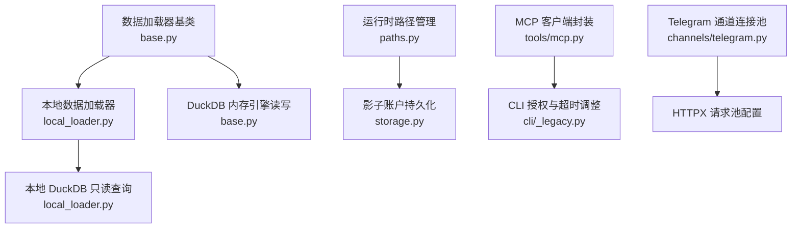
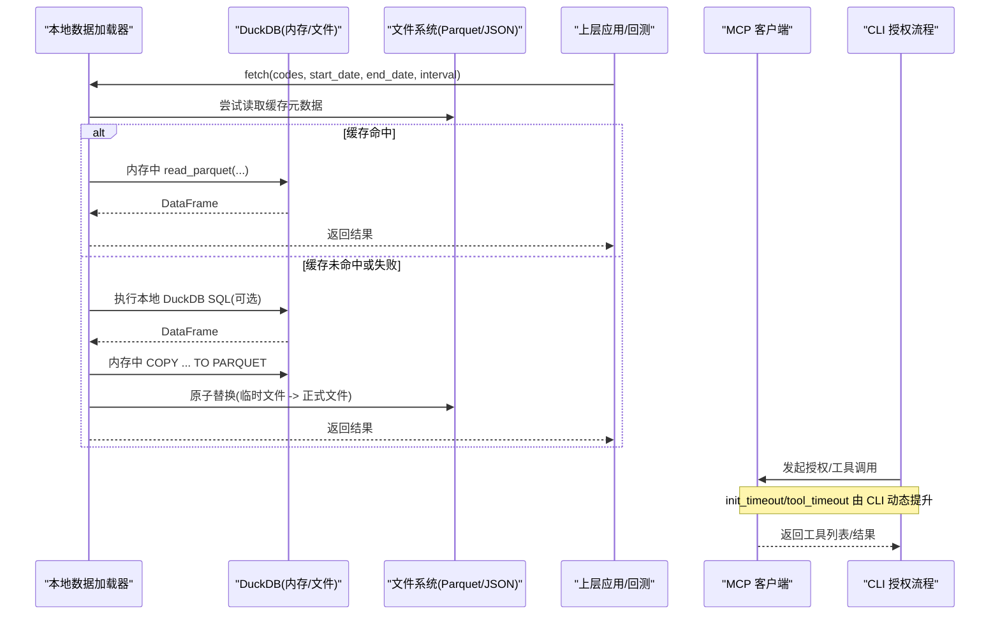
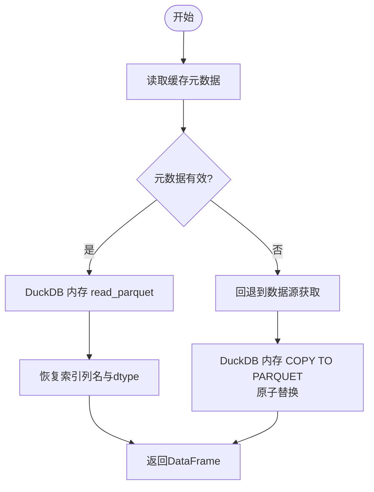
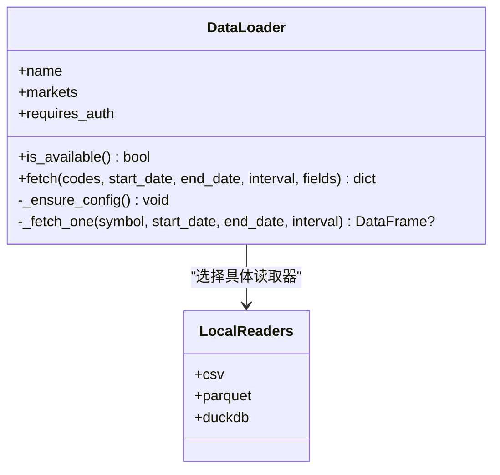
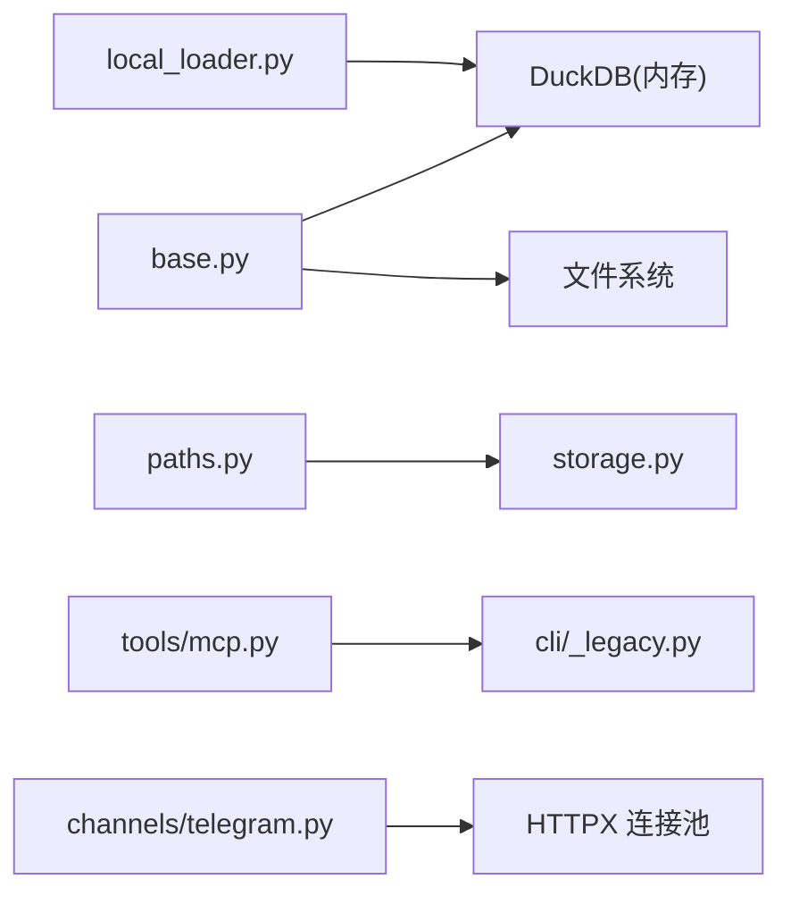

# 数据库优化

<cite>
**本文引用的文件**
- [agent/backtest/loaders/base.py](file://agent/backtest/loaders/base.py)
- [agent/backtest/loaders/local_loader.py](file://agent/backtest/loaders/local_loader.py)
- [agent/src/config/paths.py](file://agent/src/config/paths.py)
- [agent/src/shadow_account/storage.py](file://agent/src/shadow_account/storage.py)
- [agent/src/channels/telegram.py](file://agent/src/channels/telegram.py)
- [agent/src/tools/mcp.py](file://agent/src/tools/mcp.py)
- [agent/cli/_legacy.py](file://agent/cli/_legacy.py)
</cite>

## 目录
1. [简介](#简介)
2. [项目结构](#项目结构)
3. [核心组件](#核心组件)
4. [架构总览](#架构总览)
5. [详细组件分析](#详细组件分析)
6. [依赖关系分析](#依赖关系分析)
7. [性能考量](#性能考量)
8. [故障排除指南](#故障排除指南)
9. [结论](#结论)
10. [附录](#附录)

## 简介
本指南面向在量化与回测场景中需要高效、稳定地读写数据的工程实践，结合仓库中实际代码，系统性说明以下主题：
- SQL 执行计划分析与查询优化（以 DuckDB 为核心）
- 索引设计与查询重写策略（面向本地 CSV/Parquet/DuckDB 数据源）
- 连接池与事务管理（HTTP 客户端连接池、远程 MCP 工具调用超时与重试）
- 批量操作优化（内存内 DuckDB 写入 Parquet、原子替换、列名与索引类型保真）
- 数据存储优化（表结构设计、分区与归档思路）
- NoSQL/混合存储集成（DuckDB 使用技巧、向量检索的通用思路）
- 监控与排障（慢查询定位、锁竞争、容量规划）

## 项目结构
本项目在“数据加载与缓存”“本地数据源接入”“运行时路径与持久化”“外部服务连接与超时控制”等位置体现了数据库与存储优化的关键实现。下图给出与数据库优化相关的模块关系概览。

图表来源
- [agent/backtest/loaders/base.py:480-657](file://agent/backtest/loaders/base.py#L480-L657)
- [agent/backtest/loaders/local_loader.py:254-405](file://agent/backtest/loaders/local_loader.py#L254-L405)
- [agent/src/config/paths.py:13-113](file://agent/src/config/paths.py#L13-L113)
- [agent/src/shadow_account/storage.py:1-130](file://agent/src/shadow_account/storage.py#L1-L130)
- [agent/src/tools/mcp.py:724-759](file://agent/src/tools/mcp.py#L724-L759)
- [agent/cli/_legacy.py:3542-3566](file://agent/cli/_legacy.py#L3542-L3566)
- [agent/src/channels/telegram.py:516-542](file://agent/src/channels/telegram.py#L516-L542)

章节来源
- [agent/backtest/loaders/base.py:480-657](file://agent/backtest/loaders/base.py#L480-L657)
- [agent/backtest/loaders/local_loader.py:254-405](file://agent/backtest/loaders/local_loader.py#L254-L405)
- [agent/src/config/paths.py:13-113](file://agent/src/config/paths.py#L13-L113)
- [agent/src/shadow_account/storage.py:1-130](file://agent/src/shadow_account/storage.py#L1-L130)
- [agent/src/channels/telegram.py:516-542](file://agent/src/channels/telegram.py#L516-L542)
- [agent/src/tools/mcp.py:724-759](file://agent/src/tools/mcp.py#L724-L759)
- [agent/cli/_legacy.py:3542-3566](file://agent/cli/_legacy.py#L3542-L3566)

## 核心组件
- 数据加载器基类（base.py）
  - 负责将 DataFrame 序列化为 Parquet 并写入缓存；读取时通过 DuckDB 内存引擎从 Parquet 快速恢复为 DataFrame；记录并还原索引列名与 dtype，保证往返一致性。
- 本地数据加载器（local_loader.py）
  - 支持 CSV/Parquet/DuckDB 三种本地数据源；对 DuckDB 采用只读连接执行用户提供的 SQL；统一做时间范围过滤与时段重采样。
- 运行时路径与持久化（paths.py, storage.py）
  - 提供统一的运行时根目录与会话/运行产物目录；影子账户以 JSON 形式持久化，便于审计与回溯。
- 外部服务连接与超时（tools/mcp.py, cli/_legacy.py）
  - 封装 MCP 客户端，区分初始化超时与工具调用超时；CLI 在授权流程中动态提升超时阈值，避免长耗时鉴权被误杀。
- HTTP 连接池（channels/telegram.py）
  - 分离 API 请求与轮询请求的连接池，避免长轮询占用导致出站发送饥饿。

章节来源
- [agent/backtest/loaders/base.py:480-657](file://agent/backtest/loaders/base.py#L480-L657)
- [agent/backtest/loaders/local_loader.py:254-405](file://agent/backtest/loaders/local_loader.py#L254-L405)
- [agent/src/config/paths.py:13-113](file://agent/src/config/paths.py#L13-L113)
- [agent/src/shadow_account/storage.py:1-130](file://agent/src/shadow_account/storage.py#L1-L130)
- [agent/src/tools/mcp.py:724-759](file://agent/src/tools/mcp.py#L724-L759)
- [agent/cli/_legacy.py:3542-3566](file://agent/cli/_legacy.py#L3542-L3566)
- [agent/src/channels/telegram.py:516-542](file://agent/src/channels/telegram.py#L516-L542)

## 架构总览
下图展示数据从本地源到缓存再到消费端的整体流程，以及外部服务调用的超时与重试边界。

图表来源
- [agent/backtest/loaders/base.py:480-657](file://agent/backtest/loaders/base.py#L480-L657)
- [agent/backtest/loaders/local_loader.py:254-405](file://agent/backtest/loaders/local_loader.py#L254-L405)
- [agent/src/tools/mcp.py:724-759](file://agent/src/tools/mcp.py#L724-L759)
- [agent/cli/_legacy.py:3542-3566](file://agent/cli/_legacy.py#L3542-L3566)

## 详细组件分析

### 组件A：数据加载与缓存（base.py）
- 设计要点
  - 写路径：将 DataFrame 转为可缓存格式，记录索引列名、列轴名称与各层索引 dtype，使用 DuckDB 内存引擎写入 Parquet，并以临时文件+原子替换确保并发安全。
  - 读路径：优先读取元数据，再用 DuckDB 内存引擎从 Parquet 快速恢复 DataFrame，必要时恢复索引列名与 dtype，异常时降级回原始数据源。
- 复杂度与性能
  - 写：O(N) 序列化 + O(N) 磁盘写入；读：O(N) 反序列化；N 为行数。
  - 通过内存 DuckDB 与 Parquet 列式存储显著降低 IO 与 CPU 开销。
- 错误处理
  - 元数据损坏或读取失败均记录警告并回退；写失败清理临时文件，不阻塞主流程。

图表来源
- [agent/backtest/loaders/base.py:480-657](file://agent/backtest/loaders/base.py#L480-L657)

章节来源
- [agent/backtest/loaders/base.py:480-657](file://agent/backtest/loaders/base.py#L480-L657)

### 组件B：本地数据源接入（local_loader.py）
- 设计要点
  - 支持 CSV/Parquet/DuckDB 三类本地源；对 DuckDB 使用只读连接执行用户 SQL；统一进行时间窗口过滤与按区间重采样。
  - 通过注册机制扩展新的本地数据源类型。
- 性能与正确性
  - 只读模式避免意外写冲突；时间边界包含结束日全天，保障日内数据不被误删；空结果快速返回。
- 可扩展性
  - 列映射与日期格式可配置，适配不同数据提供方约定。

图表来源
- [agent/backtest/loaders/local_loader.py:254-405](file://agent/backtest/loaders/local_loader.py#L254-L405)

章节来源
- [agent/backtest/loaders/local_loader.py:254-405](file://agent/backtest/loaders/local_loader.py#L254-L405)

### 组件C：运行时路径与持久化（paths.py, storage.py）
- 设计要点
  - 统一运行时根目录与会话/运行产物目录；影子账户以 JSON 持久化，支持基于日志哈希查找最近一次匹配档案。
- 可靠性
  - 目录按需创建；读取失败时跳过或抛出明确异常；哈希用于幂等提取。

章节来源
- [agent/src/config/paths.py:13-113](file://agent/src/config/paths.py#L13-L113)
- [agent/src/shadow_account/storage.py:1-130](file://agent/src/shadow_account/storage.py#L1-L130)

### 组件D：外部服务连接与超时（tools/mcp.py, cli/_legacy.py）
- 设计要点
  - 区分初始化超时与工具调用超时；CLI 在授权阶段动态提升超时，避免人脸验证等长耗时流程被中断。
- 适用场景
  - 远程 MCP 服务器冷启动、OAuth 授权、网络抖动等场景下的健壮性保障。

章节来源
- [agent/src/tools/mcp.py:724-759](file://agent/src/tools/mcp.py#L724-L759)
- [agent/cli/_legacy.py:3542-3566](file://agent/cli/_legacy.py#L3542-L3566)

### 组件E：HTTP 连接池（channels/telegram.py）
- 设计要点
  - 分离 API 请求与 getUpdates 轮询的请求池，避免长轮询占满连接导致出站消息发送饥饿。
- 参数建议
  - 根据并发量与上游限制合理设置连接池大小与超时。

章节来源
- [agent/src/channels/telegram.py:516-542](file://agent/src/channels/telegram.py#L516-L542)

## 依赖关系分析
- base.py 依赖 DuckDB 进行内存中的 Parquet 读写，并通过文件系统完成原子替换。
- local_loader.py 依赖 DuckDB 只读连接执行用户 SQL，并与 base.py 的缓存机制配合。
- paths.py 与 storage.py 提供统一的持久化路径与数据结构。
- tools/mcp.py 与 cli/_legacy.py 共同管理外部服务的超时与重试边界。
- channels/telegram.py 通过 HTTPX 配置连接池，影响对外部服务的并发与稳定性。

图表来源
- [agent/backtest/loaders/base.py:480-657](file://agent/backtest/loaders/base.py#L480-L657)
- [agent/backtest/loaders/local_loader.py:254-405](file://agent/backtest/loaders/local_loader.py#L254-L405)
- [agent/src/config/paths.py:13-113](file://agent/src/config/paths.py#L13-L113)
- [agent/src/shadow_account/storage.py:1-130](file://agent/src/shadow_account/storage.py#L1-L130)
- [agent/src/tools/mcp.py:724-759](file://agent/src/tools/mcp.py#L724-L759)
- [agent/cli/_legacy.py:3542-3566](file://agent/cli/_legacy.py#L3542-L3566)
- [agent/src/channels/telegram.py:516-542](file://agent/src/channels/telegram.py#L516-L542)

## 性能考量
- 查询优化
  - 使用 DuckDB 内存引擎直接对 Parquet 进行列式扫描，减少中间对象转换；在本地 DuckDB 文件中通过 WHERE 条件与投影列减少 IO。
  - 在写入缓存时保留索引列名与 dtype，避免后续重建成本。
- 索引设计原则
  - 对频繁过滤的列建立合适索引（如交易日期、标的代码）；对高基数列谨慎建复合索引，避免维护成本过高。
  - 在 DuckDB 中利用向量化执行与并行扫描，尽量让谓词下推到存储层。
- 查询重写策略
  - 将多步聚合拆分为物化中间结果；避免 SELECT *，仅选取必要列；使用子查询提前过滤以减少后续计算量。
- 连接池与事务
  - 对高频短事务使用连接池复用连接；对批量写入使用事务包裹以降低 fsync 次数。
- 批量操作
  - 使用内存 DuckDB 将 DataFrame 批量写入 Parquet，再以原子替换落盘，兼顾吞吐与一致性。
- 存储优化
  - 表结构扁平化、冷热分层；大表按时间分区；历史数据归档至低成本介质。
- 监控与排障
  - 采集慢查询日志、执行计划与锁等待信息；结合容量规划预留缓冲空间。

[本节为通用指导，不直接分析具体文件]

## 故障排除指南
- 缓存读取失败
  - 现象：元数据损坏或 Parquet 读取异常。
  - 处理：记录警告并回退到数据源重新拉取；检查磁盘权限与可用空间。
- 本地 DuckDB 查询失败
  - 现象：SQL 语法错误或表不存在。
  - 处理：校验 db_path 与 query；确认表结构与列名映射；逐步缩小查询范围定位问题。
- 超时与授权失败
  - 现象：MCP 授权或工具调用超时。
  - 处理：通过 CLI 提升 init_timeout 与 tool_timeout；检查网络与凭据；增加重试与退避。
- 连接池饥饿
  - 现象：长轮询占用连接导致出站消息延迟。
  - 处理：分离轮询与 API 请求的连接池；调整 pool_size 与超时参数。

章节来源
- [agent/backtest/loaders/base.py:480-657](file://agent/backtest/loaders/base.py#L480-L657)
- [agent/backtest/loaders/local_loader.py:254-405](file://agent/backtest/loaders/local_loader.py#L254-L405)
- [agent/src/tools/mcp.py:724-759](file://agent/src/tools/mcp.py#L724-L759)
- [agent/cli/_legacy.py:3542-3566](file://agent/cli/_legacy.py#L3542-L3566)
- [agent/src/channels/telegram.py:516-542](file://agent/src/channels/telegram.py#L516-L542)

## 结论
本项目在数据加载、缓存与本地数据源接入方面采用了以 DuckDB 为核心的高性能方案，结合 Parquet 列式存储与原子替换，实现了高吞吐与强一致性的平衡。同时，通过分离连接池、精细化超时控制与稳健的错误回退机制，提升了系统在复杂网络与服务环境下的鲁棒性。建议在大规模数据场景下进一步引入分区、归档与监控告警，持续优化查询计划与资源利用率。

[本节为总结，不直接分析具体文件]

## 附录
- 实用清单
  - 慢查询分析：启用 DuckDB 执行计划输出，关注全表扫描与笛卡尔积。
  - 索引设计：优先对等值与范围查询列建索引，复合索引注意选择性。
  - 查询重写：拆分复杂查询、物化中间结果、避免不必要列与行。
  - 连接池：按并发与上游限制调优 pool_size、超时与重试。
  - 批量写入：事务包裹、分批提交、落盘后原子替换。
  - 存储分层：热数据内存/SSD，温数据 SSD，冷数据对象存储。
  - 容量规划：监控磁盘增长、热点表大小与查询延迟分布。

[本节为补充信息，不直接分析具体文件]