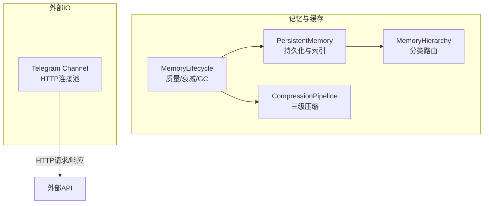
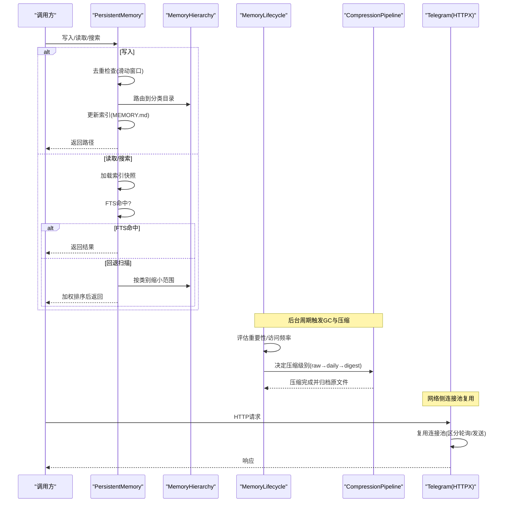
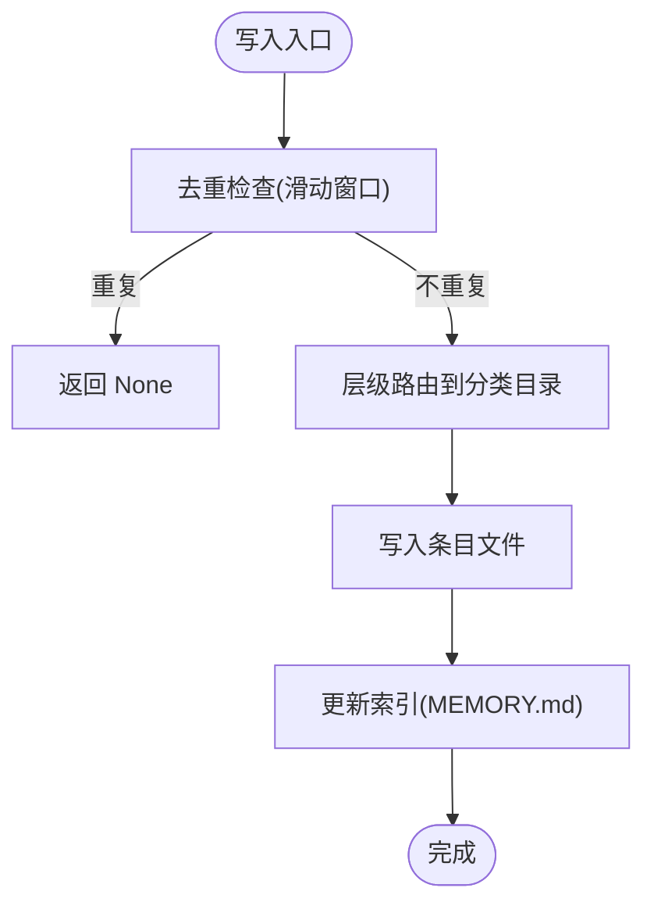
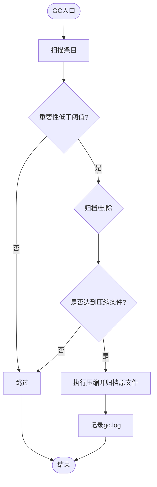
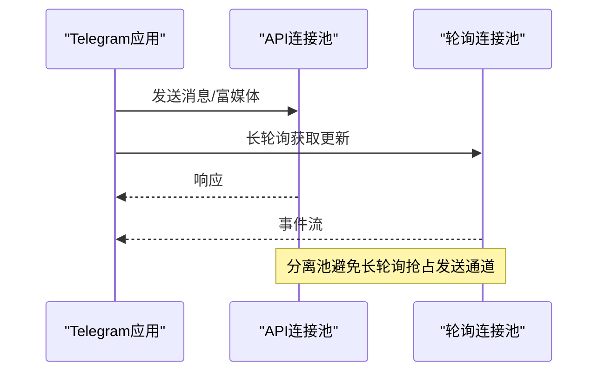
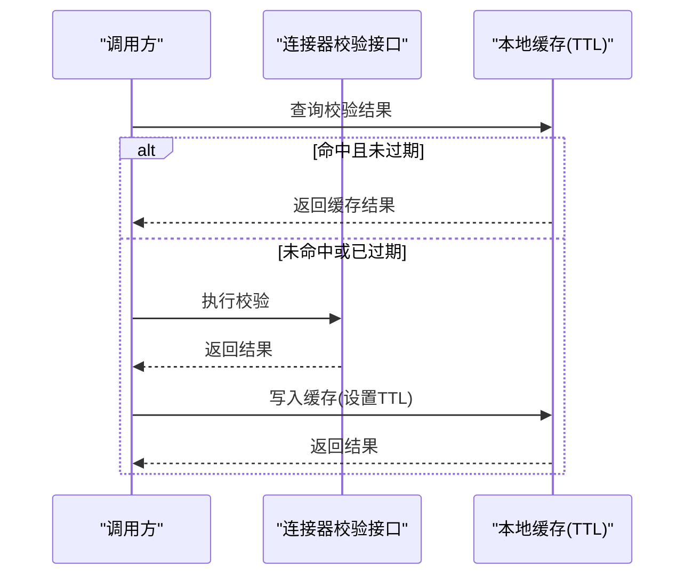
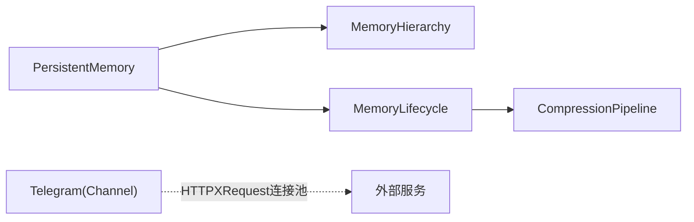

# 缓存策略优化

<cite>
**本文引用的文件**
- [agent/src/memory/persistent.py](file://agent/src/memory/persistent.py)
- [agent/src/memory/hierarchy.py](file://agent/src/memory/hierarchy.py)
- [agent/src/memory/lifecycle.py](file://agent/src/memory/lifecycle.py)
- [agent/src/memory/compression.py](file://agent/src/memory/compression.py)
- [agent/src/channels/telegram.py](file://agent/src/channels/telegram.py)
- [agent/tests/test_longbridge_runtime.py](file://agent/tests/test_longbridge_runtime.py)
</cite>

## 目录
1. [简介](#简介)
2. [项目结构](#项目结构)
3. [核心组件](#核心组件)
4. [架构总览](#架构总览)
5. [详细组件分析](#详细组件分析)
6. [依赖关系分析](#依赖关系分析)
7. [性能考虑](#性能考虑)
8. [故障排查指南](#故障排查指南)
9. [结论](#结论)
10. [附录](#附录)

## 简介
本文件围绕“缓存策略优化”目标，结合代码库中的持久化记忆、压缩与生命周期管理、HTTP连接池等实现，系统化阐述多级缓存架构（L1/L2）、缓存失效策略、一致性保证机制；并说明数据缓存优化（热点识别、预加载、预热）、计算结果缓存（函数结果缓存、增量计算、版本管理）以及连接池管理（数据库/HTTP连接池、资源复用）。最后给出可落地的调优案例与最佳实践。

## 项目结构
本项目在“记忆/缓存”相关能力上主要分布在 memory 子模块与 channels 的 HTTP 客户端配置中：
- 持久化与索引：persistent.py 提供基于文件的内存条目存储、去重、检索、索引维护。
- 层级路由：hierarchy.py 将条目按类别分目录组织，缩小扫描范围，提升检索效率。
- 生命周期与GC：lifecycle.py 负责质量评分、衰减、垃圾回收与压缩触发。
- 压缩管线：compression.py 提供三级压缩（原始→每日摘要→要点摘要），降低长期存储成本。
- 连接池：channels/telegram.py 使用 HTTPXRequest 为不同用途建立独立连接池，避免长轮询占用发送通道。
- 测试用例：test_longbridge_runtime.py 验证了连接校验结果的本地缓存与TTL过期行为。

图表来源
- [agent/src/memory/persistent.py:200-654](file://agent/src/memory/persistent.py#L200-L654)
- [agent/src/memory/hierarchy.py:34-436](file://agent/src/memory/hierarchy.py#L34-L436)
- [agent/src/memory/lifecycle.py:71-421](file://agent/src/memory/lifecycle.py#L71-L421)
- [agent/src/memory/compression.py:163-356](file://agent/src/memory/compression.py#L163-L356)
- [agent/src/channels/telegram.py:510-542](file://agent/src/channels/telegram.py#L510-L542)

章节来源
- [agent/src/memory/persistent.py:200-654](file://agent/src/memory/persistent.py#L200-L654)
- [agent/src/memory/hierarchy.py:34-436](file://agent/src/memory/hierarchy.py#L34-L436)
- [agent/src/memory/lifecycle.py:71-421](file://agent/src/memory/lifecycle.py#L71-L421)
- [agent/src/memory/compression.py:163-356](file://agent/src/memory/compression.py#L163-L356)
- [agent/src/channels/telegram.py:510-542](file://agent/src/channels/telegram.py#L510-L542)

## 核心组件
- 持久化记忆（L1/L2 的基础层）
  - 以文件为介质，构建 MEMORY.md 索引快照，支持快速注入系统提示。
  - 内容去重：滑动窗口内基于名称+描述+内容的哈希判断重复写入。
  - 检索：优先 FTS 索引命中，否则回退到关键词打分与重要性加权排序。
  - 层级路由：按类别分目录组织，缩小扫描范围，O(类别大小) 级别检索。
- 生命周期与压缩（L2 冷数据下沉）
  - 质量评分与访问计数驱动重要性衰减，控制热/冷数据分布。
  - 垃圾回收：依据重要性阈值归档或删除，保持容量可控。
  - 三级压缩：原始→每日摘要→要点摘要，显著降低长期存储体积。
- HTTP 连接池（网络侧缓存与复用）
  - 分离 API 与轮询的连接池，避免长轮询抢占发送通道。
  - 通过连接池复用减少握手开销，提高吞吐与稳定性。
- 连接校验缓存（示例：连接器连通性）
  - 对昂贵或低频但必要的检查进行本地缓存，带 TTL 与强制刷新能力。

章节来源
- [agent/src/memory/persistent.py:200-654](file://agent/src/memory/persistent.py#L200-L654)
- [agent/src/memory/lifecycle.py:71-421](file://agent/src/memory/lifecycle.py#L71-L421)
- [agent/src/memory/compression.py:163-356](file://agent/src/memory/compression.py#L163-L356)
- [agent/src/channels/telegram.py:510-542](file://agent/src/channels/telegram.py#L510-L542)
- [agent/tests/test_longbridge_runtime.py:696-735](file://agent/tests/test_longbridge_runtime.py#L696-L735)

## 架构总览
下图展示从请求进入、命中 L1（进程内/索引快照）到 L2（分层目录与压缩）的完整路径，以及连接池复用与一致性保障点。

图表来源
- [agent/src/memory/persistent.py:200-654](file://agent/src/memory/persistent.py#L200-L654)
- [agent/src/memory/hierarchy.py:34-436](file://agent/src/memory/hierarchy.py#L34-L436)
- [agent/src/memory/lifecycle.py:71-421](file://agent/src/memory/lifecycle.py#L71-L421)
- [agent/src/memory/compression.py:163-356](file://agent/src/memory/compression.py#L163-L356)
- [agent/src/channels/telegram.py:510-542](file://agent/src/channels/telegram.py#L510-L542)

## 详细组件分析

### 持久化记忆（L1 缓存与索引）
- 设计要点
  - 索引快照：启动时加载 MEMORY.md 前 N 行作为冻结快照，用于系统提示注入，避免频繁 IO。
  - 去重：基于 name/description/content 的哈希，配合滑动窗口防止重试/并发导致的重复写入。
  - 检索：优先 FTS 索引命中；未命中则回退到 token 匹配 + 元数据权重 + 正文权重，并结合重要性衰减排序。
  - 层级路由：启用 hierarchy 时，按类别分目录组织，scan_all/scans_category 仅扫描必要范围。
- 复杂度与性能
  - 写入：O(1) 去重检查 + O(k) 索引更新（k 为索引行数上限）。
  - 检索：FTS 命中近似 O(log n)；回退扫描 O(n) 但可通过层级路由缩小 n。
- 一致性
  - 写路径加文件锁，避免多进程竞争；失败时记录日志并降级。
- 关键路径参考
  - 写入与索引更新：[写入入口与索引维护:479-595](file://agent/src/memory/persistent.py#L479-L595)
  - 检索与回退：[检索与回退逻辑:362-455](file://agent/src/memory/persistent.py#L362-L455)
  - 去重窗口：[去重与清理:472-492](file://agent/src/memory/persistent.py#L472-L492)
  - 层级路由：[分类路由与扫描:70-176](file://agent/src/memory/hierarchy.py#L70-L176)

图表来源
- [agent/src/memory/persistent.py:479-595](file://agent/src/memory/persistent.py#L479-L595)
- [agent/src/memory/hierarchy.py:70-176](file://agent/src/memory/hierarchy.py#L70-L176)

章节来源
- [agent/src/memory/persistent.py:200-654](file://agent/src/memory/persistent.py#L200-L654)
- [agent/src/memory/hierarchy.py:34-436](file://agent/src/memory/hierarchy.py#L34-L436)

### 生命周期与压缩（L2 冷数据下沉）
- 设计要点
  - 质量评分与访问计数：通过事件反馈调整 quality_score，结合访问次数与最近访问时间计算 importance。
  - 衰减公式：Ebbinghaus 风格指数衰减，访问奖励上限封顶，避免无限增长。
  - GC 策略：按重要性阈值归档或删除，保留最小年龄，输出 gc.log 审计。
  - 压缩管线：raw→daily→digest，分别采用关键句抽取与 TF-IDF 关键词摘要，同时归档原文件。
- 复杂度与性能
  - GC：遍历 entries O(n)，压缩决策 O(1)，压缩过程取决于文本长度。
  - 压缩：TF-IDF 计算 O(d·t)，d 为句子数，t 为词项数；总体可控。
- 一致性
  - 所有写操作均受文件锁保护；压缩采用临时文件 + 原子替换，避免损坏。
- 关键路径参考
  - 衰减与重要性：[重要性计算:75-92](file://agent/src/memory/persistent.py#L75-L92)
  - 强化与访问追踪：[reinforce/track_access:112-178](file://agent/src/memory/lifecycle.py#L112-L178)
  - GC 流程：[run_gc:183-273](file://agent/src/memory/lifecycle.py#L183-L273)
  - 压缩管线：[should_compress/apply_compression:171-337](file://agent/src/memory/compression.py#L171-L337)

图表来源
- [agent/src/memory/lifecycle.py:183-273](file://agent/src/memory/lifecycle.py#L183-L273)
- [agent/src/memory/compression.py:171-337](file://agent/src/memory/compression.py#L171-L337)

章节来源
- [agent/src/memory/lifecycle.py:71-421](file://agent/src/memory/lifecycle.py#L71-L421)
- [agent/src/memory/compression.py:163-356](file://agent/src/memory/compression.py#L163-L356)
- [agent/src/memory/persistent.py:75-92](file://agent/src/memory/persistent.py#L75-L92)

### HTTP 连接池（网络侧缓存与复用）
- 设计要点
  - 分离连接池：为 API 发送与长轮询（getUpdates）分别创建 HTTPXRequest，避免轮询占用发送通道。
  - 超时与代理：统一设置连接/读取超时与代理，确保稳定性。
  - 重试与限流：发送失败时指数退避重试，处理平台限流（Retry-After）。
- 性能影响
  - 连接复用减少握手与TLS协商开销，提升吞吐。
  - 分离池避免“饥饿”，保障消息下发延迟。
- 关键路径参考
  - 连接池初始化：[start() 中创建两个HTTPXRequest:510-542](file://agent/src/channels/telegram.py#L510-L542)
  - 发送重试：[发送重试与退避:860-880](file://agent/src/channels/telegram.py#L860-L880)

图表来源
- [agent/src/channels/telegram.py:510-542](file://agent/src/channels/telegram.py#L510-L542)
- [agent/src/channels/telegram.py:860-880](file://agent/src/channels/telegram.py#L860-L880)

章节来源
- [agent/src/channels/telegram.py:510-542](file://agent/src/channels/telegram.py#L510-L542)
- [agent/src/channels/telegram.py:860-880](file://agent/src/channels/telegram.py#L860-L880)

### 连接校验缓存（示例：连接器连通性）
- 设计要点
  - 本地缓存：对昂贵的连接校验结果进行缓存，默认 TTL 较短（如秒级），避免频繁探测。
  - 强制刷新：支持 force=true 绕过缓存，直接重新校验。
  - 测试覆盖：通过模拟时间推进验证 TTL 过期与缓存命中。
- 关键路径参考
  - 缓存命中与过期行为：[测试断言:696-735](file://agent/tests/test_longbridge_runtime.py#L696-L735)

图表来源
- [agent/tests/test_longbridge_runtime.py:696-735](file://agent/tests/test_longbridge_runtime.py#L696-L735)

章节来源
- [agent/tests/test_longbridge_runtime.py:696-735](file://agent/tests/test_longbridge_runtime.py#L696-L735)

## 依赖关系分析
- 组件耦合
  - PersistentMemory 依赖 MemoryHierarchy（可选）以缩小扫描范围；依赖 Lifecycle 提供的质量/衰减语义；依赖 CompressionPipeline 进行冷数据压缩。
  - Lifecycle 依赖 PersistentMemory 进行读写与重建索引；依赖 CompressionPipeline 执行压缩。
  - Telegram Channel 独立于记忆模块，通过 HTTPXRequest 管理连接池，体现横向复用。
- 外部依赖
  - 文件系统：索引、条目、归档、日志。
  - 可选 FTS 索引：加速检索，失败自动回退。
- 潜在循环依赖
  - 通过按需 import（惰性导入）避免启动期循环依赖。

图表来源
- [agent/src/memory/persistent.py:200-654](file://agent/src/memory/persistent.py#L200-L654)
- [agent/src/memory/hierarchy.py:34-436](file://agent/src/memory/hierarchy.py#L34-L436)
- [agent/src/memory/lifecycle.py:71-421](file://agent/src/memory/lifecycle.py#L71-L421)
- [agent/src/memory/compression.py:163-356](file://agent/src/memory/compression.py#L163-L356)
- [agent/src/channels/telegram.py:510-542](file://agent/src/channels/telegram.py#L510-L542)

章节来源
- [agent/src/memory/persistent.py:200-654](file://agent/src/memory/persistent.py#L200-L654)
- [agent/src/memory/lifecycle.py:71-421](file://agent/src/memory/lifecycle.py#L71-L421)
- [agent/src/memory/compression.py:163-356](file://agent/src/memory/compression.py#L163-L356)
- [agent/src/channels/telegram.py:510-542](file://agent/src/channels/telegram.py#L510-L542)

## 性能考虑
- 命中率优化
  - 启用层级路由，将扫描范围从全量降至类别级，显著提升命中率与检索速度。
  - 合理设置 FTS 开关，命中即走快速路径；异常时自动回退。
- 内存使用控制
  - 索引快照限制最大行数，避免过大索引占用内存。
  - 去重滑动窗口定期清理过期哈希，控制内存占用。
- 分布式缓存同步（概念建议）
  - 若扩展至多实例，可将 MEMORY.md 置于共享存储，或使用 Redis/Memcached 缓存热点条目与校验结果；通过版本号或时间戳保证一致性。
- 连接池调优
  - 根据并发与上游限流调整连接池大小与超时；分离轮询与发送池，避免相互影响。

[本节为通用指导，无需特定文件引用]

## 故障排查指南
- 写入冲突与锁超时
  - 现象：写入或移除条目时报锁超时。
  - 排查：确认是否存在多进程并发写入；检查磁盘权限与锁文件；查看日志告警。
  - 参考：[写入/移除时的文件锁:41-73](file://agent/src/memory/persistent.py#L41-L73)
- 检索结果为空
  - 现象：FTS 命中为空，回退扫描也未找到。
  - 排查：检查条目是否被归档/压缩；确认层级目录是否正确；查看 FTS 是否可用。
  - 参考：[检索与回退:362-455](file://agent/src/memory/persistent.py#L362-L455)
- GC 未生效
  - 现象：冷数据未归档或压缩。
  - 排查：确认 GC 与压缩开关；检查重要性阈值与最小年龄；查看 gc.log。
  - 参考：[GC 流程:183-273](file://agent/src/memory/lifecycle.py#L183-L273)
- 发送失败与限流
  - 现象：Telegram 发送超时或被限流。
  - 排查：检查重试次数与退避策略；确认 Retry-After 处理；观察连接池状态。
  - 参考：[发送重试与限流:860-880](file://agent/src/channels/telegram.py#L860-L880)

章节来源
- [agent/src/memory/persistent.py:41-73](file://agent/src/memory/persistent.py#L41-L73)
- [agent/src/memory/persistent.py:362-455](file://agent/src/memory/persistent.py#L362-L455)
- [agent/src/memory/lifecycle.py:183-273](file://agent/src/memory/lifecycle.py#L183-L273)
- [agent/src/channels/telegram.py:860-880](file://agent/src/channels/telegram.py#L860-L880)

## 结论
该代码库实现了稳健的多级缓存体系：以文件为基础，通过索引快照与层级路由实现高效 L1 缓存；借助生命周期管理与压缩管线将冷数据下沉至 L2，兼顾性能与存储成本；在网络侧通过分离连接池与重试策略提升稳定性。结合连接校验缓存示例，展示了本地缓存与 TTL 的实践方法。建议在分布式场景引入共享缓存与版本一致性机制，进一步放大收益。

[本节为总结，无需特定文件引用]

## 附录
- 配置与环境变量
  - 质量评分、衰减、GC、压缩、FTS、层级路由等能力均可通过环境变量开关，便于在不同环境灵活裁剪。
- 最佳实践清单
  - 开启层级路由，缩小检索范围。
  - 合理设置 GC 阈值与最小年龄，定期归档冷数据。
  - 启用压缩管线，降低长期存储成本。
  - 分离连接池，避免长轮询抢占发送通道。
  - 对昂贵校验接口实施本地缓存与 TTL，必要时支持强制刷新。

[本节为补充信息，无需特定文件引用]