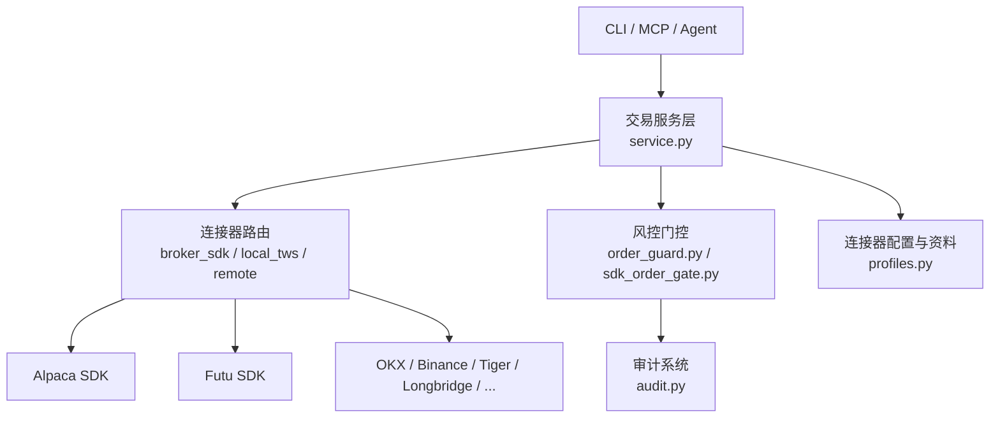
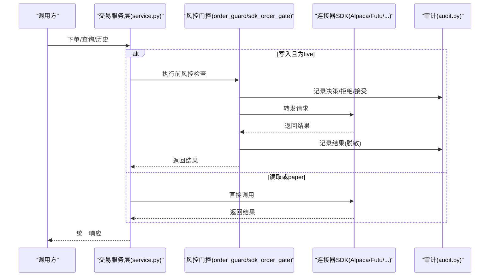
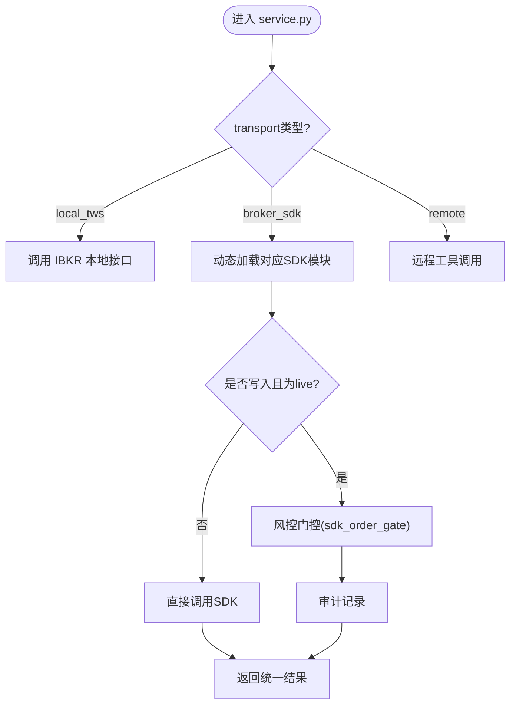
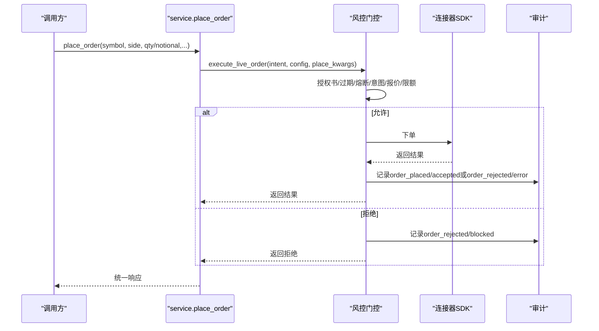
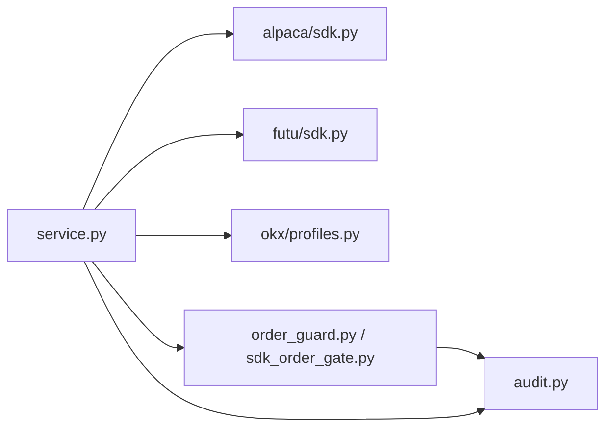

# 交易连接器扩展

<cite>
**本文引用的文件**
- [agent/src/trading/service.py](file://agent/src/trading/service.py)
- [agent/src/trading/connectors/alpaca/sdk.py](file://agent/src/trading/connectors/alpaca/sdk.py)
- [agent/src/trading/connectors/futu/sdk.py](file://agent/src/trading/connectors/futu/sdk.py)
- [agent/src/live/order_guard.py](file://agent/src/live/order_guard.py)
- [agent/src/live/sdk_order_gate.py](file://agent/src/live/sdk_order_gate.py)
- [agent/src/live/audit.py](file://agent/src/live/audit.py)
- [agent/src/trading/__init__.py](file://agent/src/trading/__init__.py)
- [agent/src/trading/connectors/okx/profiles.py](file://agent/src/trading/connectors/okx/profiles.py)
</cite>

## 目录
1. [简介](#简介)
2. [项目结构](#项目结构)
3. [核心组件](#核心组件)
4. [架构总览](#架构总览)
5. [详细组件分析](#详细组件分析)
6. [依赖关系分析](#依赖关系分析)
7. [性能与可靠性](#性能与可靠性)
8. [故障排查指南](#故障排查指南)
9. [结论](#结论)
10. [附录](#附录)

## 简介
本文件面向“交易连接器扩展”的完整设计与实现，覆盖以下目标：
- 抽象接口设计：统一的订单管理、账户查询、市场数据API。
- 协议适配机制：REST API、WebSocket、FIX等券商接口的适配方式与扩展点。
- 订单生命周期：从创建、状态跟踪、成交确认到撤单的完整流程。
- 风险控制集成：仓位限制、止损止盈、异常检测与熔断。
- 多券商适配示例：IBKR、Alpaca、Futu等主流券商的连接方式与环境隔离。
- 连接池管理、重连机制、错误恢复策略。
- 模拟交易与实盘交易的无缝切换。
- 审计日志与合规性要求。

## 项目结构
本项目将“交易连接器”作为可插拔模块组织，通过统一的服务层对外暴露一致的读/写能力；在运行时由风控门控（Mandate Enforcement）对写入操作进行强约束，并通过审计系统记录所有关键动作。

图表来源
- [agent/src/trading/service.py:1-120](file://agent/src/trading/service.py#L1-L120)
- [agent/src/trading/connectors/alpaca/sdk.py:1-60](file://agent/src/trading/connectors/alpaca/sdk.py#L1-L60)
- [agent/src/trading/connectors/futu/sdk.py:1-60](file://agent/src/trading/connectors/futu/sdk.py#L1-L60)
- [agent/src/live/order_guard.py:1-120](file://agent/src/live/order_guard.py#L1-L120)
- [agent/src/live/sdk_order_gate.py:411-446](file://agent/src/live/sdk_order_gate.py#L411-L446)
- [agent/src/live/audit.py:1-60](file://agent/src/live/audit.py#L1-L60)
- [agent/src/trading/connectors/okx/profiles.py:49-70](file://agent/src/trading/connectors/okx/profiles.py#L49-L70)

章节来源
- [agent/src/trading/service.py:1-120](file://agent/src/trading/service.py#L1-L120)
- [agent/src/trading/connectors/alpaca/sdk.py:1-60](file://agent/src/trading/connectors/alpaca/sdk.py#L1-L60)
- [agent/src/trading/connectors/futu/sdk.py:1-60](file://agent/src/trading/connectors/futu/sdk.py#L1-L60)
- [agent/src/live/order_guard.py:1-120](file://agent/src/live/order_guard.py#L1-L120)
- [agent/src/live/sdk_order_gate.py:411-446](file://agent/src/live/sdk_order_gate.py#L411-L446)
- [agent/src/live/audit.py:1-60](file://agent/src/live/audit.py#L1-L60)
- [agent/src/trading/connectors/okx/profiles.py:49-70](file://agent/src/trading/connectors/okx/profiles.py#L49-L70)

## 核心组件
- 交易服务层（service.py）
  - 提供统一的读/写入口：检查连接、账户、持仓、挂单、报价、历史行情、下单、撤单、平仓等。
  - 根据profile的transport选择本地TWS、broker_sdk或直接远程调用。
  - 对live环境下的写入操作，强制走sdk_order_gate风控门控。
- 风控门控（order_guard.py, sdk_order_gate.py）
  - 前置校验：授权书（mandate）、过期、熔断开关、意图解析、实时报价、仓位与余额快照。
  - 量化限制：名义金额、敞口、杠杆、日交易次数等。
  - 审计：所有决策与结果写入审计账本，支持脱敏与链式防篡改副本。
- 审计系统（audit.py）
  - 追加型审计账本，三路输出：合规账本、运行期TraceWriter、SSE事件回调。
  - 敏感信息脱敏，确保请求/响应不泄露密钥、账号等。
- 连接器SDK（alpaca/futu/okx/...）
  - 每个券商提供独立的配置构建、状态检查、账户/持仓/订单/报价/历史数据读取，以及必要的写入能力。
  - 通过service.py的统一路由接入，屏蔽底层差异。

章节来源
- [agent/src/trading/service.py:1-120](file://agent/src/trading/service.py#L1-L120)
- [agent/src/live/order_guard.py:1-120](file://agent/src/live/order_guard.py#L1-L120)
- [agent/src/live/sdk_order_gate.py:411-446](file://agent/src/live/sdk_order_gate.py#L411-L446)
- [agent/src/live/audit.py:1-60](file://agent/src/live/audit.py#L1-L60)
- [agent/src/trading/connectors/alpaca/sdk.py:1-60](file://agent/src/trading/connectors/alpaca/sdk.py#L1-L60)
- [agent/src/trading/connectors/futu/sdk.py:1-60](file://agent/src/trading/connectors/futu/sdk.py#L1-L60)

## 架构总览
下图展示从调用方到券商的端到端路径，包括风控门控与审计落盘。

图表来源
- [agent/src/trading/service.py:283-346](file://agent/src/trading/service.py#L283-L346)
- [agent/src/live/order_guard.py:130-215](file://agent/src/live/order_guard.py#L130-L215)
- [agent/src/live/sdk_order_gate.py:411-446](file://agent/src/live/sdk_order_gate.py#L411-L446)
- [agent/src/live/audit.py:1-60](file://agent/src/live/audit.py#L1-L60)

## 详细组件分析

### 统一API抽象与服务路由
- 统一读接口：账户、持仓、挂单、报价、历史行情。
- 统一写接口：下单、撤单、部分平仓（如eToro）。
- 路由策略：
  - local_tws：针对IBKR本地TWS/Gateway。
  - broker_sdk：通过各券商SDK模块动态加载。
  - remote：通过MCP/远程通道调用。
- 环境隔离：profile包含environment字段（paper/live），用于区分模拟与实盘。

图表来源
- [agent/src/trading/service.py:42-117](file://agent/src/trading/service.py#L42-L117)
- [agent/src/trading/service.py:283-346](file://agent/src/trading/service.py#L283-L346)

章节来源
- [agent/src/trading/service.py:42-117](file://agent/src/trading/service.py#L42-L117)
- [agent/src/trading/service.py:283-346](file://agent/src/trading/service.py#L283-L346)

### 订单生命周期管理
- 创建：通过service.place_order构造OrderIntent并进入风控门控。
- 风控：检查授权书、过期、熔断、意图解析、实时价格、仓位与余额、限额。
- 执行：允许后转发至连接器SDK；失败则记录拒绝。
- 状态跟踪：通过get_open_orders、get_positions、get_account等接口同步。
- 成交确认：审计记录outcome为accepted/filled/rejected/error/blocked。
- 撤单：cancel_order走风控门控的“风险降低”路径，仍记录审计。

图表来源
- [agent/src/trading/service.py:283-346](file://agent/src/trading/service.py#L283-L346)
- [agent/src/live/sdk_order_gate.py:411-446](file://agent/src/live/sdk_order_gate.py#L411-L446)
- [agent/src/live/order_guard.py:130-215](file://agent/src/live/order_guard.py#L130-L215)

章节来源
- [agent/src/trading/service.py:283-346](file://agent/src/trading/service.py#L283-L346)
- [agent/src/live/order_guard.py:130-215](file://agent/src/live/order_guard.py#L130-L215)
- [agent/src/live/sdk_order_gate.py:411-446](file://agent/src/live/sdk_order_gate.py#L411-L446)

### 协议适配机制（REST、WebSocket、FIX）
- REST API：Alpaca、OKX、Binance等通过HTTP REST访问交易与行情。
- WebSocket：部分券商使用WebSocket推送实时行情与订单状态更新（例如加密货币交易所）。
- FIX协议：IBKR可通过本地TWS/Gateway以FIX风格交互，服务层通过local_tws路由处理。
- 适配器扩展点：
  - 新增券商时，在service._SDK_CONNECTOR_MODULES注册模块路径。
  - 在connector目录下实现build_config、check_status、get_*、place_order/cancel等接口。
  - 若需WebSocket/FIX，可在connector内部封装连接管理与消息映射，对外仍暴露统一接口。

章节来源
- [agent/src/trading/service.py:13-29](file://agent/src/trading/service.py#L13-L29)
- [agent/src/trading/connectors/alpaca/sdk.py:1-60](file://agent/src/trading/connectors/alpaca/sdk.py#L1-L60)
- [agent/src/trading/connectors/futu/sdk.py:1-25](file://agent/src/trading/connectors/futu/sdk.py#L1-L25)

### 风险控制集成（仓位限制、止损止盈、异常检测）
- 授权书（Mandate）：定义允许的交易范围、资产类别、最大名义金额、最大敞口、杠杆上限、每日交易次数等。
- 风控门控：
  - 结构化限制：宇宙/品种白名单、资产类别限制。
  - 量化限制：名义金额、敞口、杠杆、日交易次数。
  - 实时报价：当仅指定quantity时，通过broker quote或数据加载器获取USD价格，取较大值作为名义金额，防止绕过限额。
  - 熔断开关：halt_flag_set触发时拒绝所有写入。
- 止损止盈：
  - eToro连接器提供edit_position_stops接口，用于修改现有仓位的止损/止盈参数。
  - 其他券商可通过各自SDK暴露相应能力，并在service层统一路由。
- 异常检测：
  - 风控门控对不可用报价、加载器异常、授权书过期等进行fail-closed处理。
  - 审计系统记录breach事件，便于事后审查。

章节来源
- [agent/src/live/order_guard.py:130-215](file://agent/src/live/order_guard.py#L130-L215)
- [agent/src/live/order_guard.py:218-289](file://agent/src/live/order_guard.py#L218-L289)
- [agent/src/trading/service.py:1021-1074](file://agent/src/trading/service.py#L1021-L1074)

### 多券商适配示例（IBKR、Alpaca、Futu）
- IBKR：
  - 通过local_tws路由调用本地TWS/Gateway，服务层封装check_connection、get_account、get_positions、get_open_orders、get_quote、get_historical_bars。
  - 适合FIX风格的本地网关交互。
- Alpaca：
  - 通过broker_sdk路由，使用alpaca-py SDK。
  - 支持可选TAP代理进行凭据隔离；paper与live通过不同host/key隔离。
- Futu：
  - 通过broker_sdk路由，使用futu-api SDK。
  - 本地OpenD网关，按trd_env区分paper/live账户。

章节来源
- [agent/src/trading/service.py:42-117](file://agent/src/trading/service.py#L42-L117)
- [agent/src/trading/connectors/alpaca/sdk.py:1-60](file://agent/src/trading/connectors/alpaca/sdk.py#L1-L60)
- [agent/src/trading/connectors/futu/sdk.py:1-60](file://agent/src/trading/connectors/futu/sdk.py#L1-L60)

### 连接池管理、重连机制、错误恢复策略
- 连接池：
  - 各连接器SDK内部维护连接（如TCP/HTTP连接），建议在connector内实现连接复用与超时控制。
  - 对于高频行情订阅，建议采用长连接+心跳保活。
- 重连机制：
  - 在connector中实现指数退避重试、断线自动重连、幂等性保证（避免重复下单）。
  - 对网络异常与限流进行捕获与降级（如切换到只读模式）。
- 错误恢复：
  - 风控门控对不可用报价、加载器异常进行fail-closed处理。
  - 审计系统记录错误，便于定位与回滚。

章节来源
- [agent/src/live/order_guard.py:263-317](file://agent/src/live/order_guard.py#L263-L317)
- [agent/src/live/audit.py:1-60](file://agent/src/live/audit.py#L1-L60)

### 模拟交易与实盘交易的无缝切换
- profile.environment决定paper/live。
- 券商侧通过host、key、trd_env等结构性区分，防止跨环境误用。
- OKX profiles展示了paper与live的配置差异与能力声明。

章节来源
- [agent/src/trading/connectors/okx/profiles.py:49-70](file://agent/src/trading/connectors/okx/profiles.py#L49-L70)
- [agent/src/trading/connectors/alpaca/sdk.py:44-56](file://agent/src/trading/connectors/alpaca/sdk.py#L44-L56)
- [agent/src/trading/connectors/futu/sdk.py:45-56](file://agent/src/trading/connectors/futu/sdk.py#L45-L56)

### 审计日志与合规性要求
- 审计账本：
  - 追加型JSONL文件，持久化fsync，支持链式防篡改副本。
  - 三路输出：合规账本、运行期TraceWriter、SSE事件回调。
- 脱敏：
  - 所有broker_request/broker_response在写入前进行脱敏，避免泄露密钥、账号等。
- 责任链：
  - mandate_snapshot_ref + consent_record_ref形成授权到执行的追溯链。

章节来源
- [agent/src/live/audit.py:1-60](file://agent/src/live/audit.py#L1-L60)
- [agent/src/live/audit.py:149-170](file://agent/src/live/audit.py#L149-L170)
- [agent/src/live/order_guard.py:754-795](file://agent/src/live/order_guard.py#L754-L795)

## 依赖关系分析
- service.py依赖：
  - connector modules（alpaca/futu/okx/...）
  - live风控门控（order_guard/sdk_order_gate）
  - 审计系统（audit）
- order_guard依赖：
  - mandate模型与存储
  - daily_count（日交易次数）
  - advisory（可选顾问审查）
- connectors依赖：
  - 各自SDK（alpaca-py、futu-api、python-okx等）
  - 配置加载与路径管理

图表来源
- [agent/src/trading/service.py:13-29](file://agent/src/trading/service.py#L13-L29)
- [agent/src/trading/connectors/alpaca/sdk.py:1-60](file://agent/src/trading/connectors/alpaca/sdk.py#L1-L60)
- [agent/src/trading/connectors/futu/sdk.py:1-60](file://agent/src/trading/connectors/futu/sdk.py#L1-L60)
- [agent/src/trading/connectors/okx/profiles.py:49-70](file://agent/src/trading/connectors/okx/profiles.py#L49-L70)
- [agent/src/live/order_guard.py:1-120](file://agent/src/live/order_guard.py#L1-L120)
- [agent/src/live/sdk_order_gate.py:411-446](file://agent/src/live/sdk_order_gate.py#L411-L446)
- [agent/src/live/audit.py:1-60](file://agent/src/live/audit.py#L1-L60)

章节来源
- [agent/src/trading/service.py:13-29](file://agent/src/trading/service.py#L13-L29)
- [agent/src/live/order_guard.py:1-120](file://agent/src/live/order_guard.py#L1-L120)
- [agent/src/live/sdk_order_gate.py:411-446](file://agent/src/live/sdk_order_gate.py#L411-L446)
- [agent/src/live/audit.py:1-60](file://agent/src/live/audit.py#L1-L60)

## 性能与可靠性
- 性能优化：
  - 批量读取：合并多次get_quotes/get_history调用，减少网络往返。
  - 连接复用：在connector内维护连接池，避免频繁握手。
  - 缓存：对静态配置与低频数据进行本地缓存。
- 可靠性保障：
  - fail-closed：任何不可用资源（报价、加载器、授权书）均拒绝执行。
  - 幂等性：下单/撤单具备幂等键或唯一请求ID，避免重复执行。
  - 审计：所有关键动作记录，支持事后审计与问题定位。

[本节为通用指导，无需特定文件引用]

## 故障排查指南
- 常见问题：
  - 无法连接券商：检查profile.transport与connector配置，确认本地网关（如Futu OpenD）是否启动。
  - 授权书过期：风控门控会拒绝写入，需重新授权。
  - 报价不可用：当仅指定quantity时，风控门控会因无法定价而拒绝下单。
  - 熔断触发：halt_flag_set为真时，所有写入被拒绝。
- 排查步骤：
  - 查看审计账本（audit.jsonl）中的order_placed/order_rejected记录。
  - 检查风控门控返回的decision与reason。
  - 验证connector的check_status与get_account是否正常。

章节来源
- [agent/src/live/order_guard.py:130-215](file://agent/src/live/order_guard.py#L130-L215)
- [agent/src/live/audit.py:1-60](file://agent/src/live/audit.py#L1-L60)
- [agent/src/trading/service.py:42-117](file://agent/src/trading/service.py#L42-L117)

## 结论
本扩展通过统一的服务层与可插拔连接器实现了多券商接入，结合严格的风控门控与审计系统，确保了交易的安全性与合规性。未来可进一步扩展WebSocket/FIX适配、增强连接池与重连策略，并完善止损止盈等风险管理能力。

[本节为总结，无需特定文件引用]

## 附录
- 统一API导出：
  - check_connection、get_account、get_positions、get_open_orders、get_quote、get_history、place_order、cancel_order等。
- 连接器注册：
  - 在service._SDK_CONNECTOR_MODULES中注册新connector模块路径。

章节来源
- [agent/src/trading/__init__.py:1-32](file://agent/src/trading/__init__.py#L1-L32)
- [agent/src/trading/service.py:13-29](file://agent/src/trading/service.py#L13-L29)