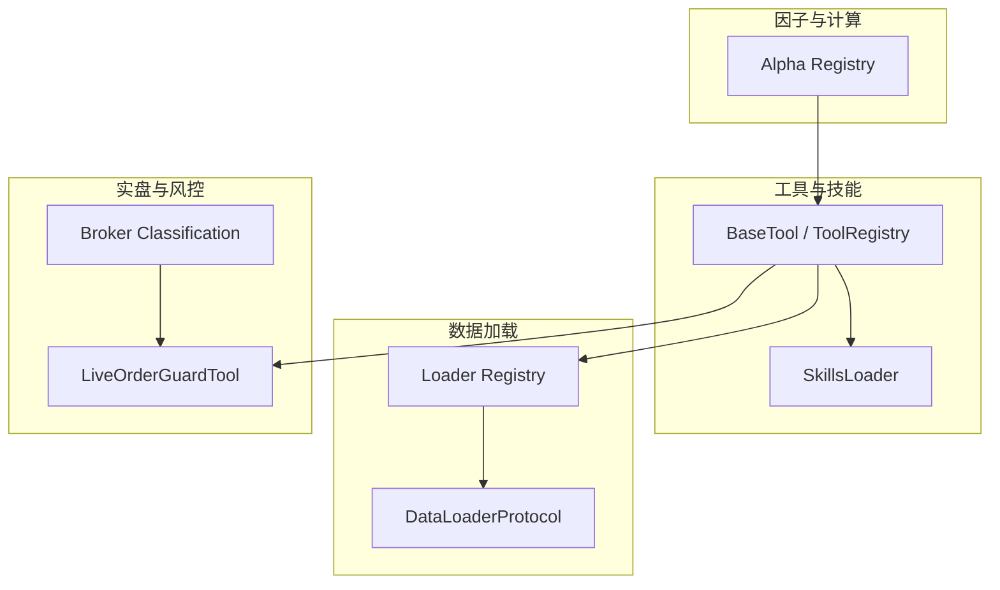
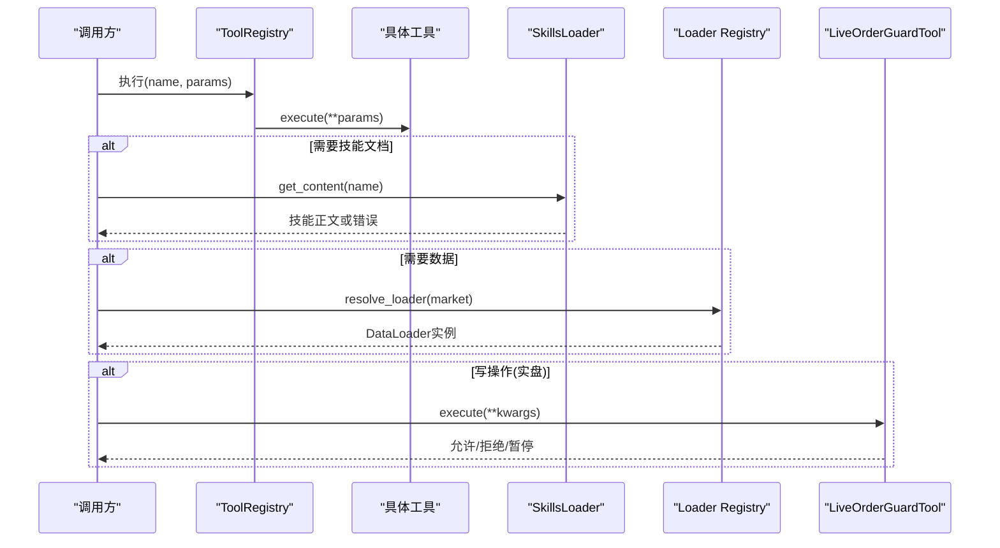
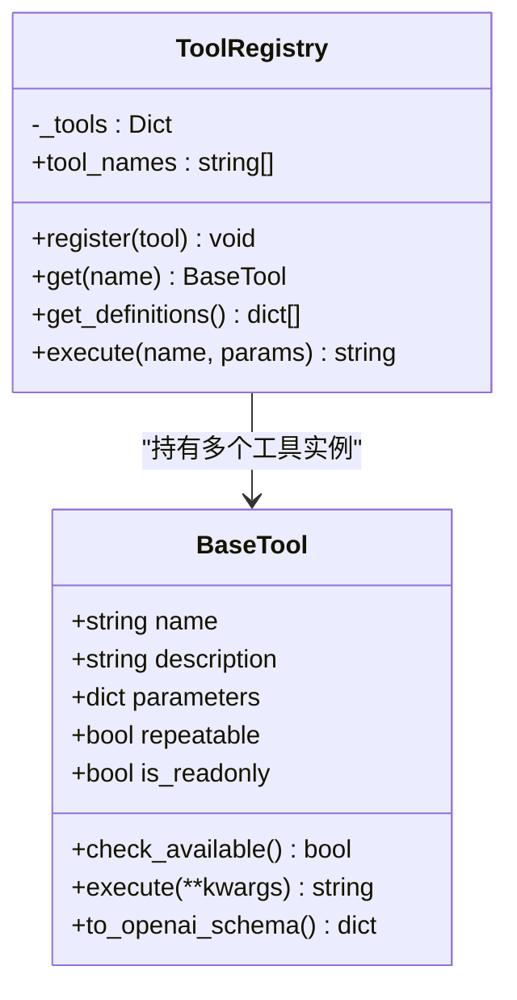
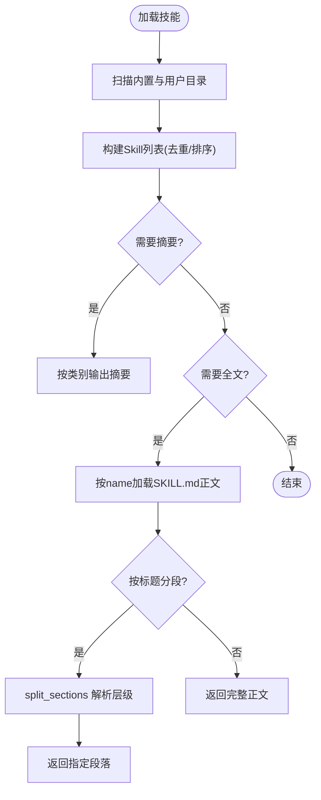
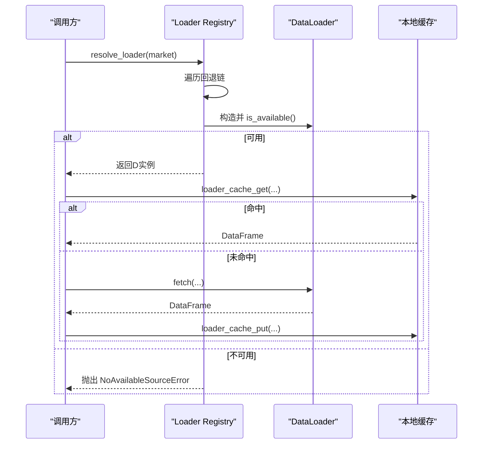
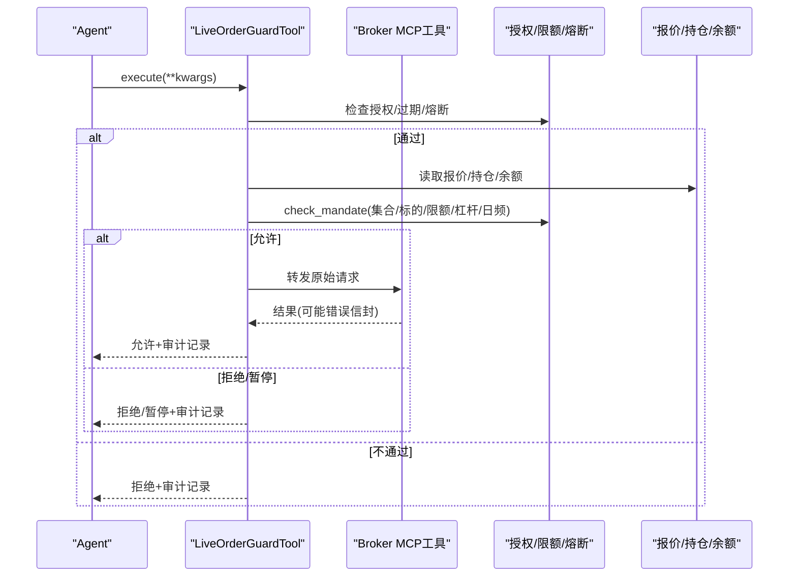
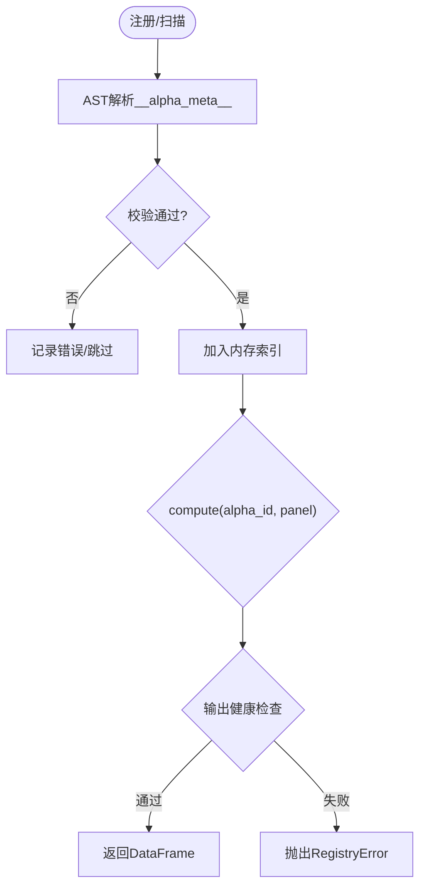
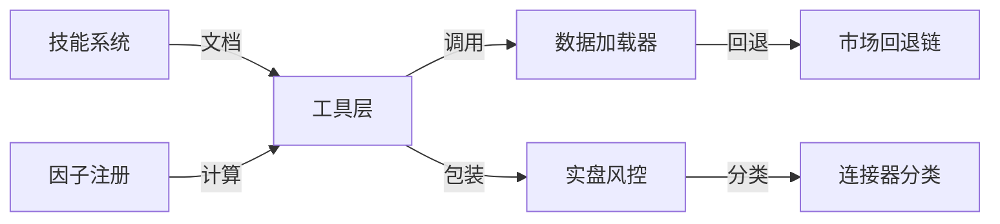

# 扩展开发指南

<cite>
**本文引用的文件**
- [agent/src/agent/tools.py](file://agent/src/agent/tools.py)
- [agent/src/agent/skills.py](file://agent/src/agent/skills.py)
- [agent/backtest/loaders/base.py](file://agent/backtest/loaders/base.py)
- [agent/backtest/loaders/registry.py](file://agent/backtest/loaders/registry.py)
- [agent/src/live/registry.py](file://agent/src/live/registry.py)
- [agent/src/live/order_guard.py](file://agent/src/live/order_guard.py)
- [agent/src/factors/registry.py](file://agent/src/factors/registry.py)
- [agent/src/trading/connectors/alpaca/classification.py](file://agent/src/trading/connectors/alpaca/classification.py)
- [agent/src/tools/skill_writer_tool.py](file://agent/src/tools/skill_writer_tool.py)
</cite>

## 目录
1. [简介](#简介)
2. [项目结构](#项目结构)
3. [核心组件](#核心组件)
4. [架构总览](#架构总览)
5. [详细组件分析](#详细组件分析)
6. [依赖关系分析](#依赖关系分析)
7. [性能考量](#性能考量)
8. [故障排查指南](#故障排查指南)
9. [结论](#结论)
10. [附录：开发与发布流程](#附录开发与发布流程)

## 简介
本指南面向希望为系统扩展能力的开发者，覆盖插件化架构、动态加载机制、接口规范与生命周期管理；自定义工具开发（注册、参数校验、错误处理、权限控制）；技能系统（定义、依赖、执行环境隔离）；数据加载器扩展（数据源适配、格式转换、增量更新）；交易连接器开发（协议适配、订单管理、风险控制）；并提供从简单到复杂的多步骤工作流示例，以及测试策略、调试技巧与发布流程。

## 项目结构
系统采用“按能力分层 + 可插拔注册表”的架构：
- 工具层：统一的 BaseTool + ToolRegistry，提供工具发现、调用与返回标准化。
- 技能层：SkillsLoader 扫描内置与用户技能目录，按需加载文档与辅助文件。
- 数据层：DataLoaderProtocol 统一数据获取接口，配合 Loader Registry 实现市场级回退链与缓存。
- 实盘层：Live 注册表对远端工具进行读写分类与安全包装，订单前置风控门控。
- 因子层：Alpha Registry 通过 AST 静态解析元数据，懒加载计算模块并输出校验。

图表来源
- [agent/src/agent/tools.py:13-95](file://agent/src/agent/tools.py#L13-L95)
- [agent/src/agent/skills.py:100-189](file://agent/src/agent/skills.py#L100-L189)
- [agent/backtest/loaders/base.py:851-887](file://agent/backtest/loaders/base.py#L851-L887)
- [agent/backtest/loaders/registry.py:63-196](file://agent/backtest/loaders/registry.py#L63-L196)
- [agent/src/live/order_guard.py:97-215](file://agent/src/live/order_guard.py#L97-L215)
- [agent/src/trading/connectors/alpaca/classification.py:1-26](file://agent/src/trading/connectors/alpaca/classification.py#L1-L26)
- [agent/src/factors/registry.py:201-397](file://agent/src/factors/registry.py#L201-L397)

章节来源
- [agent/src/agent/tools.py:13-95](file://agent/src/agent/tools.py#L13-L95)
- [agent/src/agent/skills.py:100-189](file://agent/src/agent/skills.py#L100-L189)
- [agent/backtest/loaders/base.py:851-887](file://agent/backtest/loaders/base.py#L851-L887)
- [agent/backtest/loaders/registry.py:63-196](file://agent/backtest/loaders/registry.py#L63-L196)
- [agent/src/live/order_guard.py:97-215](file://agent/src/live/order_guard.py#L97-L215)
- [agent/src/trading/connectors/alpaca/classification.py:1-26](file://agent/src/trading/connectors/alpaca/classification.py#L1-L26)
- [agent/src/factors/registry.py:201-397](file://agent/src/factors/registry.py#L201-L397)

## 核心组件
- 工具基础设施：BaseTool 抽象出名称、描述、参数 Schema、是否只读与重复调用；ToolRegistry 负责注册、查询、执行与 OpenAI function-calling 兼容导出。
- 技能系统：SkillsLoader 支持内置与用户技能目录叠加，按类别分组展示，按需加载完整文档与子节，支持辅助文件按需读取。
- 数据加载器：DataLoaderProtocol 定义 name/markets/requires_auth/is_available/fetch；Loader Registry 维护市场级回退链与自动发现。
- 实盘安全：Live 注册表将远端工具按 READ/WRITE/UNKNOWN 分类，WRITE/UNKNOWN 被 LiveOrderGuardTool 包裹，执行前强制检查授权、限额、熔断等。
- 因子注册：Alpha Registry 通过 AST 解析 __alpha_meta__，懒加载 compute，并对输出做形状与数值健康检查。

章节来源
- [agent/src/agent/tools.py:13-95](file://agent/src/agent/tools.py#L13-L95)
- [agent/src/agent/skills.py:100-189](file://agent/src/agent/skills.py#L100-L189)
- [agent/backtest/loaders/base.py:851-887](file://agent/backtest/loaders/base.py#L851-L887)
- [agent/backtest/loaders/registry.py:63-196](file://agent/backtest/loaders/registry.py#L63-L196)
- [agent/src/live/registry.py:184-238](file://agent/src/live/registry.py#L184-L238)
- [agent/src/factors/registry.py:201-397](file://agent/src/factors/registry.py#L201-L397)

## 架构总览
下图展示了扩展点之间的交互：工具通过注册表发现与执行；技能按需加载；数据加载器按市场回退链选择可用源；实盘工具在执行前经过风控门控；因子通过注册表懒加载计算。

图表来源
- [agent/src/agent/tools.py:54-95](file://agent/src/agent/tools.py#L54-L95)
- [agent/src/agent/skills.py:100-189](file://agent/src/agent/skills.py#L100-L189)
- [agent/backtest/loaders/registry.py:614-649](file://agent/backtest/loaders/registry.py#L614-L649)
- [agent/src/live/order_guard.py:130-215](file://agent/src/live/order_guard.py#L130-L215)

## 详细组件分析

### 工具与插件架构（BaseTool + ToolRegistry）
- 设计要点
  - 所有工具继承 BaseTool，声明 name/description/parameters/repeatable/is_readonly。
  - 通过 ToolRegistry.register 注册，get_definitions 生成 OpenAI function-calling 描述。
  - execute 统一返回 JSON 字符串，异常被捕获并转为结构化错误。
- 扩展方式
  - 新建工具类，实现 execute；在模块导入时调用 register 完成自注册。
  - 使用 parameters 声明 JSON Schema，便于前端/LLM 校验与提示。
- 生命周期
  - 启动时扫描并注册；运行时由 Registry.execute 调度；失败路径统一兜底。

图表来源
- [agent/src/agent/tools.py:13-95](file://agent/src/agent/tools.py#L13-L95)

章节来源
- [agent/src/agent/tools.py:13-95](file://agent/src/agent/tools.py#L13-L95)

### 技能系统（SkillsLoader 与 SKILL.md）
- 设计要点
  - 支持内置 skills/ 与用户 ~/.vibe-trading/skills/user/ 叠加，后者可覆盖同名技能。
  - 每个技能一个目录，包含 SKILL.md（frontmatter 元数据 + 正文），可选辅助文件。
  - get_descriptions 用于系统提示中列出技能摘要；get_content 按需加载全文；split_sections 支持按标题分段检索。
- 扩展方式
  - 新增技能目录，编写 SKILL.md，必要时添加 examples.md 等辅助文件。
  - 通过 load_skill 工具按需拉取内容，避免一次性注入大文档。
- 执行环境隔离
  - 技能本身是“说明性文档”，不直接执行代码；如需执行脚本，应通过工具层（如 SkillFileTool）在受限目录下操作。

图表来源
- [agent/src/agent/skills.py:100-189](file://agent/src/agent/skills.py#L100-L189)
- [agent/src/agent/skills.py:229-387](file://agent/src/agent/skills.py#L229-L387)

章节来源
- [agent/src/agent/skills.py:100-189](file://agent/src/agent/skills.py#L100-L189)
- [agent/src/tools/skill_writer_tool.py:330-369](file://agent/src/tools/skill_writer_tool.py#L330-L369)

### 数据加载器扩展（DataLoaderProtocol + Loader Registry）
- 设计要点
  - DataLoaderProtocol 规定 name/markets/requires_auth/is_available/fetch(codes,start,end,interval,fields)。
  - Loader Registry 维护各市场的回退链（如 a_share/us_equity/crypto 等），按顺序尝试可用源。
  - 提供本地缓存（Parquet + DuckDB）与重试/预算控制，提升鲁棒性与性能。
- 扩展方式
  - 实现 DataLoaderProtocol，设置 markets 与 is_available；在模块导入时通过 @register 自注册。
  - fetch 返回 {symbol: DataFrame}，遵循 OHLCV 约定；可在 loader 边界调用 validate_ohlc 保证数据质量。
- 增量更新
  - 使用 cached_loader_fetch 封装“先查缓存，再拉取并写入缓存”的流程；仅对已结算日期范围缓存。

图表来源
- [agent/backtest/loaders/base.py:377-450](file://agent/backtest/loaders/base.py#L377-L450)
- [agent/backtest/loaders/base.py:506-661](file://agent/backtest/loaders/base.py#L506-L661)
- [agent/backtest/loaders/registry.py:614-649](file://agent/backtest/loaders/registry.py#L614-L649)

章节来源
- [agent/backtest/loaders/base.py:851-887](file://agent/backtest/loaders/base.py#L851-L887)
- [agent/backtest/loaders/registry.py:63-196](file://agent/backtest/loaders/registry.py#L63-L196)

### 交易连接器与风控（Live 注册表 + Order Guard）
- 设计要点
  - Live 注册表根据服务器名/URL 判断是否为实盘券商，并按 broker 映射工具分类（READ/WRITE/UNKNOWN）。
  - WRITE/UNKNOWN 工具被 LiveOrderGuardTool 包裹，每次执行前依次检查：授权有效性、过期、熔断开关、意图解析、报价/持仓/余额快照、指令合规（集合/标的/限额/杠杆/日频等）。
  - 允许后转发至远端工具，仅当成功才计入当日下单计数；拒绝/错误均审计。
- 扩展方式
  - 为新连接器实现 classification 映射，明确哪些操作是写操作。
  - 若需自定义读工具名（如报价/持仓/账户），可通过 runner_tool_name 映射。
- 权限控制
  - 未知操作默认视为 WRITE（fail-closed），确保新工具默认受保护。

图表来源
- [agent/src/live/registry.py:184-238](file://agent/src/live/registry.py#L184-L238)
- [agent/src/live/order_guard.py:130-215](file://agent/src/live/order_guard.py#L130-L215)
- [agent/src/trading/connectors/alpaca/classification.py:1-26](file://agent/src/trading/connectors/alpaca/classification.py#L1-L26)

章节来源
- [agent/src/live/registry.py:184-238](file://agent/src/live/registry.py#L184-L238)
- [agent/src/live/order_guard.py:97-215](file://agent/src/live/order_guard.py#L97-L215)
- [agent/src/trading/connectors/alpaca/classification.py:1-26](file://agent/src/trading/connectors/alpaca/classification.py#L1-L26)

### 因子与计算（Alpha Registry）
- 设计要点
  - 通过 AST 静态解析 zoo 下模块的 __alpha_meta__，严格校验字段与列依赖。
  - 懒加载模块并调用 compute(panel)，对输出做形状、NaN/Inf 健康检查。
  - 提供 list/get/compute/export_manifest/health 等 API，支持过滤主题/宇宙。
- 扩展方式
  - 在 zoo 下新增模块，声明 __alpha_meta__，实现 compute(panel)->DataFrame。
  - 使用 get_default_registry 获取进程内单例，避免重复扫描。

图表来源
- [agent/src/factors/registry.py:147-184](file://agent/src/factors/registry.py#L147-L184)
- [agent/src/factors/registry.py:321-397](file://agent/src/factors/registry.py#L321-L397)

章节来源
- [agent/src/factors/registry.py:201-397](file://agent/src/factors/registry.py#L201-L397)

## 依赖关系分析
- 松耦合：各子系统通过注册表与协议解耦，新增实现无需改动核心逻辑。
- 回退链：数据加载器按市场配置回退链，提高可用性；某些源禁止网络回退（local/qveris/tickerall）。
- 安全边界：实盘工具默认 fail-closed，未知操作视为写操作，必须经风控门控。
- 懒加载：因子与数据加载器仅在需要时加载/连接，降低冷启动成本。

图表来源
- [agent/backtest/loaders/registry.py:139-158](file://agent/backtest/loaders/registry.py#L139-L158)
- [agent/src/live/registry.py:42-60](file://agent/src/live/registry.py#L42-L60)

章节来源
- [agent/backtest/loaders/registry.py:139-158](file://agent/backtest/loaders/registry.py#L139-L158)
- [agent/src/live/registry.py:42-60](file://agent/src/live/registry.py#L42-L60)

## 性能考量
- 数据缓存：启用本地 Parquet 缓存，减少重复网络请求；仅对已结算日期范围缓存。
- 重试与预算：对不稳定外部 API 使用带超时预算的重试，避免长时间阻塞。
- 懒加载：因子与数据加载器按需加载，避免全量初始化开销。
- 回退链优化：按 IP 封禁风险与数据质量排序，优先轻量公开源，再降级到 key-gated 源。

[本节为通用指导，不直接分析具体文件]

## 故障排查指南
- 无可用数据源
  - 现象：resolve_loader 抛出 NoAvailableSourceError。
  - 排查：检查市场回退链中各源的 is_available；确认网络与密钥；注意 local/qveris/tickerall 不允许静默回退。
- 工具不存在或执行失败
  - 现象：ToolRegistry.execute 返回 error 状态。
  - 排查：确认工具已注册；检查参数 Schema；查看日志中的异常堆栈。
- 技能加载失败
  - 现象：get_content 返回错误。
  - 排查：确认 SKILL.md 存在且 frontmatter 正确；用户目录优先级高于内置目录。
- 实盘订单被拒绝
  - 现象：返回 blocked/pause_for_reauth。
  - 排查：检查授权有效期、熔断开关、集合/标的限制、限额/杠杆/日频；查看审计记录中的 breach 详情。

章节来源
- [agent/backtest/loaders/registry.py:614-649](file://agent/backtest/loaders/registry.py#L614-L649)
- [agent/src/agent/tools.py:72-84](file://agent/src/agent/tools.py#L72-L84)
- [agent/src/agent/skills.py:166-189](file://agent/src/agent/skills.py#L166-L189)
- [agent/src/live/order_guard.py:514-616](file://agent/src/live/order_guard.py#L514-L616)

## 结论
本系统通过清晰的协议与注册表机制，实现了工具、技能、数据加载器、因子与实盘连接的松耦合扩展。开发者只需遵循接口规范并在导入时自注册，即可无缝融入生态。实盘侧的 fail-closed 设计与多层风控保障资金安全；数据层的回退链与缓存提升稳定性与性能；技能系统以文档驱动的方式降低使用门槛。

[本节为总结，不直接分析具体文件]

## 附录：开发与发布流程

### 自定义工具开发
- 步骤
  - 继承 BaseTool，实现 execute；声明 parameters（JSON Schema）。
  - 在模块顶层调用 ToolRegistry.register(self) 完成自注册。
  - 若依赖外部包或密钥，重写 check_available 以控制可见性。
- 参数验证与错误处理
  - 使用 parameters 约束输入；execute 内部做业务校验；异常统一捕获并返回结构化错误。
- 权限控制
  - 设置 is_readonly=False 表示写操作；在实盘环境下会被 LiveOrderGuardTool 包裹并受风控门控。

章节来源
- [agent/src/agent/tools.py:13-95](file://agent/src/agent/tools.py#L13-L95)
- [agent/src/live/registry.py:184-238](file://agent/src/live/registry.py#L184-L238)

### 技能系统使用
- 定义
  - 创建目录与 SKILL.md，填写 frontmatter（name/description/category），正文按标题组织。
- 依赖管理
  - 通过 load_support_file 按需加载辅助文件；避免在主文档中嵌入过大资源。
- 执行环境隔离
  - 技能为文档型扩展；如需执行代码，使用 SkillFileTool 在受限目录操作，防止路径穿越。

章节来源
- [agent/src/agent/skills.py:100-189](file://agent/src/agent/skills.py#L100-L189)
- [agent/src/tools/skill_writer_tool.py:330-369](file://agent/src/tools/skill_writer_tool.py#L330-L369)

### 数据加载器扩展
- 数据源适配
  - 实现 DataLoaderProtocol，设置 markets/requires_auth/is_available/fetch。
  - 在模块导入时通过 @register 自注册。
- 格式转换
  - fetch 返回标准 OHLCV DataFrame；在 loader 边界调用 validate_ohlc 清理脏数据。
- 增量更新
  - 使用 cached_loader_fetch 封装缓存逻辑；仅对已结算日期范围缓存。

章节来源
- [agent/backtest/loaders/base.py:377-450](file://agent/backtest/loaders/base.py#L377-L450)
- [agent/backtest/loaders/base.py:506-661](file://agent/backtest/loaders/base.py#L506-L661)
- [agent/backtest/loaders/registry.py:63-196](file://agent/backtest/loaders/registry.py#L63-L196)

### 交易连接器开发
- 协议适配
  - 实现连接器对应的 MCP 工具；在 classification 中声明 READ/WRITE 映射。
- 订单管理
  - 订单意图提取与规范化（notional/quantity）；报价获取（优先券商报价，其次数据加载器）。
- 风险控制
  - 通过 LiveOrderGuardTool 强制执行授权、限额、熔断与审计；未知操作默认 WRITE。

章节来源
- [agent/src/trading/connectors/alpaca/classification.py:1-26](file://agent/src/trading/connectors/alpaca/classification.py#L1-L26)
- [agent/src/live/order_guard.py:130-215](file://agent/src/live/order_guard.py#L130-L215)

### 端到端示例
- 简单数据获取工具
  - 新建工具，调用 Loader Registry 获取数据加载器，fetch 后返回标准化结果。
- 多步骤工作流
  - 组合多个工具：技能文档引导 -> 数据加载 -> 因子计算 -> 实盘风控 -> 审计记录。
  - 使用 SkillsLoader 按需加载步骤说明；使用 Alpha Registry 懒加载计算；使用 LiveOrderGuardTool 保障安全。

[本节为概念性流程，不直接分析具体文件]

### 测试策略
- 单元测试
  - 针对工具 execute、参数校验、错误路径；数据加载器的缓存命中/未命中；因子 compute 的输出健康检查。
- 集成测试
  - 模拟外部 API 失败与回退链；实盘环境的授权/限额/熔断场景。
- 回归测试
  - 确保注册表健康度、技能清单一致性、连接器分类完整性。

[本节为通用指导，不直接分析具体文件]

### 调试技巧
- 日志定位
  - 关注 ToolRegistry 与 Loader Registry 的异常日志；实盘风控的拒绝原因与审计记录。
- 断点与追踪
  - 在 execute 入口、check_mandate、loader fetch 处设置断点；观察回退链选择过程。
- 最小复现
  - 使用独立环境与最小数据集，逐步缩小问题范围。

[本节为通用指导，不直接分析具体文件]

### 发布流程
- 版本与依赖
  - 更新依赖锁定文件；确保新增模块可被 importlib 发现。
- 注册与发现
  - 确认自注册逻辑在首次导入时触发；验证 registry 健康度。
- 文档与技能
  - 同步更新 SKILL.md 与相关文档；确保 load_skill 可找到最新内容。
- 上线与回滚
  - 灰度发布；监控指标（成功率、延迟、拒绝率）；准备回滚方案。

[本节为通用指导，不直接分析具体文件]