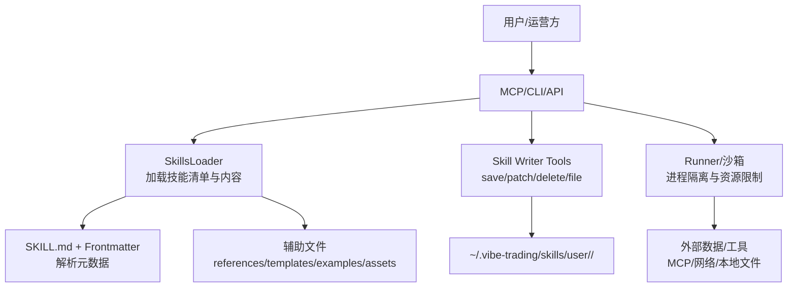
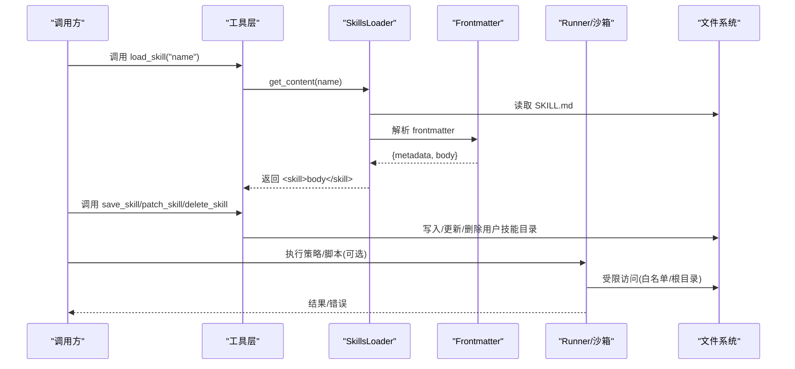
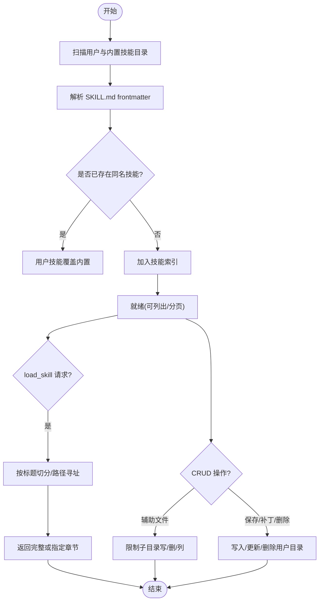
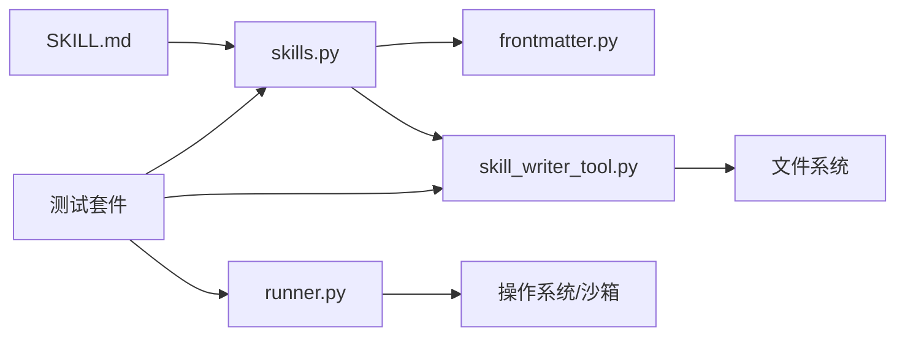

# 技能系统扩展

<cite>
**本文引用的文件**
- [agent/SKILL.md](file://agent/SKILL.md)
- [agent/src/agent/skills.py](file://agent/src/agent/skills.py)
- [agent/src/agent/frontmatter.py](file://agent/src/agent/frontmatter.py)
- [agent/src/tools/skill_writer_tool.py](file://agent/src/tools/skill_writer_tool.py)
- [agent/src/core/runner.py](file://agent/src/core/runner.py)
- [agent/src/tools/_shell_safety.py](file://agent/src/tools/_shell_safety.py)
- [agent/tests/test_skills.py](file://agent/tests/test_skills.py)
- [agent/tests/test_skill_reference_links.py](file://agent/tests/test_skill_reference_links.py)
- [agent/tests/test_file_tool_sandbox_security.py](file://agent/tests/test_file_tool_sandbox_security.py)
- [agent/tests/test_runner_env.py](file://agent/tests/test_runner_env.py)
- [agent/tests/test_vnpy_export.py](file://agent/tests/test_vnpy_export.py)
- [agent/tests/test_mcp_alpha_zoo_contract.py](file://agent/tests/test_mcp_alpha_zoo_contract.py)
- [agent/src/agent/loop.py](file://agent/src/agent/loop.py)
- [agent/src/skills/technical-basic/SKILL.md](file://agent/src/skills/technical-basic/SKILL.md)
</cite>

## 目录
1. [简介](#简介)
2. [项目结构](#项目结构)
3. [核心组件](#核心组件)
4. [架构总览](#架构总览)
5. [详细组件分析](#详细组件分析)
6. [依赖关系分析](#依赖关系分析)
7. [性能考虑](#性能考虑)
8. [故障排查指南](#故障排查指南)
9. [结论](#结论)
10. [附录](#附录)

## 简介
本文件系统化说明 Vibe-Trading 的“技能系统”扩展能力，覆盖以下主题：
- 技能的定义结构与元数据格式（SKILL.md 编写规范、依赖声明、版本管理）
- 执行环境隔离机制（Python 环境管理、依赖包隔离、资源限制）
- 技能生命周期管理（加载、验证、缓存到卸载）
- 技能间通信与数据共享方式
- 开发最佳实践（错误处理、日志记录、性能监控）
- 打包、分发、安装流程
- 复杂金融分析技能示例（技术指标计算、基本面分析等）

## 项目结构
技能系统围绕“文档即技能”的理念构建：每个技能是一个目录，包含 SKILL.md 作为主文档，并可选择附带 references、templates、examples、assets 等辅助文件。运行时通过 SkillsLoader 扫描内置与用户目录，按需加载完整内容；工具层提供保存、补丁、删除与辅助文件管理能力；安全层对文件访问与进程沙箱进行约束。

图表来源
- [agent/src/agent/skills.py:100-189](file://agent/src/agent/skills.py#L100-L189)
- [agent/src/agent/frontmatter.py:16-48](file://agent/src/agent/frontmatter.py#L16-L48)
- [agent/src/tools/skill_writer_tool.py:48-370](file://agent/src/tools/skill_writer_tool.py#L48-L370)
- [agent/src/core/runner.py:42-68](file://agent/src/core/runner.py#L42-L68)

章节来源
- [agent/src/agent/skills.py:100-189](file://agent/src/agent/skills.py#L100-L189)
- [agent/src/agent/frontmatter.py:16-48](file://agent/src/agent/frontmatter.py#L16-L48)
- [agent/src/tools/skill_writer_tool.py:48-370](file://agent/src/tools/skill_writer_tool.py#L48-L370)
- [agent/src/core/runner.py:42-68](file://agent/src/core/runner.py#L42-L68)

## 核心组件
- 技能模型与加载器
  - Skill：单条技能的内存表示，支持按需加载辅助文件
  - SkillsLoader：从内置与用户目录扫描、去重、分类展示与按需加载全文
  - 标题分段与路径寻址：将 SKILL.md 按 ATX 标题切分为段落，支持“父级 > 子级”定位
- 元数据解析
  - frontmatter 解析：支持 YAML-like 头部，提取 name/description/category/dependencies/env/mcp 等
- 技能写入与管理
  - save_skill / patch_skill / delete_skill / skill_file：在用户目录创建、修改、删除技能及辅助文件，严格校验子目录与路径穿越
- 运行与沙箱
  - Runner：为生成代码或策略执行提供受限 HOME、RLIMIT_AS/NOFILE、可选 UID/GID 降级，限制可访问路径
  - Shell 安全：禁止宽泛 Python 进程终止命令，防止误杀宿主进程
- 测试与契约
  - 多类测试保障：SKILL.md 结构、引用链接有效性、文件沙箱安全、环境变量与资源限制、MCP 工具清单一致性

章节来源
- [agent/src/agent/skills.py:22-189](file://agent/src/agent/skills.py#L22-L189)
- [agent/src/agent/frontmatter.py:16-48](file://agent/src/agent/frontmatter.py#L16-L48)
- [agent/src/tools/skill_writer_tool.py:48-370](file://agent/src/tools/skill_writer_tool.py#L48-L370)
- [agent/src/core/runner.py:42-68](file://agent/src/core/runner.py#L42-L68)
- [agent/src/tools/_shell_safety.py:1-42](file://agent/src/tools/_shell_safety.py#L1-L42)
- [agent/tests/test_vnpy_export.py:20-39](file://agent/tests/test_vnpy_export.py#L20-L39)
- [agent/tests/test_skill_reference_links.py:32-73](file://agent/tests/test_skill_reference_links.py#L32-L73)
- [agent/tests/test_file_tool_sandbox_security.py:80-109](file://agent/tests/test_file_tool_sandbox_security.py#L80-L109)
- [agent/tests/test_runner_env.py:189-222](file://agent/tests/test_runner_env.py#L189-L222)
- [agent/tests/test_mcp_alpha_zoo_contract.py:101-120](file://agent/tests/test_mcp_alpha_zoo_contract.py#L101-L120)

## 架构总览
技能系统采用“文档驱动 + 工具编排 + 沙箱执行”的分层架构：
- 顶层：MCP/CLI/API 暴露 load_skill、save_skill 等工具
- 中间层：SkillsLoader 负责发现与分页加载；frontmatter 解析元数据；SkillWriterTools 管理用户技能
- 底层：Runner 提供受限执行环境；Shell 安全模块保护宿主进程；文件系统访问受白名单与根目录约束

图表来源
- [agent/src/agent/skills.py:166-189](file://agent/src/agent/skills.py#L166-L189)
- [agent/src/agent/frontmatter.py:16-48](file://agent/src/agent/frontmatter.py#L16-L48)
- [agent/src/tools/skill_writer_tool.py:77-370](file://agent/src/tools/skill_writer_tool.py#L77-L370)
- [agent/src/core/runner.py:42-68](file://agent/src/core/runner.py#L42-L68)

## 详细组件分析

### 技能定义与元数据（SKILL.md）
- 位置与组织
  - 每个技能一个目录，必须包含 SKILL.md；可选 references、templates、examples、assets
  - 用户技能位于 ~/.vibe-trading/skills/user/<slug>/，内置技能位于 agent/src/skills/<name>/
- Frontmatter 字段
  - name：技能标识（用于加载与覆盖）
  - description：一句话描述
  - category：分组显示类别（如 strategy/analysis/data-source 等）
  - dependencies：声明 Python 版本与 pip 依赖列表
  - env：可选的环境变量名与说明（required 标记是否必需）
  - mcp：可选的外部 MCP 服务配置（command/args）
- 正文结构
  - 使用 ATX 标题组织章节；系统会按标题切分以支持分页与路径寻址
  - 可在正文中声明依赖安装命令、参数表、信号约定等
- 参考与模板
  - 可通过相对路径引用 references/*.md 或 scripts/*.py，测试保证链接有效

章节来源
- [agent/src/agent/skills.py:65-94](file://agent/src/agent/skills.py#L65-L94)
- [agent/src/agent/frontmatter.py:16-48](file://agent/src/agent/frontmatter.py#L16-L48)
- [agent/tests/test_vnpy_export.py:20-39](file://agent/tests/test_vnpy_export.py#L20-L39)
- [agent/tests/test_skill_reference_links.py:32-73](file://agent/tests/test_skill_reference_links.py#L32-L73)
- [agent/src/skills/technical-basic/SKILL.md:1-58](file://agent/src/skills/technical-basic/SKILL.md#L1-L58)

### 技能加载与分页
- 加载顺序
  - 先加载用户目录，再加载内置目录；同名技能用户版覆盖内置版
- 分类与摘要
  - 按 category 分组，预定义顺序优先；get_descriptions 输出系统提示用的一行摘要
- 全文加载与分页
  - get_content 返回完整文档；split_sections 将文档按标题切分为段落，支持“父级 > 子级”地址定位
- 动态发现
  - 会话中新增的用户技能会在首次 get_content 时从磁盘加载并加入内存缓存

章节来源
- [agent/src/agent/skills.py:100-189](file://agent/src/agent/skills.py#L100-L189)
- [agent/src/agent/skills.py:229-387](file://agent/src/agent/skills.py#L229-L387)

### 技能写入与管理（CRUD）
- 保存技能
  - save_skill：校验 name/content，必要时自动补全 frontmatter，写入用户目录
- 补丁技能
  - patch_skill：在用户目录查找，若不存在则复制内置版本后替换文本
- 删除技能
  - delete_skill：仅允许删除用户目录中的技能
- 辅助文件
  - skill_file：write/remove/list，限制子目录为 references/templates/examples/assets，防路径穿越

章节来源
- [agent/src/tools/skill_writer_tool.py:48-370](file://agent/src/tools/skill_writer_tool.py#L48-L370)
- [agent/tests/test_skill_writer_tools.py:272-305](file://agent/tests/test_skill_writer_tools.py#L272-L305)

### 执行环境隔离与安全
- 进程沙箱
  - 受限 HOME：仅暴露 cache、data-bridge、qveris.json 等必要目录
  - 资源限制：虚拟内存上限 RLIMIT_AS（默认 4GB，可通过环境变量调整），文件句柄数限制
  - 权限降级：在具备能力的平台尝试切换到专用低权限用户
- 文件访问安全
  - skills/ 前缀绑定到内置技能根目录，不会被 run_dir 覆盖或逃逸
  - 禁止通过相对路径跳出 skills 命名空间
- Shell 安全
  - 禁止通过名称宽泛终止 Python 进程，避免误杀宿主进程

章节来源
- [agent/src/core/runner.py:42-68](file://agent/src/core/runner.py#L42-L68)
- [agent/tests/test_file_tool_sandbox_security.py:80-109](file://agent/tests/test_file_tool_sandbox_security.py#L80-L109)
- [agent/tests/test_runner_env.py:189-222](file://agent/tests/test_runner_env.py#L189-L222)
- [agent/src/tools/_shell_safety.py:1-42](file://agent/src/tools/_shell_safety.py#L1-L42)

### 技能生命周期管理

图表来源
- [agent/src/agent/skills.py:100-189](file://agent/src/agent/skills.py#L100-L189)
- [agent/src/tools/skill_writer_tool.py:77-370](file://agent/src/tools/skill_writer_tool.py#L77-L370)

### 技能间通信与数据共享
- 通过 MCP 工具链协作
  - 技能文档中可指引调用其他工具（如 backtest、factor_analysis、get_market_data 等）
  - Swarm 预设中通过 skills 字段组合多个技能，并在任务中通过 load_skill 引用方法论文档
- 数据共享方式
  - 文件：通过 write_file/read_file 在允许的根目录下交换中间结果
  - 状态：通过 session/run manifest 记录工具调用与包版本，便于复现与审计
  - 外部服务：通过 MCP server 暴露的工具进行跨进程/跨语言调用

章节来源
- [agent/SKILL.md:135-209](file://agent/SKILL.md#L135-L209)
- [agent/src/agent/loop.py:1036-1063](file://agent/src/agent/loop.py#L1036-L1063)

### 复杂金融分析技能示例
- 技术指标计算
  - 技术基础技能展示了趋势、均值回归、量价三维投票的合成信号逻辑，并提供参数表与依赖安装命令
- 基本面分析
  - 通过 fundamental_research_team 等 Swarm 预设，组合财务、估值、质量三维度并行分析，产出健康评分、盈利质量判断与风险预警

章节来源
- [agent/src/skills/technical-basic/SKILL.md:1-58](file://agent/src/skills/technical-basic/SKILL.md#L1-L58)
- [agent/src/swarm/presets/fundamental_research_team.yaml:1-58](file://agent/src/swarm/presets/fundamental_research_team.yaml#L1-L58)

## 依赖关系分析
- 内部依赖
  - SkillsLoader 依赖 frontmatter 解析与文件系统；SkillWriterTools 依赖 SkillsLoader 的用户目录常量
  - Runner 提供沙箱约束，影响所有需要执行外部代码或脚本的技能
- 外部依赖
  - MCP 服务器：技能可通过 mcp 字段声明外部命令与参数
  - 数据源：通过工具层统一接入（市场数据、研报、新闻、期权链等）
- 契约与一致性
  - 测试确保 SKILL.md 工具清单与实际 MCP 注册一致，避免发布物与实现不一致

图表来源
- [agent/src/agent/skills.py:100-189](file://agent/src/agent/skills.py#L100-L189)
- [agent/src/agent/frontmatter.py:16-48](file://agent/src/agent/frontmatter.py#L16-L48)
- [agent/src/tools/skill_writer_tool.py:48-370](file://agent/src/tools/skill_writer_tool.py#L48-L370)
- [agent/src/core/runner.py:42-68](file://agent/src/core/runner.py#L42-L68)
- [agent/tests/test_mcp_alpha_zoo_contract.py:101-120](file://agent/tests/test_mcp_alpha_zoo_contract.py#L101-L120)

章节来源
- [agent/tests/test_mcp_alpha_zoo_contract.py:101-120](file://agent/tests/test_mcp_alpha_zoo_contract.py#L101-L120)

## 性能考虑
- 文档分页与摘要
  - 长文档按标题切分，减少单次传输体积；摘要提升系统提示效率
- 资源限制
  - 虚拟内存上限与文件句柄限制防止恶意或异常任务耗尽资源
- 缓存与复用
  - 用户技能在会话内首次加载后加入内存缓存，避免重复 IO
- 外部依赖优化
  - 通过 MCP 工具异步/流式调用，降低阻塞时间

[本节为通用指导，不直接分析具体文件]

## 故障排查指南
- 技能未找到
  - 检查 name 是否与目录 slug 一致；确认用户目录是否存在对应文件夹
- 文件访问被拒绝
  - 确认路径未尝试跳出 skills 命名空间；检查 allowed run roots 配置
- 进程被杀死
  - 避免使用宽泛 Python 进程终止命令；使用 cancel_background 的 task_id 精准停止
- 资源不足
  - 调整 VIBE_TRADING_SANDBOX_RLIMIT_AS_MB 增大虚拟内存上限；检查 NOFILE 限制
- 工具清单不一致
  - 核对 SKILL.md 工具表与 MCP 实际注册工具数量是否匹配

章节来源
- [agent/tests/test_file_tool_sandbox_security.py:80-109](file://agent/tests/test_file_tool_sandbox_security.py#L80-L109)
- [agent/src/tools/_shell_safety.py:1-42](file://agent/src/tools/_shell_safety.py#L1-L42)
- [agent/tests/test_runner_env.py:189-222](file://agent/tests/test_runner_env.py#L189-L222)
- [agent/tests/test_mcp_alpha_zoo_contract.py:101-120](file://agent/tests/test_mcp_alpha_zoo_contract.py#L101-L120)

## 结论
Vibe-Trading 的技能系统以“文档即技能”为核心，结合严格的元数据解析、安全的文件与进程沙箱、完善的 CRUD 工具与测试契约，提供了可扩展、可审计、可复现的金融研究能力。通过 MCP 工具链与 Swarm 预设，技能之间可以高效协作，完成从数据采集、指标计算到策略回测与报告生成的全流程。

[本节为总结性内容，不直接分析具体文件]

## 附录

### SKILL.md 编写规范要点
- 必须以 --- 包裹 frontmatter，包含 name、description、category
- 可使用 dependencies 声明 Python 版本与 pip 包；env 声明可选/必需环境变量
- 正文使用 ATX 标题组织章节，便于分页与路径寻址
- 可在正文中给出依赖安装命令、参数表、信号约定等

章节来源
- [agent/tests/test_vnpy_export.py:20-39](file://agent/tests/test_vnpy_export.py#L20-L39)
- [agent/src/agent/frontmatter.py:16-48](file://agent/src/agent/frontmatter.py#L16-L48)
- [agent/src/skills/technical-basic/SKILL.md:1-58](file://agent/src/skills/technical-basic/SKILL.md#L1-L58)

### 打包、分发、安装流程
- 本地开发
  - 在用户目录创建技能文件夹，编写 SKILL.md 与辅助文件；通过 save_skill/patch_skill 快速迭代
- 内置集成
  - 将技能放入 agent/src/skills/<name>/，提交至仓库；测试套件会校验结构与引用
- 分发
  - 通过 MCP/CLI 暴露 load_skill；Swarm 预设中组合技能形成工作流
- 安装
  - 通过包管理器或 ClawHub 安装；桌面端与 CLI 均可发现新技能

章节来源
- [agent/SKILL.md:212-218](file://agent/SKILL.md#L212-L218)
- [agent/tests/test_skill_writer_tools.py:272-305](file://agent/tests/test_skill_writer_tools.py#L272-L305)

### 最佳实践
- 错误处理
  - 明确失败分支与兜底策略；对外部 API 调用增加重试与超时控制
- 日志记录
  - 关键步骤输出结构化日志；通过 run manifest 记录工具调用与包版本
- 性能监控
  - 合理设置资源限制；对长耗时任务使用后台运行与取消机制

章节来源
- [agent/src/agent/loop.py:1036-1063](file://agent/src/agent/loop.py#L1036-L1063)
- [agent/src/core/runner.py:42-68](file://agent/src/core/runner.py#L42-L68)