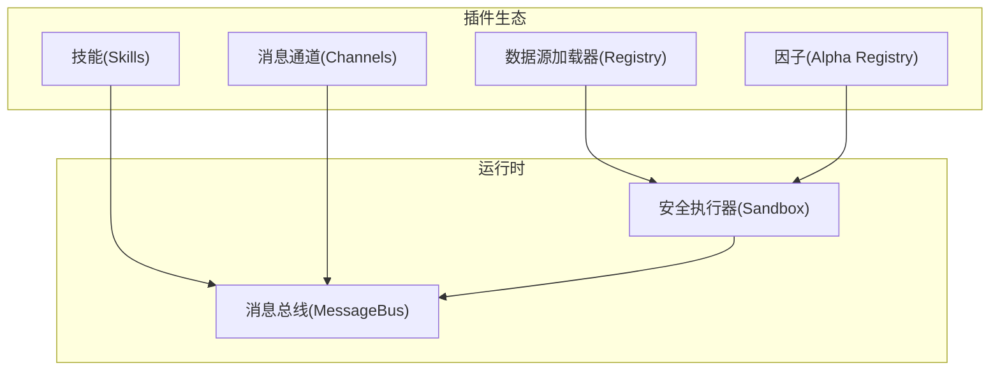
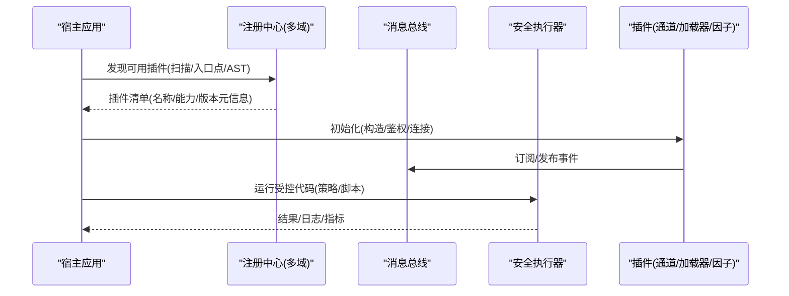
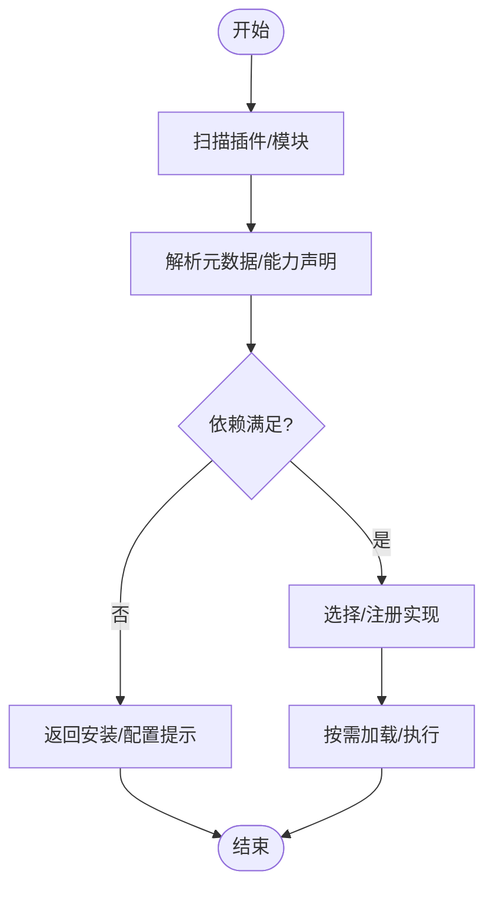
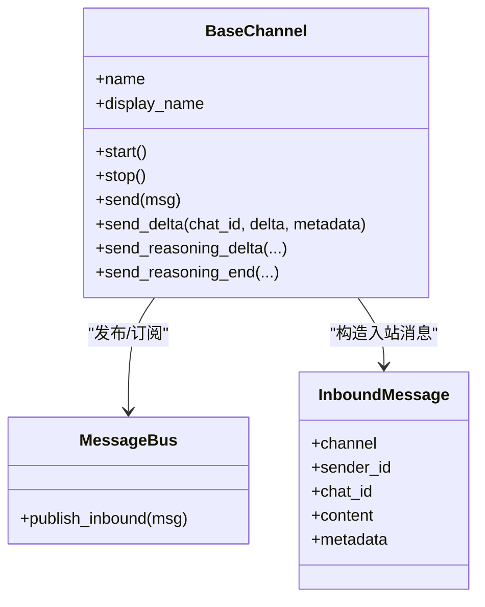
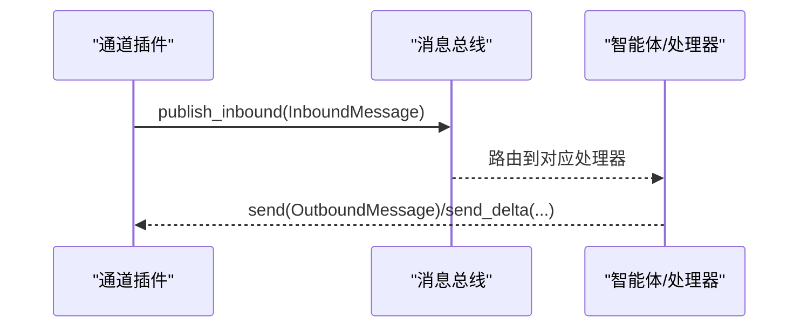
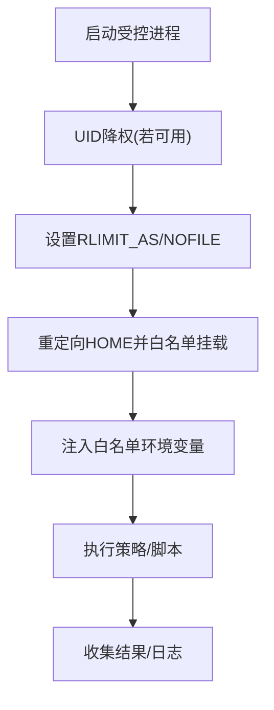
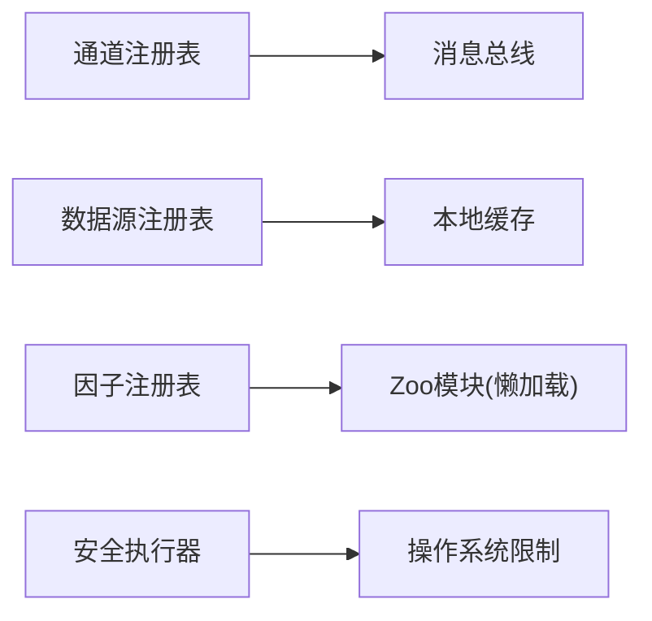

# 插件架构设计

<cite>
**本文引用的文件**
- [agent/src/agent/skills.py](file://agent/src/agent/skills.py)
- [agent/backtest/loaders/registry.py](file://agent/backtest/loaders/registry.py)
- [agent/backtest/loaders/base.py](file://agent/backtest/loaders/base.py)
- [agent/src/channels/registry.py](file://agent/src/channels/registry.py)
- [agent/src/channels/base.py](file://agent/src/channels/base.py)
- [agent/src/core/runner.py](file://agent/src/core/runner.py)
- [agent/src/security/scanner.py](file://agent/src/security/scanner.py)
- [agent/src/factors/registry.py](file://agent/src/factors/registry.py)
</cite>

## 目录
1. [简介](#简介)
2. [项目结构](#项目结构)
3. [核心组件](#核心组件)
4. [架构总览](#架构总览)
5. [详细组件分析](#详细组件分析)
6. [依赖关系分析](#依赖关系分析)
7. [性能考量](#性能考量)
8. [故障排查指南](#故障排查指南)
9. [结论](#结论)
10. [附录](#附录)

## 简介
本文件面向“Vibe-Trading”的插件化扩展能力，系统性阐述动态加载机制、插件接口规范、生命周期管理、插件间通信、安全沙箱、配置管理、热重载与故障恢复，以及测试与调试实践。内容基于仓库中已实现的注册表、通道适配器、因子注册表、数据源加载器与安全执行环境等模块，提供从原理到落地的完整说明。

## 项目结构
本项目采用多领域插件化组织：
- 技能（Skills）：以文档+元数据形式描述可被智能体调用的“能力”，支持按需加载与章节级分页。
- 数据源加载器（Data Loaders）：按市场类型自动发现并选择可用数据源，具备回退链与缓存。
- 消息通道（Channels）：统一抽象不同聊天平台接入，支持内置与外部插件通过入口点发现。
- 因子（Factors/Alphas）：通过AST静态扫描与严格元数据校验，实现零导入式清单与懒加载计算。
- 安全执行（Sandbox）：子进程隔离、权限降级、资源限制与白名单环境变量注入。

图表来源
- [agent/src/agent/skills.py:100-189](file://agent/src/agent/skills.py#L100-L189)
- [agent/backtest/loaders/registry.py:614-649](file://agent/backtest/loaders/registry.py#L614-L649)
- [agent/src/channels/registry.py:223-284](file://agent/src/channels/registry.py#L223-L284)
- [agent/src/factors/registry.py:201-260](file://agent/src/factors/registry.py#L201-L260)
- [agent/src/core/runner.py:571-592](file://agent/src/core/runner.py#L571-L592)

章节来源
- [agent/src/agent/skills.py:100-189](file://agent/src/agent/skills.py#L100-L189)
- [agent/backtest/loaders/registry.py:614-649](file://agent/backtest/loaders/registry.py#L614-L649)
- [agent/src/channels/registry.py:223-284](file://agent/src/channels/registry.py#L223-L284)
- [agent/src/factors/registry.py:201-260](file://agent/src/factors/registry.py#L201-L260)
- [agent/src/core/runner.py:571-592](file://agent/src/core/runner.py#L571-L592)

## 核心组件
- 技能加载器：负责发现、解析与按需加载用户与内置技能文档，支持章节定位与摘要生成。
- 数据源注册表：维护市场到数据源的映射与回退链，惰性导入各加载器模块，按可用性选择最佳源。
- 通道注册表：扫描内置通道模块与外部插件（entry_points），检查可选依赖并提供安装提示。
- 因子注册表：AST扫描zoo目录，提取元数据，懒加载并执行compute，输出强校验。
- 安全执行器：在子进程中运行策略/脚本，进行UID降权、RLIMIT限制、HOME重定向与环境白名单过滤。

章节来源
- [agent/src/agent/skills.py:100-189](file://agent/src/agent/skills.py#L100-L189)
- [agent/backtest/loaders/registry.py:614-649](file://agent/backtest/loaders/registry.py#L614-L649)
- [agent/src/channels/registry.py:223-284](file://agent/src/channels/registry.py#L223-L284)
- [agent/src/factors/registry.py:201-260](file://agent/src/factors/registry.py#L201-L260)
- [agent/src/core/runner.py:571-592](file://agent/src/core/runner.py#L571-L592)

## 架构总览
下图展示插件从发现、加载到运行的整体流程，涵盖技能、数据源、通道与因子的协同。

图表来源
- [agent/src/channels/registry.py:223-284](file://agent/src/channels/registry.py#L223-L284)
- [agent/backtest/loaders/registry.py:614-649](file://agent/backtest/loaders/registry.py#L614-L649)
- [agent/src/factors/registry.py:201-260](file://agent/src/factors/registry.py#L201-L260)
- [agent/src/core/runner.py:571-592](file://agent/src/core/runner.py#L571-L592)

## 详细组件分析

### 动态加载机制：模块发现、依赖解析、版本兼容性
- 模块发现
  - 数据源加载器：通过全局注册表与惰性import，将每个加载器模块的@装饰器注册到LOADER_REGISTRY；_ensure_registered确保首次访问时完成所有已知模块导入。
  - 通道插件：discover_plugins使用entry_points(group="vibe_trading.channels")发现外部插件；内置通道通过pkgutil.iter_modules扫描。
  - 因子：Registry._scan遍历zoo目录，AST读取__alpha_meta__，不导入模块即完成清单构建。
- 依赖解析
  - 通道：inspect_channel检测可选依赖缺失，返回安装提示；_missing_optional_dependency根据标志位与find_spec判断。
  - 数据源：resolve_loader按市场回退链尝试is_available()，失败则继续下一个候选；对local/qveris/tickerall等禁止静默网络回退。
  - 因子：AlphaMeta严格校验columns_required/universe/theme等，compute前做预检，缺失列或标签直接跳过。
- 版本兼容性
  - 数据源缓存：loader_cache_version用于破坏性变更时的失效策略；end_date未结算不缓存。
  - 因子清单：导出manifest供外部消费，保证API稳定。

图表来源
- [agent/backtest/loaders/registry.py:72-117](file://agent/backtest/loaders/registry.py#L72-L117)
- [agent/src/channels/registry.py:124-160](file://agent/src/channels/registry.py#L124-L160)
- [agent/src/factors/registry.py:147-184](file://agent/src/factors/registry.py#L147-L184)
- [agent/backtest/loaders/base.py:243-283](file://agent/backtest/loaders/base.py#L243-L283)

章节来源
- [agent/backtest/loaders/registry.py:72-117](file://agent/backtest/loaders/registry.py#L72-L117)
- [agent/src/channels/registry.py:124-160](file://agent/src/channels/registry.py#L124-L160)
- [agent/src/factors/registry.py:147-184](file://agent/src/factors/registry.py#L147-L184)
- [agent/backtest/loaders/base.py:243-283](file://agent/backtest/loaders/base.py#L243-L283)

### 插件接口规范：标准接口、回调机制、事件总线
- 标准接口
  - BaseChannel：定义start/stop/send/send_delta等统一接口，支持流式推送与推理片段。
  - DataLoaderProtocol：定义name/markets/requires_auth/is_available/fetch等，约束数据源行为。
  - Alpha.compute：因子必须暴露compute(panel)->DataFrame，并通过注册表校验输出形状与数值范围。
- 回调机制
  - 通道支持send_reasoning_delta/send_reasoning_end等回调钩子，便于富客户端渲染。
  - 数据源加载器使用retry_with_budget对瞬态异常重试，超时抛出TimeoutError。
- 事件总线
  - 通道将入站消息封装为InboundMessage并发布到MessageBus；出站消息通过OutboundMessage发送。
  - 通道管理器集中处理重试与路由。

图表来源
- [agent/src/channels/base.py:22-151](file://agent/src/channels/base.py#L22-L151)
- [agent/src/channels/base.py:206-254](file://agent/src/channels/base.py#L206-L254)

章节来源
- [agent/src/channels/base.py:22-151](file://agent/src/channels/base.py#L22-L151)
- [agent/backtest/loaders/base.py:398-450](file://agent/backtest/loaders/base.py#L398-L450)
- [agent/src/factors/registry.py:321-355](file://agent/src/factors/registry.py#L321-L355)

### 插件生命周期管理：加载、初始化、运行、卸载
- 加载
  - 数据源：_ensure_registered惰性导入所有已知加载器模块，注册到全局字典。
  - 通道：discover_enabled仅导入启用项；discover_all合并内置与外部插件。
  - 因子：Registry.__init__扫描zoo并建立索引，compute时才懒加载模块。
- 初始化
  - 通道：BaseChannel.__init__接收config与bus，准备logger与状态。
  - 数据源：构造函数可能触发鉴权检查，注册表捕获异常并继续回退。
- 运行
  - 通道：start进入长轮询/监听循环；send/send_delta对外发送。
  - 因子：compute执行策略逻辑，输出经_validate_output校验。
- 卸载
  - 通道：stop释放资源；BaseChannel记录_running状态。
  - 数据源：无显式销毁，由GC回收；缓存读写失败不影响主流程。

图表来源
- [agent/backtest/loaders/registry.py:72-117](file://agent/backtest/loaders/registry.py#L72-L117)
- [agent/src/channels/registry.py:241-284](file://agent/src/channels/registry.py#L241-L284)
- [agent/src/factors/registry.py:201-260](file://agent/src/factors/registry.py#L201-L260)
- [agent/src/channels/base.py:73-85](file://agent/src/channels/base.py#L73-L85)

章节来源
- [agent/backtest/loaders/registry.py:72-117](file://agent/backtest/loaders/registry.py#L72-L117)
- [agent/src/channels/registry.py:241-284](file://agent/src/channels/registry.py#L241-L284)
- [agent/src/factors/registry.py:201-260](file://agent/src/factors/registry.py#L201-L260)
- [agent/src/channels/base.py:73-85](file://agent/src/channels/base.py#L73-L85)

### 插件间通信：消息传递、状态共享、事件订阅
- 消息传递
  - 通道将入站消息包装为InboundMessage并发布到MessageBus；出站通过OutboundMessage发送。
  - 支持流式增量与推理片段，便于低延迟交互。
- 状态共享
  - 通过MessageBus与通道管理器协调会话、配对码、允许列表等状态。
  - 数据源加载器通过缓存键（含source/symbol/timeframe/date/fields）共享历史结果。
- 事件订阅
  - 通道可在start中订阅远端事件（如mochat的subscribeSessions/panels）。
  - 因子计算依赖panel输入，通过注册表分发。

图表来源
- [agent/src/channels/base.py:206-254](file://agent/src/channels/base.py#L206-L254)
- [agent/backtest/loaders/base.py:506-562](file://agent/backtest/loaders/base.py#L506-L562)

章节来源
- [agent/src/channels/base.py:206-254](file://agent/src/channels/base.py#L206-L254)
- [agent/backtest/loaders/base.py:506-562](file://agent/backtest/loaders/base.py#L506-L562)

### 安全沙箱机制：权限控制、资源隔离、代码执行限制
- 权限控制
  - _resolve_sandbox_credentials尝试降权至专用用户（vibe-sandbox），不可用时回退但不影响AST防御。
  - 通道层allow_from/配对码控制访问。
- 资源隔离
  - 子进程隔离执行，preexec_fn设置RLIMIT_AS与NOFILE上限。
  - HOME重定向，仅重新暴露必要路径（cache、data-bridge、qveris.json），屏蔽敏感目录。
- 代码执行限制
  - 环境变量白名单（PATH/HOME/USER/TMPDIR等）与代理变量白名单。
  - 安全扫描规则防止密钥泄露与工具滥用。

图表来源
- [agent/src/core/runner.py:55-100](file://agent/src/core/runner.py#L55-L100)
- [agent/src/core/runner.py:238-256](file://agent/src/core/runner.py#L238-L256)
- [agent/src/core/runner.py:259-287](file://agent/src/core/runner.py#L259-L287)
- [agent/src/security/scanner.py:57-77](file://agent/src/security/scanner.py#L57-L77)

章节来源
- [agent/src/core/runner.py:55-100](file://agent/src/core/runner.py#L55-L100)
- [agent/src/core/runner.py:238-256](file://agent/src/core/runner.py#L238-L256)
- [agent/src/core/runner.py:259-287](file://agent/src/core/runner.py#L259-L287)
- [agent/src/security/scanner.py:57-77](file://agent/src/security/scanner.py#L57-L77)

### 配置管理：配置文件格式、环境变量注入、动态更新
- 配置文件格式
  - 通道：支持Mapping或Pydantic模型，enabled字段控制开关；额外键保留以便外部插件可见。
  - 数据源：通过FALLBACK_CHAINS与VALID_SOURCES声明市场与源集合。
  - 因子：__alpha_meta__作为唯一事实来源，AST解析后验证。
- 环境变量注入
  - 安全执行器仅注入白名单环境变量；代理变量单独白名单。
  - 数据缓存开关与根路径通过配置读取。
- 动态更新
  - 通道：discover_enabled可按启用名集动态加载；inspect_channels实时标注configured/enabled状态。
  - 数据源：缓存命中/失效由end_date与version控制。

章节来源
- [agent/src/channels/registry.py:163-220](file://agent/src/channels/registry.py#L163-L220)
- [agent/backtest/loaders/registry.py:139-158](file://agent/backtest/loaders/registry.py#L139-L158)
- [agent/src/factors/registry.py:147-184](file://agent/src/factors/registry.py#L147-L184)
- [agent/src/core/runner.py:259-287](file://agent/src/core/runner.py#L259-L287)
- [agent/backtest/loaders/base.py:243-283](file://agent/backtest/loaders/base.py#L243-L283)

### 热重载与故障恢复
- 热重载
  - 通道：discover_enabled支持按启用名集动态加载新插件；inspect_channels可刷新状态。
  - 数据源：缓存键包含version，升级后可避免旧条目命中。
  - 因子：get_default_registry提供进程级缓存，reset_default_registry可用于测试重置。
- 故障恢复
  - 数据源：resolve_loader按回退链尝试，捕获构造异常与is_available失败；对local等禁止静默回退。
  - 通道：inspect_channel捕获导入错误并返回诊断信息；_missing_optional_dependency给出安装提示。
  - 执行器：UID降权失败会降级运行但保持AST防护；RLIMIT限制保障资源可控。

章节来源
- [agent/src/channels/registry.py:241-284](file://agent/src/channels/registry.py#L241-L284)
- [agent/backtest/loaders/registry.py:614-649](file://agent/backtest/loaders/registry.py#L614-L649)
- [agent/src/factors/registry.py:460-478](file://agent/src/factors/registry.py#L460-L478)
- [agent/src/core/runner.py:571-592](file://agent/src/core/runner.py#L571-L592)

### 测试框架与调试工具
- 测试
  - 通道：inspect_channel覆盖导入失败与可选依赖缺失场景。
  - 数据源：测试覆盖缓存开关、key生成、写入/读取健壮性与回退链。
  - 因子：health/export_manifest用于健康检查与清单导出；compute断言输出形状与数值范围。
- 调试
  - 通道：日志记录配对码、允许列表拒绝原因。
  - 数据源：loader_cache_*辅助函数便于定位缓存问题；backoff与deadline帮助复现超时。
  - 执行器：日志记录UID降权失败与警告；环境变量白名单便于审计。

章节来源
- [agent/src/channels/registry.py:124-160](file://agent/src/channels/registry.py#L124-L160)
- [agent/backtest/loaders/base.py:565-661](file://agent/backtest/loaders/base.py#L565-L661)
- [agent/src/factors/registry.py:312-319](file://agent/src/factors/registry.py#L312-L319)
- [agent/src/core/runner.py:571-592](file://agent/src/core/runner.py#L571-L592)

## 依赖关系分析
- 组件耦合
  - 通道与消息总线松耦合，通过InboundMessage/OutboundMessage解耦。
  - 数据源注册表与具体加载器通过约定接口与回退链协作。
  - 因子注册表与zoo模块通过AST与compute契约协作，避免启动期导入开销。
- 外部依赖
  - 通道可选SDK通过_find_spec检测；数据源可能依赖第三方库（如DuckDB用于缓存）。
- 潜在循环
  - 注册表之间无直接相互导入，均通过公共协议或消息总线交互，降低循环风险。

图表来源
- [agent/src/channels/registry.py:223-284](file://agent/src/channels/registry.py#L223-L284)
- [agent/backtest/loaders/registry.py:614-649](file://agent/backtest/loaders/registry.py#L614-L649)
- [agent/src/factors/registry.py:201-260](file://agent/src/factors/registry.py#L201-L260)
- [agent/src/core/runner.py:85-100](file://agent/src/core/runner.py#L85-L100)

章节来源
- [agent/src/channels/registry.py:223-284](file://agent/src/channels/registry.py#L223-L284)
- [agent/backtest/loaders/registry.py:614-649](file://agent/backtest/loaders/registry.py#L614-L649)
- [agent/src/factors/registry.py:201-260](file://agent/src/factors/registry.py#L201-L260)
- [agent/src/core/runner.py:85-100](file://agent/src/core/runner.py#L85-L100)

## 性能考量
- 懒加载与冷启动优化
  - 数据源：_ensure_registered仅在首次访问时导入所有模块，减少启动开销。
  - 因子：Registry.compute懒加载模块，避免全量导入。
- 缓存与重试
  - 数据源：本地Parquet缓存减少重复请求；retry_with_budget控制重试预算与退避。
- 资源限制
  - 安全执行器：RLIMIT_AS/NOFILE限制防止资源耗尽；UID降权提升安全性。
- I/O与序列化
  - 缓存读写使用DuckDB高效读取；原子替换临时文件避免损坏。

章节来源
- [agent/backtest/loaders/registry.py:72-117](file://agent/backtest/loaders/registry.py#L72-L117)
- [agent/src/factors/registry.py:321-355](file://agent/src/factors/registry.py#L321-L355)
- [agent/backtest/loaders/base.py:398-450](file://agent/backtest/loaders/base.py#L398-L450)
- [agent/src/core/runner.py:85-100](file://agent/src/core/runner.py#L85-L100)

## 故障排查指南
- 通道不可用
  - 检查inspect_channel返回的error与install_hint；确认可选依赖是否安装。
  - 核对channels配置中的enabled与allow_from。
- 数据源不可用
  - 查看resolve_loader的回退链尝试日志；确认token与网络可达。
  - 对于local/qveris/tickerall，需显式配置且不允许静默回退。
- 因子计算失败
  - 检查health中的errors；确认panel包含required columns与extras。
  - compute输出形状与NaN比例会被严格校验，失败会抛出RegistryError。
- 执行失败
  - 检查UID降权失败日志；确认容器或系统是否支持CAP_SETUID/CAP_SETGID。
  - 调整VIBE_TRADING_SANDBOX_RLIMIT_AS_MB以适配大内存任务。

章节来源
- [agent/src/channels/registry.py:124-160](file://agent/src/channels/registry.py#L124-L160)
- [agent/backtest/loaders/registry.py:614-649](file://agent/backtest/loaders/registry.py#L614-L649)
- [agent/src/factors/registry.py:312-319](file://agent/src/factors/registry.py#L312-L319)
- [agent/src/core/runner.py:571-592](file://agent/src/core/runner.py#L571-L592)

## 结论
本插件架构通过多层次的注册表与协议抽象，实现了高内聚、低耦合的可插拔体系：技能、数据源、通道与因子各自遵循明确接口，借助消息总线与注册中心完成发现与编排；安全执行器确保不受信代码在受限环境中运行。结合懒加载、缓存与回退链，系统在可扩展性与鲁棒性之间取得平衡。未来可在此基础上进一步引入更细粒度的权限模型与可视化监控，以提升运维效率与开发者体验。

## 附录
- 术语
  - 插件：指可动态发现的通道适配器、数据源加载器、因子模块等扩展单元。
  - 注册表：维护插件清单与能力的中央目录。
  - 消息总线：进程内事件/消息分发基础设施。
- 参考实现路径
  - 技能加载：[agent/src/agent/skills.py:100-189](file://agent/src/agent/skills.py#L100-L189)
  - 数据源回退：[agent/backtest/loaders/registry.py:614-649](file://agent/backtest/loaders/registry.py#L614-L649)
  - 通道插件发现：[agent/src/channels/registry.py:223-284](file://agent/src/channels/registry.py#L223-L284)
  - 因子清单与计算：[agent/src/factors/registry.py:201-260](file://agent/src/factors/registry.py#L201-L260)
  - 安全执行：[agent/src/core/runner.py:571-592](file://agent/src/core/runner.py#L571-L592)