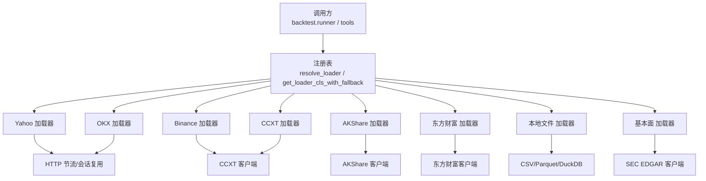
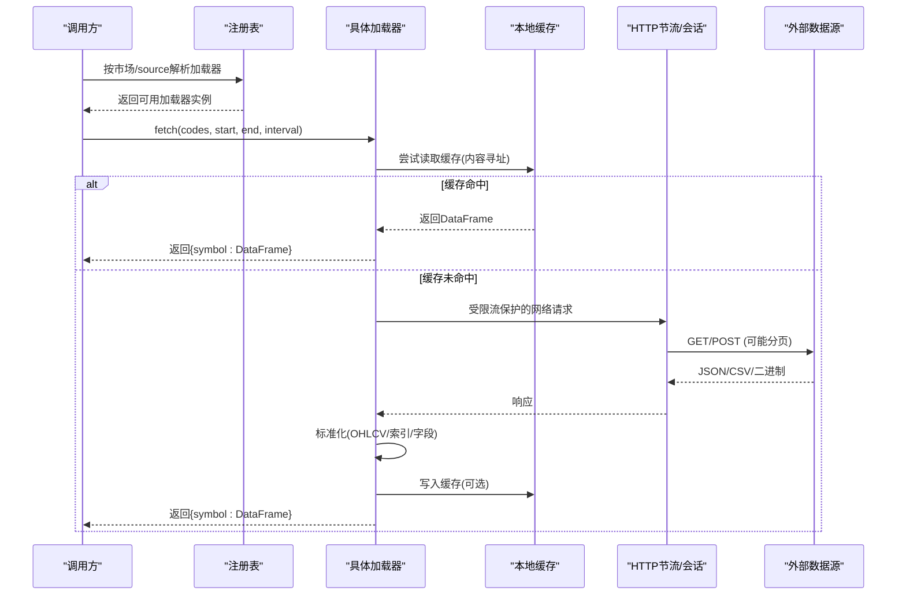
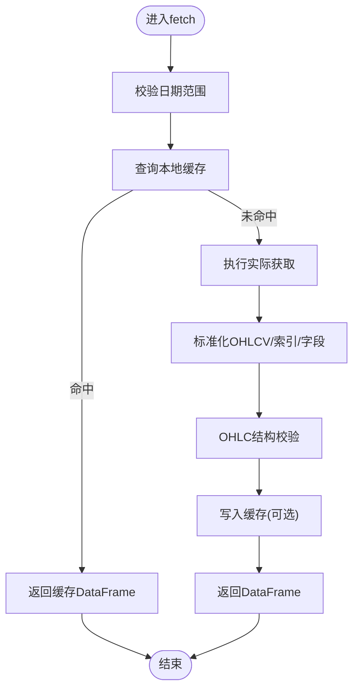
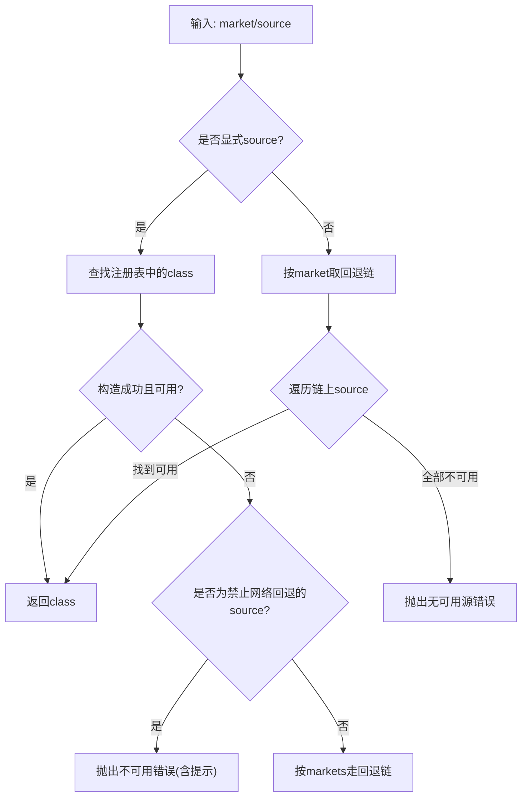
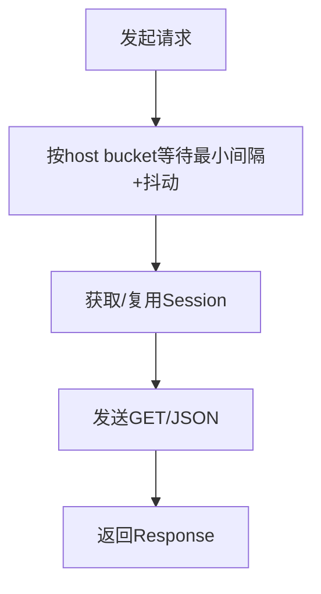
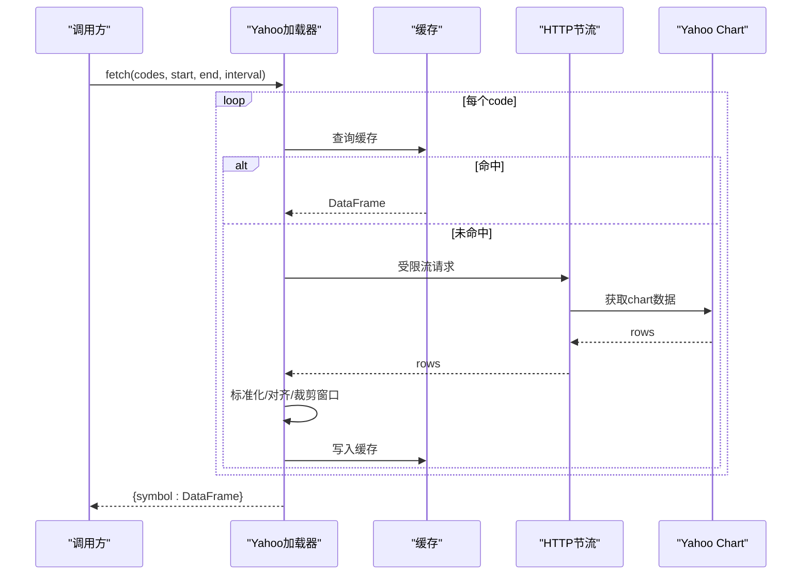
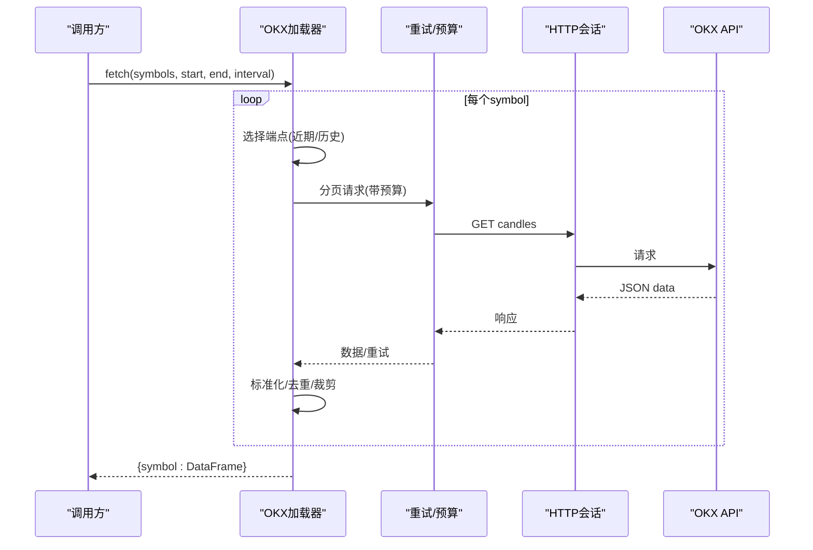
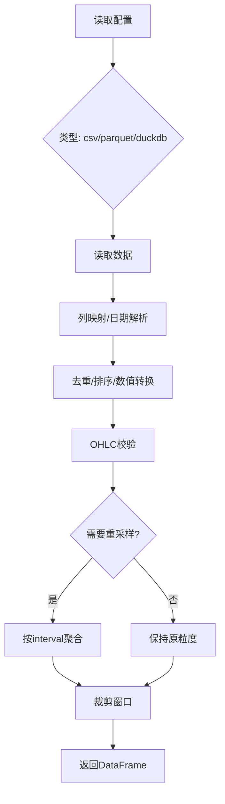
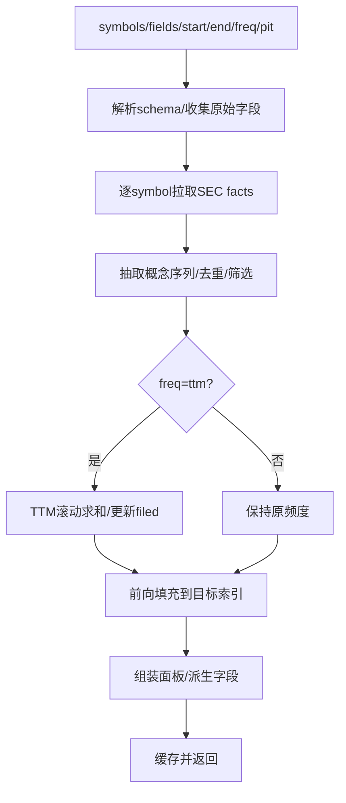
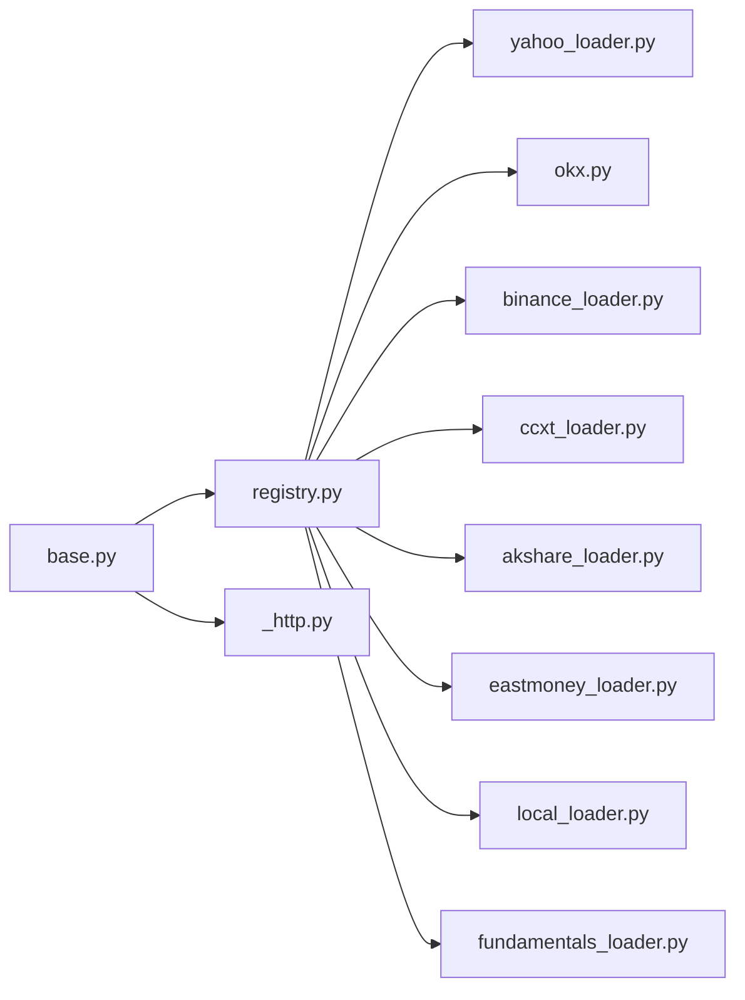

# 数据加载器扩展

<cite>
**本文引用的文件**
- [base.py](file://agent/backtest/loaders/base.py)
- [registry.py](file://agent/backtest/loaders/registry.py)
- [_http.py](file://agent/backtest/loaders/_http.py)
- [_symbol_utils.py](file://agent/backtest/loaders/_symbol_utils.py)
- [yahoo_loader.py](file://agent/backtest/loaders/yahoo_loader.py)
- [binance_loader.py](file://agent/backtest/loaders/binance_loader.py)
- [okx.py](file://agent/backtest/loaders/okx.py)
- [ccxt_loader.py](file://agent/backtest/loaders/ccxt_loader.py)
- [akshare_loader.py](file://agent/backtest/loaders/akshare_loader.py)
- [eastmoney_loader.py](file://agent/backtest/loaders/eastmoney_loader.py)
- [local_loader.py](file://agent/backtest/loaders/local_loader.py)
- [fundamentals_loader.py](file://agent/backtest/loaders/fundamentals_loader.py)
</cite>

## 目录
1. [简介](#简介)
2. [项目结构](#项目结构)
3. [核心组件](#核心组件)
4. [架构总览](#架构总览)
5. [详细组件分析](#详细组件分析)
6. [依赖关系分析](#依赖关系分析)
7. [性能考虑](#性能考虑)
8. [故障排查指南](#故障排查指南)
9. [结论](#结论)
10. [附录](#附录)

## 简介
本指南面向“数据加载器扩展”的开发者与使用者，系统化说明统一的数据获取、格式化、缓存接口；多源适配机制（认证、限流、重试、增量）；数据标准化流程（时间序列对齐、缺失值处理、异常值检测）；数据质量验证（类型检查、范围校验、一致性校验）；以及不同市场（股票、期货、加密货币、宏观指标）的适配示例与性能优化策略（并行下载、压缩、内存管理），并给出跨市场差异与时区问题的处理方法。

## 项目结构
数据加载子系统位于 agent/backtest/loaders 目录，采用“协议 + 注册表 + 具体加载器”的分层设计：
- 协议与通用能力：定义 DataLoaderProtocol、重试/预算、本地缓存、OHLC 校验等基础能力。
- 注册与路由：集中维护各数据源的名称、支持市场、回退链与自动选择逻辑。
- HTTP 共享：为易被限流的免费源提供进程级主机级节流与连接复用。
- 具体加载器：针对 Yahoo、OKX、Binance、CCXT、AKShare、东方财富、本地文件、基本面等实现各自的市场适配与数据规范化。

**图表来源**
- [registry.py:131-196](file://agent/backtest/loaders/registry.py#L131-L196)
- [_http.py:141-201](file://agent/backtest/loaders/_http.py#L141-L201)
- [ccxt_loader.py:203-224](file://agent/backtest/loaders/ccxt_loader.py#L203-L224)
- [akshare_loader.py:139-161](file://agent/backtest/loaders/akshare_loader.py#L139-L161)
- [eastmoney_loader.py:118-149](file://agent/backtest/loaders/eastmoney_loader.py#L118-L149)
- [local_loader.py:301-405](file://agent/backtest/loaders/local_loader.py#L301-L405)
- [fundamentals_loader.py:196-277](file://agent/backtest/loaders/fundamentals_loader.py#L196-L277)

**章节来源**
- [registry.py:1-256](file://agent/backtest/loaders/registry.py#L1-L256)
- [base.py:1-657](file://agent/backtest/loaders/base.py#L1-L657)

## 核心组件
- 数据加载协议与工具
  - DataLoaderProtocol：统一 name/markets/requires_auth/is_available/fetch 接口，约定返回 {symbol: DataFrame(trade_date, open, high, low, close, volume)}。
  - 重试与预算：retry_with_budget/check_budget 提供带超时预算与指数退避的重试，仅对声明的瞬时错误重试。
  - 本地缓存：loader_cache_* 系列函数基于内容寻址键（source/symbol/timeframe/start/end/fields）将结果以 Parquet 持久化，读写失败不影响主流程。
  - OHLC 校验：validate_ohlc 强制结构性不变量（high>=low、高低价包围开收价、非正价格策略可配）。
- 注册与回退链
  - 全局 LOADER_REGISTRY 与 VALID_SOURCES 维护所有可用数据源。
  - FALLBACK_CHAINS 按市场定义优先级顺序（先轻后重、先公开后密钥、再按数据质量）。
  - resolve_loader/get_loader_cls_with_fallback 负责按市场或显式 source 解析可用加载器，并对 local/qveris/tickerall 禁止静默降级到网络源。
- HTTP 共享
  - HostThrottle 按 host bucket 控制最小请求间隔并加入抖动，避免并发同步。
  - throttled_get/throttled_get_json 复用 requests.Session，合并默认 UA，便于绕过部分免费端点的 UA 限制。
- 符号辅助
  - _symbol_utils._is_etf_listed 识别交易所上市 ETF/LOF 前缀，用于 AKShare 路由。

**章节来源**
- [base.py:164-256](file://agent/backtest/loaders/base.py#L164-L256)
- [base.py:127-236](file://agent/backtest/loaders/base.py#L127-L236)
- [base.py:243-441](file://agent/backtest/loaders/base.py#L243-L441)
- [base.py:851-887](file://agent/backtest/loaders/base.py#L851-L887)
- [registry.py:19-158](file://agent/backtest/loaders/registry.py#L19-L158)
- [registry.py:161-256](file://agent/backtest/loaders/registry.py#L161-L256)
- [_http.py:46-107](file://agent/backtest/loaders/_http.py#L46-L107)
- [_http.py:141-201](file://agent/backtest/loaders/_http.py#L141-L201)
- [_symbol_utils.py:1-21](file://agent/backtest/loaders/_symbol_utils.py#L1-L21)

## 架构总览
下图展示从调用方到具体数据源的典型请求路径，包括缓存命中、重试、节流与回退。

**图表来源**
- [registry.py:614-649](file://agent/backtest/loaders/registry.py#L614-L649)
- [base.py:565-661](file://agent/backtest/loaders/base.py#L565-L661)
- [_http.py:141-201](file://agent/backtest/loaders/_http.py#L141-L201)
- [okx.py:220-373](file://agent/backtest/loaders/okx.py#L220-L373)
- [ccxt_loader.py:426-502](file://agent/backtest/loaders/ccxt_loader.py#L426-L502)

## 详细组件分析

### 基类与通用能力（base.py）
- 日期与OHLC校验
  - validate_date_range：确保起止日期合法且 start<=end。
  - validate_ohlc：强制结构性不变量，支持 drop/warn/raise 策略；可按市场允许负价（如电力现货）。
- 重试与预算
  - retry_with_budget：对 transient 异常进行有限次重试，受 wall-clock deadline 约束；每次重试睡眠不超过剩余预算。
  - check_budget：在分页循环中快速失败，避免长时间挂起。
- 本地缓存
  - 内容寻址键：source/symbol/timeframe/start/end/fields 经哈希生成稳定 key。
  - 读写：DuckDB 读写 Parquet，元数据记录 index/columns/dtypes；读/写失败均不中断主流程。
  - 范围判定：仅对已结算区间（end_date < today）缓存，避免钉住正在形成的K线。
- 协议
  - DataLoaderProtocol：name/markets/requires_auth/is_available/fetch，统一返回 {symbol: DataFrame}。

**图表来源**
- [base.py:168-256](file://agent/backtest/loaders/base.py#L168-L256)
- [base.py:565-661](file://agent/backtest/loaders/base.py#L565-L661)

**章节来源**
- [base.py:168-256](file://agent/backtest/loaders/base.py#L168-L256)
- [base.py:127-236](file://agent/backtest/loaders/base.py#L127-L236)
- [base.py:243-441](file://agent/backtest/loaders/base.py#L243-L441)
- [base.py:851-887](file://agent/backtest/loaders/base.py#L851-L887)

### 注册与回退链（registry.py）
- 注册机制：模块导入时通过 @register 将加载器类注入全局字典。
- 市场回退链：按 IP 封禁风险、限流强度、数据质量排序，例如 a_share 优先腾讯/同花顺/东财，再回退到 baostock/akshare/tushare/local。
- 解析策略：
  - resolve_loader(market)：按市场遍历回退链，返回首个 is_available() 为真的加载器。
  - get_loader_cls_with_fallback(source)：按显式 source 解析，必要时在同市场内回退；对 local/qveris/tickerall 禁止静默降级到无关网络源。

**图表来源**
- [registry.py:63-117](file://agent/backtest/loaders/registry.py#L63-L117)
- [registry.py:131-196](file://agent/backtest/loaders/registry.py#L131-L196)
- [registry.py:199-256](file://agent/backtest/loaders/registry.py#L199-L256)

**章节来源**
- [registry.py:1-256](file://agent/backtest/loaders/registry.py#L1-L256)

### HTTP 共享与限流（_http.py）
- 主机级节流：HostThrottle 按 host bucket 维护最近一次触发时间与最小间隔，并发调用会排队等待并加入随机抖动，避免锁步。
- 会话复用：按 bucket 复用 requests.Session，减少 TCP/TLS 握手开销。
- 便捷方法：throttled_get/throttled_get_json 封装请求、UA 合并、超时与状态码检查。

**图表来源**
- [_http.py:46-107](file://agent/backtest/loaders/_http.py#L46-L107)
- [_http.py:118-173](file://agent/backtest/loaders/_http.py#L118-L173)
- [_http.py:176-201](file://agent/backtest/loaders/_http.py#L176-L201)

**章节来源**
- [_http.py:1-201](file://agent/backtest/loaders/_http.py#L1-L201)

### 股票行情加载器示例
- Yahoo 加载器（yahoo_loader.py）
  - 覆盖 US/HK/印度/韩国/加拿大权益及期货/外汇后缀；无需认证；通过公共 chart 接口拉取。
  - 区间映射：1D/1H/4H→1h/1W/1M；日内/日频时间戳对齐（日频归一化至午夜）。
  - 使用 cached_loader_fetch 包装单标的获取，失败不中断批量。
- 东方财富加载器（eastmoney_loader.py）
  - 覆盖 A股/港股/美股；通过 eastmoney_client 拉取 kline；严格校验 interval 与 secid。
  - 列名与数值转换、空值处理、去重与排序。
- AKShare 加载器（akshare_loader.py）
  - 覆盖 A股/美股/港股/期货/基金/宏观/外汇；ETF 特殊路由；外汇需匹配 symbol_market_map。
  - 统一 normalize 流程：中文/英文列名映射、日期解析、数值转换、缺失值填充。

**图表来源**
- [yahoo_loader.py:195-275](file://agent/backtest/loaders/yahoo_loader.py#L195-L275)
- [base.py:565-661](file://agent/backtest/loaders/base.py#L565-L661)
- [_http.py:141-201](file://agent/backtest/loaders/_http.py#L141-L201)

**章节来源**
- [yahoo_loader.py:1-275](file://agent/backtest/loaders/yahoo_loader.py#L1-L275)
- [eastmoney_loader.py:1-183](file://agent/backtest/loaders/eastmoney_loader.py#L1-L183)
- [akshare_loader.py:1-297](file://agent/backtest/loaders/akshare_loader.py#L1-L297)

### 加密货币加载器示例
- OKX 加载器（okx.py）
  - 公共 REST：近期蜡烛与历史蜡烛双端点；深度历史优先 history-candles；分页拉取，支持分钟级高频。
  - 重试与预算：HTTP 429/5xx 视为瞬时错误，结合 retry_with_budget 与整体预算；业务码非 0 直接报错。
  - 时间戳：UTC 毫秒转 trade_date，保留绝对时间以便多源对齐。
- Binance 加载器（binance_loader.py）
  - 基于 CCXT 专用通道，支持现货与 USD-M 永续；固定 exchange 配置与代理设置。
- CCXT 加载器（ccxt_loader.py）
  - 统一 100+ 交易所；支持 spot 与 swap（-PERP）；swap 场景拉取 mark price 与资金费率，对齐交易时段。
  - 分页拉取 OHLCV，限制最大页数与预算；不完整历史会抛错提示。
  - 维护保证金档位（brackets）通过外部版本化工件校验，不在历史路径中在线拉取。

**图表来源**
- [okx.py:131-208](file://agent/backtest/loaders/okx.py#L131-L208)
- [okx.py:220-373](file://agent/backtest/loaders/okx.py#L220-L373)
- [base.py:398-450](file://agent/backtest/loaders/base.py#L398-L450)
- [ccxt_loader.py:226-308](file://agent/backtest/loaders/ccxt_loader.py#L226-L308)
- [ccxt_loader.py:426-502](file://agent/backtest/loaders/ccxt_loader.py#L426-L502)

**章节来源**
- [okx.py:1-373](file://agent/backtest/loaders/okx.py#L1-L373)
- [binance_loader.py:1-45](file://agent/backtest/loaders/binance_loader.py#L1-L45)
- [ccxt_loader.py:1-502](file://agent/backtest/loaders/ccxt_loader.py#L1-L502)

### 本地文件加载器（local_loader.py）
- 配置驱动：~/.vibe-trading/data-bridge/config.yaml 定义 symbol → 文件/查询映射，支持 CSV/Parquet/DuckDB。
- 列映射与日期解析：统一映射到标准列名，解析为 UTC 后转为无时区 DatetimeIndex。
- 重采样：支持将高频源降采样到目标 interval（OHLCV聚合规则），无法升采样则告警并返回原粒度。
- 校验：调用 validate_ohlc 保证结构性一致。

**图表来源**
- [local_loader.py:88-131](file://agent/backtest/loaders/local_loader.py#L88-L131)
- [local_loader.py:141-189](file://agent/backtest/loaders/local_loader.py#L141-L189)
- [local_loader.py:301-405](file://agent/backtest/loaders/local_loader.py#L301-L405)

**章节来源**
- [local_loader.py:1-354](file://agent/backtest/loaders/local_loader.py#L1-L354)

### 基本面加载器（fundamentals_loader.py）
- 目标：将稀疏 SEC XBRL 事实转换为 PIT-safe 的日频面板（TTM/季度/年度）。
- 关键流程：
  - 概念抽取：按表单类型过滤，提取 period_end/filed/value。
  - TTM 近似：对流量型指标做四期滚动求和，锚定 filed 日期。
  - 前向填充：按 filed 对齐到目标日期索引，形成稠密面板。
  - 派生字段：通过 schema 定义的依赖与 compute 计算派生指标。
- 缓存：使用 cached_loader_fetch 缓存原始面板，避免重复拉取。

**图表来源**
- [fundamentals_loader.py:48-132](file://agent/backtest/loaders/fundamentals_loader.py#L48-L132)
- [fundamentals_loader.py:169-194](file://agent/backtest/loaders/fundamentals_loader.py#L169-L194)
- [fundamentals_loader.py:196-277](file://agent/backtest/loaders/fundamentals_loader.py#L196-L277)
- [fundamentals_loader.py:448-521](file://agent/backtest/loaders/fundamentals_loader.py#L448-L521)

**章节来源**
- [fundamentals_loader.py:1-501](file://agent/backtest/loaders/fundamentals_loader.py#L1-L501)

## 依赖关系分析
- 模块耦合
  - 所有加载器依赖 base 提供的缓存、重试、校验能力。
  - 注册表集中管理市场回退链，解耦调用方与具体源。
  - HTTP 共享模块被多个免费源复用，降低限流风险。
- 外部依赖
  - CCXT：加密资产统一抽象。
  - AKShare/Eastmoney/Yahoo：公开/半公开金融数据。
  - SEC EDGAR：美国上市公司基本面。
  - DuckDB：高效 Parquet 读写与 SQL 查询。
- 潜在循环依赖
  - 当前结构清晰分层，未见循环 import；注册表通过延迟 import 模块避免启动时强依赖。

**图表来源**
- [registry.py:84-117](file://agent/backtest/loaders/registry.py#L84-L117)
- [base.py:243-441](file://agent/backtest/loaders/base.py#L243-L441)
- [_http.py:141-201](file://agent/backtest/loaders/_http.py#L141-L201)

**章节来源**
- [registry.py:1-256](file://agent/backtest/loaders/registry.py#L1-L256)
- [base.py:1-657](file://agent/backtest/loaders/base.py#L1-L657)

## 性能考虑
- 并行下载
  - 建议在上层（调用方）对 codes 列表进行批处理并行（线程池/进程池），各加载器内部已对单标的失败隔离。
  - 注意共享资源竞争：HTTP 节流按 host bucket 串行化，避免同一源过载；CCXT/OKX 自带 rate limit。
- 数据压缩
  - 本地缓存使用 Parquet + DuckDB，显著降低磁盘占用与 IO 成本；元数据保存 index dtypes 提升还原精度。
- 内存管理
  - 分页拉取（OKX/CCXT）限制每页大小与最大页数，避免一次性加载过大对象。
  - 本地文件加载器按需 resample，避免不必要的高频内存占用。
- 预算与超时
  - 所有网络拉取均受 budget_s 约束，防止单次任务长时间阻塞；超时可通过环境变量调整。
- 连接复用
  - requests.Session 按 host 复用，减少握手开销；CCXT 也启用 enableRateLimit。

[本节为通用指导，不直接分析具体文件]

## 故障排查指南
- 常见错误与定位
  - 无可用数据源：检查市场回退链与 is_available；确认网络/代理/凭据。
  - 日期无效或倒序：validate_date_range 会抛出明确 ValueError。
  - OHLC 结构异常：validate_ohlc 会 drop/warn/raise；关注日志中的条数统计。
  - 缓存问题：缓存读写失败不会中断主流程；检查缓存根目录与权限。
  - 限流/封禁：观察 HTTP 429/5xx；增大最小间隔或切换回退源。
  - 时间戳/时区：确保 trade_date 为无时区索引；Yahoo/OKX 等会在标准化阶段处理。
- 调试步骤
  - 开启日志：查看各加载器 warning/debug 信息。
  - 关闭缓存：临时禁用缓存以排除脏数据影响。
  - 缩小范围：先对单个 symbol 测试，逐步扩大批次。
  - 检查代理：对 OKX/CCXT 等设置 ALL_PROXY/HTTPS_PROXY。

**章节来源**
- [base.py:168-256](file://agent/backtest/loaders/base.py#L168-L256)
- [base.py:565-661](file://agent/backtest/loaders/base.py#L565-L661)
- [okx.py:109-126](file://agent/backtest/loaders/okx.py#L109-L126)
- [_http.py:141-201](file://agent/backtest/loaders/_http.py#L141-L201)

## 结论
本数据加载器扩展通过统一的协议、注册与回退链、共享 HTTP 能力与本地缓存，实现了跨市场、跨源的一致数据接入体验。其内置的重试/预算、OHLC 校验、时间对齐与缺失值处理，保障了数据质量与稳定性。针对不同市场（股票、期货、加密货币、宏观、基本面）提供了丰富适配示例，并通过参数化配置与环境变量灵活调优。建议在调用层配合并行与批处理策略，以获得最佳吞吐与鲁棒性。

[本节为总结，不直接分析具体文件]

## 附录
- 环境变量参考
  - 重试/预算：OKX_FETCH_BUDGET_S、OKX_TIMEOUT_S、CCXT_FETCH_BUDGET_S、CCXT_TIMEOUT_MS。
  - 代理：ALL_PROXY、HTTP_PROXY、HTTPS_PROXY。
  - 缓存：VIBE_TRADING_DATA_CACHE、VIBE_TRADING_DATA_CACHE_ROOT。
- 市场回退链要点
  - A股：优先腾讯/同花顺/东财，再回退 baostock/akshare/tushare/local。
  - 美股：Yahoo/Stooq/Sina/Eastmoney/yfinance/Tiingo/FMP/Finnhub/AlphaVantage/Longbridge/Akshare/local。
  - 港股：腾讯/东财/Yahoo/Futu/Akshare/yfinance/Tushare/Longbridge/local。
  - 加密：OKX/Binance/CCXT/yfinance/local。
  - 外汇：MT5/Akshare/yfinance/local。
  - 宏观/基金/期货：Akshare/Tushare/local。

[本节为概览，不直接分析具体文件]