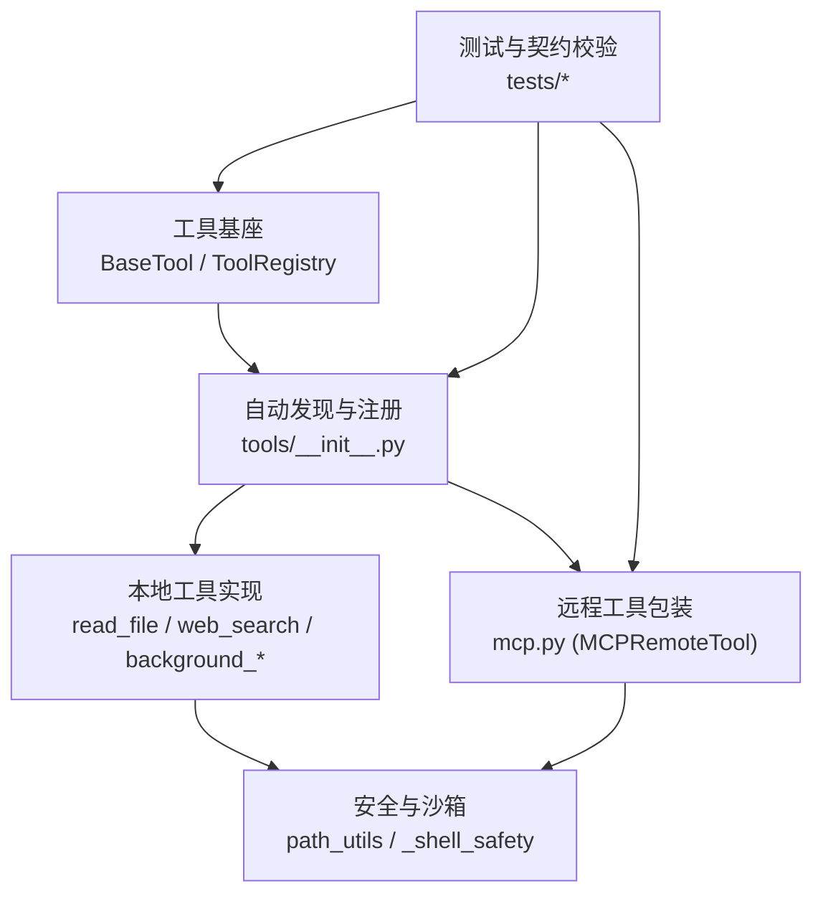
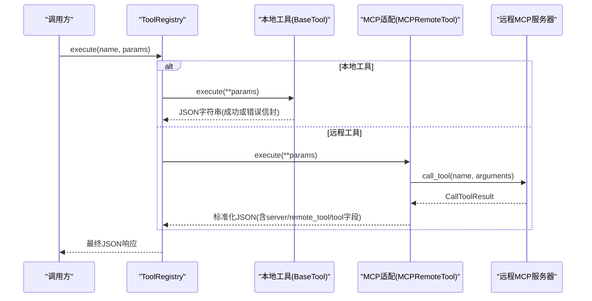
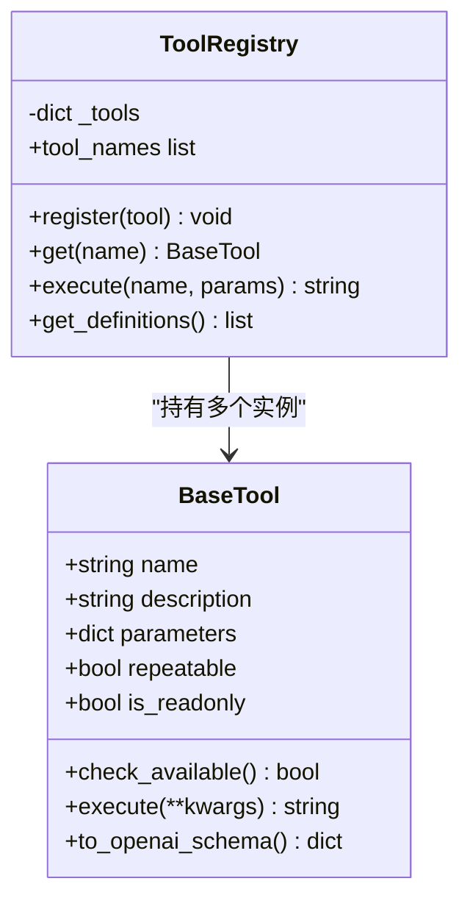
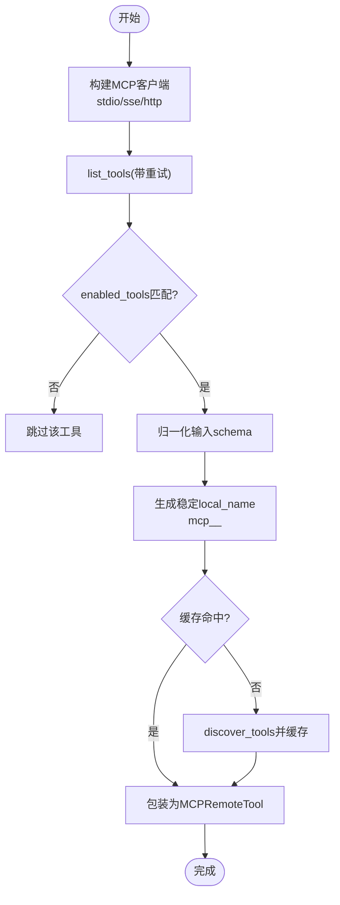
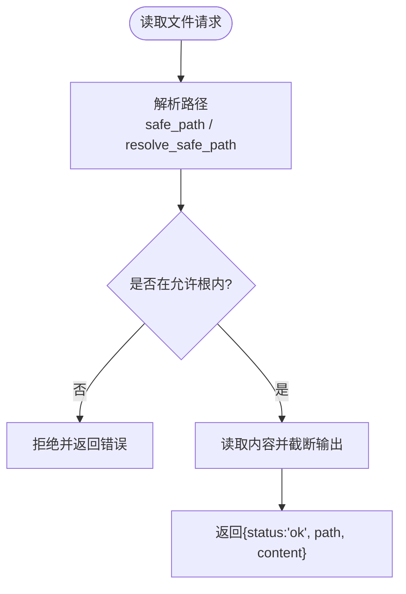
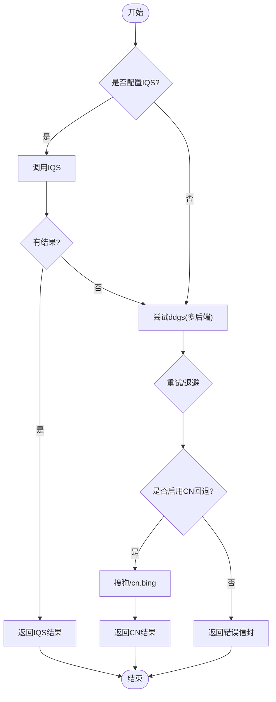
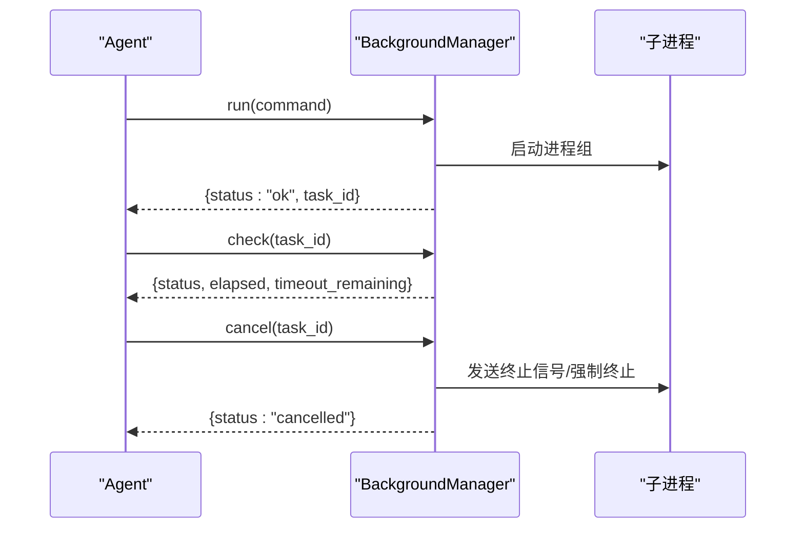
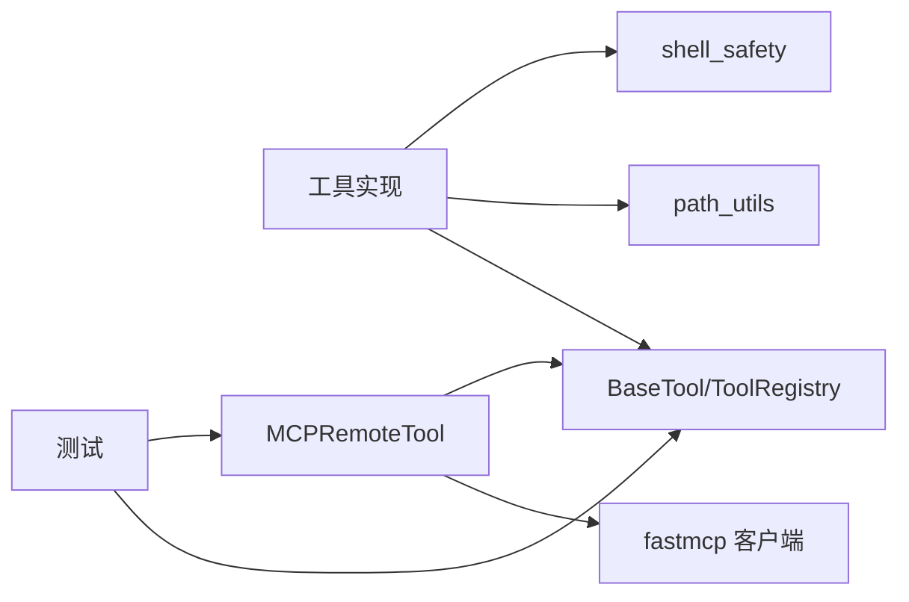

# 自定义工具开发

<cite>
**本文引用的文件**
- [agent/src/agent/tools.py](file://agent/src/agent/tools.py)
- [agent/src/tools/__init__.py](file://agent/src/tools/__init__.py)
- [agent/src/tools/mcp.py](file://agent/src/tools/mcp.py)
- [agent/src/tools/background_tools.py](file://agent/src/tools/background_tools.py)
- [agent/src/tools/_shell_safety.py](file://agent/src/tools/_shell_safety.py)
- [agent/src/tools/read_file_tool.py](file://agent/src/tools/read_file_tool.py)
- [agent/src/tools/web_search_tool.py](file://agent/src/tools/web_search_tool.py)
- [agent/src/tools/path_utils.py](file://agent/src/tools/path_utils.py)
- [agent/tests/test_swarm_output_contract.py](file://agent/tests/test_swarm_output_contract.py)
- [agent/tests/test_mcp_alpha_zoo_contract.py](file://agent/tests/test_mcp_alpha_zoo_contract.py)
</cite>

## 目录
1. [简介](#简介)
2. [项目结构](#项目结构)
3. [核心组件](#核心组件)
4. [架构总览](#架构总览)
5. [详细组件分析](#详细组件分析)
6. [依赖关系分析](#依赖关系分析)
7. [性能考虑](#性能考虑)
8. [故障排查指南](#故障排查指南)
9. [结论](#结论)
10. [附录：完整示例与最佳实践](#附录：完整示例与最佳实践)

## 简介
本指南面向希望在本项目中开发“自定义工具”的工程师，系统讲解工具的注册机制、动态加载原理、参数与返回值规范、生命周期管理、权限控制与安全沙箱、以及测试与调试方法。文档以代码级事实为依据，结合类图、时序图和流程图帮助理解从初始化到执行再到清理的完整流程，并提供从简单查询到复杂多步骤分析的示例路径。

## 项目结构
- 工具基座与注册中心位于 agent/src/agent/tools.py（BaseTool、ToolRegistry）与 agent/src/tools/__init__.py（自动发现与构建 ToolRegistry）。
- 远程工具适配层位于 agent/src/tools/mcp.py（MCP 客户端适配器、远程工具包装、名称规范化、缓存与重试）。
- 安全与沙箱在 agent/src/tools/path_utils.py（路径白名单）、agent/src/tools/_shell_safety.py（Shell 命令安全规则）。
- 典型工具实现：read_file_tool.py、web_search_tool.py、background_tools.py（后台任务）。
- 测试用例覆盖契约一致性、错误信封、超时与重试等场景。

**图表来源**
- [agent/src/agent/tools.py:13-94](file://agent/src/agent/tools.py#L13-L94)
- [agent/src/tools/__init__.py:33-153](file://agent/src/tools/__init__.py#L33-L153)
- [agent/src/tools/mcp.py:312-375](file://agent/src/tools/mcp.py#L312-L375)
- [agent/src/tools/path_utils.py:46-74](file://agent/src/tools/path_utils.py#L46-L74)
- [agent/src/tools/_shell_safety.py:38-59](file://agent/src/tools/_shell_safety.py#L38-L59)

**章节来源**
- [agent/src/agent/tools.py:13-94](file://agent/src/agent/tools.py#L13-L94)
- [agent/src/tools/__init__.py:33-153](file://agent/src/tools/__init__.py#L33-L153)

## 核心组件
- BaseTool：定义工具的统一接口（name、description、parameters、repeatable、is_readonly），提供 to_openai_schema 转换，并约定 execute 返回 JSON 字符串。
- ToolRegistry：维护工具名到实例的映射，提供 get、execute、get_definitions 等方法；execute 统一捕获异常并返回标准错误信封。
- 自动发现与构建：通过导入 tools 包下所有模块，收集 BaseTool 子类并注册；支持过滤 shell 工具、注入 session_id、合并 MCP 远程工具。
- MCP 适配层：将远程 MCP 工具暴露为本地 BaseTool 包装器，负责参数归一化、结果标准化、命名冲突处理、缓存与重试。

**章节来源**
- [agent/src/agent/tools.py:13-94](file://agent/src/agent/tools.py#L13-L94)
- [agent/src/tools/__init__.py:33-153](file://agent/src/tools/__init__.py#L33-L153)
- [agent/src/tools/mcp.py:312-375](file://agent/src/tools/mcp.py#L312-L375)

## 架构总览
下图展示了工具从注册到执行的端到端流程，包括本地工具与远程 MCP 工具的融合。

**图表来源**
- [agent/src/agent/tools.py:72-84](file://agent/src/agent/tools.py#L72-L84)
- [agent/src/tools/mcp.py:694-708](file://agent/src/tools/mcp.py#L694-L708)
- [agent/src/tools/mcp.py:625-659](file://agent/src/tools/mcp.py#L625-L659)

## 详细组件分析

### 工具基座与注册机制
- BaseTool 抽象了工具元数据与执行入口，to_openai_schema 用于对外暴露函数调用签名。
- ToolRegistry.execute 保证无论工具内部是否抛错，都会返回合法的 JSON 字符串，便于上层统一处理。
- 自动发现通过遍历 src/tools 下的模块，收集 BaseTool 子类并注册；可基于 check_available 跳过缺失依赖的工具。
- build_registry 支持：
  - 排除 shell 工具（bash、background_run、cancel_background）除非显式开启。
  - 注入 session_id 给特定工具（如研究目标相关工具）。
  - 合并 MCP 远程工具，按 server_name 生成稳定 local_name（mcp_<server>_<tool>）。

**图表来源**
- [agent/src/agent/tools.py:13-94](file://agent/src/agent/tools.py#L13-L94)

**章节来源**
- [agent/src/agent/tools.py:13-94](file://agent/src/agent/tools.py#L13-L94)
- [agent/src/tools/__init__.py:33-153](file://agent/src/tools/__init__.py#L33-L153)

### 动态加载与远程工具包装（MCP）
- 构建远程工具包装器时，会：
  - 根据配置创建 FastMCP 客户端（stdio/sse/streamable-http）。
  - 调用 list_tools 获取远端工具清单，并按 enabled_tools 过滤。
  - 对输入 schema 进行归一化（兼容 anyOf/oneOf/allOf 等组合）。
  - 生成稳定的本地工具名，处理命名冲突（追加哈希后缀）。
  - 缓存工具规格以避免重复 discovery。
- MCPRemoteTool.execute 将参数过滤后转发至远端，并将结果标准化为包含 server、remote_tool、tool 字段的 JSON。

**图表来源**
- [agent/src/tools/mcp.py:312-375](file://agent/src/tools/mcp.py#L312-L375)
- [agent/src/tools/mcp.py:444-480](file://agent/src/tools/mcp.py#L444-L480)
- [agent/src/tools/mcp.py:332-367](file://agent/src/tools/mcp.py#L332-L367)

**章节来源**
- [agent/src/tools/mcp.py:312-375](file://agent/src/tools/mcp.py#L312-L375)
- [agent/src/tools/mcp.py:444-480](file://agent/src/tools/mcp.py#L444-L480)
- [agent/src/tools/mcp.py:332-367](file://agent/src/tools/mcp.py#L332-L367)

### 文件系统访问限制与安全沙箱
- read_file 工具通过 path_utils 的安全路径解析，确保文件访问限定在允许的根目录下（run_dir、skills/、uploads、data、~/.vibe-trading 等），并拒绝 UNC 路径与越界路径。
- 写操作与编辑操作使用 allowed_write_roots 与 safe_run_dir 进一步约束写入范围。
- Shell 安全规则禁止宽泛地终止 Python 进程（防止误杀宿主进程），引导用户使用 cancel_background 精确停止任务。

**图表来源**
- [agent/src/tools/read_file_tool.py:48-133](file://agent/src/tools/read_file_tool.py#L48-L133)
- [agent/src/tools/path_utils.py:46-74](file://agent/src/tools/path_utils.py#L46-L74)
- [agent/src/tools/path_utils.py:185-240](file://agent/src/tools/path_utils.py#L185-L240)
- [agent/src/tools/_shell_safety.py:38-59](file://agent/src/tools/_shell_safety.py#L38-L59)

**章节来源**
- [agent/src/tools/read_file_tool.py:48-133](file://agent/src/tools/read_file_tool.py#L48-L133)
- [agent/src/tools/path_utils.py:46-74](file://agent/src/tools/path_utils.py#L46-L74)
- [agent/src/tools/path_utils.py:185-240](file://agent/src/tools/path_utils.py#L185-L240)
- [agent/src/tools/_shell_safety.py:38-59](file://agent/src/tools/_shell_safety.py#L38-L59)

### 网络请求控制与降级策略（Web搜索）
- WebSearchTool 优先尝试阿里云 IQS（若配置），否则使用 ddgs 聚合多个免费搜索引擎，并在失败时回退到搜狗或 cn.bing。
- 对网络错误进行有限次重试与退避，避免长时间阻塞；对“无结果”直接返回空结果而非重试。
- 输出经 with_security_warnings 处理，降低敏感信息泄露风险。

**图表来源**
- [agent/src/tools/web_search_tool.py:134-349](file://agent/src/tools/web_search_tool.py#L134-L349)

**章节来源**
- [agent/src/tools/web_search_tool.py:134-349](file://agent/src/tools/web_search_tool.py#L134-L349)

### 后台任务与生命周期管理
- BackgroundManager 管理后台进程组的生命周期：启动、取消、检查状态、超时终止、通知队列。
- 三个工具协同工作：
  - background_run：提交命令并立即返回 task_id。
  - check_background：查询任务状态、耗时与剩余时间。
  - cancel_background：按 task_id 精准终止对应进程组。
- 平台差异处理：POSIX 使用进程组信号，Windows 使用 taskkill /T。

**图表来源**
- [agent/src/tools/background_tools.py:102-319](file://agent/src/tools/background_tools.py#L102-L319)
- [agent/src/tools/background_tools.py:322-377](file://agent/src/tools/background_tools.py#L322-L377)

**章节来源**
- [agent/src/tools/background_tools.py:102-319](file://agent/src/tools/background_tools.py#L102-L319)
- [agent/src/tools/background_tools.py:322-377](file://agent/src/tools/background_tools.py#L322-L377)

### 参数定义与返回值格式规范
- 参数定义：遵循 JSON Schema 风格，properties 描述字段类型与说明，required 列出必填项。
- 返回值：统一为 JSON 字符串；成功通常包含 status="ok" 及业务数据；失败包含 status="error" 与 error 消息。
- 契约一致性：测试中验证包装器签名与工具 parameters 一致，避免漂移。

**章节来源**
- [agent/src/agent/tools.py:13-51](file://agent/src/agent/tools.py#L13-L51)
- [agent/tests/test_mcp_alpha_zoo_contract.py:35-45](file://agent/tests/test_mcp_alpha_zoo_contract.py#L35-L45)
- [agent/tests/test_swarm_output_contract.py:282-316](file://agent/tests/test_swarm_output_contract.py#L282-L316)

### 工具权限控制与安全沙箱机制
- 文件系统：通过 path_utils 的白名单根目录与 safe_path 解析，限制读写范围；拒绝 UNC 路径与越界路径。
- Shell 命令：_shell_safety 阻止宽泛终止 Python 进程，要求通过 cancel_background 精确控制。
- 环境变量隔离：MCP 客户端通过 env 注入环境变量；OAuth token 存储于受限目录（0700 权限）。
- 只读标记：BaseTool.is_readonly 可用于标识只读工具，配合注册逻辑进行策略控制。

**章节来源**
- [agent/src/tools/path_utils.py:46-74](file://agent/src/tools/path_utils.py#L46-L74)
- [agent/src/tools/path_utils.py:150-182](file://agent/src/tools/path_utils.py#L150-L182)
- [agent/src/tools/_shell_safety.py:38-59](file://agent/src/tools/_shell_safety.py#L38-L59)
- [agent/src/tools/mcp.py:510-537](file://agent/src/tools/mcp.py#L510-L537)
- [agent/src/agent/tools.py:13-27](file://agent/src/agent/tools.py#L13-L27)

## 依赖关系分析
- 工具基座与注册：BaseTool 与 ToolRegistry 被所有工具共享；自动发现依赖 pkgutil/importlib。
- 远程工具：MCPRemoteTool 依赖 fastmcp 客户端与传输层（stdio/sse/http），并通过适配器封装同步调用。
- 安全与沙箱：read_file、write_file、edit_file 等工具依赖 path_utils；shell 工具依赖 _shell_safety。
- 测试：契约测试确保 wrapper 与 tool.parameters 一致；错误信封测试确保失败路径稳定。

**图表来源**
- [agent/src/agent/tools.py:13-94](file://agent/src/agent/tools.py#L13-L94)
- [agent/src/tools/mcp.py:312-375](file://agent/src/tools/mcp.py#L312-L375)
- [agent/src/tools/path_utils.py:46-74](file://agent/src/tools/path_utils.py#L46-L74)
- [agent/src/tools/_shell_safety.py:38-59](file://agent/src/tools/_shell_safety.py#L38-L59)

**章节来源**
- [agent/src/agent/tools.py:13-94](file://agent/src/agent/tools.py#L13-L94)
- [agent/src/tools/mcp.py:312-375](file://agent/src/tools/mcp.py#L312-L375)
- [agent/src/tools/path_utils.py:46-74](file://agent/src/tools/path_utils.py#L46-L74)
- [agent/src/tools/_shell_safety.py:38-59](file://agent/src/tools/_shell_safety.py#L38-L59)

## 性能考虑
- 远程工具 discovery 缓存：避免重复 list_tools，提升启动与切换速度。
- 网络请求重试与退避：web_search 对临时错误进行有限重试，避免长时间阻塞。
- 输出截断：read_file 与 background 任务输出限制最大字符数，防止大响应影响性能。
- 超时控制：background 任务默认超时 300 秒，超时时安全终止进程组。

[本节为通用指导，不直接分析具体文件]

## 故障排查指南
- 工具未找到：ToolRegistry.execute 返回标准错误信封，检查工具名是否正确、是否被过滤（如 shell 工具未启用）。
- 远程工具不可用：MCP 适配器会在 discovery 失败时记录警告；检查 enabled_tools 与网络连通性。
- 文件访问被拒：确认路径在允许根内，或配置 VIBE_TRADING_ALLOWED_FILE_ROOTS/VIBE_TRADING_ALLOWED_WRITE_ROOTS。
- Shell 命令被拦截：避免宽泛终止 Python 进程，改用 cancel_background。
- 网络搜索失败：检查代理/出口限制，调整 VIBE_TRADING_SEARCH_BACKENDS 或禁用 CN 回退。

**章节来源**
- [agent/src/agent/tools.py:72-84](file://agent/src/agent/tools.py#L72-L84)
- [agent/src/tools/mcp.py:444-480](file://agent/src/tools/mcp.py#L444-L480)
- [agent/src/tools/path_utils.py:185-240](file://agent/src/tools/path_utils.py#L185-L240)
- [agent/src/tools/_shell_safety.py:38-59](file://agent/src/tools/_shell_safety.py#L38-L59)
- [agent/src/tools/web_search_tool.py:232-349](file://agent/src/tools/web_search_tool.py#L232-L349)

## 结论
本项目提供了完善的工具开发与运行框架：统一的 BaseTool 接口、自动发现与注册、远程工具包装、严格的安全沙箱与权限控制、健壮的错误处理与性能优化。开发者只需继承 BaseTool、定义参数与实现 execute，即可快速集成到系统中；借助 MCP 适配，还可无缝接入外部工具生态。

[本节为总结，不直接分析具体文件]

## 附录：完整示例与最佳实践

### 示例一：简单数据查询工具（读取文件）
- 目标：读取工作区内的配置文件或数据文件，限制输出大小。
- 关键点：
  - 参数：path（必填）、limit（可选）。
  - 安全：通过 path_utils 解析并确保在允许根内。
  - 返回：JSON 字符串，包含 status、path、content。
- 参考路径：
  - [read_file_tool.py:18-133](file://agent/src/tools/read_file_tool.py#L18-L133)
  - [path_utils.py:46-74](file://agent/src/tools/path_utils.py#L46-L74)

### 示例二：复杂多步骤分析工具（网络搜索+读取URL）
- 目标：先搜索相关信息，再读取关键 URL 的内容进行分析。
- 关键点：
  - 搜索：web_search 支持多后端与回退，输出结构化结果。
  - 读取：后续可使用 read_url（若存在）或 read_file 读取本地缓存。
  - 安全：with_security_warnings 处理敏感字段。
- 参考路径：
  - [web_search_tool.py:134-349](file://agent/src/tools/web_search_tool.py#L134-L349)

### 示例三：后台长任务（数据处理/批处理）
- 目标：执行耗时任务，支持查询状态与取消。
- 关键点：
  - 启动：background_run 返回 task_id。
  - 监控：check_background 查询状态与剩余时间。
  - 取消：cancel_background 精准终止进程组。
- 参考路径：
  - [background_tools.py:322-377](file://agent/src/tools/background_tools.py#L322-L377)
  - [background_tools.py:102-319](file://agent/src/tools/background_tools.py#L102-L319)

### 错误处理最佳实践
- 始终返回 JSON 字符串，包含 status 与必要上下文。
- 对网络请求进行有限重试与退避，区分“无结果”与“临时错误”。
- 使用 ToolRegistry.execute 的异常捕获能力，确保上层稳定。

**章节来源**
- [agent/src/agent/tools.py:72-84](file://agent/src/agent/tools.py#L72-L84)
- [agent/src/tools/web_search_tool.py:232-349](file://agent/src/tools/web_search_tool.py#L232-L349)

### 性能优化技巧
- 远程工具 discovery 缓存，减少重复开销。
- 输出截断与超时控制，避免大响应与长时间阻塞。
- 合理设置 enabled_tools，仅暴露必要工具。

[本节为通用指导，不直接分析具体文件]

### 调试方法
- 查看日志：工具注册失败、MCP 连接失败、网络错误均有日志记录。
- 单元测试：验证参数契约、错误信封、超时行为。
- 手动验证：通过 CLI 或 API 调用工具，观察返回结构与耗时。

**章节来源**
- [agent/tests/test_swarm_output_contract.py:282-316](file://agent/tests/test_swarm_output_contract.py#L282-L316)
- [agent/tests/test_mcp_alpha_zoo_contract.py:35-45](file://agent/tests/test_mcp_alpha_zoo_contract.py#L35-L45)

### 测试策略与单元测试编写
- 契约测试：确保包装器签名与工具 parameters 一致。
- 错误路径：验证失败返回标准信封，包含必要字段。
- 安全边界：验证路径越界、UNC 路径、宽泛进程终止被拒绝。

**章节来源**
- [agent/tests/test_mcp_alpha_zoo_contract.py:35-45](file://agent/tests/test_mcp_alpha_zoo_contract.py#L35-L45)
- [agent/tests/test_swarm_output_contract.py:282-316](file://agent/tests/test_swarm_output_contract.py#L282-L316)