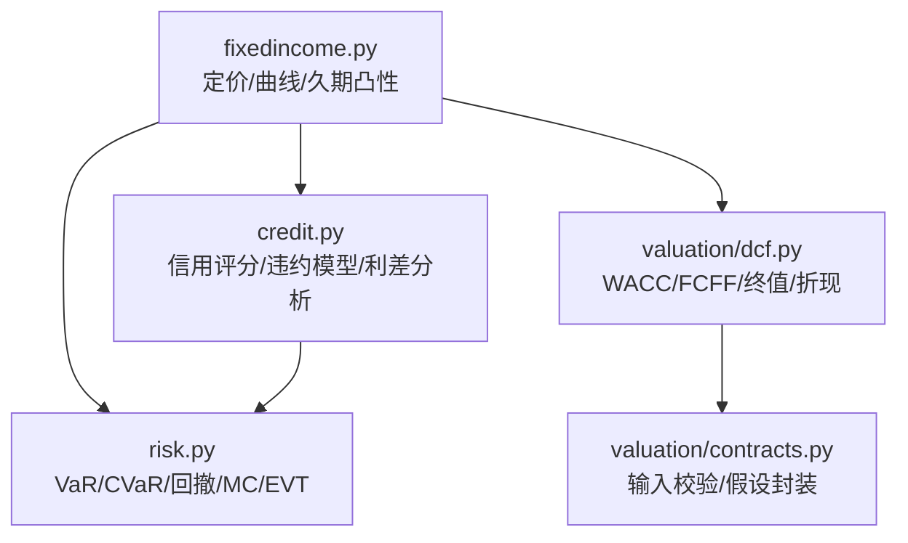
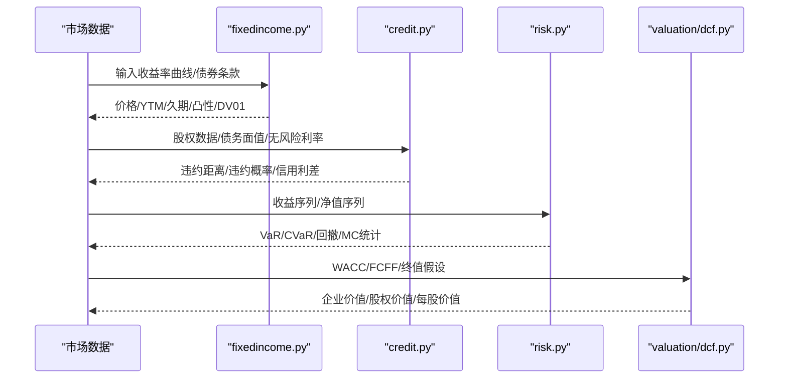
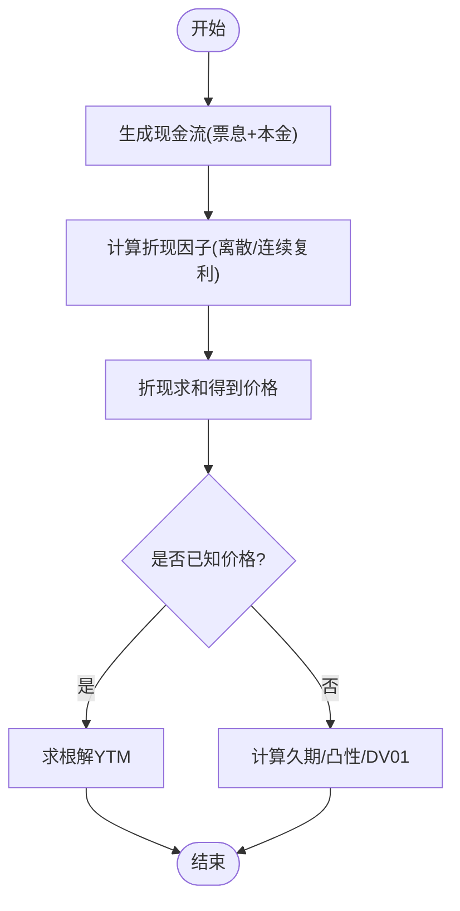
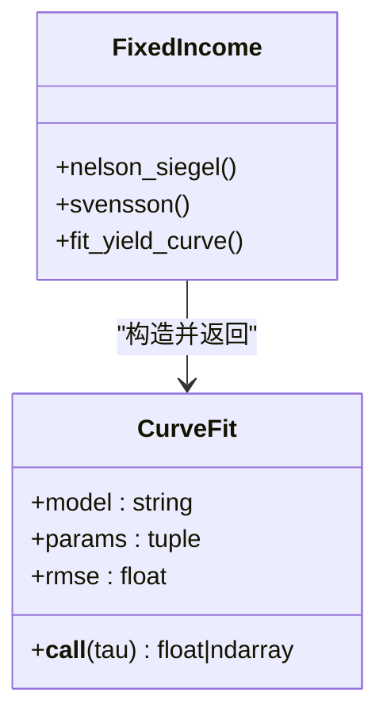
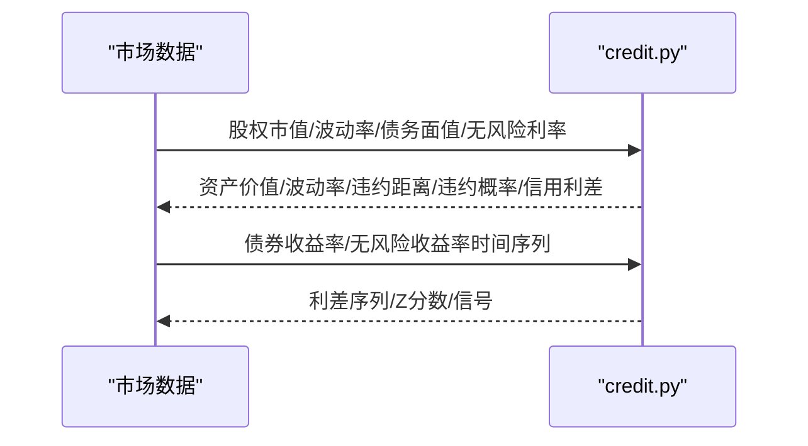
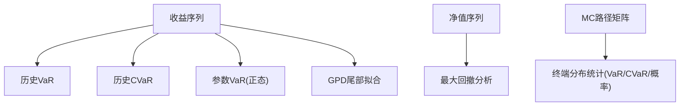
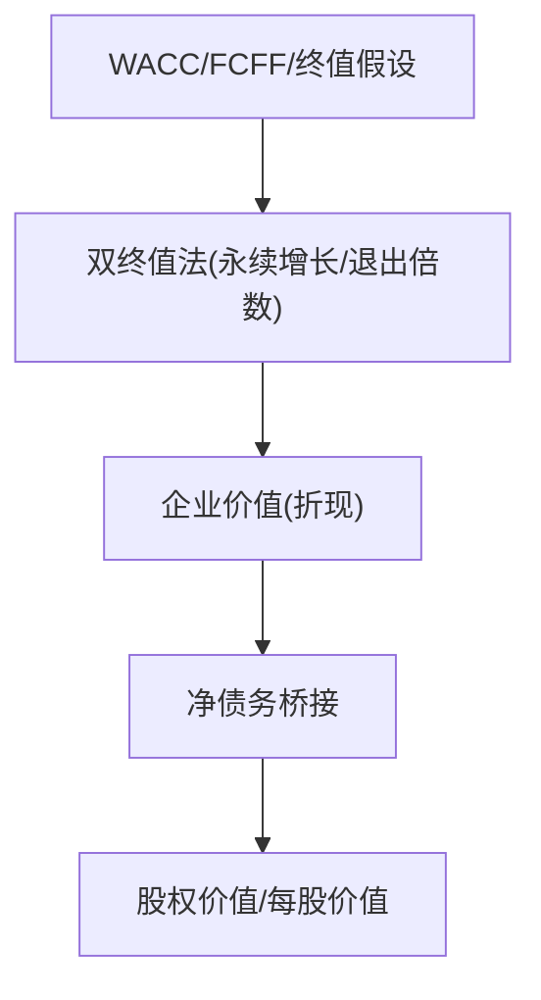
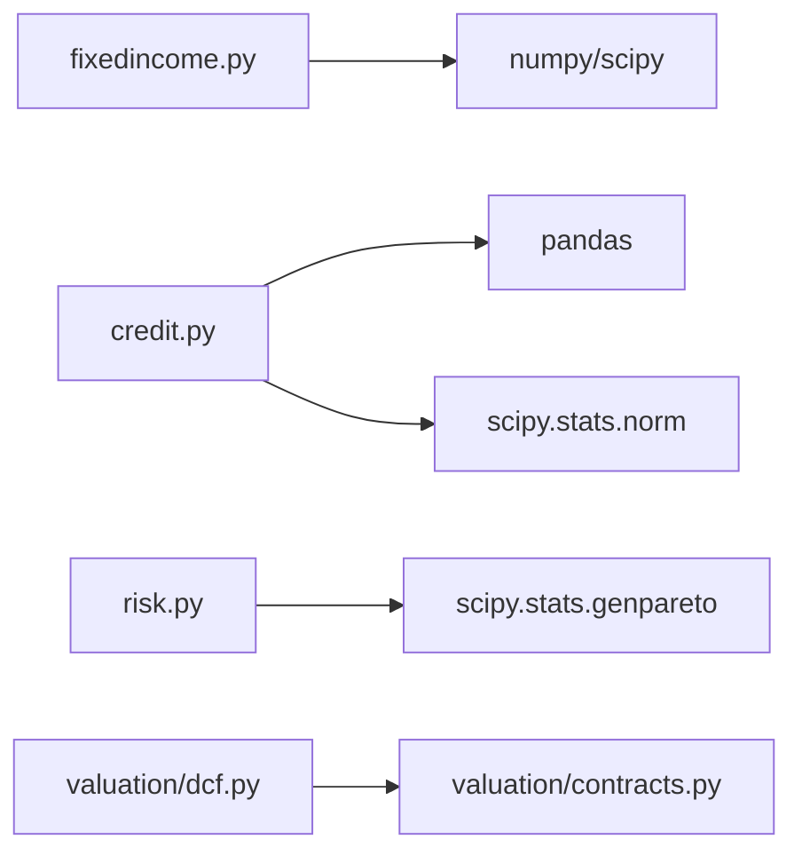

# 固定收益证券分析

<cite>
**本文引用的文件**
- [fixedincome.py](file://agent/src/quantlib/fixedincome.py)
- [credit.py](file://agent/src/quantlib/credit.py)
- [risk.py](file://agent/src/quantlib/risk.py)
- [dcf.py](file://agent/src/quantlib/valuation/dcf.py)
- [contracts.py](file://agent/src/quantlib/valuation/contracts.py)
- [test_fixedincome.py](file://agent/tests/quantlib/test_fixedincome.py)
- [test_credit.py](file://agent/tests/quantlib/test_credit.py)
</cite>

## 目录
1. [简介](#简介)
2. [项目结构](#项目结构)
3. [核心组件](#核心组件)
4. [架构总览](#架构总览)
5. [详细组件分析](#详细组件分析)
6. [依赖关系分析](#依赖关系分析)
7. [性能与数值稳定性](#性能与数值稳定性)
8. [故障排查指南](#故障排查指南)
9. [结论](#结论)
10. [附录：使用示例与最佳实践](#附录使用示例与最佳实践)

## 简介
本技术文档围绕固定收益证券分析，系统阐述债券定价模型、收益率曲线构建方法、久期与凸性计算算法，以及信用利差分析与违约概率建模。代码实现覆盖零息债券、附息债券的定价与风险度量，提供 Nelson-Siegel 与 Svensson 期限结构拟合，并给出信用风险（Altman Z-Score、Merton/KMV）与信用利差时序分析工具。同时包含现金流折现、再投资假设与税收处理的 DCF 估值模块，便于进行债券组合分析与利率风险管理。

## 项目结构
仓库中与固定收益相关的核心能力集中在 agent/src/quantlib 下：
- fixedincome.py：日计数、应计利息、现金流生成、债券定价、YTM 求解、久期/凸性/DV01/有效久期、Nelson-Siegel/Svensson 曲线拟合与可调用 CurveFit。
- credit.py：Altman Z-Score 三套系数与分区；Merton/KMV 资产价值与波动率反解、违约距离、EDF 参考带；信用利差时序分析与跨发行人利差网格。
- risk.py：VaR/CVaR、最大回撤、蒙特卡洛模拟与极值分布（GPD）尾部拟合，用于组合风险度量与压力测试。
- valuation/dcf.py 与 contracts.py：WACC、FCFF 桥接、双终值法（永续增长与退出倍数）、折现与股权桥接、输入校验与假设封装。

图表来源
- [fixedincome.py:1-795](file://agent/src/quantlib/fixedincome.py#L1-L795)
- [credit.py:1-676](file://agent/src/quantlib/credit.py#L1-L676)
- [risk.py:1-512](file://agent/src/quantlib/risk.py#L1-L512)
- [dcf.py:1-800](file://agent/src/quantlib/valuation/dcf.py#L1-L800)
- [contracts.py:1-161](file://agent/src/quantlib/valuation/contracts.py#L1-L161)

章节来源
- [fixedincome.py:1-795](file://agent/src/quantlib/fixedincome.py#L1-L795)
- [credit.py:1-676](file://agent/src/quantlib/credit.py#L1-L676)
- [risk.py:1-512](file://agent/src/quantlib/risk.py#L1-L512)
- [dcf.py:1-800](file://agent/src/quantlib/valuation/dcf.py#L1-L800)
- [contracts.py:1-161](file://agent/src/quantlib/valuation/contracts.py#L1-L161)

## 核心组件
- 债券基础与定价
  - 日计数与应计利息：支持 ACT/365F、ACT/360、ACT/ACT、30/360、30E/360；应计利息按实际到期日区间线性分配。
  - 现金流生成：票息与本金在期末支付，支持不同付息频率。
  - 定价与 YTM：离散与连续复利；价格与收益率互为反函数，使用稳健求根。
- 风险度量
  - Macaulay 久期、修正久期、凸性、DV01、有效久期（适用于含权债）。
- 收益率曲线建模
  - Nelson-Siegel 与 Svensson 参数化；通过网格搜索 + Nelder-Mead 优化衰减参数，Beta 用最小二乘解析求解。
  - 返回可调用对象 CurveFit，支持任意期限插值。
- 信用风险
  - Altman Z-Score：original/prime/double_prime 三套系数与阈值，输出安全/灰色/危险区。
  - Merton/KMV：从股权市值与波动率反解资产价值与波动率，计算违约距离、风险中性违约概率与信用利差；KMV 默认点与线性距离。
  - 信用利差时序：滚动均值/标准差、Z 分数、历史百分位（注意前视偏差提示）、信号标记。
- 风险指标与模拟
  - 历史与参数 VaR、CVaR、最大回撤、几何布朗运动 MC 路径、GPD 尾部拟合。
- 企业估值（DCF）
  - WACC（当前或目标资本结构）、FCFF 桥接、双终值法（永续增长与退出倍数交叉校验）、折现（年中/年末约定）、股权桥接与每股价值。

章节来源
- [fixedincome.py:70-795](file://agent/src/quantlib/fixedincome.py#L70-L795)
- [credit.py:120-676](file://agent/src/quantlib/credit.py#L120-L676)
- [risk.py:142-512](file://agent/src/quantlib/risk.py#L142-L512)
- [dcf.py:344-800](file://agent/src/quantlib/valuation/dcf.py#L344-L800)
- [contracts.py:47-161](file://agent/src/quantlib/valuation/contracts.py#L47-L161)

## 架构总览
下图展示固定收益分析的关键数据流与模块交互：从市场数据（收益率曲线、信用利差）到定价与风险度量，再到组合层面的 VaR/CVaR 与压力情景。

图表来源
- [fixedincome.py:266-505](file://agent/src/quantlib/fixedincome.py#L266-L505)
- [credit.py:276-396](file://agent/src/quantlib/credit.py#L276-L396)
- [risk.py:142-427](file://agent/src/quantlib/risk.py#L142-L427)
- [dcf.py:344-800](file://agent/src/quantlib/valuation/dcf.py#L344-L800)

## 详细组件分析

### 债券定价与现金流
- 日计数与应计利息
  - year_fraction 支持多种惯例，ACT/ACT 采用 ISDA 方式逐年累加；accrued_interest 基于票息频率与期间长度线性分配。
- 现金流与定价
  - bond_cashflows 生成票息与本金序列；bond_price 对现金流按给定收益率折现，支持离散与连续复利。
  - ytm_solve 使用 Brent 求根将市场价格映射为到期收益率。
- 风险敏感度
  - macaulay_duration、modified_duration、convexity、dv01、effective_duration（针对含权债，通过重定价函数对称扰动）。

图表来源
- [fixedincome.py:188-341](file://agent/src/quantlib/fixedincome.py#L188-L341)
- [fixedincome.py:344-505](file://agent/src/quantlib/fixedincome.py#L344-L505)

章节来源
- [fixedincome.py:70-505](file://agent/src/quantlib/fixedincome.py#L70-L505)
- [test_fixedincome.py:41-238](file://agent/tests/quantlib/test_fixedincome.py#L41-L238)

### 收益率曲线构建与期限结构建模
- Nelson-Siegel 与 Svensson
  - 衰减参数通过网格搜索 + Nelder-Mead 优化；Beta 参数以线性最小二乘解析求解，保证稳定收敛。
  - fit_yield_curve 返回 CurveFit，可在任意期限评估零利率曲线。
- 插值与外推
  - 通过参数化曲线隐式完成插值；对短端与长端具有良好极限行为（短端趋近瞬时短期利率，长端趋近水平因子）。

图表来源
- [fixedincome.py:549-795](file://agent/src/quantlib/fixedincome.py#L549-L795)

章节来源
- [fixedincome.py:507-795](file://agent/src/quantlib/fixedincome.py#L507-L795)
- [test_fixedincome.py:362-501](file://agent/tests/quantlib/test_fixedincome.py#L362-L501)

### 信用利差分析与违约概率建模
- Altman Z-Score
  - 三套模型（original/prime/double_prime），输出 Z 分数、区域标签与安全/危险阈值。
- Merton/KMV
  - merton_asset_solve 从股权市值与波动率反解资产价值与波动率；merton_model 计算违约距离、风险中性违约概率与信用利差；kmv_default_point 与 kmv_distance_to_default 提供 KMV 视角。
- 信用利差时序
  - credit_spread_analysis 计算滚动均值/标准差、Z 分数、历史百分位（注意前视偏差）与信号标记；spread_term_structure 生成跨发行人的利差网格。

图表来源
- [credit.py:276-396](file://agent/src/quantlib/credit.py#L276-L396)
- [credit.py:557-676](file://agent/src/quantlib/credit.py#L557-L676)

章节来源
- [credit.py:120-676](file://agent/src/quantlib/credit.py#L120-L676)
- [test_credit.py:50-499](file://agent/tests/quantlib/test_credit.py#L50-L499)

### 风险度量与蒙特卡洛模拟
- VaR/CVaR
  - historical_var/historical_cvar 基于经验分位数；parametric_var 基于正态假设；cvar >= var 由定义保证。
- 最大回撤
  - 定位峰值、谷底与恢复日期，支持日历天数统计。
- 蒙特卡洛与 EVT
  - monte_carlo_gbm 生成 GBM 路径；analyze_mc_results 汇总终端分布统计；fit_gpd_tail 对损失尾部拟合 GPD，判断厚尾/有界/指数型。

图表来源
- [risk.py:142-512](file://agent/src/quantlib/risk.py#L142-L512)

章节来源
- [risk.py:142-512](file://agent/src/quantlib/risk.py#L142-L512)

### 现金流折现、再投资假设与税收处理（DCF）
- WACC
  - 支持“当前”或“目标”资本结构权重；CAPM 成本权益 + 可选规模与国家风险溢价；税后债务成本加权。
- FCFF 桥接
  - NOPAT + D&A - CapEx - ΔNWC；明确工作资本变动方向（增加为现金占用）。
- 双终值法
  - 永续增长与退出倍数两种方法并行计算并交叉校验；拒绝 g ≥ WACC 的不合理假设；提供隐含倍数与增长率诊断。
- 折现与股权桥接
  - 年中/年末折现约定一致；企业价值经净债务桥接至股权价值与每股价值。

图表来源
- [dcf.py:344-800](file://agent/src/quantlib/valuation/dcf.py#L344-L800)
- [contracts.py:47-161](file://agent/src/quantlib/valuation/contracts.py#L47-L161)

章节来源
- [dcf.py:188-800](file://agent/src/quantlib/valuation/dcf.py#L188-L800)
- [contracts.py:47-161](file://agent/src/quantlib/valuation/contracts.py#L47-L161)

## 依赖关系分析
- fixedincome.py 依赖 numpy/scipy 进行数值计算与优化；credit.py 依赖 pandas/numpy/scipy.stats；risk.py 依赖 scipy.stats.genpareto；valuation 模块共享 contracts.py 的输入校验与异常类型。
- 模块间耦合度低，职责清晰：定价与曲线（fixedincome）、信用（credit）、风险（risk）、估值（valuation）。

图表来源
- [fixedincome.py:7-15](file://agent/src/quantlib/fixedincome.py#L7-L15)
- [credit.py:6-15](file://agent/src/quantlib/credit.py#L6-L15)
- [risk.py:37-46](file://agent/src/quantlib/risk.py#L37-L46)
- [dcf.py:82-99](file://agent/src/quantlib/valuation/dcf.py#L82-L99)
- [contracts.py:31-36](file://agent/src/quantlib/valuation/contracts.py#L31-L36)

章节来源
- [fixedincome.py:7-15](file://agent/src/quantlib/fixedincome.py#L7-L15)
- [credit.py:6-15](file://agent/src/quantlib/credit.py#L6-L15)
- [risk.py:37-46](file://agent/src/quantlib/risk.py#L37-L46)
- [dcf.py:82-99](file://agent/src/quantlib/valuation/dcf.py#L82-L99)
- [contracts.py:31-36](file://agent/src/quantlib/valuation/contracts.py#L31-L36)

## 性能与数值稳定性
- 曲线拟合
  - 先网格搜索衰减参数，再以 Nelder-Mead 精细化；Beta 用最小二乘解析求解，避免全参数非线性优化的不稳定。
- 久期/凸性
  - 解析公式与有限差分验证一致；连续复利下修正久期等于麦考利久期，简化计算。
- VaR/CVaR
  - 历史方法非插值分位数，确保 cvar ≥ var；参数方法对厚尾可能低估极端风险。
- DCF
  - 严格拒绝 g ≥ WACC；双终值法交叉检查避免经济上不合理的假设；年中/年末折现保持一致性。

[本节为通用指导，不直接分析具体文件]

## 故障排查指南
- 常见错误与修复
  - 未知日计数/复利/曲线模型：检查传入字符串是否在允许集合内。
  - 收益率曲线拟合失败：确认 maturities 严格为正且数量不少于参数个数；调整 decay_bounds 与 grid_points。
  - Merton 求解不收敛：检查股权/波动率/债务面值为正；必要时放宽容忍度或重试。
  - DCF 缺少输入：根据 MissingInputError 补齐必需字段；确保 Assumption 携带 basis。
- 调试建议
  - 使用 test 用例中的边界条件与等价关系快速定位问题（如价格与 YTM 往返、久期与重定价一致性）。
  - 对信用利差时序，注意历史百分位的前视偏差，仅用于描述性分析。

章节来源
- [test_fixedincome.py:69-108](file://agent/tests/quantlib/test_fixedincome.py#L69-L108)
- [test_fixedincome.py:387-501](file://agent/tests/quantlib/test_fixedincome.py#L387-L501)
- [test_credit.py:150-167](file://agent/tests/quantlib/test_credit.py#L150-L167)
- [test_credit.py:232-235](file://agent/tests/quantlib/test_credit.py#L232-L235)
- [test_credit.py:426-460](file://agent/tests/quantlib/test_credit.py#L426-L460)

## 结论
该代码库提供了完整的固定收益分析工具箱：从债券定价、收益率曲线拟合到久期/凸性/DV01 等风险度量，再到信用评分、违约概率与信用利差分析，以及组合层面的 VaR/CVaR 与蒙特卡洛模拟。DCF 模块为企业估值提供严谨的输入校验与假设追踪。整体设计强调数值稳定性、可解释性与可审计性，适合用于债券组合分析与利率风险管理。

[本节为总结，不直接分析具体文件]

## 附录：使用示例与最佳实践
- 零息债券定价与久期
  - 使用 bond_price(face=100, coupon_rate=0.0, ytm=0.05, n_periods=10) 计算价格；macaulay_duration 应接近到期年限。
  - 参考：[test_fixedincome.py:116-118](file://agent/tests/quantlib/test_fixedincome.py#L116-L118)
- 附息债券定价与 YTM 求解
  - 先计算价格，再用 ytm_solve 反解收益率；验证价格与收益率往返一致性。
  - 参考：[test_fixedincome.py:87-108](file://agent/tests/quantlib/test_fixedincome.py#L87-L108)
- 收益率曲线拟合
  - 使用 fit_yield_curve(maturities, yields, model="svensson") 拟合曲线，并通过 CurveFit(tau) 评估任意期限。
  - 参考：[test_fixedincome.py:403-425](file://agent/tests/quantlib/test_fixedincome.py#L403-L425)
- 信用评分与违约概率
  - altman_z_score 计算 Z 分数与区域；merton_model 输出违约距离与信用利差。
  - 参考：[test_credit.py:56-91](file://agent/tests/quantlib/test_credit.py#L56-L91)、[test_credit.py:226-292](file://agent/tests/quantlib/test_credit.py#L226-L292)
- 信用利差时序分析
  - credit_spread_analysis 计算滚动统计与信号；spread_term_structure 生成跨发行人利差网格。
  - 参考：[test_credit.py:368-460](file://agent/tests/quantlib/test_credit.py#L368-L460)
- 组合风险度量
  - historical_var/historical_cvar 计算 VaR/CVaR；monte_carlo_gbm 生成路径并 analyze_mc_results 汇总统计。
  - 参考：[risk.py:142-427](file://agent/src/quantlib/risk.py#L142-L427)
- DCF 估值
  - wacc 构建 WACC；fcff_bridge 生成 FCFF；terminal_value 双终值法交叉校验；discount_fcff 与企业价值桥接至股权价值。
  - 参考：[dcf.py:344-800](file://agent/src/quantlib/valuation/dcf.py#L344-L800)

[本节为使用指引，不直接分析具体文件]