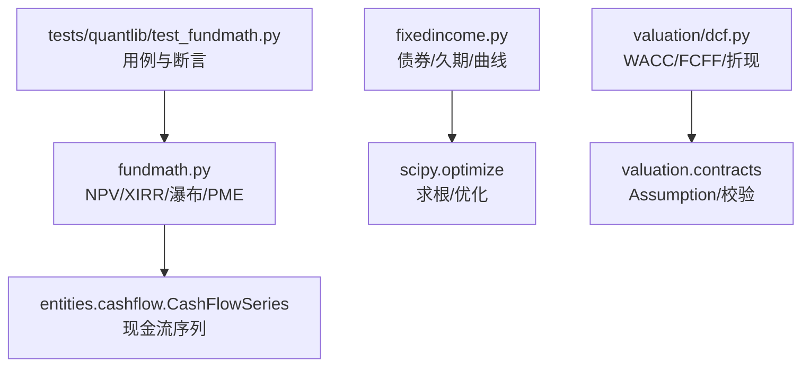
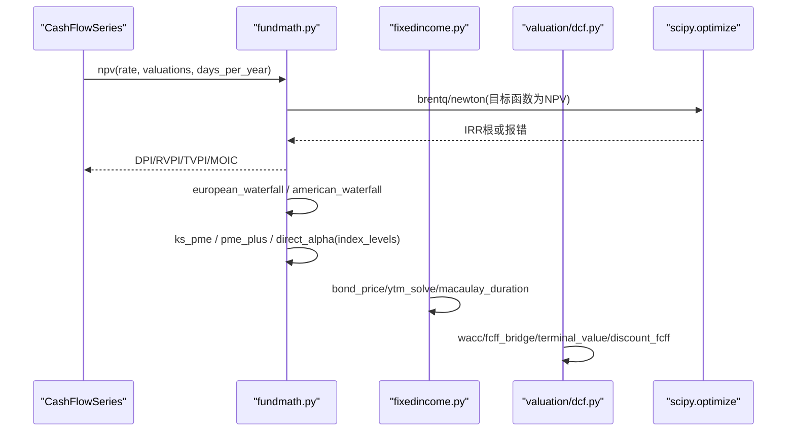
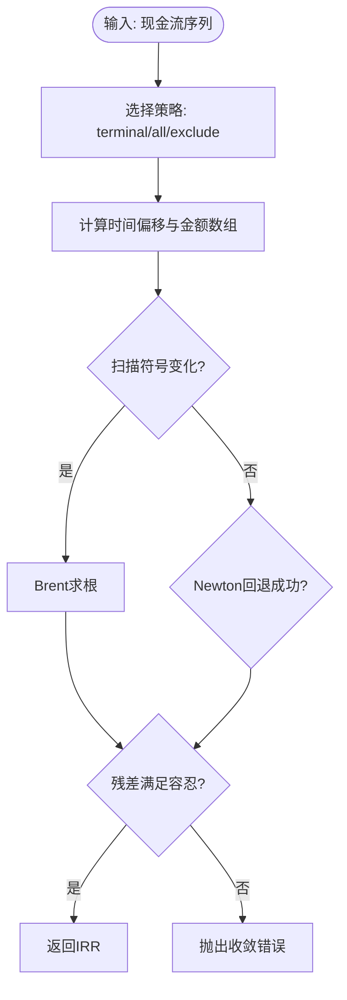
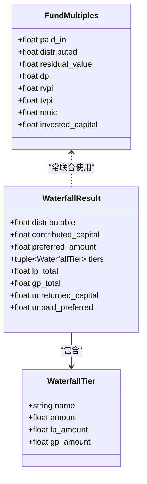
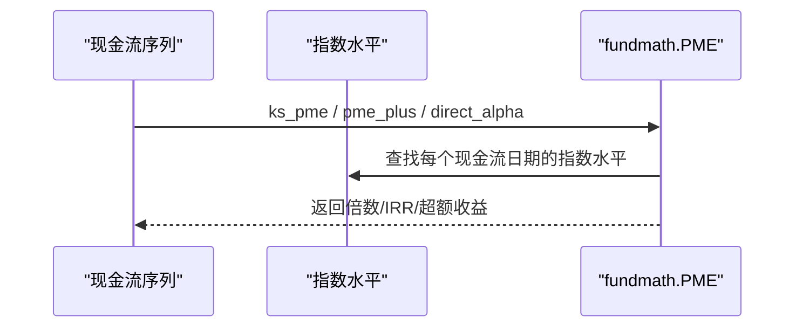
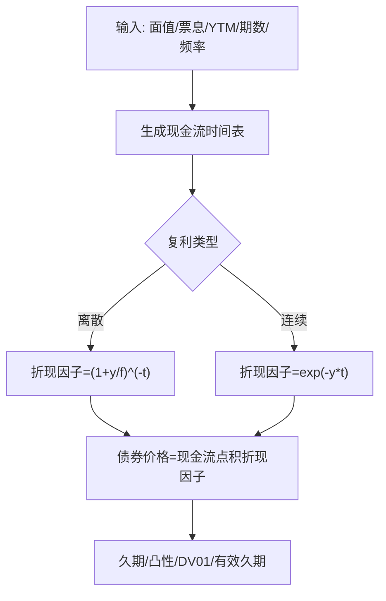
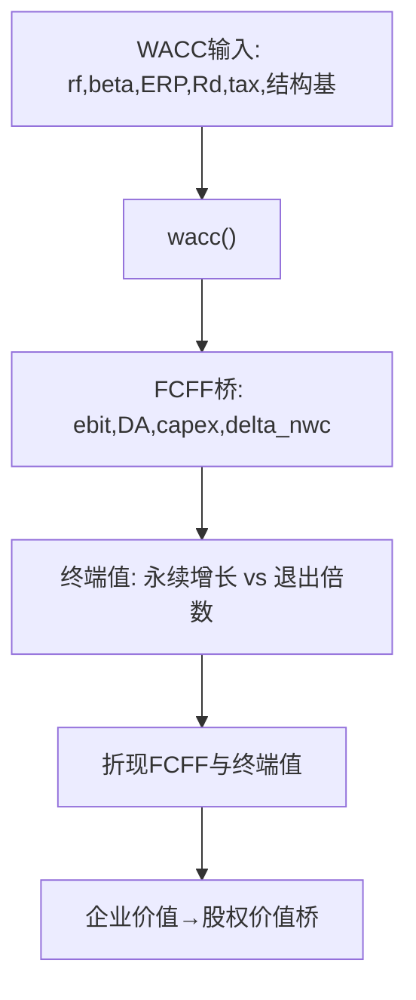
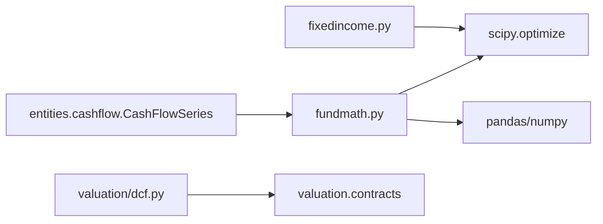

# 基金数学计算

<cite>
**本文引用的文件**
- [fundmath.py](file://agent/src/quantlib/fundmath.py)
- [fixedincome.py](file://agent/src/quantlib/fixedincome.py)
- [dcf.py](file://agent/src/quantlib/valuation/dcf.py)
- [test_fundmath.py](file://agent/tests/quantlib/test_fundmath.py)
</cite>

## 目录
1. [简介](#简介)
2. [项目结构](#项目结构)
3. [核心组件](#核心组件)
4. [架构总览](#架构总览)
5. [详细组件分析](#详细组件分析)
6. [依赖关系分析](#依赖关系分析)
7. [性能与数值稳定性](#性能与数值稳定性)
8. [故障排查指南](#故障排查指南)
9. [结论](#结论)
10. [附录：使用示例与最佳实践](#附录使用示例与最佳实践)

## 简介
本技术文档围绕基金数学计算，系统阐述净现值（NPV）、内部收益率（IRR）与修正内部收益率（MIRR）的算法实现、现金流折现模型、年金现值与终值计算、货币时间价值理论（复利与连续复利）、贷款摊销、债券定价与租赁分析等应用，并给出敏感性分析与情景分析在基金数学中的使用方法。文档基于仓库中量化模块的实现进行解读，所有公式与流程均以代码为依据，避免凭空假设。

## 项目结构
本项目将基金数学与固定收益工具集中在 quantlib 子包中：
- fundmath.py：私募基金的现金流指标、XIRR/NPV、瀑布分配、PME/直接Alpha、美式瀑布与GP追索。
- fixedincome.py：计息基准、应计利息、债券定价、久期/凸性/DV01、收益率曲线拟合（Nelson-Siegel/Svensson）。
- valuation/dcf.py：WACC、FCFF桥、双终值法、折现与企业价值到股权价值的桥接、敏感性网格。
- tests/quantlib/test_fundmath.py：对 XIRR/NPV/瀑布/PME 等的单元测试，验证数值正确性与边界行为。

图表来源
- [fundmath.py:1-88](file://agent/src/quantlib/fundmath.py#L1-L88)
- [fixedincome.py:1-49](file://agent/src/quantlib/fixedincome.py#L1-L49)
- [dcf.py:100-121](file://agent/src/quantlib/valuation/dcf.py#L100-L121)
- [test_fundmath.py:1-57](file://agent/tests/quantlib/test_fundmath.py#L1-L57)

章节来源
- [fundmath.py:1-88](file://agent/src/quantlib/fundmath.py#L1-L88)
- [fixedincome.py:1-49](file://agent/src/quantlib/fixedincome.py#L1-L49)
- [dcf.py:100-121](file://agent/src/quantlib/valuation/dcf.py#L100-L121)
- [test_fundmath.py:1-57](file://agent/tests/quantlib/test_fundmath.py#L1-L57)

## 核心组件
- NPV与XIRR：支持任意日期现金流的折现与求解；提供多根扫描与牛顿回退，严格收敛校验。
- 基金倍数与分配：DPI/RVPI/TVPI/MOIC、欧洲瀑布（优先回报、追赶、分成）、美式瀑布（逐项目）与GP追索。
- 公共市场等效（PME）：KS-PME倍数、PME+可比较IRR、直接Alpha年化超额收益。
- 固定收益：日计数、应计利息、债券价格/YTM、久期/凸性/DV01、有效久期、收益率曲线拟合。
- DCF估值：WACC构建、FCFF桥、双终值法交叉校验、企业价值到股权价值桥、敏感性网格。

章节来源
- [fundmath.py:305-590](file://agent/src/quantlib/fundmath.py#L305-L590)
- [fundmath.py:843-914](file://agent/src/quantlib/fundmath.py#L843-L914)
- [fundmath.py:922-1308](file://agent/src/quantlib/fundmath.py#L922-L1308)
- [fundmath.py:1468-1865](file://agent/src/quantlib/fundmath.py#L1468-L1865)
- [fixedincome.py:70-341](file://agent/src/quantlib/fixedincome.py#L70-L341)
- [dcf.py:344-471](file://agent/src/quantlib/valuation/dcf.py#L344-L471)
- [dcf.py:540-761](file://agent/src/quantlib/valuation/dcf.py#L540-L761)

## 架构总览
下图展示资金流与估值的核心调用链：从现金流序列出发，计算NPV/XIRR，再进入基金倍数与瀑布分配；同时通过PME系列与指数水平对齐评估相对表现；固定收益模块提供债券定价与风险度量；DCF模块提供企业级折现与敏感性分析。

图表来源
- [fundmath.py:305-590](file://agent/src/quantlib/fundmath.py#L305-L590)
- [fundmath.py:1241-1308](file://agent/src/quantlib/fundmath.py#L1241-L1308)
- [fundmath.py:1468-1865](file://agent/src/quantlib/fundmath.py#L1468-L1865)
- [fixedincome.py:266-341](file://agent/src/quantlib/fixedincome.py#L266-L341)
- [dcf.py:344-471](file://agent/src/quantlib/valuation/dcf.py#L344-L471)

## 详细组件分析

### 现金流折现与XIRR算法
- NPV：以最早现金流日期为基准，按实际日历天数折算为年偏移，采用log空间折现因子exp(-t·log1p(r))避免溢出；对r≤-1返回NaN并在上层抛出异常。
- XIRR：先对log(1+r)均匀网格扫描符号变化，用Brent方法闭区间求根；若无根则回退Newton迭代，并以残差容忍度验证；若仍失败抛出收敛错误。
- 多根处理：xirr_all返回所有根，xirr默认取最小根（通常对应经济意义），并提供诊断接口。

图表来源
- [fundmath.py:228-303](file://agent/src/quantlib/fundmath.py#L228-L303)
- [fundmath.py:355-421](file://agent/src/quantlib/fundmath.py#L355-L421)
- [fundmath.py:491-590](file://agent/src/quantlib/fundmath.py#L491-L590)

章节来源
- [fundmath.py:228-303](file://agent/src/quantlib/fundmath.py#L228-L303)
- [fundmath.py:355-421](file://agent/src/quantlib/fundmath.py#L355-L421)
- [fundmath.py:491-590](file://agent/src/quantlib/fundmath.py#L491-L590)
- [test_fundmath.py:74-168](file://agent/tests/quantlib/test_fundmath.py#L74-L168)

### 基金倍数与瀑布分配
- 倍数：paid_in_capital、distributed_capital、residual_value组合得到DPI/RVPI/TVPI/MOIC，保证tvpi=dpi+rvpi恒等。
- 欧洲瀑布：按顺序分配“返还资本→优先回报→GP追赶→利润分成”，参数化carry_rate与catch_up_rate，严格守恒校验。
- 美式瀑布：逐项目独立运行欧洲瀑布，汇总LP/GP总额；结合GP追索比较“已收carry”与“应得carry”。

图表来源
- [fundmath.py:843-914](file://agent/src/quantlib/fundmath.py#L843-L914)
- [fundmath.py:996-1238](file://agent/src/quantlib/fundmath.py#L996-L1238)

章节来源
- [fundmath.py:598-841](file://agent/src/quantlib/fundmath.py#L598-L841)
- [fundmath.py:922-1308](file://agent/src/quantlib/fundmath.py#L922-L1308)
- [fundmath.py:1993-2078](file://agent/src/quantlib/fundmath.py#L1993-L2078)
- [fundmath.py:2200-2331](file://agent/src/quantlib/fundmath.py#L2200-L2331)

### 公共市场等效（PME）与直接Alpha
- KS-PME：将每笔贡献/分配按指数增长因子复利到as_of，计算倍数>1表示跑赢指数。
- PME+：缩放分布使指数跟踪组合最终NAV等于基金真实NAV，再解出可比IRR。
- Direct Alpha：将所有现金流按指数水平平减后直接解IRR，得到年化超额收益。

图表来源
- [fundmath.py:1468-1570](file://agent/src/quantlib/fundmath.py#L1468-L1570)
- [fundmath.py:1597-1766](file://agent/src/quantlib/fundmath.py#L1597-L1766)
- [fundmath.py:1769-1865](file://agent/src/quantlib/fundmath.py#L1769-L1865)

章节来源
- [fundmath.py:1468-1865](file://agent/src/quantlib/fundmath.py#L1468-L1865)

### 固定收益：债券定价、久期与曲线拟合
- 日计数：ACT/365F、ACT/360、ACT/ACT、30/360、30E/360，显式选择影响应计与折现。
- 债券定价：支持离散与连续复利；YTM通过brentq反解；Macaulay/Modified Duration、Convexity、DV01、有效久期。
- 曲线拟合：Nelson-Siegel与Svensson模型，带衰减参数网格搜索与Nelder-Mead精调。

图表来源
- [fixedincome.py:70-185](file://agent/src/quantlib/fixedincome.py#L70-L185)
- [fixedincome.py:188-341](file://agent/src/quantlib/fixedincome.py#L188-L341)
- [fixedincome.py:344-504](file://agent/src/quantlib/fixedincome.py#L344-L504)
- [fixedincome.py:549-795](file://agent/src/quantlib/fixedincome.py#L549-L795)

章节来源
- [fixedincome.py:70-185](file://agent/src/quantlib/fixedincome.py#L70-L185)
- [fixedincome.py:188-341](file://agent/src/quantlib/fixedincome.py#L188-L341)
- [fixedincome.py:344-504](file://agent/src/quantlib/fixedincome.py#L344-L504)
- [fixedincome.py:549-795](file://agent/src/quantlib/fixedincome.py#L549-L795)

### DCF估值：WACC、FCFF桥与双终值法
- WACC：CAPM成本权益+税后债务成本，按当前或目标资本结构加权；权重和必须为1。
- FCFF桥：EBIT→NOPAT→加回折旧摊销→减去CapEx与ΔNWC，逐年输出。
- 双终值：永续增长与退出倍数两种方法并行，互相推导隐含乘数/增长率，拒绝g≥WACC。
- 折现：支持年中/年末折现约定，企业价值到股权价值桥严格非负幅度输入。

图表来源
- [dcf.py:344-471](file://agent/src/quantlib/valuation/dcf.py#L344-L471)
- [dcf.py:540-609](file://agent/src/quantlib/valuation/dcf.py#L540-L609)
- [dcf.py:672-761](file://agent/src/quantlib/valuation/dcf.py#L672-L761)

章节来源
- [dcf.py:344-471](file://agent/src/quantlib/valuation/dcf.py#L344-L471)
- [dcf.py:540-609](file://agent/src/quantlib/valuation/dcf.py#L540-L609)
- [dcf.py:672-761](file://agent/src/quantlib/valuation/dcf.py#L672-L761)

## 依赖关系分析
- 外部库：numpy/pandas用于向量化与数据管理；scipy.optimize用于求根与优化（brentq/newton/minimize）。
- 内部依赖：fundmath依赖entities.cashflow.CashFlowSeries确保日期/币种/种类信息不丢失；DCF依赖valuation.contracts的Assumption强制假设携带依据。
- 耦合与内聚：各模块职责清晰，NPV/XIRR与瀑布/PME在fundmath内高内聚；固定收益与DCF各自成体系，便于复用与测试。

图表来源
- [fundmath.py:31-45](file://agent/src/quantlib/fundmath.py#L31-L45)
- [fixedincome.py:7-15](file://agent/src/quantlib/fixedincome.py#L7-L15)
- [dcf.py:82-98](file://agent/src/quantlib/valuation/dcf.py#L82-L98)

章节来源
- [fundmath.py:31-45](file://agent/src/quantlib/fundmath.py#L31-L45)
- [fixedincome.py:7-15](file://agent/src/quantlib/fixedincome.py#L7-L15)
- [dcf.py:82-98](file://agent/src/quantlib/valuation/dcf.py#L82-L98)

## 性能与数值稳定性
- NPV折现采用log空间计算exp(-t·log1p(r))，避免大r×t导致的幂溢出；对r接近-1时明确抛出异常。
- XIRR网格扫描在log(1+r)空间均匀采样，兼顾近-100%与极高收益率区间的分辨率；Brent方法保证根在括号内收敛。
- 债券定价与久期使用向量化点积与矩阵运算，提升批量计算效率；曲线拟合采用网格+局部优化，提高稳健性。
- DCF中对g≥WACC直接拒绝，避免无穷大或负终值；权重和校验与桥接项非负约束减少隐性错误。

[本节为通用性能讨论，无需特定文件引用]

## 故障排查指南
- XIRR无根或发散：检查现金流是否至少有一次正负号变化；确认days_per_year为正；调整rate_bounds与grid_points；查看xirr_all返回的多根情况。
- NPV溢出：当rate接近-1且期限较长时会溢出，需降低绝对值或缩短期限；检查输入金额与日期是否正确。
- 瀑布分配不守恒：检查contributed_capital、preferred_amount与distributable是否为非负；carry_rate与catch_up_rate范围合法；关注WaterfallResult的__post_init__断言。
- 债券YTM求解失败：检查价格是否在bracket范围内；确认freq与n_periods为正；尝试扩大bracket。
- DCF参数缺失：run_dcf要求完整输入映射；TerminalValueResult拒绝g≥WACC；检查Assumption名称与basis。

章节来源
- [fundmath.py:147-166](file://agent/src/quantlib/fundmath.py#L147-L166)
- [fundmath.py:305-347](file://agent/src/quantlib/fundmath.py#L305-L347)
- [fundmath.py:491-590](file://agent/src/quantlib/fundmath.py#L491-L590)
- [fundmath.py:1167-1238](file://agent/src/quantlib/fundmath.py#L1167-L1238)
- [fixedincome.py:301-341](file://agent/src/quantlib/fixedincome.py#L301-L341)
- [dcf.py:672-761](file://agent/src/quantlib/valuation/dcf.py#L672-L761)

## 结论
该实现提供了严谨、可审计的基金数学与固定收益工具集：
- NPV/XIRR具备强鲁棒性，支持多根与严格收敛校验。
- 瀑布分配与PME系列覆盖私募基金的分配与相对表现评估。
- 固定收益模块提供完整的定价与风险度量能力。
- DCF模块强调假设透明与交叉校验，避免常见估值陷阱。
建议在实际使用中遵循参数显式化、假设可追溯、边界条件校验的原则，并结合敏感性/情景分析评估关键假设的影响。

[本节为总结性内容，无需特定文件引用]

## 附录：使用示例与最佳实践

### 投资决策分析示例（路径参考）
- 计算某项目的NPV与XIRR：构造CashFlowSeries，调用npv与xirr，必要时使用xirr_all查看多根。
  - 参考路径：[fundmath.py:305-590](file://agent/src/quantlib/fundmath.py#L305-L590)
- 评估基金业绩：计算DPI/RVPI/TVPI/MOIC，运行european_waterfall或american_waterfall，结合PME系列与指数水平评估相对表现。
  - 参考路径：[fundmath.py:598-914](file://agent/src/quantlib/fundmath.py#L598-L914)、[fundmath.py:1241-1308](file://agent/src/quantlib/fundmath.py#L1241-L1308)、[fundmath.py:1468-1865](file://agent/src/quantlib/fundmath.py#L1468-L1865)
- 债券定价与风险：给定面值/票息/YTM/期数/频率，计算clean price、dirty price（加应计利息）、久期/凸性/DV01，必要时拟合收益率曲线。
  - 参考路径：[fixedincome.py:143-341](file://agent/src/quantlib/fixedincome.py#L143-L341)、[fixedincome.py:549-795](file://agent/src/quantlib/fixedincome.py#L549-L795)
- DCF估值：构建WACC与FCFF桥，计算双终值并折现，完成企业价值到股权价值桥，输出每股价值。
  - 参考路径：[dcf.py:344-471](file://agent/src/quantlib/valuation/dcf.py#L344-L471)、[dcf.py:540-761](file://agent/src/quantlib/valuation/dcf.py#L540-L761)

### 不同计息频率与税收影响
- 计息频率：fixedincome.py支持离散与连续复利；日计数约定影响应计利息与折现因子。
  - 参考路径：[fixedincome.py:40-56](file://agent/src/quantlib/fixedincome.py#L40-L56)、[fixedincome.py:231-263](file://agent/src/quantlib/fixedincome.py#L231-L263)
- 税收影响：DCF中WACC使用边际税率对债务成本进行税盾；瀑布与追索中可考虑GP税率调整（gp_tax_rate）。
  - 参考路径：[dcf.py:344-471](file://agent/src/quantlib/valuation/dcf.py#L344-L471)、[fundmath.py:2200-2331](file://agent/src/quantlib/fundmath.py#L2200-L2331)

### 敏感性分析与情景分析
- DCF敏感性网格：可通过sensitivity_grid对关键假设（如WACC、终端增长率、退出倍数）进行网格扫描，观察企业价值/每股价值的变化。
  - 参考路径：[dcf.py:100-121](file://agent/src/quantlib/valuation/dcf.py#L100-L121)
- 基金数学情景：调整preferred_rate、carry_rate、catch_up_rate，观察瀑布分配结果与GP追索金额变化；对PME使用不同指数水平或as_of日期进行对比。
  - 参考路径：[fundmath.py:1124-1308](file://agent/src/quantlib/fundmath.py#L1124-L1308)、[fundmath.py:1468-1865](file://agent/src/quantlib/fundmath.py#L1468-L1865)

### 贷款摊销与租赁分析（方法论说明）
- 贷款摊销：可使用fixedincome.py中的annuity思想（等额本息/本金）结合日计数与复利约定，构造每期现金流并折现；或通过ytm_solve反推利率。
  - 参考路径：[fixedincome.py:188-341](file://agent/src/quantlib/fixedincome.py#L188-L341)
- 租赁分析：将租金支付与残值视为现金流序列，使用npv/xirr评估租赁方案的财务影响；结合税收与折现率进行决策。
  - 参考路径：[fundmath.py:305-590](file://agent/src/quantlib/fundmath.py#L305-L590)

[本节为方法论与路径指引，未直接粘贴代码]