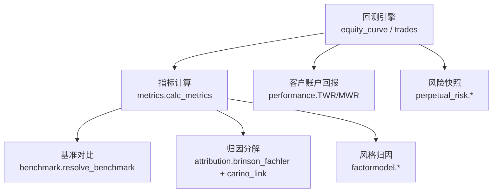
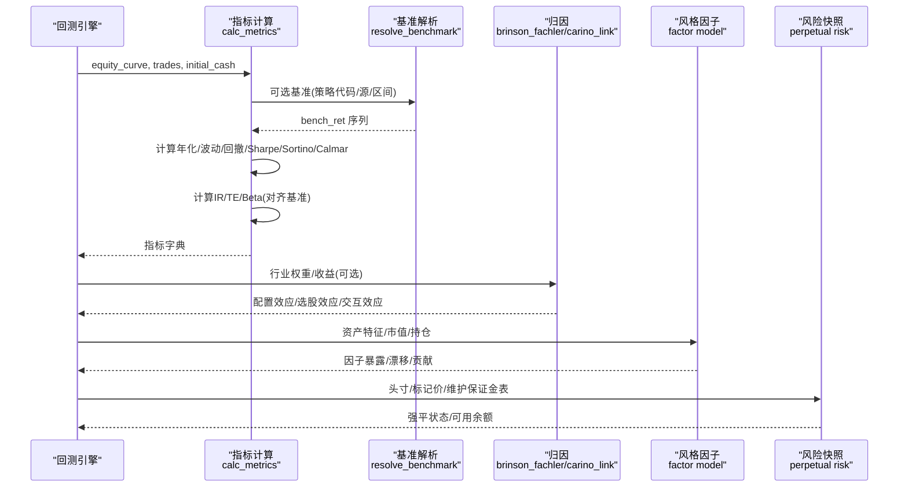
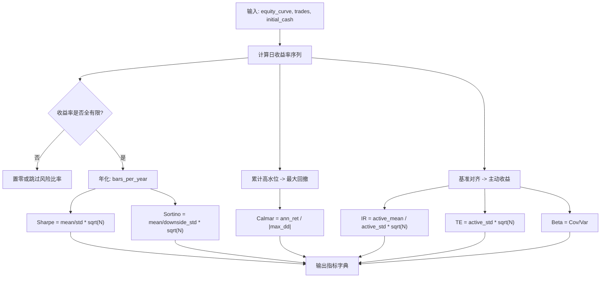
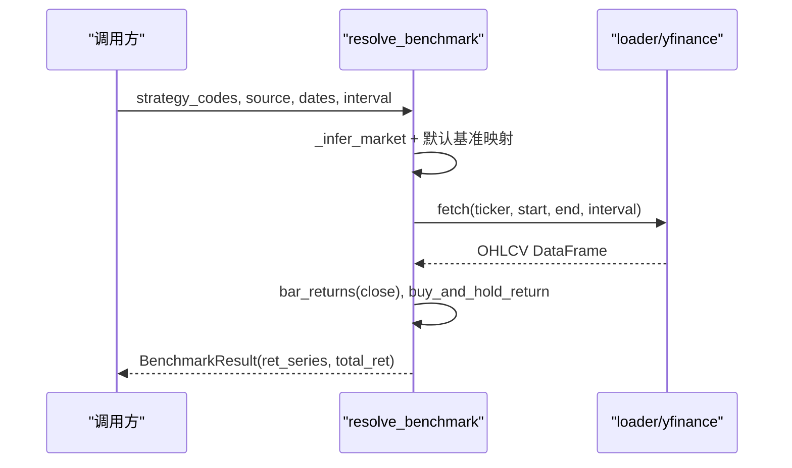
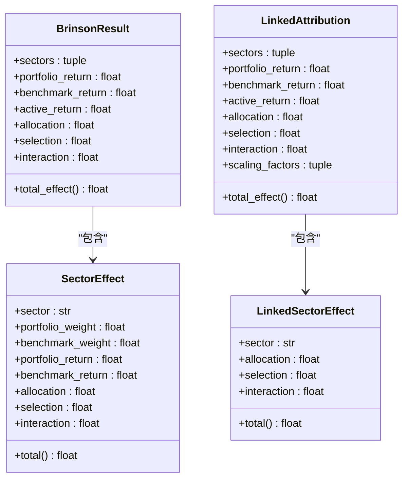
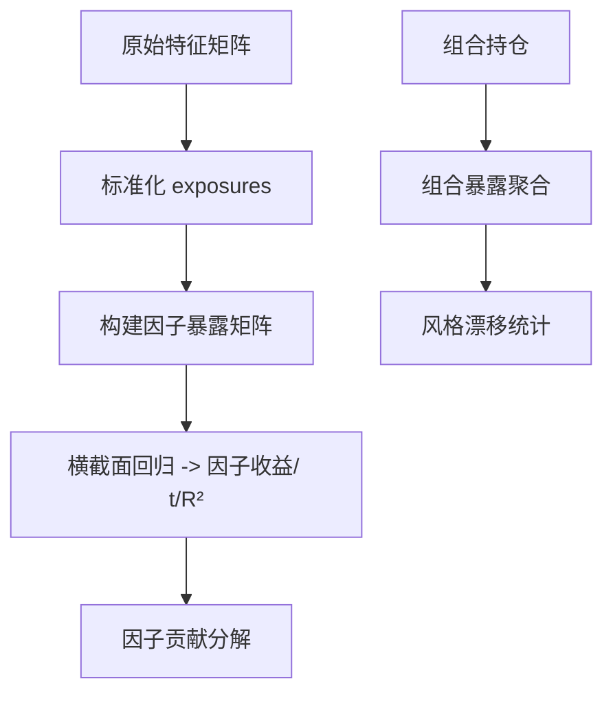
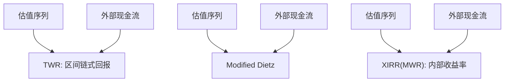
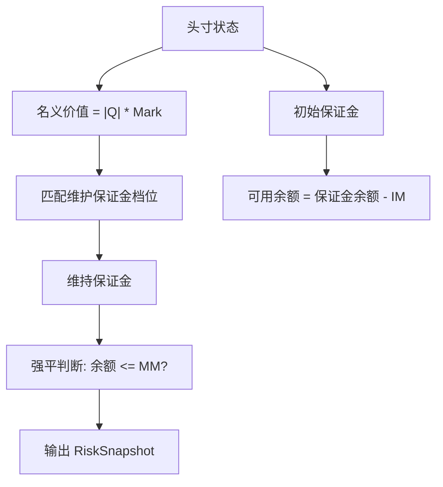
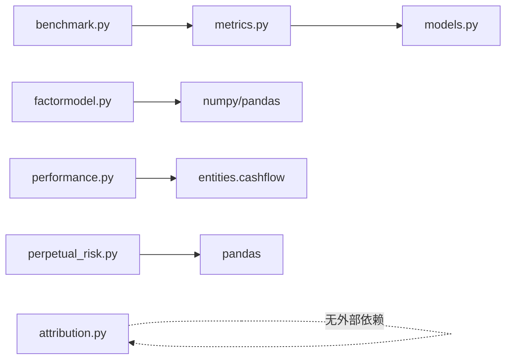

# 投资组合绩效分析

<cite>
**本文引用的文件**
- [agent/backtest/metrics.py](file://agent/backtest/metrics.py)
- [agent/backtest/benchmark.py](file://agent/backtest/benchmark.py)
- [agent/backtest/models.py](file://agent/backtest/models.py)
- [agent/src/quantlib/attribution.py](file://agent/src/quantlib/attribution.py)
- [agent/src/quantlib/factormodel.py](file://agent/src/quantlib/factormodel.py)
- [agent/src/quantlib/performance.py](file://agent/src/quantlib/performance.py)
- [agent/backtest/perpetual_risk.py](file://agent/backtest/perpetual_risk.py)
- [agent/tests/test_metrics.py](file://agent/tests/test_metrics.py)
- [agent/tests/quantlib/test_performance.py](file://agent/tests/quantlib/test_performance.py)
</cite>

## 目录
1. [简介](#简介)
2. [项目结构](#项目结构)
3. [核心组件](#核心组件)
4. [架构总览](#架构总览)
5. [详细组件分析](#详细组件分析)
6. [依赖关系分析](#依赖关系分析)
7. [性能与计算特性](#性能与计算特性)
8. [故障排查指南](#故障排查指南)
9. [结论](#结论)
10. [附录：指标、公式与使用建议](#附录指标公式与使用建议)

## 简介
本技术文档围绕投资组合绩效分析与业绩归因，系统阐述以下主题：
- 收益风险度量：夏普比率、信息比率、特雷诺比率、詹森阿尔法（含统计推断）
- 下行风险度量：最大回撤、索提诺比率、卡尔马比率
- 基准比较与风格归因：Brinson-Fachler 分解、因子暴露与漂移
- 收益率口径：时间加权收益率（TWR）、资金加权收益率（XIRR/MWR）、滚动窗口分析
- 实战落地：基于仓库代码的指标计算流程、数据对齐、异常处理与可复现实例路径

## 项目结构
本项目在回测与量化库中提供了完整的绩效度量与归因能力：
- 回测指标与年化：统一处理多市场、多频率的年化因子与交易成本
- 基准解析：自动选择并拉取基准序列，用于超额收益与信息比率等
- 业绩归因：单期 Brinson-Fachler 与多期 Carino 链接；横截面风格因子模型
- 客户账户口径：TWR、Modified Dietz、XIRR（MWR），严格区分外部现金流
- 永续合约风控快照：保证金、维持保证金、强平状态评估

图表来源
- [agent/backtest/metrics.py:461-626](file://agent/backtest/metrics.py#L461-L626)
- [agent/backtest/benchmark.py:40-102](file://agent/backtest/benchmark.py#L40-L102)
- [agent/src/quantlib/attribution.py:209-413](file://agent/src/quantlib/attribution.py#L209-L413)
- [agent/src/quantlib/factormodel.py:377-594](file://agent/src/quantlib/factormodel.py#L377-L594)
- [agent/src/quantlib/performance.py:162-273](file://agent/src/quantlib/performance.py#L162-L273)
- [agent/backtest/perpetual_risk.py:181-418](file://agent/backtest/perpetual_risk.py#L181-L418)

章节来源
- [agent/backtest/metrics.py:1-641](file://agent/backtest/metrics.py#L1-L641)
- [agent/backtest/benchmark.py:1-208](file://agent/backtest/benchmark.py#L1-L208)
- [agent/src/quantlib/attribution.py:1-413](file://agent/src/quantlib/attribution.py#L1-L413)
- [agent/src/quantlib/factormodel.py:1-516](file://agent/src/quantlib/factormodel.py#L1-L516)
- [agent/src/quantlib/performance.py:1-266](file://agent/src/quantlib/performance.py#L1-L266)
- [agent/backtest/perpetual_risk.py:1-418](file://agent/backtest/perpetual_risk.py#L1-L418)

## 核心组件
- 指标计算中心：提供年化、波动率、最大回撤、Sharpe、Sortino、Calmar、信息比率、跟踪误差、Beta、换手率等
- 基准模块：按市场类型解析默认基准，拉取价格序列并生成每根K线收益率
- 归因模块：Brinson-Fachler 单期分解与 Carino 多期链接，零残差恒等式
- 风格因子模型：横截面标准化、因子暴露构建、因子收益回归、组合暴露聚合与漂移度量
- 客户回报口径：TWR、Modified Dietz、XIRR，严格区分内外部现金流
- 风险快照：逐标的维持保证金、强平判定、账户级可用余额

章节来源
- [agent/backtest/metrics.py:153-171](file://agent/backtest/metrics.py#L153-L171)
- [agent/backtest/metrics.py:461-626](file://agent/backtest/metrics.py#L461-L626)
- [agent/backtest/benchmark.py:22-102](file://agent/backtest/benchmark.py#L22-L102)
- [agent/src/quantlib/attribution.py:72-207](file://agent/src/quantlib/attribution.py#L72-L207)
- [agent/src/quantlib/factormodel.py:115-159](file://agent/src/quantlib/factormodel.py#L115-L159)
- [agent/src/quantlib/performance.py:162-273](file://agent/src/quantlib/performance.py#L162-L273)
- [agent/backtest/perpetual_risk.py:132-179](file://agent/backtest/perpetual_risk.py#L132-L179)

## 架构总览
下图展示从回测输出到最终报告的关键调用链与数据流。

图表来源
- [agent/backtest/metrics.py:461-626](file://agent/backtest/metrics.py#L461-L626)
- [agent/backtest/benchmark.py:40-102](file://agent/backtest/benchmark.py#L40-L102)
- [agent/src/quantlib/attribution.py:209-413](file://agent/src/quantlib/attribution.py#L209-L413)
- [agent/src/quantlib/factormodel.py:377-594](file://agent/src/quantlib/factormodel.py#L377-L594)
- [agent/backtest/perpetual_risk.py:181-418](file://agent/backtest/perpetual_risk.py#L181-L418)

## 详细组件分析

### 指标计算（夏普、索提诺、卡尔马、信息比率、跟踪误差、Beta）
- 年化因子：按数据源与频率映射“年K线数”，支持A股、美股、加密货币、外汇等
- 收益序列：安全处理非正/无穷价格，避免极端百分比收益导致复合爆炸
- 回撤：以初始资金为高水位起点，保证首根K线亏损也能正确反映
- 风险调整收益：
  - Sharpe = 年化均值收益 / 年化波动率
  - Sortino = 年化均值收益 / 下行标准差（仅负收益）
  - Calmar = 年化收益 / |最大回撤|
- 基准对比：
  - 信息比率 IR = 年化主动收益均值 / 年化主动波动
  - 跟踪误差 TE = 主动波动 × sqrt(bars_per_year)
  - Beta = Cov(Rp,Rb)/Var(Rb)

图表来源
- [agent/backtest/metrics.py:245-302](file://agent/backtest/metrics.py#L245-L302)
- [agent/backtest/metrics.py:461-626](file://agent/backtest/metrics.py#L461-L626)

章节来源
- [agent/backtest/metrics.py:153-171](file://agent/backtest/metrics.py#L153-L171)
- [agent/backtest/metrics.py:461-626](file://agent/backtest/metrics.py#L461-L626)
- [agent/tests/test_metrics.py:63-199](file://agent/tests/test_metrics.py#L63-L199)

### 基准比较与解析
- 自动选择基准：根据策略代码模式与数据源推断市场类型，映射到默认基准（如 SPY、恒生中国企业ETF、沪深300、BTC-USDT 等）
- 数据获取：优先使用配置的 loader，失败时回退 yfinance（离线模式禁止网络）
- 收益率构造：采用安全的 bar_returns，并以 buy_and_hold_return 给出总回报

图表来源
- [agent/backtest/benchmark.py:22-102](file://agent/backtest/benchmark.py#L22-L102)
- [agent/backtest/benchmark.py:109-208](file://agent/backtest/benchmark.py#L109-L208)

章节来源
- [agent/backtest/benchmark.py:1-208](file://agent/backtest/benchmark.py#L1-208)

### 业绩归因：Brinson-Fachler 与 Carino 链接
- 单期分解：将主动收益拆分为配置效应（Allocation）、选股效应（Selection）、交互效应（Interaction），三者之和恒等于主动收益
- 多期链接：Carino 对数链接，消除残差，使各期效应缩放后加总等于复合主动收益
- 数据结构：SectorEffect、BrinsonResult、LinkedSectorEffect、LinkedAttribution

图表来源
- [agent/src/quantlib/attribution.py:72-207](file://agent/src/quantlib/attribution.py#L72-L207)

章节来源
- [agent/src/quantlib/attribution.py:209-413](file://agent/src/quantlib/attribution.py#L209-L413)

### 风格归因与因子模型
- 横截面标准化：Winsorise + 市值加权均值 + 等权标准差，得到可比暴露
- 因子暴露构建：由原始特征（规模、价值、成长、动量、质量、低波、杠杆、流动性）合成
- 因子收益估计：每日横截面回归（含市场因子截距），得到 t 统计、R²、残差
- 组合暴露聚合：按持仓加权，支持减去基准得到主动暴露
- 风格漂移：暴露的时间序列均值、标准差、首尾变化、最大绝对变动

图表来源
- [agent/src/quantlib/factormodel.py:240-306](file://agent/src/quantlib/factormodel.py#L240-L306)
- [agent/src/quantlib/factormodel.py:377-476](file://agent/src/quantlib/factormodel.py#L377-L476)
- [agent/src/quantlib/factormodel.py:479-594](file://agent/src/quantlib/factormodel.py#L479-L594)

章节来源
- [agent/src/quantlib/factormodel.py:1-516](file://agent/src/quantlib/factormodel.py#L1-L516)

### 时间加权与资金加权收益率
- TWR：按估值区间链式连接，剔除外部现金流影响，衡量管理技能
- Modified Dietz：近似资金加权，需开仓/平仓与现金流日期
- XIRR（MWR）：以客户视角现金流求解内部收益率，反映真实体验回报
- 严格区分内外部现金流：外部（入金/出金/申购赎回）与内部（分红/利息/费用/买卖价款）

图表来源
- [agent/src/quantlib/performance.py:162-273](file://agent/src/quantlib/performance.py#L162-L273)
- [agent/tests/quantlib/test_performance.py:266-329](file://agent/tests/quantlib/test_performance.py#L266-L329)

章节来源
- [agent/src/quantlib/performance.py:1-266](file://agent/src/quantlib/performance.py#L1-L266)
- [agent/tests/quantlib/test_performance.py:266-329](file://agent/tests/quantlib/test_performance.py#L266-L329)

### 风险快照与下行风险（最大回撤、强平）
- 维护保证金：按名义价值落入不同档位，计算维持保证金
- 强平判定：逐头寸与账户级检查，输出 liquidation_targets
- 最大回撤：在指标计算中已实现，结合高水位与权益曲线

图表来源
- [agent/backtest/perpetual_risk.py:181-191](file://agent/backtest/perpetual_risk.py#L181-L191)
- [agent/backtest/perpetual_risk.py:335-418](file://agent/backtest/perpetual_risk.py#L335-L418)

章节来源
- [agent/backtest/perpetual_risk.py:1-418](file://agent/backtest/perpetual_risk.py#L1-L418)
- [agent/backtest/metrics.py:605-614](file://agent/backtest/metrics.py#L605-L614)

## 依赖关系分析
- metrics 依赖 models（TradeRecord/FillRecord/EquitySnapshot）
- benchmark 依赖 metrics 的安全收益率函数
- attribution 独立，仅依赖标准库，便于在无数值库环境下导入
- factormodel 依赖 numpy/pandas，进行横截面回归与统计
- performance 依赖 entities.cashflow 与 entities.models 做现金流与日期规范化
- perpetual_risk 依赖 pandas 与数据类，提供强一致的风险快照

图表来源
- [agent/backtest/metrics.py:1-15](file://agent/backtest/metrics.py#L1-L15)
- [agent/backtest/benchmark.py:12-16](file://agent/backtest/benchmark.py#L12-L16)
- [agent/src/quantlib/attribution.py:42-60](file://agent/src/quantlib/attribution.py#L42-L60)
- [agent/src/quantlib/factormodel.py:51-72](file://agent/src/quantlib/factormodel.py#L51-L72)
- [agent/src/quantlib/performance.py:65-91](file://agent/src/quantlib/performance.py#L65-L91)
- [agent/backtest/perpetual_risk.py:15-23](file://agent/backtest/perpetual_risk.py#L15-L23)

章节来源
- [agent/backtest/metrics.py:1-15](file://agent/backtest/metrics.py#L1-L15)
- [agent/backtest/benchmark.py:12-16](file://agent/backtest/benchmark.py#L12-L16)
- [agent/src/quantlib/attribution.py:42-60](file://agent/src/quantlib/attribution.py#L42-L60)
- [agent/src/quantlib/factormodel.py:51-72](file://agent/src/quantlib/factormodel.py#L51-L72)
- [agent/src/quantlib/performance.py:65-91](file://agent/src/quantlib/performance.py#L65-L91)
- [agent/backtest/perpetual_risk.py:15-23](file://agent/backtest/perpetual_risk.py#L15-L23)

## 性能与计算特性
- 年化一致性：按数据源与频率精确映射年K线数，避免日内波动被错误放大
- 数值稳健性：对非正/无穷价格、极小样本、溢出等进行保护，返回有限值或零
- 基准对齐：缺失基准数据时填充为零，避免引入偏差
- 归因恒等：Brinson 单期与 Carino 多期均保持零残差恒等，便于审计
- 因子回归：最小观测数、秩检验、异方差加权，保障系数可识别性与稳定性
- 现金流口径：TWR/MWR 分离，避免将客户资金变动误认为管理技能

[本节为通用指导，不直接分析具体文件]

## 故障排查指南
- 收益率异常：若出现 inf/nan，检查 bar_returns 的 prior price 是否为正且有限；确认数据清洗与对齐
- 年化因子错误：核对 calc_bars_per_year 的数据源与频率映射，确保覆盖所有 VALID_SOURCES
- 基准为空：确认 resolve_benchmark 的市场推断与允许的网络访问；离线模式会拒绝网络请求
- 归因不一致：检查 portfolio/benchmark 权重和是否相等（容差范围内），否则 Brinson 恒等不成立
- 因子回归失败：确保至少 MIN_CROSS_SECTION 个资产，设计矩阵满秩，市值权重为正且完整
- 现金流报错：确认外部/内部现金流分类正确，日期不与估值边界冲突

章节来源
- [agent/backtest/metrics.py:245-302](file://agent/backtest/metrics.py#L245-L302)
- [agent/backtest/metrics.py:461-626](file://agent/backtest/metrics.py#L461-L626)
- [agent/backtest/benchmark.py:67-102](file://agent/backtest/benchmark.py#L67-L102)
- [agent/src/quantlib/attribution.py:252-264](file://agent/src/quantlib/attribution.py#L252-L264)
- [agent/src/quantlib/factormodel.py:406-446](file://agent/src/quantlib/factormodel.py#L406-L446)
- [agent/src/quantlib/performance.py:98-149](file://agent/src/quantlib/performance.py#L98-L149)

## 结论
该仓库提供了从回测指标、基准对比、业绩归因到风格因子与现金流口径的一体化能力。其关键优势在于：
- 严谨的年化与对齐机制，适配多市场与多频率
- 零残差的归因恒等与可审计的多期链接
- 横截面因子模型的稳健估计与漂移监控
- 明确区分 TWR 与 MWR，贴合真实客户体验与管理技能评估

这些能力可直接支撑策略评估、归因报告与持续监控。

[本节为总结性内容，不直接分析具体文件]

## 附录：指标、公式与使用建议

- 夏普比率（Sharpe）
  - 公式：年化均值收益 / 年化波动率
  - 实现位置：[agent/backtest/metrics.py:596-603](file://agent/backtest/metrics.py#L596-L603)
  - 注意：小样本保护，非有限收益率置零

- 索提诺比率（Sortino）
  - 公式：年化均值收益 / 下行标准差
  - 实现位置：[agent/backtest/metrics.py:616-624](file://agent/backtest/metrics.py#L616-L624)
  - 注意：仅考虑负收益的标准差

- 卡尔马比率（Calmar）
  - 公式：年化收益 / |最大回撤|
  - 实现位置：[agent/backtest/metrics.py:605-614](file://agent/backtest/metrics.py#L605-L614)
  - 注意：高水位以初始资金为起点

- 信息比率（Information Ratio）
  - 公式：年化主动收益均值 / 年化主动波动
  - 实现位置：[agent/backtest/metrics.py:640-664](file://agent/backtest/metrics.py#L640-L664)
  - 注意：基准对齐与缺失填充

- 跟踪误差（Tracking Error）
  - 公式：主动波动 × sqrt(bars_per_year)
  - 实现位置：[agent/backtest/metrics.py:661-666](file://agent/backtest/metrics.py#L661-L666)

- 特雷诺比率（Treynor）与詹森阿尔法（Jensen Alpha）
  - 概念：以 Beta 为风险尺度（Treynor），以 CAPM 残差（Alpha）衡量超额
  - 相关实现：Beta 已在指标计算中提供；CAPM 回归与 Alpha/t 统计可在事件研究/市场模型工具中参考
  - 参考位置：[agent/tests/quantlib/test_eventstudy.py:40-76](file://agent/tests/quantlib/test_eventstudy.py#L40-L76)

- 最大回撤（Maximum Drawdown）
  - 实现位置：[agent/backtest/metrics.py:605-614](file://agent/backtest/metrics.py#L605-L614)

- 时间加权收益率（TWR）
  - 实现位置：[agent/src/quantlib/performance.py:184-207](file://agent/src/quantlib/performance.py#L184-L207)
  - 测试用例：[agent/tests/quantlib/test_performance.py:266-329](file://agent/tests/quantlib/test_performance.py#L266-L329)

- 资金加权收益率（XIRR/MWR）
  - 实现位置：[agent/src/quantlib/performance.py:238-273](file://agent/src/quantlib/performance.py#L238-L273)

- 滚动窗口分析
  - 建议：对 Sharpe、Alpha、Beta、IR 使用滚动窗口（如 252 日）评估稳定性
  - 参考指引：[agent/src/skills/performance-attribution/SKILL.md:234-244](file://agent/src/skills/performance-attribution/SKILL.md#L234-L244)

- 实际代码示例路径
  - 指标计算入口：[agent/backtest/metrics.py:461-626](file://agent/backtest/metrics.py#L461-L626)
  - 基准解析：[agent/backtest/benchmark.py:40-102](file://agent/backtest/benchmark.py#L40-L102)
  - Brinson 归因：[agent/src/quantlib/attribution.py:209-413](file://agent/src/quantlib/attribution.py#L209-L413)
  - 风格因子：[agent/src/quantlib/factormodel.py:377-594](file://agent/src/quantlib/factormodel.py#L377-L594)
  - 现金流回报：[agent/src/quantlib/performance.py:162-273](file://agent/src/quantlib/performance.py#L162-L273)
  - 风险快照：[agent/backtest/perpetual_risk.py:181-418](file://agent/backtest/perpetual_risk.py#L181-L418)

[本节汇总了指标定义与对应实现位置，便于读者快速定位与复用]