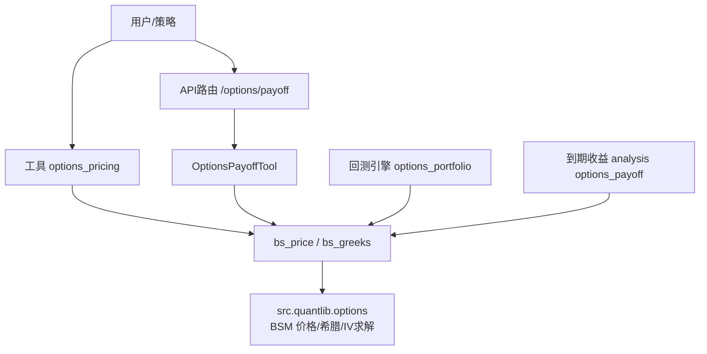
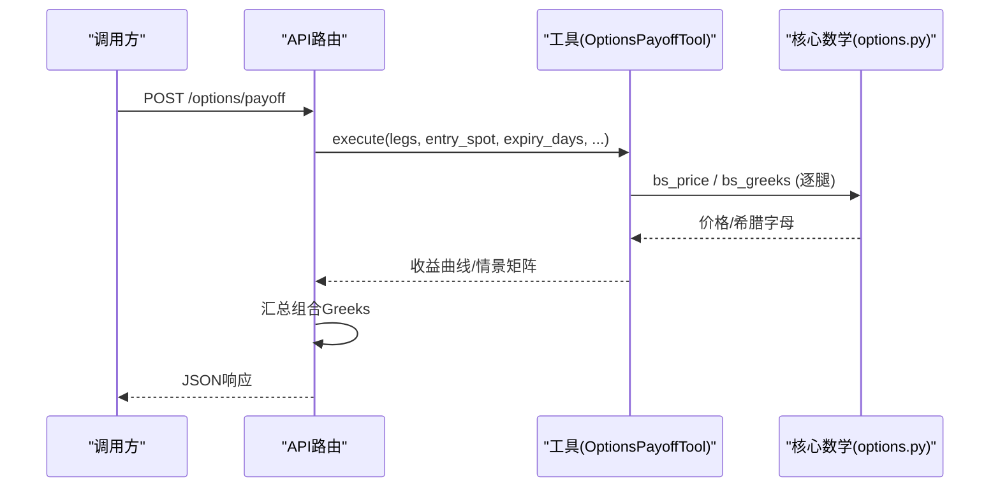
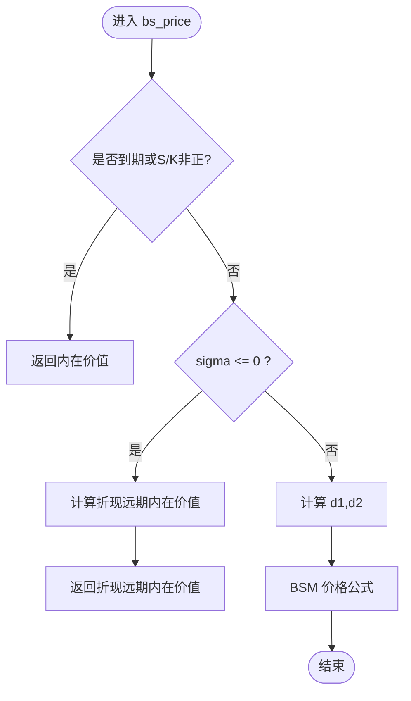
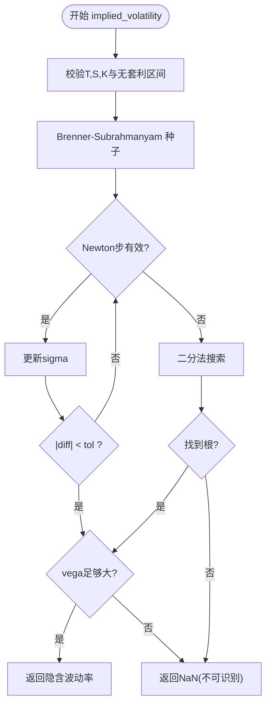
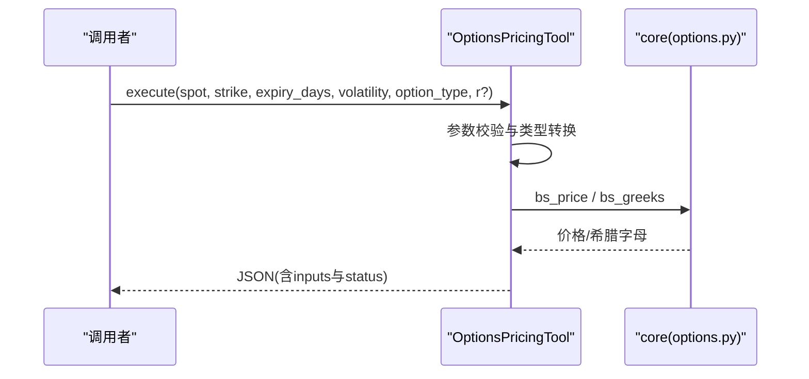
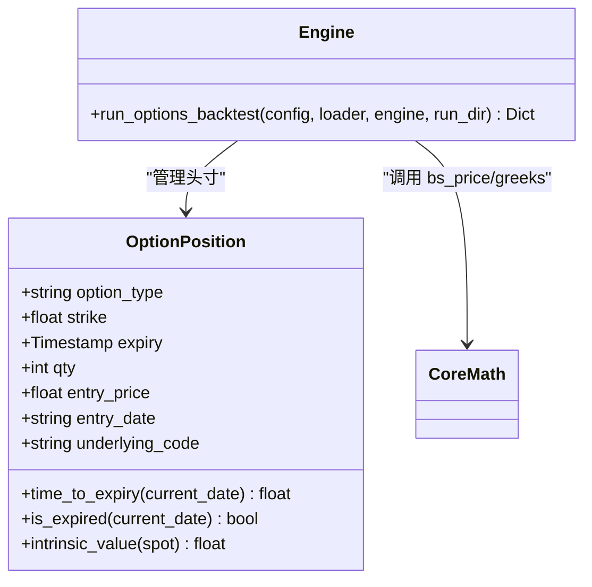
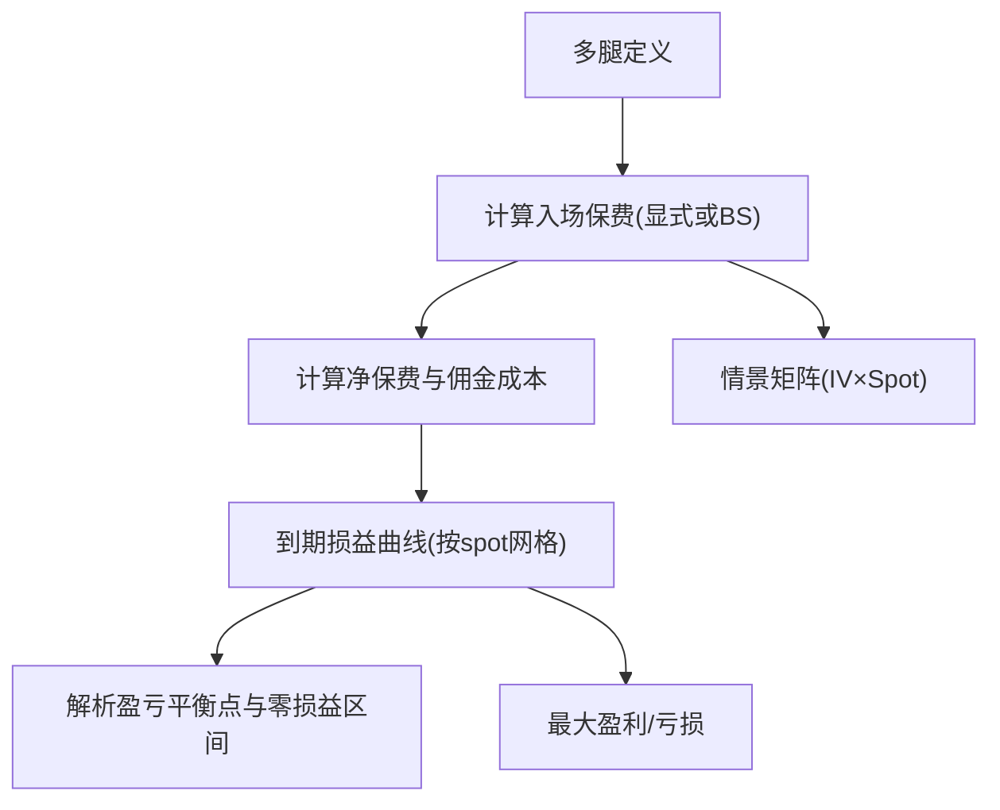
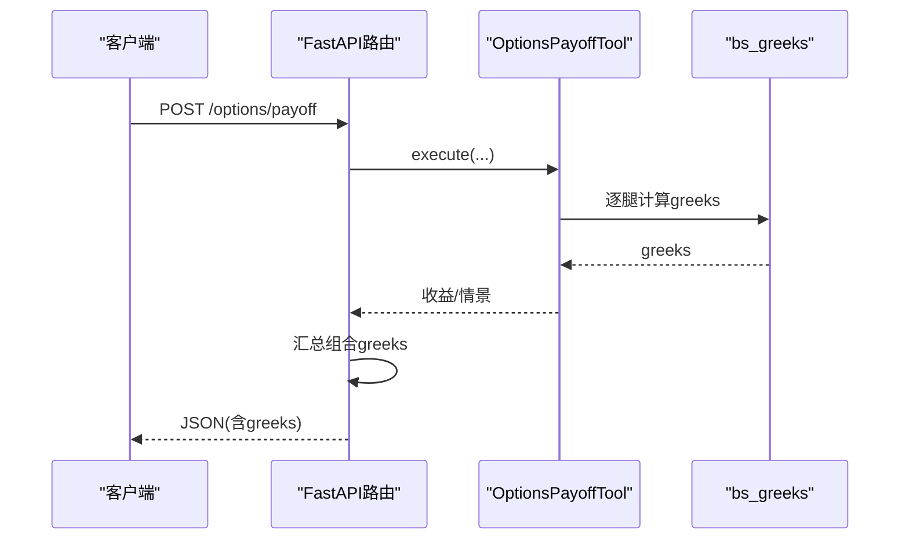
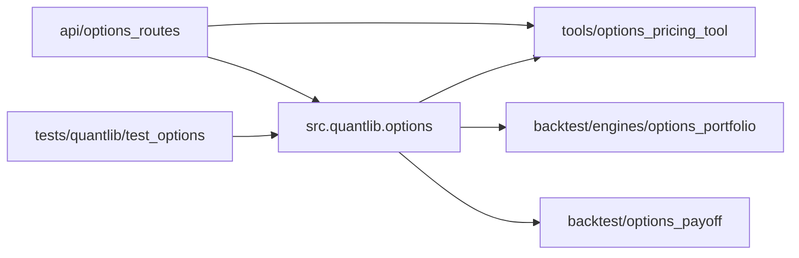

# 期权定价模型

<cite>
**本文引用的文件**
- [agent/src/quantlib/options.py](file://agent/src/quantlib/options.py)
- [agent/tests/quantlib/test_options.py](file://agent/tests/quantlib/test_options.py)
- [agent/src/tools/options_pricing_tool.py](file://agent/src/tools/options_pricing_tool.py)
- [agent/backtest/engines/options_portfolio.py](file://agent/backtest/engines/options_portfolio.py)
- [agent/backtest/options_payoff.py](file://agent/backtest/options_payoff.py)
- [agent/src/api/options_routes.py](file://agent/src/api/options_routes.py)
</cite>

## 目录
1. [简介](#简介)
2. [项目结构](#项目结构)
3. [核心组件](#核心组件)
4. [架构总览](#架构总览)
5. [详细组件分析](#详细组件分析)
6. [依赖关系分析](#依赖关系分析)
7. [性能与数值稳定性](#性能与数值稳定性)
8. [故障排查指南](#故障排查指南)
9. [结论](#结论)
10. [附录：调用示例与最佳实践](#附录调用示例与最佳实践)

## 简介
本技术文档围绕 Black-Scholes-Merton（BSM）欧式期权定价、希腊字母计算（Delta、Gamma、Theta、Vega、Rho）、隐含波动率求解，以及退化输入处理和无套利边界检查进行系统化说明。代码实现位于共享模块中，被回测引擎、工具层和API路由复用，确保全仓一致性与可维护性。同时提供多腿策略的到期收益曲线与情景分析能力，便于风险管理。

## 项目结构
- 核心数学实现：Black-Scholes 价格、希腊字母、隐含波动率求解集中在单一模块，避免重复实现与分歧。
- 工具层：提供面向用户的“期权定价”工具，封装参数校验、单位转换与结果展示。
- 回测引擎：基于历史波动率与波动率微笑调整构建理论价格，支持美式提前行权启发式与组合希腊字母汇总。
- API路由：对外暴露多腿策略到期收益分析与美国期权链查询接口，内部复用工具与核心数学。
- 测试：覆盖参考值、恒等式、有限差分验证、退化输入与边界条件。

图表来源
- [agent/src/api/options_routes.py:192-204](file://agent/src/api/options_routes.py#L192-L204)
- [agent/src/tools/options_pricing_tool.py:95-172](file://agent/src/tools/options_pricing_tool.py#L95-L172)
- [agent/backtest/engines/options_portfolio.py:173-517](file://agent/backtest/engines/options_portfolio.py#L173-L517)
- [agent/backtest/options_payoff.py:274-355](file://agent/backtest/options_payoff.py#L274-L355)
- [agent/src/quantlib/options.py:223-503](file://agent/src/quantlib/options.py#L223-L503)

章节来源
- [agent/src/quantlib/options.py:1-449](file://agent/src/quantlib/options.py#L1-L449)
- [agent/backtest/engines/options_portfolio.py:1-733](file://agent/backtest/engines/options_portfolio.py#L1-L733)
- [agent/backtest/options_payoff.py:1-497](file://agent/backtest/options_payoff.py#L1-L497)
- [agent/src/tools/options_pricing_tool.py:1-172](file://agent/src/tools/options_pricing_tool.py#L1-L172)
- [agent/src/api/options_routes.py:1-236](file://agent/src/api/options_routes.py#L1-L236)
- [agent/tests/quantlib/test_options.py:1-502](file://agent/tests/quantlib/test_options.py#L1-L502)

## 核心组件
- BSM 价格函数：支持欧式看涨/看跌，含股息连续收益率 q；对到期或零波动等退化情形返回内在价值或折现远期内在价值，不抛异常。
- 希腊字母函数：输出 Delta、Gamma、Theta（按日历日）、Vega、Rho（按1%单位），在退化路径下给出合理的极限行为。
- 隐含波动率求解：牛顿法优先，vega过小则回退到二分法；包含无套利区间检查与“不可识别波动率”拒绝逻辑。
- 工具层：统一输入校验、单位换算（天转年）、结果四舍五入与状态标记（正常/退化）。
- 回测引擎：历史波动率+波动率微笑调整，组合 Greeks 汇总，支持美式提前行权启发式。
- 到期收益分析：解析多腿策略的到期损益、盈亏平衡点、最大盈利/亏损及情景矩阵。

章节来源
- [agent/src/quantlib/options.py:223-503](file://agent/src/quantlib/options.py#L223-L503)
- [agent/src/tools/options_pricing_tool.py:13-74](file://agent/src/tools/options_pricing_tool.py#L13-L74)
- [agent/backtest/engines/options_portfolio.py:35-99](file://agent/backtest/engines/options_portfolio.py#L35-L99)
- [agent/backtest/options_payoff.py:274-355](file://agent/backtest/options_payoff.py#L274-L355)

## 架构总览
系统以“单一数学实现 + 多层复用”的方式组织：
- 核心数学模块提供稳定、可验证的 BSM 实现与 IV 求解。
- 工具层负责参数校验、单位转换与展示格式。
- 回测引擎将市场数据转化为理论价格与 Greeks，并聚合组合风险。
- API 路由将工具能力暴露为 HTTP 接口，附加组合 Greeks 汇总。

图表来源
- [agent/src/api/options_routes.py:192-204](file://agent/src/api/options_routes.py#L192-L204)
- [agent/backtest/options_payoff.py:274-355](file://agent/backtest/options_payoff.py#L274-L355)
- [agent/src/quantlib/options.py:223-503](file://agent/src/quantlib/options.py#L223-L503)

## 详细组件分析

### Black-Scholes 价格与希腊字母
- 价格公式：使用标准正态累积分布函数计算欧式看涨/看跌价格；支持连续股息收益率 q。
- 退化输入：
  - 到期或无效标的/行权价：直接返回内在价值。
  - 时间剩余但 sigma<=0：返回折现后的远期内在价值，保证与无套利一致。
- 希腊字母：
  - Delta/Gamma/Theta/Vega/Rho 均按约定单位输出（Theta 按日历日，Vega/Rho 按1%单位）。
  - 到期时 ITM 期权的 Delta 保持单位暴露，避免错误归零。
  - 零波动路径下 Gamma/Vega 为零，Theta/Rho 由折现远期内在价值的敏感性给出。

图表来源
- [agent/src/quantlib/options.py:223-265](file://agent/src/quantlib/options.py#L223-L265)

章节来源
- [agent/src/quantlib/options.py:168-265](file://agent/src/quantlib/options.py#L168-L265)
- [agent/src/quantlib/options.py:268-361](file://agent/src/quantlib/options.py#L268-L361)
- [agent/tests/quantlib/test_options.py:284-379](file://agent/tests/quantlib/test_options.py#L284-L379)

### 隐含波动率求解算法
- 初始猜测：使用 Brenner-Subrahmanyam ATM 近似作为起点。
- 迭代策略：先尝试牛顿法；当 vega 过小（深度实值/虚值或临近到期）时切换到二分法。
- 无套利边界检查：若市场价格低于下限或高于上限，抛出异常。
- 可识别性检验：在候选解处评估 vega，若价格对波动率不敏感（整段波动率带内价格变化小于容差），返回 NaN 表示无法识别波动率。

图表来源
- [agent/src/quantlib/options.py:396-503](file://agent/src/quantlib/options.py#L396-L503)
- [agent/tests/quantlib/test_options.py:167-281](file://agent/tests/quantlib/test_options.py#L167-L281)

章节来源
- [agent/src/quantlib/options.py:364-503](file://agent/src/quantlib/options.py#L364-L503)
- [agent/tests/quantlib/test_options.py:167-281](file://agent/tests/quantlib/test_options.py#L167-L281)

### 工具层：期权定价工具
- 输入校验：要求 spot/strike/expiry_days/volatility/option_type 存在且合法；risk_free_rate 可选。
- 单位转换：expiry_days 转换为 T（年）。
- 结果封装：返回价格与 Greeks，并对数值进行四舍五入；对到期或极端输入标记“degenerate”。

图表来源
- [agent/src/tools/options_pricing_tool.py:13-74](file://agent/src/tools/options_pricing_tool.py#L13-L74)
- [agent/src/tools/options_pricing_tool.py:95-172](file://agent/src/tools/options_pricing_tool.py#L95-L172)

章节来源
- [agent/src/tools/options_pricing_tool.py:1-172](file://agent/src/tools/options_pricing_tool.py#L1-L172)

### 回测引擎：组合定价与 Greeks 汇总
- 波动率来源：历史波动率 + 波动率微笑调整（skew/curvature）。
- 定价与结算：开仓/平仓/到期行权均通过同一 BS 实现；美式提前行权采用启发式比较内在价值与继续持有价值。
- 组合 Greeks：逐腿计算后加权求和，记录每日组合风险暴露。

图表来源
- [agent/backtest/engines/options_portfolio.py:114-177](file://agent/backtest/engines/options_portfolio.py#L114-L177)
- [agent/backtest/engines/options_portfolio.py:173-517](file://agent/backtest/engines/options_portfolio.py#L173-L517)

章节来源
- [agent/backtest/engines/options_portfolio.py:1-733](file://agent/backtest/engines/options_portfolio.py#L1-L733)

### 到期收益与情景分析
- 到期收益：解析多腿策略的线性分段损益，精确计算盈亏平衡点与极值。
- 情景矩阵：在 spot×iv 网格上计算未到期盯市损益，用于压力测试与敏感度分析。

图表来源
- [agent/backtest/options_payoff.py:144-181](file://agent/backtest/options_payoff.py#L144-L181)
- [agent/backtest/options_payoff.py:274-355](file://agent/backtest/options_payoff.py#L274-L355)
- [agent/backtest/options_payoff.py:390-457](file://agent/backtest/options_payoff.py#L390-L457)

章节来源
- [agent/backtest/options_payoff.py:1-497](file://agent/backtest/options_payoff.py#L1-L497)

### API 路由：组合 Greeks 与期权链
- /options/payoff：接收多腿请求，执行收益与情景分析，并在响应中附加组合 Greeks（按 multiplier 放大美元敞口）。
- /options/chain：读取美国上市期权链（Yahoo），限制每侧合约数量，返回标准化字段。

图表来源
- [agent/src/api/options_routes.py:131-154](file://agent/src/api/options_routes.py#L131-L154)
- [agent/src/api/options_routes.py:192-204](file://agent/src/api/options_routes.py#L192-L204)

章节来源
- [agent/src/api/options_routes.py:1-236](file://agent/src/api/options_routes.py#L1-L236)

## 依赖关系分析
- 核心数学模块被多处引用，形成稳定的依赖中心：
  - 工具层：直接调用 bs_price 与 bs_greeks。
  - 回测引擎：导入并使用相同实现，确保定价一致性。
  - 到期收益模块：在需要时使用 bs_price 计算入场保费。
  - API 路由：通过工具间接调用核心数学，并独立汇总组合 Greeks。
- 测试覆盖核心函数的参考值、恒等式与边界条件，确保跨模块一致性。

图表来源
- [agent/src/quantlib/options.py:1-33](file://agent/src/quantlib/options.py#L1-L33)
- [agent/src/tools/options_pricing_tool.py:1-11](file://agent/src/tools/options_pricing_tool.py#L1-L11)
- [agent/backtest/engines/options_portfolio.py:33-33](file://agent/backtest/engines/options_portfolio.py#L33-L33)
- [agent/backtest/options_payoff.py:14-14](file://agent/backtest/options_payoff.py#L14-L14)
- [agent/src/api/options_routes.py:48-50](file://agent/src/api/options_routes.py#L48-L50)
- [agent/tests/quantlib/test_options.py:21-26](file://agent/tests/quantlib/test_options.py#L21-L26)

章节来源
- [agent/src/quantlib/options.py:1-33](file://agent/src/quantlib/options.py#L1-L33)
- [agent/tests/quantlib/test_options.py:397-402](file://agent/tests/quantlib/test_options.py#L397-L402)

## 性能与数值稳定性
- 数值稳定性：
  - 到期或零波动路径避免除零与 log(0)，返回确定性内在价值。
  - 隐含波动率求解在 vega 过小时切换至二分法，防止牛顿发散。
  - 可识别性检查避免在平坦区域返回任意端点。
- 性能特征：
  - 核心数学使用向量化库（numpy/scipy），适合批量计算。
  - 工具层对结果进行四舍五入，减少传输与展示开销。
  - API 路由将网络 I/O 放入线程，避免阻塞事件循环。
- 优化建议：
  - 对大规模情景矩阵，可考虑并行化 iv×spot 网格计算。
  - 对高频报价场景，缓存 d1/d2 与正态分布函数结果。
  - 对接近到期的浅值期权，放宽 tol 或增加 max_iter 以提升收敛鲁棒性。

[本节为通用指导，无需特定文件来源]

## 故障排查指南
- 常见错误与处理：
  - 非法 option_type：抛出 ValueError，需修正为 call/put 或其别名。
  - 非正 T/S/K：隐含波动率求解阶段会抛出异常，需检查输入。
  - 市场价格越界：低于内在价值或高于无套利上限，需检查报价或模型假设。
  - 不可识别波动率：返回 NaN，表明报价对波动率不敏感，应谨慎解读。
  - 到期期权：希腊字母奇异，工具层标记“degenerate”，仅内在价值可靠。
- 调试步骤：
  - 核对单位：T 为年，Theta 按日历日，Vega/Rho 按1%单位。
  - 检查波动率微笑：回测中 leg_iv 可能调整基础 IV，影响定价。
  - 复现最小用例：使用测试中的 Hull 参考值与有限差分验证。

章节来源
- [agent/src/quantlib/options.py:396-503](file://agent/src/quantlib/options.py#L396-L503)
- [agent/src/tools/options_pricing_tool.py:13-40](file://agent/src/tools/options_pricing_tool.py#L13-L40)
- [agent/tests/quantlib/test_options.py:242-281](file://agent/tests/quantlib/test_options.py#L242-L281)

## 结论
本项目以单一、可验证的核心数学实现为基础，提供稳健的 BSM 定价、希腊字母与隐含波动率求解，并通过工具层、回测引擎与 API 路由形成完整的产品能力。退化输入与无套利边界检查确保了数值稳定性与金融合理性。结合到期收益与情景分析，可满足多腿策略的风险管理与压力测试需求。

[本节为总结性内容，无需特定文件来源]

## 附录：调用示例与最佳实践
- 使用 bs_price 进行欧式期权定价：
  - 参数顺序：S, K, T, r, sigma, option_type="call", q=0.0
  - 示例路径：[SKILL.md 中的调用片段:276-291](file://agent/src/skills/options-payoff/SKILL.md#L276-L291)
- 使用 bs_greeks 计算希腊字母：
  - 返回字典包含 delta, gamma, theta, vega, rho
  - 注意单位：theta 按日历日，vega/rho 按1%单位
  - 示例路径：[SKILL.md 中的调用片段:276-291](file://agent/src/skills/options-payoff/SKILL.md#L276-L291)
- 使用 implied_volatility 求解隐含波动率：
  - 参数顺序：market_price, S, K, T, r, option_type="call", q=0.0, tol=1e-6, max_iter=200
  - 示例路径：[SKILL.md 中的调用片段:276-291](file://agent/src/skills/options-payoff/SKILL.md#L276-L291)
- 工具层调用：
  - 通过 OptionsPricingTool.execute 传入 spot, strike, expiry_days, volatility, option_type, risk_free_rate（可选）
  - 返回 JSON 包含 price、greeks 与 inputs，状态标记 ok/degenerate
  - 示例路径：[options_pricing_tool.py:95-172](file://agent/src/tools/options_pricing_tool.py#L95-L172)
- 回测引擎集成：
  - 历史波动率 + 波动率微笑调整，逐腿定价与 Greeks 汇总
  - 示例路径：[options_portfolio.py:173-517](file://agent/backtest/engines/options_portfolio.py#L173-L517)
- 到期收益与情景分析：
  - 多腿策略的到期损益、盈亏平衡点与 spot×iv 情景矩阵
  - 示例路径：[options_payoff.py:274-355](file://agent/backtest/options_payoff.py#L274-L355), [options_payoff.py:390-457](file://agent/backtest/options_payoff.py#L390-L457)
- API 路由：
  - POST /options/payoff：多腿收益与情景分析，附带组合 Greeks
  - GET /options/chain：美国期权链查询
  - 示例路径：[options_routes.py:192-236](file://agent/src/api/options_routes.py#L192-L236)

章节来源
- [agent/src/skills/options-payoff/SKILL.md:276-291](file://agent/src/skills/options-payoff/SKILL.md#L276-L291)
- [agent/src/tools/options_pricing_tool.py:95-172](file://agent/src/tools/options_pricing_tool.py#L95-L172)
- [agent/backtest/engines/options_portfolio.py:173-517](file://agent/backtest/engines/options_portfolio.py#L173-L517)
- [agent/backtest/options_payoff.py:274-355](file://agent/backtest/options_payoff.py#L274-L355)
- [agent/backtest/options_payoff.py:390-457](file://agent/backtest/options_payoff.py#L390-L457)
- [agent/src/api/options_routes.py:192-236](file://agent/src/api/options_routes.py#L192-L236)