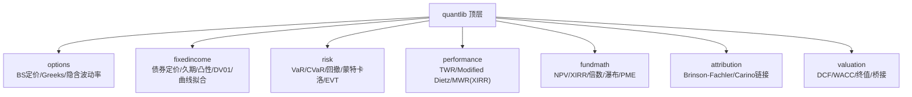
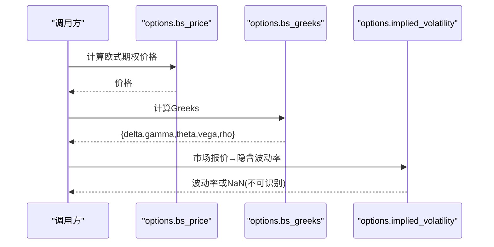
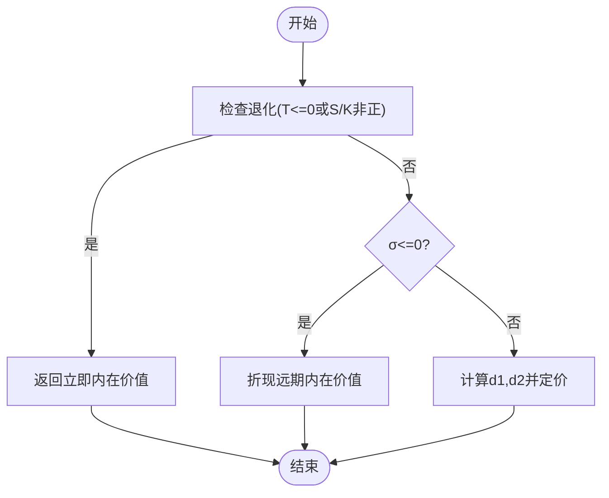
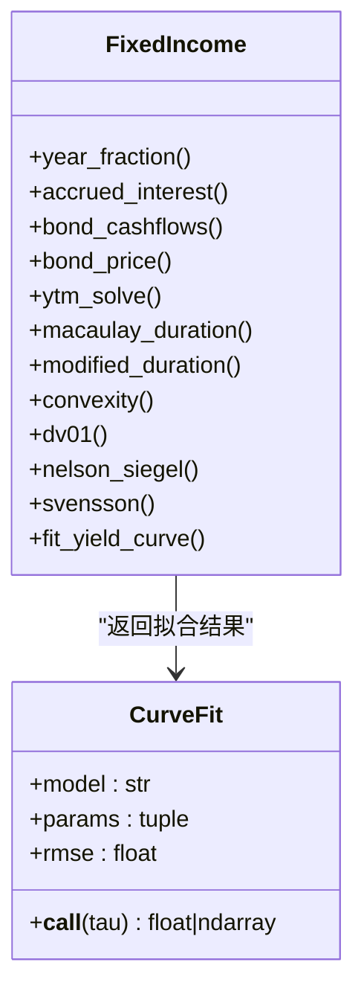
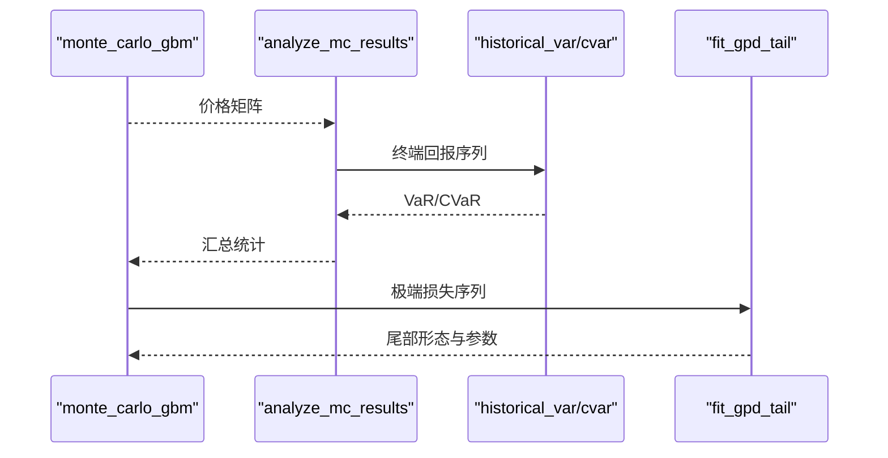
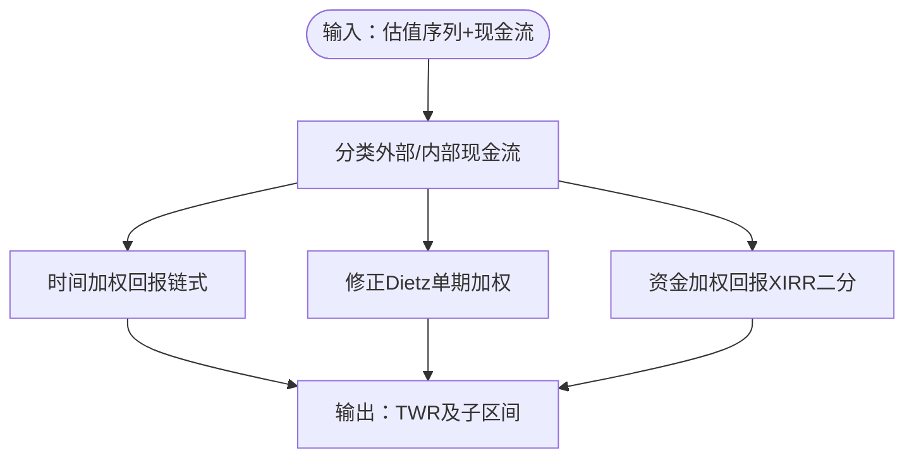
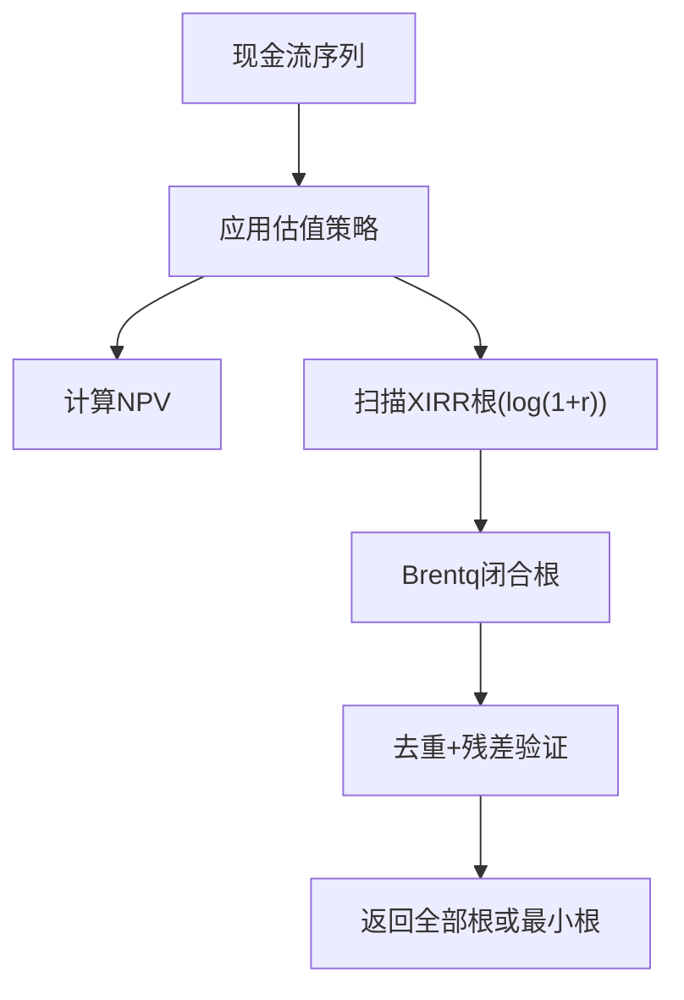
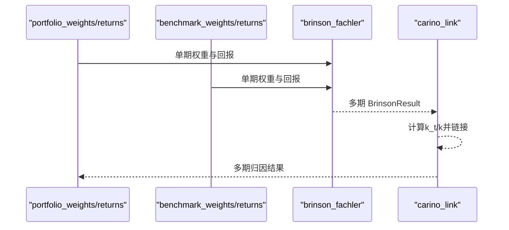
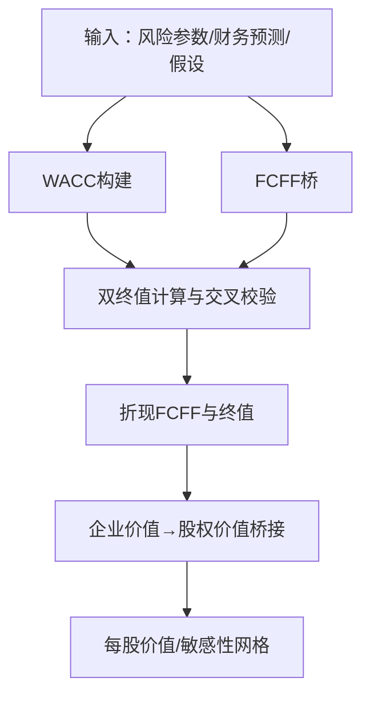
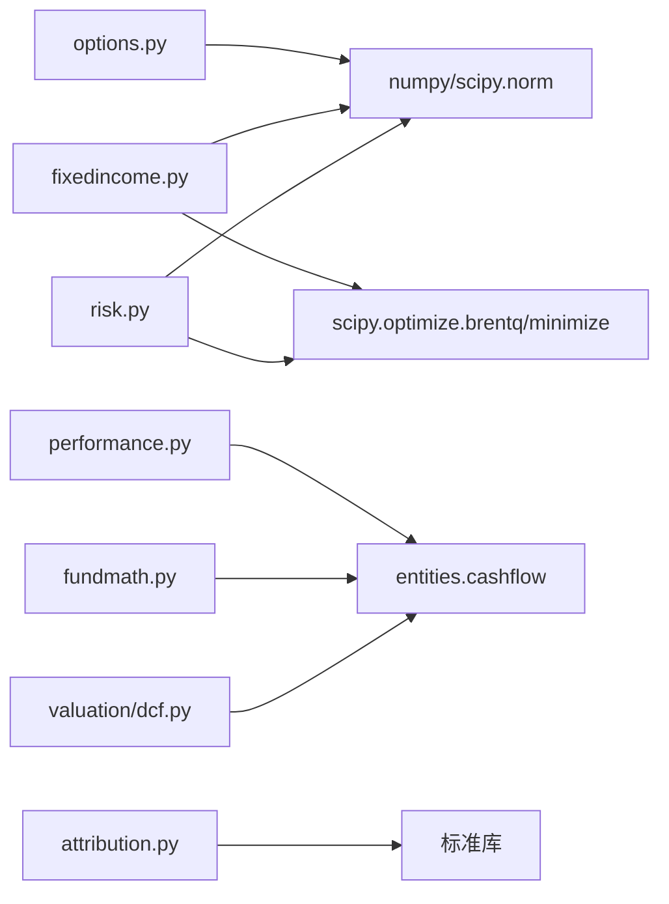

# 量化金融数学库

<cite>
**本文引用的文件**
- [agent/src/quantlib/__init__.py](file://agent/src/quantlib/__init__.py)
- [agent/src/quantlib/options.py](file://agent/src/quantlib/options.py)
- [agent/src/quantlib/fixedincome.py](file://agent/src/quantlib/fixedincome.py)
- [agent/src/quantlib/risk.py](file://agent/src/quantlib/risk.py)
- [agent/src/quantlib/performance.py](file://agent/src/quantlib/performance.py)
- [agent/src/quantlib/fundmath.py](file://agent/src/quantlib/fundmath.py)
- [agent/src/quantlib/attribution.py](file://agent/src/quantlib/attribution.py)
- [agent/src/quantlib/valuation/__init__.py](file://agent/src/quantlib/valuation/__init__.py)
- [agent/src/quantlib/valuation/dcf.py](file://agent/src/quantlib/valuation/dcf.py)
</cite>

## 目录
1. [简介](#简介)
2. [项目结构](#项目结构)
3. [核心组件](#核心组件)
4. [架构总览](#架构总览)
5. [详细组件分析](#详细组件分析)
6. [依赖关系分析](#依赖关系分析)
7. [性能与数值特性](#性能与数值特性)
8. [故障排查指南](#故障排查指南)
9. [结论](#结论)
10. [附录：调用示例路径](#附录调用示例路径)

## 简介
本仓库的量化金融数学库（quantlib）提供可复现、可审计、可测试的金融数学原语，覆盖期权定价与希腊字母、固定收益定价与收益率曲线拟合、风险度量（VaR/CVaR、最大回撤、蒙特卡洛）、投资组合绩效（时间加权回报、修正Dietz、资金加权回报/XIRR）、基金数学（NPV、XIRR、DPI/TVPI/RVPI、瀑布分配）以及估值（DCF/WACC/终值）。所有模块强调输入契约、符号约定与数值稳健性，避免“静默默认”带来的错误传播。

## 项目结构
- quantlib 顶层按领域划分子模块：options、fixedincome、risk、performance、fundmath、attribution、valuation。
- valuation 子包聚焦企业估值：DCF、可比公司、三表联动等。
- 每个模块通过显式 __all__ 暴露接口，便于工具路由与最小化依赖。

**图表来源**
- [agent/src/quantlib/__init__.py:1-38](file://agent/src/quantlib/__init__.py#L1-L38)

**章节来源**
- [agent/src/quantlib/__init__.py:1-38](file://agent/src/quantlib/__init__.py#L1-L38)

## 核心组件
- 期权定价：Black-Scholes-Merton 价格、Greeks、隐含波动率反解，支持股息连续复利与退化情形处理。
- 固定收益：日计数、应计利息、现金流生成、YTM求解、Macaulay/修正久期、凸性、DV01、有效久期；Nelson-Siegel/Svensson 曲线拟合。
- 风险管理：历史/参数 VaR、CVaR、最大回撤分析、几何布朗运动蒙特卡洛、极端事件理论（GPD）尾部拟合。
- 组合绩效：时间加权回报（TWR）、修正Dietz、资金加权回报（XIRR），严格区分外部/内部现金流。
- 基金数学：NPV、XIRR（多根扫描+牛顿回退）、DPI/TVPI/RVPI、MOIC、瀑布分配（优先回报、追赶、分成）、PME+/KS-PME。
- 归因分析：单期 Brinson-Fachler 分解与多期 Carino 对数链接，保证无残差恒等式。
- 估值：WACC 构建、FCFF 桥、双终值（永续增长/退出乘数）交叉校验、折现与股权桥。

**章节来源**
- [agent/src/quantlib/options.py:1-449](file://agent/src/quantlib/options.py#L1-L449)
- [agent/src/quantlib/fixedincome.py:1-795](file://agent/src/quantlib/fixedincome.py#L1-L795)
- [agent/src/quantlib/risk.py:1-512](file://agent/src/quantlib/risk.py#L1-L512)
- [agent/src/quantlib/performance.py:1-800](file://agent/src/quantlib/performance.py#L1-L800)
- [agent/src/quantlib/fundmath.py:1-800](file://agent/src/quantlib/fundmath.py#L1-L800)
- [agent/src/quantlib/attribution.py:1-413](file://agent/src/quantlib/attribution.py#L1-L413)
- [agent/src/quantlib/valuation/dcf.py:1-800](file://agent/src/quantlib/valuation/dcf.py#L1-L800)

## 架构总览
各模块以函数式 API 为主，数据流清晰、耦合低。典型调用链：
- 期权：bs_price → bs_greeks → implied_volatility（Newton + Brentq）
- 固收：bond_cashflows → bond_price/ytm_solve → duration/convexity → fit_yield_curve
- 风险：historical_var/historical_cvar → monte_carlo_gbm → analyze_mc_results → fit_gpd_tail
- 绩效：external_flows → time_weighted_return / modified_dietz_return → xirr
- 基金：npv/xirr_all/xirr → multiples/waterfall → PME+/KS-PME
- 归因：brinson_fachler → carino_link
- 估值：wacc → fcff_bridge → terminal_value → discount_fcff → equity_bridge → run_dcf

**图表来源**
- [agent/src/quantlib/options.py:223-503](file://agent/src/quantlib/options.py#L223-L503)

**章节来源**
- [agent/src/quantlib/options.py:223-503](file://agent/src/quantlib/options.py#L223-L503)

## 详细组件分析

### 期权定价（Black-Scholes-Merton）
- 数学原理
  - 价格：连续复利 r、q，到期 T，波动率 σ，欧式看涨/看跌。
  - Greeks：Δ、Γ、Θ（按日历日）、ν（每1%波动率）、ρ（每1%利率）。
  - 隐含波动率：Newton 初值（Brenner-Subrahmanyam），vega 过小则切换为 Brentq 二分法；对深度实/虚值或临近到期进行“不可识别”判定。
- 实现要点
  - 退化情形：T≤0 或 S/K 非正时返回立即内在价值；σ≤0 且 T>0 时返回折现远期内在价值。
  - 无套利边界检查，防止无解报价进入求解器。
  - Vega 分辨率阈值 SIGMA_RESOLUTION 用于判断报价是否真正“钉住”波动率。
- 参数配置
  - 选项类型别名标准化（call/put/认购/认沽等）。
  - 搜索区间 MIN_SIGMA/MAX_SIGMA、迭代上限 max_iter、容差 tol。
- 收敛性与精度
  - Newton 失败自动回退到 Brentq；对平坦区域返回 NaN 而非错误数字。
- 使用示例（路径）
  - 价格与希腊字母：[agent/src/quantlib/options.py:223-361](file://agent/src/quantlib/options.py#L223-L361)
  - 隐含波动率反解：[agent/src/quantlib/options.py:396-503](file://agent/src/quantlib/options.py#L396-L503)

**图表来源**
- [agent/src/quantlib/options.py:223-265](file://agent/src/quantlib/options.py#L223-L265)

**章节来源**
- [agent/src/quantlib/options.py:1-449](file://agent/src/quantlib/options.py#L1-L449)

### 固定收益（定价、久期、凸性、曲线拟合）
- 数学原理
  - 现金流：票息+本金，离散/连续复利可选。
  - YTM：通过 brentq 在给定区间内求根。
  - 久期：Macaulay 与 Modified（连续复利下相等）。
  - 凸性：二阶敏感度（年平方）。
  - DV01：基点价值，基于修正久期与面值。
  - 有效久期：对称重定价，适用于含权债。
  - 曲线拟合：Nelson-Siegel/Svensson，衰减参数网格搜索 + Nelder-Mead 精炼。
- 实现要点
  - 日计数：ACT/365F、ACT/360、ACT/ACT、30/360、30E/360。
  - 应计利息：精确到结算日。
  - 曲线拟合：线性 β 与非线性 λ 分离，先线性最小二乘再优化 λ。
- 参数配置
  - 复利方式 discrete/continuous。
  - 拟合模型 nelson_siegel/svensson，衰减范围 CURVE_DECAY_BOUNDS，网格点 CURVE_DECAY_GRID。
- 收敛性与精度
  - ytm_solve 使用 bracket；fit_yield_curve 报告 RMSE。
- 使用示例（路径）
  - 定价/YTM/久期/凸性：[agent/src/quantlib/fixedincome.py:266-471](file://agent/src/quantlib/fixedincome.py#L266-L471)
  - 曲线拟合：[agent/src/quantlib/fixedincome.py:549-795](file://agent/src/quantlib/fixedincome.py#L549-L795)

**图表来源**
- [agent/src/quantlib/fixedincome.py:617-795](file://agent/src/quantlib/fixedincome.py#L617-L795)

**章节来源**
- [agent/src/quantlib/fixedincome.py:1-795](file://agent/src/quantlib/fixedincome.py#L1-L795)

### 风险管理（VaR/CVaR、回撤、蒙特卡洛、EVT）
- 数学原理
  - 历史 VaR：排序样本的非插值下分位数。
  - 参数 VaR：正态假设下的解析分位。
  - CVaR：VaR 阈值以下损失的平均值（期望短缺）。
  - 最大回撤：峰值到谷值的负向幅度，定位峰/谷/恢复。
  - 蒙特卡洛：GBM 路径模拟，终端分布统计。
  - EVT：广义帕累托分布（POT）拟合尾部，形状参数分类（fat/bounded/exponential）。
- 实现要点
  - 统一符号：损失为正，回报保持自然符号。
  - 时间缩放：按 sqrt(horizon) 外推。
  - 蒙特卡洛：log-space 步进，避免溢出。
- 参数配置
  - 置信水平 confidence、持有期 horizon、阈值百分比 threshold_pct。
- 收敛性与精度
  - 历史方法直接读取样本；参数方法依赖估计质量；EVT 用标准误阈值判定尾部形态。
- 使用示例（路径）
  - VaR/CVaR/回撤：[agent/src/quantlib/risk.py:142-327](file://agent/src/quantlib/risk.py#L142-L327)
  - 蒙特卡洛与分析：[agent/src/quantlib/risk.py:520-618](file://agent/src/quantlib/risk.py#L520-L618)
  - EVT 尾部拟合：[agent/src/quantlib/risk.py:621-702](file://agent/src/quantlib/risk.py#L621-L702)

**图表来源**
- [agent/src/quantlib/risk.py:520-702](file://agent/src/quantlib/risk.py#L520-L702)

**章节来源**
- [agent/src/quantlib/risk.py:1-512](file://agent/src/quantlib/risk.py#L1-L512)

### 投资组合绩效（TWR、Modified Dietz、XIRR）
- 数学原理
  - TWR：区间回报链式相乘，消除外部资金规模与时点影响。
  - Modified Dietz：单期近似，按资金占用天数加权。
  - XIRR：客户视角现金流的年化内部收益率（实际天/365）。
- 实现要点
  - 严格区分外部/内部现金流，未知类型报错。
  - 资金加权回报采用二分法求解，带上下界扩展与迭代上限保护。
  - TWR 支持 flow_timing 选择（期初/期末归属）。
- 参数配置
  - external_kinds/internal_kinds 自定义分类。
  - DAYS_PER_YEAR=365。
- 收敛性与精度
  - XIRR 二分法保证不发散；接近 -100% 的数值稳定性处理。
- 使用示例（路径）
  - 外部现金流筛选：[agent/src/quantlib/performance.py:352-422](file://agent/src/quantlib/performance.py#L352-L422)
  - TWR：[agent/src/quantlib/performance.py:512-615](file://agent/src/quantlib/performance.py#L512-L615)
  - Modified Dietz：[agent/src/quantlib/performance.py:621-708](file://agent/src/quantlib/performance.py#L621-L708)
  - XIRR（二分求解）：[agent/src/quantlib/performance.py:766-825](file://agent/src/quantlib/performance.py#L766-L825)

**图表来源**
- [agent/src/quantlib/performance.py:345-789](file://agent/src/quantlib/performance.py#L345-L789)

**章节来源**
- [agent/src/quantlib/performance.py:1-800](file://agent/src/quantlib/performance.py#L1-L800)

### 基金数学（NPV、XIRR、倍数、瀑布、PME+）
- 数学原理
  - NPV：按最早日期为基准折现，支持估值标记策略（terminal/all/exclude）。
  - XIRR：对 log(1+r) 均匀采样扫描根，再用 Brentq 闭合；多根时返回全部，xirr 取最小根。
  - 倍数：DPI、RVPI、TVPI、MOIC，严格符号约定与分母校验。
  - 瀑布：Return of Capital → Preferred Return → Catch-up → Carry Split，带优先级与追赶。
  - PME+/KS-PME：与基准比较的相对表现度量。
- 实现要点
  - 强制使用 CashFlowSeries，避免丢失日期/币种/种类信息。
  - 估值标记仅保留最新一次（terminal）或排除（exclude）。
  - 多根去重与残差验证，拒绝无意义根。
- 参数配置
  - days_per_year=365，rate_bounds=(-0.9999, 1e6)，grid_points=512。
- 收敛性与精度
  - 扫描网格在 log(1+r) 空间均匀，兼顾近 -100% 与高利率区域。
- 使用示例（路径）
  - NPV/XIRR：[agent/src/quantlib/fundmath.py:305-591](file://agent/src/quantlib/fundmath.py#L305-L591)
  - 倍数与剩余价值：[agent/src/quantlib/fundmath.py:598-800](file://agent/src/quantlib/fundmath.py#L598-L800)

**图表来源**
- [agent/src/quantlib/fundmath.py:355-591](file://agent/src/quantlib/fundmath.py#L355-L591)

**章节来源**
- [agent/src/quantlib/fundmath.py:1-800](file://agent/src/quantlib/fundmath.py#L1-L800)

### 业绩归因（Brinson-Fachler + Carino 链接）
- 数学原理
  - 单期：配置效应、选择效应、交互效应之和等于主动回报（恒等式）。
  - 多期：Carino 对数链接因子 k_t/k，保证无残差地复合主动回报。
- 实现要点
  - 权重和必须一致（容忍度 DEFAULT_WEIGHT_SUM_TOLERANCE）。
  - 缺失回报按另一侧填充，确保对称性。
  - 当 Rp≈Rb 时使用解析极限避免数值抵消。
- 参数配置
  - weight_sum_tolerance、_CARINO_LIMIT_EPS。
- 使用示例（路径）
  - 单期分解：[agent/src/quantlib/attribution.py:209-311](file://agent/src/quantlib/attribution.py#L209-L311)
  - Carino 链接：[agent/src/quantlib/attribution.py:314-413](file://agent/src/quantlib/attribution.py#L314-L413)

**图表来源**
- [agent/src/quantlib/attribution.py:209-413](file://agent/src/quantlib/attribution.py#L209-L413)

**章节来源**
- [agent/src/quantlib/attribution.py:1-413](file://agent/src/quantlib/attribution.py#L1-L413)

### 估值（DCF/WACC/终值/桥接）
- 数学原理
  - WACC：CAPM 成本权益 + 税后债务成本，按当前或目标资本结构加权。
  - FCFF 桥：EBIT → NOPAT → FCFF（加回折旧摊销、减资本支出与营运资本变动）。
  - 终值：永续增长与退出乘数双方法交叉校验，限制 g < WACC。
  - 折现：年中/年末两种惯例，企业价值到股权价值的桥接。
- 实现要点
  - 所有关键假设以 Assumption 对象传入，携带 basis 说明，禁止裸数值默认。
  - 权重和必须为 1，市场价值非负且总和不为零。
  - 终值双重校验：互推隐含乘数/增长率，超 GDP 参考仅告警。
- 参数配置
  - capital_structure_basis="current"/"target"，discounting_conventions="mid_year"/"year_end"。
- 使用示例（路径）
  - WACC/FCFF/终值/折现：[agent/src/quantlib/valuation/dcf.py:344-800](file://agent/src/quantlib/valuation/dcf.py#L344-L800)

**图表来源**
- [agent/src/quantlib/valuation/dcf.py:344-800](file://agent/src/quantlib/valuation/dcf.py#L344-L800)

**章节来源**
- [agent/src/quantlib/valuation/dcf.py:1-800](file://agent/src/quantlib/valuation/dcf.py#L1-L800)

## 依赖关系分析
- 模块间松耦合：quantlib 顶层仅做领域划分与文档说明，具体算法在各子模块独立实现。
- 外部依赖：numpy/pandas/scipy.stats/scipy.optimize 用于数值计算与优化；entities.cashflow 提供现金流数据结构。
- 工具集成：通过 __all__ 暴露函数，供上层工具/路由按需导入，避免可选依赖破坏其他域。

**图表来源**
- [agent/src/quantlib/options.py:29-33](file://agent/src/quantlib/options.py#L29-L33)
- [agent/src/quantlib/fixedincome.py:9-15](file://agent/src/quantlib/fixedincome.py#L9-L15)
- [agent/src/quantlib/risk.py:37-46](file://agent/src/quantlib/risk.py#L37-L46)
- [agent/src/quantlib/performance.py:67-73](file://agent/src/quantlib/performance.py#L67-L73)
- [agent/src/quantlib/fundmath.py:31-45](file://agent/src/quantlib/fundmath.py#L31-L45)
- [agent/src/quantlib/attribution.py:42-46](file://agent/src/quantlib/attribution.py#L42-L46)
- [agent/src/quantlib/valuation/dcf.py:82-99](file://agent/src/quantlib/valuation/dcf.py#L82-L99)

**章节来源**
- [agent/src/quantlib/options.py:1-449](file://agent/src/quantlib/options.py#L1-L449)
- [agent/src/quantlib/fixedincome.py:1-795](file://agent/src/quantlib/fixedincome.py#L1-L795)
- [agent/src/quantlib/risk.py:1-512](file://agent/src/quantlib/risk.py#L1-L512)
- [agent/src/quantlib/performance.py:1-800](file://agent/src/quantlib/performance.py#L1-L800)
- [agent/src/quantlib/fundmath.py:1-800](file://agent/src/quantlib/fundmath.py#L1-L800)
- [agent/src/quantlib/attribution.py:1-413](file://agent/src/quantlib/attribution.py#L1-L413)
- [agent/src/quantlib/valuation/dcf.py:1-800](file://agent/src/quantlib/valuation/dcf.py#L1-L800)

## 性能与数值特性
- 数值稳定
  - NPV 折现采用 log-space 指数，避免大比率溢出。
  - XIRR 在 log(1+r) 空间均匀采样，兼顾 -100% 附近与高利率区。
  - Carino 因子在 Rp≈Rb 时使用解析极限，避免对数差消去误差。
- 收敛控制
  - 隐含波动率：Newton 失败回退 Brentq；对平坦区域返回 NaN。
  - YTM：brentq 在括号区间内求根，失败明确报错。
  - 曲线拟合：先网格粗搜再 Nelder-Mead 精炼，报告 RMSE。
- 复杂度
  - 期权定价 O(1)；久期/凸性 O(n)（n 为期数）；蒙特卡洛 O(n_paths × n_steps)。
- 精度建议
  - 调整 grid_points、tol、max_iter 平衡速度与精度。
  - 对厚尾资产优先使用历史/CVaR 与 EVT，谨慎使用参数 VaR。

[本节为通用指导，不直接分析具体文件]

## 故障排查指南
- 期权
  - 报价低于内在价值或高于无套利上界：检查报价与参数单位（r/q/T/σ）。
  - 隐含波动率为 NaN：报价处于平坦区或不可识别，需放宽 tol 或更换报价。
  - 参考路径：[agent/src/quantlib/options.py:396-503](file://agent/src/quantlib/options.py#L396-L503)
- 固收
  - YTM 求解失败：扩大 bracket 或检查价格与期限一致性。
  - 曲线拟合 RMSE 偏高：增加 decay 网格点或调整模型（NS vs Svensson）。
  - 参考路径：[agent/src/quantlib/fixedincome.py:301-341](file://agent/src/quantlib/fixedincome.py#L301-L341), [agent/src/quantlib/fixedincome.py:704-795](file://agent/src/quantlib/fixedincome.py#L704-L795)
- 风险
  - VaR/CVaR 输入为空或非有限：清洗数据后重试。
  - 蒙特卡洛路径异常：检查 s0>0、sigma≥0、步长合理。
  - 参考路径：[agent/src/quantlib/risk.py:76-96](file://agent/src/quantlib/risk.py#L76-L96), [agent/src/quantlib/risk.py:520-574](file://agent/src/quantlib/risk.py#L520-L574)
- 绩效
  - XIRR 报 UnsolvableRateError：现金流方向单一或超出搜索范围，检查外部/内部分类。
  - TWR 区间基数非正：账户曾归零或负值，需调整窗口。
  - 参考路径：[agent/src/quantlib/performance.py:766-825](file://agent/src/quantlib/performance.py#L766-L825), [agent/src/quantlib/performance.py:512-615](file://agent/src/quantlib/performance.py#L512-L615)
- 基金数学
  - XIRR 报 NoSignChangeError：全正或全负现金流，检查符号约定（贡献为负、分配为正）。
  - 倍数分母为零：无出资记录，需补充 contribution kinds。
  - 参考路径：[agent/src/quantlib/fundmath.py:424-591](file://agent/src/quantlib/fundmath.py#L424-L591), [agent/src/quantlib/fundmath.py:598-800](file://agent/src/quantlib/fundmath.py#L598-L800)
- 归因
  - 权重和不一致：检查 portfolio/benchmark 权重归一化。
  - 参考路径：[agent/src/quantlib/attribution.py:209-311](file://agent/src/quantlib/attribution.py#L209-L311)
- 估值
  - WACC 权重和不为 1：检查 market/target 权重输入。
  - 终值 g ≥ WACC：降低增长假设或检查 WACC。
  - 参考路径：[agent/src/quantlib/valuation/dcf.py:344-471](file://agent/src/quantlib/valuation/dcf.py#L344-L471), [agent/src/quantlib/valuation/dcf.py:672-761](file://agent/src/quantlib/valuation/dcf.py#L672-L761)

**章节来源**
- [agent/src/quantlib/options.py:396-503](file://agent/src/quantlib/options.py#L396-L503)
- [agent/src/quantlib/fixedincome.py:301-341](file://agent/src/quantlib/fixedincome.py#L301-L341)
- [agent/src/quantlib/fixedincome.py:704-795](file://agent/src/quantlib/fixedincome.py#L704-L795)
- [agent/src/quantlib/risk.py:76-96](file://agent/src/quantlib/risk.py#L76-L96)
- [agent/src/quantlib/risk.py:520-574](file://agent/src/quantlib/risk.py#L520-L574)
- [agent/src/quantlib/performance.py:766-825](file://agent/src/quantlib/performance.py#L766-L825)
- [agent/src/quantlib/performance.py:512-615](file://agent/src/quantlib/performance.py#L512-L615)
- [agent/src/quantlib/fundmath.py:424-591](file://agent/src/quantlib/fundmath.py#L424-L591)
- [agent/src/quantlib/fundmath.py:598-800](file://agent/src/quantlib/fundmath.py#L598-L800)
- [agent/src/quantlib/attribution.py:209-311](file://agent/src/quantlib/attribution.py#L209-L311)
- [agent/src/quantlib/valuation/dcf.py:344-471](file://agent/src/quantlib/valuation/dcf.py#L344-L471)
- [agent/src/quantlib/valuation/dcf.py:672-761](file://agent/src/quantlib/valuation/dcf.py#L672-L761)

## 结论
该量化金融数学库以严谨的输入契约、明确的符号约定与稳健的数值实现为核心，覆盖从衍生品定价到固定收益、风险度量、组合绩效、基金数学与企业估值的完整链条。通过多根扫描、括号求解、对数链接与双终值交叉校验等手段，在保证精度的同时提升鲁棒性。推荐在实际建模中：
- 严格遵循各模块的输入类型与符号约定（如现金流方向、日期与复利方式）。
- 根据数据特征选择合适的模型与方法（厚尾用历史/CVaR/EVT；平滑场景可用参数方法）。
- 关注收敛与精度参数（网格密度、容差、迭代上限），并在报告中披露关键假设与拟合误差。

[本节为总结性内容，不直接分析具体文件]

## 附录：调用示例路径
- 期权定价与希腊字母
  - [agent/src/quantlib/options.py:223-361](file://agent/src/quantlib/options.py#L223-L361)
- 隐含波动率反解
  - [agent/src/quantlib/options.py:396-503](file://agent/src/quantlib/options.py#L396-L503)
- 债券定价与YTM
  - [agent/src/quantlib/fixedincome.py:266-341](file://agent/src/quantlib/fixedincome.py#L266-L341)
- 久期与凸性
  - [agent/src/quantlib/fixedincome.py:344-437](file://agent/src/quantlib/fixedincome.py#L344-L437)
- 收益率曲线拟合
  - [agent/src/quantlib/fixedincome.py:704-795](file://agent/src/quantlib/fixedincome.py#L704-L795)
- VaR/CVaR与回撤
  - [agent/src/quantlib/risk.py:142-327](file://agent/src/quantlib/risk.py#L142-L327)
- 蒙特卡洛与EVT
  - [agent/src/quantlib/risk.py:520-702](file://agent/src/quantlib/risk.py#L520-L702)
- 组合绩效（TWR/Modified Dietz/XIRR）
  - [agent/src/quantlib/performance.py:505-789](file://agent/src/quantlib/performance.py#L505-L789)
- 基金数学（NPV/XIRR/倍数/瀑布）
  - [agent/src/quantlib/fundmath.py:305-800](file://agent/src/quantlib/fundmath.py#L305-L800)
- 归因（Brinson-Fachler/Carino）
  - [agent/src/quantlib/attribution.py:209-413](file://agent/src/quantlib/attribution.py#L209-L413)
- 估值（WACC/FCFF/终值/折现）
  - [agent/src/quantlib/valuation/dcf.py:344-800](file://agent/src/quantlib/valuation/dcf.py#L344-L800)