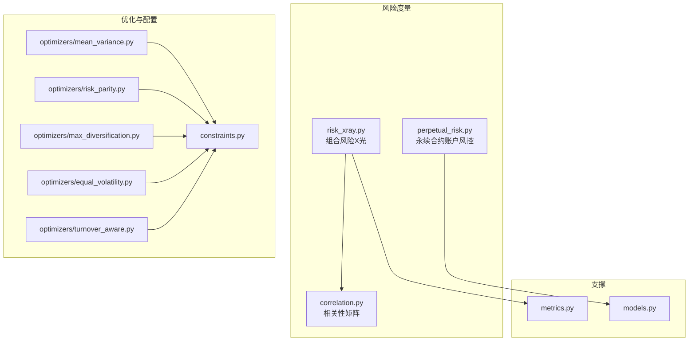
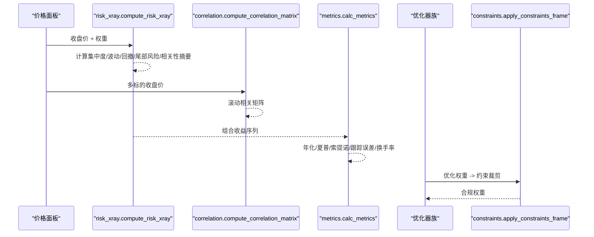
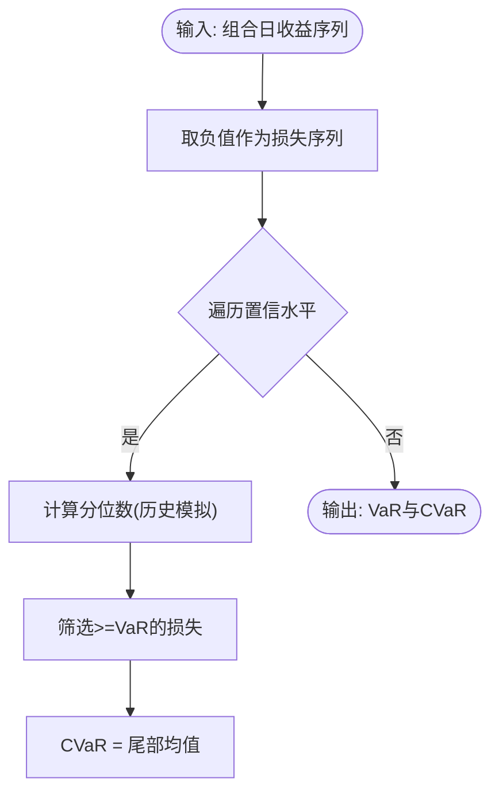
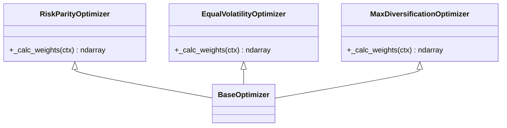
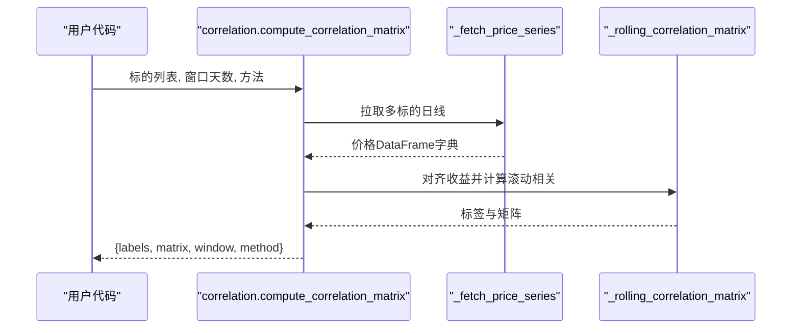
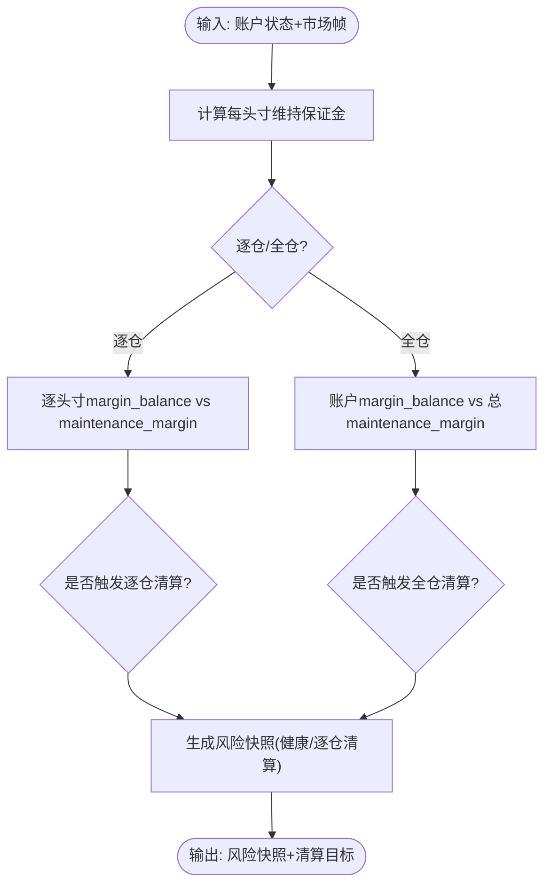
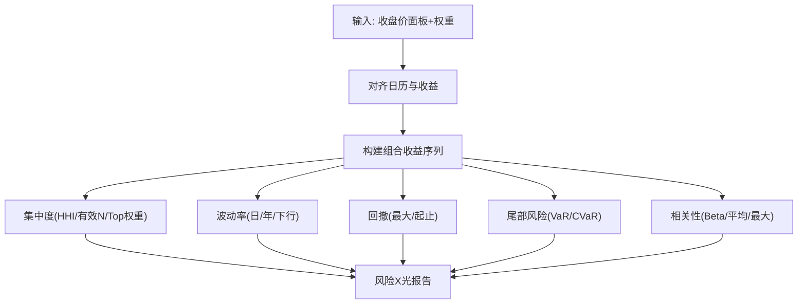
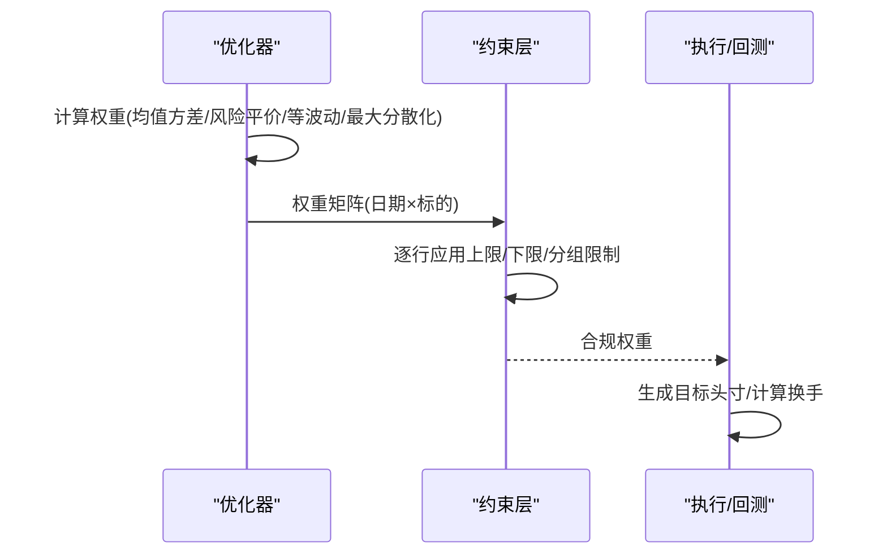
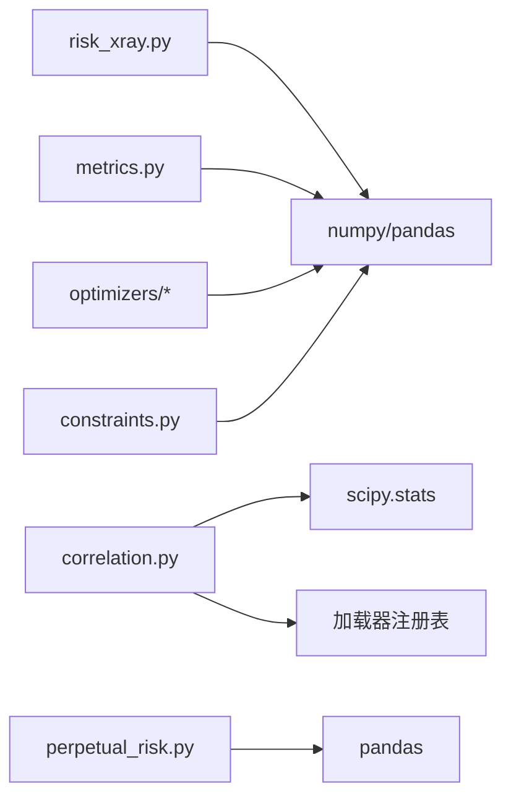

# 风险管理算法

<cite>
**本文引用的文件**
- [perpetual_risk.py](file://agent/backtest/perpetual_risk.py)
- [risk_xray.py](file://agent/backtest/risk_xray.py)
- [correlation.py](file://agent/backtest/correlation.py)
- [metrics.py](file://agent/backtest/metrics.py)
- [models.py](file://agent/backtest/models.py)
- [constraints.py](file://agent/backtest/constraints.py)
- [optimizers/risk_parity.py](file://agent/backtest/optimizers/risk_parity.py)
- [optimizers/mean_variance.py](file://agent/backtest/optimizers/mean_variance.py)
- [optimizers/max_diversification.py](file://agent/backtest/optimizers/max_diversification.py)
- [optimizers/equal_volatility.py](file://agent/backtest/optimizers/equal_volatility.py)
- [optimizers/turnover_aware.py](file://agent/backtest/optimizers/turnover_aware.py)
</cite>

## 目录
1. [简介](#简介)
2. [项目结构](#项目结构)
3. [核心组件](#核心组件)
4. [架构总览](#架构总览)
5. [详细组件分析](#详细组件分析)
6. [依赖关系分析](#依赖关系分析)
7. [性能考量](#性能考量)
8. [故障排查指南](#故障排查指南)
9. [结论](#结论)
10. [附录](#附录)

## 简介
本技术文档围绕仓库中的风险管理能力，系统化阐述价值风险（VaR）、条件风险价值（CVaR/预期短缺）、风险预算与归因、相关性建模与尾部依赖、压力测试与极端事件建模、回测验证与模型验证、以及风险控制阈值的设置方法。文档以代码为依据，给出可追溯的模块职责、数据流与关键流程，并提供可视化图示帮助理解。

## 项目结构
风险管理相关能力主要分布在以下模块：
- 组合风险透视与尾部风险：risk_xray.py
- 永续合约账户级风控与保证金清算：perpetual_risk.py
- 跨资产相关性矩阵：correlation.py
- 绩效与交易统计指标：metrics.py
- 回测通用数据模型：models.py
- 权重约束层：constraints.py
- 优化器族（均值方差、风险平价、最大分散化、等波动率、换手率感知）：optimizers/*

图表来源
- [risk_xray.py:86-176](file://agent/backtest/risk_xray.py#L86-L176)
- [perpetual_risk.py:181-418](file://agent/backtest/perpetual_risk.py#L181-L418)
- [correlation.py:135-213](file://agent/backtest/correlation.py#L135-L213)
- [metrics.py:461-626](file://agent/backtest/metrics.py#L461-L626)
- [models.py:13-118](file://agent/backtest/models.py#L13-L118)
- [constraints.py:48-129](file://agent/backtest/constraints.py#L48-L129)
- [optimizers/mean_variance.py:11-56](file://agent/backtest/optimizers/mean_variance.py#L11-L56)
- [optimizers/risk_parity.py:11-49](file://agent/backtest/optimizers/risk_parity.py#L11-L49)
- [optimizers/max_diversification.py:15-48](file://agent/backtest/optimizers/max_diversification.py#L15-L48)
- [optimizers/equal_volatility.py:14-37](file://agent/backtest/optimizers/equal_volatility.py#L14-L37)
- [optimizers/turnover_aware.py:38-218](file://agent/backtest/optimizers/turnover_aware.py#L38-L218)

章节来源
- [risk_xray.py:86-176](file://agent/backtest/risk_xray.py#L86-L176)
- [perpetual_risk.py:181-418](file://agent/backtest/perpetual_risk.py#L181-L418)
- [correlation.py:135-213](file://agent/backtest/correlation.py#L135-L213)
- [metrics.py:461-626](file://agent/backtest/metrics.py#L461-L626)
- [models.py:13-118](file://agent/backtest/models.py#L13-L118)
- [constraints.py:48-129](file://agent/backtest/constraints.py#L48-L129)
- [optimizers/mean_variance.py:11-56](file://agent/backtest/optimizers/mean_variance.py#L11-L56)
- [optimizers/risk_parity.py:11-49](file://agent/backtest/optimizers/risk_parity.py#L11-L49)
- [optimizers/max_diversification.py:15-48](file://agent/backtest/optimizers/max_diversification.py#L15-L48)
- [optimizers/equal_volatility.py:14-37](file://agent/backtest/optimizers/equal_volatility.py#L14-L37)
- [optimizers/turnover_aware.py:38-218](file://agent/backtest/optimizers/turnover_aware.py#L38-L218)

## 核心组件
- 组合风险X光（risk_xray.py）
  - 输入：收盘价面板与多头权重；输出：集中度、波动率、回撤、尾部风险（历史VaR/CVaR）、分散化比率、相关性摘要。
  - 关键特性：仅使用历史收益进行非参数估计；严格JSON安全输出；对缺失值与短序列做保护。
- 永续合约账户风控（perpetual_risk.py）
  - 维护保证金阶梯、逐仓/全仓模式、标记价与资金费率处理；计算逐仓与全仓清算状态与目标。
- 相关性矩阵（correlation.py）
  - 支持Pearson/Spearman滚动相关；自动推断市场并规范化符号；多源加载器回退链获取日线数据。
- 指标与统计（metrics.py）
  - 年化因子映射、收益构造、夏普/索提诺/卡玛/跟踪误差/信息比率/换手率等；提供空数据兜底。
- 数据模型（models.py）
  - 头寸、成交记录、交易记录、权益快照等不可变数据结构，贯穿引擎与风控。
- 权重约束（constraints.py）
  - 单名上限/下限、分组暴露上限；在任意优化器输出上按行应用，保持正负号。
- 优化器族（optimizers/*）
  - 均值方差（最大化夏普）、风险平价（边际风险贡献均分）、最大分散化、等波动率、换手率感知（含组/名约束）。

章节来源
- [risk_xray.py:86-176](file://agent/backtest/risk_xray.py#L86-L176)
- [perpetual_risk.py:181-418](file://agent/backtest/perpetual_risk.py#L181-L418)
- [correlation.py:135-213](file://agent/backtest/correlation.py#L135-L213)
- [metrics.py:461-626](file://agent/backtest/metrics.py#L461-L626)
- [models.py:13-118](file://agent/backtest/models.py#L13-L118)
- [constraints.py:48-129](file://agent/backtest/constraints.py#L48-L129)
- [optimizers/mean_variance.py:11-56](file://agent/backtest/optimizers/mean_variance.py#L11-L56)
- [optimizers/risk_parity.py:11-49](file://agent/backtest/optimizers/risk_parity.py#L11-L49)
- [optimizers/max_diversification.py:15-48](file://agent/backtest/optimizers/max_diversification.py#L15-L48)
- [optimizers/equal_volatility.py:14-37](file://agent/backtest/optimizers/equal_volatility.py#L14-L37)
- [optimizers/turnover_aware.py:38-218](file://agent/backtest/optimizers/turnover_aware.py#L38-L218)

## 架构总览
下图展示从价格数据到风险度量、再到优化与约束的整体数据流。

图表来源
- [risk_xray.py:86-176](file://agent/backtest/risk_xray.py#L86-L176)
- [correlation.py:285-319](file://agent/backtest/correlation.py#L285-L319)
- [metrics.py:461-626](file://agent/backtest/metrics.py#L461-L626)
- [constraints.py:180-206](file://agent/backtest/constraints.py#L180-L206)
- [optimizers/mean_variance.py:11-56](file://agent/backtest/optimizers/mean_variance.py#L11-L56)
- [optimizers/risk_parity.py:11-49](file://agent/backtest/optimizers/risk_parity.py#L11-L49)
- [optimizers/max_diversification.py:15-48](file://agent/backtest/optimizers/max_diversification.py#L15-L48)
- [optimizers/equal_volatility.py:14-37](file://agent/backtest/optimizers/equal_volatility.py#L14-L37)
- [optimizers/turnover_aware.py:38-218](file://agent/backtest/optimizers/turnover_aware.py#L38-L218)

## 详细组件分析

### 价值风险（VaR）与条件风险价值（CVaR/预期短缺）
- 历史模拟法（本项目实现）
  - 基于组合日收益序列的非参数分位数估计；对每个置信水平计算VaR，并对超过VaR的损失求均值得到CVaR。
  - 参考路径：[risk_xray._tail_risk:241-255](file://agent/backtest/risk_xray.py#L241-L255)
- 方差-协方差法（概念说明）
  - 假设收益服从正态分布，利用组合均值与方差解析计算VaR；适用于薄尾且线性组合场景。
  - 本项目未直接实现该分支，但可通过组合方差与标准差近似估算。
- 蒙特卡洛模拟（概念说明）
  - 通过随机抽样生成大量情景收益路径，统计尾部损失分布以估计VaR/CVaR；适合非线性与厚尾资产。
  - 本项目未直接实现该分支，可作为扩展方向。

图表来源
- [risk_xray.py:241-255](file://agent/backtest/risk_xray.py#L241-L255)

章节来源
- [risk_xray.py:241-255](file://agent/backtest/risk_xray.py#L241-L255)

### 风险预算分配与风险平价
- 风险平价（Risk Parity）
  - 目标：使各资产的边际风险贡献相等；通过优化求解，初始种子为反波动率权重。
  - 参考路径：[optimizers/risk_parity.RiskParityOptimizer._calc_weights:14-49](file://agent/backtest/optimizers/risk_parity.py#L14-L49)
- 其他风险预算思路
  - 等波动率权重：使各资产对组合波动贡献相近。
  - 最大分散化：最大化分散化比率，降低集中风险。
  - 参考路径：
    - [optimizers/equal_volatility.EqualVolatilityOptimizer._calc_weights:34-37](file://agent/backtest/optimizers/equal_volatility.py#L34-L37)
    - [optimizers/max_diversification.MaxDiversificationOptimizer._calc_weights:18-48](file://agent/backtest/optimizers/max_diversification.py#L18-L48)

图表来源
- [optimizers/risk_parity.py:11-49](file://agent/backtest/optimizers/risk_parity.py#L11-L49)
- [optimizers/equal_volatility.py:14-37](file://agent/backtest/optimizers/equal_volatility.py#L14-L37)
- [optimizers/max_diversification.py:15-48](file://agent/backtest/optimizers/max_diversification.py#L15-L48)

章节来源
- [optimizers/risk_parity.py:11-49](file://agent/backtest/optimizers/risk_parity.py#L11-L49)
- [optimizers/equal_volatility.py:14-37](file://agent/backtest/optimizers/equal_volatility.py#L14-L37)
- [optimizers/max_diversification.py:15-48](file://agent/backtest/optimizers/max_diversification.py#L15-L48)

### 相关性建模、尾部依赖与系统性风险
- 相关性矩阵
  - 支持Pearson与Spearman；滚动窗口对齐多资产收益；自动推断市场与符号规范化；多加载器回退链获取数据。
  - 参考路径：
    - [correlation._rolling_correlation_matrix:135-213](file://agent/backtest/correlation.py#L135-L213)
    - [correlation.compute_correlation_matrix:285-319](file://agent/backtest/correlation.py#L285-L319)
- 尾部依赖与系统性风险
  - 通过组合与等权基准的Beta、平均成对相关性与最大成对相关性等指标刻画系统性暴露与尾部联动。
  - 参考路径：[risk_xray._correlation:271-306](file://agent/backtest/risk_xray.py#L271-L306)

图表来源
- [correlation.py:285-319](file://agent/backtest/correlation.py#L285-L319)
- [correlation.py:216-282](file://agent/backtest/correlation.py#L216-L282)
- [correlation.py:135-213](file://agent/backtest/correlation.py#L135-L213)

章节来源
- [correlation.py:135-213](file://agent/backtest/correlation.py#L135-L213)
- [correlation.py:285-319](file://agent/backtest/correlation.py#L285-L319)
- [risk_xray.py:271-306](file://agent/backtest/risk_xray.py#L271-L306)

### 压力测试框架、情景分析与极端事件建模
- 压力测试思路
  - 基于历史极端区间或自定义冲击（如收益率下移、波动率飙升、相关性上升）对组合进行重估。
  - 在本项目中，可通过调整risk_xray的输入（如截取极端区间的收益、放大波动率、提高相关性）来模拟不同压力情景。
- 极端事件建模
  - 结合CVaR与相关性变化，评估尾部联动的放大效应；配合perpetual_risk中的标记价与资金费率，评估杠杆与清算风险。
- 示例流程（概念性）
  - 选择极端时间段 -> 提取对应收益 -> 重新计算VaR/CVaR与相关性 -> 对比基准报告差异 -> 触发阈值告警。

（本节为概念性说明，不直接引用具体代码行）

### 永续合约账户风控与清算
- 维护保证金与清算判定
  - 根据名义价值匹配维护保证金阶梯，计算维持保证金；逐仓模式下逐头寸独立判定，全仓模式下账户整体判定。
  - 参考路径：
    - [perpetual_risk.maintenance_margin:181-191](file://agent/backtest/perpetual_risk.py#L181-L191)
    - [perpetual_risk.evaluate_isolated:357-377](file://agent/backtest/perpetual_risk.py#L357-L377)
    - [perpetual_risk.CrossMarginRiskModel.evaluate:380-418](file://agent/backtest/perpetual_risk.py#L380-L418)
- 标记价与资金费率
  - 支持adverse/mark_open/mark_high/mark_low/mark_close多种定价视角；资金费率与结算时间配对校验。
  - 参考路径：[perpetual_risk.MarketRiskFrame.__post_init__:247-271](file://agent/backtest/perpetual_risk.py#L247-L271)

图表来源
- [perpetual_risk.py:181-191](file://agent/backtest/perpetual_risk.py#L181-L191)
- [perpetual_risk.py:357-377](file://agent/backtest/perpetual_risk.py#L357-L377)
- [perpetual_risk.py:380-418](file://agent/backtest/perpetual_risk.py#L380-L418)

章节来源
- [perpetual_risk.py:181-191](file://agent/backtest/perpetual_risk.py#L181-L191)
- [perpetual_risk.py:357-377](file://agent/backtest/perpetual_risk.py#L357-L377)
- [perpetual_risk.py:380-418](file://agent/backtest/perpetual_risk.py#L380-L418)

### 组合风险X光与风险归因
- 集中度与分散化
  - HHI、有效资产数、Top1/Top3权重；分散化比率衡量组合波动相对于加权个体波动的折减程度。
  - 参考路径：[risk_xray._concentration:182-190](file://agent/backtest/risk_xray.py#L182-L190)、[risk_xray._diversification:258-268](file://agent/backtest/risk_xray.py#L258-L268)
- 波动率与回撤
  - 日度/年化波动率、下行波动率、最大回撤及起止点。
  - 参考路径：[risk_xray._volatility:190-200](file://agent/backtest/risk_xray.py#L190-L200)、[risk_xray._drawdown:222-238](file://agent/backtest/risk_xray.py#L222-L238)
- 相关性归因
  - 平均成对相关、最大成对相关、对等权基准的Beta。
  - 参考路径：[risk_xray._correlation:271-306](file://agent/backtest/risk_xray.py#L271-L306)

图表来源
- [risk_xray.py:86-176](file://agent/backtest/risk_xray.py#L86-L176)
- [risk_xray.py:179-287](file://agent/backtest/risk_xray.py#L179-L287)

章节来源
- [risk_xray.py:86-176](file://agent/backtest/risk_xray.py#L86-L176)
- [risk_xray.py:179-287](file://agent/backtest/risk_xray.py#L179-L287)

### 优化器与约束的组合
- 均值方差（最大化夏普）
  - 参考路径：[optimizers/mean_variance.MeanVarianceOptimizer._calc_weights:36-64](file://agent/backtest/optimizers/mean_variance.py#L36-L64)
- 换手率感知优化
  - 在均值方差基础上加入L1换手惩罚，支持单名与分组上限；记录已实现换手。
  - 参考路径：[optimizers/turnover_aware.TurnoverAwareOptimizer._calc_weights:112-225](file://agent/backtest/optimizers/turnover_aware.py#L112-L225)
- 约束层
  - 单名上限/下限、分组暴露上限；在优化器输出上按行应用，保持正负号。
  - 参考路径：[constraints.MaxWeight.apply:60-74](file://agent/backtest/constraints.py#L60-L74)、[constraints.MinWeight.apply:89-104](file://agent/backtest/constraints.py#L89-L104)、[constraints.GroupExposure.apply:120-129](file://agent/backtest/constraints.py#L120-L129)、[constraints.apply_constraints_frame:180-206](file://agent/backtest/constraints.py#L180-L206)

图表来源
- [optimizers/mean_variance.py:36-64](file://agent/backtest/optimizers/mean_variance.py#L36-L64)
- [optimizers/risk_parity.py:14-49](file://agent/backtest/optimizers/risk_parity.py#L14-L49)
- [optimizers/equal_volatility.py:17-37](file://agent/backtest/optimizers/equal_volatility.py#L17-L37)
- [optimizers/max_diversification.py:18-48](file://agent/backtest/optimizers/max_diversification.py#L18-L48)
- [optimizers/turnover_aware.py:112-225](file://agent/backtest/optimizers/turnover_aware.py#L112-L225)
- [constraints.py:60-129](file://agent/backtest/constraints.py#L60-L129)
- [constraints.py:180-206](file://agent/backtest/constraints.py#L180-L206)

章节来源
- [optimizers/mean_variance.py:36-64](file://agent/backtest/optimizers/mean_variance.py#L36-L64)
- [optimizers/risk_parity.py:14-49](file://agent/backtest/optimizers/risk_parity.py#L14-L49)
- [optimizers/equal_volatility.py:17-37](file://agent/backtest/optimizers/equal_volatility.py#L17-L37)
- [optimizers/max_diversification.py:18-48](file://agent/backtest/optimizers/max_diversification.py#L18-L48)
- [optimizers/turnover_aware.py:112-225](file://agent/backtest/optimizers/turnover_aware.py#L112-L225)
- [constraints.py:60-129](file://agent/backtest/constraints.py#L60-L129)
- [constraints.py:180-206](file://agent/backtest/constraints.py#L180-L206)

## 依赖关系分析
- 模块内聚与耦合
  - risk_xray.py 依赖 pandas/numpy 进行统计计算，并通过 validation 工具确保JSON安全输出。
  - correlation.py 依赖 scipy.stats.spearmanr 与加载器注册表，具备多市场识别与回退机制。
  - perpetual_risk.py 使用不可变数据类表达账户与头寸状态，保证确定性回放。
  - metrics.py 提供统一的年化因子与指标口径，避免重复实现。
  - constraints.py 与 optimizers/* 解耦，可在任意优化器输出上统一施加约束。
- 外部依赖
  - numpy/pandas/scipy 用于数值计算与优化；可选加载器用于跨市场数据获取。

图表来源
- [risk_xray.py:19-33](file://agent/backtest/risk_xray.py#L19-L33)
- [correlation.py:1-15](file://agent/backtest/correlation.py#L1-L15)
- [perpetual_risk.py:15-23](file://agent/backtest/perpetual_risk.py#L15-L23)
- [metrics.py:1-15](file://agent/backtest/metrics.py#L1-L15)
- [optimizers/mean_variance.py:1-9](file://agent/backtest/optimizers/mean_variance.py#L1-L9)
- [constraints.py:1-29](file://agent/backtest/constraints.py#L1-L29)

章节来源
- [risk_xray.py:19-33](file://agent/backtest/risk_xray.py#L19-L33)
- [correlation.py:1-15](file://agent/backtest/correlation.py#L1-L15)
- [perpetual_risk.py:15-23](file://agent/backtest/perpetual_risk.py#L15-L23)
- [metrics.py:1-15](file://agent/backtest/metrics.py#L1-L15)
- [optimizers/mean_variance.py:1-9](file://agent/backtest/optimizers/mean_variance.py#L1-L9)
- [constraints.py:1-29](file://agent/backtest/constraints.py#L1-L29)

## 性能考量
- 历史模拟VaR/CVaR
  - 复杂度与收益长度线性相关；建议对长序列采用向量化计算与内存友好切片。
  - 参考路径：[risk_xray._tail_risk:241-255](file://agent/backtest/risk_xray.py#L241-L255)
- 相关性矩阵
  - 滚动窗口越大，计算越重；可使用滑动窗口与并行化策略提升效率。
  - 参考路径：[correlation._rolling_correlation_matrix:135-213](file://agent/backtest/correlation.py#L135-L213)
- 优化器
  - SLSQP求解在高维时可能较慢；可通过减少lookback、预过滤活跃资产、合理初值加速收敛。
  - 参考路径：
    - [optimizers/mean_variance.py:36-64](file://agent/backtest/optimizers/mean_variance.py#L36-L64)
    - [optimizers/turnover_aware.py:112-225](file://agent/backtest/optimizers/turnover_aware.py#L112-L225)
- 指标计算
  - 年化因子与换手率计算需避免除零与溢出；metrics.py已内置防护。
  - 参考路径：[metrics.calc_metrics:461-626](file://agent/backtest/metrics.py#L461-L626)

## 故障排查指南
- 常见错误与定位
  - 权重无效：检查权重是否为正、是否归一、是否包含未知标的。
    - 参考路径：[risk_xray._validate_weights:48-84](file://agent/backtest/risk_xray.py#L48-L84)
  - 数据不足：少于最小历史或无重叠交易日将抛出异常。
    - 参考路径：[risk_xray.compute_risk_xray:117-155](file://agent/backtest/risk_xray.py#L117-L155)
  - 相关性计算失败：无重叠收益或数据为空。
    - 参考路径：[correlation._rolling_correlation_matrix:175-194](file://agent/backtest/correlation.py#L175-L194)
  - 优化失败：SLSQP返回不可行或违反约束。
    - 参考路径：[optimizers/turnover_aware.py:204-225](file://agent/backtest/optimizers/turnover_aware.py#L204-L225)
  - 永续合约风控：标记价范围不一致、资金费率与结算时间不匹配。
    - 参考路径：[perpetual_risk.MarketRiskFrame.__post_init__:247-271](file://agent/backtest/perpetual_risk.py#L247-L271)
- 调试建议
  - 打印中间结果（对齐后的收益、权重、约束前后对比）。
  - 逐步缩小lookback与样本量，确认问题来源。
  - 使用最小复现数据集验证边界情况（零波动、NaN、极小样本）。

章节来源
- [risk_xray.py:48-84](file://agent/backtest/risk_xray.py#L48-L84)
- [risk_xray.py:117-155](file://agent/backtest/risk_xray.py#L117-L155)
- [correlation.py:175-194](file://agent/backtest/correlation.py#L175-L194)
- [optimizers/turnover_aware.py:204-225](file://agent/backtest/optimizers/turnover_aware.py#L204-L225)
- [perpetual_risk.py:247-271](file://agent/backtest/perpetual_risk.py#L247-L271)

## 结论
本仓库提供了完整的风险管理工具箱：从组合层面的VaR/CVaR、波动与回撤、分散化与相关性，到永续合约账户级的保证金与清算判定；同时配套了多种优化器与约束层，便于在不同风险偏好与交易成本下进行稳健配置。建议在实盘中结合压力测试与回测验证，动态调整风险阈值与模型参数，确保策略在极端行情下的鲁棒性。

## 附录
- 实际代码示例（路径指引）
  - 计算组合VaR/CVaR与风险X光：[risk_xray.compute_risk_xray:86-176](file://agent/backtest/risk_xray.py#L86-L176)
  - 计算跨资产相关性矩阵：[correlation.compute_correlation_matrix:285-319](file://agent/backtest/correlation.py#L285-L319)
  - 风险平价权重优化：[optimizers/risk_parity.optimize:52-59](file://agent/backtest/optimizers/risk_parity.py#L52-L59)
  - 均值方差权重优化：[optimizers/mean_variance.optimize:67-77](file://agent/backtest/optimizers/mean_variance.py#L67-L77)
  - 换手率感知优化：[optimizers/turnover_aware.optimize:238-257](file://agent/backtest/optimizers/turnover_aware.py#L238-L257)
  - 应用权重约束：[constraints.apply_constraints_frame:180-206](file://agent/backtest/constraints.py#L180-L206)
  - 永续合约逐仓/全仓风险评估：[perpetual_risk.evaluate_isolated:357-377](file://agent/backtest/perpetual_risk.py#L357-L377)、[perpetual_risk.CrossMarginRiskModel.evaluate:380-418](file://agent/backtest/perpetual_risk.py#L380-L418)
  - 组合指标与换手率：[metrics.calc_metrics:461-626](file://agent/backtest/metrics.py#L461-L626)