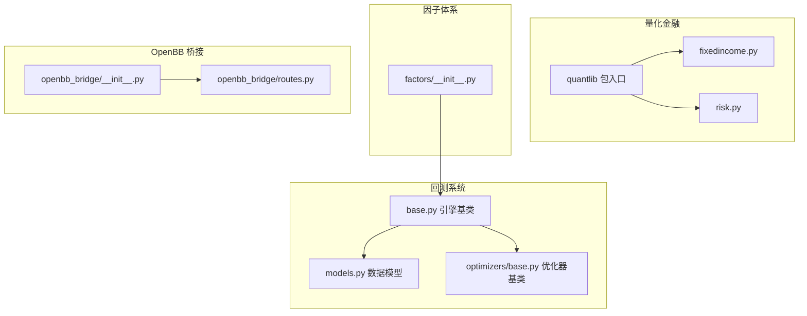
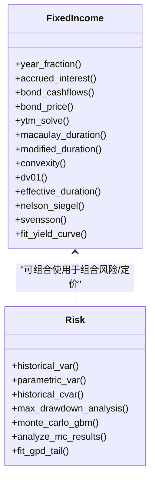
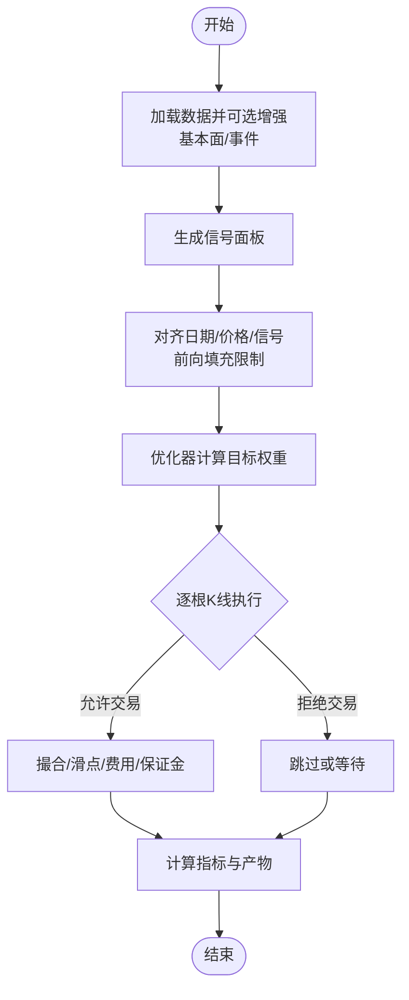
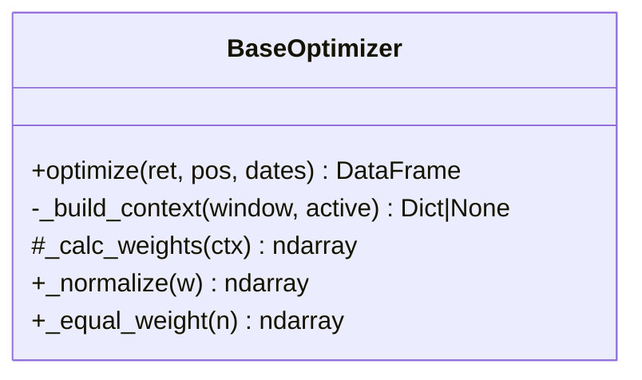
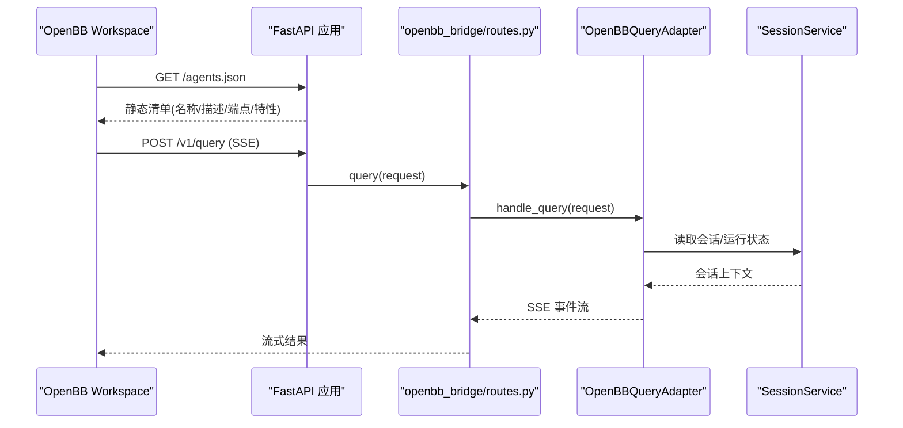
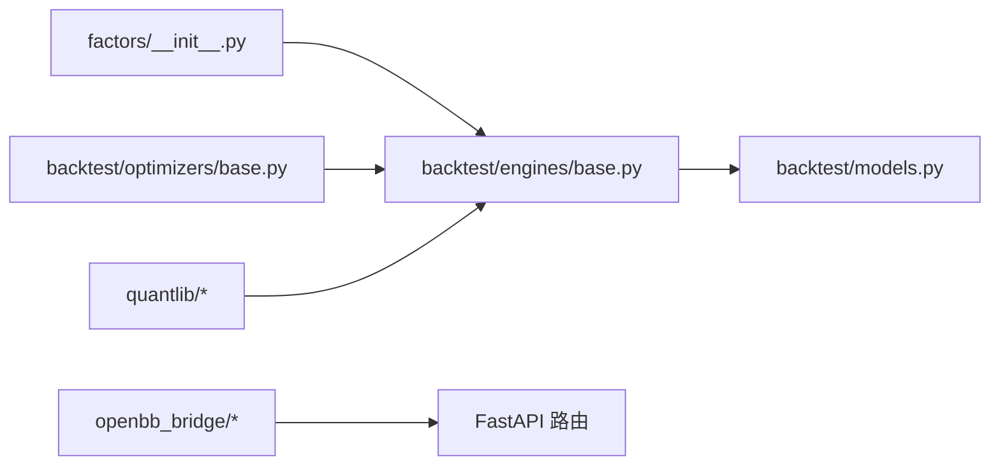

# 高级主题

<cite>
**本文引用的文件**
- [agent/src/quantlib/__init__.py](file://agent/src/quantlib/__init__.py)
- [agent/src/quantlib/fixedincome.py](file://agent/src/quantlib/fixedincome.py)
- [agent/src/quantlib/risk.py](file://agent/src/quantlib/risk.py)
- [agent/backtest/models.py](file://agent/backtest/models.py)
- [agent/backtest/engines/base.py](file://agent/backtest/engines/base.py)
- [agent/backtest/optimizers/base.py](file://agent/backtest/optimizers/base.py)
- [agent/src/openbb_bridge/__init__.py](file://agent/src/openbb_bridge/__init__.py)
- [agent/src/openbb_bridge/routes.py](file://agent/src/openbb_bridge/routes.py)
- [agent/src/factors/__init__.py](file://agent/src/factors/__init__.py)
- [README.md](file://README.md)
</cite>

## 目录
1. [引言](#引言)
2. [项目结构](#项目结构)
3. [核心组件](#核心组件)
4. [架构总览](#架构总览)
5. [详细组件分析](#详细组件分析)
6. [依赖关系分析](#依赖关系分析)
7. [性能考量](#性能考量)
8. [故障诊断指南](#故障诊断指南)
9. [结论](#结论)
10. [附录](#附录)

## 引言
本技术文档面向高级开发者与量化专家，聚焦以下高级主题：
- 量化金融数学库：期权定价、固定收益分析、风险管理等可复现、可审计的算法实现。
- 因子模型开发：因子构建、回测验证、组合优化与约束。
- OpenBB 桥接：数据源集成、API 适配与工作流整合。
- 性能优化：并行计算、内存管理、缓存策略与向量化。
- 扩展开发：自定义连接器、插件化架构与 API 扩展。
- 故障诊断与性能分析：定位问题、评估瓶颈与改进建议。
- 高级应用场景：复杂策略、大规模回测与实时分析。

## 项目结构
仓库采用模块化分层组织，关键路径包括：
- 量化金融数学（src/quantlib）：提供经过测试的金融数学原语，覆盖期权、固收、风险度量、曲线拟合等。
- 回测引擎（backtest）：统一的回测执行框架、数据对齐、优化器接入、指标与产物输出。
- 因子体系（src/factors）：Alpha Zoo 与算子集合，支持面板数据与时间序列操作。
- OpenBB 桥接（src/openbb_bridge）：将 Vibe-Trading 作为 OpenBB Workspace 自定义 Agent 暴露。
- 前端与 CLI：Web UI、CLI 命令与工具注册，便于研究与部署。



图表来源
- [agent/src/quantlib/__init__.py:1-38](file://agent/src/quantlib/__init__.py#L1-L38)
- [agent/src/quantlib/fixedincome.py:1-795](file://agent/src/quantlib/fixedincome.py#L1-L795)
- [agent/src/quantlib/risk.py:1-512](file://agent/src/quantlib/risk.py#L1-L512)
- [agent/backtest/engines/base.py:1-800](file://agent/backtest/engines/base.py#L1-L800)
- [agent/backtest/models.py:1-118](file://agent/backtest/models.py#L1-L118)
- [agent/backtest/optimizers/base.py:1-145](file://agent/backtest/optimizers/base.py#L1-L145)
- [agent/src/factors/__init__.py:1-49](file://agent/src/factors/__init__.py#L1-L49)
- [agent/src/openbb_bridge/__init__.py:1-58](file://agent/src/openbb_bridge/__init__.py#L1-L58)
- [agent/src/openbb_bridge/routes.py:1-162](file://agent/src/openbb_bridge/routes.py#L1-L162)

章节来源
- [agent/src/quantlib/__init__.py:1-38](file://agent/src/quantlib/__init__.py#L1-L38)
- [agent/backtest/engines/base.py:1-800](file://agent/backtest/engines/base.py#L1-L800)
- [agent/src/openbb_bridge/__init__.py:1-58](file://agent/src/openbb_bridge/__init__.py#L1-L58)
- [agent/src/factors/__init__.py:1-49](file://agent/src/factors/__init__.py#L1-L49)

## 核心组件
- 量化金融数学库（src/quantlib）
  - 固定收益：日计数、应计利息、债券现金流、YTM、久期/凸性/DV01、有效久期、Nelson-Siegel/Svensson 曲线拟合。
  - 风险管理：历史/参数 VaR、CVaR、最大回撤分析、蒙特卡洛 GBM、极值理论 GPD 尾部拟合。
  - 设计原则：输入严格校验、符号约定清晰（损失为正）、结果可解释且可审计。
- 回测引擎（backtest）
  - 统一执行循环：数据加载 → 信号生成 → 权重优化 → 逐根 K 线执行 → 指标与产物。
  - 数据对齐与防未来函数：按交易日历对齐、信号滞后一期、前向填充限制。
  - 市场规则抽象：涨跌停/保证金/滑点/手续费等通过子类实现。
- 因子体系（factors）
  - Alpha Zoo 与算子：时间序列与横截面算子（均值、标准差、相关性、排名、衰减等），面向面板数据高效计算。
- OpenBB 桥接（openbb_bridge）
  - 以非侵入方式将 Vibe-Trading 暴露为 OpenBB Workspace 自定义 Agent，提供发现清单与 SSE 查询流。

章节来源
- [agent/src/quantlib/fixedincome.py:1-795](file://agent/src/quantlib/fixedincome.py#L1-L795)
- [agent/src/quantlib/risk.py:1-512](file://agent/src/quantlib/risk.py#L1-L512)
- [agent/backtest/engines/base.py:1-800](file://agent/backtest/engines/base.py#L1-L800)
- [agent/src/factors/__init__.py:1-49](file://agent/src/factors/__init__.py#L1-L49)
- [agent/src/openbb_bridge/__init__.py:1-58](file://agent/src/openbb_bridge/__init__.py#L1-L58)
- [agent/src/openbb_bridge/routes.py:1-162](file://agent/src/openbb_bridge/routes.py#L1-L162)

## 架构总览
整体架构围绕“数据—因子—策略—回测—风控—对接”形成闭环：
- 数据层：多源加载与本地缓存，保证一致性与可重复性。
- 因子层：Alpha Zoo 算子与基本面事件增强，产出信号面板。
- 策略层：信号引擎与组合优化器，输出目标权重。
- 执行层：逐根 K 线模拟撮合，遵守市场规则与风控约束。
- 风控层：VaR/CVaR、回撤、压力情景与尾部建模。
- 对接层：REST/MCP/OpenBB 工作流集成，支撑研究与自动化。

```mermaid
sequenceDiagram
participant User as "用户/外部系统"
participant API as "FastAPI 路由"
participant Bridge as "OpenBB 适配器"
participant Engine as "回测引擎"
participant Opt as "组合优化器"
participant QL as "量化金融库"
participant Data as "数据加载器"
User->>API : POST /v1/query (SSE)
API->>Bridge : handle_query(request)
Bridge->>Engine : run_backtest(config, loader, signal_engine)
Engine->>Data : fetch(codes, start, end, interval)
Data-->>Engine : OHLCV + 可选基本面/事件
Engine->>Opt : optimize(ret, pos, dates)
Opt-->>Engine : 目标权重
Engine->>QL : 风险/定价/曲线(按需)
Engine-->>Bridge : 指标/证据/产物
Bridge-->>API : SSE 事件流
API-->>User : 流式结果
```

图表来源
- [agent/src/openbb_bridge/routes.py:1-162](file://agent/src/openbb_bridge/routes.py#L1-L162)
- [agent/backtest/engines/base.py:1-800](file://agent/backtest/engines/base.py#L1-L800)
- [agent/backtest/optimizers/base.py:1-145](file://agent/backtest/optimizers/base.py#L1-L145)
- [agent/src/quantlib/fixedincome.py:1-795](file://agent/src/quantlib/fixedincome.py#L1-L795)
- [agent/src/quantlib/risk.py:1-512](file://agent/src/quantlib/risk.py#L1-L512)

## 详细组件分析

### 量化金融数学库（固定收益与风险管理）
- 固定收益模块
  - 日计数与应计利息：支持 ACT/365F、ACT/360、ACT/ACT、30/360、30E/360；应计利息基于票息频率与结算日。
  - 定价与收益率：子弹债现金流、折现因子、YTM 求解（区间二分）。
  - 风险敏感度：麦考利久期、修正久期、凸性、DV01、有效久期（含嵌入式期权场景）。
  - 曲线拟合：Nelson-Siegel 与 Svensson，网格搜索 + Nelder-Mead 精调，返回可调用 CurveFit。
- 风险管理模块
  - VaR/CVaR：历史分位数与正态假设两种方法，统一损失为正号约定。
  - 回撤分析：峰值到谷值、恢复日期与水下天数。
  - 蒙特卡洛：GBM 路径模拟与终端分布统计。
  - 极值理论：GPD 尾部拟合，形状参数显著性判定尾部分布类型。



图表来源
- [agent/src/quantlib/fixedincome.py:1-795](file://agent/src/quantlib/fixedincome.py#L1-L795)
- [agent/src/quantlib/risk.py:1-512](file://agent/src/quantlib/risk.py#L1-L512)

章节来源
- [agent/src/quantlib/fixedincome.py:1-795](file://agent/src/quantlib/fixedincome.py#L1-L795)
- [agent/src/quantlib/risk.py:1-512](file://agent/src/quantlib/risk.py#L1-L512)

### 回测引擎与数据模型
- 数据模型
  - Position/FillRecord/TradeRecord/EquitySnapshot：不可变记录，确保可追溯与一致性。
- 引擎基类
  - 统一执行流程：数据加载 → 信号生成 → 权重优化 → 逐根 K 线执行 → 指标与产物。
  - 数据对齐：跨标的统一交易日索引、前向填充限制、信号滞后一期避免未来函数。
  - 市场规则抽象：涨跌停带、滑点、手续费、保证金、强平逻辑由子类实现。
  - 基准与指标：外置基准接入、换手率、收益/风险指标与明细统计。



图表来源
- [agent/backtest/engines/base.py:1-800](file://agent/backtest/engines/base.py#L1-L800)
- [agent/backtest/models.py:1-118](file://agent/backtest/models.py#L1-L118)

章节来源
- [agent/backtest/engines/base.py:1-800](file://agent/backtest/engines/base.py#L1-L800)
- [agent/backtest/models.py:1-118](file://agent/backtest/models.py#L1-L118)

### 组合优化器基类
- 职责
  - 滚动协方差窗口与上下文构建。
  - 信号符号保持与权重归一化。
  - 对空窗/缺失数据的稳健处理。
- 扩展点
  - 子类实现 _calc_weights 以注入不同策略（均值方差、风险平价、最大分散化等）。



图表来源
- [agent/backtest/optimizers/base.py:1-145](file://agent/backtest/optimizers/base.py#L1-L145)

章节来源
- [agent/backtest/optimizers/base.py:1-145](file://agent/backtest/optimizers/base.py#L1-L145)

### 因子体系与回测验证
- 因子构建
  - 提供丰富的时间序列与横截面算子，支持面板数据高效计算。
  - 可与基本面/事件增强结合，提升信号质量。
- 回测验证
  - 通过统一引擎进行 IS/OOS 验证、严格随机控制与幸存者偏差披露。
  - 指标包含换手率、跟踪误差、超额收益与风险度量。

章节来源
- [agent/src/factors/__init__.py:1-49](file://agent/src/factors/__init__.py#L1-L49)
- [agent/backtest/engines/base.py:1-800](file://agent/backtest/engines/base.py#L1-L800)

### OpenBB 桥接功能
- 能力
  - 暴露 /agents.json 与 /v1/query（SSE）两个端点，遵循 OpenBB Workspace 自定义 Agent 契约。
  - 通过适配器复用会话服务，将研究/回测/工具链串联至工作流。
- 安装与启用
  - 可选 extra 安装，失败时降级不阻断主服务。
- 安全与鉴权
  - 查询端点继承宿主应用的 require_auth，保障访问控制。



图表来源
- [agent/src/openbb_bridge/__init__.py:1-58](file://agent/src/openbb_bridge/__init__.py#L1-L58)
- [agent/src/openbb_bridge/routes.py:1-162](file://agent/src/openbb_bridge/routes.py#L1-L162)

章节来源
- [agent/src/openbb_bridge/__init__.py:1-58](file://agent/src/openbb_bridge/__init__.py#L1-L58)
- [agent/src/openbb_bridge/routes.py:1-162](file://agent/src/openbb_bridge/routes.py#L1-L162)

## 依赖关系分析
- 量化金融库与回测引擎解耦：引擎在需要时调用风险/定价/曲线拟合函数，避免强耦合。
- 优化器与引擎通过接口协作：引擎负责数据与上下文，优化器专注权重计算。
- OpenBB 桥接通过 FastAPI 路由挂载，依赖宿主应用的生命周期与鉴权。
- 因子体系通过算子与面板数据接口与引擎集成，支持灵活组合。



图表来源
- [agent/src/factors/__init__.py:1-49](file://agent/src/factors/__init__.py#L1-L49)
- [agent/backtest/engines/base.py:1-800](file://agent/backtest/engines/base.py#L1-L800)
- [agent/backtest/optimizers/base.py:1-145](file://agent/backtest/optimizers/base.py#L1-L145)
- [agent/src/openbb_bridge/routes.py:1-162](file://agent/src/openbb_bridge/routes.py#L1-L162)
- [agent/backtest/models.py:1-118](file://agent/backtest/models.py#L1-L118)

章节来源
- [agent/backtest/engines/base.py:1-800](file://agent/backtest/engines/base.py#L1-L800)
- [agent/src/openbb_bridge/routes.py:1-162](file://agent/src/openbb_bridge/routes.py#L1-L162)

## 性能考量
- 向量化与内存
  - 回测中对收盘价矩阵与信号矩阵采用 NumPy/Pandas 向量化前向填充与索引映射，减少 Python 循环开销。
  - 数据对齐使用 searchsorted 与 int64 视图，提高查找效率。
- 并行与缓存
  - 数据加载支持本地缓存开关，避免重复网络请求与速率限制。
  - 批量下载与连接型加载在命中缓存时跳过网络与连接建立。
- 优化器与指标
  - 优化器仅对活跃资产计算协方差，空窗/缺失数据直接跳过，降低无效计算。
  - 指标计算基于已执行的成交记录，避免重复推导。
- 建议
  - 对大规模回测优先启用本地缓存与严格的数据完整性检查。
  - 合理设置前向填充限制，避免长停牌掩盖真实波动。
  - 对极端尾部风险使用 GPD 与蒙特卡洛，但需控制样本量与步数以平衡精度与耗时。

章节来源
- [agent/backtest/engines/base.py:1-800](file://agent/backtest/engines/base.py#L1-L800)
- [agent/backtest/optimizers/base.py:1-145](file://agent/backtest/optimizers/base.py#L1-L145)
- [agent/src/quantlib/risk.py:1-512](file://agent/src/quantlib/risk.py#L1-L512)

## 故障诊断指南
- 常见问题定位
  - 无数据/信号为空：检查数据范围、标的有效性、信号返回类型与对齐逻辑。
  - 未来函数嫌疑：确认信号是否滞后一期、前向填充是否过度。
  - 优化器失效：检查协方差矩阵是否存在 NaN、活跃资产数量是否足够。
  - 风险指标异常：确认输入为有限数值、权益曲线严格为正（回撤分析）。
- 调试步骤
  - 查看 artifacts/metrics.csv、equity.csv、trades.csv 与 rebalance_notes。
  - 逐步打印数据对齐后的 close/pos/ret 矩阵，确认维度与缺失值。
  - 对优化器输出进行归一化与边界检查，确保权重和为 1 且符号正确。
- 参考技能
  - 使用 backtest-diagnose 技能进行系统化诊断与修复。

章节来源
- [agent/backtest/engines/base.py:1-800](file://agent/backtest/engines/base.py#L1-L800)
- [agent/backtest/models.py:1-118](file://agent/backtest/models.py#L1-L118)
- [agent/backtest/optimizers/base.py:1-145](file://agent/backtest/optimizers/base.py#L1-L145)

## 结论
本仓库提供了从因子研发到回测执行、风险控制与外部集成的完整链路。量化金融数学库确保了算法的可复现与可审计；回测引擎与优化器实现了稳健的执行与权重分配；OpenBB 桥接打通了工作流与生态。通过严格的输入校验、向量化与缓存策略，系统在准确性与性能之间取得平衡。建议在实战中结合业务需求选择合适的因子、优化器与风控手段，并利用诊断工具持续迭代策略。

## 附录
- 版本与更新
  - 项目持续演进，新增 Options Lab、回测 tearsheet、更多数据源与连接器、桌面 Electron 壳等。
  - 关注 README 中的发布说明与变更日志，了解最新能力与修复。

章节来源
- [README.md:1-166](file://README.md#L1-L166)