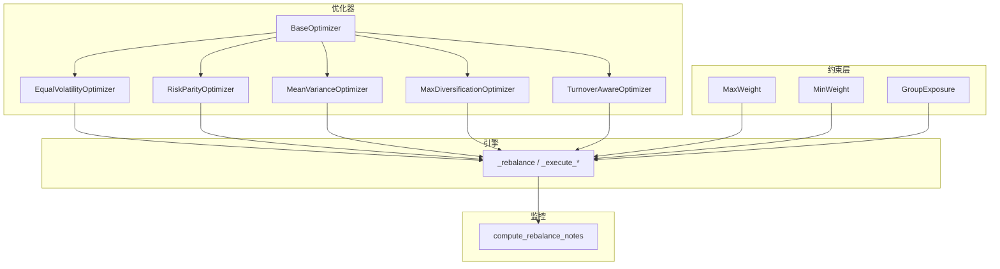
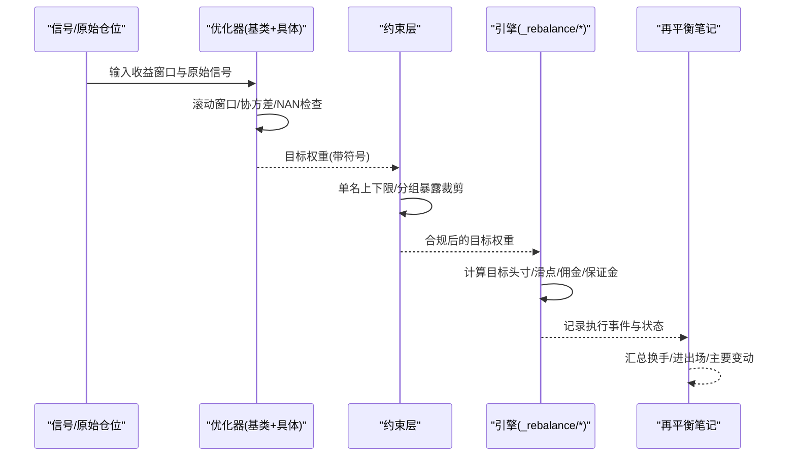
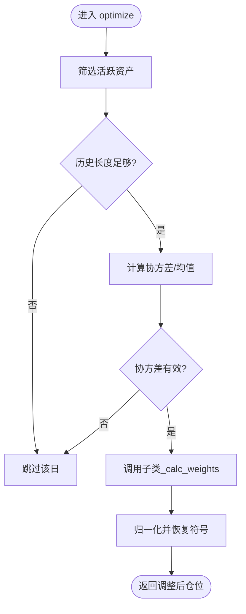
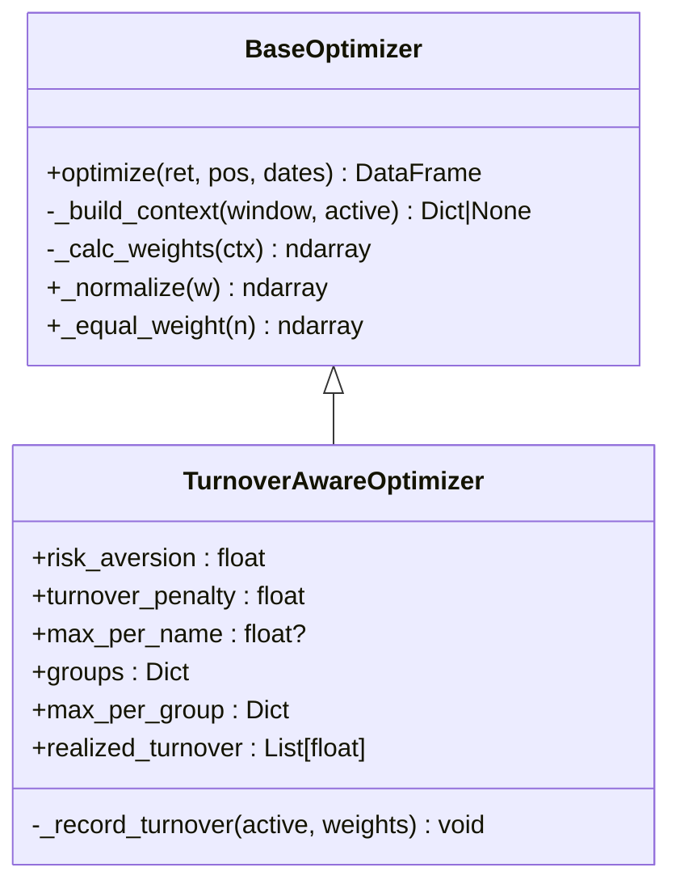
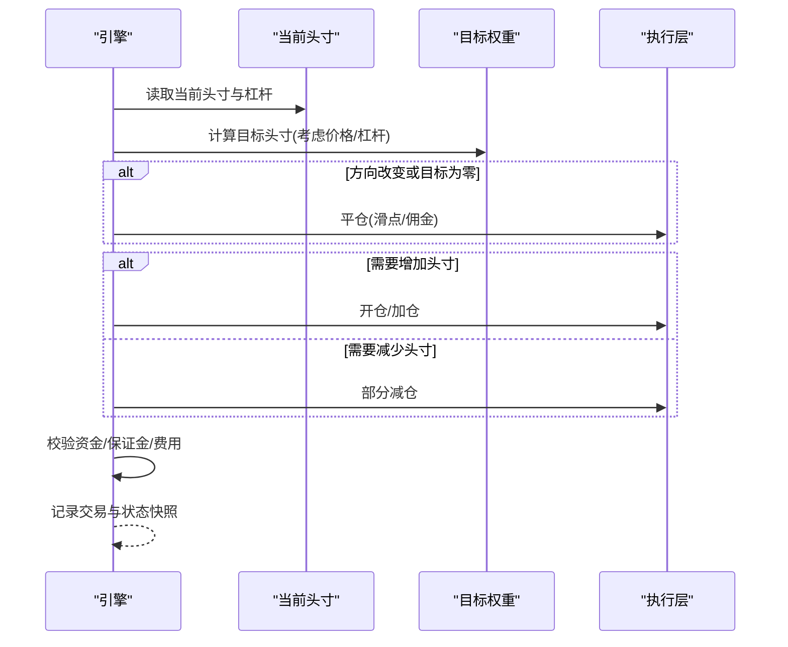
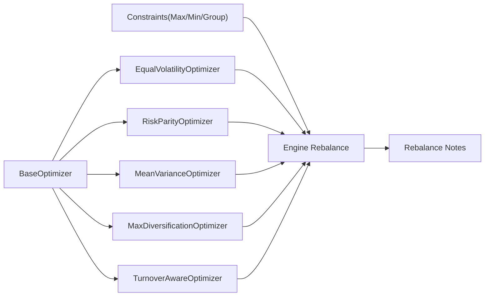

# 仓位管理系统

<cite>
**本文引用的文件**
- [agent/backtest/optimizers/__init__.py](file://agent/backtest/optimizers/__init__.py)
- [agent/backtest/optimizers/base.py](file://agent/backtest/optimizers/base.py)
- [agent/backtest/optimizers/equal_volatility.py](file://agent/backtest/optimizers/equal_volatility.py)
- [agent/backtest/optimizers/risk_parity.py](file://agent/backtest/optimizers/risk_parity.py)
- [agent/backtest/optimizers/mean_variance.py](file://agent/backtest/optimizers/mean_variance.py)
- [agent/backtest/optimizers/max_diversification.py](file://agent/backtest/optimizers/max_diversification.py)
- [agent/backtest/optimizers/turnover_aware.py](file://agent/backtest/optimizers/turnover_aware.py)
- [agent/backtest/constraints.py](file://agent/backtest/constraints.py)
- [agent/backtest/rebalance_notes.py](file://agent/backtest/rebalance_notes.py)
- [agent/backtest/engines/base.py](file://agent/backtest/engines/base.py)
- [agent/src/skills/asset-allocation/SKILL.md](file://agent/src/skills/asset-allocation/SKILL.md)
</cite>

## 目录
1. [简介](#简介)
2. [项目结构](#项目结构)
3. [核心组件](#核心组件)
4. [架构总览](#架构总览)
5. [详细组件分析](#详细组件分析)
6. [依赖关系分析](#依赖关系分析)
7. [性能考量](#性能考量)
8. [故障排查指南](#故障排查指南)
9. [结论](#结论)
10. [附录](#附录)

## 简介
本文件系统化梳理仓库中的“仓位管理系统”，覆盖仓位计算方法（固定比例、波动率调整等）、投资组合优化算法（均值方差、风险平价、最大分散化，以及含交易成本的调仓感知优化）、仓位调整机制（再平衡频率、阈值控制、成本考虑）、风险管理（单名上限、行业集中度、相关性管理）与监控异常处理。文档以代码级实现为依据，提供流程图、时序图与类图，帮助读者从原理到落地全面理解。

## 项目结构
仓位管理相关能力集中在回测模块的优化器与约束层，以及引擎层的仓位调整逻辑：
- 优化器族：统一基类 + 多种权重计算策略（等波动率、风险平价、均值方差、最大分散化、调仓感知）。
- 约束层：在任意优化器输出之上施加组合约束（单名上下限、分组暴露上限），保持符号与零位不变。
- 引擎层：将目标权重转换为实际头寸，执行开平仓、部分减仓、费用与滑点处理，并保证原子性。
- 监控与报告：按再平衡日统计换手、进出场与主要变动，便于审计与异常定位。

图表来源
- [agent/backtest/optimizers/base.py:14-145](file://agent/backtest/optimizers/base.py#L14-L145)
- [agent/backtest/optimizers/equal_volatility.py:14-48](file://agent/backtest/optimizers/equal_volatility.py#L14-L48)
- [agent/backtest/optimizers/risk_parity.py:11-60](file://agent/backtest/optimizers/risk_parity.py#L11-L60)
- [agent/backtest/optimizers/mean_variance.py:11-70](file://agent/backtest/optimizers/mean_variance.py#L11-L70)
- [agent/backtest/optimizers/max_diversification.py:15-59](file://agent/backtest/optimizers/max_diversification.py#L15-L59)
- [agent/backtest/optimizers/turnover_aware.py:38-251](file://agent/backtest/optimizers/turnover_aware.py#L38-L251)
- [agent/backtest/constraints.py:48-130](file://agent/backtest/constraints.py#L48-L130)
- [agent/backtest/engines/base.py:1149-1452](file://agent/backtest/engines/base.py#L1149-L1452)
- [agent/backtest/rebalance_notes.py:25-159](file://agent/backtest/rebalance_notes.py#L25-L159)

章节来源
- [agent/backtest/optimizers/__init__.py:1-13](file://agent/backtest/optimizers/__init__.py#L1-L13)
- [agent/backtest/optimizers/base.py:14-145](file://agent/backtest/optimizers/base.py#L14-L145)
- [agent/backtest/constraints.py:1-206](file://agent/backtest/constraints.py#L1-L206)
- [agent/backtest/rebalance_notes.py:1-159](file://agent/backtest/rebalance_notes.py#L1-L159)
- [agent/backtest/engines/base.py:1149-1452](file://agent/backtest/engines/base.py#L1149-L1452)
- [agent/src/skills/asset-allocation/SKILL.md:1-318](file://agent/src/skills/asset-allocation/SKILL.md#L1-L318)

## 核心组件
- 优化器基类：负责滚动窗口切片、协方差矩阵构建、NaN 检查、权重归一化与符号保留；子类仅实现权重计算。
- 等波动率优化器：基于滚动标准差进行反波动率加权，无需协方差矩阵。
- 风险平价优化器：在长端单纯形上求解等边际风险贡献权重。
- 均值方差优化器：最大化夏普比率（SLSQP），支持无杠杆长端约束。
- 最大分散化优化器：最大化分散化比率，偏好低相关资产。
- 调仓感知优化器：在均值方差效用中加入 L1 换手惩罚，内置单名与分组上限，记录已实现换手。
- 约束层：对任意优化器输出逐行应用单名上限/下限、分组暴露上限，保持符号与零位。
- 引擎调整：将目标权重转为实际头寸，处理开仓、减仓、滑点、佣金、保证金与资金校验，失败时原子回滚。
- 再平衡笔记：按日期汇总换手、进出场与主要变动，生成可审计的报告。

章节来源
- [agent/backtest/optimizers/base.py:14-145](file://agent/backtest/optimizers/base.py#L14-L145)
- [agent/backtest/optimizers/equal_volatility.py:14-48](file://agent/backtest/optimizers/equal_volatility.py#L14-L48)
- [agent/backtest/optimizers/risk_parity.py:11-60](file://agent/backtest/optimizers/risk_parity.py#L11-L60)
- [agent/backtest/optimizers/mean_variance.py:11-70](file://agent/backtest/optimizers/mean_variance.py#L11-L70)
- [agent/backtest/optimizers/max_diversification.py:15-59](file://agent/backtest/optimizers/max_diversification.py#L15-L59)
- [agent/backtest/optimizers/turnover_aware.py:38-251](file://agent/backtest/optimizers/turnover_aware.py#L38-L251)
- [agent/backtest/constraints.py:48-130](file://agent/backtest/constraints.py#L48-L130)
- [agent/backtest/engines/base.py:1149-1452](file://agent/backtest/engines/base.py#L1149-L1452)
- [agent/backtest/rebalance_notes.py:25-159](file://agent/backtest/rebalance_notes.py#L25-L159)

## 架构总览
下图展示从信号到最终头寸的端到端流程：优化器产出目标权重，约束层做合规裁剪，引擎层执行交易并记录事件，最后由再平衡笔记汇总。

图表来源
- [agent/backtest/optimizers/base.py:36-85](file://agent/backtest/optimizers/base.py#L36-L85)
- [agent/backtest/constraints.py:180-206](file://agent/backtest/constraints.py#L180-L206)
- [agent/backtest/engines/base.py:1149-1452](file://agent/backtest/engines/base.py#L1149-L1452)
- [agent/backtest/rebalance_notes.py:25-159](file://agent/backtest/rebalance_notes.py#L25-L159)

## 详细组件分析

### 优化器基类与通用流程
- 作用：封装公共预处理（活跃资产选择、因果滚动窗口、协方差矩阵与 NaN 检查）、权重归一化与符号保留。
- 关键行为：对每个决策日，仅使用严格早于该日的历史数据估计统计量，避免未来信息泄露；若数据不足或协方差非法则跳过。

图表来源
- [agent/backtest/optimizers/base.py:36-85](file://agent/backtest/optimizers/base.py#L36-L85)
- [agent/backtest/optimizers/base.py:91-145](file://agent/backtest/optimizers/base.py#L91-L145)

章节来源
- [agent/backtest/optimizers/base.py:14-145](file://agent/backtest/optimizers/base.py#L14-L145)

### 等波动率（反波动率）权重
- 思想：波动率越低的资产分配更高权重，使各资产对组合波动贡献近似相等。
- 实现要点：滚动标准差作为波动率代理；若存在缺失或接近零波动则跳过当日。

章节来源
- [agent/backtest/optimizers/equal_volatility.py:14-48](file://agent/backtest/optimizers/equal_volatility.py#L14-L48)

### 风险平价（等风险贡献）
- 思想：在长端单纯形上求解权重，使各资产的边际风险贡献相等。
- 实现要点：以协方差矩阵为基础，构造贡献误差函数并用 SLSQP 求解；若协方差非法或波动率为零则回退到等权。

章节来源
- [agent/backtest/optimizers/risk_parity.py:11-60](file://agent/backtest/optimizers/risk_parity.py#L11-L60)

### 均值方差（最大化夏普）
- 思想：在长端单纯形约束下最大化夏普比率。
- 实现要点：估计均值与协方差，定义负夏普为目标函数，SLSQP 求解；失败时回退等权。

章节来源
- [agent/backtest/optimizers/mean_variance.py:11-70](file://agent/backtest/optimizers/mean_variance.py#L11-L70)

### 最大分散化
- 思想：最大化分散化比率 DR = (w'σ)/√(w'Σw)，偏好低相关资产。
- 实现要点：以协方差对角线为资产波动率向量，SLSQP 最小化负 DR；失败回退等权。

章节来源
- [agent/backtest/optimizers/max_diversification.py:15-59](file://agent/backtest/optimizers/max_diversification.py#L15-L59)

### 调仓感知优化器（含交易成本与约束）
- 思想：在均值方差效用中加入 L1 换手惩罚项，抑制频繁调仓；同时支持单名上限与分组暴露上限。
- 实现要点：
  - 目标函数：-w'μ + λ·w'Σw + γ·||w - w_prev||₁。
  - 约束：非负、和为一、可选的单名上限与分组上限。
  - 初始点选择：若上一期权重可行则复用，否则按容量分配构造可行初值。
  - 结果校验：确保满足所有约束，否则抛出异常。
  - 换手记录：累计每期的已实现换手 0.5·||w_t - w_{t-1}||₁。

图表来源
- [agent/backtest/optimizers/base.py:14-145](file://agent/backtest/optimizers/base.py#L14-L145)
- [agent/backtest/optimizers/turnover_aware.py:38-251](file://agent/backtest/optimizers/turnover_aware.py#L38-L251)

章节来源
- [agent/backtest/optimizers/turnover_aware.py:38-251](file://agent/backtest/optimizers/turnover_aware.py#L38-L251)

### 约束层（单名上下限、分组暴露）
- 功能：在任意优化器输出之上，逐行应用约束，保持符号与零位不变。
- 类型：
  - MaxWeight：单名上限，超出的权重按比例再分配给未达上限的资产。
  - MinWeight：单名下限，低于下限的资产提升至下限，资金来自高于下限的资产按比例削减。
  - GroupExposure：按组映射限制组内总权重，超限按比例缩放。
- 适用：适用于任何优化器输出的带符号权重矩阵。

章节来源
- [agent/backtest/constraints.py:48-130](file://agent/backtest/constraints.py#L48-L130)
- [agent/backtest/constraints.py:180-206](file://agent/backtest/constraints.py#L180-L206)

### 引擎层仓位调整（再平衡执行）
- 职责：根据目标权重计算目标头寸，处理方向切换、部分减仓、开仓、滑点、佣金、保证金与资金校验；失败时原子回滚。
- 关键点：
  - 目标方向为零或方向改变时先平仓。
  - 同向增减合并为一次执行，减少摩擦成本。
  - 预估资本变化后校验，不足则拒绝整批调整。
  - 记录每次调整的 before/after、执行价、费用与原因。

图表来源
- [agent/backtest/engines/base.py:1149-1452](file://agent/backtest/engines/base.py#L1149-L1452)

章节来源
- [agent/backtest/engines/base.py:1149-1452](file://agent/backtest/engines/base.py#L1149-L1452)

### 再平衡监控与报告
- 功能：按再平衡日汇总换手、进出场与主要变动，输出 JSON 与 Markdown 报告。
- 指标：换手总量/均值/最大值、最大再平衡日、Top N 变动明细。
- 用途：定位信号与优化器导致的“源头换手”，与执行层换手对比，评估调仓效率与成本。

章节来源
- [agent/backtest/rebalance_notes.py:25-159](file://agent/backtest/rebalance_notes.py#L25-L159)

### 资产配置理论与实践指引
- 内容：涵盖 MPT、Black-Litterman、风险预算、全天候策略，以及五种内置优化器的参数建议与选择树。
- 再平衡策略：周期触发、阈值触发、波动率触发；不同资产类别的频率与阈值建议。
- 相关性分析：跨资产相关性与配置启示。

章节来源
- [agent/src/skills/asset-allocation/SKILL.md:1-318](file://agent/src/skills/asset-allocation/SKILL.md#L1-L318)

## 依赖关系分析
- 优化器之间通过基类解耦，新增策略只需实现权重计算接口。
- 约束层独立于优化器，可在任意策略输出后叠加。
- 引擎层不关心权重如何产生，只消费目标权重并执行交易。
- 监控层消费目标权重序列，用于审计与异常诊断。

图表来源
- [agent/backtest/optimizers/base.py:14-145](file://agent/backtest/optimizers/base.py#L14-L145)
- [agent/backtest/constraints.py:180-206](file://agent/backtest/constraints.py#L180-L206)
- [agent/backtest/engines/base.py:1149-1452](file://agent/backtest/engines/base.py#L1149-L1452)
- [agent/backtest/rebalance_notes.py:25-159](file://agent/backtest/rebalance_notes.py#L25-L159)

章节来源
- [agent/backtest/optimizers/__init__.py:1-13](file://agent/backtest/optimizers/__init__.py#L1-L13)
- [agent/backtest/optimizers/base.py:14-145](file://agent/backtest/optimizers/base.py#L14-L145)
- [agent/backtest/constraints.py:1-206](file://agent/backtest/constraints.py#L1-L206)
- [agent/backtest/engines/base.py:1149-1452](file://agent/backtest/engines/base.py#L1149-L1452)
- [agent/backtest/rebalance_notes.py:1-159](file://agent/backtest/rebalance_notes.py#L1-L159)

## 性能考量
- 滚动窗口与协方差估计：过短易噪声，过长反应慢；默认 60 天为合理折中。
- 优化器复杂度：SLSQP 求解在资产数较大时开销上升；可通过约束降维或预热初值改善收敛。
- 调仓感知优化器：换手惩罚需与数据频率匹配；日频下较小的 gamma 即可显著抑制调仓。
- 约束层：分组上限可能导致不可行问题，需在初始化阶段检查容量可行性。
- 引擎执行：合并同向增减、设置滑点与佣金模型，避免过度交易损耗。

[本节为通用指导，不直接分析具体文件]

## 故障排查指南
- 优化失败或权重非法：
  - 检查协方差矩阵是否包含 NaN/Inf，或波动率过低导致数值不稳定。
  - 对于调仓感知优化器，确认单名与分组上限是否导致不可行；必要时放宽约束或调整初值。
- 执行失败：
  - 价格无效（非正/无穷/NaN）会被拒绝；检查数据源与强制填充逻辑。
  - 资金不足会触发原子回滚；检查预估资本与费用模型。
  - 杠杆变更在同向调整中被拒绝；确保杠杆一致。
- 监控异常：
  - 再平衡笔记显示高换手但执行层未成交：检查执行条件（涨跌停、流动性、订单路由）。
  - 组合风险突破：结合 VaR/CVaR、压力测试与相关性漂移进行复核。

章节来源
- [agent/backtest/optimizers/base.py:64-85](file://agent/backtest/optimizers/base.py#L64-L85)
- [agent/backtest/optimizers/turnover_aware.py:168-224](file://agent/backtest/optimizers/turnover_aware.py#L168-L224)
- [agent/backtest/engines/base.py:1149-1452](file://agent/backtest/engines/base.py#L1149-L1452)
- [agent/backtest/rebalance_notes.py:25-159](file://agent/backtest/rebalance_notes.py#L25-L159)

## 结论
本系统以模块化方式实现了从仓位计算、组合优化、合规约束到执行与监控的完整链路。通过多种优化器与约束层组合，可灵活适配不同市场与风格；引擎层保障执行的稳健性与可追溯性；再平衡笔记提供清晰的审计视角。实践中应结合数据质量、交易成本与风险预算，选择合适的优化器与再平衡策略，并通过监控持续校准。

[本节为总结，不直接分析具体文件]

## 附录
- 常用配置参考：在 asset-allocation 技能文档中提供了五种优化器的配置示例与选择建议，可直接写入配置文件。
- 再平衡策略：周期/阈值/波动率触发，不同资产类别的频率与阈值建议见技能文档。
- 风险管理与相关性：结合风险平价与相关性矩阵，控制行业与单名集中度，提升组合稳健性。

章节来源
- [agent/src/skills/asset-allocation/SKILL.md:90-222](file://agent/src/skills/asset-allocation/SKILL.md#L90-L222)
- [agent/src/skills/asset-allocation/SKILL.md:224-318](file://agent/src/skills/asset-allocation/SKILL.md#L224-L318)